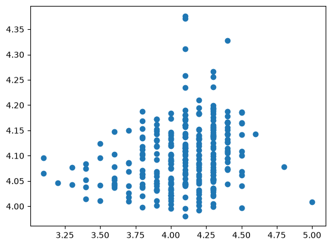

```python
import pandas as pd
import matplotlib.pyplot as plt
import seaborn as sns
import numpy as np
```


```python
df=pd.read_csv('amazon.csv')
```


```python
df.head()
```


<div>
<style scoped>
    .dataframe tbody tr th:only-of-type {
        vertical-align: middle;
    }

    .dataframe tbody tr th {
        vertical-align: top;
    }

    .dataframe thead th {
        text-align: right;
    }
</style>
<table border="1" class="dataframe">
  <thead>
    <tr style="text-align: right;">
      <th></th>
      <th>product_id</th>
      <th>product_name</th>
      <th>category</th>
      <th>discounted_price</th>
      <th>actual_price</th>
      <th>discount_percentage</th>
      <th>rating</th>
      <th>rating_count</th>
      <th>about_product</th>
      <th>user_id</th>
      <th>user_name</th>
      <th>review_id</th>
      <th>review_title</th>
      <th>review_content</th>
      <th>img_link</th>
      <th>product_link</th>
    </tr>
  </thead>
  <tbody>
    <tr>
      <th>0</th>
      <td>B07JW9H4J1</td>
      <td>Wayona Nylon Braided USB to Lightning Fast Cha...</td>
      <td>Computers&amp;Accessories|Accessories&amp;Peripherals|...</td>
      <td>₹399</td>
      <td>₹1,099</td>
      <td>64%</td>
      <td>4.2</td>
      <td>24,269</td>
      <td>High Compatibility : Compatible With iPhone 12...</td>
      <td>AG3D6O4STAQKAY2UVGEUV46KN35Q,AHMY5CWJMMK5BJRBB...</td>
      <td>Manav,Adarsh gupta,Sundeep,S.Sayeed Ahmed,jasp...</td>
      <td>R3HXWT0LRP0NMF,R2AJM3LFTLZHFO,R6AQJGUP6P86,R1K...</td>
      <td>Satisfied,Charging is really fast,Value for mo...</td>
      <td>Looks durable Charging is fine tooNo complains...</td>
      <td>https://m.media-amazon.com/images/W/WEBP_40237...</td>
      <td>https://www.amazon.in/Wayona-Braided-WN3LG1-Sy...</td>
    </tr>
    <tr>
      <th>1</th>
      <td>B098NS6PVG</td>
      <td>Ambrane Unbreakable 60W / 3A Fast Charging 1.5...</td>
      <td>Computers&amp;Accessories|Accessories&amp;Peripherals|...</td>
      <td>₹199</td>
      <td>₹349</td>
      <td>43%</td>
      <td>4.0</td>
      <td>43,994</td>
      <td>Compatible with all Type C enabled devices, be...</td>
      <td>AECPFYFQVRUWC3KGNLJIOREFP5LQ,AGYYVPDD7YG7FYNBX...</td>
      <td>ArdKn,Nirbhay kumar,Sagar Viswanathan,Asp,Plac...</td>
      <td>RGIQEG07R9HS2,R1SMWZQ86XIN8U,R2J3Y1WL29GWDE,RY...</td>
      <td>A Good Braided Cable for Your Type C Device,Go...</td>
      <td>I ordered this cable to connect my phone to An...</td>
      <td>https://m.media-amazon.com/images/W/WEBP_40237...</td>
      <td>https://www.amazon.in/Ambrane-Unbreakable-Char...</td>
    </tr>
    <tr>
      <th>2</th>
      <td>B096MSW6CT</td>
      <td>Sounce Fast Phone Charging Cable &amp; Data Sync U...</td>
      <td>Computers&amp;Accessories|Accessories&amp;Peripherals|...</td>
      <td>₹199</td>
      <td>₹1,899</td>
      <td>90%</td>
      <td>3.9</td>
      <td>7,928</td>
      <td>【 Fast Charger&amp; Data Sync】-With built-in safet...</td>
      <td>AGU3BBQ2V2DDAMOAKGFAWDDQ6QHA,AESFLDV2PT363T2AQ...</td>
      <td>Kunal,Himanshu,viswanath,sai niharka,saqib mal...</td>
      <td>R3J3EQQ9TZI5ZJ,R3E7WBGK7ID0KV,RWU79XKQ6I1QF,R2...</td>
      <td>Good speed for earlier versions,Good Product,W...</td>
      <td>Not quite durable and sturdy,https://m.media-a...</td>
      <td>https://m.media-amazon.com/images/W/WEBP_40237...</td>
      <td>https://www.amazon.in/Sounce-iPhone-Charging-C...</td>
    </tr>
    <tr>
      <th>3</th>
      <td>B08HDJ86NZ</td>
      <td>boAt Deuce USB 300 2 in 1 Type-C &amp; Micro USB S...</td>
      <td>Computers&amp;Accessories|Accessories&amp;Peripherals|...</td>
      <td>₹329</td>
      <td>₹699</td>
      <td>53%</td>
      <td>4.2</td>
      <td>94,363</td>
      <td>The boAt Deuce USB 300 2 in 1 cable is compati...</td>
      <td>AEWAZDZZJLQUYVOVGBEUKSLXHQ5A,AG5HTSFRRE6NL3M5S...</td>
      <td>Omkar dhale,JD,HEMALATHA,Ajwadh a.,amar singh ...</td>
      <td>R3EEUZKKK9J36I,R3HJVYCLYOY554,REDECAZ7AMPQC,R1...</td>
      <td>Good product,Good one,Nice,Really nice product...</td>
      <td>Good product,long wire,Charges good,Nice,I bou...</td>
      <td>https://m.media-amazon.com/images/I/41V5FtEWPk...</td>
      <td>https://www.amazon.in/Deuce-300-Resistant-Tang...</td>
    </tr>
    <tr>
      <th>4</th>
      <td>B08CF3B7N1</td>
      <td>Portronics Konnect L 1.2M Fast Charging 3A 8 P...</td>
      <td>Computers&amp;Accessories|Accessories&amp;Peripherals|...</td>
      <td>₹154</td>
      <td>₹399</td>
      <td>61%</td>
      <td>4.2</td>
      <td>16,905</td>
      <td>[CHARGE &amp; SYNC FUNCTION]- This cable comes wit...</td>
      <td>AE3Q6KSUK5P75D5HFYHCRAOLODSA,AFUGIFH5ZAFXRDSZH...</td>
      <td>rahuls6099,Swasat Borah,Ajay Wadke,Pranali,RVK...</td>
      <td>R1BP4L2HH9TFUP,R16PVJEXKV6QZS,R2UPDB81N66T4P,R...</td>
      <td>As good as original,Decent,Good one for second...</td>
      <td>Bought this instead of original apple, does th...</td>
      <td>https://m.media-amazon.com/images/W/WEBP_40237...</td>
      <td>https://www.amazon.in/Portronics-Konnect-POR-1...</td>
    </tr>
  </tbody>
</table>
</div>


```python
df.columns
```


    Index(['product_id', 'product_name', 'category', 'discounted_price',
           'actual_price', 'discount_percentage', 'rating', 'rating_count',
           'about_product', 'user_id', 'user_name', 'review_id', 'review_title',
           'review_content', 'img_link', 'product_link'],
          dtype='str')


```python
df=df.drop(columns=['about_product','user_id','user_name','review_content', 'img_link', 'product_link'])
```


```python
# Convert price columns to numeric
df['actual_price'] = (df['actual_price'].str.replace('₹', '', regex=False).str.replace(',', '', regex=False).astype(float))

df['discounted_price'] = (df['discounted_price'].str.replace('₹', '', regex=False).str.replace(',', '', regex=False).astype(float))

# Convert discount percentage to numeric
df['discount_percentage'] = (df['discount_percentage'].str.replace('%', '', regex=False).astype(float))

# Convert rating count to numeric
df['rating_count'] = (df['rating_count'].str.replace(',', '', regex=False))

df['rating'] = (df['rating'].str.replace('|', '0.0', regex=False))
```


```python
df['rating_count'].isnull().sum()
df['rating_count']=df['rating_count'].fillna(0)
df['rating_count']=df['rating_count'].astype('int32')

```


```python
df['rating'] = df['rating'].astype(float)
df['savings_amount'] = df['actual_price'] - df['discounted_price']
```


```python
# Price category
df['price_category'] = pd.cut(
    df['discounted_price'],
    bins=[1, 500, 2000, float('inf')],
    labels=['Budget', 'Mid-Range', 'Premium']
)

# Discount category
df['discount_category'] = pd.cut(
    df['discount_percentage'],
    bins=[1, 25, 50, 100],
    labels=['Low', 'Medium', 'High']
)

# Rating category
df['rating_category'] = pd.cut(
    df['rating'],
    bins=[1, 3.5, 4.2, 5],
    labels=['Average', 'Good', 'Excellent']
)
```


```python
df = df[df["rating"] != 0].copy()
```


```python
df.shape
```


    (1464, 14)


```python
df.info()
```

    <class 'pandas.DataFrame'>
    Index: 1464 entries, 0 to 1464
    Data columns (total 14 columns):
     #   Column               Non-Null Count  Dtype   
    ---  ------               --------------  -----   
     0   product_id           1464 non-null   str     
     1   product_name         1464 non-null   str     
     2   category             1464 non-null   str     
     3   discounted_price     1464 non-null   float64 
     4   actual_price         1464 non-null   float64 
     5   discount_percentage  1464 non-null   float64 
     6   rating               1464 non-null   float64 
     7   rating_count         1464 non-null   int32   
     8   review_id            1464 non-null   str     
     9   review_title         1464 non-null   str     
     10  savings_amount       1464 non-null   float64 
     11  price_category       1464 non-null   category
     12  discount_category    1415 non-null   category
     13  rating_category      1464 non-null   category
    dtypes: category(3), float64(5), int32(1), str(5)
    memory usage: 867.0 KB


# Identify Categorical Columns


```python
categorical_columns = df.select_dtypes(include=['object', 'category']).columns
```

    /var/folders/q2/jg_sv82d5z79tj_05d1fbrzr0000gn/T/ipykernel_19620/3445425799.py:1: Pandas4Warning: For backward compatibility, 'str' dtypes are included by select_dtypes when 'object' dtype is specified. This behavior is deprecated and will be removed in a future version. Explicitly pass 'str' to `include` to select them, or to `exclude` to remove them and silence this warning.
    See https://pandas.pydata.org/docs/user_guide/migration-3-strings.html#string-migration-select-dtypes for details on how to write code that works with pandas 2 and 3.
      categorical_columns = df.select_dtypes(include=['object', 'category']).columns


```python
categorical_columns
```


    Index(['product_id', 'product_name', 'category', 'review_id', 'review_title',
           'price_category', 'discount_category', 'rating_category'],
          dtype='str')


# Identify Numerical Columns


```python
numerical_columns = df.select_dtypes(include=['int32', 'float64']).columns
```


```python
numerical_columns
```


    Index(['discounted_price', 'actual_price', 'discount_percentage', 'rating',
           'rating_count', 'savings_amount'],
          dtype='str')


# PART 1 - Regression Algorithm

## Task 1 : Liner Regression


```python
df.shape
```


    (1464, 14)


```python
X=df[numerical_columns].drop(columns=['rating'])
```


```python
y=df['rating']
```

## 2 : split the data for training and testing set


```python
from sklearn.linear_model import LinearRegression
from sklearn.model_selection import train_test_split
```


```python
l=LinearRegression()
```


```python
X_train,X_test,y_train,y_test=train_test_split(X,y,test_size=0.2,random_state=42)
```


```python
X_train.shape
```


    (1171, 5)


```python
X_test.shape
```


    (293, 5)


```python
y_train.shape
```


    (1171,)


```python
y_test.shape
```


    (293,)


## Train  liner Regression model


```python
l.fit(X_train,y_train)
```


<style>.sk-global {
  /* Definition of color scheme common for light and dark mode */
  --sklearn-color-text: #000;
  --sklearn-color-text-muted: #666;
  --sklearn-color-line: gray;
  /* Definition of color scheme for unfitted estimators */
  --sklearn-color-unfitted-level-0: #fff5e6;
  --sklearn-color-unfitted-level-1: #f6e4d2;
  --sklearn-color-unfitted-level-2: #ffe0b3;
  --sklearn-color-unfitted-level-3: chocolate;
  /* Definition of color scheme for fitted estimators */
  --sklearn-color-fitted-level-0: #f0f8ff;
  --sklearn-color-fitted-level-1: #d4ebff;
  --sklearn-color-fitted-level-2: #b3dbfd;
  --sklearn-color-fitted-level-3: cornflowerblue;
}

.sk-global.light {
  /* Specific color for light theme */
  --sklearn-color-text-on-default-background: black;
  --sklearn-color-background: white;
  --sklearn-color-border-box: black;
  --sklearn-color-icon: #696969;
}

.sk-global.dark {
  --sklearn-color-text-on-default-background: white;
  --sklearn-color-background: #111;
  --sklearn-color-border-box: white;
  --sklearn-color-icon: #878787;
}

.sk-global {
  color: var(--sklearn-color-text);
}

.sk-global pre {
  padding: 0;
}

.sk-global input.sk-hidden--visually {
  border: 0;
  clip-path: inset(100%);
  height: 1px;
  margin: -1px;
  overflow: hidden;
  padding: 0;
  position: absolute;
  width: 1px;
}

.sk-global div.sk-dashed-wrapped {
  border: 1px dashed var(--sklearn-color-line);
  margin: 0 0.4em 0.5em 0.4em;
  box-sizing: border-box;
  padding-bottom: 0.4em;
  background-color: var(--sklearn-color-background);
}

.sk-global div.sk-container {
  /* jupyter's `normalize.less` sets `[hidden] { display: none; }`
     but bootstrap.min.css set `[hidden] { display: none !important; }`
     so we also need the `!important` here to be able to override the
     default hidden behavior on the sphinx rendered scikit-learn.org.
     See: https://github.com/scikit-learn/scikit-learn/issues/21755 */
  display: inline-block !important;
  position: relative;
}

.sk-global div.sk-text-repr-fallback {
  display: none;
}

div.sk-parallel-item,
div.sk-serial,
div.sk-item {
  /* draw centered vertical line to link estimators */
  background-image: linear-gradient(var(--sklearn-color-text-on-default-background), var(--sklearn-color-text-on-default-background));
  background-size: 2px 100%;
  background-repeat: no-repeat;
  background-position: center center;
}

/* Parallel-specific style estimator block */

.sk-global div.sk-parallel-item::after {
  content: "";
  width: 100%;
  border-bottom: 2px solid var(--sklearn-color-text-on-default-background);
  flex-grow: 1;
}

.sk-global div.sk-parallel {
  display: flex;
  align-items: stretch;
  justify-content: center;
  background-color: var(--sklearn-color-background);
  position: relative;
}

.sk-global div.sk-parallel-item {
  display: flex;
  flex-direction: column;
}

.sk-global div.sk-parallel-item:first-child::after {
  align-self: flex-end;
  width: 50%;
}

.sk-global div.sk-parallel-item:last-child::after {
  align-self: flex-start;
  width: 50%;
}

.sk-global div.sk-parallel-item:only-child::after {
  width: 0;
}

/* Serial-specific style estimator block */

.sk-global div.sk-serial {
  display: flex;
  flex-direction: column;
  align-items: center;
  background-color: var(--sklearn-color-background);
  padding-right: 1em;
  padding-left: 1em;
}


/* Toggleable style: style used for estimator/Pipeline/ColumnTransformer box that is
clickable and can be expanded/collapsed.
- Pipeline and ColumnTransformer use this feature and define the default style
- Estimators will overwrite some part of the style using the `sk-estimator` class
*/

/* Pipeline and ColumnTransformer style (default) */

.sk-global div.sk-toggleable {
  /* Default theme specific background. It is overwritten whether we have a
  specific estimator or a Pipeline/ColumnTransformer */
  background-color: var(--sklearn-color-background);
}

/* Toggleable label */
.sk-global label.sk-toggleable__label {
  cursor: pointer;
  display: flex;
  width: 100%;
  margin-bottom: 0;
  padding: 0.5em;
  box-sizing: border-box;
  text-align: center;
  align-items: center;
  justify-content: center;
  gap: 0.5em;
}

.sk-global label.sk-toggleable__label .caption {
  font-size: 0.6rem;
  font-weight: lighter;
  color: var(--sklearn-color-text-muted);
}

.sk-global label.sk-toggleable__label-arrow:before {
  /* Arrow on the left of the label */
  content: "▸";
  float: left;
  margin-right: 0.25em;
  color: var(--sklearn-color-icon);
}

.sk-global label.sk-toggleable__label-arrow:hover:before {
  color: var(--sklearn-color-text);
}

/* Toggleable content - dropdown */

.sk-global div.sk-toggleable__content {
  display: none;
  text-align: left;
  /* unfitted */
  background-color: var(--sklearn-color-unfitted-level-0);
}

.sk-global div.sk-toggleable__content.fitted {
  /* fitted */
  background-color: var(--sklearn-color-fitted-level-0);
}

.sk-global div.sk-toggleable__content pre {
  margin: 0.2em;
  border-radius: 0.25em;
  color: var(--sklearn-color-text);
  /* unfitted */
  background-color: var(--sklearn-color-unfitted-level-0);
}

.sk-global div.sk-toggleable__content.fitted pre {
  /* unfitted */
  background-color: var(--sklearn-color-fitted-level-0);
}

.sk-global input.sk-toggleable__control:checked~div.sk-toggleable__content {
  /* Expand drop-down */
  display: block;
  width: 100%;
  overflow: visible;
}

.sk-global input.sk-toggleable__control:checked~label.sk-toggleable__label-arrow:before {
  content: "▾";
}

/* Pipeline/ColumnTransformer-specific style */

.sk-global div.sk-label input.sk-toggleable__control:checked~label.sk-toggleable__label {
  color: var(--sklearn-color-text);
  background-color: var(--sklearn-color-unfitted-level-2);
}

.sk-global div.sk-label.fitted input.sk-toggleable__control:checked~label.sk-toggleable__label {
  background-color: var(--sklearn-color-fitted-level-2);
}

/* Estimator-specific style */

/* Colorize estimator box */
.sk-global div.sk-estimator input.sk-toggleable__control:checked~label.sk-toggleable__label {
  /* unfitted */
  background-color: var(--sklearn-color-unfitted-level-2);
}

.sk-global div.sk-estimator.fitted input.sk-toggleable__control:checked~label.sk-toggleable__label {
  /* fitted */
  background-color: var(--sklearn-color-fitted-level-2);
}

.sk-global div.sk-label label.sk-toggleable__label,
.sk-global div.sk-label label {
  /* The background is the default theme color */
  color: var(--sklearn-color-text-on-default-background);
}

/* On hover, darken the color of the background */
.sk-global div.sk-label:hover label.sk-toggleable__label {
  color: var(--sklearn-color-text);
  background-color: var(--sklearn-color-unfitted-level-2);
}

/* Label box, darken color on hover, fitted */
.sk-global div.sk-label.fitted:hover label.sk-toggleable__label.fitted {
  color: var(--sklearn-color-text);
  background-color: var(--sklearn-color-fitted-level-2);
}

/* Estimator label */

.sk-global div.sk-label label {
  font-family: monospace;
  font-weight: bold;
  line-height: 1.2em;
}

.sk-global div.sk-label-container {
  text-align: center;
}

/* Estimator-specific */
.sk-global div.sk-estimator {
  font-family: monospace;
  border: 1px dotted var(--sklearn-color-border-box);
  border-radius: 0.25em;
  box-sizing: border-box;
  margin-bottom: 0.5em;
  /* unfitted */
  background-color: var(--sklearn-color-unfitted-level-0);
}

.sk-global div.sk-estimator.fitted {
  /* fitted */
  background-color: var(--sklearn-color-fitted-level-0);
}

/* on hover */
.sk-global div.sk-estimator:hover {
  /* unfitted */
  background-color: var(--sklearn-color-unfitted-level-2);
}

.sk-global div.sk-estimator.fitted:hover {
  /* fitted */
  background-color: var(--sklearn-color-fitted-level-2);
}

/* Specification for estimator info (e.g. "i" and "?") */

/* Common style for "i" and "?" */

.sk-estimator-doc-link,
a:link.sk-estimator-doc-link,
a:visited.sk-estimator-doc-link {
  float: right;
  font-size: smaller;
  line-height: 1em;
  font-family: monospace;
  background-color: var(--sklearn-color-unfitted-level-0);
  border-radius: 1em;
  height: 1em;
  width: 1em;
  text-decoration: none !important;
  margin-left: 0.5em;
  text-align: center;
  /* unfitted */
  border: var(--sklearn-color-unfitted-level-3) 1pt solid;
  color: var(--sklearn-color-unfitted-level-3);
}

.sk-estimator-doc-link.fitted,
a:link.sk-estimator-doc-link.fitted,
a:visited.sk-estimator-doc-link.fitted {
  /* fitted */
  background-color: var(--sklearn-color-fitted-level-0);
  border: var(--sklearn-color-fitted-level-3) 1pt solid;
  color: var(--sklearn-color-fitted-level-3);
}

/* On hover */
div.sk-estimator:hover .sk-estimator-doc-link:hover,
.sk-estimator-doc-link:hover,
div.sk-label-container:hover .sk-estimator-doc-link:hover,
.sk-estimator-doc-link:hover {
  /* unfitted */
  background-color: var(--sklearn-color-unfitted-level-3);
  border: var(--sklearn-color-fitted-level-0) 1pt solid;
  color: var(--sklearn-color-unfitted-level-0);
  text-decoration: none;
}

div.sk-estimator.fitted:hover .sk-estimator-doc-link.fitted:hover,
.sk-estimator-doc-link.fitted:hover,
div.sk-label-container:hover .sk-estimator-doc-link.fitted:hover,
.sk-estimator-doc-link.fitted:hover {
  /* fitted */
  background-color: var(--sklearn-color-fitted-level-3);
  border: var(--sklearn-color-fitted-level-0) 1pt solid;
  color: var(--sklearn-color-fitted-level-0);
  text-decoration: none;
}

/* Span, style for the box shown on hovering the info icon */
.sk-estimator-doc-link span {
  display: none;
  z-index: 9999;
  position: relative;
  font-weight: normal;
  right: .2ex;
  padding: .5ex;
  margin: .5ex;
  width: min-content;
  min-width: 20ex;
  max-width: 50ex;
  color: var(--sklearn-color-text);
  box-shadow: 2pt 2pt 4pt #999;
  /* unfitted */
  background: var(--sklearn-color-unfitted-level-0);
  border: .5pt solid var(--sklearn-color-unfitted-level-3);
}

.sk-estimator-doc-link.fitted span {
  /* fitted */
  background: var(--sklearn-color-fitted-level-0);
  border: var(--sklearn-color-fitted-level-3);
}

.sk-estimator-doc-link:hover span {
  display: block;
}

/* "?"-specific style due to the `<a>` HTML tag */

.sk-global a.estimator_doc_link {
  float: right;
  font-size: 1rem;
  line-height: 1em;
  font-family: monospace;
  background-color: var(--sklearn-color-unfitted-level-0);
  border-radius: 1rem;
  height: 1rem;
  width: 1rem;
  text-decoration: none;
  /* unfitted */
  color: var(--sklearn-color-unfitted-level-1);
  border: var(--sklearn-color-unfitted-level-1) 1pt solid;
}

.sk-global a.estimator_doc_link.fitted {
  /* fitted */
  background-color: var(--sklearn-color-fitted-level-0);
  border: var(--sklearn-color-fitted-level-1) 1pt solid;
  color: var(--sklearn-color-fitted-level-1);
}

/* On hover */
.sk-global a.estimator_doc_link:hover {
  /* unfitted */
  background-color: var(--sklearn-color-unfitted-level-3);
  color: var(--sklearn-color-background);
  text-decoration: none;
}

.sk-global a.estimator_doc_link.fitted:hover {
  /* fitted */
  background-color: var(--sklearn-color-fitted-level-3);
}

.sk-top-container.sk-global {
  /* pydata-sphinx-theme hides overflow, so scrolling is disabled.
   We need to set it to !important and add tabindex="0" in the HTML
   to allow keyboard-only users to navigate the display. */
  overflow-x: scroll !important;
  max-width: 100%;
}

.estimator-table {
    font-family: monospace;
}

.estimator-table summary {
    padding: .5rem;
    cursor: pointer;
}

.estimator-table summary::marker {
    font-size: 0.7rem;
}

.estimator-table details[open] {
    padding-left: 0.1rem;
    padding-right: 0.1rem;
    padding-bottom: 0.3rem;
}

.estimator-table .parameters-table {
    margin-left: auto !important;
    margin-right: auto !important;
    margin-top: 0;
}

.estimator-table .parameters-table tr:nth-child(odd) {
    background-color: #fff;
}

.estimator-table .parameters-table tr:nth-child(even) {
    background-color: #f6f6f6;
}

.estimator-table .parameters-table tr:hover td {
    background-color: #e0e0e0;
}

.estimator-table table :is(td, th) {
    border: 1px solid rgba(106, 105, 104, 0.232);
}

/*
    `table td`is set in notebook with right text-align.
    We need to overwrite it.
*/
.estimator-table table td.param {
    text-align: left;
    position: relative;
    padding: 0;
}

.user-set td {
    color:rgb(255, 94, 0);
    text-align: left !important;
}

.user-set td.value {
    color:rgb(255, 94, 0);
    background-color: transparent;
}

.default td, .estimator-table th {
    color: black;
    text-align: left !important;
}

.user-set td i,
.default td i {
    color: black;
}

td.fitted-att-type {
    white-space: preserve nowrap;
}

/*
    Styles for parameter documentation links
    We need styling for visited so jupyter doesn't overwrite it
*/
a.param-doc-link,
a.param-doc-link:link,
a.param-doc-link:visited {
    text-decoration: underline dashed;
    text-underline-offset: .3em;
    color: inherit;
    display: block;
    padding: .5em;
}

@supports(anchor-name: --doc-link) {
    a.param-doc-link,
    a.param-doc-link:link,
    a.param-doc-link:visited {
    anchor-name: --doc-link;
    }
}

/* "hack" to make the entire area of the cell containing the link clickable */
a.param-doc-link::before {
    position: absolute;
    content: "";
    inset: 0;
}

.param-doc-description {
    display: none;
    position: absolute;
    z-index: 9999;
    left: 0;
    padding: .5ex;
    margin-left: 1.5em;
    color: var(--sklearn-color-text);
    box-shadow: .3em .3em .4em #999;
    width: max-content;
    text-align: left;
    max-height: 10em;
    overflow-y: auto;

    /* unfitted */
    background: var(--sklearn-color-unfitted-level-0);
    border: thin solid var(--sklearn-color-unfitted-level-3);
}

@supports(position-area: center right) {
    .param-doc-description {
    position-area: center right;
    position: fixed;
    margin-left: 0;
    }
}

/* Fitted state for parameter tooltips */
.fitted .param-doc-description {
    /* fitted */
    background: var(--sklearn-color-fitted-level-0);
    border: thin solid var(--sklearn-color-fitted-level-3);
}

.param-doc-link:hover .param-doc-description {
    display: block;
}

.copy-paste-icon {
    background-image: url(data:image/svg+xml;base64,PHN2ZyB4bWxucz0iaHR0cDovL3d3dy53My5vcmcvMjAwMC9zdmciIHZpZXdCb3g9IjAgMCA0NDggNTEyIj48IS0tIUZvbnQgQXdlc29tZSBGcmVlIDYuNy4yIGJ5IEBmb250YXdlc29tZSAtIGh0dHBzOi8vZm9udGF3ZXNvbWUuY29tIExpY2Vuc2UgLSBodHRwczovL2ZvbnRhd2Vzb21lLmNvbS9saWNlbnNlL2ZyZWUgQ29weXJpZ2h0IDIwMjUgRm9udGljb25zLCBJbmMuLS0+PHBhdGggZD0iTTIwOCAwTDMzMi4xIDBjMTIuNyAwIDI0LjkgNS4xIDMzLjkgMTQuMWw2Ny45IDY3LjljOSA5IDE0LjEgMjEuMiAxNC4xIDMzLjlMNDQ4IDMzNmMwIDI2LjUtMjEuNSA0OC00OCA0OGwtMTkyIDBjLTI2LjUgMC00OC0yMS41LTQ4LTQ4bDAtMjg4YzAtMjYuNSAyMS41LTQ4IDQ4LTQ4ek00OCAxMjhsODAgMCAwIDY0LTY0IDAgMCAyNTYgMTkyIDAgMC0zMiA2NCAwIDAgNDhjMCAyNi41LTIxLjUgNDgtNDggNDhMNDggNTEyYy0yNi41IDAtNDgtMjEuNS00OC00OEwwIDE3NmMwLTI2LjUgMjEuNS00OCA0OC00OHoiLz48L3N2Zz4=);
    background-repeat: no-repeat;
    background-size: 14px 14px;
    background-position: 0;
    display: inline-block;
    width: 14px;
    height: 14px;
    cursor: pointer;
}

.features {
  font-family: monospace;
  cursor: pointer;
  background-color: var(--sklearn-color-unfitted-level-0);
  border: 1px dotted var(--sklearn-color-border-box);
  border-radius: .20em;
  margin-bottom: 0.5em;
  font-size: inherit; /* Needed for jupyter */
}

.features.fitted {
  background-color: var(--sklearn-color-fitted-level-0);
}

.features summary {
  cursor: pointer;
  display: flex;
  margin-bottom: 0;
  text-align: center;
  align-items: center;
  justify-content: center;
  gap: 0.5em;
  padding: .25em;
}

.features details[open] > summary {
  color: var(--sklearn-color-text);
  background-color: var(--sklearn-color-unfitted-level-2);
  border-radius: .20em 0 0 0;
}

.features.fitted details[open] > summary {
  background-color: var(--sklearn-color-fitted-level-2);
  border-radius: .20em 0 0 0;
}

.features details > summary .arrow::before {
  content: "▸";
  color: grey;
}

.features details[open] > summary .arrow::before {
  content: "▾";
}

.features details:hover > summary {
  margin: 0;
  background-color: var(--sklearn-color-unfitted-level-2);
}

.features.fitted details:hover > summary {
  margin: 0;
  background-color: var(--sklearn-color-fitted-level-2);
}

.features .features-container {
  max-width: 15em;
  max-height: 10em;
  overflow: auto;
  scrollbar-width: thin;
  padding: .25em 0.1rem;
  background-color: var(--sklearn-color-unfitted-level-0);
  border-radius: 0 0 .5em .5em;
}

.features.fitted .features-container {
  background-color: var(--sklearn-color-fitted-level-0);
}

.features .image-container {
  block-size: 1em;
  inline-size: 1em;
  padding: 0;
  margin: 0%;
  display: flex;
  justify-content: center;
  align-items: center;
}

.features .copy-paste-icon {
  background-size: 1em 1em;
  width: 1em;
  height: 1em;
  filter: grayscale(100%) opacity(60%);
}

.features .features-container table {
  width: 100%;
  margin: 0.01em;
}

.features .features-container table tr:nth-child(odd) {
  background-color: #fff;
}

.features .features-container table tr:nth-child(even) {
  background-color: #f6f6f6;
}

.features .features-container table tr:hover {
  background-color: #e0e0e0;
}

.features .features-container table {
  table-layout: inherit;
}

.features .features-container table td {
  text-align: left;
  padding: 0 0.5em;
  border: 1px solid rgba(106, 105, 104, 0.232);
  white-space: nowrap;
  color: var(--sklearn-color-text);
}

.total_features {
  display: flex;
  justify-content: center;
  margin-top: 0.5em;
}
</style><body><div id="sk-container-id-40" tabindex="0" class="sk-top-container sk-global"><div class="sk-text-repr-fallback"><pre>LinearRegression()</pre><b>In a Jupyter environment, please rerun this cell to show the HTML representation or trust the notebook. <br />On GitHub, the HTML representation is unable to render, please try loading this page with nbviewer.org.</b></div><div class="sk-container" hidden><div class="sk-item"><div class="sk-estimator fitted sk-toggleable"><input class="sk-toggleable__control sk-hidden--visually sk-global" id="sk-estimator-id-234" type="checkbox" checked><label for="sk-estimator-id-234" class="sk-toggleable__label fitted sk-toggleable__label-arrow"><div><div>LinearRegression</div></div><div><a class="sk-estimator-doc-link fitted" rel="noreferrer" target="_blank" href="https://scikit-learn.org/1.9/modules/generated/sklearn.linear_model.LinearRegression.html">?<span>Documentation for LinearRegression</span></a><span class="sk-estimator-doc-link fitted">i<span>Fitted</span></span></div></label><div class="sk-toggleable__content fitted" data-param-prefix="">
        <div class="estimator-table">
            <details>
                <summary>Parameters</summary>
                <table class="parameters-table">
                  <tbody>

        <tr class="default">
            <td><i class="copy-paste-icon"
                 onclick="copyToClipboard('fit_intercept',
                          this.parentElement.nextElementSibling)"
            ></i></td>
            <td class="param">
        <a class="param-doc-link"
            style="anchor-name: --doc-link-fit_intercept;"
            rel="noreferrer" target="_blank" href="https://scikit-learn.org/1.9/modules/generated/sklearn.linear_model.LinearRegression.html#:~:text=fit_intercept,-bool%2C%20default%3DTrue">
            fit_intercept
            <span class="param-doc-description"
            style="position-anchor: --doc-link-fit_intercept;">
            fit_intercept: bool, default=True<br><br>Whether to calculate the intercept for this model. If set<br>to False, no intercept will be used in calculations<br>(i.e. data is expected to be centered).</span>
        </a>
    </td>
            <td class="value">True</td>
        </tr>


        <tr class="default">
            <td><i class="copy-paste-icon"
                 onclick="copyToClipboard('copy_X',
                          this.parentElement.nextElementSibling)"
            ></i></td>
            <td class="param">
        <a class="param-doc-link"
            style="anchor-name: --doc-link-copy_X;"
            rel="noreferrer" target="_blank" href="https://scikit-learn.org/1.9/modules/generated/sklearn.linear_model.LinearRegression.html#:~:text=copy_X,-bool%2C%20default%3DTrue">
            copy_X
            <span class="param-doc-description"
            style="position-anchor: --doc-link-copy_X;">
            copy_X: bool, default=True<br><br>If True, X will be copied; else, it may be overwritten.</span>
        </a>
    </td>
            <td class="value">True</td>
        </tr>


        <tr class="default">
            <td><i class="copy-paste-icon"
                 onclick="copyToClipboard('tol',
                          this.parentElement.nextElementSibling)"
            ></i></td>
            <td class="param">
        <a class="param-doc-link"
            style="anchor-name: --doc-link-tol;"
            rel="noreferrer" target="_blank" href="https://scikit-learn.org/1.9/modules/generated/sklearn.linear_model.LinearRegression.html#:~:text=tol,-float%2C%20default%3D1e-6">
            tol
            <span class="param-doc-description"
            style="position-anchor: --doc-link-tol;">
            tol: float, default=1e-6<br><br>The precision of the solution (`coef_`) is determined by `tol` which<br>specifies the convergence criterion of the underlying solver. `tol` is<br>set as `atol` and `btol` of :func:`scipy.sparse.linalg.lsqr` when<br>fitting on sparse training data. `tol` is set as `cond` of<br>:func:`scipy.linalg.lstsq` when fitting on dense training data.<br><br>.. versionadded:: 1.7<br>.. versionchanged:: 1.9<br>    Now supported on dense data, interpreted as the `cond` parameter.</span>
        </a>
    </td>
            <td class="value">1e-06</td>
        </tr>


        <tr class="default">
            <td><i class="copy-paste-icon"
                 onclick="copyToClipboard('n_jobs',
                          this.parentElement.nextElementSibling)"
            ></i></td>
            <td class="param">
        <a class="param-doc-link"
            style="anchor-name: --doc-link-n_jobs;"
            rel="noreferrer" target="_blank" href="https://scikit-learn.org/1.9/modules/generated/sklearn.linear_model.LinearRegression.html#:~:text=n_jobs,-int%2C%20default%3DNone">
            n_jobs
            <span class="param-doc-description"
            style="position-anchor: --doc-link-n_jobs;">
            n_jobs: int, default=None<br><br>The number of jobs to use for the computation. This will only provide<br>speedup in case of sufficiently large problems, that is if firstly<br>`n_targets &gt; 1` and secondly `X` is sparse or if `positive` is set<br>to `True`. ``None`` means 1 unless in a<br>:obj:`joblib.parallel_backend` context. ``-1`` means using all<br>processors. See :term:`Glossary &lt;n_jobs&gt;` for more details.</span>
        </a>
    </td>
            <td class="value">None</td>
        </tr>


        <tr class="default">
            <td><i class="copy-paste-icon"
                 onclick="copyToClipboard('positive',
                          this.parentElement.nextElementSibling)"
            ></i></td>
            <td class="param">
        <a class="param-doc-link"
            style="anchor-name: --doc-link-positive;"
            rel="noreferrer" target="_blank" href="https://scikit-learn.org/1.9/modules/generated/sklearn.linear_model.LinearRegression.html#:~:text=positive,-bool%2C%20default%3DFalse">
            positive
            <span class="param-doc-description"
            style="position-anchor: --doc-link-positive;">
            positive: bool, default=False<br><br>When set to ``True``, forces the coefficients to be positive. This<br>option is only supported for dense arrays.<br><br>For a comparison between a linear regression model with positive constraints<br>on the regression coefficients and a linear regression without such constraints,<br>see :ref:`sphx_glr_auto_examples_linear_model_plot_nnls.py`.<br><br>.. versionadded:: 0.24</span>
        </a>
    </td>
            <td class="value">False</td>
        </tr>

                  </tbody>
                </table>
            </details>
        </div>

        <div class="estimator-table">
            <details>
                <summary>Fitted attributes</summary>
                <table class="parameters-table">
                    <tbody>
                        <tr>
                        <th>Name</th>
                        <th>Type</th>
                        <th>Value</th>
                        </tr>

       <tr class="default">
           <td class="param">
        <a class="param-doc-link"
            style="anchor-name: --doc-link-coef_;"
            rel="noreferrer" target="_blank" href="https://scikit-learn.org/1.9/modules/generated/sklearn.linear_model.LinearRegression.html#:~:text=coef_,-array%20of%20shape%20%28n_features%2C%20%29%20or%20%28n_targets%2C%20n_features%29">
            coef_
            <span class="param-doc-description"
            style="position-anchor: --doc-link-coef_;">
            coef_: array of shape (n_features, ) or (n_targets, n_features)<br><br>Estimated coefficients for the linear regression problem.<br>If multiple targets are passed during the fit (y 2D), this<br>is a 2D array of shape (n_targets, n_features), while if only<br>one target is passed, this is a 1D array of length n_features.</span>
        </a>
    </td>
           <td class="fitted-att-type">ndarray[float64](5,)</td>
           <td>[-0., 0.,-0., 0., 0.]</td>


       </tr>


       <tr class="default">
           <td class="param">
        <a class="param-doc-link"
            style="anchor-name: --doc-link-feature_names_in_;"
            rel="noreferrer" target="_blank" href="https://scikit-learn.org/1.9/modules/generated/sklearn.linear_model.LinearRegression.html#:~:text=feature_names_in_,-ndarray%20of%20shape%20%28n_features_in_%2C%29">
            feature_names_in_
            <span class="param-doc-description"
            style="position-anchor: --doc-link-feature_names_in_;">
            feature_names_in_: ndarray of shape (`n_features_in_`,)<br><br>Names of features seen during :term:`fit`. Defined only when `X`<br>has feature names that are all strings.<br><br>.. versionadded:: 1.0</span>
        </a>
    </td>
           <td class="fitted-att-type">ndarray[object](5,)</td>
           <td>[&#x27;discounted_price&#x27;,&#x27;actual_price&#x27;,&#x27;discount_percentage&#x27;,&#x27;rating_count&#x27;,
 &#x27;savings_amount&#x27;]</td>


       </tr>


       <tr class="default">
           <td class="param">
        <a class="param-doc-link"
            style="anchor-name: --doc-link-intercept_;"
            rel="noreferrer" target="_blank" href="https://scikit-learn.org/1.9/modules/generated/sklearn.linear_model.LinearRegression.html#:~:text=intercept_,-float%20or%20array%20of%20shape%20%28n_targets%2C%29">
            intercept_
            <span class="param-doc-description"
            style="position-anchor: --doc-link-intercept_;">
            intercept_: float or array of shape (n_targets,)<br><br>Independent term in the linear model. Set to 0.0 if<br>`fit_intercept = False`.</span>
        </a>
    </td>
           <td class="fitted-att-type">float64</td>
           <td>4.183</td>


       </tr>


       <tr class="default">
           <td class="param">
        <a class="param-doc-link"
            style="anchor-name: --doc-link-n_features_in_;"
            rel="noreferrer" target="_blank" href="https://scikit-learn.org/1.9/modules/generated/sklearn.linear_model.LinearRegression.html#:~:text=n_features_in_,-int">
            n_features_in_
            <span class="param-doc-description"
            style="position-anchor: --doc-link-n_features_in_;">
            n_features_in_: int<br><br>Number of features seen during :term:`fit`.<br><br>.. versionadded:: 0.24</span>
        </a>
    </td>
           <td class="fitted-att-type">int</td>
           <td>5</td>


       </tr>


       <tr class="default">
           <td class="param">
        <a class="param-doc-link"
            style="anchor-name: --doc-link-rank_;"
            rel="noreferrer" target="_blank" href="https://scikit-learn.org/1.9/modules/generated/sklearn.linear_model.LinearRegression.html#:~:text=rank_,-int">
            rank_
            <span class="param-doc-description"
            style="position-anchor: --doc-link-rank_;">
            rank_: int<br><br>Rank of matrix `X`. Only available when `X` is dense.</span>
        </a>
    </td>
           <td class="fitted-att-type">int</td>
           <td>4</td>


       </tr>


       <tr class="default">
           <td class="param">
        <a class="param-doc-link"
            style="anchor-name: --doc-link-singular_;"
            rel="noreferrer" target="_blank" href="https://scikit-learn.org/1.9/modules/generated/sklearn.linear_model.LinearRegression.html#:~:text=singular_,-array%20of%20shape%20%28min%28X%2C%20y%29%2C%29">
            singular_
            <span class="param-doc-description"
            style="position-anchor: --doc-link-singular_;">
            singular_: array of shape (min(X, y),)<br><br>Singular values of `X`. Only available when `X` is dense.</span>
        </a>
    </td>
           <td class="fitted-att-type">ndarray[float64](5,)</td>
           <td>[1401970.62, 471274.95,  93747.7 ,    649.1 ,      0.  ]</td>


       </tr>

                    </tbody>
                </table>
            </details>
        </div>
    </div></div></div></div></div><script>/*  Authors: The scikit-learn developers
 SPDX-License-Identifier: BSD-3-Clause
*/

function copyToClipboard(text, element) {
    // Get the parameter prefix from the closest toggleable content
    const toggleableContent = element.closest('.sk-toggleable__content');
    const paramPrefix = toggleableContent ? toggleableContent.dataset.paramPrefix : '';
    const fullParamName = paramPrefix ? `${paramPrefix}${text}` : text;

    const originalStyle = element.style;
    const computedStyle = window.getComputedStyle(element);
    const originalWidth = computedStyle.width;
    const originalHTML = element.innerHTML.replace('Copied!', '');

    navigator.clipboard.writeText(fullParamName)
        .then(() => {
            element.style.width = originalWidth;
            element.style.color = 'green';
            element.innerHTML = "Copied!";

            setTimeout(() => {
                element.innerHTML = originalHTML;
                element.style = originalStyle;
            }, 2000);
        })
        .catch(err => {
            console.error('Failed to copy:', err);
            element.style.color = 'red';
            element.innerHTML = "Failed!";
            setTimeout(() => {
                element.innerHTML = originalHTML;
                element.style = originalStyle;
            }, 2000);
        });
    return false;
}

document.querySelectorAll('.copy-paste-icon').forEach(function(element) {
    const toggleableContent = element.closest('.sk-toggleable__content');
    const paramPrefix = toggleableContent ? toggleableContent.dataset.paramPrefix : '';

    const parent = element.parentElement;
    if (!parent || !parent.nextElementSibling) {
        console.warn('Expected copy-paste icon is missing from the DOM structure');
        return;
    }

    const paramName = element.parentElement.nextElementSibling
        .textContent.trim().split(' ')[0];
    const fullParamName = paramPrefix ? `${paramPrefix}${paramName}` : paramName;

    element.setAttribute('title', fullParamName);
});

/**
 * Copy the list of feature names formatted as a Python list.
 *
 * @param {HTMLElement} element - The copy button inside a `.features` block; its siblings
 *   contain a `details` element and a table containing feature named.
 * @returns {boolean} Always returns `false` so callers can prevent the default click behavior.
 */
function copyFeatureNamesToClipboard(element) {
    var detailsElem = element.closest('.features').querySelector('details');
    var wasOpen = detailsElem.open;
    detailsElem.open = true;
    var content = element.closest('.features').querySelector('tbody')
                  .innerText.trim();
    if (!wasOpen) detailsElem.open = false;
    const rows = content.split('\n').map(row => `    "${row}"`);
    const formattedText = `[\n${rows.join(',\n')},\n]`;
    const originalHTML = element.innerHTML.replace('✔', '');
    const originalStyle = element.style;
    const copyMark = document.createElement('span');
    copyMark.innerHTML = '✔';
    copyMark.style.color = 'blue';
    copyMark.style.fontSize = '1em';

    navigator.clipboard.writeText(formattedText)
        .then(() => {
            element.style.display = 'none';
            element.parentElement.appendChild(copyMark);

            setTimeout(() => {
                copyMark.remove();
                element.innerHTML = originalHTML;
                element.style = originalStyle;
            }, 1000);
        })
        .catch(err => {
            console.error('Failed to copy:', err);
            element.style.color = 'orange';
            element.innerHTML = "Failed!";
            setTimeout(() => {
                element.innerHTML = originalHTML;
                element.style = originalStyle;
            }, 1000);
        });
    return false;
}
/**
 * Adapted from Skrub
 * https://github.com/skrub-data/skrub/blob/403466d1d5d4dc76a7ef569b3f8228db59a31dc3/skrub/_reporting/_data/templates/report.js#L789
 * @returns "light" or "dark"
 */
function detectTheme(element) {
    const body = document.querySelector('body');

    // Check VSCode theme
    const themeKindAttr = body.getAttribute('data-vscode-theme-kind');
    const themeNameAttr = body.getAttribute('data-vscode-theme-name');

    if (themeKindAttr && themeNameAttr) {
        const themeKind = themeKindAttr.toLowerCase();
        const themeName = themeNameAttr.toLowerCase();

        if (themeKind.includes("dark") || themeName.includes("dark")) {
            return "dark";
        }
        if (themeKind.includes("light") || themeName.includes("light")) {
            return "light";
        }
    }

    // Check Jupyter theme
    if (body.getAttribute('data-jp-theme-light') === 'false') {
        return 'dark';
    } else if (body.getAttribute('data-jp-theme-light') === 'true') {
        return 'light';
    }

    // Guess based on a parent element's color
    const color = window.getComputedStyle(element.parentNode, null).getPropertyValue('color');
    const match = color.match(/^rgb\s*\(\s*(\d+)\s*,\s*(\d+)\s*,\s*(\d+)\s*\)\s*$/i);
    if (match) {
        const [r, g, b] = [
            parseFloat(match[1]),
            parseFloat(match[2]),
            parseFloat(match[3])
        ];

        // https://en.wikipedia.org/wiki/HSL_and_HSV#Lightness
        const luma = 0.299 * r + 0.587 * g + 0.114 * b;

        if (luma > 180) {
            // If the text is very bright we have a dark theme
            return 'dark';
        }
        if (luma < 75) {
            // If the text is very dark we have a light theme
            return 'light';
        }
        // Otherwise fall back to the next heuristic.
    }

    // Fallback to system preference
    return window.matchMedia('(prefers-color-scheme: dark)').matches ? 'dark' : 'light';
}


function forceTheme(elementId) {
    const estimatorElement = document.querySelector(`#${elementId}`);
    if (estimatorElement === null) {
        console.error(`Element with id ${elementId} not found.`);
    } else {
        const theme = detectTheme(estimatorElement);
        estimatorElement.classList.add(theme);
    }
}

forceTheme('sk-container-id-40');</script></body>


## make prediction on test


```python
y_pred=l.predict(X_test)
```


```python
y_pred.shape
```


    (293,)


# plot actual and predict


```python
import matplotlib.pyplot as plt

plt.scatter(y_test, y_pred)
plt.show()
```


    

    


## Task 2 :Regression Metrics


```python
from sklearn.metrics import mean_absolute_error,mean_squared_error,r2_score
```

## MAE


```python
mean_absolute_error(y_test,y_pred)
```


    0.20641185720792934


## MSE


```python
mean_squared_error(y_test,y_pred)
```


    0.07361323475242564


## RMSE


```python
r2_score(y_test,y_pred)
```


    0.05133277837074879


Interpretation of Results:

MAE (0.206411): On average,  model's predicted rating deviates from the actual product rating by 0.20 stars.

MSE (0.0736132): The average squared difference between predictions and actual ratings. Squaring penalizes larger errors more heavily than smaller ones.

R² Score (0.51332): The model explains only 5.3% of the variance in product ratings. The low score confirms that linear regression on the current numeric/categorical features holds almost no predictive power over ratings, performing barely better than predicting the mean rating for every product.

## PART 3 -Classification Algorithm

## Task 3 : Logistic regresion

## select a classification target variable


```python
from sklearn.compose import ColumnTransformer
from sklearn.preprocessing import OneHotEncoder,LabelEncoder
from sklearn.linear_model import LogisticRegression
from sklearn.pipeline import Pipeline
from sklearn.model_selection import train_test_split
```


```python
# Features
X = df.drop(columns=[
    "rating_category", "product_id", "product_name",
    "review_id", "review_title", "rating"
])
```


```python
# Target
y = LabelEncoder().fit_transform(df["rating_category"])
```


```python
# Categorical & Numeric columns
cat_cols = ["category", "price_category", "discount_category"]
num_cols = ["discounted_price", "actual_price",
            "discount_percentage", "rating_count",
            "savings_amount"]

```


```python
# Preprocessing
preprocessor = ColumnTransformer([("cat",OneHotEncoder(handle_unknown="ignore"),cat_cols),("num", "passthrough", num_cols)])
```


```python
model = Pipeline([
    ("preprocess", preprocessor),
    ("classifier", LogisticRegression())
])
```


```python
model
```


<style>.sk-global {
  /* Definition of color scheme common for light and dark mode */
  --sklearn-color-text: #000;
  --sklearn-color-text-muted: #666;
  --sklearn-color-line: gray;
  /* Definition of color scheme for unfitted estimators */
  --sklearn-color-unfitted-level-0: #fff5e6;
  --sklearn-color-unfitted-level-1: #f6e4d2;
  --sklearn-color-unfitted-level-2: #ffe0b3;
  --sklearn-color-unfitted-level-3: chocolate;
  /* Definition of color scheme for fitted estimators */
  --sklearn-color-fitted-level-0: #f0f8ff;
  --sklearn-color-fitted-level-1: #d4ebff;
  --sklearn-color-fitted-level-2: #b3dbfd;
  --sklearn-color-fitted-level-3: cornflowerblue;
}

.sk-global.light {
  /* Specific color for light theme */
  --sklearn-color-text-on-default-background: black;
  --sklearn-color-background: white;
  --sklearn-color-border-box: black;
  --sklearn-color-icon: #696969;
}

.sk-global.dark {
  --sklearn-color-text-on-default-background: white;
  --sklearn-color-background: #111;
  --sklearn-color-border-box: white;
  --sklearn-color-icon: #878787;
}

.sk-global {
  color: var(--sklearn-color-text);
}

.sk-global pre {
  padding: 0;
}

.sk-global input.sk-hidden--visually {
  border: 0;
  clip-path: inset(100%);
  height: 1px;
  margin: -1px;
  overflow: hidden;
  padding: 0;
  position: absolute;
  width: 1px;
}

.sk-global div.sk-dashed-wrapped {
  border: 1px dashed var(--sklearn-color-line);
  margin: 0 0.4em 0.5em 0.4em;
  box-sizing: border-box;
  padding-bottom: 0.4em;
  background-color: var(--sklearn-color-background);
}

.sk-global div.sk-container {
  /* jupyter's `normalize.less` sets `[hidden] { display: none; }`
     but bootstrap.min.css set `[hidden] { display: none !important; }`
     so we also need the `!important` here to be able to override the
     default hidden behavior on the sphinx rendered scikit-learn.org.
     See: https://github.com/scikit-learn/scikit-learn/issues/21755 */
  display: inline-block !important;
  position: relative;
}

.sk-global div.sk-text-repr-fallback {
  display: none;
}

div.sk-parallel-item,
div.sk-serial,
div.sk-item {
  /* draw centered vertical line to link estimators */
  background-image: linear-gradient(var(--sklearn-color-text-on-default-background), var(--sklearn-color-text-on-default-background));
  background-size: 2px 100%;
  background-repeat: no-repeat;
  background-position: center center;
}

/* Parallel-specific style estimator block */

.sk-global div.sk-parallel-item::after {
  content: "";
  width: 100%;
  border-bottom: 2px solid var(--sklearn-color-text-on-default-background);
  flex-grow: 1;
}

.sk-global div.sk-parallel {
  display: flex;
  align-items: stretch;
  justify-content: center;
  background-color: var(--sklearn-color-background);
  position: relative;
}

.sk-global div.sk-parallel-item {
  display: flex;
  flex-direction: column;
}

.sk-global div.sk-parallel-item:first-child::after {
  align-self: flex-end;
  width: 50%;
}

.sk-global div.sk-parallel-item:last-child::after {
  align-self: flex-start;
  width: 50%;
}

.sk-global div.sk-parallel-item:only-child::after {
  width: 0;
}

/* Serial-specific style estimator block */

.sk-global div.sk-serial {
  display: flex;
  flex-direction: column;
  align-items: center;
  background-color: var(--sklearn-color-background);
  padding-right: 1em;
  padding-left: 1em;
}


/* Toggleable style: style used for estimator/Pipeline/ColumnTransformer box that is
clickable and can be expanded/collapsed.
- Pipeline and ColumnTransformer use this feature and define the default style
- Estimators will overwrite some part of the style using the `sk-estimator` class
*/

/* Pipeline and ColumnTransformer style (default) */

.sk-global div.sk-toggleable {
  /* Default theme specific background. It is overwritten whether we have a
  specific estimator or a Pipeline/ColumnTransformer */
  background-color: var(--sklearn-color-background);
}

/* Toggleable label */
.sk-global label.sk-toggleable__label {
  cursor: pointer;
  display: flex;
  width: 100%;
  margin-bottom: 0;
  padding: 0.5em;
  box-sizing: border-box;
  text-align: center;
  align-items: center;
  justify-content: center;
  gap: 0.5em;
}

.sk-global label.sk-toggleable__label .caption {
  font-size: 0.6rem;
  font-weight: lighter;
  color: var(--sklearn-color-text-muted);
}

.sk-global label.sk-toggleable__label-arrow:before {
  /* Arrow on the left of the label */
  content: "▸";
  float: left;
  margin-right: 0.25em;
  color: var(--sklearn-color-icon);
}

.sk-global label.sk-toggleable__label-arrow:hover:before {
  color: var(--sklearn-color-text);
}

/* Toggleable content - dropdown */

.sk-global div.sk-toggleable__content {
  display: none;
  text-align: left;
  /* unfitted */
  background-color: var(--sklearn-color-unfitted-level-0);
}

.sk-global div.sk-toggleable__content.fitted {
  /* fitted */
  background-color: var(--sklearn-color-fitted-level-0);
}

.sk-global div.sk-toggleable__content pre {
  margin: 0.2em;
  border-radius: 0.25em;
  color: var(--sklearn-color-text);
  /* unfitted */
  background-color: var(--sklearn-color-unfitted-level-0);
}

.sk-global div.sk-toggleable__content.fitted pre {
  /* unfitted */
  background-color: var(--sklearn-color-fitted-level-0);
}

.sk-global input.sk-toggleable__control:checked~div.sk-toggleable__content {
  /* Expand drop-down */
  display: block;
  width: 100%;
  overflow: visible;
}

.sk-global input.sk-toggleable__control:checked~label.sk-toggleable__label-arrow:before {
  content: "▾";
}

/* Pipeline/ColumnTransformer-specific style */

.sk-global div.sk-label input.sk-toggleable__control:checked~label.sk-toggleable__label {
  color: var(--sklearn-color-text);
  background-color: var(--sklearn-color-unfitted-level-2);
}

.sk-global div.sk-label.fitted input.sk-toggleable__control:checked~label.sk-toggleable__label {
  background-color: var(--sklearn-color-fitted-level-2);
}

/* Estimator-specific style */

/* Colorize estimator box */
.sk-global div.sk-estimator input.sk-toggleable__control:checked~label.sk-toggleable__label {
  /* unfitted */
  background-color: var(--sklearn-color-unfitted-level-2);
}

.sk-global div.sk-estimator.fitted input.sk-toggleable__control:checked~label.sk-toggleable__label {
  /* fitted */
  background-color: var(--sklearn-color-fitted-level-2);
}

.sk-global div.sk-label label.sk-toggleable__label,
.sk-global div.sk-label label {
  /* The background is the default theme color */
  color: var(--sklearn-color-text-on-default-background);
}

/* On hover, darken the color of the background */
.sk-global div.sk-label:hover label.sk-toggleable__label {
  color: var(--sklearn-color-text);
  background-color: var(--sklearn-color-unfitted-level-2);
}

/* Label box, darken color on hover, fitted */
.sk-global div.sk-label.fitted:hover label.sk-toggleable__label.fitted {
  color: var(--sklearn-color-text);
  background-color: var(--sklearn-color-fitted-level-2);
}

/* Estimator label */

.sk-global div.sk-label label {
  font-family: monospace;
  font-weight: bold;
  line-height: 1.2em;
}

.sk-global div.sk-label-container {
  text-align: center;
}

/* Estimator-specific */
.sk-global div.sk-estimator {
  font-family: monospace;
  border: 1px dotted var(--sklearn-color-border-box);
  border-radius: 0.25em;
  box-sizing: border-box;
  margin-bottom: 0.5em;
  /* unfitted */
  background-color: var(--sklearn-color-unfitted-level-0);
}

.sk-global div.sk-estimator.fitted {
  /* fitted */
  background-color: var(--sklearn-color-fitted-level-0);
}

/* on hover */
.sk-global div.sk-estimator:hover {
  /* unfitted */
  background-color: var(--sklearn-color-unfitted-level-2);
}

.sk-global div.sk-estimator.fitted:hover {
  /* fitted */
  background-color: var(--sklearn-color-fitted-level-2);
}

/* Specification for estimator info (e.g. "i" and "?") */

/* Common style for "i" and "?" */

.sk-estimator-doc-link,
a:link.sk-estimator-doc-link,
a:visited.sk-estimator-doc-link {
  float: right;
  font-size: smaller;
  line-height: 1em;
  font-family: monospace;
  background-color: var(--sklearn-color-unfitted-level-0);
  border-radius: 1em;
  height: 1em;
  width: 1em;
  text-decoration: none !important;
  margin-left: 0.5em;
  text-align: center;
  /* unfitted */
  border: var(--sklearn-color-unfitted-level-3) 1pt solid;
  color: var(--sklearn-color-unfitted-level-3);
}

.sk-estimator-doc-link.fitted,
a:link.sk-estimator-doc-link.fitted,
a:visited.sk-estimator-doc-link.fitted {
  /* fitted */
  background-color: var(--sklearn-color-fitted-level-0);
  border: var(--sklearn-color-fitted-level-3) 1pt solid;
  color: var(--sklearn-color-fitted-level-3);
}

/* On hover */
div.sk-estimator:hover .sk-estimator-doc-link:hover,
.sk-estimator-doc-link:hover,
div.sk-label-container:hover .sk-estimator-doc-link:hover,
.sk-estimator-doc-link:hover {
  /* unfitted */
  background-color: var(--sklearn-color-unfitted-level-3);
  border: var(--sklearn-color-fitted-level-0) 1pt solid;
  color: var(--sklearn-color-unfitted-level-0);
  text-decoration: none;
}

div.sk-estimator.fitted:hover .sk-estimator-doc-link.fitted:hover,
.sk-estimator-doc-link.fitted:hover,
div.sk-label-container:hover .sk-estimator-doc-link.fitted:hover,
.sk-estimator-doc-link.fitted:hover {
  /* fitted */
  background-color: var(--sklearn-color-fitted-level-3);
  border: var(--sklearn-color-fitted-level-0) 1pt solid;
  color: var(--sklearn-color-fitted-level-0);
  text-decoration: none;
}

/* Span, style for the box shown on hovering the info icon */
.sk-estimator-doc-link span {
  display: none;
  z-index: 9999;
  position: relative;
  font-weight: normal;
  right: .2ex;
  padding: .5ex;
  margin: .5ex;
  width: min-content;
  min-width: 20ex;
  max-width: 50ex;
  color: var(--sklearn-color-text);
  box-shadow: 2pt 2pt 4pt #999;
  /* unfitted */
  background: var(--sklearn-color-unfitted-level-0);
  border: .5pt solid var(--sklearn-color-unfitted-level-3);
}

.sk-estimator-doc-link.fitted span {
  /* fitted */
  background: var(--sklearn-color-fitted-level-0);
  border: var(--sklearn-color-fitted-level-3);
}

.sk-estimator-doc-link:hover span {
  display: block;
}

/* "?"-specific style due to the `<a>` HTML tag */

.sk-global a.estimator_doc_link {
  float: right;
  font-size: 1rem;
  line-height: 1em;
  font-family: monospace;
  background-color: var(--sklearn-color-unfitted-level-0);
  border-radius: 1rem;
  height: 1rem;
  width: 1rem;
  text-decoration: none;
  /* unfitted */
  color: var(--sklearn-color-unfitted-level-1);
  border: var(--sklearn-color-unfitted-level-1) 1pt solid;
}

.sk-global a.estimator_doc_link.fitted {
  /* fitted */
  background-color: var(--sklearn-color-fitted-level-0);
  border: var(--sklearn-color-fitted-level-1) 1pt solid;
  color: var(--sklearn-color-fitted-level-1);
}

/* On hover */
.sk-global a.estimator_doc_link:hover {
  /* unfitted */
  background-color: var(--sklearn-color-unfitted-level-3);
  color: var(--sklearn-color-background);
  text-decoration: none;
}

.sk-global a.estimator_doc_link.fitted:hover {
  /* fitted */
  background-color: var(--sklearn-color-fitted-level-3);
}

.sk-top-container.sk-global {
  /* pydata-sphinx-theme hides overflow, so scrolling is disabled.
   We need to set it to !important and add tabindex="0" in the HTML
   to allow keyboard-only users to navigate the display. */
  overflow-x: scroll !important;
  max-width: 100%;
}

.estimator-table {
    font-family: monospace;
}

.estimator-table summary {
    padding: .5rem;
    cursor: pointer;
}

.estimator-table summary::marker {
    font-size: 0.7rem;
}

.estimator-table details[open] {
    padding-left: 0.1rem;
    padding-right: 0.1rem;
    padding-bottom: 0.3rem;
}

.estimator-table .parameters-table {
    margin-left: auto !important;
    margin-right: auto !important;
    margin-top: 0;
}

.estimator-table .parameters-table tr:nth-child(odd) {
    background-color: #fff;
}

.estimator-table .parameters-table tr:nth-child(even) {
    background-color: #f6f6f6;
}

.estimator-table .parameters-table tr:hover td {
    background-color: #e0e0e0;
}

.estimator-table table :is(td, th) {
    border: 1px solid rgba(106, 105, 104, 0.232);
}

/*
    `table td`is set in notebook with right text-align.
    We need to overwrite it.
*/
.estimator-table table td.param {
    text-align: left;
    position: relative;
    padding: 0;
}

.user-set td {
    color:rgb(255, 94, 0);
    text-align: left !important;
}

.user-set td.value {
    color:rgb(255, 94, 0);
    background-color: transparent;
}

.default td, .estimator-table th {
    color: black;
    text-align: left !important;
}

.user-set td i,
.default td i {
    color: black;
}

td.fitted-att-type {
    white-space: preserve nowrap;
}

/*
    Styles for parameter documentation links
    We need styling for visited so jupyter doesn't overwrite it
*/
a.param-doc-link,
a.param-doc-link:link,
a.param-doc-link:visited {
    text-decoration: underline dashed;
    text-underline-offset: .3em;
    color: inherit;
    display: block;
    padding: .5em;
}

@supports(anchor-name: --doc-link) {
    a.param-doc-link,
    a.param-doc-link:link,
    a.param-doc-link:visited {
    anchor-name: --doc-link;
    }
}

/* "hack" to make the entire area of the cell containing the link clickable */
a.param-doc-link::before {
    position: absolute;
    content: "";
    inset: 0;
}

.param-doc-description {
    display: none;
    position: absolute;
    z-index: 9999;
    left: 0;
    padding: .5ex;
    margin-left: 1.5em;
    color: var(--sklearn-color-text);
    box-shadow: .3em .3em .4em #999;
    width: max-content;
    text-align: left;
    max-height: 10em;
    overflow-y: auto;

    /* unfitted */
    background: var(--sklearn-color-unfitted-level-0);
    border: thin solid var(--sklearn-color-unfitted-level-3);
}

@supports(position-area: center right) {
    .param-doc-description {
    position-area: center right;
    position: fixed;
    margin-left: 0;
    }
}

/* Fitted state for parameter tooltips */
.fitted .param-doc-description {
    /* fitted */
    background: var(--sklearn-color-fitted-level-0);
    border: thin solid var(--sklearn-color-fitted-level-3);
}

.param-doc-link:hover .param-doc-description {
    display: block;
}

.copy-paste-icon {
    background-image: url(data:image/svg+xml;base64,PHN2ZyB4bWxucz0iaHR0cDovL3d3dy53My5vcmcvMjAwMC9zdmciIHZpZXdCb3g9IjAgMCA0NDggNTEyIj48IS0tIUZvbnQgQXdlc29tZSBGcmVlIDYuNy4yIGJ5IEBmb250YXdlc29tZSAtIGh0dHBzOi8vZm9udGF3ZXNvbWUuY29tIExpY2Vuc2UgLSBodHRwczovL2ZvbnRhd2Vzb21lLmNvbS9saWNlbnNlL2ZyZWUgQ29weXJpZ2h0IDIwMjUgRm9udGljb25zLCBJbmMuLS0+PHBhdGggZD0iTTIwOCAwTDMzMi4xIDBjMTIuNyAwIDI0LjkgNS4xIDMzLjkgMTQuMWw2Ny45IDY3LjljOSA5IDE0LjEgMjEuMiAxNC4xIDMzLjlMNDQ4IDMzNmMwIDI2LjUtMjEuNSA0OC00OCA0OGwtMTkyIDBjLTI2LjUgMC00OC0yMS41LTQ4LTQ4bDAtMjg4YzAtMjYuNSAyMS41LTQ4IDQ4LTQ4ek00OCAxMjhsODAgMCAwIDY0LTY0IDAgMCAyNTYgMTkyIDAgMC0zMiA2NCAwIDAgNDhjMCAyNi41LTIxLjUgNDgtNDggNDhMNDggNTEyYy0yNi41IDAtNDgtMjEuNS00OC00OEwwIDE3NmMwLTI2LjUgMjEuNS00OCA0OC00OHoiLz48L3N2Zz4=);
    background-repeat: no-repeat;
    background-size: 14px 14px;
    background-position: 0;
    display: inline-block;
    width: 14px;
    height: 14px;
    cursor: pointer;
}

.features {
  font-family: monospace;
  cursor: pointer;
  background-color: var(--sklearn-color-unfitted-level-0);
  border: 1px dotted var(--sklearn-color-border-box);
  border-radius: .20em;
  margin-bottom: 0.5em;
  font-size: inherit; /* Needed for jupyter */
}

.features.fitted {
  background-color: var(--sklearn-color-fitted-level-0);
}

.features summary {
  cursor: pointer;
  display: flex;
  margin-bottom: 0;
  text-align: center;
  align-items: center;
  justify-content: center;
  gap: 0.5em;
  padding: .25em;
}

.features details[open] > summary {
  color: var(--sklearn-color-text);
  background-color: var(--sklearn-color-unfitted-level-2);
  border-radius: .20em 0 0 0;
}

.features.fitted details[open] > summary {
  background-color: var(--sklearn-color-fitted-level-2);
  border-radius: .20em 0 0 0;
}

.features details > summary .arrow::before {
  content: "▸";
  color: grey;
}

.features details[open] > summary .arrow::before {
  content: "▾";
}

.features details:hover > summary {
  margin: 0;
  background-color: var(--sklearn-color-unfitted-level-2);
}

.features.fitted details:hover > summary {
  margin: 0;
  background-color: var(--sklearn-color-fitted-level-2);
}

.features .features-container {
  max-width: 15em;
  max-height: 10em;
  overflow: auto;
  scrollbar-width: thin;
  padding: .25em 0.1rem;
  background-color: var(--sklearn-color-unfitted-level-0);
  border-radius: 0 0 .5em .5em;
}

.features.fitted .features-container {
  background-color: var(--sklearn-color-fitted-level-0);
}

.features .image-container {
  block-size: 1em;
  inline-size: 1em;
  padding: 0;
  margin: 0%;
  display: flex;
  justify-content: center;
  align-items: center;
}

.features .copy-paste-icon {
  background-size: 1em 1em;
  width: 1em;
  height: 1em;
  filter: grayscale(100%) opacity(60%);
}

.features .features-container table {
  width: 100%;
  margin: 0.01em;
}

.features .features-container table tr:nth-child(odd) {
  background-color: #fff;
}

.features .features-container table tr:nth-child(even) {
  background-color: #f6f6f6;
}

.features .features-container table tr:hover {
  background-color: #e0e0e0;
}

.features .features-container table {
  table-layout: inherit;
}

.features .features-container table td {
  text-align: left;
  padding: 0 0.5em;
  border: 1px solid rgba(106, 105, 104, 0.232);
  white-space: nowrap;
  color: var(--sklearn-color-text);
}

.total_features {
  display: flex;
  justify-content: center;
  margin-top: 0.5em;
}
</style><body><div id="sk-container-id-41" tabindex="0" class="sk-top-container sk-global"><div class="sk-text-repr-fallback"><pre>Pipeline(steps=[(&#x27;preprocess&#x27;,
                 ColumnTransformer(transformers=[(&#x27;cat&#x27;,
                                                  OneHotEncoder(handle_unknown=&#x27;ignore&#x27;),
                                                  [&#x27;category&#x27;, &#x27;price_category&#x27;,
                                                   &#x27;discount_category&#x27;]),
                                                 (&#x27;num&#x27;, &#x27;passthrough&#x27;,
                                                  [&#x27;discounted_price&#x27;,
                                                   &#x27;actual_price&#x27;,
                                                   &#x27;discount_percentage&#x27;,
                                                   &#x27;rating_count&#x27;,
                                                   &#x27;savings_amount&#x27;])])),
                (&#x27;classifier&#x27;, LogisticRegression())])</pre><b>In a Jupyter environment, please rerun this cell to show the HTML representation or trust the notebook. <br />On GitHub, the HTML representation is unable to render, please try loading this page with nbviewer.org.</b></div><div class="sk-container" hidden><div class="sk-item sk-dashed-wrapped"><div class="sk-label-container"><div class="sk-label  sk-toggleable"><input class="sk-toggleable__control sk-hidden--visually sk-global" id="sk-estimator-id-235" type="checkbox" ><label for="sk-estimator-id-235" class="sk-toggleable__label  sk-toggleable__label-arrow"><div><div>Pipeline</div></div><div><a class="sk-estimator-doc-link " rel="noreferrer" target="_blank" href="https://scikit-learn.org/1.9/modules/generated/sklearn.pipeline.Pipeline.html">?<span>Documentation for Pipeline</span></a><span class="sk-estimator-doc-link ">i<span>Not fitted</span></span></div></label><div class="sk-toggleable__content " data-param-prefix="">
        <div class="estimator-table">
            <details>
                <summary>Parameters</summary>
                <table class="parameters-table">
                  <tbody>

        <tr class="user-set">
            <td><i class="copy-paste-icon"
                 onclick="copyToClipboard('steps',
                          this.parentElement.nextElementSibling)"
            ></i></td>
            <td class="param">
        <a class="param-doc-link"
            style="anchor-name: --doc-link-steps;"
            rel="noreferrer" target="_blank" href="https://scikit-learn.org/1.9/modules/generated/sklearn.pipeline.Pipeline.html#:~:text=steps,-list%20of%20tuples">
            steps
            <span class="param-doc-description"
            style="position-anchor: --doc-link-steps;">
            steps: list of tuples<br><br>List of (name of step, estimator) tuples that are to be chained in<br>sequential order. To be compatible with the scikit-learn API, all steps<br>must define `fit`. All non-last steps must also define `transform`. See<br>:ref:`Combining Estimators &lt;combining_estimators&gt;` for more details.</span>
        </a>
    </td>
            <td class="value">[(&#x27;preprocess&#x27;, ...), (&#x27;classifier&#x27;, ...)]</td>
        </tr>


        <tr class="default">
            <td><i class="copy-paste-icon"
                 onclick="copyToClipboard('transform_input',
                          this.parentElement.nextElementSibling)"
            ></i></td>
            <td class="param">
        <a class="param-doc-link"
            style="anchor-name: --doc-link-transform_input;"
            rel="noreferrer" target="_blank" href="https://scikit-learn.org/1.9/modules/generated/sklearn.pipeline.Pipeline.html#:~:text=transform_input,-list%20of%20str%2C%20default%3DNone">
            transform_input
            <span class="param-doc-description"
            style="position-anchor: --doc-link-transform_input;">
            transform_input: list of str, default=None<br><br>The names of the :term:`metadata` parameters that should be transformed by the<br>pipeline before passing it to the step consuming it.<br><br>This enables transforming some input arguments to ``fit`` (other than ``X``)<br>to be transformed by the steps of the pipeline up to the step which requires<br>them. Requirement is defined via :ref:`metadata routing &lt;metadata_routing&gt;`.<br>For instance, this can be used to pass a validation set through the pipeline.<br><br>You can only set this if metadata routing is enabled, which you<br>can enable using ``sklearn.set_config(enable_metadata_routing=True)``.<br><br>.. versionadded:: 1.6</span>
        </a>
    </td>
            <td class="value">None</td>
        </tr>


        <tr class="default">
            <td><i class="copy-paste-icon"
                 onclick="copyToClipboard('memory',
                          this.parentElement.nextElementSibling)"
            ></i></td>
            <td class="param">
        <a class="param-doc-link"
            style="anchor-name: --doc-link-memory;"
            rel="noreferrer" target="_blank" href="https://scikit-learn.org/1.9/modules/generated/sklearn.pipeline.Pipeline.html#:~:text=memory,-str%20or%20object%20with%20the%20joblib.Memory%20interface%2C%20default%3DNone">
            memory
            <span class="param-doc-description"
            style="position-anchor: --doc-link-memory;">
            memory: str or object with the joblib.Memory interface, default=None<br><br>Used to cache the fitted transformers of the pipeline. The last step<br>will never be cached, even if it is a transformer. By default, no<br>caching is performed. If a string is given, it is the path to the<br>caching directory. Enabling caching triggers a clone of the transformers<br>before fitting. Therefore, the transformer instance given to the<br>pipeline cannot be inspected directly. Use the attribute ``named_steps``<br>or ``steps`` to inspect estimators within the pipeline. Caching the<br>transformers is advantageous when fitting is time consuming. See<br>:ref:`sphx_glr_auto_examples_neighbors_plot_caching_nearest_neighbors.py`<br>for an example on how to enable caching.</span>
        </a>
    </td>
            <td class="value">None</td>
        </tr>


        <tr class="default">
            <td><i class="copy-paste-icon"
                 onclick="copyToClipboard('verbose',
                          this.parentElement.nextElementSibling)"
            ></i></td>
            <td class="param">
        <a class="param-doc-link"
            style="anchor-name: --doc-link-verbose;"
            rel="noreferrer" target="_blank" href="https://scikit-learn.org/1.9/modules/generated/sklearn.pipeline.Pipeline.html#:~:text=verbose,-bool%2C%20default%3DFalse">
            verbose
            <span class="param-doc-description"
            style="position-anchor: --doc-link-verbose;">
            verbose: bool, default=False<br><br>If True, the time elapsed while fitting each step will be printed as it<br>is completed.</span>
        </a>
    </td>
            <td class="value">False</td>
        </tr>

                  </tbody>
                </table>
            </details>
        </div>
    </div></div></div><div class="sk-serial"><div class="sk-item sk-dashed-wrapped"><div class="sk-label-container"><div class="sk-label  sk-toggleable"><input class="sk-toggleable__control sk-hidden--visually sk-global" id="sk-estimator-id-236" type="checkbox" ><label for="sk-estimator-id-236" class="sk-toggleable__label  sk-toggleable__label-arrow"><div><div>preprocess: ColumnTransformer</div></div><div><a class="sk-estimator-doc-link " rel="noreferrer" target="_blank" href="https://scikit-learn.org/1.9/modules/generated/sklearn.compose.ColumnTransformer.html">?<span>Documentation for preprocess: ColumnTransformer</span></a></div></label><div class="sk-toggleable__content " data-param-prefix="preprocess__">
        <div class="estimator-table">
            <details>
                <summary>Parameters</summary>
                <table class="parameters-table">
                  <tbody>

        <tr class="user-set">
            <td><i class="copy-paste-icon"
                 onclick="copyToClipboard('transformers',
                          this.parentElement.nextElementSibling)"
            ></i></td>
            <td class="param">
        <a class="param-doc-link"
            style="anchor-name: --doc-link-transformers;"
            rel="noreferrer" target="_blank" href="https://scikit-learn.org/1.9/modules/generated/sklearn.compose.ColumnTransformer.html#:~:text=transformers,-list%20of%20tuples">
            transformers
            <span class="param-doc-description"
            style="position-anchor: --doc-link-transformers;">
            transformers: list of tuples<br><br>List of (name, transformer, columns) tuples specifying the<br>transformer objects to be applied to subsets of the data.<br><br>name : str<br>    Like in Pipeline and FeatureUnion, this allows the transformer and<br>    its parameters to be set using ``set_params`` and searched in grid<br>    search.<br>transformer : {&#x27;drop&#x27;, &#x27;passthrough&#x27;} or estimator<br>    Estimator must support :term:`fit` and :term:`transform`.<br>    Special-cased strings &#x27;drop&#x27; and &#x27;passthrough&#x27; are accepted as<br>    well, to indicate to drop the columns or to pass them through<br>    untransformed, respectively.<br>columns :  str, array-like of str, int, array-like of int,                 array-like of bool, slice or callable<br>    Indexes the data on its second axis. Integers are interpreted as<br>    positional columns, while strings can reference DataFrame columns<br>    by name.  A scalar string or int should be used where<br>    ``transformer`` expects X to be a 1d array-like (vector),<br>    otherwise a 2d array will be passed to the transformer.<br>    A callable is passed the input data `X` and can return any of the<br>    above. To select multiple columns by name or dtype, you can use<br>    :obj:`make_column_selector`.</span>
        </a>
    </td>
            <td class="value">[(&#x27;cat&#x27;, ...), (&#x27;num&#x27;, ...)]</td>
        </tr>


        <tr class="default">
            <td><i class="copy-paste-icon"
                 onclick="copyToClipboard('remainder',
                          this.parentElement.nextElementSibling)"
            ></i></td>
            <td class="param">
        <a class="param-doc-link"
            style="anchor-name: --doc-link-remainder;"
            rel="noreferrer" target="_blank" href="https://scikit-learn.org/1.9/modules/generated/sklearn.compose.ColumnTransformer.html#:~:text=remainder,-%7B%27drop%27%2C%20%27passthrough%27%7D%20or%20estimator%2C%20default%3D%27drop%27">
            remainder
            <span class="param-doc-description"
            style="position-anchor: --doc-link-remainder;">
            remainder: {&#x27;drop&#x27;, &#x27;passthrough&#x27;} or estimator, default=&#x27;drop&#x27;<br><br>By default, only the specified columns in `transformers` are<br>transformed and combined in the output, and the non-specified<br>columns are dropped. (default of ``&#x27;drop&#x27;``).<br>By specifying ``remainder=&#x27;passthrough&#x27;``, all remaining columns that<br>were not specified in `transformers`, but present in the data passed<br>to `fit` will be automatically passed through. This subset of columns<br>is concatenated with the output of the transformers. For dataframes,<br>extra columns not seen during `fit` will be excluded from the output<br>of `transform`.<br>By setting ``remainder`` to be an estimator, the remaining<br>non-specified columns will use the ``remainder`` estimator. The<br>estimator must support :term:`fit` and :term:`transform`.<br>Note that using this feature requires that the DataFrame columns<br>input at :term:`fit` and :term:`transform` have identical order.</span>
        </a>
    </td>
            <td class="value">&#x27;drop&#x27;</td>
        </tr>


        <tr class="default">
            <td><i class="copy-paste-icon"
                 onclick="copyToClipboard('sparse_threshold',
                          this.parentElement.nextElementSibling)"
            ></i></td>
            <td class="param">
        <a class="param-doc-link"
            style="anchor-name: --doc-link-sparse_threshold;"
            rel="noreferrer" target="_blank" href="https://scikit-learn.org/1.9/modules/generated/sklearn.compose.ColumnTransformer.html#:~:text=sparse_threshold,-float%2C%20default%3D0.3">
            sparse_threshold
            <span class="param-doc-description"
            style="position-anchor: --doc-link-sparse_threshold;">
            sparse_threshold: float, default=0.3<br><br>If the output of the different transformers contains sparse matrices,<br>these will be stacked as a sparse matrix if the overall density is<br>lower than this value. Use ``sparse_threshold=0`` to always return<br>dense.  When the transformed output consists of all dense data, the<br>stacked result will be dense, and this keyword will be ignored.</span>
        </a>
    </td>
            <td class="value">0.3</td>
        </tr>


        <tr class="default">
            <td><i class="copy-paste-icon"
                 onclick="copyToClipboard('n_jobs',
                          this.parentElement.nextElementSibling)"
            ></i></td>
            <td class="param">
        <a class="param-doc-link"
            style="anchor-name: --doc-link-n_jobs;"
            rel="noreferrer" target="_blank" href="https://scikit-learn.org/1.9/modules/generated/sklearn.compose.ColumnTransformer.html#:~:text=n_jobs,-int%2C%20default%3DNone">
            n_jobs
            <span class="param-doc-description"
            style="position-anchor: --doc-link-n_jobs;">
            n_jobs: int, default=None<br><br>Number of jobs to run in parallel.<br>``None`` means 1 unless in a :obj:`joblib.parallel_backend` context.<br>``-1`` means using all processors. See :term:`Glossary &lt;n_jobs&gt;`<br>for more details.</span>
        </a>
    </td>
            <td class="value">None</td>
        </tr>


        <tr class="default">
            <td><i class="copy-paste-icon"
                 onclick="copyToClipboard('transformer_weights',
                          this.parentElement.nextElementSibling)"
            ></i></td>
            <td class="param">
        <a class="param-doc-link"
            style="anchor-name: --doc-link-transformer_weights;"
            rel="noreferrer" target="_blank" href="https://scikit-learn.org/1.9/modules/generated/sklearn.compose.ColumnTransformer.html#:~:text=transformer_weights,-dict%2C%20default%3DNone">
            transformer_weights
            <span class="param-doc-description"
            style="position-anchor: --doc-link-transformer_weights;">
            transformer_weights: dict, default=None<br><br>Multiplicative weights for features per transformer. The output of the<br>transformer is multiplied by these weights. Keys are transformer names,<br>values the weights.</span>
        </a>
    </td>
            <td class="value">None</td>
        </tr>


        <tr class="default">
            <td><i class="copy-paste-icon"
                 onclick="copyToClipboard('verbose',
                          this.parentElement.nextElementSibling)"
            ></i></td>
            <td class="param">
        <a class="param-doc-link"
            style="anchor-name: --doc-link-verbose;"
            rel="noreferrer" target="_blank" href="https://scikit-learn.org/1.9/modules/generated/sklearn.compose.ColumnTransformer.html#:~:text=verbose,-bool%2C%20default%3DFalse">
            verbose
            <span class="param-doc-description"
            style="position-anchor: --doc-link-verbose;">
            verbose: bool, default=False<br><br>If True, the time elapsed while fitting each transformer will be<br>printed as it is completed.</span>
        </a>
    </td>
            <td class="value">False</td>
        </tr>


        <tr class="default">
            <td><i class="copy-paste-icon"
                 onclick="copyToClipboard('verbose_feature_names_out',
                          this.parentElement.nextElementSibling)"
            ></i></td>
            <td class="param">
        <a class="param-doc-link"
            style="anchor-name: --doc-link-verbose_feature_names_out;"
            rel="noreferrer" target="_blank" href="https://scikit-learn.org/1.9/modules/generated/sklearn.compose.ColumnTransformer.html#:~:text=verbose_feature_names_out,-bool%2C%20str%20or%20Callable%5B%5Bstr%2C%20str%5D%2C%20str%5D%2C%20default%3DTrue">
            verbose_feature_names_out
            <span class="param-doc-description"
            style="position-anchor: --doc-link-verbose_feature_names_out;">
            verbose_feature_names_out: bool, str or Callable[[str, str], str], default=True<br><br>- If True, :meth:`ColumnTransformer.get_feature_names_out` will prefix<br>  all feature names with the name of the transformer that generated that<br>  feature. It is equivalent to setting<br>  `verbose_feature_names_out=&quot;{transformer_name}__{feature_name}&quot;`.<br>- If False, :meth:`ColumnTransformer.get_feature_names_out` will not<br>  prefix any feature names and will error if feature names are not<br>  unique.<br>- If ``Callable[[str, str], str]``,<br>  :meth:`ColumnTransformer.get_feature_names_out` will rename all the features<br>  using the name of the transformer. The first argument of the callable is the<br>  transformer name and the second argument is the feature name. The returned<br>  string will be the new feature name.<br>- If ``str``, it must be a string ready for formatting. The given string will<br>  be formatted using two field names: ``transformer_name`` and ``feature_name``.<br>  e.g. ``&quot;{feature_name}__{transformer_name}&quot;``. See :meth:`str.format` method<br>  from the standard library for more info.<br><br>.. versionadded:: 1.0<br><br>.. versionchanged:: 1.6<br>    `verbose_feature_names_out` can be a callable or a string to be formatted.</span>
        </a>
    </td>
            <td class="value">True</td>
        </tr>

                  </tbody>
                </table>
            </details>
        </div>
    </div></div></div><div class="sk-parallel"><div class="sk-parallel-item"><div class="sk-item"><div class="sk-label-container"><div class="sk-label  sk-toggleable"><input class="sk-toggleable__control sk-hidden--visually sk-global" id="sk-estimator-id-237" type="checkbox" ><label for="sk-estimator-id-237" class="sk-toggleable__label  sk-toggleable__label-arrow"><div><div>cat</div></div></label><div class="sk-toggleable__content " data-param-prefix="preprocess__cat__"><pre>[&#x27;category&#x27;, &#x27;price_category&#x27;, &#x27;discount_category&#x27;]</pre></div></div></div><div class="sk-serial"><div class="sk-item"><div class="sk-estimator  sk-toggleable"><input class="sk-toggleable__control sk-hidden--visually sk-global" id="sk-estimator-id-238" type="checkbox" ><label for="sk-estimator-id-238" class="sk-toggleable__label  sk-toggleable__label-arrow"><div><div>OneHotEncoder</div></div><div><a class="sk-estimator-doc-link " rel="noreferrer" target="_blank" href="https://scikit-learn.org/1.9/modules/generated/sklearn.preprocessing.OneHotEncoder.html">?<span>Documentation for OneHotEncoder</span></a></div></label><div class="sk-toggleable__content " data-param-prefix="preprocess__cat__">
        <div class="estimator-table">
            <details>
                <summary>Parameters</summary>
                <table class="parameters-table">
                  <tbody>

        <tr class="user-set">
            <td><i class="copy-paste-icon"
                 onclick="copyToClipboard('handle_unknown',
                          this.parentElement.nextElementSibling)"
            ></i></td>
            <td class="param">
        <a class="param-doc-link"
            style="anchor-name: --doc-link-handle_unknown;"
            rel="noreferrer" target="_blank" href="https://scikit-learn.org/1.9/modules/generated/sklearn.preprocessing.OneHotEncoder.html#:~:text=handle_unknown,-%7B%27error%27%2C%20%27ignore%27%2C%20%27infrequent_if_exist%27%2C%20%27warn%27%7D%2C%20%20%20%20%20%20%20%20%20%20%20%20%20%20%20%20%20%20%20%20%20%20default%3D%27error%27">
            handle_unknown
            <span class="param-doc-description"
            style="position-anchor: --doc-link-handle_unknown;">
            handle_unknown: {&#x27;error&#x27;, &#x27;ignore&#x27;, &#x27;infrequent_if_exist&#x27;, &#x27;warn&#x27;},                      default=&#x27;error&#x27;<br><br>Specifies the way unknown categories are handled during :meth:`transform`.<br><br>- &#x27;error&#x27; : Raise an error if an unknown category is present during transform.<br>- &#x27;ignore&#x27; : When an unknown category is encountered during<br>  transform, the resulting one-hot encoded columns for this feature<br>  will be all zeros. In the inverse transform, an unknown category<br>  will be denoted as None.<br>- &#x27;infrequent_if_exist&#x27; : When an unknown category is encountered<br>  during transform, the resulting one-hot encoded columns for this<br>  feature will map to the infrequent category if it exists. The<br>  infrequent category will be mapped to the last position in the<br>  encoding. During inverse transform, an unknown category will be<br>  mapped to the category denoted `&#x27;infrequent&#x27;` if it exists. If the<br>  `&#x27;infrequent&#x27;` category does not exist, then :meth:`transform` and<br>  :meth:`inverse_transform` will handle an unknown category as with<br>  `handle_unknown=&#x27;ignore&#x27;`. Infrequent categories exist based on<br>  `min_frequency` and `max_categories`. Read more in the<br>  :ref:`User Guide &lt;encoder_infrequent_categories&gt;`.<br>- &#x27;warn&#x27; : When an unknown category is encountered during transform<br>  a warning is issued, and the encoding then proceeds as described for<br>  `handle_unknown=&quot;infrequent_if_exist&quot;`.<br><br>.. versionchanged:: 1.1<br>    `&#x27;infrequent_if_exist&#x27;` was added to automatically handle unknown<br>    categories and infrequent categories.<br><br>.. versionadded:: 1.6<br>   The option `&quot;warn&quot;` was added in 1.6.</span>
        </a>
    </td>
            <td class="value">&#x27;ignore&#x27;</td>
        </tr>


        <tr class="default">
            <td><i class="copy-paste-icon"
                 onclick="copyToClipboard('categories',
                          this.parentElement.nextElementSibling)"
            ></i></td>
            <td class="param">
        <a class="param-doc-link"
            style="anchor-name: --doc-link-categories;"
            rel="noreferrer" target="_blank" href="https://scikit-learn.org/1.9/modules/generated/sklearn.preprocessing.OneHotEncoder.html#:~:text=categories,-%27auto%27%20or%20a%20list%20of%20array-like%2C%20default%3D%27auto%27">
            categories
            <span class="param-doc-description"
            style="position-anchor: --doc-link-categories;">
            categories: &#x27;auto&#x27; or a list of array-like, default=&#x27;auto&#x27;<br><br>Categories (unique values) per feature:<br><br>- &#x27;auto&#x27; : Determine categories automatically from the training data.<br>- list : ``categories[i]`` holds the categories expected in the ith<br>  column. The passed categories should not mix strings and numeric<br>  values within a single feature, and should be sorted in case of<br>  numeric values.<br><br>The used categories can be found in the ``categories_`` attribute.<br><br>.. versionadded:: 0.20</span>
        </a>
    </td>
            <td class="value">&#x27;auto&#x27;</td>
        </tr>


        <tr class="default">
            <td><i class="copy-paste-icon"
                 onclick="copyToClipboard('drop',
                          this.parentElement.nextElementSibling)"
            ></i></td>
            <td class="param">
        <a class="param-doc-link"
            style="anchor-name: --doc-link-drop;"
            rel="noreferrer" target="_blank" href="https://scikit-learn.org/1.9/modules/generated/sklearn.preprocessing.OneHotEncoder.html#:~:text=drop,-%7B%27first%27%2C%20%27if_binary%27%7D%20or%20an%20array-like%20of%20shape%20%28n_features%2C%29%2C%20%20%20%20%20%20%20%20%20%20%20%20%20default%3DNone">
            drop
            <span class="param-doc-description"
            style="position-anchor: --doc-link-drop;">
            drop: {&#x27;first&#x27;, &#x27;if_binary&#x27;} or an array-like of shape (n_features,),             default=None<br><br>Specifies a methodology to use to drop one of the categories per<br>feature. This is useful in situations where perfectly collinear<br>features cause problems, such as when feeding the resulting data<br>into an unregularized linear regression model.<br><br>However, dropping one category breaks the symmetry of the original<br>representation and can therefore induce a bias in downstream models,<br>for instance for penalized linear classification or regression models.<br><br>- None : retain all features (the default).<br>- &#x27;first&#x27; : drop the first category in each feature. If only one<br>  category is present, the feature will be dropped entirely.<br>- &#x27;if_binary&#x27; : drop the first category in each feature with two<br>  categories. Features with 1 or more than 2 categories are<br>  left intact.<br>- array : ``drop[i]`` is the category in feature ``X[:, i]`` that<br>  should be dropped.<br><br>When `max_categories` or `min_frequency` is configured to group<br>infrequent categories, the dropping behavior is handled after the<br>grouping.<br><br>.. versionadded:: 0.21<br>   The parameter `drop` was added in 0.21.<br><br>.. versionchanged:: 0.23<br>   The option `drop=&#x27;if_binary&#x27;` was added in 0.23.<br><br>.. versionchanged:: 1.1<br>    Support for dropping infrequent categories.</span>
        </a>
    </td>
            <td class="value">None</td>
        </tr>


        <tr class="default">
            <td><i class="copy-paste-icon"
                 onclick="copyToClipboard('sparse_output',
                          this.parentElement.nextElementSibling)"
            ></i></td>
            <td class="param">
        <a class="param-doc-link"
            style="anchor-name: --doc-link-sparse_output;"
            rel="noreferrer" target="_blank" href="https://scikit-learn.org/1.9/modules/generated/sklearn.preprocessing.OneHotEncoder.html#:~:text=sparse_output,-bool%2C%20default%3DTrue">
            sparse_output
            <span class="param-doc-description"
            style="position-anchor: --doc-link-sparse_output;">
            sparse_output: bool, default=True<br><br>When ``True``, it returns a SciPy sparse matrix/array<br>in &quot;Compressed Sparse Row&quot; (CSR) format.<br><br>.. versionadded:: 1.2<br>   `sparse` was renamed to `sparse_output`</span>
        </a>
    </td>
            <td class="value">True</td>
        </tr>


        <tr class="default">
            <td><i class="copy-paste-icon"
                 onclick="copyToClipboard('dtype',
                          this.parentElement.nextElementSibling)"
            ></i></td>
            <td class="param">
        <a class="param-doc-link"
            style="anchor-name: --doc-link-dtype;"
            rel="noreferrer" target="_blank" href="https://scikit-learn.org/1.9/modules/generated/sklearn.preprocessing.OneHotEncoder.html#:~:text=dtype,-number%20type%2C%20default%3Dnp.float64">
            dtype
            <span class="param-doc-description"
            style="position-anchor: --doc-link-dtype;">
            dtype: number type, default=np.float64<br><br>Desired dtype of output.</span>
        </a>
    </td>
            <td class="value">&lt;class &#x27;numpy.float64&#x27;&gt;</td>
        </tr>


        <tr class="default">
            <td><i class="copy-paste-icon"
                 onclick="copyToClipboard('min_frequency',
                          this.parentElement.nextElementSibling)"
            ></i></td>
            <td class="param">
        <a class="param-doc-link"
            style="anchor-name: --doc-link-min_frequency;"
            rel="noreferrer" target="_blank" href="https://scikit-learn.org/1.9/modules/generated/sklearn.preprocessing.OneHotEncoder.html#:~:text=min_frequency,-int%20or%20float%2C%20default%3DNone">
            min_frequency
            <span class="param-doc-description"
            style="position-anchor: --doc-link-min_frequency;">
            min_frequency: int or float, default=None<br><br>Specifies the minimum frequency below which a category will be<br>considered infrequent.<br><br>- If `int`, categories with a smaller cardinality will be considered<br>  infrequent.<br><br>- If `float`, categories with a smaller cardinality than<br>  `min_frequency * n_samples`  will be considered infrequent.<br><br>.. versionadded:: 1.1<br>    Read more in the :ref:`User Guide &lt;encoder_infrequent_categories&gt;`.</span>
        </a>
    </td>
            <td class="value">None</td>
        </tr>


        <tr class="default">
            <td><i class="copy-paste-icon"
                 onclick="copyToClipboard('max_categories',
                          this.parentElement.nextElementSibling)"
            ></i></td>
            <td class="param">
        <a class="param-doc-link"
            style="anchor-name: --doc-link-max_categories;"
            rel="noreferrer" target="_blank" href="https://scikit-learn.org/1.9/modules/generated/sklearn.preprocessing.OneHotEncoder.html#:~:text=max_categories,-int%2C%20default%3DNone">
            max_categories
            <span class="param-doc-description"
            style="position-anchor: --doc-link-max_categories;">
            max_categories: int, default=None<br><br>Specifies an upper limit to the number of output features for each input<br>feature when considering infrequent categories. If there are infrequent<br>categories, `max_categories` includes the category representing the<br>infrequent categories along with the frequent categories. If `None`,<br>there is no limit to the number of output features.<br><br>.. versionadded:: 1.1<br>    Read more in the :ref:`User Guide &lt;encoder_infrequent_categories&gt;`.</span>
        </a>
    </td>
            <td class="value">None</td>
        </tr>


        <tr class="default">
            <td><i class="copy-paste-icon"
                 onclick="copyToClipboard('feature_name_combiner',
                          this.parentElement.nextElementSibling)"
            ></i></td>
            <td class="param">
        <a class="param-doc-link"
            style="anchor-name: --doc-link-feature_name_combiner;"
            rel="noreferrer" target="_blank" href="https://scikit-learn.org/1.9/modules/generated/sklearn.preprocessing.OneHotEncoder.html#:~:text=feature_name_combiner,-%22concat%22%20or%20callable%2C%20default%3D%22concat%22">
            feature_name_combiner
            <span class="param-doc-description"
            style="position-anchor: --doc-link-feature_name_combiner;">
            feature_name_combiner: &quot;concat&quot; or callable, default=&quot;concat&quot;<br><br>Callable with signature `def callable(input_feature, category)` that returns a<br>string. This is used to create feature names to be returned by<br>:meth:`get_feature_names_out`.<br><br>`&quot;concat&quot;` concatenates encoded feature name and category with<br>`feature + &quot;_&quot; + str(category)`.E.g. feature X with values 1, 6, 7 create<br>feature names `X_1, X_6, X_7`.<br><br>.. versionadded:: 1.3</span>
        </a>
    </td>
            <td class="value">&#x27;concat&#x27;</td>
        </tr>

                  </tbody>
                </table>
            </details>
        </div>
    </div></div></div></div></div></div><div class="sk-parallel-item"><div class="sk-item"><div class="sk-label-container"><div class="sk-label  sk-toggleable"><input class="sk-toggleable__control sk-hidden--visually sk-global" id="sk-estimator-id-239" type="checkbox" ><label for="sk-estimator-id-239" class="sk-toggleable__label  sk-toggleable__label-arrow"><div><div>num</div></div></label><div class="sk-toggleable__content " data-param-prefix="preprocess__num__"><pre>[&#x27;discounted_price&#x27;, &#x27;actual_price&#x27;, &#x27;discount_percentage&#x27;, &#x27;rating_count&#x27;, &#x27;savings_amount&#x27;]</pre></div></div></div><div class="sk-serial"><div class="sk-item"><div class="sk-estimator  sk-toggleable"><input class="sk-toggleable__control sk-hidden--visually sk-global" id="sk-estimator-id-240" type="checkbox" ><label for="sk-estimator-id-240" class="sk-toggleable__label  "><div><div>passthrough</div></div></label><div class="sk-toggleable__content " data-param-prefix="preprocess__num__"><pre></pre></div></div></div></div></div></div></div></div><div class="sk-item"><div class="sk-estimator  sk-toggleable"><input class="sk-toggleable__control sk-hidden--visually sk-global" id="sk-estimator-id-241" type="checkbox" ><label for="sk-estimator-id-241" class="sk-toggleable__label  sk-toggleable__label-arrow"><div><div>LogisticRegression</div></div><div><a class="sk-estimator-doc-link " rel="noreferrer" target="_blank" href="https://scikit-learn.org/1.9/modules/generated/sklearn.linear_model.LogisticRegression.html">?<span>Documentation for LogisticRegression</span></a></div></label><div class="sk-toggleable__content " data-param-prefix="classifier__">
        <div class="estimator-table">
            <details>
                <summary>Parameters</summary>
                <table class="parameters-table">
                  <tbody>

        <tr class="default">
            <td><i class="copy-paste-icon"
                 onclick="copyToClipboard('penalty',
                          this.parentElement.nextElementSibling)"
            ></i></td>
            <td class="param">
        <a class="param-doc-link"
            style="anchor-name: --doc-link-penalty;"
            rel="noreferrer" target="_blank" href="https://scikit-learn.org/1.9/modules/generated/sklearn.linear_model.LogisticRegression.html#:~:text=penalty,-%7B%27l1%27%2C%20%27l2%27%2C%20%27elasticnet%27%2C%20None%7D%2C%20default%3D%27l2%27">
            penalty
            <span class="param-doc-description"
            style="position-anchor: --doc-link-penalty;">
            penalty: {&#x27;l1&#x27;, &#x27;l2&#x27;, &#x27;elasticnet&#x27;, None}, default=&#x27;l2&#x27;<br><br>Specify the norm of the penalty:<br><br>- `None`: no penalty is added;<br>- `&#x27;l2&#x27;`: add an L2 penalty term and it is the default choice;<br>- `&#x27;l1&#x27;`: add an L1 penalty term;<br>- `&#x27;elasticnet&#x27;`: both L1 and L2 penalty terms are added.<br><br>.. warning::<br>   Some penalties may not work with some solvers. See the parameter<br>   `solver` below, to know the compatibility between the penalty and<br>   solver.<br><br>.. versionadded:: 0.19<br>   l1 penalty with SAGA solver (allowing &#x27;multinomial&#x27; + L1)<br><br>.. deprecated:: 1.8<br>   `penalty` was deprecated in version 1.8 and will be removed in 1.10.<br>   Use `l1_ratio` and `C` instead. `l1_ratio=0` for `penalty=&#x27;l2&#x27;`,<br>   `l1_ratio=1` for `penalty=&#x27;l1&#x27;`, `l1_ratio` set to any float between 0 and 1<br>   for `penalty=&#x27;elasticnet&#x27;`, and `C=np.inf` for `penalty=None`.</span>
        </a>
    </td>
            <td class="value">&#x27;deprecated&#x27;</td>
        </tr>


        <tr class="default">
            <td><i class="copy-paste-icon"
                 onclick="copyToClipboard('C',
                          this.parentElement.nextElementSibling)"
            ></i></td>
            <td class="param">
        <a class="param-doc-link"
            style="anchor-name: --doc-link-C;"
            rel="noreferrer" target="_blank" href="https://scikit-learn.org/1.9/modules/generated/sklearn.linear_model.LogisticRegression.html#:~:text=C,-float%2C%20default%3D1.0">
            C
            <span class="param-doc-description"
            style="position-anchor: --doc-link-C;">
            C: float, default=1.0<br><br>Inverse of regularization strength; must be a positive float.<br>Like in support vector machines, smaller values specify stronger<br>regularization. `C=np.inf` results in unpenalized logistic regression.<br>For a visual example on the effect of tuning the `C` parameter<br>with an L1 penalty, see:<br>:ref:`sphx_glr_auto_examples_linear_model_plot_logistic_path.py`.</span>
        </a>
    </td>
            <td class="value">1.0</td>
        </tr>


        <tr class="default">
            <td><i class="copy-paste-icon"
                 onclick="copyToClipboard('l1_ratio',
                          this.parentElement.nextElementSibling)"
            ></i></td>
            <td class="param">
        <a class="param-doc-link"
            style="anchor-name: --doc-link-l1_ratio;"
            rel="noreferrer" target="_blank" href="https://scikit-learn.org/1.9/modules/generated/sklearn.linear_model.LogisticRegression.html#:~:text=l1_ratio,-float%2C%20default%3D0.0">
            l1_ratio
            <span class="param-doc-description"
            style="position-anchor: --doc-link-l1_ratio;">
            l1_ratio: float, default=0.0<br><br>The Elastic-Net mixing parameter, with `0 &lt;= l1_ratio &lt;= 1`. Setting<br>`l1_ratio=1` gives a pure L1-penalty, setting `l1_ratio=0` a pure L2-penalty.<br>Any value between 0 and 1 gives an Elastic-Net penalty of the form<br>`l1_ratio * L1 + (1 - l1_ratio) * L2`.<br><br>.. warning::<br>   Certain values of `l1_ratio`, i.e. some penalties, may not work with some<br>   solvers. See the parameter `solver` below, to know the compatibility between<br>   the penalty and solver.<br><br>.. versionchanged:: 1.8<br>    Default value changed from None to 0.0.<br><br>.. deprecated:: 1.8<br>    `None` is deprecated and will be removed in version 1.10. Always use<br>    `l1_ratio` to specify the penalty type.</span>
        </a>
    </td>
            <td class="value">0.0</td>
        </tr>


        <tr class="default">
            <td><i class="copy-paste-icon"
                 onclick="copyToClipboard('dual',
                          this.parentElement.nextElementSibling)"
            ></i></td>
            <td class="param">
        <a class="param-doc-link"
            style="anchor-name: --doc-link-dual;"
            rel="noreferrer" target="_blank" href="https://scikit-learn.org/1.9/modules/generated/sklearn.linear_model.LogisticRegression.html#:~:text=dual,-bool%2C%20default%3DFalse">
            dual
            <span class="param-doc-description"
            style="position-anchor: --doc-link-dual;">
            dual: bool, default=False<br><br>Dual (constrained) or primal (regularized, see also<br>:ref:`this equation &lt;regularized-logistic-loss&gt;`) formulation. Dual formulation<br>is only implemented for l2 penalty with liblinear solver. Prefer `dual=False`<br>when n_samples &gt; n_features.</span>
        </a>
    </td>
            <td class="value">False</td>
        </tr>


        <tr class="default">
            <td><i class="copy-paste-icon"
                 onclick="copyToClipboard('tol',
                          this.parentElement.nextElementSibling)"
            ></i></td>
            <td class="param">
        <a class="param-doc-link"
            style="anchor-name: --doc-link-tol;"
            rel="noreferrer" target="_blank" href="https://scikit-learn.org/1.9/modules/generated/sklearn.linear_model.LogisticRegression.html#:~:text=tol,-float%2C%20default%3D1e-4">
            tol
            <span class="param-doc-description"
            style="position-anchor: --doc-link-tol;">
            tol: float, default=1e-4<br><br>Tolerance for stopping criteria.</span>
        </a>
    </td>
            <td class="value">0.0001</td>
        </tr>


        <tr class="default">
            <td><i class="copy-paste-icon"
                 onclick="copyToClipboard('fit_intercept',
                          this.parentElement.nextElementSibling)"
            ></i></td>
            <td class="param">
        <a class="param-doc-link"
            style="anchor-name: --doc-link-fit_intercept;"
            rel="noreferrer" target="_blank" href="https://scikit-learn.org/1.9/modules/generated/sklearn.linear_model.LogisticRegression.html#:~:text=fit_intercept,-bool%2C%20default%3DTrue">
            fit_intercept
            <span class="param-doc-description"
            style="position-anchor: --doc-link-fit_intercept;">
            fit_intercept: bool, default=True<br><br>Specifies if a constant (a.k.a. bias or intercept) should be<br>added to the decision function.</span>
        </a>
    </td>
            <td class="value">True</td>
        </tr>


        <tr class="default">
            <td><i class="copy-paste-icon"
                 onclick="copyToClipboard('intercept_scaling',
                          this.parentElement.nextElementSibling)"
            ></i></td>
            <td class="param">
        <a class="param-doc-link"
            style="anchor-name: --doc-link-intercept_scaling;"
            rel="noreferrer" target="_blank" href="https://scikit-learn.org/1.9/modules/generated/sklearn.linear_model.LogisticRegression.html#:~:text=intercept_scaling,-float%2C%20default%3D1">
            intercept_scaling
            <span class="param-doc-description"
            style="position-anchor: --doc-link-intercept_scaling;">
            intercept_scaling: float, default=1<br><br>Useful only when the solver `liblinear` is used<br>and `self.fit_intercept` is set to `True`. In this case, `x` becomes<br>`[x, self.intercept_scaling]`,<br>i.e. a &quot;synthetic&quot; feature with constant value equal to<br>`intercept_scaling` is appended to the instance vector.<br>The intercept becomes<br>``intercept_scaling * synthetic_feature_weight``.<br><br>.. note::<br>    The synthetic feature weight is subject to L1 or L2<br>    regularization as all other features.<br>    To lessen the effect of regularization on synthetic feature weight<br>    (and therefore on the intercept) `intercept_scaling` has to be increased.</span>
        </a>
    </td>
            <td class="value">1</td>
        </tr>


        <tr class="default">
            <td><i class="copy-paste-icon"
                 onclick="copyToClipboard('class_weight',
                          this.parentElement.nextElementSibling)"
            ></i></td>
            <td class="param">
        <a class="param-doc-link"
            style="anchor-name: --doc-link-class_weight;"
            rel="noreferrer" target="_blank" href="https://scikit-learn.org/1.9/modules/generated/sklearn.linear_model.LogisticRegression.html#:~:text=class_weight,-dict%20or%20%27balanced%27%2C%20default%3DNone">
            class_weight
            <span class="param-doc-description"
            style="position-anchor: --doc-link-class_weight;">
            class_weight: dict or &#x27;balanced&#x27;, default=None<br><br>Weights associated with classes in the form ``{class_label: weight}``.<br>If not given, all classes are supposed to have weight one.<br><br>The &quot;balanced&quot; mode uses the values of y to automatically adjust<br>weights inversely proportional to class frequencies in the input data<br>as ``n_samples / (n_classes * np.bincount(y))``.<br><br>Note that these weights will be multiplied with sample_weight (passed<br>through the fit method) if sample_weight is specified.<br><br>.. versionadded:: 0.17<br>   *class_weight=&#x27;balanced&#x27;*</span>
        </a>
    </td>
            <td class="value">None</td>
        </tr>


        <tr class="default">
            <td><i class="copy-paste-icon"
                 onclick="copyToClipboard('random_state',
                          this.parentElement.nextElementSibling)"
            ></i></td>
            <td class="param">
        <a class="param-doc-link"
            style="anchor-name: --doc-link-random_state;"
            rel="noreferrer" target="_blank" href="https://scikit-learn.org/1.9/modules/generated/sklearn.linear_model.LogisticRegression.html#:~:text=random_state,-int%2C%20RandomState%20instance%2C%20default%3DNone">
            random_state
            <span class="param-doc-description"
            style="position-anchor: --doc-link-random_state;">
            random_state: int, RandomState instance, default=None<br><br>Used when ``solver`` == &#x27;sag&#x27;, &#x27;saga&#x27; or &#x27;liblinear&#x27; to shuffle the<br>data. See :term:`Glossary &lt;random_state&gt;` for details.</span>
        </a>
    </td>
            <td class="value">None</td>
        </tr>


        <tr class="default">
            <td><i class="copy-paste-icon"
                 onclick="copyToClipboard('solver',
                          this.parentElement.nextElementSibling)"
            ></i></td>
            <td class="param">
        <a class="param-doc-link"
            style="anchor-name: --doc-link-solver;"
            rel="noreferrer" target="_blank" href="https://scikit-learn.org/1.9/modules/generated/sklearn.linear_model.LogisticRegression.html#:~:text=solver,-%7B%27lbfgs%27%2C%20%27liblinear%27%2C%20%27newton-cg%27%2C%20%27newton-cholesky%27%2C%20%27sag%27%2C%20%27saga%27%7D%2C%20%20%20%20%20%20%20%20%20%20%20%20%20default%3D%27lbfgs%27">
            solver
            <span class="param-doc-description"
            style="position-anchor: --doc-link-solver;">
            solver: {&#x27;lbfgs&#x27;, &#x27;liblinear&#x27;, &#x27;newton-cg&#x27;, &#x27;newton-cholesky&#x27;, &#x27;sag&#x27;, &#x27;saga&#x27;},             default=&#x27;lbfgs&#x27;<br><br>Algorithm to use in the optimization problem. Default is &#x27;lbfgs&#x27;.<br>To choose a solver, you might want to consider the following aspects:<br><br>- &#x27;lbfgs&#x27; is a good default solver because it works reasonably well for a wide<br>  class of problems.<br>- For :term:`multiclass` problems (`n_classes &gt;= 3`), all solvers except<br>  &#x27;liblinear&#x27; minimize the full multinomial loss, &#x27;liblinear&#x27; will raise an<br>  error.<br>- &#x27;newton-cholesky&#x27; is a good choice for<br>  `n_samples` &gt;&gt; `n_features * n_classes`, especially with one-hot encoded<br>  categorical features with rare categories. Be aware that the memory usage<br>  of this solver has a quadratic dependency on `n_features * n_classes`<br>  because it explicitly computes the full Hessian matrix.<br>- For small datasets, &#x27;liblinear&#x27; is a good choice, whereas &#x27;sag&#x27;<br>  and &#x27;saga&#x27; are faster for large ones;<br>- &#x27;liblinear&#x27; can only handle binary classification by default. To apply a<br>  one-versus-rest scheme for the multiclass setting one can wrap it with the<br>  :class:`~sklearn.multiclass.OneVsRestClassifier`.<br><br>.. warning::<br>   The choice of the algorithm depends on the penalty chosen (`l1_ratio=0`<br>   for L2-penalty, `l1_ratio=1` for L1-penalty and `0 &lt; l1_ratio &lt; 1` for<br>   Elastic-Net) and on (multinomial) multiclass support:<br><br>   ================= ======================== ======================<br>   solver            l1_ratio                 multinomial multiclass<br>   ================= ======================== ======================<br>   &#x27;lbfgs&#x27;           l1_ratio=0               yes<br>   &#x27;liblinear&#x27;       l1_ratio=1 or l1_ratio=0 no<br>   &#x27;newton-cg&#x27;       l1_ratio=0               yes<br>   &#x27;newton-cholesky&#x27; l1_ratio=0               yes<br>   &#x27;sag&#x27;             l1_ratio=0               yes<br>   &#x27;saga&#x27;            0&lt;=l1_ratio&lt;=1           yes<br>   ================= ======================== ======================<br><br>.. note::<br>   &#x27;sag&#x27; and &#x27;saga&#x27; fast convergence is only guaranteed on features<br>   with approximately the same scale. You can preprocess the data with<br>   a scaler from :mod:`sklearn.preprocessing`.<br><br>.. seealso::<br>   Refer to the :ref:`User Guide &lt;Logistic_regression&gt;` for more<br>   information regarding :class:`LogisticRegression` and more specifically the<br>   :ref:`Table &lt;logistic_regression_solvers&gt;`<br>   summarizing solver/penalty supports.<br><br>.. versionadded:: 0.17<br>   Stochastic Average Gradient (SAG) descent solver. Multinomial support in<br>   version 0.18.<br>.. versionadded:: 0.19<br>   SAGA solver.<br>.. versionchanged:: 0.22<br>   The default solver changed from &#x27;liblinear&#x27; to &#x27;lbfgs&#x27; in 0.22.<br>.. versionadded:: 1.2<br>   newton-cholesky solver. Multinomial support in version 1.6.</span>
        </a>
    </td>
            <td class="value">&#x27;lbfgs&#x27;</td>
        </tr>


        <tr class="default">
            <td><i class="copy-paste-icon"
                 onclick="copyToClipboard('max_iter',
                          this.parentElement.nextElementSibling)"
            ></i></td>
            <td class="param">
        <a class="param-doc-link"
            style="anchor-name: --doc-link-max_iter;"
            rel="noreferrer" target="_blank" href="https://scikit-learn.org/1.9/modules/generated/sklearn.linear_model.LogisticRegression.html#:~:text=max_iter,-int%2C%20default%3D100">
            max_iter
            <span class="param-doc-description"
            style="position-anchor: --doc-link-max_iter;">
            max_iter: int, default=100<br><br>Maximum number of iterations taken for the solvers to converge.</span>
        </a>
    </td>
            <td class="value">100</td>
        </tr>


        <tr class="default">
            <td><i class="copy-paste-icon"
                 onclick="copyToClipboard('verbose',
                          this.parentElement.nextElementSibling)"
            ></i></td>
            <td class="param">
        <a class="param-doc-link"
            style="anchor-name: --doc-link-verbose;"
            rel="noreferrer" target="_blank" href="https://scikit-learn.org/1.9/modules/generated/sklearn.linear_model.LogisticRegression.html#:~:text=verbose,-int%2C%20default%3D0">
            verbose
            <span class="param-doc-description"
            style="position-anchor: --doc-link-verbose;">
            verbose: int, default=0<br><br>For the liblinear and lbfgs solvers set verbose to any positive<br>number for verbosity.</span>
        </a>
    </td>
            <td class="value">0</td>
        </tr>


        <tr class="default">
            <td><i class="copy-paste-icon"
                 onclick="copyToClipboard('warm_start',
                          this.parentElement.nextElementSibling)"
            ></i></td>
            <td class="param">
        <a class="param-doc-link"
            style="anchor-name: --doc-link-warm_start;"
            rel="noreferrer" target="_blank" href="https://scikit-learn.org/1.9/modules/generated/sklearn.linear_model.LogisticRegression.html#:~:text=warm_start,-bool%2C%20default%3DFalse">
            warm_start
            <span class="param-doc-description"
            style="position-anchor: --doc-link-warm_start;">
            warm_start: bool, default=False<br><br>When set to True, reuse the solution of the previous call to fit as<br>initialization, otherwise, just erase the previous solution.<br>Useless for liblinear solver. See :term:`the Glossary &lt;warm_start&gt;`.<br><br>.. versionadded:: 0.17<br>   *warm_start* to support *lbfgs*, *newton-cg*, *sag*, *saga* solvers.</span>
        </a>
    </td>
            <td class="value">False</td>
        </tr>


        <tr class="default">
            <td><i class="copy-paste-icon"
                 onclick="copyToClipboard('n_jobs',
                          this.parentElement.nextElementSibling)"
            ></i></td>
            <td class="param">
        <a class="param-doc-link"
            style="anchor-name: --doc-link-n_jobs;"
            rel="noreferrer" target="_blank" href="https://scikit-learn.org/1.9/modules/generated/sklearn.linear_model.LogisticRegression.html#:~:text=n_jobs,-int%2C%20default%3DNone">
            n_jobs
            <span class="param-doc-description"
            style="position-anchor: --doc-link-n_jobs;">
            n_jobs: int, default=None<br><br>Does not have any effect.<br><br>.. deprecated:: 1.8<br>   `n_jobs` is deprecated in version 1.8 and will be removed in 1.10.</span>
        </a>
    </td>
            <td class="value">None</td>
        </tr>

                  </tbody>
                </table>
            </details>
        </div>
    </div></div></div></div></div></div></div><script>/*  Authors: The scikit-learn developers
 SPDX-License-Identifier: BSD-3-Clause
*/

function copyToClipboard(text, element) {
    // Get the parameter prefix from the closest toggleable content
    const toggleableContent = element.closest('.sk-toggleable__content');
    const paramPrefix = toggleableContent ? toggleableContent.dataset.paramPrefix : '';
    const fullParamName = paramPrefix ? `${paramPrefix}${text}` : text;

    const originalStyle = element.style;
    const computedStyle = window.getComputedStyle(element);
    const originalWidth = computedStyle.width;
    const originalHTML = element.innerHTML.replace('Copied!', '');

    navigator.clipboard.writeText(fullParamName)
        .then(() => {
            element.style.width = originalWidth;
            element.style.color = 'green';
            element.innerHTML = "Copied!";

            setTimeout(() => {
                element.innerHTML = originalHTML;
                element.style = originalStyle;
            }, 2000);
        })
        .catch(err => {
            console.error('Failed to copy:', err);
            element.style.color = 'red';
            element.innerHTML = "Failed!";
            setTimeout(() => {
                element.innerHTML = originalHTML;
                element.style = originalStyle;
            }, 2000);
        });
    return false;
}

document.querySelectorAll('.copy-paste-icon').forEach(function(element) {
    const toggleableContent = element.closest('.sk-toggleable__content');
    const paramPrefix = toggleableContent ? toggleableContent.dataset.paramPrefix : '';

    const parent = element.parentElement;
    if (!parent || !parent.nextElementSibling) {
        console.warn('Expected copy-paste icon is missing from the DOM structure');
        return;
    }

    const paramName = element.parentElement.nextElementSibling
        .textContent.trim().split(' ')[0];
    const fullParamName = paramPrefix ? `${paramPrefix}${paramName}` : paramName;

    element.setAttribute('title', fullParamName);
});

/**
 * Copy the list of feature names formatted as a Python list.
 *
 * @param {HTMLElement} element - The copy button inside a `.features` block; its siblings
 *   contain a `details` element and a table containing feature named.
 * @returns {boolean} Always returns `false` so callers can prevent the default click behavior.
 */
function copyFeatureNamesToClipboard(element) {
    var detailsElem = element.closest('.features').querySelector('details');
    var wasOpen = detailsElem.open;
    detailsElem.open = true;
    var content = element.closest('.features').querySelector('tbody')
                  .innerText.trim();
    if (!wasOpen) detailsElem.open = false;
    const rows = content.split('\n').map(row => `    "${row}"`);
    const formattedText = `[\n${rows.join(',\n')},\n]`;
    const originalHTML = element.innerHTML.replace('✔', '');
    const originalStyle = element.style;
    const copyMark = document.createElement('span');
    copyMark.innerHTML = '✔';
    copyMark.style.color = 'blue';
    copyMark.style.fontSize = '1em';

    navigator.clipboard.writeText(formattedText)
        .then(() => {
            element.style.display = 'none';
            element.parentElement.appendChild(copyMark);

            setTimeout(() => {
                copyMark.remove();
                element.innerHTML = originalHTML;
                element.style = originalStyle;
            }, 1000);
        })
        .catch(err => {
            console.error('Failed to copy:', err);
            element.style.color = 'orange';
            element.innerHTML = "Failed!";
            setTimeout(() => {
                element.innerHTML = originalHTML;
                element.style = originalStyle;
            }, 1000);
        });
    return false;
}
/**
 * Adapted from Skrub
 * https://github.com/skrub-data/skrub/blob/403466d1d5d4dc76a7ef569b3f8228db59a31dc3/skrub/_reporting/_data/templates/report.js#L789
 * @returns "light" or "dark"
 */
function detectTheme(element) {
    const body = document.querySelector('body');

    // Check VSCode theme
    const themeKindAttr = body.getAttribute('data-vscode-theme-kind');
    const themeNameAttr = body.getAttribute('data-vscode-theme-name');

    if (themeKindAttr && themeNameAttr) {
        const themeKind = themeKindAttr.toLowerCase();
        const themeName = themeNameAttr.toLowerCase();

        if (themeKind.includes("dark") || themeName.includes("dark")) {
            return "dark";
        }
        if (themeKind.includes("light") || themeName.includes("light")) {
            return "light";
        }
    }

    // Check Jupyter theme
    if (body.getAttribute('data-jp-theme-light') === 'false') {
        return 'dark';
    } else if (body.getAttribute('data-jp-theme-light') === 'true') {
        return 'light';
    }

    // Guess based on a parent element's color
    const color = window.getComputedStyle(element.parentNode, null).getPropertyValue('color');
    const match = color.match(/^rgb\s*\(\s*(\d+)\s*,\s*(\d+)\s*,\s*(\d+)\s*\)\s*$/i);
    if (match) {
        const [r, g, b] = [
            parseFloat(match[1]),
            parseFloat(match[2]),
            parseFloat(match[3])
        ];

        // https://en.wikipedia.org/wiki/HSL_and_HSV#Lightness
        const luma = 0.299 * r + 0.587 * g + 0.114 * b;

        if (luma > 180) {
            // If the text is very bright we have a dark theme
            return 'dark';
        }
        if (luma < 75) {
            // If the text is very dark we have a light theme
            return 'light';
        }
        // Otherwise fall back to the next heuristic.
    }

    // Fallback to system preference
    return window.matchMedia('(prefers-color-scheme: dark)').matches ? 'dark' : 'light';
}


function forceTheme(elementId) {
    const estimatorElement = document.querySelector(`#${elementId}`);
    if (estimatorElement === null) {
        console.error(`Element with id ${elementId} not found.`);
    } else {
        const theme = detectTheme(estimatorElement);
        estimatorElement.classList.add(theme);
    }
}

forceTheme('sk-container-id-41');</script></body>


```python
# Train-Test Split
X_train, X_test, y_train, y_test = train_test_split(
    X, y, test_size=0.2, random_state=42
)

# Train
model.fit(X_train, y_train)
```

    /opt/homebrew/Caskroom/miniconda/base/envs/myenv/lib/python3.11/site-packages/sklearn/linear_model/_logistic.py:599: ConvergenceWarning: lbfgs failed to converge after 100 iteration(s) (status=1):
    STOP: TOTAL NO. OF ITERATIONS REACHED LIMIT
    
    Increase the number of iterations to improve the convergence (max_iter=100).
    You might also want to scale the data as shown in:
        https://scikit-learn.org/stable/modules/preprocessing.html
    Please also refer to the documentation for alternative solver options:
        https://scikit-learn.org/stable/modules/linear_model.html#logistic-regression
      n_iter_i = _check_optimize_result(


<style>.sk-global {
  /* Definition of color scheme common for light and dark mode */
  --sklearn-color-text: #000;
  --sklearn-color-text-muted: #666;
  --sklearn-color-line: gray;
  /* Definition of color scheme for unfitted estimators */
  --sklearn-color-unfitted-level-0: #fff5e6;
  --sklearn-color-unfitted-level-1: #f6e4d2;
  --sklearn-color-unfitted-level-2: #ffe0b3;
  --sklearn-color-unfitted-level-3: chocolate;
  /* Definition of color scheme for fitted estimators */
  --sklearn-color-fitted-level-0: #f0f8ff;
  --sklearn-color-fitted-level-1: #d4ebff;
  --sklearn-color-fitted-level-2: #b3dbfd;
  --sklearn-color-fitted-level-3: cornflowerblue;
}

.sk-global.light {
  /* Specific color for light theme */
  --sklearn-color-text-on-default-background: black;
  --sklearn-color-background: white;
  --sklearn-color-border-box: black;
  --sklearn-color-icon: #696969;
}

.sk-global.dark {
  --sklearn-color-text-on-default-background: white;
  --sklearn-color-background: #111;
  --sklearn-color-border-box: white;
  --sklearn-color-icon: #878787;
}

.sk-global {
  color: var(--sklearn-color-text);
}

.sk-global pre {
  padding: 0;
}

.sk-global input.sk-hidden--visually {
  border: 0;
  clip-path: inset(100%);
  height: 1px;
  margin: -1px;
  overflow: hidden;
  padding: 0;
  position: absolute;
  width: 1px;
}

.sk-global div.sk-dashed-wrapped {
  border: 1px dashed var(--sklearn-color-line);
  margin: 0 0.4em 0.5em 0.4em;
  box-sizing: border-box;
  padding-bottom: 0.4em;
  background-color: var(--sklearn-color-background);
}

.sk-global div.sk-container {
  /* jupyter's `normalize.less` sets `[hidden] { display: none; }`
     but bootstrap.min.css set `[hidden] { display: none !important; }`
     so we also need the `!important` here to be able to override the
     default hidden behavior on the sphinx rendered scikit-learn.org.
     See: https://github.com/scikit-learn/scikit-learn/issues/21755 */
  display: inline-block !important;
  position: relative;
}

.sk-global div.sk-text-repr-fallback {
  display: none;
}

div.sk-parallel-item,
div.sk-serial,
div.sk-item {
  /* draw centered vertical line to link estimators */
  background-image: linear-gradient(var(--sklearn-color-text-on-default-background), var(--sklearn-color-text-on-default-background));
  background-size: 2px 100%;
  background-repeat: no-repeat;
  background-position: center center;
}

/* Parallel-specific style estimator block */

.sk-global div.sk-parallel-item::after {
  content: "";
  width: 100%;
  border-bottom: 2px solid var(--sklearn-color-text-on-default-background);
  flex-grow: 1;
}

.sk-global div.sk-parallel {
  display: flex;
  align-items: stretch;
  justify-content: center;
  background-color: var(--sklearn-color-background);
  position: relative;
}

.sk-global div.sk-parallel-item {
  display: flex;
  flex-direction: column;
}

.sk-global div.sk-parallel-item:first-child::after {
  align-self: flex-end;
  width: 50%;
}

.sk-global div.sk-parallel-item:last-child::after {
  align-self: flex-start;
  width: 50%;
}

.sk-global div.sk-parallel-item:only-child::after {
  width: 0;
}

/* Serial-specific style estimator block */

.sk-global div.sk-serial {
  display: flex;
  flex-direction: column;
  align-items: center;
  background-color: var(--sklearn-color-background);
  padding-right: 1em;
  padding-left: 1em;
}


/* Toggleable style: style used for estimator/Pipeline/ColumnTransformer box that is
clickable and can be expanded/collapsed.
- Pipeline and ColumnTransformer use this feature and define the default style
- Estimators will overwrite some part of the style using the `sk-estimator` class
*/

/* Pipeline and ColumnTransformer style (default) */

.sk-global div.sk-toggleable {
  /* Default theme specific background. It is overwritten whether we have a
  specific estimator or a Pipeline/ColumnTransformer */
  background-color: var(--sklearn-color-background);
}

/* Toggleable label */
.sk-global label.sk-toggleable__label {
  cursor: pointer;
  display: flex;
  width: 100%;
  margin-bottom: 0;
  padding: 0.5em;
  box-sizing: border-box;
  text-align: center;
  align-items: center;
  justify-content: center;
  gap: 0.5em;
}

.sk-global label.sk-toggleable__label .caption {
  font-size: 0.6rem;
  font-weight: lighter;
  color: var(--sklearn-color-text-muted);
}

.sk-global label.sk-toggleable__label-arrow:before {
  /* Arrow on the left of the label */
  content: "▸";
  float: left;
  margin-right: 0.25em;
  color: var(--sklearn-color-icon);
}

.sk-global label.sk-toggleable__label-arrow:hover:before {
  color: var(--sklearn-color-text);
}

/* Toggleable content - dropdown */

.sk-global div.sk-toggleable__content {
  display: none;
  text-align: left;
  /* unfitted */
  background-color: var(--sklearn-color-unfitted-level-0);
}

.sk-global div.sk-toggleable__content.fitted {
  /* fitted */
  background-color: var(--sklearn-color-fitted-level-0);
}

.sk-global div.sk-toggleable__content pre {
  margin: 0.2em;
  border-radius: 0.25em;
  color: var(--sklearn-color-text);
  /* unfitted */
  background-color: var(--sklearn-color-unfitted-level-0);
}

.sk-global div.sk-toggleable__content.fitted pre {
  /* unfitted */
  background-color: var(--sklearn-color-fitted-level-0);
}

.sk-global input.sk-toggleable__control:checked~div.sk-toggleable__content {
  /* Expand drop-down */
  display: block;
  width: 100%;
  overflow: visible;
}

.sk-global input.sk-toggleable__control:checked~label.sk-toggleable__label-arrow:before {
  content: "▾";
}

/* Pipeline/ColumnTransformer-specific style */

.sk-global div.sk-label input.sk-toggleable__control:checked~label.sk-toggleable__label {
  color: var(--sklearn-color-text);
  background-color: var(--sklearn-color-unfitted-level-2);
}

.sk-global div.sk-label.fitted input.sk-toggleable__control:checked~label.sk-toggleable__label {
  background-color: var(--sklearn-color-fitted-level-2);
}

/* Estimator-specific style */

/* Colorize estimator box */
.sk-global div.sk-estimator input.sk-toggleable__control:checked~label.sk-toggleable__label {
  /* unfitted */
  background-color: var(--sklearn-color-unfitted-level-2);
}

.sk-global div.sk-estimator.fitted input.sk-toggleable__control:checked~label.sk-toggleable__label {
  /* fitted */
  background-color: var(--sklearn-color-fitted-level-2);
}

.sk-global div.sk-label label.sk-toggleable__label,
.sk-global div.sk-label label {
  /* The background is the default theme color */
  color: var(--sklearn-color-text-on-default-background);
}

/* On hover, darken the color of the background */
.sk-global div.sk-label:hover label.sk-toggleable__label {
  color: var(--sklearn-color-text);
  background-color: var(--sklearn-color-unfitted-level-2);
}

/* Label box, darken color on hover, fitted */
.sk-global div.sk-label.fitted:hover label.sk-toggleable__label.fitted {
  color: var(--sklearn-color-text);
  background-color: var(--sklearn-color-fitted-level-2);
}

/* Estimator label */

.sk-global div.sk-label label {
  font-family: monospace;
  font-weight: bold;
  line-height: 1.2em;
}

.sk-global div.sk-label-container {
  text-align: center;
}

/* Estimator-specific */
.sk-global div.sk-estimator {
  font-family: monospace;
  border: 1px dotted var(--sklearn-color-border-box);
  border-radius: 0.25em;
  box-sizing: border-box;
  margin-bottom: 0.5em;
  /* unfitted */
  background-color: var(--sklearn-color-unfitted-level-0);
}

.sk-global div.sk-estimator.fitted {
  /* fitted */
  background-color: var(--sklearn-color-fitted-level-0);
}

/* on hover */
.sk-global div.sk-estimator:hover {
  /* unfitted */
  background-color: var(--sklearn-color-unfitted-level-2);
}

.sk-global div.sk-estimator.fitted:hover {
  /* fitted */
  background-color: var(--sklearn-color-fitted-level-2);
}

/* Specification for estimator info (e.g. "i" and "?") */

/* Common style for "i" and "?" */

.sk-estimator-doc-link,
a:link.sk-estimator-doc-link,
a:visited.sk-estimator-doc-link {
  float: right;
  font-size: smaller;
  line-height: 1em;
  font-family: monospace;
  background-color: var(--sklearn-color-unfitted-level-0);
  border-radius: 1em;
  height: 1em;
  width: 1em;
  text-decoration: none !important;
  margin-left: 0.5em;
  text-align: center;
  /* unfitted */
  border: var(--sklearn-color-unfitted-level-3) 1pt solid;
  color: var(--sklearn-color-unfitted-level-3);
}

.sk-estimator-doc-link.fitted,
a:link.sk-estimator-doc-link.fitted,
a:visited.sk-estimator-doc-link.fitted {
  /* fitted */
  background-color: var(--sklearn-color-fitted-level-0);
  border: var(--sklearn-color-fitted-level-3) 1pt solid;
  color: var(--sklearn-color-fitted-level-3);
}

/* On hover */
div.sk-estimator:hover .sk-estimator-doc-link:hover,
.sk-estimator-doc-link:hover,
div.sk-label-container:hover .sk-estimator-doc-link:hover,
.sk-estimator-doc-link:hover {
  /* unfitted */
  background-color: var(--sklearn-color-unfitted-level-3);
  border: var(--sklearn-color-fitted-level-0) 1pt solid;
  color: var(--sklearn-color-unfitted-level-0);
  text-decoration: none;
}

div.sk-estimator.fitted:hover .sk-estimator-doc-link.fitted:hover,
.sk-estimator-doc-link.fitted:hover,
div.sk-label-container:hover .sk-estimator-doc-link.fitted:hover,
.sk-estimator-doc-link.fitted:hover {
  /* fitted */
  background-color: var(--sklearn-color-fitted-level-3);
  border: var(--sklearn-color-fitted-level-0) 1pt solid;
  color: var(--sklearn-color-fitted-level-0);
  text-decoration: none;
}

/* Span, style for the box shown on hovering the info icon */
.sk-estimator-doc-link span {
  display: none;
  z-index: 9999;
  position: relative;
  font-weight: normal;
  right: .2ex;
  padding: .5ex;
  margin: .5ex;
  width: min-content;
  min-width: 20ex;
  max-width: 50ex;
  color: var(--sklearn-color-text);
  box-shadow: 2pt 2pt 4pt #999;
  /* unfitted */
  background: var(--sklearn-color-unfitted-level-0);
  border: .5pt solid var(--sklearn-color-unfitted-level-3);
}

.sk-estimator-doc-link.fitted span {
  /* fitted */
  background: var(--sklearn-color-fitted-level-0);
  border: var(--sklearn-color-fitted-level-3);
}

.sk-estimator-doc-link:hover span {
  display: block;
}

/* "?"-specific style due to the `<a>` HTML tag */

.sk-global a.estimator_doc_link {
  float: right;
  font-size: 1rem;
  line-height: 1em;
  font-family: monospace;
  background-color: var(--sklearn-color-unfitted-level-0);
  border-radius: 1rem;
  height: 1rem;
  width: 1rem;
  text-decoration: none;
  /* unfitted */
  color: var(--sklearn-color-unfitted-level-1);
  border: var(--sklearn-color-unfitted-level-1) 1pt solid;
}

.sk-global a.estimator_doc_link.fitted {
  /* fitted */
  background-color: var(--sklearn-color-fitted-level-0);
  border: var(--sklearn-color-fitted-level-1) 1pt solid;
  color: var(--sklearn-color-fitted-level-1);
}

/* On hover */
.sk-global a.estimator_doc_link:hover {
  /* unfitted */
  background-color: var(--sklearn-color-unfitted-level-3);
  color: var(--sklearn-color-background);
  text-decoration: none;
}

.sk-global a.estimator_doc_link.fitted:hover {
  /* fitted */
  background-color: var(--sklearn-color-fitted-level-3);
}

.sk-top-container.sk-global {
  /* pydata-sphinx-theme hides overflow, so scrolling is disabled.
   We need to set it to !important and add tabindex="0" in the HTML
   to allow keyboard-only users to navigate the display. */
  overflow-x: scroll !important;
  max-width: 100%;
}

.estimator-table {
    font-family: monospace;
}

.estimator-table summary {
    padding: .5rem;
    cursor: pointer;
}

.estimator-table summary::marker {
    font-size: 0.7rem;
}

.estimator-table details[open] {
    padding-left: 0.1rem;
    padding-right: 0.1rem;
    padding-bottom: 0.3rem;
}

.estimator-table .parameters-table {
    margin-left: auto !important;
    margin-right: auto !important;
    margin-top: 0;
}

.estimator-table .parameters-table tr:nth-child(odd) {
    background-color: #fff;
}

.estimator-table .parameters-table tr:nth-child(even) {
    background-color: #f6f6f6;
}

.estimator-table .parameters-table tr:hover td {
    background-color: #e0e0e0;
}

.estimator-table table :is(td, th) {
    border: 1px solid rgba(106, 105, 104, 0.232);
}

/*
    `table td`is set in notebook with right text-align.
    We need to overwrite it.
*/
.estimator-table table td.param {
    text-align: left;
    position: relative;
    padding: 0;
}

.user-set td {
    color:rgb(255, 94, 0);
    text-align: left !important;
}

.user-set td.value {
    color:rgb(255, 94, 0);
    background-color: transparent;
}

.default td, .estimator-table th {
    color: black;
    text-align: left !important;
}

.user-set td i,
.default td i {
    color: black;
}

td.fitted-att-type {
    white-space: preserve nowrap;
}

/*
    Styles for parameter documentation links
    We need styling for visited so jupyter doesn't overwrite it
*/
a.param-doc-link,
a.param-doc-link:link,
a.param-doc-link:visited {
    text-decoration: underline dashed;
    text-underline-offset: .3em;
    color: inherit;
    display: block;
    padding: .5em;
}

@supports(anchor-name: --doc-link) {
    a.param-doc-link,
    a.param-doc-link:link,
    a.param-doc-link:visited {
    anchor-name: --doc-link;
    }
}

/* "hack" to make the entire area of the cell containing the link clickable */
a.param-doc-link::before {
    position: absolute;
    content: "";
    inset: 0;
}

.param-doc-description {
    display: none;
    position: absolute;
    z-index: 9999;
    left: 0;
    padding: .5ex;
    margin-left: 1.5em;
    color: var(--sklearn-color-text);
    box-shadow: .3em .3em .4em #999;
    width: max-content;
    text-align: left;
    max-height: 10em;
    overflow-y: auto;

    /* unfitted */
    background: var(--sklearn-color-unfitted-level-0);
    border: thin solid var(--sklearn-color-unfitted-level-3);
}

@supports(position-area: center right) {
    .param-doc-description {
    position-area: center right;
    position: fixed;
    margin-left: 0;
    }
}

/* Fitted state for parameter tooltips */
.fitted .param-doc-description {
    /* fitted */
    background: var(--sklearn-color-fitted-level-0);
    border: thin solid var(--sklearn-color-fitted-level-3);
}

.param-doc-link:hover .param-doc-description {
    display: block;
}

.copy-paste-icon {
    background-image: url(data:image/svg+xml;base64,PHN2ZyB4bWxucz0iaHR0cDovL3d3dy53My5vcmcvMjAwMC9zdmciIHZpZXdCb3g9IjAgMCA0NDggNTEyIj48IS0tIUZvbnQgQXdlc29tZSBGcmVlIDYuNy4yIGJ5IEBmb250YXdlc29tZSAtIGh0dHBzOi8vZm9udGF3ZXNvbWUuY29tIExpY2Vuc2UgLSBodHRwczovL2ZvbnRhd2Vzb21lLmNvbS9saWNlbnNlL2ZyZWUgQ29weXJpZ2h0IDIwMjUgRm9udGljb25zLCBJbmMuLS0+PHBhdGggZD0iTTIwOCAwTDMzMi4xIDBjMTIuNyAwIDI0LjkgNS4xIDMzLjkgMTQuMWw2Ny45IDY3LjljOSA5IDE0LjEgMjEuMiAxNC4xIDMzLjlMNDQ4IDMzNmMwIDI2LjUtMjEuNSA0OC00OCA0OGwtMTkyIDBjLTI2LjUgMC00OC0yMS41LTQ4LTQ4bDAtMjg4YzAtMjYuNSAyMS41LTQ4IDQ4LTQ4ek00OCAxMjhsODAgMCAwIDY0LTY0IDAgMCAyNTYgMTkyIDAgMC0zMiA2NCAwIDAgNDhjMCAyNi41LTIxLjUgNDgtNDggNDhMNDggNTEyYy0yNi41IDAtNDgtMjEuNS00OC00OEwwIDE3NmMwLTI2LjUgMjEuNS00OCA0OC00OHoiLz48L3N2Zz4=);
    background-repeat: no-repeat;
    background-size: 14px 14px;
    background-position: 0;
    display: inline-block;
    width: 14px;
    height: 14px;
    cursor: pointer;
}

.features {
  font-family: monospace;
  cursor: pointer;
  background-color: var(--sklearn-color-unfitted-level-0);
  border: 1px dotted var(--sklearn-color-border-box);
  border-radius: .20em;
  margin-bottom: 0.5em;
  font-size: inherit; /* Needed for jupyter */
}

.features.fitted {
  background-color: var(--sklearn-color-fitted-level-0);
}

.features summary {
  cursor: pointer;
  display: flex;
  margin-bottom: 0;
  text-align: center;
  align-items: center;
  justify-content: center;
  gap: 0.5em;
  padding: .25em;
}

.features details[open] > summary {
  color: var(--sklearn-color-text);
  background-color: var(--sklearn-color-unfitted-level-2);
  border-radius: .20em 0 0 0;
}

.features.fitted details[open] > summary {
  background-color: var(--sklearn-color-fitted-level-2);
  border-radius: .20em 0 0 0;
}

.features details > summary .arrow::before {
  content: "▸";
  color: grey;
}

.features details[open] > summary .arrow::before {
  content: "▾";
}

.features details:hover > summary {
  margin: 0;
  background-color: var(--sklearn-color-unfitted-level-2);
}

.features.fitted details:hover > summary {
  margin: 0;
  background-color: var(--sklearn-color-fitted-level-2);
}

.features .features-container {
  max-width: 15em;
  max-height: 10em;
  overflow: auto;
  scrollbar-width: thin;
  padding: .25em 0.1rem;
  background-color: var(--sklearn-color-unfitted-level-0);
  border-radius: 0 0 .5em .5em;
}

.features.fitted .features-container {
  background-color: var(--sklearn-color-fitted-level-0);
}

.features .image-container {
  block-size: 1em;
  inline-size: 1em;
  padding: 0;
  margin: 0%;
  display: flex;
  justify-content: center;
  align-items: center;
}

.features .copy-paste-icon {
  background-size: 1em 1em;
  width: 1em;
  height: 1em;
  filter: grayscale(100%) opacity(60%);
}

.features .features-container table {
  width: 100%;
  margin: 0.01em;
}

.features .features-container table tr:nth-child(odd) {
  background-color: #fff;
}

.features .features-container table tr:nth-child(even) {
  background-color: #f6f6f6;
}

.features .features-container table tr:hover {
  background-color: #e0e0e0;
}

.features .features-container table {
  table-layout: inherit;
}

.features .features-container table td {
  text-align: left;
  padding: 0 0.5em;
  border: 1px solid rgba(106, 105, 104, 0.232);
  white-space: nowrap;
  color: var(--sklearn-color-text);
}

.total_features {
  display: flex;
  justify-content: center;
  margin-top: 0.5em;
}
</style><body><div id="sk-container-id-42" tabindex="0" class="sk-top-container sk-global"><div class="sk-text-repr-fallback"><pre>Pipeline(steps=[(&#x27;preprocess&#x27;,
                 ColumnTransformer(transformers=[(&#x27;cat&#x27;,
                                                  OneHotEncoder(handle_unknown=&#x27;ignore&#x27;),
                                                  [&#x27;category&#x27;, &#x27;price_category&#x27;,
                                                   &#x27;discount_category&#x27;]),
                                                 (&#x27;num&#x27;, &#x27;passthrough&#x27;,
                                                  [&#x27;discounted_price&#x27;,
                                                   &#x27;actual_price&#x27;,
                                                   &#x27;discount_percentage&#x27;,
                                                   &#x27;rating_count&#x27;,
                                                   &#x27;savings_amount&#x27;])])),
                (&#x27;classifier&#x27;, LogisticRegression())])</pre><b>In a Jupyter environment, please rerun this cell to show the HTML representation or trust the notebook. <br />On GitHub, the HTML representation is unable to render, please try loading this page with nbviewer.org.</b></div><div class="sk-container" hidden><div class="sk-item sk-dashed-wrapped"><div class="sk-label-container"><div class="sk-label fitted sk-toggleable"><input class="sk-toggleable__control sk-hidden--visually sk-global" id="sk-estimator-id-242" type="checkbox" ><label for="sk-estimator-id-242" class="sk-toggleable__label fitted sk-toggleable__label-arrow"><div><div>Pipeline</div></div><div><a class="sk-estimator-doc-link fitted" rel="noreferrer" target="_blank" href="https://scikit-learn.org/1.9/modules/generated/sklearn.pipeline.Pipeline.html">?<span>Documentation for Pipeline</span></a><span class="sk-estimator-doc-link fitted">i<span>Fitted</span></span></div></label><div class="sk-toggleable__content fitted" data-param-prefix="">
        <div class="estimator-table">
            <details>
                <summary>Parameters</summary>
                <table class="parameters-table">
                  <tbody>

        <tr class="user-set">
            <td><i class="copy-paste-icon"
                 onclick="copyToClipboard('steps',
                          this.parentElement.nextElementSibling)"
            ></i></td>
            <td class="param">
        <a class="param-doc-link"
            style="anchor-name: --doc-link-steps;"
            rel="noreferrer" target="_blank" href="https://scikit-learn.org/1.9/modules/generated/sklearn.pipeline.Pipeline.html#:~:text=steps,-list%20of%20tuples">
            steps
            <span class="param-doc-description"
            style="position-anchor: --doc-link-steps;">
            steps: list of tuples<br><br>List of (name of step, estimator) tuples that are to be chained in<br>sequential order. To be compatible with the scikit-learn API, all steps<br>must define `fit`. All non-last steps must also define `transform`. See<br>:ref:`Combining Estimators &lt;combining_estimators&gt;` for more details.</span>
        </a>
    </td>
            <td class="value">[(&#x27;preprocess&#x27;, ...), (&#x27;classifier&#x27;, ...)]</td>
        </tr>


        <tr class="default">
            <td><i class="copy-paste-icon"
                 onclick="copyToClipboard('transform_input',
                          this.parentElement.nextElementSibling)"
            ></i></td>
            <td class="param">
        <a class="param-doc-link"
            style="anchor-name: --doc-link-transform_input;"
            rel="noreferrer" target="_blank" href="https://scikit-learn.org/1.9/modules/generated/sklearn.pipeline.Pipeline.html#:~:text=transform_input,-list%20of%20str%2C%20default%3DNone">
            transform_input
            <span class="param-doc-description"
            style="position-anchor: --doc-link-transform_input;">
            transform_input: list of str, default=None<br><br>The names of the :term:`metadata` parameters that should be transformed by the<br>pipeline before passing it to the step consuming it.<br><br>This enables transforming some input arguments to ``fit`` (other than ``X``)<br>to be transformed by the steps of the pipeline up to the step which requires<br>them. Requirement is defined via :ref:`metadata routing &lt;metadata_routing&gt;`.<br>For instance, this can be used to pass a validation set through the pipeline.<br><br>You can only set this if metadata routing is enabled, which you<br>can enable using ``sklearn.set_config(enable_metadata_routing=True)``.<br><br>.. versionadded:: 1.6</span>
        </a>
    </td>
            <td class="value">None</td>
        </tr>


        <tr class="default">
            <td><i class="copy-paste-icon"
                 onclick="copyToClipboard('memory',
                          this.parentElement.nextElementSibling)"
            ></i></td>
            <td class="param">
        <a class="param-doc-link"
            style="anchor-name: --doc-link-memory;"
            rel="noreferrer" target="_blank" href="https://scikit-learn.org/1.9/modules/generated/sklearn.pipeline.Pipeline.html#:~:text=memory,-str%20or%20object%20with%20the%20joblib.Memory%20interface%2C%20default%3DNone">
            memory
            <span class="param-doc-description"
            style="position-anchor: --doc-link-memory;">
            memory: str or object with the joblib.Memory interface, default=None<br><br>Used to cache the fitted transformers of the pipeline. The last step<br>will never be cached, even if it is a transformer. By default, no<br>caching is performed. If a string is given, it is the path to the<br>caching directory. Enabling caching triggers a clone of the transformers<br>before fitting. Therefore, the transformer instance given to the<br>pipeline cannot be inspected directly. Use the attribute ``named_steps``<br>or ``steps`` to inspect estimators within the pipeline. Caching the<br>transformers is advantageous when fitting is time consuming. See<br>:ref:`sphx_glr_auto_examples_neighbors_plot_caching_nearest_neighbors.py`<br>for an example on how to enable caching.</span>
        </a>
    </td>
            <td class="value">None</td>
        </tr>


        <tr class="default">
            <td><i class="copy-paste-icon"
                 onclick="copyToClipboard('verbose',
                          this.parentElement.nextElementSibling)"
            ></i></td>
            <td class="param">
        <a class="param-doc-link"
            style="anchor-name: --doc-link-verbose;"
            rel="noreferrer" target="_blank" href="https://scikit-learn.org/1.9/modules/generated/sklearn.pipeline.Pipeline.html#:~:text=verbose,-bool%2C%20default%3DFalse">
            verbose
            <span class="param-doc-description"
            style="position-anchor: --doc-link-verbose;">
            verbose: bool, default=False<br><br>If True, the time elapsed while fitting each step will be printed as it<br>is completed.</span>
        </a>
    </td>
            <td class="value">False</td>
        </tr>

                  </tbody>
                </table>
            </details>
        </div>

        <div class="estimator-table">
            <details>
                <summary>Fitted attributes</summary>
                <table class="parameters-table">
                    <tbody>
                        <tr>
                        <th>Name</th>
                        <th>Type</th>
                        <th>Value</th>
                        </tr>

       <tr class="default">
           <td class="param">
        <a class="param-doc-link"
            style="anchor-name: --doc-link-classes_;"
            rel="noreferrer" target="_blank" href="https://scikit-learn.org/1.9/modules/generated/sklearn.pipeline.Pipeline.html#:~:text=classes_,-ndarray%20of%20shape%20%28n_classes%2C%29">
            classes_
            <span class="param-doc-description"
            style="position-anchor: --doc-link-classes_;">
            classes_: ndarray of shape (n_classes,)<br><br>The classes labels. Only exist if the last step of the pipeline is a<br>classifier.</span>
        </a>
    </td>
           <td class="fitted-att-type">ndarray[int64](3,)</td>
           <td>[0,1,2]</td>


       </tr>


       <tr class="default">
           <td class="param">
        <a class="param-doc-link"
            style="anchor-name: --doc-link-feature_names_in_;"
            rel="noreferrer" target="_blank" href="https://scikit-learn.org/1.9/modules/generated/sklearn.pipeline.Pipeline.html#:~:text=feature_names_in_,-ndarray%20of%20shape%20%28n_features_in_%2C%29">
            feature_names_in_
            <span class="param-doc-description"
            style="position-anchor: --doc-link-feature_names_in_;">
            feature_names_in_: ndarray of shape (`n_features_in_`,)<br><br>Names of features seen during :term:`fit`. Only defined if the<br>underlying estimator exposes such an attribute when fit.<br><br>.. versionadded:: 1.0</span>
        </a>
    </td>
           <td class="fitted-att-type">ndarray[object](8,)</td>
           <td>[&#x27;category&#x27;,&#x27;discounted_price&#x27;,&#x27;actual_price&#x27;,...,&#x27;savings_amount&#x27;,
 &#x27;price_category&#x27;,&#x27;discount_category&#x27;]</td>


       </tr>


       <tr class="default">
           <td class="param">
        <a class="param-doc-link"
            style="anchor-name: --doc-link-n_features_in_;"
            rel="noreferrer" target="_blank" href="https://scikit-learn.org/1.9/modules/generated/sklearn.pipeline.Pipeline.html#:~:text=n_features_in_,-int">
            n_features_in_
            <span class="param-doc-description"
            style="position-anchor: --doc-link-n_features_in_;">
            n_features_in_: int<br><br>Number of features seen during :term:`fit`. Only defined if the<br>underlying first estimator in `steps` exposes such an attribute<br>when fit.<br><br>.. versionadded:: 0.24</span>
        </a>
    </td>
           <td class="fitted-att-type">int</td>
           <td>8</td>


       </tr>

                    </tbody>
                </table>
            </details>
        </div>
    </div></div></div><div class="sk-serial"><div class="sk-item sk-dashed-wrapped"><div class="sk-label-container"><div class="sk-label fitted sk-toggleable"><input class="sk-toggleable__control sk-hidden--visually sk-global" id="sk-estimator-id-243" type="checkbox" ><label for="sk-estimator-id-243" class="sk-toggleable__label fitted sk-toggleable__label-arrow"><div><div>preprocess: ColumnTransformer</div></div><div><a class="sk-estimator-doc-link fitted" rel="noreferrer" target="_blank" href="https://scikit-learn.org/1.9/modules/generated/sklearn.compose.ColumnTransformer.html">?<span>Documentation for preprocess: ColumnTransformer</span></a></div></label><div class="sk-toggleable__content fitted" data-param-prefix="preprocess__">
        <div class="estimator-table">
            <details>
                <summary>Parameters</summary>
                <table class="parameters-table">
                  <tbody>

        <tr class="user-set">
            <td><i class="copy-paste-icon"
                 onclick="copyToClipboard('transformers',
                          this.parentElement.nextElementSibling)"
            ></i></td>
            <td class="param">
        <a class="param-doc-link"
            style="anchor-name: --doc-link-transformers;"
            rel="noreferrer" target="_blank" href="https://scikit-learn.org/1.9/modules/generated/sklearn.compose.ColumnTransformer.html#:~:text=transformers,-list%20of%20tuples">
            transformers
            <span class="param-doc-description"
            style="position-anchor: --doc-link-transformers;">
            transformers: list of tuples<br><br>List of (name, transformer, columns) tuples specifying the<br>transformer objects to be applied to subsets of the data.<br><br>name : str<br>    Like in Pipeline and FeatureUnion, this allows the transformer and<br>    its parameters to be set using ``set_params`` and searched in grid<br>    search.<br>transformer : {&#x27;drop&#x27;, &#x27;passthrough&#x27;} or estimator<br>    Estimator must support :term:`fit` and :term:`transform`.<br>    Special-cased strings &#x27;drop&#x27; and &#x27;passthrough&#x27; are accepted as<br>    well, to indicate to drop the columns or to pass them through<br>    untransformed, respectively.<br>columns :  str, array-like of str, int, array-like of int,                 array-like of bool, slice or callable<br>    Indexes the data on its second axis. Integers are interpreted as<br>    positional columns, while strings can reference DataFrame columns<br>    by name.  A scalar string or int should be used where<br>    ``transformer`` expects X to be a 1d array-like (vector),<br>    otherwise a 2d array will be passed to the transformer.<br>    A callable is passed the input data `X` and can return any of the<br>    above. To select multiple columns by name or dtype, you can use<br>    :obj:`make_column_selector`.</span>
        </a>
    </td>
            <td class="value">[(&#x27;cat&#x27;, ...), (&#x27;num&#x27;, ...)]</td>
        </tr>


        <tr class="default">
            <td><i class="copy-paste-icon"
                 onclick="copyToClipboard('remainder',
                          this.parentElement.nextElementSibling)"
            ></i></td>
            <td class="param">
        <a class="param-doc-link"
            style="anchor-name: --doc-link-remainder;"
            rel="noreferrer" target="_blank" href="https://scikit-learn.org/1.9/modules/generated/sklearn.compose.ColumnTransformer.html#:~:text=remainder,-%7B%27drop%27%2C%20%27passthrough%27%7D%20or%20estimator%2C%20default%3D%27drop%27">
            remainder
            <span class="param-doc-description"
            style="position-anchor: --doc-link-remainder;">
            remainder: {&#x27;drop&#x27;, &#x27;passthrough&#x27;} or estimator, default=&#x27;drop&#x27;<br><br>By default, only the specified columns in `transformers` are<br>transformed and combined in the output, and the non-specified<br>columns are dropped. (default of ``&#x27;drop&#x27;``).<br>By specifying ``remainder=&#x27;passthrough&#x27;``, all remaining columns that<br>were not specified in `transformers`, but present in the data passed<br>to `fit` will be automatically passed through. This subset of columns<br>is concatenated with the output of the transformers. For dataframes,<br>extra columns not seen during `fit` will be excluded from the output<br>of `transform`.<br>By setting ``remainder`` to be an estimator, the remaining<br>non-specified columns will use the ``remainder`` estimator. The<br>estimator must support :term:`fit` and :term:`transform`.<br>Note that using this feature requires that the DataFrame columns<br>input at :term:`fit` and :term:`transform` have identical order.</span>
        </a>
    </td>
            <td class="value">&#x27;drop&#x27;</td>
        </tr>


        <tr class="default">
            <td><i class="copy-paste-icon"
                 onclick="copyToClipboard('sparse_threshold',
                          this.parentElement.nextElementSibling)"
            ></i></td>
            <td class="param">
        <a class="param-doc-link"
            style="anchor-name: --doc-link-sparse_threshold;"
            rel="noreferrer" target="_blank" href="https://scikit-learn.org/1.9/modules/generated/sklearn.compose.ColumnTransformer.html#:~:text=sparse_threshold,-float%2C%20default%3D0.3">
            sparse_threshold
            <span class="param-doc-description"
            style="position-anchor: --doc-link-sparse_threshold;">
            sparse_threshold: float, default=0.3<br><br>If the output of the different transformers contains sparse matrices,<br>these will be stacked as a sparse matrix if the overall density is<br>lower than this value. Use ``sparse_threshold=0`` to always return<br>dense.  When the transformed output consists of all dense data, the<br>stacked result will be dense, and this keyword will be ignored.</span>
        </a>
    </td>
            <td class="value">0.3</td>
        </tr>


        <tr class="default">
            <td><i class="copy-paste-icon"
                 onclick="copyToClipboard('n_jobs',
                          this.parentElement.nextElementSibling)"
            ></i></td>
            <td class="param">
        <a class="param-doc-link"
            style="anchor-name: --doc-link-n_jobs;"
            rel="noreferrer" target="_blank" href="https://scikit-learn.org/1.9/modules/generated/sklearn.compose.ColumnTransformer.html#:~:text=n_jobs,-int%2C%20default%3DNone">
            n_jobs
            <span class="param-doc-description"
            style="position-anchor: --doc-link-n_jobs;">
            n_jobs: int, default=None<br><br>Number of jobs to run in parallel.<br>``None`` means 1 unless in a :obj:`joblib.parallel_backend` context.<br>``-1`` means using all processors. See :term:`Glossary &lt;n_jobs&gt;`<br>for more details.</span>
        </a>
    </td>
            <td class="value">None</td>
        </tr>


        <tr class="default">
            <td><i class="copy-paste-icon"
                 onclick="copyToClipboard('transformer_weights',
                          this.parentElement.nextElementSibling)"
            ></i></td>
            <td class="param">
        <a class="param-doc-link"
            style="anchor-name: --doc-link-transformer_weights;"
            rel="noreferrer" target="_blank" href="https://scikit-learn.org/1.9/modules/generated/sklearn.compose.ColumnTransformer.html#:~:text=transformer_weights,-dict%2C%20default%3DNone">
            transformer_weights
            <span class="param-doc-description"
            style="position-anchor: --doc-link-transformer_weights;">
            transformer_weights: dict, default=None<br><br>Multiplicative weights for features per transformer. The output of the<br>transformer is multiplied by these weights. Keys are transformer names,<br>values the weights.</span>
        </a>
    </td>
            <td class="value">None</td>
        </tr>


        <tr class="default">
            <td><i class="copy-paste-icon"
                 onclick="copyToClipboard('verbose',
                          this.parentElement.nextElementSibling)"
            ></i></td>
            <td class="param">
        <a class="param-doc-link"
            style="anchor-name: --doc-link-verbose;"
            rel="noreferrer" target="_blank" href="https://scikit-learn.org/1.9/modules/generated/sklearn.compose.ColumnTransformer.html#:~:text=verbose,-bool%2C%20default%3DFalse">
            verbose
            <span class="param-doc-description"
            style="position-anchor: --doc-link-verbose;">
            verbose: bool, default=False<br><br>If True, the time elapsed while fitting each transformer will be<br>printed as it is completed.</span>
        </a>
    </td>
            <td class="value">False</td>
        </tr>


        <tr class="default">
            <td><i class="copy-paste-icon"
                 onclick="copyToClipboard('verbose_feature_names_out',
                          this.parentElement.nextElementSibling)"
            ></i></td>
            <td class="param">
        <a class="param-doc-link"
            style="anchor-name: --doc-link-verbose_feature_names_out;"
            rel="noreferrer" target="_blank" href="https://scikit-learn.org/1.9/modules/generated/sklearn.compose.ColumnTransformer.html#:~:text=verbose_feature_names_out,-bool%2C%20str%20or%20Callable%5B%5Bstr%2C%20str%5D%2C%20str%5D%2C%20default%3DTrue">
            verbose_feature_names_out
            <span class="param-doc-description"
            style="position-anchor: --doc-link-verbose_feature_names_out;">
            verbose_feature_names_out: bool, str or Callable[[str, str], str], default=True<br><br>- If True, :meth:`ColumnTransformer.get_feature_names_out` will prefix<br>  all feature names with the name of the transformer that generated that<br>  feature. It is equivalent to setting<br>  `verbose_feature_names_out=&quot;{transformer_name}__{feature_name}&quot;`.<br>- If False, :meth:`ColumnTransformer.get_feature_names_out` will not<br>  prefix any feature names and will error if feature names are not<br>  unique.<br>- If ``Callable[[str, str], str]``,<br>  :meth:`ColumnTransformer.get_feature_names_out` will rename all the features<br>  using the name of the transformer. The first argument of the callable is the<br>  transformer name and the second argument is the feature name. The returned<br>  string will be the new feature name.<br>- If ``str``, it must be a string ready for formatting. The given string will<br>  be formatted using two field names: ``transformer_name`` and ``feature_name``.<br>  e.g. ``&quot;{feature_name}__{transformer_name}&quot;``. See :meth:`str.format` method<br>  from the standard library for more info.<br><br>.. versionadded:: 1.0<br><br>.. versionchanged:: 1.6<br>    `verbose_feature_names_out` can be a callable or a string to be formatted.</span>
        </a>
    </td>
            <td class="value">True</td>
        </tr>

                  </tbody>
                </table>
            </details>
        </div>

        <div class="estimator-table">
            <details>
                <summary>Fitted attributes</summary>
                <table class="parameters-table">
                    <tbody>
                        <tr>
                        <th>Name</th>
                        <th>Type</th>
                        <th>Value</th>
                        </tr>

       <tr class="default">
           <td class="param">
        <a class="param-doc-link"
            style="anchor-name: --doc-link-feature_names_in_;"
            rel="noreferrer" target="_blank" href="https://scikit-learn.org/1.9/modules/generated/sklearn.compose.ColumnTransformer.html#:~:text=feature_names_in_,-ndarray%20of%20shape%20%28n_features_in_%2C%29">
            feature_names_in_
            <span class="param-doc-description"
            style="position-anchor: --doc-link-feature_names_in_;">
            feature_names_in_: ndarray of shape (`n_features_in_`,)<br><br>Names of features seen during :term:`fit`. Defined only when `X`<br>has feature names that are all strings.<br><br>.. versionadded:: 1.0</span>
        </a>
    </td>
           <td class="fitted-att-type">ndarray[object](8,)</td>
           <td>[&#x27;category&#x27;,&#x27;discounted_price&#x27;,&#x27;actual_price&#x27;,...,&#x27;savings_amount&#x27;,
 &#x27;price_category&#x27;,&#x27;discount_category&#x27;]</td>


       </tr>


       <tr class="default">
           <td class="param">
        <a class="param-doc-link"
            style="anchor-name: --doc-link-n_features_in_;"
            rel="noreferrer" target="_blank" href="https://scikit-learn.org/1.9/modules/generated/sklearn.compose.ColumnTransformer.html#:~:text=n_features_in_,-int">
            n_features_in_
            <span class="param-doc-description"
            style="position-anchor: --doc-link-n_features_in_;">
            n_features_in_: int<br><br>Number of features seen during :term:`fit`. Only defined if the<br>underlying transformers expose such an attribute when fit.<br><br>.. versionadded:: 0.24</span>
        </a>
    </td>
           <td class="fitted-att-type">int</td>
           <td>8</td>


       </tr>


       <tr class="default">
           <td class="param">
        <a class="param-doc-link"
            style="anchor-name: --doc-link-named_transformers_;"
            rel="noreferrer" target="_blank" href="https://scikit-learn.org/1.9/modules/generated/sklearn.compose.ColumnTransformer.html#:~:text=named_transformers_,-%3Aclass%3A~sklearn.utils.Bunch">
            named_transformers_
            <span class="param-doc-description"
            style="position-anchor: --doc-link-named_transformers_;">
            named_transformers_: :class:`~sklearn.utils.Bunch`<br><br>Read-only attribute to access any transformer by given name.<br>Keys are transformer names and values are the fitted transformer<br>objects.</span>
        </a>
    </td>
           <td class="fitted-att-type">Bunch</td>
           <td>{&#x27;cat&#x27;: OneHo...&#x27;one-to-one&#x27;)}</td>


       </tr>


       <tr class="default">
           <td class="param">
        <a class="param-doc-link"
            style="anchor-name: --doc-link-output_indices_;"
            rel="noreferrer" target="_blank" href="https://scikit-learn.org/1.9/modules/generated/sklearn.compose.ColumnTransformer.html#:~:text=output_indices_,-dict">
            output_indices_
            <span class="param-doc-description"
            style="position-anchor: --doc-link-output_indices_;">
            output_indices_: dict<br><br>A dictionary from each transformer name to a slice, where the slice<br>corresponds to indices in the transformed output. This is useful to<br>inspect which transformer is responsible for which transformed<br>feature(s).<br><br>.. versionadded:: 1.0</span>
        </a>
    </td>
           <td class="fitted-att-type">dict</td>
           <td>{&#x27;cat&#x27;: slice(0, 203, None), &#x27;num&#x27;: slice(203, 208, None), &#x27;re...er&#x27;: slice(0, 0, None)}</td>


       </tr>


       <tr class="default">
           <td class="param">
        <a class="param-doc-link"
            style="anchor-name: --doc-link-sparse_output_;"
            rel="noreferrer" target="_blank" href="https://scikit-learn.org/1.9/modules/generated/sklearn.compose.ColumnTransformer.html#:~:text=sparse_output_,-bool">
            sparse_output_
            <span class="param-doc-description"
            style="position-anchor: --doc-link-sparse_output_;">
            sparse_output_: bool<br><br>Boolean flag indicating whether the output of ``transform`` is a<br>sparse matrix or a dense numpy array, which depends on the output<br>of the individual transformers and the `sparse_threshold` keyword.</span>
        </a>
    </td>
           <td class="fitted-att-type">bool</td>
           <td>True</td>


       </tr>


       <tr class="default">
           <td class="param">
        <a class="param-doc-link"
            style="anchor-name: --doc-link-transformers_;"
            rel="noreferrer" target="_blank" href="https://scikit-learn.org/1.9/modules/generated/sklearn.compose.ColumnTransformer.html#:~:text=transformers_,-list">
            transformers_
            <span class="param-doc-description"
            style="position-anchor: --doc-link-transformers_;">
            transformers_: list<br><br>The collection of fitted transformers as tuples of (name,<br>fitted_transformer, column). `fitted_transformer` can be an estimator,<br>or `&#x27;drop&#x27;`; `&#x27;passthrough&#x27;` is replaced with an equivalent<br>:class:`~sklearn.preprocessing.FunctionTransformer`. In case there were<br>no columns selected, this will be the unfitted transformer. If there<br>are remaining columns, the final element is a tuple of the form:<br>(&#x27;remainder&#x27;, transformer, remaining_columns) corresponding to the<br>``remainder`` parameter. If there are remaining columns, then<br>``len(transformers_)==len(transformers)+1``, otherwise<br>``len(transformers_)==len(transformers)``.<br><br>.. versionadded:: 1.7<br>    The format of the remaining columns now attempts to match that of the other<br>    transformers: if all columns were provided as column names (`str`), the<br>    remaining columns are stored as column names; if all columns were provided<br>    as mask arrays (`bool`), so are the remaining columns; in all other cases<br>    the remaining columns are stored as indices (`int`).</span>
        </a>
    </td>
           <td class="fitted-att-type">list</td>
           <td>[(&#x27;cat&#x27;, OneHotEncoder...nown=&#x27;ignore&#x27;), [&#x27;ca...ry&#x27;, &#x27;pr...ry&#x27;, &#x27;di...ry&#x27;]), (&#x27;num&#x27;, FunctionTrans...=&#x27;one-to-one&#x27;), [&#x27;di...ce&#x27;, &#x27;ac...ce&#x27;, &#x27;di...ge&#x27;, &#x27;ra...nt&#x27;, ...])]</td>


       </tr>

                    </tbody>
                </table>
            </details>
        </div>
    </div></div></div><div class="sk-parallel"><div class="sk-parallel-item"><div class="sk-item"><div class="sk-label-container"><div class="sk-label fitted sk-toggleable"><input class="sk-toggleable__control sk-hidden--visually sk-global" id="sk-estimator-id-244" type="checkbox" ><label for="sk-estimator-id-244" class="sk-toggleable__label fitted sk-toggleable__label-arrow"><div><div>cat</div></div></label><div class="sk-toggleable__content fitted" data-param-prefix="preprocess__cat__"><pre>[&#x27;category&#x27;, &#x27;price_category&#x27;, &#x27;discount_category&#x27;]</pre></div></div></div><div class="sk-serial"><div class="sk-item"><div class="sk-estimator fitted sk-toggleable"><input class="sk-toggleable__control sk-hidden--visually sk-global" id="sk-estimator-id-245" type="checkbox" ><label for="sk-estimator-id-245" class="sk-toggleable__label fitted sk-toggleable__label-arrow"><div><div>OneHotEncoder</div></div><div><a class="sk-estimator-doc-link fitted" rel="noreferrer" target="_blank" href="https://scikit-learn.org/1.9/modules/generated/sklearn.preprocessing.OneHotEncoder.html">?<span>Documentation for OneHotEncoder</span></a></div></label><div class="sk-toggleable__content fitted" data-param-prefix="preprocess__cat__">
        <div class="estimator-table">
            <details>
                <summary>Parameters</summary>
                <table class="parameters-table">
                  <tbody>

        <tr class="user-set">
            <td><i class="copy-paste-icon"
                 onclick="copyToClipboard('handle_unknown',
                          this.parentElement.nextElementSibling)"
            ></i></td>
            <td class="param">
        <a class="param-doc-link"
            style="anchor-name: --doc-link-handle_unknown;"
            rel="noreferrer" target="_blank" href="https://scikit-learn.org/1.9/modules/generated/sklearn.preprocessing.OneHotEncoder.html#:~:text=handle_unknown,-%7B%27error%27%2C%20%27ignore%27%2C%20%27infrequent_if_exist%27%2C%20%27warn%27%7D%2C%20%20%20%20%20%20%20%20%20%20%20%20%20%20%20%20%20%20%20%20%20%20default%3D%27error%27">
            handle_unknown
            <span class="param-doc-description"
            style="position-anchor: --doc-link-handle_unknown;">
            handle_unknown: {&#x27;error&#x27;, &#x27;ignore&#x27;, &#x27;infrequent_if_exist&#x27;, &#x27;warn&#x27;},                      default=&#x27;error&#x27;<br><br>Specifies the way unknown categories are handled during :meth:`transform`.<br><br>- &#x27;error&#x27; : Raise an error if an unknown category is present during transform.<br>- &#x27;ignore&#x27; : When an unknown category is encountered during<br>  transform, the resulting one-hot encoded columns for this feature<br>  will be all zeros. In the inverse transform, an unknown category<br>  will be denoted as None.<br>- &#x27;infrequent_if_exist&#x27; : When an unknown category is encountered<br>  during transform, the resulting one-hot encoded columns for this<br>  feature will map to the infrequent category if it exists. The<br>  infrequent category will be mapped to the last position in the<br>  encoding. During inverse transform, an unknown category will be<br>  mapped to the category denoted `&#x27;infrequent&#x27;` if it exists. If the<br>  `&#x27;infrequent&#x27;` category does not exist, then :meth:`transform` and<br>  :meth:`inverse_transform` will handle an unknown category as with<br>  `handle_unknown=&#x27;ignore&#x27;`. Infrequent categories exist based on<br>  `min_frequency` and `max_categories`. Read more in the<br>  :ref:`User Guide &lt;encoder_infrequent_categories&gt;`.<br>- &#x27;warn&#x27; : When an unknown category is encountered during transform<br>  a warning is issued, and the encoding then proceeds as described for<br>  `handle_unknown=&quot;infrequent_if_exist&quot;`.<br><br>.. versionchanged:: 1.1<br>    `&#x27;infrequent_if_exist&#x27;` was added to automatically handle unknown<br>    categories and infrequent categories.<br><br>.. versionadded:: 1.6<br>   The option `&quot;warn&quot;` was added in 1.6.</span>
        </a>
    </td>
            <td class="value">&#x27;ignore&#x27;</td>
        </tr>


        <tr class="default">
            <td><i class="copy-paste-icon"
                 onclick="copyToClipboard('categories',
                          this.parentElement.nextElementSibling)"
            ></i></td>
            <td class="param">
        <a class="param-doc-link"
            style="anchor-name: --doc-link-categories;"
            rel="noreferrer" target="_blank" href="https://scikit-learn.org/1.9/modules/generated/sklearn.preprocessing.OneHotEncoder.html#:~:text=categories,-%27auto%27%20or%20a%20list%20of%20array-like%2C%20default%3D%27auto%27">
            categories
            <span class="param-doc-description"
            style="position-anchor: --doc-link-categories;">
            categories: &#x27;auto&#x27; or a list of array-like, default=&#x27;auto&#x27;<br><br>Categories (unique values) per feature:<br><br>- &#x27;auto&#x27; : Determine categories automatically from the training data.<br>- list : ``categories[i]`` holds the categories expected in the ith<br>  column. The passed categories should not mix strings and numeric<br>  values within a single feature, and should be sorted in case of<br>  numeric values.<br><br>The used categories can be found in the ``categories_`` attribute.<br><br>.. versionadded:: 0.20</span>
        </a>
    </td>
            <td class="value">&#x27;auto&#x27;</td>
        </tr>


        <tr class="default">
            <td><i class="copy-paste-icon"
                 onclick="copyToClipboard('drop',
                          this.parentElement.nextElementSibling)"
            ></i></td>
            <td class="param">
        <a class="param-doc-link"
            style="anchor-name: --doc-link-drop;"
            rel="noreferrer" target="_blank" href="https://scikit-learn.org/1.9/modules/generated/sklearn.preprocessing.OneHotEncoder.html#:~:text=drop,-%7B%27first%27%2C%20%27if_binary%27%7D%20or%20an%20array-like%20of%20shape%20%28n_features%2C%29%2C%20%20%20%20%20%20%20%20%20%20%20%20%20default%3DNone">
            drop
            <span class="param-doc-description"
            style="position-anchor: --doc-link-drop;">
            drop: {&#x27;first&#x27;, &#x27;if_binary&#x27;} or an array-like of shape (n_features,),             default=None<br><br>Specifies a methodology to use to drop one of the categories per<br>feature. This is useful in situations where perfectly collinear<br>features cause problems, such as when feeding the resulting data<br>into an unregularized linear regression model.<br><br>However, dropping one category breaks the symmetry of the original<br>representation and can therefore induce a bias in downstream models,<br>for instance for penalized linear classification or regression models.<br><br>- None : retain all features (the default).<br>- &#x27;first&#x27; : drop the first category in each feature. If only one<br>  category is present, the feature will be dropped entirely.<br>- &#x27;if_binary&#x27; : drop the first category in each feature with two<br>  categories. Features with 1 or more than 2 categories are<br>  left intact.<br>- array : ``drop[i]`` is the category in feature ``X[:, i]`` that<br>  should be dropped.<br><br>When `max_categories` or `min_frequency` is configured to group<br>infrequent categories, the dropping behavior is handled after the<br>grouping.<br><br>.. versionadded:: 0.21<br>   The parameter `drop` was added in 0.21.<br><br>.. versionchanged:: 0.23<br>   The option `drop=&#x27;if_binary&#x27;` was added in 0.23.<br><br>.. versionchanged:: 1.1<br>    Support for dropping infrequent categories.</span>
        </a>
    </td>
            <td class="value">None</td>
        </tr>


        <tr class="default">
            <td><i class="copy-paste-icon"
                 onclick="copyToClipboard('sparse_output',
                          this.parentElement.nextElementSibling)"
            ></i></td>
            <td class="param">
        <a class="param-doc-link"
            style="anchor-name: --doc-link-sparse_output;"
            rel="noreferrer" target="_blank" href="https://scikit-learn.org/1.9/modules/generated/sklearn.preprocessing.OneHotEncoder.html#:~:text=sparse_output,-bool%2C%20default%3DTrue">
            sparse_output
            <span class="param-doc-description"
            style="position-anchor: --doc-link-sparse_output;">
            sparse_output: bool, default=True<br><br>When ``True``, it returns a SciPy sparse matrix/array<br>in &quot;Compressed Sparse Row&quot; (CSR) format.<br><br>.. versionadded:: 1.2<br>   `sparse` was renamed to `sparse_output`</span>
        </a>
    </td>
            <td class="value">True</td>
        </tr>


        <tr class="default">
            <td><i class="copy-paste-icon"
                 onclick="copyToClipboard('dtype',
                          this.parentElement.nextElementSibling)"
            ></i></td>
            <td class="param">
        <a class="param-doc-link"
            style="anchor-name: --doc-link-dtype;"
            rel="noreferrer" target="_blank" href="https://scikit-learn.org/1.9/modules/generated/sklearn.preprocessing.OneHotEncoder.html#:~:text=dtype,-number%20type%2C%20default%3Dnp.float64">
            dtype
            <span class="param-doc-description"
            style="position-anchor: --doc-link-dtype;">
            dtype: number type, default=np.float64<br><br>Desired dtype of output.</span>
        </a>
    </td>
            <td class="value">&lt;class &#x27;numpy.float64&#x27;&gt;</td>
        </tr>


        <tr class="default">
            <td><i class="copy-paste-icon"
                 onclick="copyToClipboard('min_frequency',
                          this.parentElement.nextElementSibling)"
            ></i></td>
            <td class="param">
        <a class="param-doc-link"
            style="anchor-name: --doc-link-min_frequency;"
            rel="noreferrer" target="_blank" href="https://scikit-learn.org/1.9/modules/generated/sklearn.preprocessing.OneHotEncoder.html#:~:text=min_frequency,-int%20or%20float%2C%20default%3DNone">
            min_frequency
            <span class="param-doc-description"
            style="position-anchor: --doc-link-min_frequency;">
            min_frequency: int or float, default=None<br><br>Specifies the minimum frequency below which a category will be<br>considered infrequent.<br><br>- If `int`, categories with a smaller cardinality will be considered<br>  infrequent.<br><br>- If `float`, categories with a smaller cardinality than<br>  `min_frequency * n_samples`  will be considered infrequent.<br><br>.. versionadded:: 1.1<br>    Read more in the :ref:`User Guide &lt;encoder_infrequent_categories&gt;`.</span>
        </a>
    </td>
            <td class="value">None</td>
        </tr>


        <tr class="default">
            <td><i class="copy-paste-icon"
                 onclick="copyToClipboard('max_categories',
                          this.parentElement.nextElementSibling)"
            ></i></td>
            <td class="param">
        <a class="param-doc-link"
            style="anchor-name: --doc-link-max_categories;"
            rel="noreferrer" target="_blank" href="https://scikit-learn.org/1.9/modules/generated/sklearn.preprocessing.OneHotEncoder.html#:~:text=max_categories,-int%2C%20default%3DNone">
            max_categories
            <span class="param-doc-description"
            style="position-anchor: --doc-link-max_categories;">
            max_categories: int, default=None<br><br>Specifies an upper limit to the number of output features for each input<br>feature when considering infrequent categories. If there are infrequent<br>categories, `max_categories` includes the category representing the<br>infrequent categories along with the frequent categories. If `None`,<br>there is no limit to the number of output features.<br><br>.. versionadded:: 1.1<br>    Read more in the :ref:`User Guide &lt;encoder_infrequent_categories&gt;`.</span>
        </a>
    </td>
            <td class="value">None</td>
        </tr>


        <tr class="default">
            <td><i class="copy-paste-icon"
                 onclick="copyToClipboard('feature_name_combiner',
                          this.parentElement.nextElementSibling)"
            ></i></td>
            <td class="param">
        <a class="param-doc-link"
            style="anchor-name: --doc-link-feature_name_combiner;"
            rel="noreferrer" target="_blank" href="https://scikit-learn.org/1.9/modules/generated/sklearn.preprocessing.OneHotEncoder.html#:~:text=feature_name_combiner,-%22concat%22%20or%20callable%2C%20default%3D%22concat%22">
            feature_name_combiner
            <span class="param-doc-description"
            style="position-anchor: --doc-link-feature_name_combiner;">
            feature_name_combiner: &quot;concat&quot; or callable, default=&quot;concat&quot;<br><br>Callable with signature `def callable(input_feature, category)` that returns a<br>string. This is used to create feature names to be returned by<br>:meth:`get_feature_names_out`.<br><br>`&quot;concat&quot;` concatenates encoded feature name and category with<br>`feature + &quot;_&quot; + str(category)`.E.g. feature X with values 1, 6, 7 create<br>feature names `X_1, X_6, X_7`.<br><br>.. versionadded:: 1.3</span>
        </a>
    </td>
            <td class="value">&#x27;concat&#x27;</td>
        </tr>

                  </tbody>
                </table>
            </details>
        </div>

        <div class="estimator-table">
            <details>
                <summary>Fitted attributes</summary>
                <table class="parameters-table">
                    <tbody>
                        <tr>
                        <th>Name</th>
                        <th>Type</th>
                        <th>Value</th>
                        </tr>

       <tr class="default">
           <td class="param">
        <a class="param-doc-link"
            style="anchor-name: --doc-link-categories_;"
            rel="noreferrer" target="_blank" href="https://scikit-learn.org/1.9/modules/generated/sklearn.preprocessing.OneHotEncoder.html#:~:text=categories_,-list%20of%20arrays">
            categories_
            <span class="param-doc-description"
            style="position-anchor: --doc-link-categories_;">
            categories_: list of arrays<br><br>The categories of each feature determined during fitting<br>(in order of the features in X and corresponding with the output<br>of ``transform``). This includes the category specified in ``drop``<br>(if any).</span>
        </a>
    </td>
           <td class="fitted-att-type">list</td>
           <td>[array([&#x27;Compu... dtype=object), array([&#x27;Budge... dtype=object), array([&#x27;High&#x27;... dtype=object)]</td>


       </tr>


       <tr class="default">
           <td class="param">
        <a class="param-doc-link"
            style="anchor-name: --doc-link-drop_idx_;"
            rel="noreferrer" target="_blank" href="https://scikit-learn.org/1.9/modules/generated/sklearn.preprocessing.OneHotEncoder.html#:~:text=drop_idx_,-array%20of%20shape%20%28n_features%2C%29">
            drop_idx_
            <span class="param-doc-description"
            style="position-anchor: --doc-link-drop_idx_;">
            drop_idx_: array of shape (n_features,)<br><br>- ``drop_idx_[i]`` is the index in ``categories_[i]`` of the category<br>  to be dropped for each feature.<br>- ``drop_idx_[i] = None`` if no category is to be dropped from the<br>  feature with index ``i``, e.g. when `drop=&#x27;if_binary&#x27;` and the<br>  feature isn&#x27;t binary.<br>- ``drop_idx_ = None`` if all the transformed features will be<br>  retained.<br><br>If infrequent categories are enabled by setting `min_frequency` or<br>`max_categories` to a non-default value and `drop_idx[i]` corresponds<br>to an infrequent category, then the entire infrequent category is<br>dropped.<br><br>.. versionchanged:: 0.23<br>   Added the possibility to contain `None` values.</span>
        </a>
    </td>
           <td class="fitted-att-type">NoneType</td>
           <td>None</td>


       </tr>


       <tr class="default">
           <td class="param">
        <a class="param-doc-link"
            style="anchor-name: --doc-link-feature_names_in_;"
            rel="noreferrer" target="_blank" href="https://scikit-learn.org/1.9/modules/generated/sklearn.preprocessing.OneHotEncoder.html#:~:text=feature_names_in_,-ndarray%20of%20shape%20%28n_features_in_%2C%29">
            feature_names_in_
            <span class="param-doc-description"
            style="position-anchor: --doc-link-feature_names_in_;">
            feature_names_in_: ndarray of shape (`n_features_in_`,)<br><br>Names of features seen during :term:`fit`. Defined only when `X`<br>has feature names that are all strings.<br><br>.. versionadded:: 1.0</span>
        </a>
    </td>
           <td class="fitted-att-type">ndarray[object](3,)</td>
           <td>[&#x27;category&#x27;,&#x27;price_category&#x27;,&#x27;discount_category&#x27;]</td>


       </tr>


       <tr class="default">
           <td class="param">
        <a class="param-doc-link"
            style="anchor-name: --doc-link-n_features_in_;"
            rel="noreferrer" target="_blank" href="https://scikit-learn.org/1.9/modules/generated/sklearn.preprocessing.OneHotEncoder.html#:~:text=n_features_in_,-int">
            n_features_in_
            <span class="param-doc-description"
            style="position-anchor: --doc-link-n_features_in_;">
            n_features_in_: int<br><br>Number of features seen during :term:`fit`.<br><br>.. versionadded:: 1.0</span>
        </a>
    </td>
           <td class="fitted-att-type">int</td>
           <td>3</td>


       </tr>

                    </tbody>
                </table>
            </details>
        </div>
    </div></div></div>
        <div class="features fitted">
          <details>
            <summary>
              <div class="arrow"></div>
              <div>203 features</div>
              <div class="image-container" title="Copy all output features">
                <i class="copy-paste-icon"
                  onclick="
                  event.stopPropagation();
                  event.preventDefault();
                  copyFeatureNamesToClipboard(this);
                  "
                >
                </i>
              </div>
            </summary>
            <div class="features-container">
                <table class="features-table">
                  <tbody>

        <tr>
          <td>category_Computers&amp;Accessories|Accessories&amp;Peripherals|Adapters|USBtoUSBAdapters</td>
        </tr>


        <tr>
          <td>category_Computers&amp;Accessories|Accessories&amp;Peripherals|Audio&amp;VideoAccessories|PCHeadsets</td>
        </tr>


        <tr>
          <td>category_Computers&amp;Accessories|Accessories&amp;Peripherals|Audio&amp;VideoAccessories|PCMicrophones</td>
        </tr>


        <tr>
          <td>category_Computers&amp;Accessories|Accessories&amp;Peripherals|Audio&amp;VideoAccessories|PCSpeakers</td>
        </tr>


        <tr>
          <td>category_Computers&amp;Accessories|Accessories&amp;Peripherals|Audio&amp;VideoAccessories|Webcams&amp;VoIPEquipment|Webcams</td>
        </tr>


        <tr>
          <td>category_Computers&amp;Accessories|Accessories&amp;Peripherals|Cables&amp;Accessories|CableConnectionProtectors</td>
        </tr>


        <tr>
          <td>category_Computers&amp;Accessories|Accessories&amp;Peripherals|Cables&amp;Accessories|Cables|DVICables</td>
        </tr>


        <tr>
          <td>category_Computers&amp;Accessories|Accessories&amp;Peripherals|Cables&amp;Accessories|Cables|EthernetCables</td>
        </tr>


        <tr>
          <td>category_Computers&amp;Accessories|Accessories&amp;Peripherals|Cables&amp;Accessories|Cables|USBCables</td>
        </tr>


        <tr>
          <td>category_Computers&amp;Accessories|Accessories&amp;Peripherals|HardDiskBags</td>
        </tr>


        <tr>
          <td>category_Computers&amp;Accessories|Accessories&amp;Peripherals|HardDriveAccessories|Caddies</td>
        </tr>


        <tr>
          <td>category_Computers&amp;Accessories|Accessories&amp;Peripherals|Keyboards,Mice&amp;InputDevices|GraphicTablets</td>
        </tr>


        <tr>
          <td>category_Computers&amp;Accessories|Accessories&amp;Peripherals|Keyboards,Mice&amp;InputDevices|Keyboard&amp;MiceAccessories|DustCovers</td>
        </tr>


        <tr>
          <td>category_Computers&amp;Accessories|Accessories&amp;Peripherals|Keyboards,Mice&amp;InputDevices|Keyboard&amp;MiceAccessories|MousePads</td>
        </tr>


        <tr>
          <td>category_Computers&amp;Accessories|Accessories&amp;Peripherals|Keyboards,Mice&amp;InputDevices|Keyboard&amp;MouseSets</td>
        </tr>


        <tr>
          <td>category_Computers&amp;Accessories|Accessories&amp;Peripherals|Keyboards,Mice&amp;InputDevices|Keyboards</td>
        </tr>


        <tr>
          <td>category_Computers&amp;Accessories|Accessories&amp;Peripherals|Keyboards,Mice&amp;InputDevices|Mice</td>
        </tr>


        <tr>
          <td>category_Computers&amp;Accessories|Accessories&amp;Peripherals|LaptopAccessories</td>
        </tr>


        <tr>
          <td>category_Computers&amp;Accessories|Accessories&amp;Peripherals|LaptopAccessories|Bags&amp;Sleeves|LaptopSleeves&amp;Slipcases</td>
        </tr>


        <tr>
          <td>category_Computers&amp;Accessories|Accessories&amp;Peripherals|LaptopAccessories|CameraPrivacyCovers</td>
        </tr>


        <tr>
          <td>category_Computers&amp;Accessories|Accessories&amp;Peripherals|LaptopAccessories|CoolingPads</td>
        </tr>


        <tr>
          <td>category_Computers&amp;Accessories|Accessories&amp;Peripherals|LaptopAccessories|Lapdesks</td>
        </tr>


        <tr>
          <td>category_Computers&amp;Accessories|Accessories&amp;Peripherals|LaptopAccessories|LaptopChargers&amp;PowerSupplies</td>
        </tr>


        <tr>
          <td>category_Computers&amp;Accessories|Accessories&amp;Peripherals|LaptopAccessories|NotebookComputerStands</td>
        </tr>


        <tr>
          <td>category_Computers&amp;Accessories|Accessories&amp;Peripherals|PCGamingPeripherals|Gamepads</td>
        </tr>


        <tr>
          <td>category_Computers&amp;Accessories|Accessories&amp;Peripherals|PCGamingPeripherals|GamingKeyboards</td>
        </tr>


        <tr>
          <td>category_Computers&amp;Accessories|Accessories&amp;Peripherals|PCGamingPeripherals|GamingMice</td>
        </tr>


        <tr>
          <td>category_Computers&amp;Accessories|Accessories&amp;Peripherals|PCGamingPeripherals|Headsets</td>
        </tr>


        <tr>
          <td>category_Computers&amp;Accessories|Accessories&amp;Peripherals|TabletAccessories|Bags,Cases&amp;Sleeves|Cases</td>
        </tr>


        <tr>
          <td>category_Computers&amp;Accessories|Accessories&amp;Peripherals|TabletAccessories|ScreenProtectors</td>
        </tr>


        <tr>
          <td>category_Computers&amp;Accessories|Accessories&amp;Peripherals|TabletAccessories|Stands</td>
        </tr>


        <tr>
          <td>category_Computers&amp;Accessories|Accessories&amp;Peripherals|USBGadgets|Lamps</td>
        </tr>


        <tr>
          <td>category_Computers&amp;Accessories|Accessories&amp;Peripherals|USBHubs</td>
        </tr>


        <tr>
          <td>category_Computers&amp;Accessories|Accessories&amp;Peripherals|UninterruptedPowerSupplies</td>
        </tr>


        <tr>
          <td>category_Computers&amp;Accessories|Components|InternalHardDrives</td>
        </tr>


        <tr>
          <td>category_Computers&amp;Accessories|Components|InternalSolidStateDrives</td>
        </tr>


        <tr>
          <td>category_Computers&amp;Accessories|Components|Memory</td>
        </tr>


        <tr>
          <td>category_Computers&amp;Accessories|ExternalDevices&amp;DataStorage|ExternalHardDisks</td>
        </tr>


        <tr>
          <td>category_Computers&amp;Accessories|ExternalDevices&amp;DataStorage|ExternalMemoryCardReaders</td>
        </tr>


        <tr>
          <td>category_Computers&amp;Accessories|ExternalDevices&amp;DataStorage|ExternalSolidStateDrives</td>
        </tr>


        <tr>
          <td>category_Computers&amp;Accessories|ExternalDevices&amp;DataStorage|PenDrives</td>
        </tr>


        <tr>
          <td>category_Computers&amp;Accessories|Laptops|TraditionalLaptops</td>
        </tr>


        <tr>
          <td>category_Computers&amp;Accessories|Monitors</td>
        </tr>


        <tr>
          <td>category_Computers&amp;Accessories|NetworkingDevices</td>
        </tr>


        <tr>
          <td>category_Computers&amp;Accessories|NetworkingDevices|DataCards&amp;Dongles</td>
        </tr>


        <tr>
          <td>category_Computers&amp;Accessories|NetworkingDevices|NetworkAdapters|BluetoothAdapters</td>
        </tr>


        <tr>
          <td>category_Computers&amp;Accessories|NetworkingDevices|NetworkAdapters|WirelessUSBAdapters</td>
        </tr>


        <tr>
          <td>category_Computers&amp;Accessories|NetworkingDevices|Routers</td>
        </tr>


        <tr>
          <td>category_Computers&amp;Accessories|Printers,Inks&amp;Accessories|Inks,Toners&amp;Cartridges|InkjetInkCartridges</td>
        </tr>


        <tr>
          <td>category_Computers&amp;Accessories|Printers,Inks&amp;Accessories|Inks,Toners&amp;Cartridges|InkjetInkRefills&amp;Kits</td>
        </tr>


        <tr>
          <td>category_Computers&amp;Accessories|Printers,Inks&amp;Accessories|Inks,Toners&amp;Cartridges|TonerCartridges</td>
        </tr>


        <tr>
          <td>category_Computers&amp;Accessories|Printers,Inks&amp;Accessories|Printers</td>
        </tr>


        <tr>
          <td>category_Computers&amp;Accessories|Printers,Inks&amp;Accessories|Printers|InkjetPrinters</td>
        </tr>


        <tr>
          <td>category_Computers&amp;Accessories|Tablets</td>
        </tr>


        <tr>
          <td>category_Electronics|Accessories|MemoryCards|MicroSD</td>
        </tr>


        <tr>
          <td>category_Electronics|Accessories|MemoryCards|SecureDigitalCards</td>
        </tr>


        <tr>
          <td>category_Electronics|Cameras&amp;Photography|Accessories|Cleaners|CleaningKits</td>
        </tr>


        <tr>
          <td>category_Electronics|Cameras&amp;Photography|Accessories|Film</td>
        </tr>


        <tr>
          <td>category_Electronics|Cameras&amp;Photography|Accessories|PhotoStudio&amp;Lighting|PhotoBackgroundAccessories|BackgroundSupports</td>
        </tr>


        <tr>
          <td>category_Electronics|Cameras&amp;Photography|Accessories|Tripods&amp;Monopods|CompleteTripodUnits</td>
        </tr>


        <tr>
          <td>category_Electronics|Cameras&amp;Photography|Accessories|Tripods&amp;Monopods|Tabletop&amp;TravelTripods</td>
        </tr>


        <tr>
          <td>category_Electronics|Cameras&amp;Photography|Accessories|Tripods&amp;Monopods|TripodLegs</td>
        </tr>


        <tr>
          <td>category_Electronics|Cameras&amp;Photography|SecurityCameras|DomeCameras</td>
        </tr>


        <tr>
          <td>category_Electronics|GeneralPurposeBatteries&amp;BatteryChargers</td>
        </tr>


        <tr>
          <td>category_Electronics|GeneralPurposeBatteries&amp;BatteryChargers|DisposableBatteries</td>
        </tr>


        <tr>
          <td>category_Electronics|GeneralPurposeBatteries&amp;BatteryChargers|RechargeableBatteries</td>
        </tr>


        <tr>
          <td>category_Electronics|Headphones,Earbuds&amp;Accessories|Adapters</td>
        </tr>


        <tr>
          <td>category_Electronics|Headphones,Earbuds&amp;Accessories|Cases</td>
        </tr>


        <tr>
          <td>category_Electronics|Headphones,Earbuds&amp;Accessories|Earpads</td>
        </tr>


        <tr>
          <td>category_Electronics|Headphones,Earbuds&amp;Accessories|Headphones|In-Ear</td>
        </tr>


        <tr>
          <td>category_Electronics|Headphones,Earbuds&amp;Accessories|Headphones|On-Ear</td>
        </tr>


        <tr>
          <td>category_Electronics|Headphones,Earbuds&amp;Accessories|Headphones|Over-Ear</td>
        </tr>


        <tr>
          <td>category_Electronics|HomeAudio|Accessories|SpeakerAccessories|Mounts</td>
        </tr>


        <tr>
          <td>category_Electronics|HomeAudio|MediaStreamingDevices|StreamingClients</td>
        </tr>


        <tr>
          <td>category_Electronics|HomeAudio|Speakers|BluetoothSpeakers</td>
        </tr>


        <tr>
          <td>category_Electronics|HomeAudio|Speakers|MultimediaSpeakerSystems</td>
        </tr>


        <tr>
          <td>category_Electronics|HomeAudio|Speakers|OutdoorSpeakers</td>
        </tr>


        <tr>
          <td>category_Electronics|HomeAudio|Speakers|SoundbarSpeakers</td>
        </tr>


        <tr>
          <td>category_Electronics|HomeAudio|Speakers|TowerSpeakers</td>
        </tr>


        <tr>
          <td>category_Electronics|HomeTheater,TV&amp;Video|AVReceivers&amp;Amplifiers</td>
        </tr>


        <tr>
          <td>category_Electronics|HomeTheater,TV&amp;Video|Accessories|3DGlasses</td>
        </tr>


        <tr>
          <td>category_Electronics|HomeTheater,TV&amp;Video|Accessories|Cables|HDMICables</td>
        </tr>


        <tr>
          <td>category_Electronics|HomeTheater,TV&amp;Video|Accessories|Cables|OpticalCables</td>
        </tr>


        <tr>
          <td>category_Electronics|HomeTheater,TV&amp;Video|Accessories|Cables|RCACables</td>
        </tr>


        <tr>
          <td>category_Electronics|HomeTheater,TV&amp;Video|Accessories|RemoteControls</td>
        </tr>


        <tr>
          <td>category_Electronics|HomeTheater,TV&amp;Video|Accessories|TVMounts,Stands&amp;Turntables|TVWall&amp;CeilingMounts</td>
        </tr>


        <tr>
          <td>category_Electronics|HomeTheater,TV&amp;Video|Projectors</td>
        </tr>


        <tr>
          <td>category_Electronics|HomeTheater,TV&amp;Video|SatelliteEquipment|SatelliteReceivers</td>
        </tr>


        <tr>
          <td>category_Electronics|HomeTheater,TV&amp;Video|Televisions|SmartTelevisions</td>
        </tr>


        <tr>
          <td>category_Electronics|HomeTheater,TV&amp;Video|Televisions|StandardTelevisions</td>
        </tr>


        <tr>
          <td>category_Electronics|Mobiles&amp;Accessories|MobileAccessories|AutomobileAccessories|Cradles</td>
        </tr>


        <tr>
          <td>category_Electronics|Mobiles&amp;Accessories|MobileAccessories|Cases&amp;Covers|BasicCases</td>
        </tr>


        <tr>
          <td>category_Electronics|Mobiles&amp;Accessories|MobileAccessories|Chargers|AutomobileChargers</td>
        </tr>


        <tr>
          <td>category_Electronics|Mobiles&amp;Accessories|MobileAccessories|Chargers|PowerBanks</td>
        </tr>


        <tr>
          <td>category_Electronics|Mobiles&amp;Accessories|MobileAccessories|Chargers|WallChargers</td>
        </tr>


        <tr>
          <td>category_Electronics|Mobiles&amp;Accessories|MobileAccessories|Décor</td>
        </tr>


        <tr>
          <td>category_Electronics|Mobiles&amp;Accessories|MobileAccessories|Décor|PhoneCharms</td>
        </tr>


        <tr>
          <td>category_Electronics|Mobiles&amp;Accessories|MobileAccessories|Maintenance,Upkeep&amp;Repairs|ScreenProtectors</td>
        </tr>


        <tr>
          <td>category_Electronics|Mobiles&amp;Accessories|MobileAccessories|Mounts|Bedstand&amp;DeskMounts</td>
        </tr>


        <tr>
          <td>category_Electronics|Mobiles&amp;Accessories|MobileAccessories|Mounts|HandlebarMounts</td>
        </tr>


        <tr>
          <td>category_Electronics|Mobiles&amp;Accessories|MobileAccessories|Mounts|Shower&amp;WallMounts</td>
        </tr>


        <tr>
          <td>category_Electronics|Mobiles&amp;Accessories|MobileAccessories|Photo&amp;VideoAccessories|Flashes&amp;SelfieLights|SelfieLights</td>
        </tr>


        <tr>
          <td>category_Electronics|Mobiles&amp;Accessories|MobileAccessories|Photo&amp;VideoAccessories|SelfieSticks</td>
        </tr>


        <tr>
          <td>category_Electronics|Mobiles&amp;Accessories|MobileAccessories|Photo&amp;VideoAccessories|Tripods</td>
        </tr>


        <tr>
          <td>category_Electronics|Mobiles&amp;Accessories|MobileAccessories|Stands</td>
        </tr>


        <tr>
          <td>category_Electronics|Mobiles&amp;Accessories|MobileAccessories|StylusPens</td>
        </tr>


        <tr>
          <td>category_Electronics|Mobiles&amp;Accessories|Smartphones&amp;BasicMobiles|BasicMobiles</td>
        </tr>


        <tr>
          <td>category_Electronics|Mobiles&amp;Accessories|Smartphones&amp;BasicMobiles|Smartphones</td>
        </tr>


        <tr>
          <td>category_Electronics|PowerAccessories|SurgeProtectors</td>
        </tr>


        <tr>
          <td>category_Electronics|WearableTechnology|SmartWatches</td>
        </tr>


        <tr>
          <td>category_Health&amp;PersonalCare|HomeMedicalSupplies&amp;Equipment|HealthMonitors|WeighingScales|DigitalBathroomScales</td>
        </tr>


        <tr>
          <td>category_Home&amp;Kitchen|CraftMaterials|DrawingMaterials|DrawingMedia|Pencils|WoodenPencils</td>
        </tr>


        <tr>
          <td>category_Home&amp;Kitchen|CraftMaterials|DrawingMaterials|DrawingMedia|Pens</td>
        </tr>


        <tr>
          <td>category_Home&amp;Kitchen|CraftMaterials|PaintingMaterials</td>
        </tr>


        <tr>
          <td>category_Home&amp;Kitchen|CraftMaterials|PaintingMaterials|Paints</td>
        </tr>


        <tr>
          <td>category_Home&amp;Kitchen|Heating,Cooling&amp;AirQuality|AirConditioners|Split-SystemAirConditioners</td>
        </tr>


        <tr>
          <td>category_Home&amp;Kitchen|Heating,Cooling&amp;AirQuality|AirPurifiers|HEPAAirPurifiers</td>
        </tr>


        <tr>
          <td>category_Home&amp;Kitchen|Heating,Cooling&amp;AirQuality|Fans|CeilingFans</td>
        </tr>


        <tr>
          <td>category_Home&amp;Kitchen|Heating,Cooling&amp;AirQuality|Fans|ExhaustFans</td>
        </tr>


        <tr>
          <td>category_Home&amp;Kitchen|Heating,Cooling&amp;AirQuality|Fans|PedestalFans</td>
        </tr>


        <tr>
          <td>category_Home&amp;Kitchen|Heating,Cooling&amp;AirQuality|Fans|TableFans</td>
        </tr>


        <tr>
          <td>category_Home&amp;Kitchen|Heating,Cooling&amp;AirQuality|Humidifiers</td>
        </tr>


        <tr>
          <td>category_Home&amp;Kitchen|Heating,Cooling&amp;AirQuality|Parts&amp;Accessories|FanParts&amp;Accessories</td>
        </tr>


        <tr>
          <td>category_Home&amp;Kitchen|Heating,Cooling&amp;AirQuality|RoomHeaters</td>
        </tr>


        <tr>
          <td>category_Home&amp;Kitchen|Heating,Cooling&amp;AirQuality|RoomHeaters|ElectricHeaters</td>
        </tr>


        <tr>
          <td>category_Home&amp;Kitchen|Heating,Cooling&amp;AirQuality|RoomHeaters|FanHeaters</td>
        </tr>


        <tr>
          <td>category_Home&amp;Kitchen|Heating,Cooling&amp;AirQuality|RoomHeaters|HalogenHeaters</td>
        </tr>


        <tr>
          <td>category_Home&amp;Kitchen|Heating,Cooling&amp;AirQuality|RoomHeaters|HeatConvectors</td>
        </tr>


        <tr>
          <td>category_Home&amp;Kitchen|Heating,Cooling&amp;AirQuality|WaterHeaters&amp;Geysers|ImmersionRods</td>
        </tr>


        <tr>
          <td>category_Home&amp;Kitchen|Heating,Cooling&amp;AirQuality|WaterHeaters&amp;Geysers|InstantWaterHeaters</td>
        </tr>


        <tr>
          <td>category_Home&amp;Kitchen|Heating,Cooling&amp;AirQuality|WaterHeaters&amp;Geysers|StorageWaterHeaters</td>
        </tr>


        <tr>
          <td>category_Home&amp;Kitchen|HomeStorage&amp;Organization|LaundryOrganization|IroningAccessories|SprayBottles</td>
        </tr>


        <tr>
          <td>category_Home&amp;Kitchen|HomeStorage&amp;Organization|LaundryOrganization|LaundryBaskets</td>
        </tr>


        <tr>
          <td>category_Home&amp;Kitchen|Kitchen&amp;Dining|KitchenTools|ManualChoppers&amp;Chippers|Choppers</td>
        </tr>


        <tr>
          <td>category_Home&amp;Kitchen|Kitchen&amp;HomeAppliances|Coffee,Tea&amp;Espresso|CoffeeGrinders|ElectricGrinders</td>
        </tr>


        <tr>
          <td>category_Home&amp;Kitchen|Kitchen&amp;HomeAppliances|Coffee,Tea&amp;Espresso|CoffeeMakerAccessories|MeasuringSpoons</td>
        </tr>


        <tr>
          <td>category_Home&amp;Kitchen|Kitchen&amp;HomeAppliances|Coffee,Tea&amp;Espresso|CoffeePresses</td>
        </tr>


        <tr>
          <td>category_Home&amp;Kitchen|Kitchen&amp;HomeAppliances|Coffee,Tea&amp;Espresso|DripCoffeeMachines</td>
        </tr>


        <tr>
          <td>category_Home&amp;Kitchen|Kitchen&amp;HomeAppliances|Coffee,Tea&amp;Espresso|EspressoMachines</td>
        </tr>


        <tr>
          <td>category_Home&amp;Kitchen|Kitchen&amp;HomeAppliances|Coffee,Tea&amp;Espresso|MilkFrothers</td>
        </tr>


        <tr>
          <td>category_Home&amp;Kitchen|Kitchen&amp;HomeAppliances|Coffee,Tea&amp;Espresso|StovetopEspressoPots</td>
        </tr>


        <tr>
          <td>category_Home&amp;Kitchen|Kitchen&amp;HomeAppliances|SewingMachines&amp;Accessories|Sewing&amp;EmbroideryMachines</td>
        </tr>


        <tr>
          <td>category_Home&amp;Kitchen|Kitchen&amp;HomeAppliances|SmallKitchenAppliances</td>
        </tr>


        <tr>
          <td>category_Home&amp;Kitchen|Kitchen&amp;HomeAppliances|SmallKitchenAppliances|DeepFatFryers|AirFryers</td>
        </tr>


        <tr>
          <td>category_Home&amp;Kitchen|Kitchen&amp;HomeAppliances|SmallKitchenAppliances|DigitalKitchenScales</td>
        </tr>


        <tr>
          <td>category_Home&amp;Kitchen|Kitchen&amp;HomeAppliances|SmallKitchenAppliances|DigitalKitchenScales|DigitalScales</td>
        </tr>


        <tr>
          <td>category_Home&amp;Kitchen|Kitchen&amp;HomeAppliances|SmallKitchenAppliances|EggBoilers</td>
        </tr>


        <tr>
          <td>category_Home&amp;Kitchen|Kitchen&amp;HomeAppliances|SmallKitchenAppliances|HandBlenders</td>
        </tr>


        <tr>
          <td>category_Home&amp;Kitchen|Kitchen&amp;HomeAppliances|SmallKitchenAppliances|HandMixers</td>
        </tr>


        <tr>
          <td>category_Home&amp;Kitchen|Kitchen&amp;HomeAppliances|SmallKitchenAppliances|InductionCooktop</td>
        </tr>


        <tr>
          <td>category_Home&amp;Kitchen|Kitchen&amp;HomeAppliances|SmallKitchenAppliances|JuicerMixerGrinders</td>
        </tr>


        <tr>
          <td>category_Home&amp;Kitchen|Kitchen&amp;HomeAppliances|SmallKitchenAppliances|Juicers</td>
        </tr>


        <tr>
          <td>category_Home&amp;Kitchen|Kitchen&amp;HomeAppliances|SmallKitchenAppliances|Juicers|ColdPressJuicers</td>
        </tr>


        <tr>
          <td>category_Home&amp;Kitchen|Kitchen&amp;HomeAppliances|SmallKitchenAppliances|Kettles&amp;HotWaterDispensers|ElectricKettles</td>
        </tr>


        <tr>
          <td>category_Home&amp;Kitchen|Kitchen&amp;HomeAppliances|SmallKitchenAppliances|Kettles&amp;HotWaterDispensers|Kettle&amp;ToasterSets</td>
        </tr>


        <tr>
          <td>category_Home&amp;Kitchen|Kitchen&amp;HomeAppliances|SmallKitchenAppliances|Mills&amp;Grinders|WetGrinders</td>
        </tr>


        <tr>
          <td>category_Home&amp;Kitchen|Kitchen&amp;HomeAppliances|SmallKitchenAppliances|MiniFoodProcessors&amp;Choppers</td>
        </tr>


        <tr>
          <td>category_Home&amp;Kitchen|Kitchen&amp;HomeAppliances|SmallKitchenAppliances|MixerGrinders</td>
        </tr>


        <tr>
          <td>category_Home&amp;Kitchen|Kitchen&amp;HomeAppliances|SmallKitchenAppliances|OvenToasterGrills</td>
        </tr>


        <tr>
          <td>category_Home&amp;Kitchen|Kitchen&amp;HomeAppliances|SmallKitchenAppliances|Pop-upToasters</td>
        </tr>


        <tr>
          <td>category_Home&amp;Kitchen|Kitchen&amp;HomeAppliances|SmallKitchenAppliances|Rice&amp;PastaCookers</td>
        </tr>


        <tr>
          <td>category_Home&amp;Kitchen|Kitchen&amp;HomeAppliances|SmallKitchenAppliances|SandwichMakers</td>
        </tr>


        <tr>
          <td>category_Home&amp;Kitchen|Kitchen&amp;HomeAppliances|SmallKitchenAppliances|SmallApplianceParts&amp;Accessories</td>
        </tr>


        <tr>
          <td>category_Home&amp;Kitchen|Kitchen&amp;HomeAppliances|SmallKitchenAppliances|SmallApplianceParts&amp;Accessories|StandMixerAccessories</td>
        </tr>


        <tr>
          <td>category_Home&amp;Kitchen|Kitchen&amp;HomeAppliances|SmallKitchenAppliances|StandMixers</td>
        </tr>


        <tr>
          <td>category_Home&amp;Kitchen|Kitchen&amp;HomeAppliances|SmallKitchenAppliances|VacuumSealers</td>
        </tr>


        <tr>
          <td>category_Home&amp;Kitchen|Kitchen&amp;HomeAppliances|SmallKitchenAppliances|WaffleMakers&amp;Irons</td>
        </tr>


        <tr>
          <td>category_Home&amp;Kitchen|Kitchen&amp;HomeAppliances|SmallKitchenAppliances|YogurtMakers</td>
        </tr>


        <tr>
          <td>category_Home&amp;Kitchen|Kitchen&amp;HomeAppliances|Vacuum,Cleaning&amp;Ironing|Irons,Steamers&amp;Accessories|Irons|DryIrons</td>
        </tr>


        <tr>
          <td>category_Home&amp;Kitchen|Kitchen&amp;HomeAppliances|Vacuum,Cleaning&amp;Ironing|Irons,Steamers&amp;Accessories|Irons|SteamIrons</td>
        </tr>


        <tr>
          <td>category_Home&amp;Kitchen|Kitchen&amp;HomeAppliances|Vacuum,Cleaning&amp;Ironing|Irons,Steamers&amp;Accessories|LintShavers</td>
        </tr>


        <tr>
          <td>category_Home&amp;Kitchen|Kitchen&amp;HomeAppliances|Vacuum,Cleaning&amp;Ironing|PressureWashers,Steam&amp;WindowCleaners</td>
        </tr>


        <tr>
          <td>category_Home&amp;Kitchen|Kitchen&amp;HomeAppliances|Vacuum,Cleaning&amp;Ironing|Vacuums&amp;FloorCare|VacuumAccessories|VacuumBags|HandheldBags</td>
        </tr>


        <tr>
          <td>category_Home&amp;Kitchen|Kitchen&amp;HomeAppliances|Vacuum,Cleaning&amp;Ironing|Vacuums&amp;FloorCare|Vacuums|CanisterVacuums</td>
        </tr>


        <tr>
          <td>category_Home&amp;Kitchen|Kitchen&amp;HomeAppliances|Vacuum,Cleaning&amp;Ironing|Vacuums&amp;FloorCare|Vacuums|HandheldVacuums</td>
        </tr>


        <tr>
          <td>category_Home&amp;Kitchen|Kitchen&amp;HomeAppliances|Vacuum,Cleaning&amp;Ironing|Vacuums&amp;FloorCare|Vacuums|RoboticVacuums</td>
        </tr>


        <tr>
          <td>category_Home&amp;Kitchen|Kitchen&amp;HomeAppliances|Vacuum,Cleaning&amp;Ironing|Vacuums&amp;FloorCare|Vacuums|Wet-DryVacuums</td>
        </tr>


        <tr>
          <td>category_Home&amp;Kitchen|Kitchen&amp;HomeAppliances|WaterPurifiers&amp;Accessories|WaterCartridges</td>
        </tr>


        <tr>
          <td>category_Home&amp;Kitchen|Kitchen&amp;HomeAppliances|WaterPurifiers&amp;Accessories|WaterFilters&amp;Purifiers</td>
        </tr>


        <tr>
          <td>category_Home&amp;Kitchen|Kitchen&amp;HomeAppliances|WaterPurifiers&amp;Accessories|WaterPurifierAccessories</td>
        </tr>


        <tr>
          <td>category_HomeImprovement|Electrical|Adapters&amp;Multi-Outlets</td>
        </tr>


        <tr>
          <td>category_HomeImprovement|Electrical|CordManagement</td>
        </tr>


        <tr>
          <td>category_MusicalInstruments|Microphones|Condenser</td>
        </tr>


        <tr>
          <td>category_OfficeProducts|OfficeElectronics|Calculators|Basic</td>
        </tr>


        <tr>
          <td>category_OfficeProducts|OfficeElectronics|Calculators|Financial&amp;Business</td>
        </tr>


        <tr>
          <td>category_OfficeProducts|OfficeElectronics|Calculators|Scientific</td>
        </tr>


        <tr>
          <td>category_OfficeProducts|OfficePaperProducts|Paper|Stationery|Notebooks,WritingPads&amp;Diaries</td>
        </tr>


        <tr>
          <td>category_OfficeProducts|OfficePaperProducts|Paper|Stationery|Notebooks,WritingPads&amp;Diaries|CompositionNotebooks</td>
        </tr>


        <tr>
          <td>category_OfficeProducts|OfficePaperProducts|Paper|Stationery|Notebooks,WritingPads&amp;Diaries|Notepads&amp;MemoBooks</td>
        </tr>


        <tr>
          <td>category_OfficeProducts|OfficePaperProducts|Paper|Stationery|Notebooks,WritingPads&amp;Diaries|WireboundNotebooks</td>
        </tr>


        <tr>
          <td>category_OfficeProducts|OfficePaperProducts|Paper|Stationery|Pens,Pencils&amp;WritingSupplies|Pens&amp;Refills|BottledInk</td>
        </tr>


        <tr>
          <td>category_OfficeProducts|OfficePaperProducts|Paper|Stationery|Pens,Pencils&amp;WritingSupplies|Pens&amp;Refills|FountainPens</td>
        </tr>


        <tr>
          <td>category_OfficeProducts|OfficePaperProducts|Paper|Stationery|Pens,Pencils&amp;WritingSupplies|Pens&amp;Refills|GelInkRollerballPens</td>
        </tr>


        <tr>
          <td>category_OfficeProducts|OfficePaperProducts|Paper|Stationery|Pens,Pencils&amp;WritingSupplies|Pens&amp;Refills|LiquidInkRollerballPens</td>
        </tr>


        <tr>
          <td>category_OfficeProducts|OfficePaperProducts|Paper|Stationery|Pens,Pencils&amp;WritingSupplies|Pens&amp;Refills|RetractableBallpointPens</td>
        </tr>


        <tr>
          <td>category_OfficeProducts|OfficePaperProducts|Paper|Stationery|Pens,Pencils&amp;WritingSupplies|Pens&amp;Refills|StickBallpointPens</td>
        </tr>


        <tr>
          <td>price_category_Budget</td>
        </tr>


        <tr>
          <td>price_category_Mid-Range</td>
        </tr>


        <tr>
          <td>price_category_Premium</td>
        </tr>


        <tr>
          <td>discount_category_High</td>
        </tr>


        <tr>
          <td>discount_category_Low</td>
        </tr>


        <tr>
          <td>discount_category_Medium</td>
        </tr>


        <tr>
          <td>discount_category_nan</td>
        </tr>


                  </tbody>
                </table>
            </div>
          </details>
        </div>
    </div></div></div><div class="sk-parallel-item"><div class="sk-item"><div class="sk-label-container"><div class="sk-label fitted sk-toggleable"><input class="sk-toggleable__control sk-hidden--visually sk-global" id="sk-estimator-id-246" type="checkbox" ><label for="sk-estimator-id-246" class="sk-toggleable__label fitted sk-toggleable__label-arrow"><div><div>num</div></div></label><div class="sk-toggleable__content fitted" data-param-prefix="preprocess__num__"><pre>[&#x27;discounted_price&#x27;, &#x27;actual_price&#x27;, &#x27;discount_percentage&#x27;, &#x27;rating_count&#x27;, &#x27;savings_amount&#x27;]</pre></div></div></div><div class="sk-serial"><div class="sk-item"><div class="sk-estimator fitted sk-toggleable"><input class="sk-toggleable__control sk-hidden--visually sk-global" id="sk-estimator-id-247" type="checkbox" ><label for="sk-estimator-id-247" class="sk-toggleable__label fitted "><div><div>passthrough</div></div><div><a class="sk-estimator-doc-link fitted" rel="noreferrer" target="_blank" href="https://scikit-learn.org/1.9/modules/generated/sklearn.preprocessing.FunctionTransformer.html">?<span>Documentation for FunctionTransformer</span></a></div></label><div class="sk-toggleable__content fitted" data-param-prefix="preprocess__num__"><pre></pre></div></div></div>
        <div class="features fitted">
          <details>
            <summary>
              <div class="arrow"></div>
              <div>5 features</div>
              <div class="image-container" title="Copy all output features">
                <i class="copy-paste-icon"
                  onclick="
                  event.stopPropagation();
                  event.preventDefault();
                  copyFeatureNamesToClipboard(this);
                  "
                >
                </i>
              </div>
            </summary>
            <div class="features-container">
                <table class="features-table">
                  <tbody>

        <tr>
          <td>discounted_price</td>
        </tr>


        <tr>
          <td>actual_price</td>
        </tr>


        <tr>
          <td>discount_percentage</td>
        </tr>


        <tr>
          <td>rating_count</td>
        </tr>


        <tr>
          <td>savings_amount</td>
        </tr>


                  </tbody>
                </table>
            </div>
          </details>
        </div>
    </div></div></div></div><div class='total_features'>
        <div class="features fitted">
          <details>
            <summary>
              <div class="arrow"></div>
              <div>208 features</div>
              <div class="image-container" title="Copy all output features">
                <i class="copy-paste-icon"
                  onclick="
                  event.stopPropagation();
                  event.preventDefault();
                  copyFeatureNamesToClipboard(this);
                  "
                >
                </i>
              </div>
            </summary>
            <div class="features-container">
                <table class="features-table">
                  <tbody>

        <tr>
          <td>cat__category_Computers&amp;Accessories|Accessories&amp;Peripherals|Adapters|USBtoUSBAdapters</td>
        </tr>


        <tr>
          <td>cat__category_Computers&amp;Accessories|Accessories&amp;Peripherals|Audio&amp;VideoAccessories|PCHeadsets</td>
        </tr>


        <tr>
          <td>cat__category_Computers&amp;Accessories|Accessories&amp;Peripherals|Audio&amp;VideoAccessories|PCMicrophones</td>
        </tr>


        <tr>
          <td>cat__category_Computers&amp;Accessories|Accessories&amp;Peripherals|Audio&amp;VideoAccessories|PCSpeakers</td>
        </tr>


        <tr>
          <td>cat__category_Computers&amp;Accessories|Accessories&amp;Peripherals|Audio&amp;VideoAccessories|Webcams&amp;VoIPEquipment|Webcams</td>
        </tr>


        <tr>
          <td>cat__category_Computers&amp;Accessories|Accessories&amp;Peripherals|Cables&amp;Accessories|CableConnectionProtectors</td>
        </tr>


        <tr>
          <td>cat__category_Computers&amp;Accessories|Accessories&amp;Peripherals|Cables&amp;Accessories|Cables|DVICables</td>
        </tr>


        <tr>
          <td>cat__category_Computers&amp;Accessories|Accessories&amp;Peripherals|Cables&amp;Accessories|Cables|EthernetCables</td>
        </tr>


        <tr>
          <td>cat__category_Computers&amp;Accessories|Accessories&amp;Peripherals|Cables&amp;Accessories|Cables|USBCables</td>
        </tr>


        <tr>
          <td>cat__category_Computers&amp;Accessories|Accessories&amp;Peripherals|HardDiskBags</td>
        </tr>


        <tr>
          <td>cat__category_Computers&amp;Accessories|Accessories&amp;Peripherals|HardDriveAccessories|Caddies</td>
        </tr>


        <tr>
          <td>cat__category_Computers&amp;Accessories|Accessories&amp;Peripherals|Keyboards,Mice&amp;InputDevices|GraphicTablets</td>
        </tr>


        <tr>
          <td>cat__category_Computers&amp;Accessories|Accessories&amp;Peripherals|Keyboards,Mice&amp;InputDevices|Keyboard&amp;MiceAccessories|DustCovers</td>
        </tr>


        <tr>
          <td>cat__category_Computers&amp;Accessories|Accessories&amp;Peripherals|Keyboards,Mice&amp;InputDevices|Keyboard&amp;MiceAccessories|MousePads</td>
        </tr>


        <tr>
          <td>cat__category_Computers&amp;Accessories|Accessories&amp;Peripherals|Keyboards,Mice&amp;InputDevices|Keyboard&amp;MouseSets</td>
        </tr>


        <tr>
          <td>cat__category_Computers&amp;Accessories|Accessories&amp;Peripherals|Keyboards,Mice&amp;InputDevices|Keyboards</td>
        </tr>


        <tr>
          <td>cat__category_Computers&amp;Accessories|Accessories&amp;Peripherals|Keyboards,Mice&amp;InputDevices|Mice</td>
        </tr>


        <tr>
          <td>cat__category_Computers&amp;Accessories|Accessories&amp;Peripherals|LaptopAccessories</td>
        </tr>


        <tr>
          <td>cat__category_Computers&amp;Accessories|Accessories&amp;Peripherals|LaptopAccessories|Bags&amp;Sleeves|LaptopSleeves&amp;Slipcases</td>
        </tr>


        <tr>
          <td>cat__category_Computers&amp;Accessories|Accessories&amp;Peripherals|LaptopAccessories|CameraPrivacyCovers</td>
        </tr>


        <tr>
          <td>cat__category_Computers&amp;Accessories|Accessories&amp;Peripherals|LaptopAccessories|CoolingPads</td>
        </tr>


        <tr>
          <td>cat__category_Computers&amp;Accessories|Accessories&amp;Peripherals|LaptopAccessories|Lapdesks</td>
        </tr>


        <tr>
          <td>cat__category_Computers&amp;Accessories|Accessories&amp;Peripherals|LaptopAccessories|LaptopChargers&amp;PowerSupplies</td>
        </tr>


        <tr>
          <td>cat__category_Computers&amp;Accessories|Accessories&amp;Peripherals|LaptopAccessories|NotebookComputerStands</td>
        </tr>


        <tr>
          <td>cat__category_Computers&amp;Accessories|Accessories&amp;Peripherals|PCGamingPeripherals|Gamepads</td>
        </tr>


        <tr>
          <td>cat__category_Computers&amp;Accessories|Accessories&amp;Peripherals|PCGamingPeripherals|GamingKeyboards</td>
        </tr>


        <tr>
          <td>cat__category_Computers&amp;Accessories|Accessories&amp;Peripherals|PCGamingPeripherals|GamingMice</td>
        </tr>


        <tr>
          <td>cat__category_Computers&amp;Accessories|Accessories&amp;Peripherals|PCGamingPeripherals|Headsets</td>
        </tr>


        <tr>
          <td>cat__category_Computers&amp;Accessories|Accessories&amp;Peripherals|TabletAccessories|Bags,Cases&amp;Sleeves|Cases</td>
        </tr>


        <tr>
          <td>cat__category_Computers&amp;Accessories|Accessories&amp;Peripherals|TabletAccessories|ScreenProtectors</td>
        </tr>


        <tr>
          <td>cat__category_Computers&amp;Accessories|Accessories&amp;Peripherals|TabletAccessories|Stands</td>
        </tr>


        <tr>
          <td>cat__category_Computers&amp;Accessories|Accessories&amp;Peripherals|USBGadgets|Lamps</td>
        </tr>


        <tr>
          <td>cat__category_Computers&amp;Accessories|Accessories&amp;Peripherals|USBHubs</td>
        </tr>


        <tr>
          <td>cat__category_Computers&amp;Accessories|Accessories&amp;Peripherals|UninterruptedPowerSupplies</td>
        </tr>


        <tr>
          <td>cat__category_Computers&amp;Accessories|Components|InternalHardDrives</td>
        </tr>


        <tr>
          <td>cat__category_Computers&amp;Accessories|Components|InternalSolidStateDrives</td>
        </tr>


        <tr>
          <td>cat__category_Computers&amp;Accessories|Components|Memory</td>
        </tr>


        <tr>
          <td>cat__category_Computers&amp;Accessories|ExternalDevices&amp;DataStorage|ExternalHardDisks</td>
        </tr>


        <tr>
          <td>cat__category_Computers&amp;Accessories|ExternalDevices&amp;DataStorage|ExternalMemoryCardReaders</td>
        </tr>


        <tr>
          <td>cat__category_Computers&amp;Accessories|ExternalDevices&amp;DataStorage|ExternalSolidStateDrives</td>
        </tr>


        <tr>
          <td>cat__category_Computers&amp;Accessories|ExternalDevices&amp;DataStorage|PenDrives</td>
        </tr>


        <tr>
          <td>cat__category_Computers&amp;Accessories|Laptops|TraditionalLaptops</td>
        </tr>


        <tr>
          <td>cat__category_Computers&amp;Accessories|Monitors</td>
        </tr>


        <tr>
          <td>cat__category_Computers&amp;Accessories|NetworkingDevices</td>
        </tr>


        <tr>
          <td>cat__category_Computers&amp;Accessories|NetworkingDevices|DataCards&amp;Dongles</td>
        </tr>


        <tr>
          <td>cat__category_Computers&amp;Accessories|NetworkingDevices|NetworkAdapters|BluetoothAdapters</td>
        </tr>


        <tr>
          <td>cat__category_Computers&amp;Accessories|NetworkingDevices|NetworkAdapters|WirelessUSBAdapters</td>
        </tr>


        <tr>
          <td>cat__category_Computers&amp;Accessories|NetworkingDevices|Routers</td>
        </tr>


        <tr>
          <td>cat__category_Computers&amp;Accessories|Printers,Inks&amp;Accessories|Inks,Toners&amp;Cartridges|InkjetInkCartridges</td>
        </tr>


        <tr>
          <td>cat__category_Computers&amp;Accessories|Printers,Inks&amp;Accessories|Inks,Toners&amp;Cartridges|InkjetInkRefills&amp;Kits</td>
        </tr>


        <tr>
          <td>cat__category_Computers&amp;Accessories|Printers,Inks&amp;Accessories|Inks,Toners&amp;Cartridges|TonerCartridges</td>
        </tr>


        <tr>
          <td>cat__category_Computers&amp;Accessories|Printers,Inks&amp;Accessories|Printers</td>
        </tr>


        <tr>
          <td>cat__category_Computers&amp;Accessories|Printers,Inks&amp;Accessories|Printers|InkjetPrinters</td>
        </tr>


        <tr>
          <td>cat__category_Computers&amp;Accessories|Tablets</td>
        </tr>


        <tr>
          <td>cat__category_Electronics|Accessories|MemoryCards|MicroSD</td>
        </tr>


        <tr>
          <td>cat__category_Electronics|Accessories|MemoryCards|SecureDigitalCards</td>
        </tr>


        <tr>
          <td>cat__category_Electronics|Cameras&amp;Photography|Accessories|Cleaners|CleaningKits</td>
        </tr>


        <tr>
          <td>cat__category_Electronics|Cameras&amp;Photography|Accessories|Film</td>
        </tr>


        <tr>
          <td>cat__category_Electronics|Cameras&amp;Photography|Accessories|PhotoStudio&amp;Lighting|PhotoBackgroundAccessories|BackgroundSupports</td>
        </tr>


        <tr>
          <td>cat__category_Electronics|Cameras&amp;Photography|Accessories|Tripods&amp;Monopods|CompleteTripodUnits</td>
        </tr>


        <tr>
          <td>cat__category_Electronics|Cameras&amp;Photography|Accessories|Tripods&amp;Monopods|Tabletop&amp;TravelTripods</td>
        </tr>


        <tr>
          <td>cat__category_Electronics|Cameras&amp;Photography|Accessories|Tripods&amp;Monopods|TripodLegs</td>
        </tr>


        <tr>
          <td>cat__category_Electronics|Cameras&amp;Photography|SecurityCameras|DomeCameras</td>
        </tr>


        <tr>
          <td>cat__category_Electronics|GeneralPurposeBatteries&amp;BatteryChargers</td>
        </tr>


        <tr>
          <td>cat__category_Electronics|GeneralPurposeBatteries&amp;BatteryChargers|DisposableBatteries</td>
        </tr>


        <tr>
          <td>cat__category_Electronics|GeneralPurposeBatteries&amp;BatteryChargers|RechargeableBatteries</td>
        </tr>


        <tr>
          <td>cat__category_Electronics|Headphones,Earbuds&amp;Accessories|Adapters</td>
        </tr>


        <tr>
          <td>cat__category_Electronics|Headphones,Earbuds&amp;Accessories|Cases</td>
        </tr>


        <tr>
          <td>cat__category_Electronics|Headphones,Earbuds&amp;Accessories|Earpads</td>
        </tr>


        <tr>
          <td>cat__category_Electronics|Headphones,Earbuds&amp;Accessories|Headphones|In-Ear</td>
        </tr>


        <tr>
          <td>cat__category_Electronics|Headphones,Earbuds&amp;Accessories|Headphones|On-Ear</td>
        </tr>


        <tr>
          <td>cat__category_Electronics|Headphones,Earbuds&amp;Accessories|Headphones|Over-Ear</td>
        </tr>


        <tr>
          <td>cat__category_Electronics|HomeAudio|Accessories|SpeakerAccessories|Mounts</td>
        </tr>


        <tr>
          <td>cat__category_Electronics|HomeAudio|MediaStreamingDevices|StreamingClients</td>
        </tr>


        <tr>
          <td>cat__category_Electronics|HomeAudio|Speakers|BluetoothSpeakers</td>
        </tr>


        <tr>
          <td>cat__category_Electronics|HomeAudio|Speakers|MultimediaSpeakerSystems</td>
        </tr>


        <tr>
          <td>cat__category_Electronics|HomeAudio|Speakers|OutdoorSpeakers</td>
        </tr>


        <tr>
          <td>cat__category_Electronics|HomeAudio|Speakers|SoundbarSpeakers</td>
        </tr>


        <tr>
          <td>cat__category_Electronics|HomeAudio|Speakers|TowerSpeakers</td>
        </tr>


        <tr>
          <td>cat__category_Electronics|HomeTheater,TV&amp;Video|AVReceivers&amp;Amplifiers</td>
        </tr>


        <tr>
          <td>cat__category_Electronics|HomeTheater,TV&amp;Video|Accessories|3DGlasses</td>
        </tr>


        <tr>
          <td>cat__category_Electronics|HomeTheater,TV&amp;Video|Accessories|Cables|HDMICables</td>
        </tr>


        <tr>
          <td>cat__category_Electronics|HomeTheater,TV&amp;Video|Accessories|Cables|OpticalCables</td>
        </tr>


        <tr>
          <td>cat__category_Electronics|HomeTheater,TV&amp;Video|Accessories|Cables|RCACables</td>
        </tr>


        <tr>
          <td>cat__category_Electronics|HomeTheater,TV&amp;Video|Accessories|RemoteControls</td>
        </tr>


        <tr>
          <td>cat__category_Electronics|HomeTheater,TV&amp;Video|Accessories|TVMounts,Stands&amp;Turntables|TVWall&amp;CeilingMounts</td>
        </tr>


        <tr>
          <td>cat__category_Electronics|HomeTheater,TV&amp;Video|Projectors</td>
        </tr>


        <tr>
          <td>cat__category_Electronics|HomeTheater,TV&amp;Video|SatelliteEquipment|SatelliteReceivers</td>
        </tr>


        <tr>
          <td>cat__category_Electronics|HomeTheater,TV&amp;Video|Televisions|SmartTelevisions</td>
        </tr>


        <tr>
          <td>cat__category_Electronics|HomeTheater,TV&amp;Video|Televisions|StandardTelevisions</td>
        </tr>


        <tr>
          <td>cat__category_Electronics|Mobiles&amp;Accessories|MobileAccessories|AutomobileAccessories|Cradles</td>
        </tr>


        <tr>
          <td>cat__category_Electronics|Mobiles&amp;Accessories|MobileAccessories|Cases&amp;Covers|BasicCases</td>
        </tr>


        <tr>
          <td>cat__category_Electronics|Mobiles&amp;Accessories|MobileAccessories|Chargers|AutomobileChargers</td>
        </tr>


        <tr>
          <td>cat__category_Electronics|Mobiles&amp;Accessories|MobileAccessories|Chargers|PowerBanks</td>
        </tr>


        <tr>
          <td>cat__category_Electronics|Mobiles&amp;Accessories|MobileAccessories|Chargers|WallChargers</td>
        </tr>


        <tr>
          <td>cat__category_Electronics|Mobiles&amp;Accessories|MobileAccessories|Décor</td>
        </tr>


        <tr>
          <td>cat__category_Electronics|Mobiles&amp;Accessories|MobileAccessories|Décor|PhoneCharms</td>
        </tr>


        <tr>
          <td>cat__category_Electronics|Mobiles&amp;Accessories|MobileAccessories|Maintenance,Upkeep&amp;Repairs|ScreenProtectors</td>
        </tr>


        <tr>
          <td>cat__category_Electronics|Mobiles&amp;Accessories|MobileAccessories|Mounts|Bedstand&amp;DeskMounts</td>
        </tr>


        <tr>
          <td>cat__category_Electronics|Mobiles&amp;Accessories|MobileAccessories|Mounts|HandlebarMounts</td>
        </tr>


        <tr>
          <td>cat__category_Electronics|Mobiles&amp;Accessories|MobileAccessories|Mounts|Shower&amp;WallMounts</td>
        </tr>


        <tr>
          <td>cat__category_Electronics|Mobiles&amp;Accessories|MobileAccessories|Photo&amp;VideoAccessories|Flashes&amp;SelfieLights|SelfieLights</td>
        </tr>


        <tr>
          <td>cat__category_Electronics|Mobiles&amp;Accessories|MobileAccessories|Photo&amp;VideoAccessories|SelfieSticks</td>
        </tr>


        <tr>
          <td>cat__category_Electronics|Mobiles&amp;Accessories|MobileAccessories|Photo&amp;VideoAccessories|Tripods</td>
        </tr>


        <tr>
          <td>cat__category_Electronics|Mobiles&amp;Accessories|MobileAccessories|Stands</td>
        </tr>


        <tr>
          <td>cat__category_Electronics|Mobiles&amp;Accessories|MobileAccessories|StylusPens</td>
        </tr>


        <tr>
          <td>cat__category_Electronics|Mobiles&amp;Accessories|Smartphones&amp;BasicMobiles|BasicMobiles</td>
        </tr>


        <tr>
          <td>cat__category_Electronics|Mobiles&amp;Accessories|Smartphones&amp;BasicMobiles|Smartphones</td>
        </tr>


        <tr>
          <td>cat__category_Electronics|PowerAccessories|SurgeProtectors</td>
        </tr>


        <tr>
          <td>cat__category_Electronics|WearableTechnology|SmartWatches</td>
        </tr>


        <tr>
          <td>cat__category_Health&amp;PersonalCare|HomeMedicalSupplies&amp;Equipment|HealthMonitors|WeighingScales|DigitalBathroomScales</td>
        </tr>


        <tr>
          <td>cat__category_Home&amp;Kitchen|CraftMaterials|DrawingMaterials|DrawingMedia|Pencils|WoodenPencils</td>
        </tr>


        <tr>
          <td>cat__category_Home&amp;Kitchen|CraftMaterials|DrawingMaterials|DrawingMedia|Pens</td>
        </tr>


        <tr>
          <td>cat__category_Home&amp;Kitchen|CraftMaterials|PaintingMaterials</td>
        </tr>


        <tr>
          <td>cat__category_Home&amp;Kitchen|CraftMaterials|PaintingMaterials|Paints</td>
        </tr>


        <tr>
          <td>cat__category_Home&amp;Kitchen|Heating,Cooling&amp;AirQuality|AirConditioners|Split-SystemAirConditioners</td>
        </tr>


        <tr>
          <td>cat__category_Home&amp;Kitchen|Heating,Cooling&amp;AirQuality|AirPurifiers|HEPAAirPurifiers</td>
        </tr>


        <tr>
          <td>cat__category_Home&amp;Kitchen|Heating,Cooling&amp;AirQuality|Fans|CeilingFans</td>
        </tr>


        <tr>
          <td>cat__category_Home&amp;Kitchen|Heating,Cooling&amp;AirQuality|Fans|ExhaustFans</td>
        </tr>


        <tr>
          <td>cat__category_Home&amp;Kitchen|Heating,Cooling&amp;AirQuality|Fans|PedestalFans</td>
        </tr>


        <tr>
          <td>cat__category_Home&amp;Kitchen|Heating,Cooling&amp;AirQuality|Fans|TableFans</td>
        </tr>


        <tr>
          <td>cat__category_Home&amp;Kitchen|Heating,Cooling&amp;AirQuality|Humidifiers</td>
        </tr>


        <tr>
          <td>cat__category_Home&amp;Kitchen|Heating,Cooling&amp;AirQuality|Parts&amp;Accessories|FanParts&amp;Accessories</td>
        </tr>


        <tr>
          <td>cat__category_Home&amp;Kitchen|Heating,Cooling&amp;AirQuality|RoomHeaters</td>
        </tr>


        <tr>
          <td>cat__category_Home&amp;Kitchen|Heating,Cooling&amp;AirQuality|RoomHeaters|ElectricHeaters</td>
        </tr>


        <tr>
          <td>cat__category_Home&amp;Kitchen|Heating,Cooling&amp;AirQuality|RoomHeaters|FanHeaters</td>
        </tr>


        <tr>
          <td>cat__category_Home&amp;Kitchen|Heating,Cooling&amp;AirQuality|RoomHeaters|HalogenHeaters</td>
        </tr>


        <tr>
          <td>cat__category_Home&amp;Kitchen|Heating,Cooling&amp;AirQuality|RoomHeaters|HeatConvectors</td>
        </tr>


        <tr>
          <td>cat__category_Home&amp;Kitchen|Heating,Cooling&amp;AirQuality|WaterHeaters&amp;Geysers|ImmersionRods</td>
        </tr>


        <tr>
          <td>cat__category_Home&amp;Kitchen|Heating,Cooling&amp;AirQuality|WaterHeaters&amp;Geysers|InstantWaterHeaters</td>
        </tr>


        <tr>
          <td>cat__category_Home&amp;Kitchen|Heating,Cooling&amp;AirQuality|WaterHeaters&amp;Geysers|StorageWaterHeaters</td>
        </tr>


        <tr>
          <td>cat__category_Home&amp;Kitchen|HomeStorage&amp;Organization|LaundryOrganization|IroningAccessories|SprayBottles</td>
        </tr>


        <tr>
          <td>cat__category_Home&amp;Kitchen|HomeStorage&amp;Organization|LaundryOrganization|LaundryBaskets</td>
        </tr>


        <tr>
          <td>cat__category_Home&amp;Kitchen|Kitchen&amp;Dining|KitchenTools|ManualChoppers&amp;Chippers|Choppers</td>
        </tr>


        <tr>
          <td>cat__category_Home&amp;Kitchen|Kitchen&amp;HomeAppliances|Coffee,Tea&amp;Espresso|CoffeeGrinders|ElectricGrinders</td>
        </tr>


        <tr>
          <td>cat__category_Home&amp;Kitchen|Kitchen&amp;HomeAppliances|Coffee,Tea&amp;Espresso|CoffeeMakerAccessories|MeasuringSpoons</td>
        </tr>


        <tr>
          <td>cat__category_Home&amp;Kitchen|Kitchen&amp;HomeAppliances|Coffee,Tea&amp;Espresso|CoffeePresses</td>
        </tr>


        <tr>
          <td>cat__category_Home&amp;Kitchen|Kitchen&amp;HomeAppliances|Coffee,Tea&amp;Espresso|DripCoffeeMachines</td>
        </tr>


        <tr>
          <td>cat__category_Home&amp;Kitchen|Kitchen&amp;HomeAppliances|Coffee,Tea&amp;Espresso|EspressoMachines</td>
        </tr>


        <tr>
          <td>cat__category_Home&amp;Kitchen|Kitchen&amp;HomeAppliances|Coffee,Tea&amp;Espresso|MilkFrothers</td>
        </tr>


        <tr>
          <td>cat__category_Home&amp;Kitchen|Kitchen&amp;HomeAppliances|Coffee,Tea&amp;Espresso|StovetopEspressoPots</td>
        </tr>


        <tr>
          <td>cat__category_Home&amp;Kitchen|Kitchen&amp;HomeAppliances|SewingMachines&amp;Accessories|Sewing&amp;EmbroideryMachines</td>
        </tr>


        <tr>
          <td>cat__category_Home&amp;Kitchen|Kitchen&amp;HomeAppliances|SmallKitchenAppliances</td>
        </tr>


        <tr>
          <td>cat__category_Home&amp;Kitchen|Kitchen&amp;HomeAppliances|SmallKitchenAppliances|DeepFatFryers|AirFryers</td>
        </tr>


        <tr>
          <td>cat__category_Home&amp;Kitchen|Kitchen&amp;HomeAppliances|SmallKitchenAppliances|DigitalKitchenScales</td>
        </tr>


        <tr>
          <td>cat__category_Home&amp;Kitchen|Kitchen&amp;HomeAppliances|SmallKitchenAppliances|DigitalKitchenScales|DigitalScales</td>
        </tr>


        <tr>
          <td>cat__category_Home&amp;Kitchen|Kitchen&amp;HomeAppliances|SmallKitchenAppliances|EggBoilers</td>
        </tr>


        <tr>
          <td>cat__category_Home&amp;Kitchen|Kitchen&amp;HomeAppliances|SmallKitchenAppliances|HandBlenders</td>
        </tr>


        <tr>
          <td>cat__category_Home&amp;Kitchen|Kitchen&amp;HomeAppliances|SmallKitchenAppliances|HandMixers</td>
        </tr>


        <tr>
          <td>cat__category_Home&amp;Kitchen|Kitchen&amp;HomeAppliances|SmallKitchenAppliances|InductionCooktop</td>
        </tr>


        <tr>
          <td>cat__category_Home&amp;Kitchen|Kitchen&amp;HomeAppliances|SmallKitchenAppliances|JuicerMixerGrinders</td>
        </tr>


        <tr>
          <td>cat__category_Home&amp;Kitchen|Kitchen&amp;HomeAppliances|SmallKitchenAppliances|Juicers</td>
        </tr>


        <tr>
          <td>cat__category_Home&amp;Kitchen|Kitchen&amp;HomeAppliances|SmallKitchenAppliances|Juicers|ColdPressJuicers</td>
        </tr>


        <tr>
          <td>cat__category_Home&amp;Kitchen|Kitchen&amp;HomeAppliances|SmallKitchenAppliances|Kettles&amp;HotWaterDispensers|ElectricKettles</td>
        </tr>


        <tr>
          <td>cat__category_Home&amp;Kitchen|Kitchen&amp;HomeAppliances|SmallKitchenAppliances|Kettles&amp;HotWaterDispensers|Kettle&amp;ToasterSets</td>
        </tr>


        <tr>
          <td>cat__category_Home&amp;Kitchen|Kitchen&amp;HomeAppliances|SmallKitchenAppliances|Mills&amp;Grinders|WetGrinders</td>
        </tr>


        <tr>
          <td>cat__category_Home&amp;Kitchen|Kitchen&amp;HomeAppliances|SmallKitchenAppliances|MiniFoodProcessors&amp;Choppers</td>
        </tr>


        <tr>
          <td>cat__category_Home&amp;Kitchen|Kitchen&amp;HomeAppliances|SmallKitchenAppliances|MixerGrinders</td>
        </tr>


        <tr>
          <td>cat__category_Home&amp;Kitchen|Kitchen&amp;HomeAppliances|SmallKitchenAppliances|OvenToasterGrills</td>
        </tr>


        <tr>
          <td>cat__category_Home&amp;Kitchen|Kitchen&amp;HomeAppliances|SmallKitchenAppliances|Pop-upToasters</td>
        </tr>


        <tr>
          <td>cat__category_Home&amp;Kitchen|Kitchen&amp;HomeAppliances|SmallKitchenAppliances|Rice&amp;PastaCookers</td>
        </tr>


        <tr>
          <td>cat__category_Home&amp;Kitchen|Kitchen&amp;HomeAppliances|SmallKitchenAppliances|SandwichMakers</td>
        </tr>


        <tr>
          <td>cat__category_Home&amp;Kitchen|Kitchen&amp;HomeAppliances|SmallKitchenAppliances|SmallApplianceParts&amp;Accessories</td>
        </tr>


        <tr>
          <td>cat__category_Home&amp;Kitchen|Kitchen&amp;HomeAppliances|SmallKitchenAppliances|SmallApplianceParts&amp;Accessories|StandMixerAccessories</td>
        </tr>


        <tr>
          <td>cat__category_Home&amp;Kitchen|Kitchen&amp;HomeAppliances|SmallKitchenAppliances|StandMixers</td>
        </tr>


        <tr>
          <td>cat__category_Home&amp;Kitchen|Kitchen&amp;HomeAppliances|SmallKitchenAppliances|VacuumSealers</td>
        </tr>


        <tr>
          <td>cat__category_Home&amp;Kitchen|Kitchen&amp;HomeAppliances|SmallKitchenAppliances|WaffleMakers&amp;Irons</td>
        </tr>


        <tr>
          <td>cat__category_Home&amp;Kitchen|Kitchen&amp;HomeAppliances|SmallKitchenAppliances|YogurtMakers</td>
        </tr>


        <tr>
          <td>cat__category_Home&amp;Kitchen|Kitchen&amp;HomeAppliances|Vacuum,Cleaning&amp;Ironing|Irons,Steamers&amp;Accessories|Irons|DryIrons</td>
        </tr>


        <tr>
          <td>cat__category_Home&amp;Kitchen|Kitchen&amp;HomeAppliances|Vacuum,Cleaning&amp;Ironing|Irons,Steamers&amp;Accessories|Irons|SteamIrons</td>
        </tr>


        <tr>
          <td>cat__category_Home&amp;Kitchen|Kitchen&amp;HomeAppliances|Vacuum,Cleaning&amp;Ironing|Irons,Steamers&amp;Accessories|LintShavers</td>
        </tr>


        <tr>
          <td>cat__category_Home&amp;Kitchen|Kitchen&amp;HomeAppliances|Vacuum,Cleaning&amp;Ironing|PressureWashers,Steam&amp;WindowCleaners</td>
        </tr>


        <tr>
          <td>cat__category_Home&amp;Kitchen|Kitchen&amp;HomeAppliances|Vacuum,Cleaning&amp;Ironing|Vacuums&amp;FloorCare|VacuumAccessories|VacuumBags|HandheldBags</td>
        </tr>


        <tr>
          <td>cat__category_Home&amp;Kitchen|Kitchen&amp;HomeAppliances|Vacuum,Cleaning&amp;Ironing|Vacuums&amp;FloorCare|Vacuums|CanisterVacuums</td>
        </tr>


        <tr>
          <td>cat__category_Home&amp;Kitchen|Kitchen&amp;HomeAppliances|Vacuum,Cleaning&amp;Ironing|Vacuums&amp;FloorCare|Vacuums|HandheldVacuums</td>
        </tr>


        <tr>
          <td>cat__category_Home&amp;Kitchen|Kitchen&amp;HomeAppliances|Vacuum,Cleaning&amp;Ironing|Vacuums&amp;FloorCare|Vacuums|RoboticVacuums</td>
        </tr>


        <tr>
          <td>cat__category_Home&amp;Kitchen|Kitchen&amp;HomeAppliances|Vacuum,Cleaning&amp;Ironing|Vacuums&amp;FloorCare|Vacuums|Wet-DryVacuums</td>
        </tr>


        <tr>
          <td>cat__category_Home&amp;Kitchen|Kitchen&amp;HomeAppliances|WaterPurifiers&amp;Accessories|WaterCartridges</td>
        </tr>


        <tr>
          <td>cat__category_Home&amp;Kitchen|Kitchen&amp;HomeAppliances|WaterPurifiers&amp;Accessories|WaterFilters&amp;Purifiers</td>
        </tr>


        <tr>
          <td>cat__category_Home&amp;Kitchen|Kitchen&amp;HomeAppliances|WaterPurifiers&amp;Accessories|WaterPurifierAccessories</td>
        </tr>


        <tr>
          <td>cat__category_HomeImprovement|Electrical|Adapters&amp;Multi-Outlets</td>
        </tr>


        <tr>
          <td>cat__category_HomeImprovement|Electrical|CordManagement</td>
        </tr>


        <tr>
          <td>cat__category_MusicalInstruments|Microphones|Condenser</td>
        </tr>


        <tr>
          <td>cat__category_OfficeProducts|OfficeElectronics|Calculators|Basic</td>
        </tr>


        <tr>
          <td>cat__category_OfficeProducts|OfficeElectronics|Calculators|Financial&amp;Business</td>
        </tr>


        <tr>
          <td>cat__category_OfficeProducts|OfficeElectronics|Calculators|Scientific</td>
        </tr>


        <tr>
          <td>cat__category_OfficeProducts|OfficePaperProducts|Paper|Stationery|Notebooks,WritingPads&amp;Diaries</td>
        </tr>


        <tr>
          <td>cat__category_OfficeProducts|OfficePaperProducts|Paper|Stationery|Notebooks,WritingPads&amp;Diaries|CompositionNotebooks</td>
        </tr>


        <tr>
          <td>cat__category_OfficeProducts|OfficePaperProducts|Paper|Stationery|Notebooks,WritingPads&amp;Diaries|Notepads&amp;MemoBooks</td>
        </tr>


        <tr>
          <td>cat__category_OfficeProducts|OfficePaperProducts|Paper|Stationery|Notebooks,WritingPads&amp;Diaries|WireboundNotebooks</td>
        </tr>


        <tr>
          <td>cat__category_OfficeProducts|OfficePaperProducts|Paper|Stationery|Pens,Pencils&amp;WritingSupplies|Pens&amp;Refills|BottledInk</td>
        </tr>


        <tr>
          <td>cat__category_OfficeProducts|OfficePaperProducts|Paper|Stationery|Pens,Pencils&amp;WritingSupplies|Pens&amp;Refills|FountainPens</td>
        </tr>


        <tr>
          <td>cat__category_OfficeProducts|OfficePaperProducts|Paper|Stationery|Pens,Pencils&amp;WritingSupplies|Pens&amp;Refills|GelInkRollerballPens</td>
        </tr>


        <tr>
          <td>cat__category_OfficeProducts|OfficePaperProducts|Paper|Stationery|Pens,Pencils&amp;WritingSupplies|Pens&amp;Refills|LiquidInkRollerballPens</td>
        </tr>


        <tr>
          <td>cat__category_OfficeProducts|OfficePaperProducts|Paper|Stationery|Pens,Pencils&amp;WritingSupplies|Pens&amp;Refills|RetractableBallpointPens</td>
        </tr>


        <tr>
          <td>cat__category_OfficeProducts|OfficePaperProducts|Paper|Stationery|Pens,Pencils&amp;WritingSupplies|Pens&amp;Refills|StickBallpointPens</td>
        </tr>


        <tr>
          <td>cat__price_category_Budget</td>
        </tr>


        <tr>
          <td>cat__price_category_Mid-Range</td>
        </tr>


        <tr>
          <td>cat__price_category_Premium</td>
        </tr>


        <tr>
          <td>cat__discount_category_High</td>
        </tr>


        <tr>
          <td>cat__discount_category_Low</td>
        </tr>


        <tr>
          <td>cat__discount_category_Medium</td>
        </tr>


        <tr>
          <td>cat__discount_category_nan</td>
        </tr>


        <tr>
          <td>num__discounted_price</td>
        </tr>


        <tr>
          <td>num__actual_price</td>
        </tr>


        <tr>
          <td>num__discount_percentage</td>
        </tr>


        <tr>
          <td>num__rating_count</td>
        </tr>


        <tr>
          <td>num__savings_amount</td>
        </tr>


                  </tbody>
                </table>
            </div>
          </details>
        </div>
    </div></div><div class="sk-item"><div class="sk-estimator fitted sk-toggleable"><input class="sk-toggleable__control sk-hidden--visually sk-global" id="sk-estimator-id-248" type="checkbox" ><label for="sk-estimator-id-248" class="sk-toggleable__label fitted sk-toggleable__label-arrow"><div><div>LogisticRegression</div></div><div><a class="sk-estimator-doc-link fitted" rel="noreferrer" target="_blank" href="https://scikit-learn.org/1.9/modules/generated/sklearn.linear_model.LogisticRegression.html">?<span>Documentation for LogisticRegression</span></a></div></label><div class="sk-toggleable__content fitted" data-param-prefix="classifier__">
        <div class="estimator-table">
            <details>
                <summary>Parameters</summary>
                <table class="parameters-table">
                  <tbody>

        <tr class="default">
            <td><i class="copy-paste-icon"
                 onclick="copyToClipboard('penalty',
                          this.parentElement.nextElementSibling)"
            ></i></td>
            <td class="param">
        <a class="param-doc-link"
            style="anchor-name: --doc-link-penalty;"
            rel="noreferrer" target="_blank" href="https://scikit-learn.org/1.9/modules/generated/sklearn.linear_model.LogisticRegression.html#:~:text=penalty,-%7B%27l1%27%2C%20%27l2%27%2C%20%27elasticnet%27%2C%20None%7D%2C%20default%3D%27l2%27">
            penalty
            <span class="param-doc-description"
            style="position-anchor: --doc-link-penalty;">
            penalty: {&#x27;l1&#x27;, &#x27;l2&#x27;, &#x27;elasticnet&#x27;, None}, default=&#x27;l2&#x27;<br><br>Specify the norm of the penalty:<br><br>- `None`: no penalty is added;<br>- `&#x27;l2&#x27;`: add an L2 penalty term and it is the default choice;<br>- `&#x27;l1&#x27;`: add an L1 penalty term;<br>- `&#x27;elasticnet&#x27;`: both L1 and L2 penalty terms are added.<br><br>.. warning::<br>   Some penalties may not work with some solvers. See the parameter<br>   `solver` below, to know the compatibility between the penalty and<br>   solver.<br><br>.. versionadded:: 0.19<br>   l1 penalty with SAGA solver (allowing &#x27;multinomial&#x27; + L1)<br><br>.. deprecated:: 1.8<br>   `penalty` was deprecated in version 1.8 and will be removed in 1.10.<br>   Use `l1_ratio` and `C` instead. `l1_ratio=0` for `penalty=&#x27;l2&#x27;`,<br>   `l1_ratio=1` for `penalty=&#x27;l1&#x27;`, `l1_ratio` set to any float between 0 and 1<br>   for `penalty=&#x27;elasticnet&#x27;`, and `C=np.inf` for `penalty=None`.</span>
        </a>
    </td>
            <td class="value">&#x27;deprecated&#x27;</td>
        </tr>


        <tr class="default">
            <td><i class="copy-paste-icon"
                 onclick="copyToClipboard('C',
                          this.parentElement.nextElementSibling)"
            ></i></td>
            <td class="param">
        <a class="param-doc-link"
            style="anchor-name: --doc-link-C;"
            rel="noreferrer" target="_blank" href="https://scikit-learn.org/1.9/modules/generated/sklearn.linear_model.LogisticRegression.html#:~:text=C,-float%2C%20default%3D1.0">
            C
            <span class="param-doc-description"
            style="position-anchor: --doc-link-C;">
            C: float, default=1.0<br><br>Inverse of regularization strength; must be a positive float.<br>Like in support vector machines, smaller values specify stronger<br>regularization. `C=np.inf` results in unpenalized logistic regression.<br>For a visual example on the effect of tuning the `C` parameter<br>with an L1 penalty, see:<br>:ref:`sphx_glr_auto_examples_linear_model_plot_logistic_path.py`.</span>
        </a>
    </td>
            <td class="value">1.0</td>
        </tr>


        <tr class="default">
            <td><i class="copy-paste-icon"
                 onclick="copyToClipboard('l1_ratio',
                          this.parentElement.nextElementSibling)"
            ></i></td>
            <td class="param">
        <a class="param-doc-link"
            style="anchor-name: --doc-link-l1_ratio;"
            rel="noreferrer" target="_blank" href="https://scikit-learn.org/1.9/modules/generated/sklearn.linear_model.LogisticRegression.html#:~:text=l1_ratio,-float%2C%20default%3D0.0">
            l1_ratio
            <span class="param-doc-description"
            style="position-anchor: --doc-link-l1_ratio;">
            l1_ratio: float, default=0.0<br><br>The Elastic-Net mixing parameter, with `0 &lt;= l1_ratio &lt;= 1`. Setting<br>`l1_ratio=1` gives a pure L1-penalty, setting `l1_ratio=0` a pure L2-penalty.<br>Any value between 0 and 1 gives an Elastic-Net penalty of the form<br>`l1_ratio * L1 + (1 - l1_ratio) * L2`.<br><br>.. warning::<br>   Certain values of `l1_ratio`, i.e. some penalties, may not work with some<br>   solvers. See the parameter `solver` below, to know the compatibility between<br>   the penalty and solver.<br><br>.. versionchanged:: 1.8<br>    Default value changed from None to 0.0.<br><br>.. deprecated:: 1.8<br>    `None` is deprecated and will be removed in version 1.10. Always use<br>    `l1_ratio` to specify the penalty type.</span>
        </a>
    </td>
            <td class="value">0.0</td>
        </tr>


        <tr class="default">
            <td><i class="copy-paste-icon"
                 onclick="copyToClipboard('dual',
                          this.parentElement.nextElementSibling)"
            ></i></td>
            <td class="param">
        <a class="param-doc-link"
            style="anchor-name: --doc-link-dual;"
            rel="noreferrer" target="_blank" href="https://scikit-learn.org/1.9/modules/generated/sklearn.linear_model.LogisticRegression.html#:~:text=dual,-bool%2C%20default%3DFalse">
            dual
            <span class="param-doc-description"
            style="position-anchor: --doc-link-dual;">
            dual: bool, default=False<br><br>Dual (constrained) or primal (regularized, see also<br>:ref:`this equation &lt;regularized-logistic-loss&gt;`) formulation. Dual formulation<br>is only implemented for l2 penalty with liblinear solver. Prefer `dual=False`<br>when n_samples &gt; n_features.</span>
        </a>
    </td>
            <td class="value">False</td>
        </tr>


        <tr class="default">
            <td><i class="copy-paste-icon"
                 onclick="copyToClipboard('tol',
                          this.parentElement.nextElementSibling)"
            ></i></td>
            <td class="param">
        <a class="param-doc-link"
            style="anchor-name: --doc-link-tol;"
            rel="noreferrer" target="_blank" href="https://scikit-learn.org/1.9/modules/generated/sklearn.linear_model.LogisticRegression.html#:~:text=tol,-float%2C%20default%3D1e-4">
            tol
            <span class="param-doc-description"
            style="position-anchor: --doc-link-tol;">
            tol: float, default=1e-4<br><br>Tolerance for stopping criteria.</span>
        </a>
    </td>
            <td class="value">0.0001</td>
        </tr>


        <tr class="default">
            <td><i class="copy-paste-icon"
                 onclick="copyToClipboard('fit_intercept',
                          this.parentElement.nextElementSibling)"
            ></i></td>
            <td class="param">
        <a class="param-doc-link"
            style="anchor-name: --doc-link-fit_intercept;"
            rel="noreferrer" target="_blank" href="https://scikit-learn.org/1.9/modules/generated/sklearn.linear_model.LogisticRegression.html#:~:text=fit_intercept,-bool%2C%20default%3DTrue">
            fit_intercept
            <span class="param-doc-description"
            style="position-anchor: --doc-link-fit_intercept;">
            fit_intercept: bool, default=True<br><br>Specifies if a constant (a.k.a. bias or intercept) should be<br>added to the decision function.</span>
        </a>
    </td>
            <td class="value">True</td>
        </tr>


        <tr class="default">
            <td><i class="copy-paste-icon"
                 onclick="copyToClipboard('intercept_scaling',
                          this.parentElement.nextElementSibling)"
            ></i></td>
            <td class="param">
        <a class="param-doc-link"
            style="anchor-name: --doc-link-intercept_scaling;"
            rel="noreferrer" target="_blank" href="https://scikit-learn.org/1.9/modules/generated/sklearn.linear_model.LogisticRegression.html#:~:text=intercept_scaling,-float%2C%20default%3D1">
            intercept_scaling
            <span class="param-doc-description"
            style="position-anchor: --doc-link-intercept_scaling;">
            intercept_scaling: float, default=1<br><br>Useful only when the solver `liblinear` is used<br>and `self.fit_intercept` is set to `True`. In this case, `x` becomes<br>`[x, self.intercept_scaling]`,<br>i.e. a &quot;synthetic&quot; feature with constant value equal to<br>`intercept_scaling` is appended to the instance vector.<br>The intercept becomes<br>``intercept_scaling * synthetic_feature_weight``.<br><br>.. note::<br>    The synthetic feature weight is subject to L1 or L2<br>    regularization as all other features.<br>    To lessen the effect of regularization on synthetic feature weight<br>    (and therefore on the intercept) `intercept_scaling` has to be increased.</span>
        </a>
    </td>
            <td class="value">1</td>
        </tr>


        <tr class="default">
            <td><i class="copy-paste-icon"
                 onclick="copyToClipboard('class_weight',
                          this.parentElement.nextElementSibling)"
            ></i></td>
            <td class="param">
        <a class="param-doc-link"
            style="anchor-name: --doc-link-class_weight;"
            rel="noreferrer" target="_blank" href="https://scikit-learn.org/1.9/modules/generated/sklearn.linear_model.LogisticRegression.html#:~:text=class_weight,-dict%20or%20%27balanced%27%2C%20default%3DNone">
            class_weight
            <span class="param-doc-description"
            style="position-anchor: --doc-link-class_weight;">
            class_weight: dict or &#x27;balanced&#x27;, default=None<br><br>Weights associated with classes in the form ``{class_label: weight}``.<br>If not given, all classes are supposed to have weight one.<br><br>The &quot;balanced&quot; mode uses the values of y to automatically adjust<br>weights inversely proportional to class frequencies in the input data<br>as ``n_samples / (n_classes * np.bincount(y))``.<br><br>Note that these weights will be multiplied with sample_weight (passed<br>through the fit method) if sample_weight is specified.<br><br>.. versionadded:: 0.17<br>   *class_weight=&#x27;balanced&#x27;*</span>
        </a>
    </td>
            <td class="value">None</td>
        </tr>


        <tr class="default">
            <td><i class="copy-paste-icon"
                 onclick="copyToClipboard('random_state',
                          this.parentElement.nextElementSibling)"
            ></i></td>
            <td class="param">
        <a class="param-doc-link"
            style="anchor-name: --doc-link-random_state;"
            rel="noreferrer" target="_blank" href="https://scikit-learn.org/1.9/modules/generated/sklearn.linear_model.LogisticRegression.html#:~:text=random_state,-int%2C%20RandomState%20instance%2C%20default%3DNone">
            random_state
            <span class="param-doc-description"
            style="position-anchor: --doc-link-random_state;">
            random_state: int, RandomState instance, default=None<br><br>Used when ``solver`` == &#x27;sag&#x27;, &#x27;saga&#x27; or &#x27;liblinear&#x27; to shuffle the<br>data. See :term:`Glossary &lt;random_state&gt;` for details.</span>
        </a>
    </td>
            <td class="value">None</td>
        </tr>


        <tr class="default">
            <td><i class="copy-paste-icon"
                 onclick="copyToClipboard('solver',
                          this.parentElement.nextElementSibling)"
            ></i></td>
            <td class="param">
        <a class="param-doc-link"
            style="anchor-name: --doc-link-solver;"
            rel="noreferrer" target="_blank" href="https://scikit-learn.org/1.9/modules/generated/sklearn.linear_model.LogisticRegression.html#:~:text=solver,-%7B%27lbfgs%27%2C%20%27liblinear%27%2C%20%27newton-cg%27%2C%20%27newton-cholesky%27%2C%20%27sag%27%2C%20%27saga%27%7D%2C%20%20%20%20%20%20%20%20%20%20%20%20%20default%3D%27lbfgs%27">
            solver
            <span class="param-doc-description"
            style="position-anchor: --doc-link-solver;">
            solver: {&#x27;lbfgs&#x27;, &#x27;liblinear&#x27;, &#x27;newton-cg&#x27;, &#x27;newton-cholesky&#x27;, &#x27;sag&#x27;, &#x27;saga&#x27;},             default=&#x27;lbfgs&#x27;<br><br>Algorithm to use in the optimization problem. Default is &#x27;lbfgs&#x27;.<br>To choose a solver, you might want to consider the following aspects:<br><br>- &#x27;lbfgs&#x27; is a good default solver because it works reasonably well for a wide<br>  class of problems.<br>- For :term:`multiclass` problems (`n_classes &gt;= 3`), all solvers except<br>  &#x27;liblinear&#x27; minimize the full multinomial loss, &#x27;liblinear&#x27; will raise an<br>  error.<br>- &#x27;newton-cholesky&#x27; is a good choice for<br>  `n_samples` &gt;&gt; `n_features * n_classes`, especially with one-hot encoded<br>  categorical features with rare categories. Be aware that the memory usage<br>  of this solver has a quadratic dependency on `n_features * n_classes`<br>  because it explicitly computes the full Hessian matrix.<br>- For small datasets, &#x27;liblinear&#x27; is a good choice, whereas &#x27;sag&#x27;<br>  and &#x27;saga&#x27; are faster for large ones;<br>- &#x27;liblinear&#x27; can only handle binary classification by default. To apply a<br>  one-versus-rest scheme for the multiclass setting one can wrap it with the<br>  :class:`~sklearn.multiclass.OneVsRestClassifier`.<br><br>.. warning::<br>   The choice of the algorithm depends on the penalty chosen (`l1_ratio=0`<br>   for L2-penalty, `l1_ratio=1` for L1-penalty and `0 &lt; l1_ratio &lt; 1` for<br>   Elastic-Net) and on (multinomial) multiclass support:<br><br>   ================= ======================== ======================<br>   solver            l1_ratio                 multinomial multiclass<br>   ================= ======================== ======================<br>   &#x27;lbfgs&#x27;           l1_ratio=0               yes<br>   &#x27;liblinear&#x27;       l1_ratio=1 or l1_ratio=0 no<br>   &#x27;newton-cg&#x27;       l1_ratio=0               yes<br>   &#x27;newton-cholesky&#x27; l1_ratio=0               yes<br>   &#x27;sag&#x27;             l1_ratio=0               yes<br>   &#x27;saga&#x27;            0&lt;=l1_ratio&lt;=1           yes<br>   ================= ======================== ======================<br><br>.. note::<br>   &#x27;sag&#x27; and &#x27;saga&#x27; fast convergence is only guaranteed on features<br>   with approximately the same scale. You can preprocess the data with<br>   a scaler from :mod:`sklearn.preprocessing`.<br><br>.. seealso::<br>   Refer to the :ref:`User Guide &lt;Logistic_regression&gt;` for more<br>   information regarding :class:`LogisticRegression` and more specifically the<br>   :ref:`Table &lt;logistic_regression_solvers&gt;`<br>   summarizing solver/penalty supports.<br><br>.. versionadded:: 0.17<br>   Stochastic Average Gradient (SAG) descent solver. Multinomial support in<br>   version 0.18.<br>.. versionadded:: 0.19<br>   SAGA solver.<br>.. versionchanged:: 0.22<br>   The default solver changed from &#x27;liblinear&#x27; to &#x27;lbfgs&#x27; in 0.22.<br>.. versionadded:: 1.2<br>   newton-cholesky solver. Multinomial support in version 1.6.</span>
        </a>
    </td>
            <td class="value">&#x27;lbfgs&#x27;</td>
        </tr>


        <tr class="default">
            <td><i class="copy-paste-icon"
                 onclick="copyToClipboard('max_iter',
                          this.parentElement.nextElementSibling)"
            ></i></td>
            <td class="param">
        <a class="param-doc-link"
            style="anchor-name: --doc-link-max_iter;"
            rel="noreferrer" target="_blank" href="https://scikit-learn.org/1.9/modules/generated/sklearn.linear_model.LogisticRegression.html#:~:text=max_iter,-int%2C%20default%3D100">
            max_iter
            <span class="param-doc-description"
            style="position-anchor: --doc-link-max_iter;">
            max_iter: int, default=100<br><br>Maximum number of iterations taken for the solvers to converge.</span>
        </a>
    </td>
            <td class="value">100</td>
        </tr>


        <tr class="default">
            <td><i class="copy-paste-icon"
                 onclick="copyToClipboard('verbose',
                          this.parentElement.nextElementSibling)"
            ></i></td>
            <td class="param">
        <a class="param-doc-link"
            style="anchor-name: --doc-link-verbose;"
            rel="noreferrer" target="_blank" href="https://scikit-learn.org/1.9/modules/generated/sklearn.linear_model.LogisticRegression.html#:~:text=verbose,-int%2C%20default%3D0">
            verbose
            <span class="param-doc-description"
            style="position-anchor: --doc-link-verbose;">
            verbose: int, default=0<br><br>For the liblinear and lbfgs solvers set verbose to any positive<br>number for verbosity.</span>
        </a>
    </td>
            <td class="value">0</td>
        </tr>


        <tr class="default">
            <td><i class="copy-paste-icon"
                 onclick="copyToClipboard('warm_start',
                          this.parentElement.nextElementSibling)"
            ></i></td>
            <td class="param">
        <a class="param-doc-link"
            style="anchor-name: --doc-link-warm_start;"
            rel="noreferrer" target="_blank" href="https://scikit-learn.org/1.9/modules/generated/sklearn.linear_model.LogisticRegression.html#:~:text=warm_start,-bool%2C%20default%3DFalse">
            warm_start
            <span class="param-doc-description"
            style="position-anchor: --doc-link-warm_start;">
            warm_start: bool, default=False<br><br>When set to True, reuse the solution of the previous call to fit as<br>initialization, otherwise, just erase the previous solution.<br>Useless for liblinear solver. See :term:`the Glossary &lt;warm_start&gt;`.<br><br>.. versionadded:: 0.17<br>   *warm_start* to support *lbfgs*, *newton-cg*, *sag*, *saga* solvers.</span>
        </a>
    </td>
            <td class="value">False</td>
        </tr>


        <tr class="default">
            <td><i class="copy-paste-icon"
                 onclick="copyToClipboard('n_jobs',
                          this.parentElement.nextElementSibling)"
            ></i></td>
            <td class="param">
        <a class="param-doc-link"
            style="anchor-name: --doc-link-n_jobs;"
            rel="noreferrer" target="_blank" href="https://scikit-learn.org/1.9/modules/generated/sklearn.linear_model.LogisticRegression.html#:~:text=n_jobs,-int%2C%20default%3DNone">
            n_jobs
            <span class="param-doc-description"
            style="position-anchor: --doc-link-n_jobs;">
            n_jobs: int, default=None<br><br>Does not have any effect.<br><br>.. deprecated:: 1.8<br>   `n_jobs` is deprecated in version 1.8 and will be removed in 1.10.</span>
        </a>
    </td>
            <td class="value">None</td>
        </tr>

                  </tbody>
                </table>
            </details>
        </div>

        <div class="estimator-table">
            <details>
                <summary>Fitted attributes</summary>
                <table class="parameters-table">
                    <tbody>
                        <tr>
                        <th>Name</th>
                        <th>Type</th>
                        <th>Value</th>
                        </tr>

       <tr class="default">
           <td class="param">
        <a class="param-doc-link"
            style="anchor-name: --doc-link-classes_;"
            rel="noreferrer" target="_blank" href="https://scikit-learn.org/1.9/modules/generated/sklearn.linear_model.LogisticRegression.html#:~:text=classes_,-ndarray%20of%20shape%20%28n_classes%2C%20%29">
            classes_
            <span class="param-doc-description"
            style="position-anchor: --doc-link-classes_;">
            classes_: ndarray of shape (n_classes, )<br><br>A list of class labels known to the classifier.</span>
        </a>
    </td>
           <td class="fitted-att-type">ndarray[int64](3,)</td>
           <td>[0,1,2]</td>


       </tr>


       <tr class="default">
           <td class="param">
        <a class="param-doc-link"
            style="anchor-name: --doc-link-coef_;"
            rel="noreferrer" target="_blank" href="https://scikit-learn.org/1.9/modules/generated/sklearn.linear_model.LogisticRegression.html#:~:text=coef_,-ndarray%20or%20CSR%20matrix%20of%20shape%20%281%2C%20n_features%29%20or%20%28n_classes%2C%20n_features%29">
            coef_
            <span class="param-doc-description"
            style="position-anchor: --doc-link-coef_;">
            coef_: ndarray or CSR matrix of shape (1, n_features) or (n_classes, n_features)<br><br>Coefficients of the features in the decision function.<br><br>`coef_` is of shape (1, n_features) when the given problem is binary.<br><br>By default, it will be created as a dense array, but can be turned to<br>sparse (CSR format) through :meth:`sparsify` (which can be beneficial<br>under L1 regularization when many coefficients are zero), and back to<br>dense through :meth:`densify`.</span>
        </a>
    </td>
           <td class="fitted-att-type">ndarray[float64](3, 208)</td>
           <td>[[-0.  , 0.  , 0.  ,...,-0.01,-0.  , 0.  ],
 [-0.  ,-0.  ,-0.  ,...,-0.  , 0.  ,-0.  ],
 [ 0.  ,-0.  ,-0.  ,..., 0.01, 0.  ,-0.  ]]</td>


       </tr>


       <tr class="default">
           <td class="param">
        <a class="param-doc-link"
            style="anchor-name: --doc-link-intercept_;"
            rel="noreferrer" target="_blank" href="https://scikit-learn.org/1.9/modules/generated/sklearn.linear_model.LogisticRegression.html#:~:text=intercept_,-ndarray%20of%20shape%20%281%2C%29%20or%20%28n_classes%2C%29">
            intercept_
            <span class="param-doc-description"
            style="position-anchor: --doc-link-intercept_;">
            intercept_: ndarray of shape (1,) or (n_classes,)<br><br>Intercept (a.k.a. bias) added to the decision function.<br><br>If `fit_intercept` is set to False, the intercept is set to zero.<br>`intercept_` is of shape (1,) when the given problem is binary.</span>
        </a>
    </td>
           <td class="fitted-att-type">ndarray[float64](3,)</td>
           <td>[-0.,-0., 0.]</td>


       </tr>


       <tr class="default">
           <td class="param">
        <a class="param-doc-link"
            style="anchor-name: --doc-link-n_features_in_;"
            rel="noreferrer" target="_blank" href="https://scikit-learn.org/1.9/modules/generated/sklearn.linear_model.LogisticRegression.html#:~:text=n_features_in_,-int">
            n_features_in_
            <span class="param-doc-description"
            style="position-anchor: --doc-link-n_features_in_;">
            n_features_in_: int<br><br>Number of features seen during :term:`fit`.<br><br>.. versionadded:: 0.24</span>
        </a>
    </td>
           <td class="fitted-att-type">int</td>
           <td>208</td>


       </tr>


       <tr class="default">
           <td class="param">
        <a class="param-doc-link"
            style="anchor-name: --doc-link-n_iter_;"
            rel="noreferrer" target="_blank" href="https://scikit-learn.org/1.9/modules/generated/sklearn.linear_model.LogisticRegression.html#:~:text=n_iter_,-ndarray%20of%20shape%20%281%2C%20%29">
            n_iter_
            <span class="param-doc-description"
            style="position-anchor: --doc-link-n_iter_;">
            n_iter_: ndarray of shape (1, )<br><br>Actual number of iterations for all classes.<br><br>.. versionchanged:: 0.20<br><br>    In SciPy &lt;= 1.0.0 the number of lbfgs iterations may exceed<br>    ``max_iter``. ``n_iter_`` will now report at most ``max_iter``.</span>
        </a>
    </td>
           <td class="fitted-att-type">ndarray[int32](1,)</td>
           <td>[100]</td>


       </tr>

                    </tbody>
                </table>
            </details>
        </div>
    </div></div></div></div></div></div></div><script>/*  Authors: The scikit-learn developers
 SPDX-License-Identifier: BSD-3-Clause
*/

function copyToClipboard(text, element) {
    // Get the parameter prefix from the closest toggleable content
    const toggleableContent = element.closest('.sk-toggleable__content');
    const paramPrefix = toggleableContent ? toggleableContent.dataset.paramPrefix : '';
    const fullParamName = paramPrefix ? `${paramPrefix}${text}` : text;

    const originalStyle = element.style;
    const computedStyle = window.getComputedStyle(element);
    const originalWidth = computedStyle.width;
    const originalHTML = element.innerHTML.replace('Copied!', '');

    navigator.clipboard.writeText(fullParamName)
        .then(() => {
            element.style.width = originalWidth;
            element.style.color = 'green';
            element.innerHTML = "Copied!";

            setTimeout(() => {
                element.innerHTML = originalHTML;
                element.style = originalStyle;
            }, 2000);
        })
        .catch(err => {
            console.error('Failed to copy:', err);
            element.style.color = 'red';
            element.innerHTML = "Failed!";
            setTimeout(() => {
                element.innerHTML = originalHTML;
                element.style = originalStyle;
            }, 2000);
        });
    return false;
}

document.querySelectorAll('.copy-paste-icon').forEach(function(element) {
    const toggleableContent = element.closest('.sk-toggleable__content');
    const paramPrefix = toggleableContent ? toggleableContent.dataset.paramPrefix : '';

    const parent = element.parentElement;
    if (!parent || !parent.nextElementSibling) {
        console.warn('Expected copy-paste icon is missing from the DOM structure');
        return;
    }

    const paramName = element.parentElement.nextElementSibling
        .textContent.trim().split(' ')[0];
    const fullParamName = paramPrefix ? `${paramPrefix}${paramName}` : paramName;

    element.setAttribute('title', fullParamName);
});

/**
 * Copy the list of feature names formatted as a Python list.
 *
 * @param {HTMLElement} element - The copy button inside a `.features` block; its siblings
 *   contain a `details` element and a table containing feature named.
 * @returns {boolean} Always returns `false` so callers can prevent the default click behavior.
 */
function copyFeatureNamesToClipboard(element) {
    var detailsElem = element.closest('.features').querySelector('details');
    var wasOpen = detailsElem.open;
    detailsElem.open = true;
    var content = element.closest('.features').querySelector('tbody')
                  .innerText.trim();
    if (!wasOpen) detailsElem.open = false;
    const rows = content.split('\n').map(row => `    "${row}"`);
    const formattedText = `[\n${rows.join(',\n')},\n]`;
    const originalHTML = element.innerHTML.replace('✔', '');
    const originalStyle = element.style;
    const copyMark = document.createElement('span');
    copyMark.innerHTML = '✔';
    copyMark.style.color = 'blue';
    copyMark.style.fontSize = '1em';

    navigator.clipboard.writeText(formattedText)
        .then(() => {
            element.style.display = 'none';
            element.parentElement.appendChild(copyMark);

            setTimeout(() => {
                copyMark.remove();
                element.innerHTML = originalHTML;
                element.style = originalStyle;
            }, 1000);
        })
        .catch(err => {
            console.error('Failed to copy:', err);
            element.style.color = 'orange';
            element.innerHTML = "Failed!";
            setTimeout(() => {
                element.innerHTML = originalHTML;
                element.style = originalStyle;
            }, 1000);
        });
    return false;
}
/**
 * Adapted from Skrub
 * https://github.com/skrub-data/skrub/blob/403466d1d5d4dc76a7ef569b3f8228db59a31dc3/skrub/_reporting/_data/templates/report.js#L789
 * @returns "light" or "dark"
 */
function detectTheme(element) {
    const body = document.querySelector('body');

    // Check VSCode theme
    const themeKindAttr = body.getAttribute('data-vscode-theme-kind');
    const themeNameAttr = body.getAttribute('data-vscode-theme-name');

    if (themeKindAttr && themeNameAttr) {
        const themeKind = themeKindAttr.toLowerCase();
        const themeName = themeNameAttr.toLowerCase();

        if (themeKind.includes("dark") || themeName.includes("dark")) {
            return "dark";
        }
        if (themeKind.includes("light") || themeName.includes("light")) {
            return "light";
        }
    }

    // Check Jupyter theme
    if (body.getAttribute('data-jp-theme-light') === 'false') {
        return 'dark';
    } else if (body.getAttribute('data-jp-theme-light') === 'true') {
        return 'light';
    }

    // Guess based on a parent element's color
    const color = window.getComputedStyle(element.parentNode, null).getPropertyValue('color');
    const match = color.match(/^rgb\s*\(\s*(\d+)\s*,\s*(\d+)\s*,\s*(\d+)\s*\)\s*$/i);
    if (match) {
        const [r, g, b] = [
            parseFloat(match[1]),
            parseFloat(match[2]),
            parseFloat(match[3])
        ];

        // https://en.wikipedia.org/wiki/HSL_and_HSV#Lightness
        const luma = 0.299 * r + 0.587 * g + 0.114 * b;

        if (luma > 180) {
            // If the text is very bright we have a dark theme
            return 'dark';
        }
        if (luma < 75) {
            // If the text is very dark we have a light theme
            return 'light';
        }
        // Otherwise fall back to the next heuristic.
    }

    // Fallback to system preference
    return window.matchMedia('(prefers-color-scheme: dark)').matches ? 'dark' : 'light';
}


function forceTheme(elementId) {
    const estimatorElement = document.querySelector(`#${elementId}`);
    if (estimatorElement === null) {
        console.error(`Element with id ${elementId} not found.`);
    } else {
        const theme = detectTheme(estimatorElement);
        estimatorElement.classList.add(theme);
    }
}

forceTheme('sk-container-id-42');</script></body>


## make prediction on test


```python
y_pred=model.predict(X_test)
```


```python
y_pred.shape
```


    (293,)


#MAE


```python
mean_absolute_error(y_test,y_pred)
```


    0.4197952218430034


# MSE


```python
mean_squared_error(y_test,y_pred)
```


    0.515358361774744


# RMSE


```python
np.sqrt(mean_squared_error(y_test,y_pred))
```


    np.float64(0.7178846437797259)


```python
y_pred_lr=y_pred
```

## Native Bayes Classifier


```python
from sklearn.naive_bayes import GaussianNB 
```


```python
# Preprocessing
preprocessor = ColumnTransformer([("cat",OneHotEncoder(handle_unknown="ignore",sparse_output=False),cat_cols),("num", "passthrough", num_cols)])
```


```python
preprocessor
```


<style>.sk-global {
  /* Definition of color scheme common for light and dark mode */
  --sklearn-color-text: #000;
  --sklearn-color-text-muted: #666;
  --sklearn-color-line: gray;
  /* Definition of color scheme for unfitted estimators */
  --sklearn-color-unfitted-level-0: #fff5e6;
  --sklearn-color-unfitted-level-1: #f6e4d2;
  --sklearn-color-unfitted-level-2: #ffe0b3;
  --sklearn-color-unfitted-level-3: chocolate;
  /* Definition of color scheme for fitted estimators */
  --sklearn-color-fitted-level-0: #f0f8ff;
  --sklearn-color-fitted-level-1: #d4ebff;
  --sklearn-color-fitted-level-2: #b3dbfd;
  --sklearn-color-fitted-level-3: cornflowerblue;
}

.sk-global.light {
  /* Specific color for light theme */
  --sklearn-color-text-on-default-background: black;
  --sklearn-color-background: white;
  --sklearn-color-border-box: black;
  --sklearn-color-icon: #696969;
}

.sk-global.dark {
  --sklearn-color-text-on-default-background: white;
  --sklearn-color-background: #111;
  --sklearn-color-border-box: white;
  --sklearn-color-icon: #878787;
}

.sk-global {
  color: var(--sklearn-color-text);
}

.sk-global pre {
  padding: 0;
}

.sk-global input.sk-hidden--visually {
  border: 0;
  clip-path: inset(100%);
  height: 1px;
  margin: -1px;
  overflow: hidden;
  padding: 0;
  position: absolute;
  width: 1px;
}

.sk-global div.sk-dashed-wrapped {
  border: 1px dashed var(--sklearn-color-line);
  margin: 0 0.4em 0.5em 0.4em;
  box-sizing: border-box;
  padding-bottom: 0.4em;
  background-color: var(--sklearn-color-background);
}

.sk-global div.sk-container {
  /* jupyter's `normalize.less` sets `[hidden] { display: none; }`
     but bootstrap.min.css set `[hidden] { display: none !important; }`
     so we also need the `!important` here to be able to override the
     default hidden behavior on the sphinx rendered scikit-learn.org.
     See: https://github.com/scikit-learn/scikit-learn/issues/21755 */
  display: inline-block !important;
  position: relative;
}

.sk-global div.sk-text-repr-fallback {
  display: none;
}

div.sk-parallel-item,
div.sk-serial,
div.sk-item {
  /* draw centered vertical line to link estimators */
  background-image: linear-gradient(var(--sklearn-color-text-on-default-background), var(--sklearn-color-text-on-default-background));
  background-size: 2px 100%;
  background-repeat: no-repeat;
  background-position: center center;
}

/* Parallel-specific style estimator block */

.sk-global div.sk-parallel-item::after {
  content: "";
  width: 100%;
  border-bottom: 2px solid var(--sklearn-color-text-on-default-background);
  flex-grow: 1;
}

.sk-global div.sk-parallel {
  display: flex;
  align-items: stretch;
  justify-content: center;
  background-color: var(--sklearn-color-background);
  position: relative;
}

.sk-global div.sk-parallel-item {
  display: flex;
  flex-direction: column;
}

.sk-global div.sk-parallel-item:first-child::after {
  align-self: flex-end;
  width: 50%;
}

.sk-global div.sk-parallel-item:last-child::after {
  align-self: flex-start;
  width: 50%;
}

.sk-global div.sk-parallel-item:only-child::after {
  width: 0;
}

/* Serial-specific style estimator block */

.sk-global div.sk-serial {
  display: flex;
  flex-direction: column;
  align-items: center;
  background-color: var(--sklearn-color-background);
  padding-right: 1em;
  padding-left: 1em;
}


/* Toggleable style: style used for estimator/Pipeline/ColumnTransformer box that is
clickable and can be expanded/collapsed.
- Pipeline and ColumnTransformer use this feature and define the default style
- Estimators will overwrite some part of the style using the `sk-estimator` class
*/

/* Pipeline and ColumnTransformer style (default) */

.sk-global div.sk-toggleable {
  /* Default theme specific background. It is overwritten whether we have a
  specific estimator or a Pipeline/ColumnTransformer */
  background-color: var(--sklearn-color-background);
}

/* Toggleable label */
.sk-global label.sk-toggleable__label {
  cursor: pointer;
  display: flex;
  width: 100%;
  margin-bottom: 0;
  padding: 0.5em;
  box-sizing: border-box;
  text-align: center;
  align-items: center;
  justify-content: center;
  gap: 0.5em;
}

.sk-global label.sk-toggleable__label .caption {
  font-size: 0.6rem;
  font-weight: lighter;
  color: var(--sklearn-color-text-muted);
}

.sk-global label.sk-toggleable__label-arrow:before {
  /* Arrow on the left of the label */
  content: "▸";
  float: left;
  margin-right: 0.25em;
  color: var(--sklearn-color-icon);
}

.sk-global label.sk-toggleable__label-arrow:hover:before {
  color: var(--sklearn-color-text);
}

/* Toggleable content - dropdown */

.sk-global div.sk-toggleable__content {
  display: none;
  text-align: left;
  /* unfitted */
  background-color: var(--sklearn-color-unfitted-level-0);
}

.sk-global div.sk-toggleable__content.fitted {
  /* fitted */
  background-color: var(--sklearn-color-fitted-level-0);
}

.sk-global div.sk-toggleable__content pre {
  margin: 0.2em;
  border-radius: 0.25em;
  color: var(--sklearn-color-text);
  /* unfitted */
  background-color: var(--sklearn-color-unfitted-level-0);
}

.sk-global div.sk-toggleable__content.fitted pre {
  /* unfitted */
  background-color: var(--sklearn-color-fitted-level-0);
}

.sk-global input.sk-toggleable__control:checked~div.sk-toggleable__content {
  /* Expand drop-down */
  display: block;
  width: 100%;
  overflow: visible;
}

.sk-global input.sk-toggleable__control:checked~label.sk-toggleable__label-arrow:before {
  content: "▾";
}

/* Pipeline/ColumnTransformer-specific style */

.sk-global div.sk-label input.sk-toggleable__control:checked~label.sk-toggleable__label {
  color: var(--sklearn-color-text);
  background-color: var(--sklearn-color-unfitted-level-2);
}

.sk-global div.sk-label.fitted input.sk-toggleable__control:checked~label.sk-toggleable__label {
  background-color: var(--sklearn-color-fitted-level-2);
}

/* Estimator-specific style */

/* Colorize estimator box */
.sk-global div.sk-estimator input.sk-toggleable__control:checked~label.sk-toggleable__label {
  /* unfitted */
  background-color: var(--sklearn-color-unfitted-level-2);
}

.sk-global div.sk-estimator.fitted input.sk-toggleable__control:checked~label.sk-toggleable__label {
  /* fitted */
  background-color: var(--sklearn-color-fitted-level-2);
}

.sk-global div.sk-label label.sk-toggleable__label,
.sk-global div.sk-label label {
  /* The background is the default theme color */
  color: var(--sklearn-color-text-on-default-background);
}

/* On hover, darken the color of the background */
.sk-global div.sk-label:hover label.sk-toggleable__label {
  color: var(--sklearn-color-text);
  background-color: var(--sklearn-color-unfitted-level-2);
}

/* Label box, darken color on hover, fitted */
.sk-global div.sk-label.fitted:hover label.sk-toggleable__label.fitted {
  color: var(--sklearn-color-text);
  background-color: var(--sklearn-color-fitted-level-2);
}

/* Estimator label */

.sk-global div.sk-label label {
  font-family: monospace;
  font-weight: bold;
  line-height: 1.2em;
}

.sk-global div.sk-label-container {
  text-align: center;
}

/* Estimator-specific */
.sk-global div.sk-estimator {
  font-family: monospace;
  border: 1px dotted var(--sklearn-color-border-box);
  border-radius: 0.25em;
  box-sizing: border-box;
  margin-bottom: 0.5em;
  /* unfitted */
  background-color: var(--sklearn-color-unfitted-level-0);
}

.sk-global div.sk-estimator.fitted {
  /* fitted */
  background-color: var(--sklearn-color-fitted-level-0);
}

/* on hover */
.sk-global div.sk-estimator:hover {
  /* unfitted */
  background-color: var(--sklearn-color-unfitted-level-2);
}

.sk-global div.sk-estimator.fitted:hover {
  /* fitted */
  background-color: var(--sklearn-color-fitted-level-2);
}

/* Specification for estimator info (e.g. "i" and "?") */

/* Common style for "i" and "?" */

.sk-estimator-doc-link,
a:link.sk-estimator-doc-link,
a:visited.sk-estimator-doc-link {
  float: right;
  font-size: smaller;
  line-height: 1em;
  font-family: monospace;
  background-color: var(--sklearn-color-unfitted-level-0);
  border-radius: 1em;
  height: 1em;
  width: 1em;
  text-decoration: none !important;
  margin-left: 0.5em;
  text-align: center;
  /* unfitted */
  border: var(--sklearn-color-unfitted-level-3) 1pt solid;
  color: var(--sklearn-color-unfitted-level-3);
}

.sk-estimator-doc-link.fitted,
a:link.sk-estimator-doc-link.fitted,
a:visited.sk-estimator-doc-link.fitted {
  /* fitted */
  background-color: var(--sklearn-color-fitted-level-0);
  border: var(--sklearn-color-fitted-level-3) 1pt solid;
  color: var(--sklearn-color-fitted-level-3);
}

/* On hover */
div.sk-estimator:hover .sk-estimator-doc-link:hover,
.sk-estimator-doc-link:hover,
div.sk-label-container:hover .sk-estimator-doc-link:hover,
.sk-estimator-doc-link:hover {
  /* unfitted */
  background-color: var(--sklearn-color-unfitted-level-3);
  border: var(--sklearn-color-fitted-level-0) 1pt solid;
  color: var(--sklearn-color-unfitted-level-0);
  text-decoration: none;
}

div.sk-estimator.fitted:hover .sk-estimator-doc-link.fitted:hover,
.sk-estimator-doc-link.fitted:hover,
div.sk-label-container:hover .sk-estimator-doc-link.fitted:hover,
.sk-estimator-doc-link.fitted:hover {
  /* fitted */
  background-color: var(--sklearn-color-fitted-level-3);
  border: var(--sklearn-color-fitted-level-0) 1pt solid;
  color: var(--sklearn-color-fitted-level-0);
  text-decoration: none;
}

/* Span, style for the box shown on hovering the info icon */
.sk-estimator-doc-link span {
  display: none;
  z-index: 9999;
  position: relative;
  font-weight: normal;
  right: .2ex;
  padding: .5ex;
  margin: .5ex;
  width: min-content;
  min-width: 20ex;
  max-width: 50ex;
  color: var(--sklearn-color-text);
  box-shadow: 2pt 2pt 4pt #999;
  /* unfitted */
  background: var(--sklearn-color-unfitted-level-0);
  border: .5pt solid var(--sklearn-color-unfitted-level-3);
}

.sk-estimator-doc-link.fitted span {
  /* fitted */
  background: var(--sklearn-color-fitted-level-0);
  border: var(--sklearn-color-fitted-level-3);
}

.sk-estimator-doc-link:hover span {
  display: block;
}

/* "?"-specific style due to the `<a>` HTML tag */

.sk-global a.estimator_doc_link {
  float: right;
  font-size: 1rem;
  line-height: 1em;
  font-family: monospace;
  background-color: var(--sklearn-color-unfitted-level-0);
  border-radius: 1rem;
  height: 1rem;
  width: 1rem;
  text-decoration: none;
  /* unfitted */
  color: var(--sklearn-color-unfitted-level-1);
  border: var(--sklearn-color-unfitted-level-1) 1pt solid;
}

.sk-global a.estimator_doc_link.fitted {
  /* fitted */
  background-color: var(--sklearn-color-fitted-level-0);
  border: var(--sklearn-color-fitted-level-1) 1pt solid;
  color: var(--sklearn-color-fitted-level-1);
}

/* On hover */
.sk-global a.estimator_doc_link:hover {
  /* unfitted */
  background-color: var(--sklearn-color-unfitted-level-3);
  color: var(--sklearn-color-background);
  text-decoration: none;
}

.sk-global a.estimator_doc_link.fitted:hover {
  /* fitted */
  background-color: var(--sklearn-color-fitted-level-3);
}

.sk-top-container.sk-global {
  /* pydata-sphinx-theme hides overflow, so scrolling is disabled.
   We need to set it to !important and add tabindex="0" in the HTML
   to allow keyboard-only users to navigate the display. */
  overflow-x: scroll !important;
  max-width: 100%;
}

.estimator-table {
    font-family: monospace;
}

.estimator-table summary {
    padding: .5rem;
    cursor: pointer;
}

.estimator-table summary::marker {
    font-size: 0.7rem;
}

.estimator-table details[open] {
    padding-left: 0.1rem;
    padding-right: 0.1rem;
    padding-bottom: 0.3rem;
}

.estimator-table .parameters-table {
    margin-left: auto !important;
    margin-right: auto !important;
    margin-top: 0;
}

.estimator-table .parameters-table tr:nth-child(odd) {
    background-color: #fff;
}

.estimator-table .parameters-table tr:nth-child(even) {
    background-color: #f6f6f6;
}

.estimator-table .parameters-table tr:hover td {
    background-color: #e0e0e0;
}

.estimator-table table :is(td, th) {
    border: 1px solid rgba(106, 105, 104, 0.232);
}

/*
    `table td`is set in notebook with right text-align.
    We need to overwrite it.
*/
.estimator-table table td.param {
    text-align: left;
    position: relative;
    padding: 0;
}

.user-set td {
    color:rgb(255, 94, 0);
    text-align: left !important;
}

.user-set td.value {
    color:rgb(255, 94, 0);
    background-color: transparent;
}

.default td, .estimator-table th {
    color: black;
    text-align: left !important;
}

.user-set td i,
.default td i {
    color: black;
}

td.fitted-att-type {
    white-space: preserve nowrap;
}

/*
    Styles for parameter documentation links
    We need styling for visited so jupyter doesn't overwrite it
*/
a.param-doc-link,
a.param-doc-link:link,
a.param-doc-link:visited {
    text-decoration: underline dashed;
    text-underline-offset: .3em;
    color: inherit;
    display: block;
    padding: .5em;
}

@supports(anchor-name: --doc-link) {
    a.param-doc-link,
    a.param-doc-link:link,
    a.param-doc-link:visited {
    anchor-name: --doc-link;
    }
}

/* "hack" to make the entire area of the cell containing the link clickable */
a.param-doc-link::before {
    position: absolute;
    content: "";
    inset: 0;
}

.param-doc-description {
    display: none;
    position: absolute;
    z-index: 9999;
    left: 0;
    padding: .5ex;
    margin-left: 1.5em;
    color: var(--sklearn-color-text);
    box-shadow: .3em .3em .4em #999;
    width: max-content;
    text-align: left;
    max-height: 10em;
    overflow-y: auto;

    /* unfitted */
    background: var(--sklearn-color-unfitted-level-0);
    border: thin solid var(--sklearn-color-unfitted-level-3);
}

@supports(position-area: center right) {
    .param-doc-description {
    position-area: center right;
    position: fixed;
    margin-left: 0;
    }
}

/* Fitted state for parameter tooltips */
.fitted .param-doc-description {
    /* fitted */
    background: var(--sklearn-color-fitted-level-0);
    border: thin solid var(--sklearn-color-fitted-level-3);
}

.param-doc-link:hover .param-doc-description {
    display: block;
}

.copy-paste-icon {
    background-image: url(data:image/svg+xml;base64,PHN2ZyB4bWxucz0iaHR0cDovL3d3dy53My5vcmcvMjAwMC9zdmciIHZpZXdCb3g9IjAgMCA0NDggNTEyIj48IS0tIUZvbnQgQXdlc29tZSBGcmVlIDYuNy4yIGJ5IEBmb250YXdlc29tZSAtIGh0dHBzOi8vZm9udGF3ZXNvbWUuY29tIExpY2Vuc2UgLSBodHRwczovL2ZvbnRhd2Vzb21lLmNvbS9saWNlbnNlL2ZyZWUgQ29weXJpZ2h0IDIwMjUgRm9udGljb25zLCBJbmMuLS0+PHBhdGggZD0iTTIwOCAwTDMzMi4xIDBjMTIuNyAwIDI0LjkgNS4xIDMzLjkgMTQuMWw2Ny45IDY3LjljOSA5IDE0LjEgMjEuMiAxNC4xIDMzLjlMNDQ4IDMzNmMwIDI2LjUtMjEuNSA0OC00OCA0OGwtMTkyIDBjLTI2LjUgMC00OC0yMS41LTQ4LTQ4bDAtMjg4YzAtMjYuNSAyMS41LTQ4IDQ4LTQ4ek00OCAxMjhsODAgMCAwIDY0LTY0IDAgMCAyNTYgMTkyIDAgMC0zMiA2NCAwIDAgNDhjMCAyNi41LTIxLjUgNDgtNDggNDhMNDggNTEyYy0yNi41IDAtNDgtMjEuNS00OC00OEwwIDE3NmMwLTI2LjUgMjEuNS00OCA0OC00OHoiLz48L3N2Zz4=);
    background-repeat: no-repeat;
    background-size: 14px 14px;
    background-position: 0;
    display: inline-block;
    width: 14px;
    height: 14px;
    cursor: pointer;
}

.features {
  font-family: monospace;
  cursor: pointer;
  background-color: var(--sklearn-color-unfitted-level-0);
  border: 1px dotted var(--sklearn-color-border-box);
  border-radius: .20em;
  margin-bottom: 0.5em;
  font-size: inherit; /* Needed for jupyter */
}

.features.fitted {
  background-color: var(--sklearn-color-fitted-level-0);
}

.features summary {
  cursor: pointer;
  display: flex;
  margin-bottom: 0;
  text-align: center;
  align-items: center;
  justify-content: center;
  gap: 0.5em;
  padding: .25em;
}

.features details[open] > summary {
  color: var(--sklearn-color-text);
  background-color: var(--sklearn-color-unfitted-level-2);
  border-radius: .20em 0 0 0;
}

.features.fitted details[open] > summary {
  background-color: var(--sklearn-color-fitted-level-2);
  border-radius: .20em 0 0 0;
}

.features details > summary .arrow::before {
  content: "▸";
  color: grey;
}

.features details[open] > summary .arrow::before {
  content: "▾";
}

.features details:hover > summary {
  margin: 0;
  background-color: var(--sklearn-color-unfitted-level-2);
}

.features.fitted details:hover > summary {
  margin: 0;
  background-color: var(--sklearn-color-fitted-level-2);
}

.features .features-container {
  max-width: 15em;
  max-height: 10em;
  overflow: auto;
  scrollbar-width: thin;
  padding: .25em 0.1rem;
  background-color: var(--sklearn-color-unfitted-level-0);
  border-radius: 0 0 .5em .5em;
}

.features.fitted .features-container {
  background-color: var(--sklearn-color-fitted-level-0);
}

.features .image-container {
  block-size: 1em;
  inline-size: 1em;
  padding: 0;
  margin: 0%;
  display: flex;
  justify-content: center;
  align-items: center;
}

.features .copy-paste-icon {
  background-size: 1em 1em;
  width: 1em;
  height: 1em;
  filter: grayscale(100%) opacity(60%);
}

.features .features-container table {
  width: 100%;
  margin: 0.01em;
}

.features .features-container table tr:nth-child(odd) {
  background-color: #fff;
}

.features .features-container table tr:nth-child(even) {
  background-color: #f6f6f6;
}

.features .features-container table tr:hover {
  background-color: #e0e0e0;
}

.features .features-container table {
  table-layout: inherit;
}

.features .features-container table td {
  text-align: left;
  padding: 0 0.5em;
  border: 1px solid rgba(106, 105, 104, 0.232);
  white-space: nowrap;
  color: var(--sklearn-color-text);
}

.total_features {
  display: flex;
  justify-content: center;
  margin-top: 0.5em;
}
</style><body><div id="sk-container-id-43" tabindex="0" class="sk-top-container sk-global"><div class="sk-text-repr-fallback"><pre>ColumnTransformer(transformers=[(&#x27;cat&#x27;,
                                 OneHotEncoder(handle_unknown=&#x27;ignore&#x27;,
                                               sparse_output=False),
                                 [&#x27;category&#x27;, &#x27;price_category&#x27;,
                                  &#x27;discount_category&#x27;]),
                                (&#x27;num&#x27;, &#x27;passthrough&#x27;,
                                 [&#x27;discounted_price&#x27;, &#x27;actual_price&#x27;,
                                  &#x27;discount_percentage&#x27;, &#x27;rating_count&#x27;,
                                  &#x27;savings_amount&#x27;])])</pre><b>In a Jupyter environment, please rerun this cell to show the HTML representation or trust the notebook. <br />On GitHub, the HTML representation is unable to render, please try loading this page with nbviewer.org.</b></div><div class="sk-container" hidden><div class="sk-item sk-dashed-wrapped"><div class="sk-label-container"><div class="sk-label  sk-toggleable"><input class="sk-toggleable__control sk-hidden--visually sk-global" id="sk-estimator-id-249" type="checkbox" ><label for="sk-estimator-id-249" class="sk-toggleable__label  sk-toggleable__label-arrow"><div><div>ColumnTransformer</div></div><div><a class="sk-estimator-doc-link " rel="noreferrer" target="_blank" href="https://scikit-learn.org/1.9/modules/generated/sklearn.compose.ColumnTransformer.html">?<span>Documentation for ColumnTransformer</span></a><span class="sk-estimator-doc-link ">i<span>Not fitted</span></span></div></label><div class="sk-toggleable__content " data-param-prefix="">
        <div class="estimator-table">
            <details>
                <summary>Parameters</summary>
                <table class="parameters-table">
                  <tbody>

        <tr class="user-set">
            <td><i class="copy-paste-icon"
                 onclick="copyToClipboard('transformers',
                          this.parentElement.nextElementSibling)"
            ></i></td>
            <td class="param">
        <a class="param-doc-link"
            style="anchor-name: --doc-link-transformers;"
            rel="noreferrer" target="_blank" href="https://scikit-learn.org/1.9/modules/generated/sklearn.compose.ColumnTransformer.html#:~:text=transformers,-list%20of%20tuples">
            transformers
            <span class="param-doc-description"
            style="position-anchor: --doc-link-transformers;">
            transformers: list of tuples<br><br>List of (name, transformer, columns) tuples specifying the<br>transformer objects to be applied to subsets of the data.<br><br>name : str<br>    Like in Pipeline and FeatureUnion, this allows the transformer and<br>    its parameters to be set using ``set_params`` and searched in grid<br>    search.<br>transformer : {&#x27;drop&#x27;, &#x27;passthrough&#x27;} or estimator<br>    Estimator must support :term:`fit` and :term:`transform`.<br>    Special-cased strings &#x27;drop&#x27; and &#x27;passthrough&#x27; are accepted as<br>    well, to indicate to drop the columns or to pass them through<br>    untransformed, respectively.<br>columns :  str, array-like of str, int, array-like of int,                 array-like of bool, slice or callable<br>    Indexes the data on its second axis. Integers are interpreted as<br>    positional columns, while strings can reference DataFrame columns<br>    by name.  A scalar string or int should be used where<br>    ``transformer`` expects X to be a 1d array-like (vector),<br>    otherwise a 2d array will be passed to the transformer.<br>    A callable is passed the input data `X` and can return any of the<br>    above. To select multiple columns by name or dtype, you can use<br>    :obj:`make_column_selector`.</span>
        </a>
    </td>
            <td class="value">[(&#x27;cat&#x27;, ...), (&#x27;num&#x27;, ...)]</td>
        </tr>


        <tr class="default">
            <td><i class="copy-paste-icon"
                 onclick="copyToClipboard('remainder',
                          this.parentElement.nextElementSibling)"
            ></i></td>
            <td class="param">
        <a class="param-doc-link"
            style="anchor-name: --doc-link-remainder;"
            rel="noreferrer" target="_blank" href="https://scikit-learn.org/1.9/modules/generated/sklearn.compose.ColumnTransformer.html#:~:text=remainder,-%7B%27drop%27%2C%20%27passthrough%27%7D%20or%20estimator%2C%20default%3D%27drop%27">
            remainder
            <span class="param-doc-description"
            style="position-anchor: --doc-link-remainder;">
            remainder: {&#x27;drop&#x27;, &#x27;passthrough&#x27;} or estimator, default=&#x27;drop&#x27;<br><br>By default, only the specified columns in `transformers` are<br>transformed and combined in the output, and the non-specified<br>columns are dropped. (default of ``&#x27;drop&#x27;``).<br>By specifying ``remainder=&#x27;passthrough&#x27;``, all remaining columns that<br>were not specified in `transformers`, but present in the data passed<br>to `fit` will be automatically passed through. This subset of columns<br>is concatenated with the output of the transformers. For dataframes,<br>extra columns not seen during `fit` will be excluded from the output<br>of `transform`.<br>By setting ``remainder`` to be an estimator, the remaining<br>non-specified columns will use the ``remainder`` estimator. The<br>estimator must support :term:`fit` and :term:`transform`.<br>Note that using this feature requires that the DataFrame columns<br>input at :term:`fit` and :term:`transform` have identical order.</span>
        </a>
    </td>
            <td class="value">&#x27;drop&#x27;</td>
        </tr>


        <tr class="default">
            <td><i class="copy-paste-icon"
                 onclick="copyToClipboard('sparse_threshold',
                          this.parentElement.nextElementSibling)"
            ></i></td>
            <td class="param">
        <a class="param-doc-link"
            style="anchor-name: --doc-link-sparse_threshold;"
            rel="noreferrer" target="_blank" href="https://scikit-learn.org/1.9/modules/generated/sklearn.compose.ColumnTransformer.html#:~:text=sparse_threshold,-float%2C%20default%3D0.3">
            sparse_threshold
            <span class="param-doc-description"
            style="position-anchor: --doc-link-sparse_threshold;">
            sparse_threshold: float, default=0.3<br><br>If the output of the different transformers contains sparse matrices,<br>these will be stacked as a sparse matrix if the overall density is<br>lower than this value. Use ``sparse_threshold=0`` to always return<br>dense.  When the transformed output consists of all dense data, the<br>stacked result will be dense, and this keyword will be ignored.</span>
        </a>
    </td>
            <td class="value">0.3</td>
        </tr>


        <tr class="default">
            <td><i class="copy-paste-icon"
                 onclick="copyToClipboard('n_jobs',
                          this.parentElement.nextElementSibling)"
            ></i></td>
            <td class="param">
        <a class="param-doc-link"
            style="anchor-name: --doc-link-n_jobs;"
            rel="noreferrer" target="_blank" href="https://scikit-learn.org/1.9/modules/generated/sklearn.compose.ColumnTransformer.html#:~:text=n_jobs,-int%2C%20default%3DNone">
            n_jobs
            <span class="param-doc-description"
            style="position-anchor: --doc-link-n_jobs;">
            n_jobs: int, default=None<br><br>Number of jobs to run in parallel.<br>``None`` means 1 unless in a :obj:`joblib.parallel_backend` context.<br>``-1`` means using all processors. See :term:`Glossary &lt;n_jobs&gt;`<br>for more details.</span>
        </a>
    </td>
            <td class="value">None</td>
        </tr>


        <tr class="default">
            <td><i class="copy-paste-icon"
                 onclick="copyToClipboard('transformer_weights',
                          this.parentElement.nextElementSibling)"
            ></i></td>
            <td class="param">
        <a class="param-doc-link"
            style="anchor-name: --doc-link-transformer_weights;"
            rel="noreferrer" target="_blank" href="https://scikit-learn.org/1.9/modules/generated/sklearn.compose.ColumnTransformer.html#:~:text=transformer_weights,-dict%2C%20default%3DNone">
            transformer_weights
            <span class="param-doc-description"
            style="position-anchor: --doc-link-transformer_weights;">
            transformer_weights: dict, default=None<br><br>Multiplicative weights for features per transformer. The output of the<br>transformer is multiplied by these weights. Keys are transformer names,<br>values the weights.</span>
        </a>
    </td>
            <td class="value">None</td>
        </tr>


        <tr class="default">
            <td><i class="copy-paste-icon"
                 onclick="copyToClipboard('verbose',
                          this.parentElement.nextElementSibling)"
            ></i></td>
            <td class="param">
        <a class="param-doc-link"
            style="anchor-name: --doc-link-verbose;"
            rel="noreferrer" target="_blank" href="https://scikit-learn.org/1.9/modules/generated/sklearn.compose.ColumnTransformer.html#:~:text=verbose,-bool%2C%20default%3DFalse">
            verbose
            <span class="param-doc-description"
            style="position-anchor: --doc-link-verbose;">
            verbose: bool, default=False<br><br>If True, the time elapsed while fitting each transformer will be<br>printed as it is completed.</span>
        </a>
    </td>
            <td class="value">False</td>
        </tr>


        <tr class="default">
            <td><i class="copy-paste-icon"
                 onclick="copyToClipboard('verbose_feature_names_out',
                          this.parentElement.nextElementSibling)"
            ></i></td>
            <td class="param">
        <a class="param-doc-link"
            style="anchor-name: --doc-link-verbose_feature_names_out;"
            rel="noreferrer" target="_blank" href="https://scikit-learn.org/1.9/modules/generated/sklearn.compose.ColumnTransformer.html#:~:text=verbose_feature_names_out,-bool%2C%20str%20or%20Callable%5B%5Bstr%2C%20str%5D%2C%20str%5D%2C%20default%3DTrue">
            verbose_feature_names_out
            <span class="param-doc-description"
            style="position-anchor: --doc-link-verbose_feature_names_out;">
            verbose_feature_names_out: bool, str or Callable[[str, str], str], default=True<br><br>- If True, :meth:`ColumnTransformer.get_feature_names_out` will prefix<br>  all feature names with the name of the transformer that generated that<br>  feature. It is equivalent to setting<br>  `verbose_feature_names_out=&quot;{transformer_name}__{feature_name}&quot;`.<br>- If False, :meth:`ColumnTransformer.get_feature_names_out` will not<br>  prefix any feature names and will error if feature names are not<br>  unique.<br>- If ``Callable[[str, str], str]``,<br>  :meth:`ColumnTransformer.get_feature_names_out` will rename all the features<br>  using the name of the transformer. The first argument of the callable is the<br>  transformer name and the second argument is the feature name. The returned<br>  string will be the new feature name.<br>- If ``str``, it must be a string ready for formatting. The given string will<br>  be formatted using two field names: ``transformer_name`` and ``feature_name``.<br>  e.g. ``&quot;{feature_name}__{transformer_name}&quot;``. See :meth:`str.format` method<br>  from the standard library for more info.<br><br>.. versionadded:: 1.0<br><br>.. versionchanged:: 1.6<br>    `verbose_feature_names_out` can be a callable or a string to be formatted.</span>
        </a>
    </td>
            <td class="value">True</td>
        </tr>

                  </tbody>
                </table>
            </details>
        </div>
    </div></div></div><div class="sk-parallel"><div class="sk-parallel-item"><div class="sk-item"><div class="sk-label-container"><div class="sk-label  sk-toggleable"><input class="sk-toggleable__control sk-hidden--visually sk-global" id="sk-estimator-id-250" type="checkbox" ><label for="sk-estimator-id-250" class="sk-toggleable__label  sk-toggleable__label-arrow"><div><div>cat</div></div></label><div class="sk-toggleable__content " data-param-prefix="cat__"><pre>[&#x27;category&#x27;, &#x27;price_category&#x27;, &#x27;discount_category&#x27;]</pre></div></div></div><div class="sk-serial"><div class="sk-item"><div class="sk-estimator  sk-toggleable"><input class="sk-toggleable__control sk-hidden--visually sk-global" id="sk-estimator-id-251" type="checkbox" ><label for="sk-estimator-id-251" class="sk-toggleable__label  sk-toggleable__label-arrow"><div><div>OneHotEncoder</div></div><div><a class="sk-estimator-doc-link " rel="noreferrer" target="_blank" href="https://scikit-learn.org/1.9/modules/generated/sklearn.preprocessing.OneHotEncoder.html">?<span>Documentation for OneHotEncoder</span></a></div></label><div class="sk-toggleable__content " data-param-prefix="cat__">
        <div class="estimator-table">
            <details>
                <summary>Parameters</summary>
                <table class="parameters-table">
                  <tbody>

        <tr class="user-set">
            <td><i class="copy-paste-icon"
                 onclick="copyToClipboard('sparse_output',
                          this.parentElement.nextElementSibling)"
            ></i></td>
            <td class="param">
        <a class="param-doc-link"
            style="anchor-name: --doc-link-sparse_output;"
            rel="noreferrer" target="_blank" href="https://scikit-learn.org/1.9/modules/generated/sklearn.preprocessing.OneHotEncoder.html#:~:text=sparse_output,-bool%2C%20default%3DTrue">
            sparse_output
            <span class="param-doc-description"
            style="position-anchor: --doc-link-sparse_output;">
            sparse_output: bool, default=True<br><br>When ``True``, it returns a SciPy sparse matrix/array<br>in &quot;Compressed Sparse Row&quot; (CSR) format.<br><br>.. versionadded:: 1.2<br>   `sparse` was renamed to `sparse_output`</span>
        </a>
    </td>
            <td class="value">False</td>
        </tr>


        <tr class="user-set">
            <td><i class="copy-paste-icon"
                 onclick="copyToClipboard('handle_unknown',
                          this.parentElement.nextElementSibling)"
            ></i></td>
            <td class="param">
        <a class="param-doc-link"
            style="anchor-name: --doc-link-handle_unknown;"
            rel="noreferrer" target="_blank" href="https://scikit-learn.org/1.9/modules/generated/sklearn.preprocessing.OneHotEncoder.html#:~:text=handle_unknown,-%7B%27error%27%2C%20%27ignore%27%2C%20%27infrequent_if_exist%27%2C%20%27warn%27%7D%2C%20%20%20%20%20%20%20%20%20%20%20%20%20%20%20%20%20%20%20%20%20%20default%3D%27error%27">
            handle_unknown
            <span class="param-doc-description"
            style="position-anchor: --doc-link-handle_unknown;">
            handle_unknown: {&#x27;error&#x27;, &#x27;ignore&#x27;, &#x27;infrequent_if_exist&#x27;, &#x27;warn&#x27;},                      default=&#x27;error&#x27;<br><br>Specifies the way unknown categories are handled during :meth:`transform`.<br><br>- &#x27;error&#x27; : Raise an error if an unknown category is present during transform.<br>- &#x27;ignore&#x27; : When an unknown category is encountered during<br>  transform, the resulting one-hot encoded columns for this feature<br>  will be all zeros. In the inverse transform, an unknown category<br>  will be denoted as None.<br>- &#x27;infrequent_if_exist&#x27; : When an unknown category is encountered<br>  during transform, the resulting one-hot encoded columns for this<br>  feature will map to the infrequent category if it exists. The<br>  infrequent category will be mapped to the last position in the<br>  encoding. During inverse transform, an unknown category will be<br>  mapped to the category denoted `&#x27;infrequent&#x27;` if it exists. If the<br>  `&#x27;infrequent&#x27;` category does not exist, then :meth:`transform` and<br>  :meth:`inverse_transform` will handle an unknown category as with<br>  `handle_unknown=&#x27;ignore&#x27;`. Infrequent categories exist based on<br>  `min_frequency` and `max_categories`. Read more in the<br>  :ref:`User Guide &lt;encoder_infrequent_categories&gt;`.<br>- &#x27;warn&#x27; : When an unknown category is encountered during transform<br>  a warning is issued, and the encoding then proceeds as described for<br>  `handle_unknown=&quot;infrequent_if_exist&quot;`.<br><br>.. versionchanged:: 1.1<br>    `&#x27;infrequent_if_exist&#x27;` was added to automatically handle unknown<br>    categories and infrequent categories.<br><br>.. versionadded:: 1.6<br>   The option `&quot;warn&quot;` was added in 1.6.</span>
        </a>
    </td>
            <td class="value">&#x27;ignore&#x27;</td>
        </tr>


        <tr class="default">
            <td><i class="copy-paste-icon"
                 onclick="copyToClipboard('categories',
                          this.parentElement.nextElementSibling)"
            ></i></td>
            <td class="param">
        <a class="param-doc-link"
            style="anchor-name: --doc-link-categories;"
            rel="noreferrer" target="_blank" href="https://scikit-learn.org/1.9/modules/generated/sklearn.preprocessing.OneHotEncoder.html#:~:text=categories,-%27auto%27%20or%20a%20list%20of%20array-like%2C%20default%3D%27auto%27">
            categories
            <span class="param-doc-description"
            style="position-anchor: --doc-link-categories;">
            categories: &#x27;auto&#x27; or a list of array-like, default=&#x27;auto&#x27;<br><br>Categories (unique values) per feature:<br><br>- &#x27;auto&#x27; : Determine categories automatically from the training data.<br>- list : ``categories[i]`` holds the categories expected in the ith<br>  column. The passed categories should not mix strings and numeric<br>  values within a single feature, and should be sorted in case of<br>  numeric values.<br><br>The used categories can be found in the ``categories_`` attribute.<br><br>.. versionadded:: 0.20</span>
        </a>
    </td>
            <td class="value">&#x27;auto&#x27;</td>
        </tr>


        <tr class="default">
            <td><i class="copy-paste-icon"
                 onclick="copyToClipboard('drop',
                          this.parentElement.nextElementSibling)"
            ></i></td>
            <td class="param">
        <a class="param-doc-link"
            style="anchor-name: --doc-link-drop;"
            rel="noreferrer" target="_blank" href="https://scikit-learn.org/1.9/modules/generated/sklearn.preprocessing.OneHotEncoder.html#:~:text=drop,-%7B%27first%27%2C%20%27if_binary%27%7D%20or%20an%20array-like%20of%20shape%20%28n_features%2C%29%2C%20%20%20%20%20%20%20%20%20%20%20%20%20default%3DNone">
            drop
            <span class="param-doc-description"
            style="position-anchor: --doc-link-drop;">
            drop: {&#x27;first&#x27;, &#x27;if_binary&#x27;} or an array-like of shape (n_features,),             default=None<br><br>Specifies a methodology to use to drop one of the categories per<br>feature. This is useful in situations where perfectly collinear<br>features cause problems, such as when feeding the resulting data<br>into an unregularized linear regression model.<br><br>However, dropping one category breaks the symmetry of the original<br>representation and can therefore induce a bias in downstream models,<br>for instance for penalized linear classification or regression models.<br><br>- None : retain all features (the default).<br>- &#x27;first&#x27; : drop the first category in each feature. If only one<br>  category is present, the feature will be dropped entirely.<br>- &#x27;if_binary&#x27; : drop the first category in each feature with two<br>  categories. Features with 1 or more than 2 categories are<br>  left intact.<br>- array : ``drop[i]`` is the category in feature ``X[:, i]`` that<br>  should be dropped.<br><br>When `max_categories` or `min_frequency` is configured to group<br>infrequent categories, the dropping behavior is handled after the<br>grouping.<br><br>.. versionadded:: 0.21<br>   The parameter `drop` was added in 0.21.<br><br>.. versionchanged:: 0.23<br>   The option `drop=&#x27;if_binary&#x27;` was added in 0.23.<br><br>.. versionchanged:: 1.1<br>    Support for dropping infrequent categories.</span>
        </a>
    </td>
            <td class="value">None</td>
        </tr>


        <tr class="default">
            <td><i class="copy-paste-icon"
                 onclick="copyToClipboard('dtype',
                          this.parentElement.nextElementSibling)"
            ></i></td>
            <td class="param">
        <a class="param-doc-link"
            style="anchor-name: --doc-link-dtype;"
            rel="noreferrer" target="_blank" href="https://scikit-learn.org/1.9/modules/generated/sklearn.preprocessing.OneHotEncoder.html#:~:text=dtype,-number%20type%2C%20default%3Dnp.float64">
            dtype
            <span class="param-doc-description"
            style="position-anchor: --doc-link-dtype;">
            dtype: number type, default=np.float64<br><br>Desired dtype of output.</span>
        </a>
    </td>
            <td class="value">&lt;class &#x27;numpy.float64&#x27;&gt;</td>
        </tr>


        <tr class="default">
            <td><i class="copy-paste-icon"
                 onclick="copyToClipboard('min_frequency',
                          this.parentElement.nextElementSibling)"
            ></i></td>
            <td class="param">
        <a class="param-doc-link"
            style="anchor-name: --doc-link-min_frequency;"
            rel="noreferrer" target="_blank" href="https://scikit-learn.org/1.9/modules/generated/sklearn.preprocessing.OneHotEncoder.html#:~:text=min_frequency,-int%20or%20float%2C%20default%3DNone">
            min_frequency
            <span class="param-doc-description"
            style="position-anchor: --doc-link-min_frequency;">
            min_frequency: int or float, default=None<br><br>Specifies the minimum frequency below which a category will be<br>considered infrequent.<br><br>- If `int`, categories with a smaller cardinality will be considered<br>  infrequent.<br><br>- If `float`, categories with a smaller cardinality than<br>  `min_frequency * n_samples`  will be considered infrequent.<br><br>.. versionadded:: 1.1<br>    Read more in the :ref:`User Guide &lt;encoder_infrequent_categories&gt;`.</span>
        </a>
    </td>
            <td class="value">None</td>
        </tr>


        <tr class="default">
            <td><i class="copy-paste-icon"
                 onclick="copyToClipboard('max_categories',
                          this.parentElement.nextElementSibling)"
            ></i></td>
            <td class="param">
        <a class="param-doc-link"
            style="anchor-name: --doc-link-max_categories;"
            rel="noreferrer" target="_blank" href="https://scikit-learn.org/1.9/modules/generated/sklearn.preprocessing.OneHotEncoder.html#:~:text=max_categories,-int%2C%20default%3DNone">
            max_categories
            <span class="param-doc-description"
            style="position-anchor: --doc-link-max_categories;">
            max_categories: int, default=None<br><br>Specifies an upper limit to the number of output features for each input<br>feature when considering infrequent categories. If there are infrequent<br>categories, `max_categories` includes the category representing the<br>infrequent categories along with the frequent categories. If `None`,<br>there is no limit to the number of output features.<br><br>.. versionadded:: 1.1<br>    Read more in the :ref:`User Guide &lt;encoder_infrequent_categories&gt;`.</span>
        </a>
    </td>
            <td class="value">None</td>
        </tr>


        <tr class="default">
            <td><i class="copy-paste-icon"
                 onclick="copyToClipboard('feature_name_combiner',
                          this.parentElement.nextElementSibling)"
            ></i></td>
            <td class="param">
        <a class="param-doc-link"
            style="anchor-name: --doc-link-feature_name_combiner;"
            rel="noreferrer" target="_blank" href="https://scikit-learn.org/1.9/modules/generated/sklearn.preprocessing.OneHotEncoder.html#:~:text=feature_name_combiner,-%22concat%22%20or%20callable%2C%20default%3D%22concat%22">
            feature_name_combiner
            <span class="param-doc-description"
            style="position-anchor: --doc-link-feature_name_combiner;">
            feature_name_combiner: &quot;concat&quot; or callable, default=&quot;concat&quot;<br><br>Callable with signature `def callable(input_feature, category)` that returns a<br>string. This is used to create feature names to be returned by<br>:meth:`get_feature_names_out`.<br><br>`&quot;concat&quot;` concatenates encoded feature name and category with<br>`feature + &quot;_&quot; + str(category)`.E.g. feature X with values 1, 6, 7 create<br>feature names `X_1, X_6, X_7`.<br><br>.. versionadded:: 1.3</span>
        </a>
    </td>
            <td class="value">&#x27;concat&#x27;</td>
        </tr>

                  </tbody>
                </table>
            </details>
        </div>
    </div></div></div></div></div></div><div class="sk-parallel-item"><div class="sk-item"><div class="sk-label-container"><div class="sk-label  sk-toggleable"><input class="sk-toggleable__control sk-hidden--visually sk-global" id="sk-estimator-id-252" type="checkbox" ><label for="sk-estimator-id-252" class="sk-toggleable__label  sk-toggleable__label-arrow"><div><div>num</div></div></label><div class="sk-toggleable__content " data-param-prefix="num__"><pre>[&#x27;discounted_price&#x27;, &#x27;actual_price&#x27;, &#x27;discount_percentage&#x27;, &#x27;rating_count&#x27;, &#x27;savings_amount&#x27;]</pre></div></div></div><div class="sk-serial"><div class="sk-item"><div class="sk-estimator  sk-toggleable"><input class="sk-toggleable__control sk-hidden--visually sk-global" id="sk-estimator-id-253" type="checkbox" ><label for="sk-estimator-id-253" class="sk-toggleable__label  "><div><div>passthrough</div></div></label><div class="sk-toggleable__content " data-param-prefix="num__"><pre></pre></div></div></div></div></div></div></div></div></div></div><script>/*  Authors: The scikit-learn developers
 SPDX-License-Identifier: BSD-3-Clause
*/

function copyToClipboard(text, element) {
    // Get the parameter prefix from the closest toggleable content
    const toggleableContent = element.closest('.sk-toggleable__content');
    const paramPrefix = toggleableContent ? toggleableContent.dataset.paramPrefix : '';
    const fullParamName = paramPrefix ? `${paramPrefix}${text}` : text;

    const originalStyle = element.style;
    const computedStyle = window.getComputedStyle(element);
    const originalWidth = computedStyle.width;
    const originalHTML = element.innerHTML.replace('Copied!', '');

    navigator.clipboard.writeText(fullParamName)
        .then(() => {
            element.style.width = originalWidth;
            element.style.color = 'green';
            element.innerHTML = "Copied!";

            setTimeout(() => {
                element.innerHTML = originalHTML;
                element.style = originalStyle;
            }, 2000);
        })
        .catch(err => {
            console.error('Failed to copy:', err);
            element.style.color = 'red';
            element.innerHTML = "Failed!";
            setTimeout(() => {
                element.innerHTML = originalHTML;
                element.style = originalStyle;
            }, 2000);
        });
    return false;
}

document.querySelectorAll('.copy-paste-icon').forEach(function(element) {
    const toggleableContent = element.closest('.sk-toggleable__content');
    const paramPrefix = toggleableContent ? toggleableContent.dataset.paramPrefix : '';

    const parent = element.parentElement;
    if (!parent || !parent.nextElementSibling) {
        console.warn('Expected copy-paste icon is missing from the DOM structure');
        return;
    }

    const paramName = element.parentElement.nextElementSibling
        .textContent.trim().split(' ')[0];
    const fullParamName = paramPrefix ? `${paramPrefix}${paramName}` : paramName;

    element.setAttribute('title', fullParamName);
});

/**
 * Copy the list of feature names formatted as a Python list.
 *
 * @param {HTMLElement} element - The copy button inside a `.features` block; its siblings
 *   contain a `details` element and a table containing feature named.
 * @returns {boolean} Always returns `false` so callers can prevent the default click behavior.
 */
function copyFeatureNamesToClipboard(element) {
    var detailsElem = element.closest('.features').querySelector('details');
    var wasOpen = detailsElem.open;
    detailsElem.open = true;
    var content = element.closest('.features').querySelector('tbody')
                  .innerText.trim();
    if (!wasOpen) detailsElem.open = false;
    const rows = content.split('\n').map(row => `    "${row}"`);
    const formattedText = `[\n${rows.join(',\n')},\n]`;
    const originalHTML = element.innerHTML.replace('✔', '');
    const originalStyle = element.style;
    const copyMark = document.createElement('span');
    copyMark.innerHTML = '✔';
    copyMark.style.color = 'blue';
    copyMark.style.fontSize = '1em';

    navigator.clipboard.writeText(formattedText)
        .then(() => {
            element.style.display = 'none';
            element.parentElement.appendChild(copyMark);

            setTimeout(() => {
                copyMark.remove();
                element.innerHTML = originalHTML;
                element.style = originalStyle;
            }, 1000);
        })
        .catch(err => {
            console.error('Failed to copy:', err);
            element.style.color = 'orange';
            element.innerHTML = "Failed!";
            setTimeout(() => {
                element.innerHTML = originalHTML;
                element.style = originalStyle;
            }, 1000);
        });
    return false;
}
/**
 * Adapted from Skrub
 * https://github.com/skrub-data/skrub/blob/403466d1d5d4dc76a7ef569b3f8228db59a31dc3/skrub/_reporting/_data/templates/report.js#L789
 * @returns "light" or "dark"
 */
function detectTheme(element) {
    const body = document.querySelector('body');

    // Check VSCode theme
    const themeKindAttr = body.getAttribute('data-vscode-theme-kind');
    const themeNameAttr = body.getAttribute('data-vscode-theme-name');

    if (themeKindAttr && themeNameAttr) {
        const themeKind = themeKindAttr.toLowerCase();
        const themeName = themeNameAttr.toLowerCase();

        if (themeKind.includes("dark") || themeName.includes("dark")) {
            return "dark";
        }
        if (themeKind.includes("light") || themeName.includes("light")) {
            return "light";
        }
    }

    // Check Jupyter theme
    if (body.getAttribute('data-jp-theme-light') === 'false') {
        return 'dark';
    } else if (body.getAttribute('data-jp-theme-light') === 'true') {
        return 'light';
    }

    // Guess based on a parent element's color
    const color = window.getComputedStyle(element.parentNode, null).getPropertyValue('color');
    const match = color.match(/^rgb\s*\(\s*(\d+)\s*,\s*(\d+)\s*,\s*(\d+)\s*\)\s*$/i);
    if (match) {
        const [r, g, b] = [
            parseFloat(match[1]),
            parseFloat(match[2]),
            parseFloat(match[3])
        ];

        // https://en.wikipedia.org/wiki/HSL_and_HSV#Lightness
        const luma = 0.299 * r + 0.587 * g + 0.114 * b;

        if (luma > 180) {
            // If the text is very bright we have a dark theme
            return 'dark';
        }
        if (luma < 75) {
            // If the text is very dark we have a light theme
            return 'light';
        }
        // Otherwise fall back to the next heuristic.
    }

    // Fallback to system preference
    return window.matchMedia('(prefers-color-scheme: dark)').matches ? 'dark' : 'light';
}


function forceTheme(elementId) {
    const estimatorElement = document.querySelector(`#${elementId}`);
    if (estimatorElement === null) {
        console.error(`Element with id ${elementId} not found.`);
    } else {
        const theme = detectTheme(estimatorElement);
        estimatorElement.classList.add(theme);
    }
}

forceTheme('sk-container-id-43');</script></body>


```python
# Train a Gaussian Naive Bayes model
model = Pipeline([
    ("preprocess", preprocessor),
    ("classifier", GaussianNB())
])
```


```python
# Train-Test Split
X_train, X_test, y_train, y_test = train_test_split(
    X, y, test_size=0.2, random_state=42
)

# Train
model.fit(X_train, y_train)
```


<style>.sk-global {
  /* Definition of color scheme common for light and dark mode */
  --sklearn-color-text: #000;
  --sklearn-color-text-muted: #666;
  --sklearn-color-line: gray;
  /* Definition of color scheme for unfitted estimators */
  --sklearn-color-unfitted-level-0: #fff5e6;
  --sklearn-color-unfitted-level-1: #f6e4d2;
  --sklearn-color-unfitted-level-2: #ffe0b3;
  --sklearn-color-unfitted-level-3: chocolate;
  /* Definition of color scheme for fitted estimators */
  --sklearn-color-fitted-level-0: #f0f8ff;
  --sklearn-color-fitted-level-1: #d4ebff;
  --sklearn-color-fitted-level-2: #b3dbfd;
  --sklearn-color-fitted-level-3: cornflowerblue;
}

.sk-global.light {
  /* Specific color for light theme */
  --sklearn-color-text-on-default-background: black;
  --sklearn-color-background: white;
  --sklearn-color-border-box: black;
  --sklearn-color-icon: #696969;
}

.sk-global.dark {
  --sklearn-color-text-on-default-background: white;
  --sklearn-color-background: #111;
  --sklearn-color-border-box: white;
  --sklearn-color-icon: #878787;
}

.sk-global {
  color: var(--sklearn-color-text);
}

.sk-global pre {
  padding: 0;
}

.sk-global input.sk-hidden--visually {
  border: 0;
  clip-path: inset(100%);
  height: 1px;
  margin: -1px;
  overflow: hidden;
  padding: 0;
  position: absolute;
  width: 1px;
}

.sk-global div.sk-dashed-wrapped {
  border: 1px dashed var(--sklearn-color-line);
  margin: 0 0.4em 0.5em 0.4em;
  box-sizing: border-box;
  padding-bottom: 0.4em;
  background-color: var(--sklearn-color-background);
}

.sk-global div.sk-container {
  /* jupyter's `normalize.less` sets `[hidden] { display: none; }`
     but bootstrap.min.css set `[hidden] { display: none !important; }`
     so we also need the `!important` here to be able to override the
     default hidden behavior on the sphinx rendered scikit-learn.org.
     See: https://github.com/scikit-learn/scikit-learn/issues/21755 */
  display: inline-block !important;
  position: relative;
}

.sk-global div.sk-text-repr-fallback {
  display: none;
}

div.sk-parallel-item,
div.sk-serial,
div.sk-item {
  /* draw centered vertical line to link estimators */
  background-image: linear-gradient(var(--sklearn-color-text-on-default-background), var(--sklearn-color-text-on-default-background));
  background-size: 2px 100%;
  background-repeat: no-repeat;
  background-position: center center;
}

/* Parallel-specific style estimator block */

.sk-global div.sk-parallel-item::after {
  content: "";
  width: 100%;
  border-bottom: 2px solid var(--sklearn-color-text-on-default-background);
  flex-grow: 1;
}

.sk-global div.sk-parallel {
  display: flex;
  align-items: stretch;
  justify-content: center;
  background-color: var(--sklearn-color-background);
  position: relative;
}

.sk-global div.sk-parallel-item {
  display: flex;
  flex-direction: column;
}

.sk-global div.sk-parallel-item:first-child::after {
  align-self: flex-end;
  width: 50%;
}

.sk-global div.sk-parallel-item:last-child::after {
  align-self: flex-start;
  width: 50%;
}

.sk-global div.sk-parallel-item:only-child::after {
  width: 0;
}

/* Serial-specific style estimator block */

.sk-global div.sk-serial {
  display: flex;
  flex-direction: column;
  align-items: center;
  background-color: var(--sklearn-color-background);
  padding-right: 1em;
  padding-left: 1em;
}


/* Toggleable style: style used for estimator/Pipeline/ColumnTransformer box that is
clickable and can be expanded/collapsed.
- Pipeline and ColumnTransformer use this feature and define the default style
- Estimators will overwrite some part of the style using the `sk-estimator` class
*/

/* Pipeline and ColumnTransformer style (default) */

.sk-global div.sk-toggleable {
  /* Default theme specific background. It is overwritten whether we have a
  specific estimator or a Pipeline/ColumnTransformer */
  background-color: var(--sklearn-color-background);
}

/* Toggleable label */
.sk-global label.sk-toggleable__label {
  cursor: pointer;
  display: flex;
  width: 100%;
  margin-bottom: 0;
  padding: 0.5em;
  box-sizing: border-box;
  text-align: center;
  align-items: center;
  justify-content: center;
  gap: 0.5em;
}

.sk-global label.sk-toggleable__label .caption {
  font-size: 0.6rem;
  font-weight: lighter;
  color: var(--sklearn-color-text-muted);
}

.sk-global label.sk-toggleable__label-arrow:before {
  /* Arrow on the left of the label */
  content: "▸";
  float: left;
  margin-right: 0.25em;
  color: var(--sklearn-color-icon);
}

.sk-global label.sk-toggleable__label-arrow:hover:before {
  color: var(--sklearn-color-text);
}

/* Toggleable content - dropdown */

.sk-global div.sk-toggleable__content {
  display: none;
  text-align: left;
  /* unfitted */
  background-color: var(--sklearn-color-unfitted-level-0);
}

.sk-global div.sk-toggleable__content.fitted {
  /* fitted */
  background-color: var(--sklearn-color-fitted-level-0);
}

.sk-global div.sk-toggleable__content pre {
  margin: 0.2em;
  border-radius: 0.25em;
  color: var(--sklearn-color-text);
  /* unfitted */
  background-color: var(--sklearn-color-unfitted-level-0);
}

.sk-global div.sk-toggleable__content.fitted pre {
  /* unfitted */
  background-color: var(--sklearn-color-fitted-level-0);
}

.sk-global input.sk-toggleable__control:checked~div.sk-toggleable__content {
  /* Expand drop-down */
  display: block;
  width: 100%;
  overflow: visible;
}

.sk-global input.sk-toggleable__control:checked~label.sk-toggleable__label-arrow:before {
  content: "▾";
}

/* Pipeline/ColumnTransformer-specific style */

.sk-global div.sk-label input.sk-toggleable__control:checked~label.sk-toggleable__label {
  color: var(--sklearn-color-text);
  background-color: var(--sklearn-color-unfitted-level-2);
}

.sk-global div.sk-label.fitted input.sk-toggleable__control:checked~label.sk-toggleable__label {
  background-color: var(--sklearn-color-fitted-level-2);
}

/* Estimator-specific style */

/* Colorize estimator box */
.sk-global div.sk-estimator input.sk-toggleable__control:checked~label.sk-toggleable__label {
  /* unfitted */
  background-color: var(--sklearn-color-unfitted-level-2);
}

.sk-global div.sk-estimator.fitted input.sk-toggleable__control:checked~label.sk-toggleable__label {
  /* fitted */
  background-color: var(--sklearn-color-fitted-level-2);
}

.sk-global div.sk-label label.sk-toggleable__label,
.sk-global div.sk-label label {
  /* The background is the default theme color */
  color: var(--sklearn-color-text-on-default-background);
}

/* On hover, darken the color of the background */
.sk-global div.sk-label:hover label.sk-toggleable__label {
  color: var(--sklearn-color-text);
  background-color: var(--sklearn-color-unfitted-level-2);
}

/* Label box, darken color on hover, fitted */
.sk-global div.sk-label.fitted:hover label.sk-toggleable__label.fitted {
  color: var(--sklearn-color-text);
  background-color: var(--sklearn-color-fitted-level-2);
}

/* Estimator label */

.sk-global div.sk-label label {
  font-family: monospace;
  font-weight: bold;
  line-height: 1.2em;
}

.sk-global div.sk-label-container {
  text-align: center;
}

/* Estimator-specific */
.sk-global div.sk-estimator {
  font-family: monospace;
  border: 1px dotted var(--sklearn-color-border-box);
  border-radius: 0.25em;
  box-sizing: border-box;
  margin-bottom: 0.5em;
  /* unfitted */
  background-color: var(--sklearn-color-unfitted-level-0);
}

.sk-global div.sk-estimator.fitted {
  /* fitted */
  background-color: var(--sklearn-color-fitted-level-0);
}

/* on hover */
.sk-global div.sk-estimator:hover {
  /* unfitted */
  background-color: var(--sklearn-color-unfitted-level-2);
}

.sk-global div.sk-estimator.fitted:hover {
  /* fitted */
  background-color: var(--sklearn-color-fitted-level-2);
}

/* Specification for estimator info (e.g. "i" and "?") */

/* Common style for "i" and "?" */

.sk-estimator-doc-link,
a:link.sk-estimator-doc-link,
a:visited.sk-estimator-doc-link {
  float: right;
  font-size: smaller;
  line-height: 1em;
  font-family: monospace;
  background-color: var(--sklearn-color-unfitted-level-0);
  border-radius: 1em;
  height: 1em;
  width: 1em;
  text-decoration: none !important;
  margin-left: 0.5em;
  text-align: center;
  /* unfitted */
  border: var(--sklearn-color-unfitted-level-3) 1pt solid;
  color: var(--sklearn-color-unfitted-level-3);
}

.sk-estimator-doc-link.fitted,
a:link.sk-estimator-doc-link.fitted,
a:visited.sk-estimator-doc-link.fitted {
  /* fitted */
  background-color: var(--sklearn-color-fitted-level-0);
  border: var(--sklearn-color-fitted-level-3) 1pt solid;
  color: var(--sklearn-color-fitted-level-3);
}

/* On hover */
div.sk-estimator:hover .sk-estimator-doc-link:hover,
.sk-estimator-doc-link:hover,
div.sk-label-container:hover .sk-estimator-doc-link:hover,
.sk-estimator-doc-link:hover {
  /* unfitted */
  background-color: var(--sklearn-color-unfitted-level-3);
  border: var(--sklearn-color-fitted-level-0) 1pt solid;
  color: var(--sklearn-color-unfitted-level-0);
  text-decoration: none;
}

div.sk-estimator.fitted:hover .sk-estimator-doc-link.fitted:hover,
.sk-estimator-doc-link.fitted:hover,
div.sk-label-container:hover .sk-estimator-doc-link.fitted:hover,
.sk-estimator-doc-link.fitted:hover {
  /* fitted */
  background-color: var(--sklearn-color-fitted-level-3);
  border: var(--sklearn-color-fitted-level-0) 1pt solid;
  color: var(--sklearn-color-fitted-level-0);
  text-decoration: none;
}

/* Span, style for the box shown on hovering the info icon */
.sk-estimator-doc-link span {
  display: none;
  z-index: 9999;
  position: relative;
  font-weight: normal;
  right: .2ex;
  padding: .5ex;
  margin: .5ex;
  width: min-content;
  min-width: 20ex;
  max-width: 50ex;
  color: var(--sklearn-color-text);
  box-shadow: 2pt 2pt 4pt #999;
  /* unfitted */
  background: var(--sklearn-color-unfitted-level-0);
  border: .5pt solid var(--sklearn-color-unfitted-level-3);
}

.sk-estimator-doc-link.fitted span {
  /* fitted */
  background: var(--sklearn-color-fitted-level-0);
  border: var(--sklearn-color-fitted-level-3);
}

.sk-estimator-doc-link:hover span {
  display: block;
}

/* "?"-specific style due to the `<a>` HTML tag */

.sk-global a.estimator_doc_link {
  float: right;
  font-size: 1rem;
  line-height: 1em;
  font-family: monospace;
  background-color: var(--sklearn-color-unfitted-level-0);
  border-radius: 1rem;
  height: 1rem;
  width: 1rem;
  text-decoration: none;
  /* unfitted */
  color: var(--sklearn-color-unfitted-level-1);
  border: var(--sklearn-color-unfitted-level-1) 1pt solid;
}

.sk-global a.estimator_doc_link.fitted {
  /* fitted */
  background-color: var(--sklearn-color-fitted-level-0);
  border: var(--sklearn-color-fitted-level-1) 1pt solid;
  color: var(--sklearn-color-fitted-level-1);
}

/* On hover */
.sk-global a.estimator_doc_link:hover {
  /* unfitted */
  background-color: var(--sklearn-color-unfitted-level-3);
  color: var(--sklearn-color-background);
  text-decoration: none;
}

.sk-global a.estimator_doc_link.fitted:hover {
  /* fitted */
  background-color: var(--sklearn-color-fitted-level-3);
}

.sk-top-container.sk-global {
  /* pydata-sphinx-theme hides overflow, so scrolling is disabled.
   We need to set it to !important and add tabindex="0" in the HTML
   to allow keyboard-only users to navigate the display. */
  overflow-x: scroll !important;
  max-width: 100%;
}

.estimator-table {
    font-family: monospace;
}

.estimator-table summary {
    padding: .5rem;
    cursor: pointer;
}

.estimator-table summary::marker {
    font-size: 0.7rem;
}

.estimator-table details[open] {
    padding-left: 0.1rem;
    padding-right: 0.1rem;
    padding-bottom: 0.3rem;
}

.estimator-table .parameters-table {
    margin-left: auto !important;
    margin-right: auto !important;
    margin-top: 0;
}

.estimator-table .parameters-table tr:nth-child(odd) {
    background-color: #fff;
}

.estimator-table .parameters-table tr:nth-child(even) {
    background-color: #f6f6f6;
}

.estimator-table .parameters-table tr:hover td {
    background-color: #e0e0e0;
}

.estimator-table table :is(td, th) {
    border: 1px solid rgba(106, 105, 104, 0.232);
}

/*
    `table td`is set in notebook with right text-align.
    We need to overwrite it.
*/
.estimator-table table td.param {
    text-align: left;
    position: relative;
    padding: 0;
}

.user-set td {
    color:rgb(255, 94, 0);
    text-align: left !important;
}

.user-set td.value {
    color:rgb(255, 94, 0);
    background-color: transparent;
}

.default td, .estimator-table th {
    color: black;
    text-align: left !important;
}

.user-set td i,
.default td i {
    color: black;
}

td.fitted-att-type {
    white-space: preserve nowrap;
}

/*
    Styles for parameter documentation links
    We need styling for visited so jupyter doesn't overwrite it
*/
a.param-doc-link,
a.param-doc-link:link,
a.param-doc-link:visited {
    text-decoration: underline dashed;
    text-underline-offset: .3em;
    color: inherit;
    display: block;
    padding: .5em;
}

@supports(anchor-name: --doc-link) {
    a.param-doc-link,
    a.param-doc-link:link,
    a.param-doc-link:visited {
    anchor-name: --doc-link;
    }
}

/* "hack" to make the entire area of the cell containing the link clickable */
a.param-doc-link::before {
    position: absolute;
    content: "";
    inset: 0;
}

.param-doc-description {
    display: none;
    position: absolute;
    z-index: 9999;
    left: 0;
    padding: .5ex;
    margin-left: 1.5em;
    color: var(--sklearn-color-text);
    box-shadow: .3em .3em .4em #999;
    width: max-content;
    text-align: left;
    max-height: 10em;
    overflow-y: auto;

    /* unfitted */
    background: var(--sklearn-color-unfitted-level-0);
    border: thin solid var(--sklearn-color-unfitted-level-3);
}

@supports(position-area: center right) {
    .param-doc-description {
    position-area: center right;
    position: fixed;
    margin-left: 0;
    }
}

/* Fitted state for parameter tooltips */
.fitted .param-doc-description {
    /* fitted */
    background: var(--sklearn-color-fitted-level-0);
    border: thin solid var(--sklearn-color-fitted-level-3);
}

.param-doc-link:hover .param-doc-description {
    display: block;
}

.copy-paste-icon {
    background-image: url(data:image/svg+xml;base64,PHN2ZyB4bWxucz0iaHR0cDovL3d3dy53My5vcmcvMjAwMC9zdmciIHZpZXdCb3g9IjAgMCA0NDggNTEyIj48IS0tIUZvbnQgQXdlc29tZSBGcmVlIDYuNy4yIGJ5IEBmb250YXdlc29tZSAtIGh0dHBzOi8vZm9udGF3ZXNvbWUuY29tIExpY2Vuc2UgLSBodHRwczovL2ZvbnRhd2Vzb21lLmNvbS9saWNlbnNlL2ZyZWUgQ29weXJpZ2h0IDIwMjUgRm9udGljb25zLCBJbmMuLS0+PHBhdGggZD0iTTIwOCAwTDMzMi4xIDBjMTIuNyAwIDI0LjkgNS4xIDMzLjkgMTQuMWw2Ny45IDY3LjljOSA5IDE0LjEgMjEuMiAxNC4xIDMzLjlMNDQ4IDMzNmMwIDI2LjUtMjEuNSA0OC00OCA0OGwtMTkyIDBjLTI2LjUgMC00OC0yMS41LTQ4LTQ4bDAtMjg4YzAtMjYuNSAyMS41LTQ4IDQ4LTQ4ek00OCAxMjhsODAgMCAwIDY0LTY0IDAgMCAyNTYgMTkyIDAgMC0zMiA2NCAwIDAgNDhjMCAyNi41LTIxLjUgNDgtNDggNDhMNDggNTEyYy0yNi41IDAtNDgtMjEuNS00OC00OEwwIDE3NmMwLTI2LjUgMjEuNS00OCA0OC00OHoiLz48L3N2Zz4=);
    background-repeat: no-repeat;
    background-size: 14px 14px;
    background-position: 0;
    display: inline-block;
    width: 14px;
    height: 14px;
    cursor: pointer;
}

.features {
  font-family: monospace;
  cursor: pointer;
  background-color: var(--sklearn-color-unfitted-level-0);
  border: 1px dotted var(--sklearn-color-border-box);
  border-radius: .20em;
  margin-bottom: 0.5em;
  font-size: inherit; /* Needed for jupyter */
}

.features.fitted {
  background-color: var(--sklearn-color-fitted-level-0);
}

.features summary {
  cursor: pointer;
  display: flex;
  margin-bottom: 0;
  text-align: center;
  align-items: center;
  justify-content: center;
  gap: 0.5em;
  padding: .25em;
}

.features details[open] > summary {
  color: var(--sklearn-color-text);
  background-color: var(--sklearn-color-unfitted-level-2);
  border-radius: .20em 0 0 0;
}

.features.fitted details[open] > summary {
  background-color: var(--sklearn-color-fitted-level-2);
  border-radius: .20em 0 0 0;
}

.features details > summary .arrow::before {
  content: "▸";
  color: grey;
}

.features details[open] > summary .arrow::before {
  content: "▾";
}

.features details:hover > summary {
  margin: 0;
  background-color: var(--sklearn-color-unfitted-level-2);
}

.features.fitted details:hover > summary {
  margin: 0;
  background-color: var(--sklearn-color-fitted-level-2);
}

.features .features-container {
  max-width: 15em;
  max-height: 10em;
  overflow: auto;
  scrollbar-width: thin;
  padding: .25em 0.1rem;
  background-color: var(--sklearn-color-unfitted-level-0);
  border-radius: 0 0 .5em .5em;
}

.features.fitted .features-container {
  background-color: var(--sklearn-color-fitted-level-0);
}

.features .image-container {
  block-size: 1em;
  inline-size: 1em;
  padding: 0;
  margin: 0%;
  display: flex;
  justify-content: center;
  align-items: center;
}

.features .copy-paste-icon {
  background-size: 1em 1em;
  width: 1em;
  height: 1em;
  filter: grayscale(100%) opacity(60%);
}

.features .features-container table {
  width: 100%;
  margin: 0.01em;
}

.features .features-container table tr:nth-child(odd) {
  background-color: #fff;
}

.features .features-container table tr:nth-child(even) {
  background-color: #f6f6f6;
}

.features .features-container table tr:hover {
  background-color: #e0e0e0;
}

.features .features-container table {
  table-layout: inherit;
}

.features .features-container table td {
  text-align: left;
  padding: 0 0.5em;
  border: 1px solid rgba(106, 105, 104, 0.232);
  white-space: nowrap;
  color: var(--sklearn-color-text);
}

.total_features {
  display: flex;
  justify-content: center;
  margin-top: 0.5em;
}
</style><body><div id="sk-container-id-44" tabindex="0" class="sk-top-container sk-global"><div class="sk-text-repr-fallback"><pre>Pipeline(steps=[(&#x27;preprocess&#x27;,
                 ColumnTransformer(transformers=[(&#x27;cat&#x27;,
                                                  OneHotEncoder(handle_unknown=&#x27;ignore&#x27;,
                                                                sparse_output=False),
                                                  [&#x27;category&#x27;, &#x27;price_category&#x27;,
                                                   &#x27;discount_category&#x27;]),
                                                 (&#x27;num&#x27;, &#x27;passthrough&#x27;,
                                                  [&#x27;discounted_price&#x27;,
                                                   &#x27;actual_price&#x27;,
                                                   &#x27;discount_percentage&#x27;,
                                                   &#x27;rating_count&#x27;,
                                                   &#x27;savings_amount&#x27;])])),
                (&#x27;classifier&#x27;, GaussianNB())])</pre><b>In a Jupyter environment, please rerun this cell to show the HTML representation or trust the notebook. <br />On GitHub, the HTML representation is unable to render, please try loading this page with nbviewer.org.</b></div><div class="sk-container" hidden><div class="sk-item sk-dashed-wrapped"><div class="sk-label-container"><div class="sk-label fitted sk-toggleable"><input class="sk-toggleable__control sk-hidden--visually sk-global" id="sk-estimator-id-254" type="checkbox" ><label for="sk-estimator-id-254" class="sk-toggleable__label fitted sk-toggleable__label-arrow"><div><div>Pipeline</div></div><div><a class="sk-estimator-doc-link fitted" rel="noreferrer" target="_blank" href="https://scikit-learn.org/1.9/modules/generated/sklearn.pipeline.Pipeline.html">?<span>Documentation for Pipeline</span></a><span class="sk-estimator-doc-link fitted">i<span>Fitted</span></span></div></label><div class="sk-toggleable__content fitted" data-param-prefix="">
        <div class="estimator-table">
            <details>
                <summary>Parameters</summary>
                <table class="parameters-table">
                  <tbody>

        <tr class="user-set">
            <td><i class="copy-paste-icon"
                 onclick="copyToClipboard('steps',
                          this.parentElement.nextElementSibling)"
            ></i></td>
            <td class="param">
        <a class="param-doc-link"
            style="anchor-name: --doc-link-steps;"
            rel="noreferrer" target="_blank" href="https://scikit-learn.org/1.9/modules/generated/sklearn.pipeline.Pipeline.html#:~:text=steps,-list%20of%20tuples">
            steps
            <span class="param-doc-description"
            style="position-anchor: --doc-link-steps;">
            steps: list of tuples<br><br>List of (name of step, estimator) tuples that are to be chained in<br>sequential order. To be compatible with the scikit-learn API, all steps<br>must define `fit`. All non-last steps must also define `transform`. See<br>:ref:`Combining Estimators &lt;combining_estimators&gt;` for more details.</span>
        </a>
    </td>
            <td class="value">[(&#x27;preprocess&#x27;, ...), (&#x27;classifier&#x27;, ...)]</td>
        </tr>


        <tr class="default">
            <td><i class="copy-paste-icon"
                 onclick="copyToClipboard('transform_input',
                          this.parentElement.nextElementSibling)"
            ></i></td>
            <td class="param">
        <a class="param-doc-link"
            style="anchor-name: --doc-link-transform_input;"
            rel="noreferrer" target="_blank" href="https://scikit-learn.org/1.9/modules/generated/sklearn.pipeline.Pipeline.html#:~:text=transform_input,-list%20of%20str%2C%20default%3DNone">
            transform_input
            <span class="param-doc-description"
            style="position-anchor: --doc-link-transform_input;">
            transform_input: list of str, default=None<br><br>The names of the :term:`metadata` parameters that should be transformed by the<br>pipeline before passing it to the step consuming it.<br><br>This enables transforming some input arguments to ``fit`` (other than ``X``)<br>to be transformed by the steps of the pipeline up to the step which requires<br>them. Requirement is defined via :ref:`metadata routing &lt;metadata_routing&gt;`.<br>For instance, this can be used to pass a validation set through the pipeline.<br><br>You can only set this if metadata routing is enabled, which you<br>can enable using ``sklearn.set_config(enable_metadata_routing=True)``.<br><br>.. versionadded:: 1.6</span>
        </a>
    </td>
            <td class="value">None</td>
        </tr>


        <tr class="default">
            <td><i class="copy-paste-icon"
                 onclick="copyToClipboard('memory',
                          this.parentElement.nextElementSibling)"
            ></i></td>
            <td class="param">
        <a class="param-doc-link"
            style="anchor-name: --doc-link-memory;"
            rel="noreferrer" target="_blank" href="https://scikit-learn.org/1.9/modules/generated/sklearn.pipeline.Pipeline.html#:~:text=memory,-str%20or%20object%20with%20the%20joblib.Memory%20interface%2C%20default%3DNone">
            memory
            <span class="param-doc-description"
            style="position-anchor: --doc-link-memory;">
            memory: str or object with the joblib.Memory interface, default=None<br><br>Used to cache the fitted transformers of the pipeline. The last step<br>will never be cached, even if it is a transformer. By default, no<br>caching is performed. If a string is given, it is the path to the<br>caching directory. Enabling caching triggers a clone of the transformers<br>before fitting. Therefore, the transformer instance given to the<br>pipeline cannot be inspected directly. Use the attribute ``named_steps``<br>or ``steps`` to inspect estimators within the pipeline. Caching the<br>transformers is advantageous when fitting is time consuming. See<br>:ref:`sphx_glr_auto_examples_neighbors_plot_caching_nearest_neighbors.py`<br>for an example on how to enable caching.</span>
        </a>
    </td>
            <td class="value">None</td>
        </tr>


        <tr class="default">
            <td><i class="copy-paste-icon"
                 onclick="copyToClipboard('verbose',
                          this.parentElement.nextElementSibling)"
            ></i></td>
            <td class="param">
        <a class="param-doc-link"
            style="anchor-name: --doc-link-verbose;"
            rel="noreferrer" target="_blank" href="https://scikit-learn.org/1.9/modules/generated/sklearn.pipeline.Pipeline.html#:~:text=verbose,-bool%2C%20default%3DFalse">
            verbose
            <span class="param-doc-description"
            style="position-anchor: --doc-link-verbose;">
            verbose: bool, default=False<br><br>If True, the time elapsed while fitting each step will be printed as it<br>is completed.</span>
        </a>
    </td>
            <td class="value">False</td>
        </tr>

                  </tbody>
                </table>
            </details>
        </div>

        <div class="estimator-table">
            <details>
                <summary>Fitted attributes</summary>
                <table class="parameters-table">
                    <tbody>
                        <tr>
                        <th>Name</th>
                        <th>Type</th>
                        <th>Value</th>
                        </tr>

       <tr class="default">
           <td class="param">
        <a class="param-doc-link"
            style="anchor-name: --doc-link-classes_;"
            rel="noreferrer" target="_blank" href="https://scikit-learn.org/1.9/modules/generated/sklearn.pipeline.Pipeline.html#:~:text=classes_,-ndarray%20of%20shape%20%28n_classes%2C%29">
            classes_
            <span class="param-doc-description"
            style="position-anchor: --doc-link-classes_;">
            classes_: ndarray of shape (n_classes,)<br><br>The classes labels. Only exist if the last step of the pipeline is a<br>classifier.</span>
        </a>
    </td>
           <td class="fitted-att-type">ndarray[int64](3,)</td>
           <td>[0,1,2]</td>


       </tr>


       <tr class="default">
           <td class="param">
        <a class="param-doc-link"
            style="anchor-name: --doc-link-feature_names_in_;"
            rel="noreferrer" target="_blank" href="https://scikit-learn.org/1.9/modules/generated/sklearn.pipeline.Pipeline.html#:~:text=feature_names_in_,-ndarray%20of%20shape%20%28n_features_in_%2C%29">
            feature_names_in_
            <span class="param-doc-description"
            style="position-anchor: --doc-link-feature_names_in_;">
            feature_names_in_: ndarray of shape (`n_features_in_`,)<br><br>Names of features seen during :term:`fit`. Only defined if the<br>underlying estimator exposes such an attribute when fit.<br><br>.. versionadded:: 1.0</span>
        </a>
    </td>
           <td class="fitted-att-type">ndarray[object](8,)</td>
           <td>[&#x27;category&#x27;,&#x27;discounted_price&#x27;,&#x27;actual_price&#x27;,...,&#x27;savings_amount&#x27;,
 &#x27;price_category&#x27;,&#x27;discount_category&#x27;]</td>


       </tr>


       <tr class="default">
           <td class="param">
        <a class="param-doc-link"
            style="anchor-name: --doc-link-n_features_in_;"
            rel="noreferrer" target="_blank" href="https://scikit-learn.org/1.9/modules/generated/sklearn.pipeline.Pipeline.html#:~:text=n_features_in_,-int">
            n_features_in_
            <span class="param-doc-description"
            style="position-anchor: --doc-link-n_features_in_;">
            n_features_in_: int<br><br>Number of features seen during :term:`fit`. Only defined if the<br>underlying first estimator in `steps` exposes such an attribute<br>when fit.<br><br>.. versionadded:: 0.24</span>
        </a>
    </td>
           <td class="fitted-att-type">int</td>
           <td>8</td>


       </tr>

                    </tbody>
                </table>
            </details>
        </div>
    </div></div></div><div class="sk-serial"><div class="sk-item sk-dashed-wrapped"><div class="sk-label-container"><div class="sk-label fitted sk-toggleable"><input class="sk-toggleable__control sk-hidden--visually sk-global" id="sk-estimator-id-255" type="checkbox" ><label for="sk-estimator-id-255" class="sk-toggleable__label fitted sk-toggleable__label-arrow"><div><div>preprocess: ColumnTransformer</div></div><div><a class="sk-estimator-doc-link fitted" rel="noreferrer" target="_blank" href="https://scikit-learn.org/1.9/modules/generated/sklearn.compose.ColumnTransformer.html">?<span>Documentation for preprocess: ColumnTransformer</span></a></div></label><div class="sk-toggleable__content fitted" data-param-prefix="preprocess__">
        <div class="estimator-table">
            <details>
                <summary>Parameters</summary>
                <table class="parameters-table">
                  <tbody>

        <tr class="user-set">
            <td><i class="copy-paste-icon"
                 onclick="copyToClipboard('transformers',
                          this.parentElement.nextElementSibling)"
            ></i></td>
            <td class="param">
        <a class="param-doc-link"
            style="anchor-name: --doc-link-transformers;"
            rel="noreferrer" target="_blank" href="https://scikit-learn.org/1.9/modules/generated/sklearn.compose.ColumnTransformer.html#:~:text=transformers,-list%20of%20tuples">
            transformers
            <span class="param-doc-description"
            style="position-anchor: --doc-link-transformers;">
            transformers: list of tuples<br><br>List of (name, transformer, columns) tuples specifying the<br>transformer objects to be applied to subsets of the data.<br><br>name : str<br>    Like in Pipeline and FeatureUnion, this allows the transformer and<br>    its parameters to be set using ``set_params`` and searched in grid<br>    search.<br>transformer : {&#x27;drop&#x27;, &#x27;passthrough&#x27;} or estimator<br>    Estimator must support :term:`fit` and :term:`transform`.<br>    Special-cased strings &#x27;drop&#x27; and &#x27;passthrough&#x27; are accepted as<br>    well, to indicate to drop the columns or to pass them through<br>    untransformed, respectively.<br>columns :  str, array-like of str, int, array-like of int,                 array-like of bool, slice or callable<br>    Indexes the data on its second axis. Integers are interpreted as<br>    positional columns, while strings can reference DataFrame columns<br>    by name.  A scalar string or int should be used where<br>    ``transformer`` expects X to be a 1d array-like (vector),<br>    otherwise a 2d array will be passed to the transformer.<br>    A callable is passed the input data `X` and can return any of the<br>    above. To select multiple columns by name or dtype, you can use<br>    :obj:`make_column_selector`.</span>
        </a>
    </td>
            <td class="value">[(&#x27;cat&#x27;, ...), (&#x27;num&#x27;, ...)]</td>
        </tr>


        <tr class="default">
            <td><i class="copy-paste-icon"
                 onclick="copyToClipboard('remainder',
                          this.parentElement.nextElementSibling)"
            ></i></td>
            <td class="param">
        <a class="param-doc-link"
            style="anchor-name: --doc-link-remainder;"
            rel="noreferrer" target="_blank" href="https://scikit-learn.org/1.9/modules/generated/sklearn.compose.ColumnTransformer.html#:~:text=remainder,-%7B%27drop%27%2C%20%27passthrough%27%7D%20or%20estimator%2C%20default%3D%27drop%27">
            remainder
            <span class="param-doc-description"
            style="position-anchor: --doc-link-remainder;">
            remainder: {&#x27;drop&#x27;, &#x27;passthrough&#x27;} or estimator, default=&#x27;drop&#x27;<br><br>By default, only the specified columns in `transformers` are<br>transformed and combined in the output, and the non-specified<br>columns are dropped. (default of ``&#x27;drop&#x27;``).<br>By specifying ``remainder=&#x27;passthrough&#x27;``, all remaining columns that<br>were not specified in `transformers`, but present in the data passed<br>to `fit` will be automatically passed through. This subset of columns<br>is concatenated with the output of the transformers. For dataframes,<br>extra columns not seen during `fit` will be excluded from the output<br>of `transform`.<br>By setting ``remainder`` to be an estimator, the remaining<br>non-specified columns will use the ``remainder`` estimator. The<br>estimator must support :term:`fit` and :term:`transform`.<br>Note that using this feature requires that the DataFrame columns<br>input at :term:`fit` and :term:`transform` have identical order.</span>
        </a>
    </td>
            <td class="value">&#x27;drop&#x27;</td>
        </tr>


        <tr class="default">
            <td><i class="copy-paste-icon"
                 onclick="copyToClipboard('sparse_threshold',
                          this.parentElement.nextElementSibling)"
            ></i></td>
            <td class="param">
        <a class="param-doc-link"
            style="anchor-name: --doc-link-sparse_threshold;"
            rel="noreferrer" target="_blank" href="https://scikit-learn.org/1.9/modules/generated/sklearn.compose.ColumnTransformer.html#:~:text=sparse_threshold,-float%2C%20default%3D0.3">
            sparse_threshold
            <span class="param-doc-description"
            style="position-anchor: --doc-link-sparse_threshold;">
            sparse_threshold: float, default=0.3<br><br>If the output of the different transformers contains sparse matrices,<br>these will be stacked as a sparse matrix if the overall density is<br>lower than this value. Use ``sparse_threshold=0`` to always return<br>dense.  When the transformed output consists of all dense data, the<br>stacked result will be dense, and this keyword will be ignored.</span>
        </a>
    </td>
            <td class="value">0.3</td>
        </tr>


        <tr class="default">
            <td><i class="copy-paste-icon"
                 onclick="copyToClipboard('n_jobs',
                          this.parentElement.nextElementSibling)"
            ></i></td>
            <td class="param">
        <a class="param-doc-link"
            style="anchor-name: --doc-link-n_jobs;"
            rel="noreferrer" target="_blank" href="https://scikit-learn.org/1.9/modules/generated/sklearn.compose.ColumnTransformer.html#:~:text=n_jobs,-int%2C%20default%3DNone">
            n_jobs
            <span class="param-doc-description"
            style="position-anchor: --doc-link-n_jobs;">
            n_jobs: int, default=None<br><br>Number of jobs to run in parallel.<br>``None`` means 1 unless in a :obj:`joblib.parallel_backend` context.<br>``-1`` means using all processors. See :term:`Glossary &lt;n_jobs&gt;`<br>for more details.</span>
        </a>
    </td>
            <td class="value">None</td>
        </tr>


        <tr class="default">
            <td><i class="copy-paste-icon"
                 onclick="copyToClipboard('transformer_weights',
                          this.parentElement.nextElementSibling)"
            ></i></td>
            <td class="param">
        <a class="param-doc-link"
            style="anchor-name: --doc-link-transformer_weights;"
            rel="noreferrer" target="_blank" href="https://scikit-learn.org/1.9/modules/generated/sklearn.compose.ColumnTransformer.html#:~:text=transformer_weights,-dict%2C%20default%3DNone">
            transformer_weights
            <span class="param-doc-description"
            style="position-anchor: --doc-link-transformer_weights;">
            transformer_weights: dict, default=None<br><br>Multiplicative weights for features per transformer. The output of the<br>transformer is multiplied by these weights. Keys are transformer names,<br>values the weights.</span>
        </a>
    </td>
            <td class="value">None</td>
        </tr>


        <tr class="default">
            <td><i class="copy-paste-icon"
                 onclick="copyToClipboard('verbose',
                          this.parentElement.nextElementSibling)"
            ></i></td>
            <td class="param">
        <a class="param-doc-link"
            style="anchor-name: --doc-link-verbose;"
            rel="noreferrer" target="_blank" href="https://scikit-learn.org/1.9/modules/generated/sklearn.compose.ColumnTransformer.html#:~:text=verbose,-bool%2C%20default%3DFalse">
            verbose
            <span class="param-doc-description"
            style="position-anchor: --doc-link-verbose;">
            verbose: bool, default=False<br><br>If True, the time elapsed while fitting each transformer will be<br>printed as it is completed.</span>
        </a>
    </td>
            <td class="value">False</td>
        </tr>


        <tr class="default">
            <td><i class="copy-paste-icon"
                 onclick="copyToClipboard('verbose_feature_names_out',
                          this.parentElement.nextElementSibling)"
            ></i></td>
            <td class="param">
        <a class="param-doc-link"
            style="anchor-name: --doc-link-verbose_feature_names_out;"
            rel="noreferrer" target="_blank" href="https://scikit-learn.org/1.9/modules/generated/sklearn.compose.ColumnTransformer.html#:~:text=verbose_feature_names_out,-bool%2C%20str%20or%20Callable%5B%5Bstr%2C%20str%5D%2C%20str%5D%2C%20default%3DTrue">
            verbose_feature_names_out
            <span class="param-doc-description"
            style="position-anchor: --doc-link-verbose_feature_names_out;">
            verbose_feature_names_out: bool, str or Callable[[str, str], str], default=True<br><br>- If True, :meth:`ColumnTransformer.get_feature_names_out` will prefix<br>  all feature names with the name of the transformer that generated that<br>  feature. It is equivalent to setting<br>  `verbose_feature_names_out=&quot;{transformer_name}__{feature_name}&quot;`.<br>- If False, :meth:`ColumnTransformer.get_feature_names_out` will not<br>  prefix any feature names and will error if feature names are not<br>  unique.<br>- If ``Callable[[str, str], str]``,<br>  :meth:`ColumnTransformer.get_feature_names_out` will rename all the features<br>  using the name of the transformer. The first argument of the callable is the<br>  transformer name and the second argument is the feature name. The returned<br>  string will be the new feature name.<br>- If ``str``, it must be a string ready for formatting. The given string will<br>  be formatted using two field names: ``transformer_name`` and ``feature_name``.<br>  e.g. ``&quot;{feature_name}__{transformer_name}&quot;``. See :meth:`str.format` method<br>  from the standard library for more info.<br><br>.. versionadded:: 1.0<br><br>.. versionchanged:: 1.6<br>    `verbose_feature_names_out` can be a callable or a string to be formatted.</span>
        </a>
    </td>
            <td class="value">True</td>
        </tr>

                  </tbody>
                </table>
            </details>
        </div>

        <div class="estimator-table">
            <details>
                <summary>Fitted attributes</summary>
                <table class="parameters-table">
                    <tbody>
                        <tr>
                        <th>Name</th>
                        <th>Type</th>
                        <th>Value</th>
                        </tr>

       <tr class="default">
           <td class="param">
        <a class="param-doc-link"
            style="anchor-name: --doc-link-feature_names_in_;"
            rel="noreferrer" target="_blank" href="https://scikit-learn.org/1.9/modules/generated/sklearn.compose.ColumnTransformer.html#:~:text=feature_names_in_,-ndarray%20of%20shape%20%28n_features_in_%2C%29">
            feature_names_in_
            <span class="param-doc-description"
            style="position-anchor: --doc-link-feature_names_in_;">
            feature_names_in_: ndarray of shape (`n_features_in_`,)<br><br>Names of features seen during :term:`fit`. Defined only when `X`<br>has feature names that are all strings.<br><br>.. versionadded:: 1.0</span>
        </a>
    </td>
           <td class="fitted-att-type">ndarray[object](8,)</td>
           <td>[&#x27;category&#x27;,&#x27;discounted_price&#x27;,&#x27;actual_price&#x27;,...,&#x27;savings_amount&#x27;,
 &#x27;price_category&#x27;,&#x27;discount_category&#x27;]</td>


       </tr>


       <tr class="default">
           <td class="param">
        <a class="param-doc-link"
            style="anchor-name: --doc-link-n_features_in_;"
            rel="noreferrer" target="_blank" href="https://scikit-learn.org/1.9/modules/generated/sklearn.compose.ColumnTransformer.html#:~:text=n_features_in_,-int">
            n_features_in_
            <span class="param-doc-description"
            style="position-anchor: --doc-link-n_features_in_;">
            n_features_in_: int<br><br>Number of features seen during :term:`fit`. Only defined if the<br>underlying transformers expose such an attribute when fit.<br><br>.. versionadded:: 0.24</span>
        </a>
    </td>
           <td class="fitted-att-type">int</td>
           <td>8</td>


       </tr>


       <tr class="default">
           <td class="param">
        <a class="param-doc-link"
            style="anchor-name: --doc-link-named_transformers_;"
            rel="noreferrer" target="_blank" href="https://scikit-learn.org/1.9/modules/generated/sklearn.compose.ColumnTransformer.html#:~:text=named_transformers_,-%3Aclass%3A~sklearn.utils.Bunch">
            named_transformers_
            <span class="param-doc-description"
            style="position-anchor: --doc-link-named_transformers_;">
            named_transformers_: :class:`~sklearn.utils.Bunch`<br><br>Read-only attribute to access any transformer by given name.<br>Keys are transformer names and values are the fitted transformer<br>objects.</span>
        </a>
    </td>
           <td class="fitted-att-type">Bunch</td>
           <td>{&#x27;cat&#x27;: OneHo...&#x27;one-to-one&#x27;)}</td>


       </tr>


       <tr class="default">
           <td class="param">
        <a class="param-doc-link"
            style="anchor-name: --doc-link-output_indices_;"
            rel="noreferrer" target="_blank" href="https://scikit-learn.org/1.9/modules/generated/sklearn.compose.ColumnTransformer.html#:~:text=output_indices_,-dict">
            output_indices_
            <span class="param-doc-description"
            style="position-anchor: --doc-link-output_indices_;">
            output_indices_: dict<br><br>A dictionary from each transformer name to a slice, where the slice<br>corresponds to indices in the transformed output. This is useful to<br>inspect which transformer is responsible for which transformed<br>feature(s).<br><br>.. versionadded:: 1.0</span>
        </a>
    </td>
           <td class="fitted-att-type">dict</td>
           <td>{&#x27;cat&#x27;: slice(0, 203, None), &#x27;num&#x27;: slice(203, 208, None), &#x27;re...er&#x27;: slice(0, 0, None)}</td>


       </tr>


       <tr class="default">
           <td class="param">
        <a class="param-doc-link"
            style="anchor-name: --doc-link-sparse_output_;"
            rel="noreferrer" target="_blank" href="https://scikit-learn.org/1.9/modules/generated/sklearn.compose.ColumnTransformer.html#:~:text=sparse_output_,-bool">
            sparse_output_
            <span class="param-doc-description"
            style="position-anchor: --doc-link-sparse_output_;">
            sparse_output_: bool<br><br>Boolean flag indicating whether the output of ``transform`` is a<br>sparse matrix or a dense numpy array, which depends on the output<br>of the individual transformers and the `sparse_threshold` keyword.</span>
        </a>
    </td>
           <td class="fitted-att-type">bool</td>
           <td>False</td>


       </tr>


       <tr class="default">
           <td class="param">
        <a class="param-doc-link"
            style="anchor-name: --doc-link-transformers_;"
            rel="noreferrer" target="_blank" href="https://scikit-learn.org/1.9/modules/generated/sklearn.compose.ColumnTransformer.html#:~:text=transformers_,-list">
            transformers_
            <span class="param-doc-description"
            style="position-anchor: --doc-link-transformers_;">
            transformers_: list<br><br>The collection of fitted transformers as tuples of (name,<br>fitted_transformer, column). `fitted_transformer` can be an estimator,<br>or `&#x27;drop&#x27;`; `&#x27;passthrough&#x27;` is replaced with an equivalent<br>:class:`~sklearn.preprocessing.FunctionTransformer`. In case there were<br>no columns selected, this will be the unfitted transformer. If there<br>are remaining columns, the final element is a tuple of the form:<br>(&#x27;remainder&#x27;, transformer, remaining_columns) corresponding to the<br>``remainder`` parameter. If there are remaining columns, then<br>``len(transformers_)==len(transformers)+1``, otherwise<br>``len(transformers_)==len(transformers)``.<br><br>.. versionadded:: 1.7<br>    The format of the remaining columns now attempts to match that of the other<br>    transformers: if all columns were provided as column names (`str`), the<br>    remaining columns are stored as column names; if all columns were provided<br>    as mask arrays (`bool`), so are the remaining columns; in all other cases<br>    the remaining columns are stored as indices (`int`).</span>
        </a>
    </td>
           <td class="fitted-att-type">list</td>
           <td>[(&#x27;cat&#x27;, OneHotEncoder..._output=False), [&#x27;ca...ry&#x27;, &#x27;pr...ry&#x27;, &#x27;di...ry&#x27;]), (&#x27;num&#x27;, FunctionTrans...=&#x27;one-to-one&#x27;), [&#x27;di...ce&#x27;, &#x27;ac...ce&#x27;, &#x27;di...ge&#x27;, &#x27;ra...nt&#x27;, ...])]</td>


       </tr>

                    </tbody>
                </table>
            </details>
        </div>
    </div></div></div><div class="sk-parallel"><div class="sk-parallel-item"><div class="sk-item"><div class="sk-label-container"><div class="sk-label fitted sk-toggleable"><input class="sk-toggleable__control sk-hidden--visually sk-global" id="sk-estimator-id-256" type="checkbox" ><label for="sk-estimator-id-256" class="sk-toggleable__label fitted sk-toggleable__label-arrow"><div><div>cat</div></div></label><div class="sk-toggleable__content fitted" data-param-prefix="preprocess__cat__"><pre>[&#x27;category&#x27;, &#x27;price_category&#x27;, &#x27;discount_category&#x27;]</pre></div></div></div><div class="sk-serial"><div class="sk-item"><div class="sk-estimator fitted sk-toggleable"><input class="sk-toggleable__control sk-hidden--visually sk-global" id="sk-estimator-id-257" type="checkbox" ><label for="sk-estimator-id-257" class="sk-toggleable__label fitted sk-toggleable__label-arrow"><div><div>OneHotEncoder</div></div><div><a class="sk-estimator-doc-link fitted" rel="noreferrer" target="_blank" href="https://scikit-learn.org/1.9/modules/generated/sklearn.preprocessing.OneHotEncoder.html">?<span>Documentation for OneHotEncoder</span></a></div></label><div class="sk-toggleable__content fitted" data-param-prefix="preprocess__cat__">
        <div class="estimator-table">
            <details>
                <summary>Parameters</summary>
                <table class="parameters-table">
                  <tbody>

        <tr class="user-set">
            <td><i class="copy-paste-icon"
                 onclick="copyToClipboard('sparse_output',
                          this.parentElement.nextElementSibling)"
            ></i></td>
            <td class="param">
        <a class="param-doc-link"
            style="anchor-name: --doc-link-sparse_output;"
            rel="noreferrer" target="_blank" href="https://scikit-learn.org/1.9/modules/generated/sklearn.preprocessing.OneHotEncoder.html#:~:text=sparse_output,-bool%2C%20default%3DTrue">
            sparse_output
            <span class="param-doc-description"
            style="position-anchor: --doc-link-sparse_output;">
            sparse_output: bool, default=True<br><br>When ``True``, it returns a SciPy sparse matrix/array<br>in &quot;Compressed Sparse Row&quot; (CSR) format.<br><br>.. versionadded:: 1.2<br>   `sparse` was renamed to `sparse_output`</span>
        </a>
    </td>
            <td class="value">False</td>
        </tr>


        <tr class="user-set">
            <td><i class="copy-paste-icon"
                 onclick="copyToClipboard('handle_unknown',
                          this.parentElement.nextElementSibling)"
            ></i></td>
            <td class="param">
        <a class="param-doc-link"
            style="anchor-name: --doc-link-handle_unknown;"
            rel="noreferrer" target="_blank" href="https://scikit-learn.org/1.9/modules/generated/sklearn.preprocessing.OneHotEncoder.html#:~:text=handle_unknown,-%7B%27error%27%2C%20%27ignore%27%2C%20%27infrequent_if_exist%27%2C%20%27warn%27%7D%2C%20%20%20%20%20%20%20%20%20%20%20%20%20%20%20%20%20%20%20%20%20%20default%3D%27error%27">
            handle_unknown
            <span class="param-doc-description"
            style="position-anchor: --doc-link-handle_unknown;">
            handle_unknown: {&#x27;error&#x27;, &#x27;ignore&#x27;, &#x27;infrequent_if_exist&#x27;, &#x27;warn&#x27;},                      default=&#x27;error&#x27;<br><br>Specifies the way unknown categories are handled during :meth:`transform`.<br><br>- &#x27;error&#x27; : Raise an error if an unknown category is present during transform.<br>- &#x27;ignore&#x27; : When an unknown category is encountered during<br>  transform, the resulting one-hot encoded columns for this feature<br>  will be all zeros. In the inverse transform, an unknown category<br>  will be denoted as None.<br>- &#x27;infrequent_if_exist&#x27; : When an unknown category is encountered<br>  during transform, the resulting one-hot encoded columns for this<br>  feature will map to the infrequent category if it exists. The<br>  infrequent category will be mapped to the last position in the<br>  encoding. During inverse transform, an unknown category will be<br>  mapped to the category denoted `&#x27;infrequent&#x27;` if it exists. If the<br>  `&#x27;infrequent&#x27;` category does not exist, then :meth:`transform` and<br>  :meth:`inverse_transform` will handle an unknown category as with<br>  `handle_unknown=&#x27;ignore&#x27;`. Infrequent categories exist based on<br>  `min_frequency` and `max_categories`. Read more in the<br>  :ref:`User Guide &lt;encoder_infrequent_categories&gt;`.<br>- &#x27;warn&#x27; : When an unknown category is encountered during transform<br>  a warning is issued, and the encoding then proceeds as described for<br>  `handle_unknown=&quot;infrequent_if_exist&quot;`.<br><br>.. versionchanged:: 1.1<br>    `&#x27;infrequent_if_exist&#x27;` was added to automatically handle unknown<br>    categories and infrequent categories.<br><br>.. versionadded:: 1.6<br>   The option `&quot;warn&quot;` was added in 1.6.</span>
        </a>
    </td>
            <td class="value">&#x27;ignore&#x27;</td>
        </tr>


        <tr class="default">
            <td><i class="copy-paste-icon"
                 onclick="copyToClipboard('categories',
                          this.parentElement.nextElementSibling)"
            ></i></td>
            <td class="param">
        <a class="param-doc-link"
            style="anchor-name: --doc-link-categories;"
            rel="noreferrer" target="_blank" href="https://scikit-learn.org/1.9/modules/generated/sklearn.preprocessing.OneHotEncoder.html#:~:text=categories,-%27auto%27%20or%20a%20list%20of%20array-like%2C%20default%3D%27auto%27">
            categories
            <span class="param-doc-description"
            style="position-anchor: --doc-link-categories;">
            categories: &#x27;auto&#x27; or a list of array-like, default=&#x27;auto&#x27;<br><br>Categories (unique values) per feature:<br><br>- &#x27;auto&#x27; : Determine categories automatically from the training data.<br>- list : ``categories[i]`` holds the categories expected in the ith<br>  column. The passed categories should not mix strings and numeric<br>  values within a single feature, and should be sorted in case of<br>  numeric values.<br><br>The used categories can be found in the ``categories_`` attribute.<br><br>.. versionadded:: 0.20</span>
        </a>
    </td>
            <td class="value">&#x27;auto&#x27;</td>
        </tr>


        <tr class="default">
            <td><i class="copy-paste-icon"
                 onclick="copyToClipboard('drop',
                          this.parentElement.nextElementSibling)"
            ></i></td>
            <td class="param">
        <a class="param-doc-link"
            style="anchor-name: --doc-link-drop;"
            rel="noreferrer" target="_blank" href="https://scikit-learn.org/1.9/modules/generated/sklearn.preprocessing.OneHotEncoder.html#:~:text=drop,-%7B%27first%27%2C%20%27if_binary%27%7D%20or%20an%20array-like%20of%20shape%20%28n_features%2C%29%2C%20%20%20%20%20%20%20%20%20%20%20%20%20default%3DNone">
            drop
            <span class="param-doc-description"
            style="position-anchor: --doc-link-drop;">
            drop: {&#x27;first&#x27;, &#x27;if_binary&#x27;} or an array-like of shape (n_features,),             default=None<br><br>Specifies a methodology to use to drop one of the categories per<br>feature. This is useful in situations where perfectly collinear<br>features cause problems, such as when feeding the resulting data<br>into an unregularized linear regression model.<br><br>However, dropping one category breaks the symmetry of the original<br>representation and can therefore induce a bias in downstream models,<br>for instance for penalized linear classification or regression models.<br><br>- None : retain all features (the default).<br>- &#x27;first&#x27; : drop the first category in each feature. If only one<br>  category is present, the feature will be dropped entirely.<br>- &#x27;if_binary&#x27; : drop the first category in each feature with two<br>  categories. Features with 1 or more than 2 categories are<br>  left intact.<br>- array : ``drop[i]`` is the category in feature ``X[:, i]`` that<br>  should be dropped.<br><br>When `max_categories` or `min_frequency` is configured to group<br>infrequent categories, the dropping behavior is handled after the<br>grouping.<br><br>.. versionadded:: 0.21<br>   The parameter `drop` was added in 0.21.<br><br>.. versionchanged:: 0.23<br>   The option `drop=&#x27;if_binary&#x27;` was added in 0.23.<br><br>.. versionchanged:: 1.1<br>    Support for dropping infrequent categories.</span>
        </a>
    </td>
            <td class="value">None</td>
        </tr>


        <tr class="default">
            <td><i class="copy-paste-icon"
                 onclick="copyToClipboard('dtype',
                          this.parentElement.nextElementSibling)"
            ></i></td>
            <td class="param">
        <a class="param-doc-link"
            style="anchor-name: --doc-link-dtype;"
            rel="noreferrer" target="_blank" href="https://scikit-learn.org/1.9/modules/generated/sklearn.preprocessing.OneHotEncoder.html#:~:text=dtype,-number%20type%2C%20default%3Dnp.float64">
            dtype
            <span class="param-doc-description"
            style="position-anchor: --doc-link-dtype;">
            dtype: number type, default=np.float64<br><br>Desired dtype of output.</span>
        </a>
    </td>
            <td class="value">&lt;class &#x27;numpy.float64&#x27;&gt;</td>
        </tr>


        <tr class="default">
            <td><i class="copy-paste-icon"
                 onclick="copyToClipboard('min_frequency',
                          this.parentElement.nextElementSibling)"
            ></i></td>
            <td class="param">
        <a class="param-doc-link"
            style="anchor-name: --doc-link-min_frequency;"
            rel="noreferrer" target="_blank" href="https://scikit-learn.org/1.9/modules/generated/sklearn.preprocessing.OneHotEncoder.html#:~:text=min_frequency,-int%20or%20float%2C%20default%3DNone">
            min_frequency
            <span class="param-doc-description"
            style="position-anchor: --doc-link-min_frequency;">
            min_frequency: int or float, default=None<br><br>Specifies the minimum frequency below which a category will be<br>considered infrequent.<br><br>- If `int`, categories with a smaller cardinality will be considered<br>  infrequent.<br><br>- If `float`, categories with a smaller cardinality than<br>  `min_frequency * n_samples`  will be considered infrequent.<br><br>.. versionadded:: 1.1<br>    Read more in the :ref:`User Guide &lt;encoder_infrequent_categories&gt;`.</span>
        </a>
    </td>
            <td class="value">None</td>
        </tr>


        <tr class="default">
            <td><i class="copy-paste-icon"
                 onclick="copyToClipboard('max_categories',
                          this.parentElement.nextElementSibling)"
            ></i></td>
            <td class="param">
        <a class="param-doc-link"
            style="anchor-name: --doc-link-max_categories;"
            rel="noreferrer" target="_blank" href="https://scikit-learn.org/1.9/modules/generated/sklearn.preprocessing.OneHotEncoder.html#:~:text=max_categories,-int%2C%20default%3DNone">
            max_categories
            <span class="param-doc-description"
            style="position-anchor: --doc-link-max_categories;">
            max_categories: int, default=None<br><br>Specifies an upper limit to the number of output features for each input<br>feature when considering infrequent categories. If there are infrequent<br>categories, `max_categories` includes the category representing the<br>infrequent categories along with the frequent categories. If `None`,<br>there is no limit to the number of output features.<br><br>.. versionadded:: 1.1<br>    Read more in the :ref:`User Guide &lt;encoder_infrequent_categories&gt;`.</span>
        </a>
    </td>
            <td class="value">None</td>
        </tr>


        <tr class="default">
            <td><i class="copy-paste-icon"
                 onclick="copyToClipboard('feature_name_combiner',
                          this.parentElement.nextElementSibling)"
            ></i></td>
            <td class="param">
        <a class="param-doc-link"
            style="anchor-name: --doc-link-feature_name_combiner;"
            rel="noreferrer" target="_blank" href="https://scikit-learn.org/1.9/modules/generated/sklearn.preprocessing.OneHotEncoder.html#:~:text=feature_name_combiner,-%22concat%22%20or%20callable%2C%20default%3D%22concat%22">
            feature_name_combiner
            <span class="param-doc-description"
            style="position-anchor: --doc-link-feature_name_combiner;">
            feature_name_combiner: &quot;concat&quot; or callable, default=&quot;concat&quot;<br><br>Callable with signature `def callable(input_feature, category)` that returns a<br>string. This is used to create feature names to be returned by<br>:meth:`get_feature_names_out`.<br><br>`&quot;concat&quot;` concatenates encoded feature name and category with<br>`feature + &quot;_&quot; + str(category)`.E.g. feature X with values 1, 6, 7 create<br>feature names `X_1, X_6, X_7`.<br><br>.. versionadded:: 1.3</span>
        </a>
    </td>
            <td class="value">&#x27;concat&#x27;</td>
        </tr>

                  </tbody>
                </table>
            </details>
        </div>

        <div class="estimator-table">
            <details>
                <summary>Fitted attributes</summary>
                <table class="parameters-table">
                    <tbody>
                        <tr>
                        <th>Name</th>
                        <th>Type</th>
                        <th>Value</th>
                        </tr>

       <tr class="default">
           <td class="param">
        <a class="param-doc-link"
            style="anchor-name: --doc-link-categories_;"
            rel="noreferrer" target="_blank" href="https://scikit-learn.org/1.9/modules/generated/sklearn.preprocessing.OneHotEncoder.html#:~:text=categories_,-list%20of%20arrays">
            categories_
            <span class="param-doc-description"
            style="position-anchor: --doc-link-categories_;">
            categories_: list of arrays<br><br>The categories of each feature determined during fitting<br>(in order of the features in X and corresponding with the output<br>of ``transform``). This includes the category specified in ``drop``<br>(if any).</span>
        </a>
    </td>
           <td class="fitted-att-type">list</td>
           <td>[array([&#x27;Compu... dtype=object), array([&#x27;Budge... dtype=object), array([&#x27;High&#x27;... dtype=object)]</td>


       </tr>


       <tr class="default">
           <td class="param">
        <a class="param-doc-link"
            style="anchor-name: --doc-link-drop_idx_;"
            rel="noreferrer" target="_blank" href="https://scikit-learn.org/1.9/modules/generated/sklearn.preprocessing.OneHotEncoder.html#:~:text=drop_idx_,-array%20of%20shape%20%28n_features%2C%29">
            drop_idx_
            <span class="param-doc-description"
            style="position-anchor: --doc-link-drop_idx_;">
            drop_idx_: array of shape (n_features,)<br><br>- ``drop_idx_[i]`` is the index in ``categories_[i]`` of the category<br>  to be dropped for each feature.<br>- ``drop_idx_[i] = None`` if no category is to be dropped from the<br>  feature with index ``i``, e.g. when `drop=&#x27;if_binary&#x27;` and the<br>  feature isn&#x27;t binary.<br>- ``drop_idx_ = None`` if all the transformed features will be<br>  retained.<br><br>If infrequent categories are enabled by setting `min_frequency` or<br>`max_categories` to a non-default value and `drop_idx[i]` corresponds<br>to an infrequent category, then the entire infrequent category is<br>dropped.<br><br>.. versionchanged:: 0.23<br>   Added the possibility to contain `None` values.</span>
        </a>
    </td>
           <td class="fitted-att-type">NoneType</td>
           <td>None</td>


       </tr>


       <tr class="default">
           <td class="param">
        <a class="param-doc-link"
            style="anchor-name: --doc-link-feature_names_in_;"
            rel="noreferrer" target="_blank" href="https://scikit-learn.org/1.9/modules/generated/sklearn.preprocessing.OneHotEncoder.html#:~:text=feature_names_in_,-ndarray%20of%20shape%20%28n_features_in_%2C%29">
            feature_names_in_
            <span class="param-doc-description"
            style="position-anchor: --doc-link-feature_names_in_;">
            feature_names_in_: ndarray of shape (`n_features_in_`,)<br><br>Names of features seen during :term:`fit`. Defined only when `X`<br>has feature names that are all strings.<br><br>.. versionadded:: 1.0</span>
        </a>
    </td>
           <td class="fitted-att-type">ndarray[object](3,)</td>
           <td>[&#x27;category&#x27;,&#x27;price_category&#x27;,&#x27;discount_category&#x27;]</td>


       </tr>


       <tr class="default">
           <td class="param">
        <a class="param-doc-link"
            style="anchor-name: --doc-link-n_features_in_;"
            rel="noreferrer" target="_blank" href="https://scikit-learn.org/1.9/modules/generated/sklearn.preprocessing.OneHotEncoder.html#:~:text=n_features_in_,-int">
            n_features_in_
            <span class="param-doc-description"
            style="position-anchor: --doc-link-n_features_in_;">
            n_features_in_: int<br><br>Number of features seen during :term:`fit`.<br><br>.. versionadded:: 1.0</span>
        </a>
    </td>
           <td class="fitted-att-type">int</td>
           <td>3</td>


       </tr>

                    </tbody>
                </table>
            </details>
        </div>
    </div></div></div>
        <div class="features fitted">
          <details>
            <summary>
              <div class="arrow"></div>
              <div>203 features</div>
              <div class="image-container" title="Copy all output features">
                <i class="copy-paste-icon"
                  onclick="
                  event.stopPropagation();
                  event.preventDefault();
                  copyFeatureNamesToClipboard(this);
                  "
                >
                </i>
              </div>
            </summary>
            <div class="features-container">
                <table class="features-table">
                  <tbody>

        <tr>
          <td>category_Computers&amp;Accessories|Accessories&amp;Peripherals|Adapters|USBtoUSBAdapters</td>
        </tr>


        <tr>
          <td>category_Computers&amp;Accessories|Accessories&amp;Peripherals|Audio&amp;VideoAccessories|PCHeadsets</td>
        </tr>


        <tr>
          <td>category_Computers&amp;Accessories|Accessories&amp;Peripherals|Audio&amp;VideoAccessories|PCMicrophones</td>
        </tr>


        <tr>
          <td>category_Computers&amp;Accessories|Accessories&amp;Peripherals|Audio&amp;VideoAccessories|PCSpeakers</td>
        </tr>


        <tr>
          <td>category_Computers&amp;Accessories|Accessories&amp;Peripherals|Audio&amp;VideoAccessories|Webcams&amp;VoIPEquipment|Webcams</td>
        </tr>


        <tr>
          <td>category_Computers&amp;Accessories|Accessories&amp;Peripherals|Cables&amp;Accessories|CableConnectionProtectors</td>
        </tr>


        <tr>
          <td>category_Computers&amp;Accessories|Accessories&amp;Peripherals|Cables&amp;Accessories|Cables|DVICables</td>
        </tr>


        <tr>
          <td>category_Computers&amp;Accessories|Accessories&amp;Peripherals|Cables&amp;Accessories|Cables|EthernetCables</td>
        </tr>


        <tr>
          <td>category_Computers&amp;Accessories|Accessories&amp;Peripherals|Cables&amp;Accessories|Cables|USBCables</td>
        </tr>


        <tr>
          <td>category_Computers&amp;Accessories|Accessories&amp;Peripherals|HardDiskBags</td>
        </tr>


        <tr>
          <td>category_Computers&amp;Accessories|Accessories&amp;Peripherals|HardDriveAccessories|Caddies</td>
        </tr>


        <tr>
          <td>category_Computers&amp;Accessories|Accessories&amp;Peripherals|Keyboards,Mice&amp;InputDevices|GraphicTablets</td>
        </tr>


        <tr>
          <td>category_Computers&amp;Accessories|Accessories&amp;Peripherals|Keyboards,Mice&amp;InputDevices|Keyboard&amp;MiceAccessories|DustCovers</td>
        </tr>


        <tr>
          <td>category_Computers&amp;Accessories|Accessories&amp;Peripherals|Keyboards,Mice&amp;InputDevices|Keyboard&amp;MiceAccessories|MousePads</td>
        </tr>


        <tr>
          <td>category_Computers&amp;Accessories|Accessories&amp;Peripherals|Keyboards,Mice&amp;InputDevices|Keyboard&amp;MouseSets</td>
        </tr>


        <tr>
          <td>category_Computers&amp;Accessories|Accessories&amp;Peripherals|Keyboards,Mice&amp;InputDevices|Keyboards</td>
        </tr>


        <tr>
          <td>category_Computers&amp;Accessories|Accessories&amp;Peripherals|Keyboards,Mice&amp;InputDevices|Mice</td>
        </tr>


        <tr>
          <td>category_Computers&amp;Accessories|Accessories&amp;Peripherals|LaptopAccessories</td>
        </tr>


        <tr>
          <td>category_Computers&amp;Accessories|Accessories&amp;Peripherals|LaptopAccessories|Bags&amp;Sleeves|LaptopSleeves&amp;Slipcases</td>
        </tr>


        <tr>
          <td>category_Computers&amp;Accessories|Accessories&amp;Peripherals|LaptopAccessories|CameraPrivacyCovers</td>
        </tr>


        <tr>
          <td>category_Computers&amp;Accessories|Accessories&amp;Peripherals|LaptopAccessories|CoolingPads</td>
        </tr>


        <tr>
          <td>category_Computers&amp;Accessories|Accessories&amp;Peripherals|LaptopAccessories|Lapdesks</td>
        </tr>


        <tr>
          <td>category_Computers&amp;Accessories|Accessories&amp;Peripherals|LaptopAccessories|LaptopChargers&amp;PowerSupplies</td>
        </tr>


        <tr>
          <td>category_Computers&amp;Accessories|Accessories&amp;Peripherals|LaptopAccessories|NotebookComputerStands</td>
        </tr>


        <tr>
          <td>category_Computers&amp;Accessories|Accessories&amp;Peripherals|PCGamingPeripherals|Gamepads</td>
        </tr>


        <tr>
          <td>category_Computers&amp;Accessories|Accessories&amp;Peripherals|PCGamingPeripherals|GamingKeyboards</td>
        </tr>


        <tr>
          <td>category_Computers&amp;Accessories|Accessories&amp;Peripherals|PCGamingPeripherals|GamingMice</td>
        </tr>


        <tr>
          <td>category_Computers&amp;Accessories|Accessories&amp;Peripherals|PCGamingPeripherals|Headsets</td>
        </tr>


        <tr>
          <td>category_Computers&amp;Accessories|Accessories&amp;Peripherals|TabletAccessories|Bags,Cases&amp;Sleeves|Cases</td>
        </tr>


        <tr>
          <td>category_Computers&amp;Accessories|Accessories&amp;Peripherals|TabletAccessories|ScreenProtectors</td>
        </tr>


        <tr>
          <td>category_Computers&amp;Accessories|Accessories&amp;Peripherals|TabletAccessories|Stands</td>
        </tr>


        <tr>
          <td>category_Computers&amp;Accessories|Accessories&amp;Peripherals|USBGadgets|Lamps</td>
        </tr>


        <tr>
          <td>category_Computers&amp;Accessories|Accessories&amp;Peripherals|USBHubs</td>
        </tr>


        <tr>
          <td>category_Computers&amp;Accessories|Accessories&amp;Peripherals|UninterruptedPowerSupplies</td>
        </tr>


        <tr>
          <td>category_Computers&amp;Accessories|Components|InternalHardDrives</td>
        </tr>


        <tr>
          <td>category_Computers&amp;Accessories|Components|InternalSolidStateDrives</td>
        </tr>


        <tr>
          <td>category_Computers&amp;Accessories|Components|Memory</td>
        </tr>


        <tr>
          <td>category_Computers&amp;Accessories|ExternalDevices&amp;DataStorage|ExternalHardDisks</td>
        </tr>


        <tr>
          <td>category_Computers&amp;Accessories|ExternalDevices&amp;DataStorage|ExternalMemoryCardReaders</td>
        </tr>


        <tr>
          <td>category_Computers&amp;Accessories|ExternalDevices&amp;DataStorage|ExternalSolidStateDrives</td>
        </tr>


        <tr>
          <td>category_Computers&amp;Accessories|ExternalDevices&amp;DataStorage|PenDrives</td>
        </tr>


        <tr>
          <td>category_Computers&amp;Accessories|Laptops|TraditionalLaptops</td>
        </tr>


        <tr>
          <td>category_Computers&amp;Accessories|Monitors</td>
        </tr>


        <tr>
          <td>category_Computers&amp;Accessories|NetworkingDevices</td>
        </tr>


        <tr>
          <td>category_Computers&amp;Accessories|NetworkingDevices|DataCards&amp;Dongles</td>
        </tr>


        <tr>
          <td>category_Computers&amp;Accessories|NetworkingDevices|NetworkAdapters|BluetoothAdapters</td>
        </tr>


        <tr>
          <td>category_Computers&amp;Accessories|NetworkingDevices|NetworkAdapters|WirelessUSBAdapters</td>
        </tr>


        <tr>
          <td>category_Computers&amp;Accessories|NetworkingDevices|Routers</td>
        </tr>


        <tr>
          <td>category_Computers&amp;Accessories|Printers,Inks&amp;Accessories|Inks,Toners&amp;Cartridges|InkjetInkCartridges</td>
        </tr>


        <tr>
          <td>category_Computers&amp;Accessories|Printers,Inks&amp;Accessories|Inks,Toners&amp;Cartridges|InkjetInkRefills&amp;Kits</td>
        </tr>


        <tr>
          <td>category_Computers&amp;Accessories|Printers,Inks&amp;Accessories|Inks,Toners&amp;Cartridges|TonerCartridges</td>
        </tr>


        <tr>
          <td>category_Computers&amp;Accessories|Printers,Inks&amp;Accessories|Printers</td>
        </tr>


        <tr>
          <td>category_Computers&amp;Accessories|Printers,Inks&amp;Accessories|Printers|InkjetPrinters</td>
        </tr>


        <tr>
          <td>category_Computers&amp;Accessories|Tablets</td>
        </tr>


        <tr>
          <td>category_Electronics|Accessories|MemoryCards|MicroSD</td>
        </tr>


        <tr>
          <td>category_Electronics|Accessories|MemoryCards|SecureDigitalCards</td>
        </tr>


        <tr>
          <td>category_Electronics|Cameras&amp;Photography|Accessories|Cleaners|CleaningKits</td>
        </tr>


        <tr>
          <td>category_Electronics|Cameras&amp;Photography|Accessories|Film</td>
        </tr>


        <tr>
          <td>category_Electronics|Cameras&amp;Photography|Accessories|PhotoStudio&amp;Lighting|PhotoBackgroundAccessories|BackgroundSupports</td>
        </tr>


        <tr>
          <td>category_Electronics|Cameras&amp;Photography|Accessories|Tripods&amp;Monopods|CompleteTripodUnits</td>
        </tr>


        <tr>
          <td>category_Electronics|Cameras&amp;Photography|Accessories|Tripods&amp;Monopods|Tabletop&amp;TravelTripods</td>
        </tr>


        <tr>
          <td>category_Electronics|Cameras&amp;Photography|Accessories|Tripods&amp;Monopods|TripodLegs</td>
        </tr>


        <tr>
          <td>category_Electronics|Cameras&amp;Photography|SecurityCameras|DomeCameras</td>
        </tr>


        <tr>
          <td>category_Electronics|GeneralPurposeBatteries&amp;BatteryChargers</td>
        </tr>


        <tr>
          <td>category_Electronics|GeneralPurposeBatteries&amp;BatteryChargers|DisposableBatteries</td>
        </tr>


        <tr>
          <td>category_Electronics|GeneralPurposeBatteries&amp;BatteryChargers|RechargeableBatteries</td>
        </tr>


        <tr>
          <td>category_Electronics|Headphones,Earbuds&amp;Accessories|Adapters</td>
        </tr>


        <tr>
          <td>category_Electronics|Headphones,Earbuds&amp;Accessories|Cases</td>
        </tr>


        <tr>
          <td>category_Electronics|Headphones,Earbuds&amp;Accessories|Earpads</td>
        </tr>


        <tr>
          <td>category_Electronics|Headphones,Earbuds&amp;Accessories|Headphones|In-Ear</td>
        </tr>


        <tr>
          <td>category_Electronics|Headphones,Earbuds&amp;Accessories|Headphones|On-Ear</td>
        </tr>


        <tr>
          <td>category_Electronics|Headphones,Earbuds&amp;Accessories|Headphones|Over-Ear</td>
        </tr>


        <tr>
          <td>category_Electronics|HomeAudio|Accessories|SpeakerAccessories|Mounts</td>
        </tr>


        <tr>
          <td>category_Electronics|HomeAudio|MediaStreamingDevices|StreamingClients</td>
        </tr>


        <tr>
          <td>category_Electronics|HomeAudio|Speakers|BluetoothSpeakers</td>
        </tr>


        <tr>
          <td>category_Electronics|HomeAudio|Speakers|MultimediaSpeakerSystems</td>
        </tr>


        <tr>
          <td>category_Electronics|HomeAudio|Speakers|OutdoorSpeakers</td>
        </tr>


        <tr>
          <td>category_Electronics|HomeAudio|Speakers|SoundbarSpeakers</td>
        </tr>


        <tr>
          <td>category_Electronics|HomeAudio|Speakers|TowerSpeakers</td>
        </tr>


        <tr>
          <td>category_Electronics|HomeTheater,TV&amp;Video|AVReceivers&amp;Amplifiers</td>
        </tr>


        <tr>
          <td>category_Electronics|HomeTheater,TV&amp;Video|Accessories|3DGlasses</td>
        </tr>


        <tr>
          <td>category_Electronics|HomeTheater,TV&amp;Video|Accessories|Cables|HDMICables</td>
        </tr>


        <tr>
          <td>category_Electronics|HomeTheater,TV&amp;Video|Accessories|Cables|OpticalCables</td>
        </tr>


        <tr>
          <td>category_Electronics|HomeTheater,TV&amp;Video|Accessories|Cables|RCACables</td>
        </tr>


        <tr>
          <td>category_Electronics|HomeTheater,TV&amp;Video|Accessories|RemoteControls</td>
        </tr>


        <tr>
          <td>category_Electronics|HomeTheater,TV&amp;Video|Accessories|TVMounts,Stands&amp;Turntables|TVWall&amp;CeilingMounts</td>
        </tr>


        <tr>
          <td>category_Electronics|HomeTheater,TV&amp;Video|Projectors</td>
        </tr>


        <tr>
          <td>category_Electronics|HomeTheater,TV&amp;Video|SatelliteEquipment|SatelliteReceivers</td>
        </tr>


        <tr>
          <td>category_Electronics|HomeTheater,TV&amp;Video|Televisions|SmartTelevisions</td>
        </tr>


        <tr>
          <td>category_Electronics|HomeTheater,TV&amp;Video|Televisions|StandardTelevisions</td>
        </tr>


        <tr>
          <td>category_Electronics|Mobiles&amp;Accessories|MobileAccessories|AutomobileAccessories|Cradles</td>
        </tr>


        <tr>
          <td>category_Electronics|Mobiles&amp;Accessories|MobileAccessories|Cases&amp;Covers|BasicCases</td>
        </tr>


        <tr>
          <td>category_Electronics|Mobiles&amp;Accessories|MobileAccessories|Chargers|AutomobileChargers</td>
        </tr>


        <tr>
          <td>category_Electronics|Mobiles&amp;Accessories|MobileAccessories|Chargers|PowerBanks</td>
        </tr>


        <tr>
          <td>category_Electronics|Mobiles&amp;Accessories|MobileAccessories|Chargers|WallChargers</td>
        </tr>


        <tr>
          <td>category_Electronics|Mobiles&amp;Accessories|MobileAccessories|Décor</td>
        </tr>


        <tr>
          <td>category_Electronics|Mobiles&amp;Accessories|MobileAccessories|Décor|PhoneCharms</td>
        </tr>


        <tr>
          <td>category_Electronics|Mobiles&amp;Accessories|MobileAccessories|Maintenance,Upkeep&amp;Repairs|ScreenProtectors</td>
        </tr>


        <tr>
          <td>category_Electronics|Mobiles&amp;Accessories|MobileAccessories|Mounts|Bedstand&amp;DeskMounts</td>
        </tr>


        <tr>
          <td>category_Electronics|Mobiles&amp;Accessories|MobileAccessories|Mounts|HandlebarMounts</td>
        </tr>


        <tr>
          <td>category_Electronics|Mobiles&amp;Accessories|MobileAccessories|Mounts|Shower&amp;WallMounts</td>
        </tr>


        <tr>
          <td>category_Electronics|Mobiles&amp;Accessories|MobileAccessories|Photo&amp;VideoAccessories|Flashes&amp;SelfieLights|SelfieLights</td>
        </tr>


        <tr>
          <td>category_Electronics|Mobiles&amp;Accessories|MobileAccessories|Photo&amp;VideoAccessories|SelfieSticks</td>
        </tr>


        <tr>
          <td>category_Electronics|Mobiles&amp;Accessories|MobileAccessories|Photo&amp;VideoAccessories|Tripods</td>
        </tr>


        <tr>
          <td>category_Electronics|Mobiles&amp;Accessories|MobileAccessories|Stands</td>
        </tr>


        <tr>
          <td>category_Electronics|Mobiles&amp;Accessories|MobileAccessories|StylusPens</td>
        </tr>


        <tr>
          <td>category_Electronics|Mobiles&amp;Accessories|Smartphones&amp;BasicMobiles|BasicMobiles</td>
        </tr>


        <tr>
          <td>category_Electronics|Mobiles&amp;Accessories|Smartphones&amp;BasicMobiles|Smartphones</td>
        </tr>


        <tr>
          <td>category_Electronics|PowerAccessories|SurgeProtectors</td>
        </tr>


        <tr>
          <td>category_Electronics|WearableTechnology|SmartWatches</td>
        </tr>


        <tr>
          <td>category_Health&amp;PersonalCare|HomeMedicalSupplies&amp;Equipment|HealthMonitors|WeighingScales|DigitalBathroomScales</td>
        </tr>


        <tr>
          <td>category_Home&amp;Kitchen|CraftMaterials|DrawingMaterials|DrawingMedia|Pencils|WoodenPencils</td>
        </tr>


        <tr>
          <td>category_Home&amp;Kitchen|CraftMaterials|DrawingMaterials|DrawingMedia|Pens</td>
        </tr>


        <tr>
          <td>category_Home&amp;Kitchen|CraftMaterials|PaintingMaterials</td>
        </tr>


        <tr>
          <td>category_Home&amp;Kitchen|CraftMaterials|PaintingMaterials|Paints</td>
        </tr>


        <tr>
          <td>category_Home&amp;Kitchen|Heating,Cooling&amp;AirQuality|AirConditioners|Split-SystemAirConditioners</td>
        </tr>


        <tr>
          <td>category_Home&amp;Kitchen|Heating,Cooling&amp;AirQuality|AirPurifiers|HEPAAirPurifiers</td>
        </tr>


        <tr>
          <td>category_Home&amp;Kitchen|Heating,Cooling&amp;AirQuality|Fans|CeilingFans</td>
        </tr>


        <tr>
          <td>category_Home&amp;Kitchen|Heating,Cooling&amp;AirQuality|Fans|ExhaustFans</td>
        </tr>


        <tr>
          <td>category_Home&amp;Kitchen|Heating,Cooling&amp;AirQuality|Fans|PedestalFans</td>
        </tr>


        <tr>
          <td>category_Home&amp;Kitchen|Heating,Cooling&amp;AirQuality|Fans|TableFans</td>
        </tr>


        <tr>
          <td>category_Home&amp;Kitchen|Heating,Cooling&amp;AirQuality|Humidifiers</td>
        </tr>


        <tr>
          <td>category_Home&amp;Kitchen|Heating,Cooling&amp;AirQuality|Parts&amp;Accessories|FanParts&amp;Accessories</td>
        </tr>


        <tr>
          <td>category_Home&amp;Kitchen|Heating,Cooling&amp;AirQuality|RoomHeaters</td>
        </tr>


        <tr>
          <td>category_Home&amp;Kitchen|Heating,Cooling&amp;AirQuality|RoomHeaters|ElectricHeaters</td>
        </tr>


        <tr>
          <td>category_Home&amp;Kitchen|Heating,Cooling&amp;AirQuality|RoomHeaters|FanHeaters</td>
        </tr>


        <tr>
          <td>category_Home&amp;Kitchen|Heating,Cooling&amp;AirQuality|RoomHeaters|HalogenHeaters</td>
        </tr>


        <tr>
          <td>category_Home&amp;Kitchen|Heating,Cooling&amp;AirQuality|RoomHeaters|HeatConvectors</td>
        </tr>


        <tr>
          <td>category_Home&amp;Kitchen|Heating,Cooling&amp;AirQuality|WaterHeaters&amp;Geysers|ImmersionRods</td>
        </tr>


        <tr>
          <td>category_Home&amp;Kitchen|Heating,Cooling&amp;AirQuality|WaterHeaters&amp;Geysers|InstantWaterHeaters</td>
        </tr>


        <tr>
          <td>category_Home&amp;Kitchen|Heating,Cooling&amp;AirQuality|WaterHeaters&amp;Geysers|StorageWaterHeaters</td>
        </tr>


        <tr>
          <td>category_Home&amp;Kitchen|HomeStorage&amp;Organization|LaundryOrganization|IroningAccessories|SprayBottles</td>
        </tr>


        <tr>
          <td>category_Home&amp;Kitchen|HomeStorage&amp;Organization|LaundryOrganization|LaundryBaskets</td>
        </tr>


        <tr>
          <td>category_Home&amp;Kitchen|Kitchen&amp;Dining|KitchenTools|ManualChoppers&amp;Chippers|Choppers</td>
        </tr>


        <tr>
          <td>category_Home&amp;Kitchen|Kitchen&amp;HomeAppliances|Coffee,Tea&amp;Espresso|CoffeeGrinders|ElectricGrinders</td>
        </tr>


        <tr>
          <td>category_Home&amp;Kitchen|Kitchen&amp;HomeAppliances|Coffee,Tea&amp;Espresso|CoffeeMakerAccessories|MeasuringSpoons</td>
        </tr>


        <tr>
          <td>category_Home&amp;Kitchen|Kitchen&amp;HomeAppliances|Coffee,Tea&amp;Espresso|CoffeePresses</td>
        </tr>


        <tr>
          <td>category_Home&amp;Kitchen|Kitchen&amp;HomeAppliances|Coffee,Tea&amp;Espresso|DripCoffeeMachines</td>
        </tr>


        <tr>
          <td>category_Home&amp;Kitchen|Kitchen&amp;HomeAppliances|Coffee,Tea&amp;Espresso|EspressoMachines</td>
        </tr>


        <tr>
          <td>category_Home&amp;Kitchen|Kitchen&amp;HomeAppliances|Coffee,Tea&amp;Espresso|MilkFrothers</td>
        </tr>


        <tr>
          <td>category_Home&amp;Kitchen|Kitchen&amp;HomeAppliances|Coffee,Tea&amp;Espresso|StovetopEspressoPots</td>
        </tr>


        <tr>
          <td>category_Home&amp;Kitchen|Kitchen&amp;HomeAppliances|SewingMachines&amp;Accessories|Sewing&amp;EmbroideryMachines</td>
        </tr>


        <tr>
          <td>category_Home&amp;Kitchen|Kitchen&amp;HomeAppliances|SmallKitchenAppliances</td>
        </tr>


        <tr>
          <td>category_Home&amp;Kitchen|Kitchen&amp;HomeAppliances|SmallKitchenAppliances|DeepFatFryers|AirFryers</td>
        </tr>


        <tr>
          <td>category_Home&amp;Kitchen|Kitchen&amp;HomeAppliances|SmallKitchenAppliances|DigitalKitchenScales</td>
        </tr>


        <tr>
          <td>category_Home&amp;Kitchen|Kitchen&amp;HomeAppliances|SmallKitchenAppliances|DigitalKitchenScales|DigitalScales</td>
        </tr>


        <tr>
          <td>category_Home&amp;Kitchen|Kitchen&amp;HomeAppliances|SmallKitchenAppliances|EggBoilers</td>
        </tr>


        <tr>
          <td>category_Home&amp;Kitchen|Kitchen&amp;HomeAppliances|SmallKitchenAppliances|HandBlenders</td>
        </tr>


        <tr>
          <td>category_Home&amp;Kitchen|Kitchen&amp;HomeAppliances|SmallKitchenAppliances|HandMixers</td>
        </tr>


        <tr>
          <td>category_Home&amp;Kitchen|Kitchen&amp;HomeAppliances|SmallKitchenAppliances|InductionCooktop</td>
        </tr>


        <tr>
          <td>category_Home&amp;Kitchen|Kitchen&amp;HomeAppliances|SmallKitchenAppliances|JuicerMixerGrinders</td>
        </tr>


        <tr>
          <td>category_Home&amp;Kitchen|Kitchen&amp;HomeAppliances|SmallKitchenAppliances|Juicers</td>
        </tr>


        <tr>
          <td>category_Home&amp;Kitchen|Kitchen&amp;HomeAppliances|SmallKitchenAppliances|Juicers|ColdPressJuicers</td>
        </tr>


        <tr>
          <td>category_Home&amp;Kitchen|Kitchen&amp;HomeAppliances|SmallKitchenAppliances|Kettles&amp;HotWaterDispensers|ElectricKettles</td>
        </tr>


        <tr>
          <td>category_Home&amp;Kitchen|Kitchen&amp;HomeAppliances|SmallKitchenAppliances|Kettles&amp;HotWaterDispensers|Kettle&amp;ToasterSets</td>
        </tr>


        <tr>
          <td>category_Home&amp;Kitchen|Kitchen&amp;HomeAppliances|SmallKitchenAppliances|Mills&amp;Grinders|WetGrinders</td>
        </tr>


        <tr>
          <td>category_Home&amp;Kitchen|Kitchen&amp;HomeAppliances|SmallKitchenAppliances|MiniFoodProcessors&amp;Choppers</td>
        </tr>


        <tr>
          <td>category_Home&amp;Kitchen|Kitchen&amp;HomeAppliances|SmallKitchenAppliances|MixerGrinders</td>
        </tr>


        <tr>
          <td>category_Home&amp;Kitchen|Kitchen&amp;HomeAppliances|SmallKitchenAppliances|OvenToasterGrills</td>
        </tr>


        <tr>
          <td>category_Home&amp;Kitchen|Kitchen&amp;HomeAppliances|SmallKitchenAppliances|Pop-upToasters</td>
        </tr>


        <tr>
          <td>category_Home&amp;Kitchen|Kitchen&amp;HomeAppliances|SmallKitchenAppliances|Rice&amp;PastaCookers</td>
        </tr>


        <tr>
          <td>category_Home&amp;Kitchen|Kitchen&amp;HomeAppliances|SmallKitchenAppliances|SandwichMakers</td>
        </tr>


        <tr>
          <td>category_Home&amp;Kitchen|Kitchen&amp;HomeAppliances|SmallKitchenAppliances|SmallApplianceParts&amp;Accessories</td>
        </tr>


        <tr>
          <td>category_Home&amp;Kitchen|Kitchen&amp;HomeAppliances|SmallKitchenAppliances|SmallApplianceParts&amp;Accessories|StandMixerAccessories</td>
        </tr>


        <tr>
          <td>category_Home&amp;Kitchen|Kitchen&amp;HomeAppliances|SmallKitchenAppliances|StandMixers</td>
        </tr>


        <tr>
          <td>category_Home&amp;Kitchen|Kitchen&amp;HomeAppliances|SmallKitchenAppliances|VacuumSealers</td>
        </tr>


        <tr>
          <td>category_Home&amp;Kitchen|Kitchen&amp;HomeAppliances|SmallKitchenAppliances|WaffleMakers&amp;Irons</td>
        </tr>


        <tr>
          <td>category_Home&amp;Kitchen|Kitchen&amp;HomeAppliances|SmallKitchenAppliances|YogurtMakers</td>
        </tr>


        <tr>
          <td>category_Home&amp;Kitchen|Kitchen&amp;HomeAppliances|Vacuum,Cleaning&amp;Ironing|Irons,Steamers&amp;Accessories|Irons|DryIrons</td>
        </tr>


        <tr>
          <td>category_Home&amp;Kitchen|Kitchen&amp;HomeAppliances|Vacuum,Cleaning&amp;Ironing|Irons,Steamers&amp;Accessories|Irons|SteamIrons</td>
        </tr>


        <tr>
          <td>category_Home&amp;Kitchen|Kitchen&amp;HomeAppliances|Vacuum,Cleaning&amp;Ironing|Irons,Steamers&amp;Accessories|LintShavers</td>
        </tr>


        <tr>
          <td>category_Home&amp;Kitchen|Kitchen&amp;HomeAppliances|Vacuum,Cleaning&amp;Ironing|PressureWashers,Steam&amp;WindowCleaners</td>
        </tr>


        <tr>
          <td>category_Home&amp;Kitchen|Kitchen&amp;HomeAppliances|Vacuum,Cleaning&amp;Ironing|Vacuums&amp;FloorCare|VacuumAccessories|VacuumBags|HandheldBags</td>
        </tr>


        <tr>
          <td>category_Home&amp;Kitchen|Kitchen&amp;HomeAppliances|Vacuum,Cleaning&amp;Ironing|Vacuums&amp;FloorCare|Vacuums|CanisterVacuums</td>
        </tr>


        <tr>
          <td>category_Home&amp;Kitchen|Kitchen&amp;HomeAppliances|Vacuum,Cleaning&amp;Ironing|Vacuums&amp;FloorCare|Vacuums|HandheldVacuums</td>
        </tr>


        <tr>
          <td>category_Home&amp;Kitchen|Kitchen&amp;HomeAppliances|Vacuum,Cleaning&amp;Ironing|Vacuums&amp;FloorCare|Vacuums|RoboticVacuums</td>
        </tr>


        <tr>
          <td>category_Home&amp;Kitchen|Kitchen&amp;HomeAppliances|Vacuum,Cleaning&amp;Ironing|Vacuums&amp;FloorCare|Vacuums|Wet-DryVacuums</td>
        </tr>


        <tr>
          <td>category_Home&amp;Kitchen|Kitchen&amp;HomeAppliances|WaterPurifiers&amp;Accessories|WaterCartridges</td>
        </tr>


        <tr>
          <td>category_Home&amp;Kitchen|Kitchen&amp;HomeAppliances|WaterPurifiers&amp;Accessories|WaterFilters&amp;Purifiers</td>
        </tr>


        <tr>
          <td>category_Home&amp;Kitchen|Kitchen&amp;HomeAppliances|WaterPurifiers&amp;Accessories|WaterPurifierAccessories</td>
        </tr>


        <tr>
          <td>category_HomeImprovement|Electrical|Adapters&amp;Multi-Outlets</td>
        </tr>


        <tr>
          <td>category_HomeImprovement|Electrical|CordManagement</td>
        </tr>


        <tr>
          <td>category_MusicalInstruments|Microphones|Condenser</td>
        </tr>


        <tr>
          <td>category_OfficeProducts|OfficeElectronics|Calculators|Basic</td>
        </tr>


        <tr>
          <td>category_OfficeProducts|OfficeElectronics|Calculators|Financial&amp;Business</td>
        </tr>


        <tr>
          <td>category_OfficeProducts|OfficeElectronics|Calculators|Scientific</td>
        </tr>


        <tr>
          <td>category_OfficeProducts|OfficePaperProducts|Paper|Stationery|Notebooks,WritingPads&amp;Diaries</td>
        </tr>


        <tr>
          <td>category_OfficeProducts|OfficePaperProducts|Paper|Stationery|Notebooks,WritingPads&amp;Diaries|CompositionNotebooks</td>
        </tr>


        <tr>
          <td>category_OfficeProducts|OfficePaperProducts|Paper|Stationery|Notebooks,WritingPads&amp;Diaries|Notepads&amp;MemoBooks</td>
        </tr>


        <tr>
          <td>category_OfficeProducts|OfficePaperProducts|Paper|Stationery|Notebooks,WritingPads&amp;Diaries|WireboundNotebooks</td>
        </tr>


        <tr>
          <td>category_OfficeProducts|OfficePaperProducts|Paper|Stationery|Pens,Pencils&amp;WritingSupplies|Pens&amp;Refills|BottledInk</td>
        </tr>


        <tr>
          <td>category_OfficeProducts|OfficePaperProducts|Paper|Stationery|Pens,Pencils&amp;WritingSupplies|Pens&amp;Refills|FountainPens</td>
        </tr>


        <tr>
          <td>category_OfficeProducts|OfficePaperProducts|Paper|Stationery|Pens,Pencils&amp;WritingSupplies|Pens&amp;Refills|GelInkRollerballPens</td>
        </tr>


        <tr>
          <td>category_OfficeProducts|OfficePaperProducts|Paper|Stationery|Pens,Pencils&amp;WritingSupplies|Pens&amp;Refills|LiquidInkRollerballPens</td>
        </tr>


        <tr>
          <td>category_OfficeProducts|OfficePaperProducts|Paper|Stationery|Pens,Pencils&amp;WritingSupplies|Pens&amp;Refills|RetractableBallpointPens</td>
        </tr>


        <tr>
          <td>category_OfficeProducts|OfficePaperProducts|Paper|Stationery|Pens,Pencils&amp;WritingSupplies|Pens&amp;Refills|StickBallpointPens</td>
        </tr>


        <tr>
          <td>price_category_Budget</td>
        </tr>


        <tr>
          <td>price_category_Mid-Range</td>
        </tr>


        <tr>
          <td>price_category_Premium</td>
        </tr>


        <tr>
          <td>discount_category_High</td>
        </tr>


        <tr>
          <td>discount_category_Low</td>
        </tr>


        <tr>
          <td>discount_category_Medium</td>
        </tr>


        <tr>
          <td>discount_category_nan</td>
        </tr>


                  </tbody>
                </table>
            </div>
          </details>
        </div>
    </div></div></div><div class="sk-parallel-item"><div class="sk-item"><div class="sk-label-container"><div class="sk-label fitted sk-toggleable"><input class="sk-toggleable__control sk-hidden--visually sk-global" id="sk-estimator-id-258" type="checkbox" ><label for="sk-estimator-id-258" class="sk-toggleable__label fitted sk-toggleable__label-arrow"><div><div>num</div></div></label><div class="sk-toggleable__content fitted" data-param-prefix="preprocess__num__"><pre>[&#x27;discounted_price&#x27;, &#x27;actual_price&#x27;, &#x27;discount_percentage&#x27;, &#x27;rating_count&#x27;, &#x27;savings_amount&#x27;]</pre></div></div></div><div class="sk-serial"><div class="sk-item"><div class="sk-estimator fitted sk-toggleable"><input class="sk-toggleable__control sk-hidden--visually sk-global" id="sk-estimator-id-259" type="checkbox" ><label for="sk-estimator-id-259" class="sk-toggleable__label fitted "><div><div>passthrough</div></div><div><a class="sk-estimator-doc-link fitted" rel="noreferrer" target="_blank" href="https://scikit-learn.org/1.9/modules/generated/sklearn.preprocessing.FunctionTransformer.html">?<span>Documentation for FunctionTransformer</span></a></div></label><div class="sk-toggleable__content fitted" data-param-prefix="preprocess__num__"><pre></pre></div></div></div>
        <div class="features fitted">
          <details>
            <summary>
              <div class="arrow"></div>
              <div>5 features</div>
              <div class="image-container" title="Copy all output features">
                <i class="copy-paste-icon"
                  onclick="
                  event.stopPropagation();
                  event.preventDefault();
                  copyFeatureNamesToClipboard(this);
                  "
                >
                </i>
              </div>
            </summary>
            <div class="features-container">
                <table class="features-table">
                  <tbody>

        <tr>
          <td>discounted_price</td>
        </tr>


        <tr>
          <td>actual_price</td>
        </tr>


        <tr>
          <td>discount_percentage</td>
        </tr>


        <tr>
          <td>rating_count</td>
        </tr>


        <tr>
          <td>savings_amount</td>
        </tr>


                  </tbody>
                </table>
            </div>
          </details>
        </div>
    </div></div></div></div><div class='total_features'>
        <div class="features fitted">
          <details>
            <summary>
              <div class="arrow"></div>
              <div>208 features</div>
              <div class="image-container" title="Copy all output features">
                <i class="copy-paste-icon"
                  onclick="
                  event.stopPropagation();
                  event.preventDefault();
                  copyFeatureNamesToClipboard(this);
                  "
                >
                </i>
              </div>
            </summary>
            <div class="features-container">
                <table class="features-table">
                  <tbody>

        <tr>
          <td>cat__category_Computers&amp;Accessories|Accessories&amp;Peripherals|Adapters|USBtoUSBAdapters</td>
        </tr>


        <tr>
          <td>cat__category_Computers&amp;Accessories|Accessories&amp;Peripherals|Audio&amp;VideoAccessories|PCHeadsets</td>
        </tr>


        <tr>
          <td>cat__category_Computers&amp;Accessories|Accessories&amp;Peripherals|Audio&amp;VideoAccessories|PCMicrophones</td>
        </tr>


        <tr>
          <td>cat__category_Computers&amp;Accessories|Accessories&amp;Peripherals|Audio&amp;VideoAccessories|PCSpeakers</td>
        </tr>


        <tr>
          <td>cat__category_Computers&amp;Accessories|Accessories&amp;Peripherals|Audio&amp;VideoAccessories|Webcams&amp;VoIPEquipment|Webcams</td>
        </tr>


        <tr>
          <td>cat__category_Computers&amp;Accessories|Accessories&amp;Peripherals|Cables&amp;Accessories|CableConnectionProtectors</td>
        </tr>


        <tr>
          <td>cat__category_Computers&amp;Accessories|Accessories&amp;Peripherals|Cables&amp;Accessories|Cables|DVICables</td>
        </tr>


        <tr>
          <td>cat__category_Computers&amp;Accessories|Accessories&amp;Peripherals|Cables&amp;Accessories|Cables|EthernetCables</td>
        </tr>


        <tr>
          <td>cat__category_Computers&amp;Accessories|Accessories&amp;Peripherals|Cables&amp;Accessories|Cables|USBCables</td>
        </tr>


        <tr>
          <td>cat__category_Computers&amp;Accessories|Accessories&amp;Peripherals|HardDiskBags</td>
        </tr>


        <tr>
          <td>cat__category_Computers&amp;Accessories|Accessories&amp;Peripherals|HardDriveAccessories|Caddies</td>
        </tr>


        <tr>
          <td>cat__category_Computers&amp;Accessories|Accessories&amp;Peripherals|Keyboards,Mice&amp;InputDevices|GraphicTablets</td>
        </tr>


        <tr>
          <td>cat__category_Computers&amp;Accessories|Accessories&amp;Peripherals|Keyboards,Mice&amp;InputDevices|Keyboard&amp;MiceAccessories|DustCovers</td>
        </tr>


        <tr>
          <td>cat__category_Computers&amp;Accessories|Accessories&amp;Peripherals|Keyboards,Mice&amp;InputDevices|Keyboard&amp;MiceAccessories|MousePads</td>
        </tr>


        <tr>
          <td>cat__category_Computers&amp;Accessories|Accessories&amp;Peripherals|Keyboards,Mice&amp;InputDevices|Keyboard&amp;MouseSets</td>
        </tr>


        <tr>
          <td>cat__category_Computers&amp;Accessories|Accessories&amp;Peripherals|Keyboards,Mice&amp;InputDevices|Keyboards</td>
        </tr>


        <tr>
          <td>cat__category_Computers&amp;Accessories|Accessories&amp;Peripherals|Keyboards,Mice&amp;InputDevices|Mice</td>
        </tr>


        <tr>
          <td>cat__category_Computers&amp;Accessories|Accessories&amp;Peripherals|LaptopAccessories</td>
        </tr>


        <tr>
          <td>cat__category_Computers&amp;Accessories|Accessories&amp;Peripherals|LaptopAccessories|Bags&amp;Sleeves|LaptopSleeves&amp;Slipcases</td>
        </tr>


        <tr>
          <td>cat__category_Computers&amp;Accessories|Accessories&amp;Peripherals|LaptopAccessories|CameraPrivacyCovers</td>
        </tr>


        <tr>
          <td>cat__category_Computers&amp;Accessories|Accessories&amp;Peripherals|LaptopAccessories|CoolingPads</td>
        </tr>


        <tr>
          <td>cat__category_Computers&amp;Accessories|Accessories&amp;Peripherals|LaptopAccessories|Lapdesks</td>
        </tr>


        <tr>
          <td>cat__category_Computers&amp;Accessories|Accessories&amp;Peripherals|LaptopAccessories|LaptopChargers&amp;PowerSupplies</td>
        </tr>


        <tr>
          <td>cat__category_Computers&amp;Accessories|Accessories&amp;Peripherals|LaptopAccessories|NotebookComputerStands</td>
        </tr>


        <tr>
          <td>cat__category_Computers&amp;Accessories|Accessories&amp;Peripherals|PCGamingPeripherals|Gamepads</td>
        </tr>


        <tr>
          <td>cat__category_Computers&amp;Accessories|Accessories&amp;Peripherals|PCGamingPeripherals|GamingKeyboards</td>
        </tr>


        <tr>
          <td>cat__category_Computers&amp;Accessories|Accessories&amp;Peripherals|PCGamingPeripherals|GamingMice</td>
        </tr>


        <tr>
          <td>cat__category_Computers&amp;Accessories|Accessories&amp;Peripherals|PCGamingPeripherals|Headsets</td>
        </tr>


        <tr>
          <td>cat__category_Computers&amp;Accessories|Accessories&amp;Peripherals|TabletAccessories|Bags,Cases&amp;Sleeves|Cases</td>
        </tr>


        <tr>
          <td>cat__category_Computers&amp;Accessories|Accessories&amp;Peripherals|TabletAccessories|ScreenProtectors</td>
        </tr>


        <tr>
          <td>cat__category_Computers&amp;Accessories|Accessories&amp;Peripherals|TabletAccessories|Stands</td>
        </tr>


        <tr>
          <td>cat__category_Computers&amp;Accessories|Accessories&amp;Peripherals|USBGadgets|Lamps</td>
        </tr>


        <tr>
          <td>cat__category_Computers&amp;Accessories|Accessories&amp;Peripherals|USBHubs</td>
        </tr>


        <tr>
          <td>cat__category_Computers&amp;Accessories|Accessories&amp;Peripherals|UninterruptedPowerSupplies</td>
        </tr>


        <tr>
          <td>cat__category_Computers&amp;Accessories|Components|InternalHardDrives</td>
        </tr>


        <tr>
          <td>cat__category_Computers&amp;Accessories|Components|InternalSolidStateDrives</td>
        </tr>


        <tr>
          <td>cat__category_Computers&amp;Accessories|Components|Memory</td>
        </tr>


        <tr>
          <td>cat__category_Computers&amp;Accessories|ExternalDevices&amp;DataStorage|ExternalHardDisks</td>
        </tr>


        <tr>
          <td>cat__category_Computers&amp;Accessories|ExternalDevices&amp;DataStorage|ExternalMemoryCardReaders</td>
        </tr>


        <tr>
          <td>cat__category_Computers&amp;Accessories|ExternalDevices&amp;DataStorage|ExternalSolidStateDrives</td>
        </tr>


        <tr>
          <td>cat__category_Computers&amp;Accessories|ExternalDevices&amp;DataStorage|PenDrives</td>
        </tr>


        <tr>
          <td>cat__category_Computers&amp;Accessories|Laptops|TraditionalLaptops</td>
        </tr>


        <tr>
          <td>cat__category_Computers&amp;Accessories|Monitors</td>
        </tr>


        <tr>
          <td>cat__category_Computers&amp;Accessories|NetworkingDevices</td>
        </tr>


        <tr>
          <td>cat__category_Computers&amp;Accessories|NetworkingDevices|DataCards&amp;Dongles</td>
        </tr>


        <tr>
          <td>cat__category_Computers&amp;Accessories|NetworkingDevices|NetworkAdapters|BluetoothAdapters</td>
        </tr>


        <tr>
          <td>cat__category_Computers&amp;Accessories|NetworkingDevices|NetworkAdapters|WirelessUSBAdapters</td>
        </tr>


        <tr>
          <td>cat__category_Computers&amp;Accessories|NetworkingDevices|Routers</td>
        </tr>


        <tr>
          <td>cat__category_Computers&amp;Accessories|Printers,Inks&amp;Accessories|Inks,Toners&amp;Cartridges|InkjetInkCartridges</td>
        </tr>


        <tr>
          <td>cat__category_Computers&amp;Accessories|Printers,Inks&amp;Accessories|Inks,Toners&amp;Cartridges|InkjetInkRefills&amp;Kits</td>
        </tr>


        <tr>
          <td>cat__category_Computers&amp;Accessories|Printers,Inks&amp;Accessories|Inks,Toners&amp;Cartridges|TonerCartridges</td>
        </tr>


        <tr>
          <td>cat__category_Computers&amp;Accessories|Printers,Inks&amp;Accessories|Printers</td>
        </tr>


        <tr>
          <td>cat__category_Computers&amp;Accessories|Printers,Inks&amp;Accessories|Printers|InkjetPrinters</td>
        </tr>


        <tr>
          <td>cat__category_Computers&amp;Accessories|Tablets</td>
        </tr>


        <tr>
          <td>cat__category_Electronics|Accessories|MemoryCards|MicroSD</td>
        </tr>


        <tr>
          <td>cat__category_Electronics|Accessories|MemoryCards|SecureDigitalCards</td>
        </tr>


        <tr>
          <td>cat__category_Electronics|Cameras&amp;Photography|Accessories|Cleaners|CleaningKits</td>
        </tr>


        <tr>
          <td>cat__category_Electronics|Cameras&amp;Photography|Accessories|Film</td>
        </tr>


        <tr>
          <td>cat__category_Electronics|Cameras&amp;Photography|Accessories|PhotoStudio&amp;Lighting|PhotoBackgroundAccessories|BackgroundSupports</td>
        </tr>


        <tr>
          <td>cat__category_Electronics|Cameras&amp;Photography|Accessories|Tripods&amp;Monopods|CompleteTripodUnits</td>
        </tr>


        <tr>
          <td>cat__category_Electronics|Cameras&amp;Photography|Accessories|Tripods&amp;Monopods|Tabletop&amp;TravelTripods</td>
        </tr>


        <tr>
          <td>cat__category_Electronics|Cameras&amp;Photography|Accessories|Tripods&amp;Monopods|TripodLegs</td>
        </tr>


        <tr>
          <td>cat__category_Electronics|Cameras&amp;Photography|SecurityCameras|DomeCameras</td>
        </tr>


        <tr>
          <td>cat__category_Electronics|GeneralPurposeBatteries&amp;BatteryChargers</td>
        </tr>


        <tr>
          <td>cat__category_Electronics|GeneralPurposeBatteries&amp;BatteryChargers|DisposableBatteries</td>
        </tr>


        <tr>
          <td>cat__category_Electronics|GeneralPurposeBatteries&amp;BatteryChargers|RechargeableBatteries</td>
        </tr>


        <tr>
          <td>cat__category_Electronics|Headphones,Earbuds&amp;Accessories|Adapters</td>
        </tr>


        <tr>
          <td>cat__category_Electronics|Headphones,Earbuds&amp;Accessories|Cases</td>
        </tr>


        <tr>
          <td>cat__category_Electronics|Headphones,Earbuds&amp;Accessories|Earpads</td>
        </tr>


        <tr>
          <td>cat__category_Electronics|Headphones,Earbuds&amp;Accessories|Headphones|In-Ear</td>
        </tr>


        <tr>
          <td>cat__category_Electronics|Headphones,Earbuds&amp;Accessories|Headphones|On-Ear</td>
        </tr>


        <tr>
          <td>cat__category_Electronics|Headphones,Earbuds&amp;Accessories|Headphones|Over-Ear</td>
        </tr>


        <tr>
          <td>cat__category_Electronics|HomeAudio|Accessories|SpeakerAccessories|Mounts</td>
        </tr>


        <tr>
          <td>cat__category_Electronics|HomeAudio|MediaStreamingDevices|StreamingClients</td>
        </tr>


        <tr>
          <td>cat__category_Electronics|HomeAudio|Speakers|BluetoothSpeakers</td>
        </tr>


        <tr>
          <td>cat__category_Electronics|HomeAudio|Speakers|MultimediaSpeakerSystems</td>
        </tr>


        <tr>
          <td>cat__category_Electronics|HomeAudio|Speakers|OutdoorSpeakers</td>
        </tr>


        <tr>
          <td>cat__category_Electronics|HomeAudio|Speakers|SoundbarSpeakers</td>
        </tr>


        <tr>
          <td>cat__category_Electronics|HomeAudio|Speakers|TowerSpeakers</td>
        </tr>


        <tr>
          <td>cat__category_Electronics|HomeTheater,TV&amp;Video|AVReceivers&amp;Amplifiers</td>
        </tr>


        <tr>
          <td>cat__category_Electronics|HomeTheater,TV&amp;Video|Accessories|3DGlasses</td>
        </tr>


        <tr>
          <td>cat__category_Electronics|HomeTheater,TV&amp;Video|Accessories|Cables|HDMICables</td>
        </tr>


        <tr>
          <td>cat__category_Electronics|HomeTheater,TV&amp;Video|Accessories|Cables|OpticalCables</td>
        </tr>


        <tr>
          <td>cat__category_Electronics|HomeTheater,TV&amp;Video|Accessories|Cables|RCACables</td>
        </tr>


        <tr>
          <td>cat__category_Electronics|HomeTheater,TV&amp;Video|Accessories|RemoteControls</td>
        </tr>


        <tr>
          <td>cat__category_Electronics|HomeTheater,TV&amp;Video|Accessories|TVMounts,Stands&amp;Turntables|TVWall&amp;CeilingMounts</td>
        </tr>


        <tr>
          <td>cat__category_Electronics|HomeTheater,TV&amp;Video|Projectors</td>
        </tr>


        <tr>
          <td>cat__category_Electronics|HomeTheater,TV&amp;Video|SatelliteEquipment|SatelliteReceivers</td>
        </tr>


        <tr>
          <td>cat__category_Electronics|HomeTheater,TV&amp;Video|Televisions|SmartTelevisions</td>
        </tr>


        <tr>
          <td>cat__category_Electronics|HomeTheater,TV&amp;Video|Televisions|StandardTelevisions</td>
        </tr>


        <tr>
          <td>cat__category_Electronics|Mobiles&amp;Accessories|MobileAccessories|AutomobileAccessories|Cradles</td>
        </tr>


        <tr>
          <td>cat__category_Electronics|Mobiles&amp;Accessories|MobileAccessories|Cases&amp;Covers|BasicCases</td>
        </tr>


        <tr>
          <td>cat__category_Electronics|Mobiles&amp;Accessories|MobileAccessories|Chargers|AutomobileChargers</td>
        </tr>


        <tr>
          <td>cat__category_Electronics|Mobiles&amp;Accessories|MobileAccessories|Chargers|PowerBanks</td>
        </tr>


        <tr>
          <td>cat__category_Electronics|Mobiles&amp;Accessories|MobileAccessories|Chargers|WallChargers</td>
        </tr>


        <tr>
          <td>cat__category_Electronics|Mobiles&amp;Accessories|MobileAccessories|Décor</td>
        </tr>


        <tr>
          <td>cat__category_Electronics|Mobiles&amp;Accessories|MobileAccessories|Décor|PhoneCharms</td>
        </tr>


        <tr>
          <td>cat__category_Electronics|Mobiles&amp;Accessories|MobileAccessories|Maintenance,Upkeep&amp;Repairs|ScreenProtectors</td>
        </tr>


        <tr>
          <td>cat__category_Electronics|Mobiles&amp;Accessories|MobileAccessories|Mounts|Bedstand&amp;DeskMounts</td>
        </tr>


        <tr>
          <td>cat__category_Electronics|Mobiles&amp;Accessories|MobileAccessories|Mounts|HandlebarMounts</td>
        </tr>


        <tr>
          <td>cat__category_Electronics|Mobiles&amp;Accessories|MobileAccessories|Mounts|Shower&amp;WallMounts</td>
        </tr>


        <tr>
          <td>cat__category_Electronics|Mobiles&amp;Accessories|MobileAccessories|Photo&amp;VideoAccessories|Flashes&amp;SelfieLights|SelfieLights</td>
        </tr>


        <tr>
          <td>cat__category_Electronics|Mobiles&amp;Accessories|MobileAccessories|Photo&amp;VideoAccessories|SelfieSticks</td>
        </tr>


        <tr>
          <td>cat__category_Electronics|Mobiles&amp;Accessories|MobileAccessories|Photo&amp;VideoAccessories|Tripods</td>
        </tr>


        <tr>
          <td>cat__category_Electronics|Mobiles&amp;Accessories|MobileAccessories|Stands</td>
        </tr>


        <tr>
          <td>cat__category_Electronics|Mobiles&amp;Accessories|MobileAccessories|StylusPens</td>
        </tr>


        <tr>
          <td>cat__category_Electronics|Mobiles&amp;Accessories|Smartphones&amp;BasicMobiles|BasicMobiles</td>
        </tr>


        <tr>
          <td>cat__category_Electronics|Mobiles&amp;Accessories|Smartphones&amp;BasicMobiles|Smartphones</td>
        </tr>


        <tr>
          <td>cat__category_Electronics|PowerAccessories|SurgeProtectors</td>
        </tr>


        <tr>
          <td>cat__category_Electronics|WearableTechnology|SmartWatches</td>
        </tr>


        <tr>
          <td>cat__category_Health&amp;PersonalCare|HomeMedicalSupplies&amp;Equipment|HealthMonitors|WeighingScales|DigitalBathroomScales</td>
        </tr>


        <tr>
          <td>cat__category_Home&amp;Kitchen|CraftMaterials|DrawingMaterials|DrawingMedia|Pencils|WoodenPencils</td>
        </tr>


        <tr>
          <td>cat__category_Home&amp;Kitchen|CraftMaterials|DrawingMaterials|DrawingMedia|Pens</td>
        </tr>


        <tr>
          <td>cat__category_Home&amp;Kitchen|CraftMaterials|PaintingMaterials</td>
        </tr>


        <tr>
          <td>cat__category_Home&amp;Kitchen|CraftMaterials|PaintingMaterials|Paints</td>
        </tr>


        <tr>
          <td>cat__category_Home&amp;Kitchen|Heating,Cooling&amp;AirQuality|AirConditioners|Split-SystemAirConditioners</td>
        </tr>


        <tr>
          <td>cat__category_Home&amp;Kitchen|Heating,Cooling&amp;AirQuality|AirPurifiers|HEPAAirPurifiers</td>
        </tr>


        <tr>
          <td>cat__category_Home&amp;Kitchen|Heating,Cooling&amp;AirQuality|Fans|CeilingFans</td>
        </tr>


        <tr>
          <td>cat__category_Home&amp;Kitchen|Heating,Cooling&amp;AirQuality|Fans|ExhaustFans</td>
        </tr>


        <tr>
          <td>cat__category_Home&amp;Kitchen|Heating,Cooling&amp;AirQuality|Fans|PedestalFans</td>
        </tr>


        <tr>
          <td>cat__category_Home&amp;Kitchen|Heating,Cooling&amp;AirQuality|Fans|TableFans</td>
        </tr>


        <tr>
          <td>cat__category_Home&amp;Kitchen|Heating,Cooling&amp;AirQuality|Humidifiers</td>
        </tr>


        <tr>
          <td>cat__category_Home&amp;Kitchen|Heating,Cooling&amp;AirQuality|Parts&amp;Accessories|FanParts&amp;Accessories</td>
        </tr>


        <tr>
          <td>cat__category_Home&amp;Kitchen|Heating,Cooling&amp;AirQuality|RoomHeaters</td>
        </tr>


        <tr>
          <td>cat__category_Home&amp;Kitchen|Heating,Cooling&amp;AirQuality|RoomHeaters|ElectricHeaters</td>
        </tr>


        <tr>
          <td>cat__category_Home&amp;Kitchen|Heating,Cooling&amp;AirQuality|RoomHeaters|FanHeaters</td>
        </tr>


        <tr>
          <td>cat__category_Home&amp;Kitchen|Heating,Cooling&amp;AirQuality|RoomHeaters|HalogenHeaters</td>
        </tr>


        <tr>
          <td>cat__category_Home&amp;Kitchen|Heating,Cooling&amp;AirQuality|RoomHeaters|HeatConvectors</td>
        </tr>


        <tr>
          <td>cat__category_Home&amp;Kitchen|Heating,Cooling&amp;AirQuality|WaterHeaters&amp;Geysers|ImmersionRods</td>
        </tr>


        <tr>
          <td>cat__category_Home&amp;Kitchen|Heating,Cooling&amp;AirQuality|WaterHeaters&amp;Geysers|InstantWaterHeaters</td>
        </tr>


        <tr>
          <td>cat__category_Home&amp;Kitchen|Heating,Cooling&amp;AirQuality|WaterHeaters&amp;Geysers|StorageWaterHeaters</td>
        </tr>


        <tr>
          <td>cat__category_Home&amp;Kitchen|HomeStorage&amp;Organization|LaundryOrganization|IroningAccessories|SprayBottles</td>
        </tr>


        <tr>
          <td>cat__category_Home&amp;Kitchen|HomeStorage&amp;Organization|LaundryOrganization|LaundryBaskets</td>
        </tr>


        <tr>
          <td>cat__category_Home&amp;Kitchen|Kitchen&amp;Dining|KitchenTools|ManualChoppers&amp;Chippers|Choppers</td>
        </tr>


        <tr>
          <td>cat__category_Home&amp;Kitchen|Kitchen&amp;HomeAppliances|Coffee,Tea&amp;Espresso|CoffeeGrinders|ElectricGrinders</td>
        </tr>


        <tr>
          <td>cat__category_Home&amp;Kitchen|Kitchen&amp;HomeAppliances|Coffee,Tea&amp;Espresso|CoffeeMakerAccessories|MeasuringSpoons</td>
        </tr>


        <tr>
          <td>cat__category_Home&amp;Kitchen|Kitchen&amp;HomeAppliances|Coffee,Tea&amp;Espresso|CoffeePresses</td>
        </tr>


        <tr>
          <td>cat__category_Home&amp;Kitchen|Kitchen&amp;HomeAppliances|Coffee,Tea&amp;Espresso|DripCoffeeMachines</td>
        </tr>


        <tr>
          <td>cat__category_Home&amp;Kitchen|Kitchen&amp;HomeAppliances|Coffee,Tea&amp;Espresso|EspressoMachines</td>
        </tr>


        <tr>
          <td>cat__category_Home&amp;Kitchen|Kitchen&amp;HomeAppliances|Coffee,Tea&amp;Espresso|MilkFrothers</td>
        </tr>


        <tr>
          <td>cat__category_Home&amp;Kitchen|Kitchen&amp;HomeAppliances|Coffee,Tea&amp;Espresso|StovetopEspressoPots</td>
        </tr>


        <tr>
          <td>cat__category_Home&amp;Kitchen|Kitchen&amp;HomeAppliances|SewingMachines&amp;Accessories|Sewing&amp;EmbroideryMachines</td>
        </tr>


        <tr>
          <td>cat__category_Home&amp;Kitchen|Kitchen&amp;HomeAppliances|SmallKitchenAppliances</td>
        </tr>


        <tr>
          <td>cat__category_Home&amp;Kitchen|Kitchen&amp;HomeAppliances|SmallKitchenAppliances|DeepFatFryers|AirFryers</td>
        </tr>


        <tr>
          <td>cat__category_Home&amp;Kitchen|Kitchen&amp;HomeAppliances|SmallKitchenAppliances|DigitalKitchenScales</td>
        </tr>


        <tr>
          <td>cat__category_Home&amp;Kitchen|Kitchen&amp;HomeAppliances|SmallKitchenAppliances|DigitalKitchenScales|DigitalScales</td>
        </tr>


        <tr>
          <td>cat__category_Home&amp;Kitchen|Kitchen&amp;HomeAppliances|SmallKitchenAppliances|EggBoilers</td>
        </tr>


        <tr>
          <td>cat__category_Home&amp;Kitchen|Kitchen&amp;HomeAppliances|SmallKitchenAppliances|HandBlenders</td>
        </tr>


        <tr>
          <td>cat__category_Home&amp;Kitchen|Kitchen&amp;HomeAppliances|SmallKitchenAppliances|HandMixers</td>
        </tr>


        <tr>
          <td>cat__category_Home&amp;Kitchen|Kitchen&amp;HomeAppliances|SmallKitchenAppliances|InductionCooktop</td>
        </tr>


        <tr>
          <td>cat__category_Home&amp;Kitchen|Kitchen&amp;HomeAppliances|SmallKitchenAppliances|JuicerMixerGrinders</td>
        </tr>


        <tr>
          <td>cat__category_Home&amp;Kitchen|Kitchen&amp;HomeAppliances|SmallKitchenAppliances|Juicers</td>
        </tr>


        <tr>
          <td>cat__category_Home&amp;Kitchen|Kitchen&amp;HomeAppliances|SmallKitchenAppliances|Juicers|ColdPressJuicers</td>
        </tr>


        <tr>
          <td>cat__category_Home&amp;Kitchen|Kitchen&amp;HomeAppliances|SmallKitchenAppliances|Kettles&amp;HotWaterDispensers|ElectricKettles</td>
        </tr>


        <tr>
          <td>cat__category_Home&amp;Kitchen|Kitchen&amp;HomeAppliances|SmallKitchenAppliances|Kettles&amp;HotWaterDispensers|Kettle&amp;ToasterSets</td>
        </tr>


        <tr>
          <td>cat__category_Home&amp;Kitchen|Kitchen&amp;HomeAppliances|SmallKitchenAppliances|Mills&amp;Grinders|WetGrinders</td>
        </tr>


        <tr>
          <td>cat__category_Home&amp;Kitchen|Kitchen&amp;HomeAppliances|SmallKitchenAppliances|MiniFoodProcessors&amp;Choppers</td>
        </tr>


        <tr>
          <td>cat__category_Home&amp;Kitchen|Kitchen&amp;HomeAppliances|SmallKitchenAppliances|MixerGrinders</td>
        </tr>


        <tr>
          <td>cat__category_Home&amp;Kitchen|Kitchen&amp;HomeAppliances|SmallKitchenAppliances|OvenToasterGrills</td>
        </tr>


        <tr>
          <td>cat__category_Home&amp;Kitchen|Kitchen&amp;HomeAppliances|SmallKitchenAppliances|Pop-upToasters</td>
        </tr>


        <tr>
          <td>cat__category_Home&amp;Kitchen|Kitchen&amp;HomeAppliances|SmallKitchenAppliances|Rice&amp;PastaCookers</td>
        </tr>


        <tr>
          <td>cat__category_Home&amp;Kitchen|Kitchen&amp;HomeAppliances|SmallKitchenAppliances|SandwichMakers</td>
        </tr>


        <tr>
          <td>cat__category_Home&amp;Kitchen|Kitchen&amp;HomeAppliances|SmallKitchenAppliances|SmallApplianceParts&amp;Accessories</td>
        </tr>


        <tr>
          <td>cat__category_Home&amp;Kitchen|Kitchen&amp;HomeAppliances|SmallKitchenAppliances|SmallApplianceParts&amp;Accessories|StandMixerAccessories</td>
        </tr>


        <tr>
          <td>cat__category_Home&amp;Kitchen|Kitchen&amp;HomeAppliances|SmallKitchenAppliances|StandMixers</td>
        </tr>


        <tr>
          <td>cat__category_Home&amp;Kitchen|Kitchen&amp;HomeAppliances|SmallKitchenAppliances|VacuumSealers</td>
        </tr>


        <tr>
          <td>cat__category_Home&amp;Kitchen|Kitchen&amp;HomeAppliances|SmallKitchenAppliances|WaffleMakers&amp;Irons</td>
        </tr>


        <tr>
          <td>cat__category_Home&amp;Kitchen|Kitchen&amp;HomeAppliances|SmallKitchenAppliances|YogurtMakers</td>
        </tr>


        <tr>
          <td>cat__category_Home&amp;Kitchen|Kitchen&amp;HomeAppliances|Vacuum,Cleaning&amp;Ironing|Irons,Steamers&amp;Accessories|Irons|DryIrons</td>
        </tr>


        <tr>
          <td>cat__category_Home&amp;Kitchen|Kitchen&amp;HomeAppliances|Vacuum,Cleaning&amp;Ironing|Irons,Steamers&amp;Accessories|Irons|SteamIrons</td>
        </tr>


        <tr>
          <td>cat__category_Home&amp;Kitchen|Kitchen&amp;HomeAppliances|Vacuum,Cleaning&amp;Ironing|Irons,Steamers&amp;Accessories|LintShavers</td>
        </tr>


        <tr>
          <td>cat__category_Home&amp;Kitchen|Kitchen&amp;HomeAppliances|Vacuum,Cleaning&amp;Ironing|PressureWashers,Steam&amp;WindowCleaners</td>
        </tr>


        <tr>
          <td>cat__category_Home&amp;Kitchen|Kitchen&amp;HomeAppliances|Vacuum,Cleaning&amp;Ironing|Vacuums&amp;FloorCare|VacuumAccessories|VacuumBags|HandheldBags</td>
        </tr>


        <tr>
          <td>cat__category_Home&amp;Kitchen|Kitchen&amp;HomeAppliances|Vacuum,Cleaning&amp;Ironing|Vacuums&amp;FloorCare|Vacuums|CanisterVacuums</td>
        </tr>


        <tr>
          <td>cat__category_Home&amp;Kitchen|Kitchen&amp;HomeAppliances|Vacuum,Cleaning&amp;Ironing|Vacuums&amp;FloorCare|Vacuums|HandheldVacuums</td>
        </tr>


        <tr>
          <td>cat__category_Home&amp;Kitchen|Kitchen&amp;HomeAppliances|Vacuum,Cleaning&amp;Ironing|Vacuums&amp;FloorCare|Vacuums|RoboticVacuums</td>
        </tr>


        <tr>
          <td>cat__category_Home&amp;Kitchen|Kitchen&amp;HomeAppliances|Vacuum,Cleaning&amp;Ironing|Vacuums&amp;FloorCare|Vacuums|Wet-DryVacuums</td>
        </tr>


        <tr>
          <td>cat__category_Home&amp;Kitchen|Kitchen&amp;HomeAppliances|WaterPurifiers&amp;Accessories|WaterCartridges</td>
        </tr>


        <tr>
          <td>cat__category_Home&amp;Kitchen|Kitchen&amp;HomeAppliances|WaterPurifiers&amp;Accessories|WaterFilters&amp;Purifiers</td>
        </tr>


        <tr>
          <td>cat__category_Home&amp;Kitchen|Kitchen&amp;HomeAppliances|WaterPurifiers&amp;Accessories|WaterPurifierAccessories</td>
        </tr>


        <tr>
          <td>cat__category_HomeImprovement|Electrical|Adapters&amp;Multi-Outlets</td>
        </tr>


        <tr>
          <td>cat__category_HomeImprovement|Electrical|CordManagement</td>
        </tr>


        <tr>
          <td>cat__category_MusicalInstruments|Microphones|Condenser</td>
        </tr>


        <tr>
          <td>cat__category_OfficeProducts|OfficeElectronics|Calculators|Basic</td>
        </tr>


        <tr>
          <td>cat__category_OfficeProducts|OfficeElectronics|Calculators|Financial&amp;Business</td>
        </tr>


        <tr>
          <td>cat__category_OfficeProducts|OfficeElectronics|Calculators|Scientific</td>
        </tr>


        <tr>
          <td>cat__category_OfficeProducts|OfficePaperProducts|Paper|Stationery|Notebooks,WritingPads&amp;Diaries</td>
        </tr>


        <tr>
          <td>cat__category_OfficeProducts|OfficePaperProducts|Paper|Stationery|Notebooks,WritingPads&amp;Diaries|CompositionNotebooks</td>
        </tr>


        <tr>
          <td>cat__category_OfficeProducts|OfficePaperProducts|Paper|Stationery|Notebooks,WritingPads&amp;Diaries|Notepads&amp;MemoBooks</td>
        </tr>


        <tr>
          <td>cat__category_OfficeProducts|OfficePaperProducts|Paper|Stationery|Notebooks,WritingPads&amp;Diaries|WireboundNotebooks</td>
        </tr>


        <tr>
          <td>cat__category_OfficeProducts|OfficePaperProducts|Paper|Stationery|Pens,Pencils&amp;WritingSupplies|Pens&amp;Refills|BottledInk</td>
        </tr>


        <tr>
          <td>cat__category_OfficeProducts|OfficePaperProducts|Paper|Stationery|Pens,Pencils&amp;WritingSupplies|Pens&amp;Refills|FountainPens</td>
        </tr>


        <tr>
          <td>cat__category_OfficeProducts|OfficePaperProducts|Paper|Stationery|Pens,Pencils&amp;WritingSupplies|Pens&amp;Refills|GelInkRollerballPens</td>
        </tr>


        <tr>
          <td>cat__category_OfficeProducts|OfficePaperProducts|Paper|Stationery|Pens,Pencils&amp;WritingSupplies|Pens&amp;Refills|LiquidInkRollerballPens</td>
        </tr>


        <tr>
          <td>cat__category_OfficeProducts|OfficePaperProducts|Paper|Stationery|Pens,Pencils&amp;WritingSupplies|Pens&amp;Refills|RetractableBallpointPens</td>
        </tr>


        <tr>
          <td>cat__category_OfficeProducts|OfficePaperProducts|Paper|Stationery|Pens,Pencils&amp;WritingSupplies|Pens&amp;Refills|StickBallpointPens</td>
        </tr>


        <tr>
          <td>cat__price_category_Budget</td>
        </tr>


        <tr>
          <td>cat__price_category_Mid-Range</td>
        </tr>


        <tr>
          <td>cat__price_category_Premium</td>
        </tr>


        <tr>
          <td>cat__discount_category_High</td>
        </tr>


        <tr>
          <td>cat__discount_category_Low</td>
        </tr>


        <tr>
          <td>cat__discount_category_Medium</td>
        </tr>


        <tr>
          <td>cat__discount_category_nan</td>
        </tr>


        <tr>
          <td>num__discounted_price</td>
        </tr>


        <tr>
          <td>num__actual_price</td>
        </tr>


        <tr>
          <td>num__discount_percentage</td>
        </tr>


        <tr>
          <td>num__rating_count</td>
        </tr>


        <tr>
          <td>num__savings_amount</td>
        </tr>


                  </tbody>
                </table>
            </div>
          </details>
        </div>
    </div></div><div class="sk-item"><div class="sk-estimator fitted sk-toggleable"><input class="sk-toggleable__control sk-hidden--visually sk-global" id="sk-estimator-id-260" type="checkbox" ><label for="sk-estimator-id-260" class="sk-toggleable__label fitted sk-toggleable__label-arrow"><div><div>GaussianNB</div></div><div><a class="sk-estimator-doc-link fitted" rel="noreferrer" target="_blank" href="https://scikit-learn.org/1.9/modules/generated/sklearn.naive_bayes.GaussianNB.html">?<span>Documentation for GaussianNB</span></a></div></label><div class="sk-toggleable__content fitted" data-param-prefix="classifier__">
        <div class="estimator-table">
            <details>
                <summary>Parameters</summary>
                <table class="parameters-table">
                  <tbody>

        <tr class="default">
            <td><i class="copy-paste-icon"
                 onclick="copyToClipboard('priors',
                          this.parentElement.nextElementSibling)"
            ></i></td>
            <td class="param">
        <a class="param-doc-link"
            style="anchor-name: --doc-link-priors;"
            rel="noreferrer" target="_blank" href="https://scikit-learn.org/1.9/modules/generated/sklearn.naive_bayes.GaussianNB.html#:~:text=priors,-array-like%20of%20shape%20%28n_classes%2C%29%2C%20default%3DNone">
            priors
            <span class="param-doc-description"
            style="position-anchor: --doc-link-priors;">
            priors: array-like of shape (n_classes,), default=None<br><br>Prior probabilities of the classes. If specified, the priors are not<br>adjusted according to the data.</span>
        </a>
    </td>
            <td class="value">None</td>
        </tr>


        <tr class="default">
            <td><i class="copy-paste-icon"
                 onclick="copyToClipboard('var_smoothing',
                          this.parentElement.nextElementSibling)"
            ></i></td>
            <td class="param">
        <a class="param-doc-link"
            style="anchor-name: --doc-link-var_smoothing;"
            rel="noreferrer" target="_blank" href="https://scikit-learn.org/1.9/modules/generated/sklearn.naive_bayes.GaussianNB.html#:~:text=var_smoothing,-float%2C%20default%3D1e-9">
            var_smoothing
            <span class="param-doc-description"
            style="position-anchor: --doc-link-var_smoothing;">
            var_smoothing: float, default=1e-9<br><br>Portion of the largest variance of all features that is added to<br>variances for calculation stability.<br><br>.. versionadded:: 0.20</span>
        </a>
    </td>
            <td class="value">1e-09</td>
        </tr>

                  </tbody>
                </table>
            </details>
        </div>

        <div class="estimator-table">
            <details>
                <summary>Fitted attributes</summary>
                <table class="parameters-table">
                    <tbody>
                        <tr>
                        <th>Name</th>
                        <th>Type</th>
                        <th>Value</th>
                        </tr>

       <tr class="default">
           <td class="param">
        <a class="param-doc-link"
            style="anchor-name: --doc-link-class_count_;"
            rel="noreferrer" target="_blank" href="https://scikit-learn.org/1.9/modules/generated/sklearn.naive_bayes.GaussianNB.html#:~:text=class_count_,-ndarray%20of%20shape%20%28n_classes%2C%29">
            class_count_
            <span class="param-doc-description"
            style="position-anchor: --doc-link-class_count_;">
            class_count_: ndarray of shape (n_classes,)<br><br>number of training samples observed in each class.</span>
        </a>
    </td>
           <td class="fitted-att-type">ndarray[float64](3,)</td>
           <td>[ 54.,362.,755.]</td>


       </tr>


       <tr class="default">
           <td class="param">
        <a class="param-doc-link"
            style="anchor-name: --doc-link-class_prior_;"
            rel="noreferrer" target="_blank" href="https://scikit-learn.org/1.9/modules/generated/sklearn.naive_bayes.GaussianNB.html#:~:text=class_prior_,-ndarray%20of%20shape%20%28n_classes%2C%29">
            class_prior_
            <span class="param-doc-description"
            style="position-anchor: --doc-link-class_prior_;">
            class_prior_: ndarray of shape (n_classes,)<br><br>probability of each class.</span>
        </a>
    </td>
           <td class="fitted-att-type">ndarray[float64](3,)</td>
           <td>[0.05,0.31,0.64]</td>


       </tr>


       <tr class="default">
           <td class="param">
        <a class="param-doc-link"
            style="anchor-name: --doc-link-classes_;"
            rel="noreferrer" target="_blank" href="https://scikit-learn.org/1.9/modules/generated/sklearn.naive_bayes.GaussianNB.html#:~:text=classes_,-ndarray%20of%20shape%20%28n_classes%2C%29">
            classes_
            <span class="param-doc-description"
            style="position-anchor: --doc-link-classes_;">
            classes_: ndarray of shape (n_classes,)<br><br>class labels known to the classifier.</span>
        </a>
    </td>
           <td class="fitted-att-type">ndarray[int64](3,)</td>
           <td>[0,1,2]</td>


       </tr>


       <tr class="default">
           <td class="param">
        <a class="param-doc-link"
            style="anchor-name: --doc-link-epsilon_;"
            rel="noreferrer" target="_blank" href="https://scikit-learn.org/1.9/modules/generated/sklearn.naive_bayes.GaussianNB.html#:~:text=epsilon_,-float">
            epsilon_
            <span class="param-doc-description"
            style="position-anchor: --doc-link-epsilon_;">
            epsilon_: float<br><br>absolute additive value to variances.</span>
        </a>
    </td>
           <td class="fitted-att-type">float64</td>
           <td>1.678</td>


       </tr>


       <tr class="default">
           <td class="param">
        <a class="param-doc-link"
            style="anchor-name: --doc-link-n_features_in_;"
            rel="noreferrer" target="_blank" href="https://scikit-learn.org/1.9/modules/generated/sklearn.naive_bayes.GaussianNB.html#:~:text=n_features_in_,-int">
            n_features_in_
            <span class="param-doc-description"
            style="position-anchor: --doc-link-n_features_in_;">
            n_features_in_: int<br><br>Number of features seen during :term:`fit`.<br><br>.. versionadded:: 0.24</span>
        </a>
    </td>
           <td class="fitted-att-type">int</td>
           <td>208</td>


       </tr>


       <tr class="default">
           <td class="param">
        <a class="param-doc-link"
            style="anchor-name: --doc-link-theta_;"
            rel="noreferrer" target="_blank" href="https://scikit-learn.org/1.9/modules/generated/sklearn.naive_bayes.GaussianNB.html#:~:text=theta_,-ndarray%20of%20shape%20%28n_classes%2C%20n_features%29">
            theta_
            <span class="param-doc-description"
            style="position-anchor: --doc-link-theta_;">
            theta_: ndarray of shape (n_classes, n_features)<br><br>mean of each feature per class.</span>
        </a>
    </td>
           <td class="fitted-att-type">ndarray[float64](3, 208)</td>
           <td>[[    0.  ,    0.02,    0.02,...,   57.74, 3248.69, 1314.37],
 [    0.  ,    0.  ,    0.  ,...,   44.07,19147.9 , 2926.5 ],
 [    0.  ,    0.  ,    0.  ,...,   49.38,18210.85, 2296.72]]</td>


       </tr>


       <tr class="default">
           <td class="param">
        <a class="param-doc-link"
            style="anchor-name: --doc-link-var_;"
            rel="noreferrer" target="_blank" href="https://scikit-learn.org/1.9/modules/generated/sklearn.naive_bayes.GaussianNB.html#:~:text=var_,-ndarray%20of%20shape%20%28n_classes%2C%20n_features%29">
            var_
            <span class="param-doc-description"
            style="position-anchor: --doc-link-var_;">
            var_: ndarray of shape (n_classes, n_features)<br><br>Variance of each feature per class.<br><br>.. versionadded:: 1.0</span>
        </a>
    </td>
           <td class="fitted-att-type">ndarray[float64](3, 208)</td>
           <td>[[1.68e+00,1.70e+00,1.70e+00,...,3.67e+02,2.71e+07,3.36e+06],
 [1.68e+00,1.68e+00,1.68e+00,...,4.89e+02,2.26e+09,4.28e+07],
 [1.68e+00,1.68e+00,1.68e+00,...,4.54e+02,1.50e+09,1.51e+07]]</td>


       </tr>

                    </tbody>
                </table>
            </details>
        </div>
    </div></div></div></div></div></div></div><script>/*  Authors: The scikit-learn developers
 SPDX-License-Identifier: BSD-3-Clause
*/

function copyToClipboard(text, element) {
    // Get the parameter prefix from the closest toggleable content
    const toggleableContent = element.closest('.sk-toggleable__content');
    const paramPrefix = toggleableContent ? toggleableContent.dataset.paramPrefix : '';
    const fullParamName = paramPrefix ? `${paramPrefix}${text}` : text;

    const originalStyle = element.style;
    const computedStyle = window.getComputedStyle(element);
    const originalWidth = computedStyle.width;
    const originalHTML = element.innerHTML.replace('Copied!', '');

    navigator.clipboard.writeText(fullParamName)
        .then(() => {
            element.style.width = originalWidth;
            element.style.color = 'green';
            element.innerHTML = "Copied!";

            setTimeout(() => {
                element.innerHTML = originalHTML;
                element.style = originalStyle;
            }, 2000);
        })
        .catch(err => {
            console.error('Failed to copy:', err);
            element.style.color = 'red';
            element.innerHTML = "Failed!";
            setTimeout(() => {
                element.innerHTML = originalHTML;
                element.style = originalStyle;
            }, 2000);
        });
    return false;
}

document.querySelectorAll('.copy-paste-icon').forEach(function(element) {
    const toggleableContent = element.closest('.sk-toggleable__content');
    const paramPrefix = toggleableContent ? toggleableContent.dataset.paramPrefix : '';

    const parent = element.parentElement;
    if (!parent || !parent.nextElementSibling) {
        console.warn('Expected copy-paste icon is missing from the DOM structure');
        return;
    }

    const paramName = element.parentElement.nextElementSibling
        .textContent.trim().split(' ')[0];
    const fullParamName = paramPrefix ? `${paramPrefix}${paramName}` : paramName;

    element.setAttribute('title', fullParamName);
});

/**
 * Copy the list of feature names formatted as a Python list.
 *
 * @param {HTMLElement} element - The copy button inside a `.features` block; its siblings
 *   contain a `details` element and a table containing feature named.
 * @returns {boolean} Always returns `false` so callers can prevent the default click behavior.
 */
function copyFeatureNamesToClipboard(element) {
    var detailsElem = element.closest('.features').querySelector('details');
    var wasOpen = detailsElem.open;
    detailsElem.open = true;
    var content = element.closest('.features').querySelector('tbody')
                  .innerText.trim();
    if (!wasOpen) detailsElem.open = false;
    const rows = content.split('\n').map(row => `    "${row}"`);
    const formattedText = `[\n${rows.join(',\n')},\n]`;
    const originalHTML = element.innerHTML.replace('✔', '');
    const originalStyle = element.style;
    const copyMark = document.createElement('span');
    copyMark.innerHTML = '✔';
    copyMark.style.color = 'blue';
    copyMark.style.fontSize = '1em';

    navigator.clipboard.writeText(formattedText)
        .then(() => {
            element.style.display = 'none';
            element.parentElement.appendChild(copyMark);

            setTimeout(() => {
                copyMark.remove();
                element.innerHTML = originalHTML;
                element.style = originalStyle;
            }, 1000);
        })
        .catch(err => {
            console.error('Failed to copy:', err);
            element.style.color = 'orange';
            element.innerHTML = "Failed!";
            setTimeout(() => {
                element.innerHTML = originalHTML;
                element.style = originalStyle;
            }, 1000);
        });
    return false;
}
/**
 * Adapted from Skrub
 * https://github.com/skrub-data/skrub/blob/403466d1d5d4dc76a7ef569b3f8228db59a31dc3/skrub/_reporting/_data/templates/report.js#L789
 * @returns "light" or "dark"
 */
function detectTheme(element) {
    const body = document.querySelector('body');

    // Check VSCode theme
    const themeKindAttr = body.getAttribute('data-vscode-theme-kind');
    const themeNameAttr = body.getAttribute('data-vscode-theme-name');

    if (themeKindAttr && themeNameAttr) {
        const themeKind = themeKindAttr.toLowerCase();
        const themeName = themeNameAttr.toLowerCase();

        if (themeKind.includes("dark") || themeName.includes("dark")) {
            return "dark";
        }
        if (themeKind.includes("light") || themeName.includes("light")) {
            return "light";
        }
    }

    // Check Jupyter theme
    if (body.getAttribute('data-jp-theme-light') === 'false') {
        return 'dark';
    } else if (body.getAttribute('data-jp-theme-light') === 'true') {
        return 'light';
    }

    // Guess based on a parent element's color
    const color = window.getComputedStyle(element.parentNode, null).getPropertyValue('color');
    const match = color.match(/^rgb\s*\(\s*(\d+)\s*,\s*(\d+)\s*,\s*(\d+)\s*\)\s*$/i);
    if (match) {
        const [r, g, b] = [
            parseFloat(match[1]),
            parseFloat(match[2]),
            parseFloat(match[3])
        ];

        // https://en.wikipedia.org/wiki/HSL_and_HSV#Lightness
        const luma = 0.299 * r + 0.587 * g + 0.114 * b;

        if (luma > 180) {
            // If the text is very bright we have a dark theme
            return 'dark';
        }
        if (luma < 75) {
            // If the text is very dark we have a light theme
            return 'light';
        }
        // Otherwise fall back to the next heuristic.
    }

    // Fallback to system preference
    return window.matchMedia('(prefers-color-scheme: dark)').matches ? 'dark' : 'light';
}


function forceTheme(elementId) {
    const estimatorElement = document.querySelector(`#${elementId}`);
    if (estimatorElement === null) {
        console.error(`Element with id ${elementId} not found.`);
    } else {
        const theme = detectTheme(estimatorElement);
        estimatorElement.classList.add(theme);
    }
}

forceTheme('sk-container-id-44');</script></body>


```python
model.fit(X_train,y_train)
```


<style>.sk-global {
  /* Definition of color scheme common for light and dark mode */
  --sklearn-color-text: #000;
  --sklearn-color-text-muted: #666;
  --sklearn-color-line: gray;
  /* Definition of color scheme for unfitted estimators */
  --sklearn-color-unfitted-level-0: #fff5e6;
  --sklearn-color-unfitted-level-1: #f6e4d2;
  --sklearn-color-unfitted-level-2: #ffe0b3;
  --sklearn-color-unfitted-level-3: chocolate;
  /* Definition of color scheme for fitted estimators */
  --sklearn-color-fitted-level-0: #f0f8ff;
  --sklearn-color-fitted-level-1: #d4ebff;
  --sklearn-color-fitted-level-2: #b3dbfd;
  --sklearn-color-fitted-level-3: cornflowerblue;
}

.sk-global.light {
  /* Specific color for light theme */
  --sklearn-color-text-on-default-background: black;
  --sklearn-color-background: white;
  --sklearn-color-border-box: black;
  --sklearn-color-icon: #696969;
}

.sk-global.dark {
  --sklearn-color-text-on-default-background: white;
  --sklearn-color-background: #111;
  --sklearn-color-border-box: white;
  --sklearn-color-icon: #878787;
}

.sk-global {
  color: var(--sklearn-color-text);
}

.sk-global pre {
  padding: 0;
}

.sk-global input.sk-hidden--visually {
  border: 0;
  clip-path: inset(100%);
  height: 1px;
  margin: -1px;
  overflow: hidden;
  padding: 0;
  position: absolute;
  width: 1px;
}

.sk-global div.sk-dashed-wrapped {
  border: 1px dashed var(--sklearn-color-line);
  margin: 0 0.4em 0.5em 0.4em;
  box-sizing: border-box;
  padding-bottom: 0.4em;
  background-color: var(--sklearn-color-background);
}

.sk-global div.sk-container {
  /* jupyter's `normalize.less` sets `[hidden] { display: none; }`
     but bootstrap.min.css set `[hidden] { display: none !important; }`
     so we also need the `!important` here to be able to override the
     default hidden behavior on the sphinx rendered scikit-learn.org.
     See: https://github.com/scikit-learn/scikit-learn/issues/21755 */
  display: inline-block !important;
  position: relative;
}

.sk-global div.sk-text-repr-fallback {
  display: none;
}

div.sk-parallel-item,
div.sk-serial,
div.sk-item {
  /* draw centered vertical line to link estimators */
  background-image: linear-gradient(var(--sklearn-color-text-on-default-background), var(--sklearn-color-text-on-default-background));
  background-size: 2px 100%;
  background-repeat: no-repeat;
  background-position: center center;
}

/* Parallel-specific style estimator block */

.sk-global div.sk-parallel-item::after {
  content: "";
  width: 100%;
  border-bottom: 2px solid var(--sklearn-color-text-on-default-background);
  flex-grow: 1;
}

.sk-global div.sk-parallel {
  display: flex;
  align-items: stretch;
  justify-content: center;
  background-color: var(--sklearn-color-background);
  position: relative;
}

.sk-global div.sk-parallel-item {
  display: flex;
  flex-direction: column;
}

.sk-global div.sk-parallel-item:first-child::after {
  align-self: flex-end;
  width: 50%;
}

.sk-global div.sk-parallel-item:last-child::after {
  align-self: flex-start;
  width: 50%;
}

.sk-global div.sk-parallel-item:only-child::after {
  width: 0;
}

/* Serial-specific style estimator block */

.sk-global div.sk-serial {
  display: flex;
  flex-direction: column;
  align-items: center;
  background-color: var(--sklearn-color-background);
  padding-right: 1em;
  padding-left: 1em;
}


/* Toggleable style: style used for estimator/Pipeline/ColumnTransformer box that is
clickable and can be expanded/collapsed.
- Pipeline and ColumnTransformer use this feature and define the default style
- Estimators will overwrite some part of the style using the `sk-estimator` class
*/

/* Pipeline and ColumnTransformer style (default) */

.sk-global div.sk-toggleable {
  /* Default theme specific background. It is overwritten whether we have a
  specific estimator or a Pipeline/ColumnTransformer */
  background-color: var(--sklearn-color-background);
}

/* Toggleable label */
.sk-global label.sk-toggleable__label {
  cursor: pointer;
  display: flex;
  width: 100%;
  margin-bottom: 0;
  padding: 0.5em;
  box-sizing: border-box;
  text-align: center;
  align-items: center;
  justify-content: center;
  gap: 0.5em;
}

.sk-global label.sk-toggleable__label .caption {
  font-size: 0.6rem;
  font-weight: lighter;
  color: var(--sklearn-color-text-muted);
}

.sk-global label.sk-toggleable__label-arrow:before {
  /* Arrow on the left of the label */
  content: "▸";
  float: left;
  margin-right: 0.25em;
  color: var(--sklearn-color-icon);
}

.sk-global label.sk-toggleable__label-arrow:hover:before {
  color: var(--sklearn-color-text);
}

/* Toggleable content - dropdown */

.sk-global div.sk-toggleable__content {
  display: none;
  text-align: left;
  /* unfitted */
  background-color: var(--sklearn-color-unfitted-level-0);
}

.sk-global div.sk-toggleable__content.fitted {
  /* fitted */
  background-color: var(--sklearn-color-fitted-level-0);
}

.sk-global div.sk-toggleable__content pre {
  margin: 0.2em;
  border-radius: 0.25em;
  color: var(--sklearn-color-text);
  /* unfitted */
  background-color: var(--sklearn-color-unfitted-level-0);
}

.sk-global div.sk-toggleable__content.fitted pre {
  /* unfitted */
  background-color: var(--sklearn-color-fitted-level-0);
}

.sk-global input.sk-toggleable__control:checked~div.sk-toggleable__content {
  /* Expand drop-down */
  display: block;
  width: 100%;
  overflow: visible;
}

.sk-global input.sk-toggleable__control:checked~label.sk-toggleable__label-arrow:before {
  content: "▾";
}

/* Pipeline/ColumnTransformer-specific style */

.sk-global div.sk-label input.sk-toggleable__control:checked~label.sk-toggleable__label {
  color: var(--sklearn-color-text);
  background-color: var(--sklearn-color-unfitted-level-2);
}

.sk-global div.sk-label.fitted input.sk-toggleable__control:checked~label.sk-toggleable__label {
  background-color: var(--sklearn-color-fitted-level-2);
}

/* Estimator-specific style */

/* Colorize estimator box */
.sk-global div.sk-estimator input.sk-toggleable__control:checked~label.sk-toggleable__label {
  /* unfitted */
  background-color: var(--sklearn-color-unfitted-level-2);
}

.sk-global div.sk-estimator.fitted input.sk-toggleable__control:checked~label.sk-toggleable__label {
  /* fitted */
  background-color: var(--sklearn-color-fitted-level-2);
}

.sk-global div.sk-label label.sk-toggleable__label,
.sk-global div.sk-label label {
  /* The background is the default theme color */
  color: var(--sklearn-color-text-on-default-background);
}

/* On hover, darken the color of the background */
.sk-global div.sk-label:hover label.sk-toggleable__label {
  color: var(--sklearn-color-text);
  background-color: var(--sklearn-color-unfitted-level-2);
}

/* Label box, darken color on hover, fitted */
.sk-global div.sk-label.fitted:hover label.sk-toggleable__label.fitted {
  color: var(--sklearn-color-text);
  background-color: var(--sklearn-color-fitted-level-2);
}

/* Estimator label */

.sk-global div.sk-label label {
  font-family: monospace;
  font-weight: bold;
  line-height: 1.2em;
}

.sk-global div.sk-label-container {
  text-align: center;
}

/* Estimator-specific */
.sk-global div.sk-estimator {
  font-family: monospace;
  border: 1px dotted var(--sklearn-color-border-box);
  border-radius: 0.25em;
  box-sizing: border-box;
  margin-bottom: 0.5em;
  /* unfitted */
  background-color: var(--sklearn-color-unfitted-level-0);
}

.sk-global div.sk-estimator.fitted {
  /* fitted */
  background-color: var(--sklearn-color-fitted-level-0);
}

/* on hover */
.sk-global div.sk-estimator:hover {
  /* unfitted */
  background-color: var(--sklearn-color-unfitted-level-2);
}

.sk-global div.sk-estimator.fitted:hover {
  /* fitted */
  background-color: var(--sklearn-color-fitted-level-2);
}

/* Specification for estimator info (e.g. "i" and "?") */

/* Common style for "i" and "?" */

.sk-estimator-doc-link,
a:link.sk-estimator-doc-link,
a:visited.sk-estimator-doc-link {
  float: right;
  font-size: smaller;
  line-height: 1em;
  font-family: monospace;
  background-color: var(--sklearn-color-unfitted-level-0);
  border-radius: 1em;
  height: 1em;
  width: 1em;
  text-decoration: none !important;
  margin-left: 0.5em;
  text-align: center;
  /* unfitted */
  border: var(--sklearn-color-unfitted-level-3) 1pt solid;
  color: var(--sklearn-color-unfitted-level-3);
}

.sk-estimator-doc-link.fitted,
a:link.sk-estimator-doc-link.fitted,
a:visited.sk-estimator-doc-link.fitted {
  /* fitted */
  background-color: var(--sklearn-color-fitted-level-0);
  border: var(--sklearn-color-fitted-level-3) 1pt solid;
  color: var(--sklearn-color-fitted-level-3);
}

/* On hover */
div.sk-estimator:hover .sk-estimator-doc-link:hover,
.sk-estimator-doc-link:hover,
div.sk-label-container:hover .sk-estimator-doc-link:hover,
.sk-estimator-doc-link:hover {
  /* unfitted */
  background-color: var(--sklearn-color-unfitted-level-3);
  border: var(--sklearn-color-fitted-level-0) 1pt solid;
  color: var(--sklearn-color-unfitted-level-0);
  text-decoration: none;
}

div.sk-estimator.fitted:hover .sk-estimator-doc-link.fitted:hover,
.sk-estimator-doc-link.fitted:hover,
div.sk-label-container:hover .sk-estimator-doc-link.fitted:hover,
.sk-estimator-doc-link.fitted:hover {
  /* fitted */
  background-color: var(--sklearn-color-fitted-level-3);
  border: var(--sklearn-color-fitted-level-0) 1pt solid;
  color: var(--sklearn-color-fitted-level-0);
  text-decoration: none;
}

/* Span, style for the box shown on hovering the info icon */
.sk-estimator-doc-link span {
  display: none;
  z-index: 9999;
  position: relative;
  font-weight: normal;
  right: .2ex;
  padding: .5ex;
  margin: .5ex;
  width: min-content;
  min-width: 20ex;
  max-width: 50ex;
  color: var(--sklearn-color-text);
  box-shadow: 2pt 2pt 4pt #999;
  /* unfitted */
  background: var(--sklearn-color-unfitted-level-0);
  border: .5pt solid var(--sklearn-color-unfitted-level-3);
}

.sk-estimator-doc-link.fitted span {
  /* fitted */
  background: var(--sklearn-color-fitted-level-0);
  border: var(--sklearn-color-fitted-level-3);
}

.sk-estimator-doc-link:hover span {
  display: block;
}

/* "?"-specific style due to the `<a>` HTML tag */

.sk-global a.estimator_doc_link {
  float: right;
  font-size: 1rem;
  line-height: 1em;
  font-family: monospace;
  background-color: var(--sklearn-color-unfitted-level-0);
  border-radius: 1rem;
  height: 1rem;
  width: 1rem;
  text-decoration: none;
  /* unfitted */
  color: var(--sklearn-color-unfitted-level-1);
  border: var(--sklearn-color-unfitted-level-1) 1pt solid;
}

.sk-global a.estimator_doc_link.fitted {
  /* fitted */
  background-color: var(--sklearn-color-fitted-level-0);
  border: var(--sklearn-color-fitted-level-1) 1pt solid;
  color: var(--sklearn-color-fitted-level-1);
}

/* On hover */
.sk-global a.estimator_doc_link:hover {
  /* unfitted */
  background-color: var(--sklearn-color-unfitted-level-3);
  color: var(--sklearn-color-background);
  text-decoration: none;
}

.sk-global a.estimator_doc_link.fitted:hover {
  /* fitted */
  background-color: var(--sklearn-color-fitted-level-3);
}

.sk-top-container.sk-global {
  /* pydata-sphinx-theme hides overflow, so scrolling is disabled.
   We need to set it to !important and add tabindex="0" in the HTML
   to allow keyboard-only users to navigate the display. */
  overflow-x: scroll !important;
  max-width: 100%;
}

.estimator-table {
    font-family: monospace;
}

.estimator-table summary {
    padding: .5rem;
    cursor: pointer;
}

.estimator-table summary::marker {
    font-size: 0.7rem;
}

.estimator-table details[open] {
    padding-left: 0.1rem;
    padding-right: 0.1rem;
    padding-bottom: 0.3rem;
}

.estimator-table .parameters-table {
    margin-left: auto !important;
    margin-right: auto !important;
    margin-top: 0;
}

.estimator-table .parameters-table tr:nth-child(odd) {
    background-color: #fff;
}

.estimator-table .parameters-table tr:nth-child(even) {
    background-color: #f6f6f6;
}

.estimator-table .parameters-table tr:hover td {
    background-color: #e0e0e0;
}

.estimator-table table :is(td, th) {
    border: 1px solid rgba(106, 105, 104, 0.232);
}

/*
    `table td`is set in notebook with right text-align.
    We need to overwrite it.
*/
.estimator-table table td.param {
    text-align: left;
    position: relative;
    padding: 0;
}

.user-set td {
    color:rgb(255, 94, 0);
    text-align: left !important;
}

.user-set td.value {
    color:rgb(255, 94, 0);
    background-color: transparent;
}

.default td, .estimator-table th {
    color: black;
    text-align: left !important;
}

.user-set td i,
.default td i {
    color: black;
}

td.fitted-att-type {
    white-space: preserve nowrap;
}

/*
    Styles for parameter documentation links
    We need styling for visited so jupyter doesn't overwrite it
*/
a.param-doc-link,
a.param-doc-link:link,
a.param-doc-link:visited {
    text-decoration: underline dashed;
    text-underline-offset: .3em;
    color: inherit;
    display: block;
    padding: .5em;
}

@supports(anchor-name: --doc-link) {
    a.param-doc-link,
    a.param-doc-link:link,
    a.param-doc-link:visited {
    anchor-name: --doc-link;
    }
}

/* "hack" to make the entire area of the cell containing the link clickable */
a.param-doc-link::before {
    position: absolute;
    content: "";
    inset: 0;
}

.param-doc-description {
    display: none;
    position: absolute;
    z-index: 9999;
    left: 0;
    padding: .5ex;
    margin-left: 1.5em;
    color: var(--sklearn-color-text);
    box-shadow: .3em .3em .4em #999;
    width: max-content;
    text-align: left;
    max-height: 10em;
    overflow-y: auto;

    /* unfitted */
    background: var(--sklearn-color-unfitted-level-0);
    border: thin solid var(--sklearn-color-unfitted-level-3);
}

@supports(position-area: center right) {
    .param-doc-description {
    position-area: center right;
    position: fixed;
    margin-left: 0;
    }
}

/* Fitted state for parameter tooltips */
.fitted .param-doc-description {
    /* fitted */
    background: var(--sklearn-color-fitted-level-0);
    border: thin solid var(--sklearn-color-fitted-level-3);
}

.param-doc-link:hover .param-doc-description {
    display: block;
}

.copy-paste-icon {
    background-image: url(data:image/svg+xml;base64,PHN2ZyB4bWxucz0iaHR0cDovL3d3dy53My5vcmcvMjAwMC9zdmciIHZpZXdCb3g9IjAgMCA0NDggNTEyIj48IS0tIUZvbnQgQXdlc29tZSBGcmVlIDYuNy4yIGJ5IEBmb250YXdlc29tZSAtIGh0dHBzOi8vZm9udGF3ZXNvbWUuY29tIExpY2Vuc2UgLSBodHRwczovL2ZvbnRhd2Vzb21lLmNvbS9saWNlbnNlL2ZyZWUgQ29weXJpZ2h0IDIwMjUgRm9udGljb25zLCBJbmMuLS0+PHBhdGggZD0iTTIwOCAwTDMzMi4xIDBjMTIuNyAwIDI0LjkgNS4xIDMzLjkgMTQuMWw2Ny45IDY3LjljOSA5IDE0LjEgMjEuMiAxNC4xIDMzLjlMNDQ4IDMzNmMwIDI2LjUtMjEuNSA0OC00OCA0OGwtMTkyIDBjLTI2LjUgMC00OC0yMS41LTQ4LTQ4bDAtMjg4YzAtMjYuNSAyMS41LTQ4IDQ4LTQ4ek00OCAxMjhsODAgMCAwIDY0LTY0IDAgMCAyNTYgMTkyIDAgMC0zMiA2NCAwIDAgNDhjMCAyNi41LTIxLjUgNDgtNDggNDhMNDggNTEyYy0yNi41IDAtNDgtMjEuNS00OC00OEwwIDE3NmMwLTI2LjUgMjEuNS00OCA0OC00OHoiLz48L3N2Zz4=);
    background-repeat: no-repeat;
    background-size: 14px 14px;
    background-position: 0;
    display: inline-block;
    width: 14px;
    height: 14px;
    cursor: pointer;
}

.features {
  font-family: monospace;
  cursor: pointer;
  background-color: var(--sklearn-color-unfitted-level-0);
  border: 1px dotted var(--sklearn-color-border-box);
  border-radius: .20em;
  margin-bottom: 0.5em;
  font-size: inherit; /* Needed for jupyter */
}

.features.fitted {
  background-color: var(--sklearn-color-fitted-level-0);
}

.features summary {
  cursor: pointer;
  display: flex;
  margin-bottom: 0;
  text-align: center;
  align-items: center;
  justify-content: center;
  gap: 0.5em;
  padding: .25em;
}

.features details[open] > summary {
  color: var(--sklearn-color-text);
  background-color: var(--sklearn-color-unfitted-level-2);
  border-radius: .20em 0 0 0;
}

.features.fitted details[open] > summary {
  background-color: var(--sklearn-color-fitted-level-2);
  border-radius: .20em 0 0 0;
}

.features details > summary .arrow::before {
  content: "▸";
  color: grey;
}

.features details[open] > summary .arrow::before {
  content: "▾";
}

.features details:hover > summary {
  margin: 0;
  background-color: var(--sklearn-color-unfitted-level-2);
}

.features.fitted details:hover > summary {
  margin: 0;
  background-color: var(--sklearn-color-fitted-level-2);
}

.features .features-container {
  max-width: 15em;
  max-height: 10em;
  overflow: auto;
  scrollbar-width: thin;
  padding: .25em 0.1rem;
  background-color: var(--sklearn-color-unfitted-level-0);
  border-radius: 0 0 .5em .5em;
}

.features.fitted .features-container {
  background-color: var(--sklearn-color-fitted-level-0);
}

.features .image-container {
  block-size: 1em;
  inline-size: 1em;
  padding: 0;
  margin: 0%;
  display: flex;
  justify-content: center;
  align-items: center;
}

.features .copy-paste-icon {
  background-size: 1em 1em;
  width: 1em;
  height: 1em;
  filter: grayscale(100%) opacity(60%);
}

.features .features-container table {
  width: 100%;
  margin: 0.01em;
}

.features .features-container table tr:nth-child(odd) {
  background-color: #fff;
}

.features .features-container table tr:nth-child(even) {
  background-color: #f6f6f6;
}

.features .features-container table tr:hover {
  background-color: #e0e0e0;
}

.features .features-container table {
  table-layout: inherit;
}

.features .features-container table td {
  text-align: left;
  padding: 0 0.5em;
  border: 1px solid rgba(106, 105, 104, 0.232);
  white-space: nowrap;
  color: var(--sklearn-color-text);
}

.total_features {
  display: flex;
  justify-content: center;
  margin-top: 0.5em;
}
</style><body><div id="sk-container-id-45" tabindex="0" class="sk-top-container sk-global"><div class="sk-text-repr-fallback"><pre>Pipeline(steps=[(&#x27;preprocess&#x27;,
                 ColumnTransformer(transformers=[(&#x27;cat&#x27;,
                                                  OneHotEncoder(handle_unknown=&#x27;ignore&#x27;,
                                                                sparse_output=False),
                                                  [&#x27;category&#x27;, &#x27;price_category&#x27;,
                                                   &#x27;discount_category&#x27;]),
                                                 (&#x27;num&#x27;, &#x27;passthrough&#x27;,
                                                  [&#x27;discounted_price&#x27;,
                                                   &#x27;actual_price&#x27;,
                                                   &#x27;discount_percentage&#x27;,
                                                   &#x27;rating_count&#x27;,
                                                   &#x27;savings_amount&#x27;])])),
                (&#x27;classifier&#x27;, GaussianNB())])</pre><b>In a Jupyter environment, please rerun this cell to show the HTML representation or trust the notebook. <br />On GitHub, the HTML representation is unable to render, please try loading this page with nbviewer.org.</b></div><div class="sk-container" hidden><div class="sk-item sk-dashed-wrapped"><div class="sk-label-container"><div class="sk-label fitted sk-toggleable"><input class="sk-toggleable__control sk-hidden--visually sk-global" id="sk-estimator-id-261" type="checkbox" ><label for="sk-estimator-id-261" class="sk-toggleable__label fitted sk-toggleable__label-arrow"><div><div>Pipeline</div></div><div><a class="sk-estimator-doc-link fitted" rel="noreferrer" target="_blank" href="https://scikit-learn.org/1.9/modules/generated/sklearn.pipeline.Pipeline.html">?<span>Documentation for Pipeline</span></a><span class="sk-estimator-doc-link fitted">i<span>Fitted</span></span></div></label><div class="sk-toggleable__content fitted" data-param-prefix="">
        <div class="estimator-table">
            <details>
                <summary>Parameters</summary>
                <table class="parameters-table">
                  <tbody>

        <tr class="user-set">
            <td><i class="copy-paste-icon"
                 onclick="copyToClipboard('steps',
                          this.parentElement.nextElementSibling)"
            ></i></td>
            <td class="param">
        <a class="param-doc-link"
            style="anchor-name: --doc-link-steps;"
            rel="noreferrer" target="_blank" href="https://scikit-learn.org/1.9/modules/generated/sklearn.pipeline.Pipeline.html#:~:text=steps,-list%20of%20tuples">
            steps
            <span class="param-doc-description"
            style="position-anchor: --doc-link-steps;">
            steps: list of tuples<br><br>List of (name of step, estimator) tuples that are to be chained in<br>sequential order. To be compatible with the scikit-learn API, all steps<br>must define `fit`. All non-last steps must also define `transform`. See<br>:ref:`Combining Estimators &lt;combining_estimators&gt;` for more details.</span>
        </a>
    </td>
            <td class="value">[(&#x27;preprocess&#x27;, ...), (&#x27;classifier&#x27;, ...)]</td>
        </tr>


        <tr class="default">
            <td><i class="copy-paste-icon"
                 onclick="copyToClipboard('transform_input',
                          this.parentElement.nextElementSibling)"
            ></i></td>
            <td class="param">
        <a class="param-doc-link"
            style="anchor-name: --doc-link-transform_input;"
            rel="noreferrer" target="_blank" href="https://scikit-learn.org/1.9/modules/generated/sklearn.pipeline.Pipeline.html#:~:text=transform_input,-list%20of%20str%2C%20default%3DNone">
            transform_input
            <span class="param-doc-description"
            style="position-anchor: --doc-link-transform_input;">
            transform_input: list of str, default=None<br><br>The names of the :term:`metadata` parameters that should be transformed by the<br>pipeline before passing it to the step consuming it.<br><br>This enables transforming some input arguments to ``fit`` (other than ``X``)<br>to be transformed by the steps of the pipeline up to the step which requires<br>them. Requirement is defined via :ref:`metadata routing &lt;metadata_routing&gt;`.<br>For instance, this can be used to pass a validation set through the pipeline.<br><br>You can only set this if metadata routing is enabled, which you<br>can enable using ``sklearn.set_config(enable_metadata_routing=True)``.<br><br>.. versionadded:: 1.6</span>
        </a>
    </td>
            <td class="value">None</td>
        </tr>


        <tr class="default">
            <td><i class="copy-paste-icon"
                 onclick="copyToClipboard('memory',
                          this.parentElement.nextElementSibling)"
            ></i></td>
            <td class="param">
        <a class="param-doc-link"
            style="anchor-name: --doc-link-memory;"
            rel="noreferrer" target="_blank" href="https://scikit-learn.org/1.9/modules/generated/sklearn.pipeline.Pipeline.html#:~:text=memory,-str%20or%20object%20with%20the%20joblib.Memory%20interface%2C%20default%3DNone">
            memory
            <span class="param-doc-description"
            style="position-anchor: --doc-link-memory;">
            memory: str or object with the joblib.Memory interface, default=None<br><br>Used to cache the fitted transformers of the pipeline. The last step<br>will never be cached, even if it is a transformer. By default, no<br>caching is performed. If a string is given, it is the path to the<br>caching directory. Enabling caching triggers a clone of the transformers<br>before fitting. Therefore, the transformer instance given to the<br>pipeline cannot be inspected directly. Use the attribute ``named_steps``<br>or ``steps`` to inspect estimators within the pipeline. Caching the<br>transformers is advantageous when fitting is time consuming. See<br>:ref:`sphx_glr_auto_examples_neighbors_plot_caching_nearest_neighbors.py`<br>for an example on how to enable caching.</span>
        </a>
    </td>
            <td class="value">None</td>
        </tr>


        <tr class="default">
            <td><i class="copy-paste-icon"
                 onclick="copyToClipboard('verbose',
                          this.parentElement.nextElementSibling)"
            ></i></td>
            <td class="param">
        <a class="param-doc-link"
            style="anchor-name: --doc-link-verbose;"
            rel="noreferrer" target="_blank" href="https://scikit-learn.org/1.9/modules/generated/sklearn.pipeline.Pipeline.html#:~:text=verbose,-bool%2C%20default%3DFalse">
            verbose
            <span class="param-doc-description"
            style="position-anchor: --doc-link-verbose;">
            verbose: bool, default=False<br><br>If True, the time elapsed while fitting each step will be printed as it<br>is completed.</span>
        </a>
    </td>
            <td class="value">False</td>
        </tr>

                  </tbody>
                </table>
            </details>
        </div>

        <div class="estimator-table">
            <details>
                <summary>Fitted attributes</summary>
                <table class="parameters-table">
                    <tbody>
                        <tr>
                        <th>Name</th>
                        <th>Type</th>
                        <th>Value</th>
                        </tr>

       <tr class="default">
           <td class="param">
        <a class="param-doc-link"
            style="anchor-name: --doc-link-classes_;"
            rel="noreferrer" target="_blank" href="https://scikit-learn.org/1.9/modules/generated/sklearn.pipeline.Pipeline.html#:~:text=classes_,-ndarray%20of%20shape%20%28n_classes%2C%29">
            classes_
            <span class="param-doc-description"
            style="position-anchor: --doc-link-classes_;">
            classes_: ndarray of shape (n_classes,)<br><br>The classes labels. Only exist if the last step of the pipeline is a<br>classifier.</span>
        </a>
    </td>
           <td class="fitted-att-type">ndarray[int64](3,)</td>
           <td>[0,1,2]</td>


       </tr>


       <tr class="default">
           <td class="param">
        <a class="param-doc-link"
            style="anchor-name: --doc-link-feature_names_in_;"
            rel="noreferrer" target="_blank" href="https://scikit-learn.org/1.9/modules/generated/sklearn.pipeline.Pipeline.html#:~:text=feature_names_in_,-ndarray%20of%20shape%20%28n_features_in_%2C%29">
            feature_names_in_
            <span class="param-doc-description"
            style="position-anchor: --doc-link-feature_names_in_;">
            feature_names_in_: ndarray of shape (`n_features_in_`,)<br><br>Names of features seen during :term:`fit`. Only defined if the<br>underlying estimator exposes such an attribute when fit.<br><br>.. versionadded:: 1.0</span>
        </a>
    </td>
           <td class="fitted-att-type">ndarray[object](8,)</td>
           <td>[&#x27;category&#x27;,&#x27;discounted_price&#x27;,&#x27;actual_price&#x27;,...,&#x27;savings_amount&#x27;,
 &#x27;price_category&#x27;,&#x27;discount_category&#x27;]</td>


       </tr>


       <tr class="default">
           <td class="param">
        <a class="param-doc-link"
            style="anchor-name: --doc-link-n_features_in_;"
            rel="noreferrer" target="_blank" href="https://scikit-learn.org/1.9/modules/generated/sklearn.pipeline.Pipeline.html#:~:text=n_features_in_,-int">
            n_features_in_
            <span class="param-doc-description"
            style="position-anchor: --doc-link-n_features_in_;">
            n_features_in_: int<br><br>Number of features seen during :term:`fit`. Only defined if the<br>underlying first estimator in `steps` exposes such an attribute<br>when fit.<br><br>.. versionadded:: 0.24</span>
        </a>
    </td>
           <td class="fitted-att-type">int</td>
           <td>8</td>


       </tr>

                    </tbody>
                </table>
            </details>
        </div>
    </div></div></div><div class="sk-serial"><div class="sk-item sk-dashed-wrapped"><div class="sk-label-container"><div class="sk-label fitted sk-toggleable"><input class="sk-toggleable__control sk-hidden--visually sk-global" id="sk-estimator-id-262" type="checkbox" ><label for="sk-estimator-id-262" class="sk-toggleable__label fitted sk-toggleable__label-arrow"><div><div>preprocess: ColumnTransformer</div></div><div><a class="sk-estimator-doc-link fitted" rel="noreferrer" target="_blank" href="https://scikit-learn.org/1.9/modules/generated/sklearn.compose.ColumnTransformer.html">?<span>Documentation for preprocess: ColumnTransformer</span></a></div></label><div class="sk-toggleable__content fitted" data-param-prefix="preprocess__">
        <div class="estimator-table">
            <details>
                <summary>Parameters</summary>
                <table class="parameters-table">
                  <tbody>

        <tr class="user-set">
            <td><i class="copy-paste-icon"
                 onclick="copyToClipboard('transformers',
                          this.parentElement.nextElementSibling)"
            ></i></td>
            <td class="param">
        <a class="param-doc-link"
            style="anchor-name: --doc-link-transformers;"
            rel="noreferrer" target="_blank" href="https://scikit-learn.org/1.9/modules/generated/sklearn.compose.ColumnTransformer.html#:~:text=transformers,-list%20of%20tuples">
            transformers
            <span class="param-doc-description"
            style="position-anchor: --doc-link-transformers;">
            transformers: list of tuples<br><br>List of (name, transformer, columns) tuples specifying the<br>transformer objects to be applied to subsets of the data.<br><br>name : str<br>    Like in Pipeline and FeatureUnion, this allows the transformer and<br>    its parameters to be set using ``set_params`` and searched in grid<br>    search.<br>transformer : {&#x27;drop&#x27;, &#x27;passthrough&#x27;} or estimator<br>    Estimator must support :term:`fit` and :term:`transform`.<br>    Special-cased strings &#x27;drop&#x27; and &#x27;passthrough&#x27; are accepted as<br>    well, to indicate to drop the columns or to pass them through<br>    untransformed, respectively.<br>columns :  str, array-like of str, int, array-like of int,                 array-like of bool, slice or callable<br>    Indexes the data on its second axis. Integers are interpreted as<br>    positional columns, while strings can reference DataFrame columns<br>    by name.  A scalar string or int should be used where<br>    ``transformer`` expects X to be a 1d array-like (vector),<br>    otherwise a 2d array will be passed to the transformer.<br>    A callable is passed the input data `X` and can return any of the<br>    above. To select multiple columns by name or dtype, you can use<br>    :obj:`make_column_selector`.</span>
        </a>
    </td>
            <td class="value">[(&#x27;cat&#x27;, ...), (&#x27;num&#x27;, ...)]</td>
        </tr>


        <tr class="default">
            <td><i class="copy-paste-icon"
                 onclick="copyToClipboard('remainder',
                          this.parentElement.nextElementSibling)"
            ></i></td>
            <td class="param">
        <a class="param-doc-link"
            style="anchor-name: --doc-link-remainder;"
            rel="noreferrer" target="_blank" href="https://scikit-learn.org/1.9/modules/generated/sklearn.compose.ColumnTransformer.html#:~:text=remainder,-%7B%27drop%27%2C%20%27passthrough%27%7D%20or%20estimator%2C%20default%3D%27drop%27">
            remainder
            <span class="param-doc-description"
            style="position-anchor: --doc-link-remainder;">
            remainder: {&#x27;drop&#x27;, &#x27;passthrough&#x27;} or estimator, default=&#x27;drop&#x27;<br><br>By default, only the specified columns in `transformers` are<br>transformed and combined in the output, and the non-specified<br>columns are dropped. (default of ``&#x27;drop&#x27;``).<br>By specifying ``remainder=&#x27;passthrough&#x27;``, all remaining columns that<br>were not specified in `transformers`, but present in the data passed<br>to `fit` will be automatically passed through. This subset of columns<br>is concatenated with the output of the transformers. For dataframes,<br>extra columns not seen during `fit` will be excluded from the output<br>of `transform`.<br>By setting ``remainder`` to be an estimator, the remaining<br>non-specified columns will use the ``remainder`` estimator. The<br>estimator must support :term:`fit` and :term:`transform`.<br>Note that using this feature requires that the DataFrame columns<br>input at :term:`fit` and :term:`transform` have identical order.</span>
        </a>
    </td>
            <td class="value">&#x27;drop&#x27;</td>
        </tr>


        <tr class="default">
            <td><i class="copy-paste-icon"
                 onclick="copyToClipboard('sparse_threshold',
                          this.parentElement.nextElementSibling)"
            ></i></td>
            <td class="param">
        <a class="param-doc-link"
            style="anchor-name: --doc-link-sparse_threshold;"
            rel="noreferrer" target="_blank" href="https://scikit-learn.org/1.9/modules/generated/sklearn.compose.ColumnTransformer.html#:~:text=sparse_threshold,-float%2C%20default%3D0.3">
            sparse_threshold
            <span class="param-doc-description"
            style="position-anchor: --doc-link-sparse_threshold;">
            sparse_threshold: float, default=0.3<br><br>If the output of the different transformers contains sparse matrices,<br>these will be stacked as a sparse matrix if the overall density is<br>lower than this value. Use ``sparse_threshold=0`` to always return<br>dense.  When the transformed output consists of all dense data, the<br>stacked result will be dense, and this keyword will be ignored.</span>
        </a>
    </td>
            <td class="value">0.3</td>
        </tr>


        <tr class="default">
            <td><i class="copy-paste-icon"
                 onclick="copyToClipboard('n_jobs',
                          this.parentElement.nextElementSibling)"
            ></i></td>
            <td class="param">
        <a class="param-doc-link"
            style="anchor-name: --doc-link-n_jobs;"
            rel="noreferrer" target="_blank" href="https://scikit-learn.org/1.9/modules/generated/sklearn.compose.ColumnTransformer.html#:~:text=n_jobs,-int%2C%20default%3DNone">
            n_jobs
            <span class="param-doc-description"
            style="position-anchor: --doc-link-n_jobs;">
            n_jobs: int, default=None<br><br>Number of jobs to run in parallel.<br>``None`` means 1 unless in a :obj:`joblib.parallel_backend` context.<br>``-1`` means using all processors. See :term:`Glossary &lt;n_jobs&gt;`<br>for more details.</span>
        </a>
    </td>
            <td class="value">None</td>
        </tr>


        <tr class="default">
            <td><i class="copy-paste-icon"
                 onclick="copyToClipboard('transformer_weights',
                          this.parentElement.nextElementSibling)"
            ></i></td>
            <td class="param">
        <a class="param-doc-link"
            style="anchor-name: --doc-link-transformer_weights;"
            rel="noreferrer" target="_blank" href="https://scikit-learn.org/1.9/modules/generated/sklearn.compose.ColumnTransformer.html#:~:text=transformer_weights,-dict%2C%20default%3DNone">
            transformer_weights
            <span class="param-doc-description"
            style="position-anchor: --doc-link-transformer_weights;">
            transformer_weights: dict, default=None<br><br>Multiplicative weights for features per transformer. The output of the<br>transformer is multiplied by these weights. Keys are transformer names,<br>values the weights.</span>
        </a>
    </td>
            <td class="value">None</td>
        </tr>


        <tr class="default">
            <td><i class="copy-paste-icon"
                 onclick="copyToClipboard('verbose',
                          this.parentElement.nextElementSibling)"
            ></i></td>
            <td class="param">
        <a class="param-doc-link"
            style="anchor-name: --doc-link-verbose;"
            rel="noreferrer" target="_blank" href="https://scikit-learn.org/1.9/modules/generated/sklearn.compose.ColumnTransformer.html#:~:text=verbose,-bool%2C%20default%3DFalse">
            verbose
            <span class="param-doc-description"
            style="position-anchor: --doc-link-verbose;">
            verbose: bool, default=False<br><br>If True, the time elapsed while fitting each transformer will be<br>printed as it is completed.</span>
        </a>
    </td>
            <td class="value">False</td>
        </tr>


        <tr class="default">
            <td><i class="copy-paste-icon"
                 onclick="copyToClipboard('verbose_feature_names_out',
                          this.parentElement.nextElementSibling)"
            ></i></td>
            <td class="param">
        <a class="param-doc-link"
            style="anchor-name: --doc-link-verbose_feature_names_out;"
            rel="noreferrer" target="_blank" href="https://scikit-learn.org/1.9/modules/generated/sklearn.compose.ColumnTransformer.html#:~:text=verbose_feature_names_out,-bool%2C%20str%20or%20Callable%5B%5Bstr%2C%20str%5D%2C%20str%5D%2C%20default%3DTrue">
            verbose_feature_names_out
            <span class="param-doc-description"
            style="position-anchor: --doc-link-verbose_feature_names_out;">
            verbose_feature_names_out: bool, str or Callable[[str, str], str], default=True<br><br>- If True, :meth:`ColumnTransformer.get_feature_names_out` will prefix<br>  all feature names with the name of the transformer that generated that<br>  feature. It is equivalent to setting<br>  `verbose_feature_names_out=&quot;{transformer_name}__{feature_name}&quot;`.<br>- If False, :meth:`ColumnTransformer.get_feature_names_out` will not<br>  prefix any feature names and will error if feature names are not<br>  unique.<br>- If ``Callable[[str, str], str]``,<br>  :meth:`ColumnTransformer.get_feature_names_out` will rename all the features<br>  using the name of the transformer. The first argument of the callable is the<br>  transformer name and the second argument is the feature name. The returned<br>  string will be the new feature name.<br>- If ``str``, it must be a string ready for formatting. The given string will<br>  be formatted using two field names: ``transformer_name`` and ``feature_name``.<br>  e.g. ``&quot;{feature_name}__{transformer_name}&quot;``. See :meth:`str.format` method<br>  from the standard library for more info.<br><br>.. versionadded:: 1.0<br><br>.. versionchanged:: 1.6<br>    `verbose_feature_names_out` can be a callable or a string to be formatted.</span>
        </a>
    </td>
            <td class="value">True</td>
        </tr>

                  </tbody>
                </table>
            </details>
        </div>

        <div class="estimator-table">
            <details>
                <summary>Fitted attributes</summary>
                <table class="parameters-table">
                    <tbody>
                        <tr>
                        <th>Name</th>
                        <th>Type</th>
                        <th>Value</th>
                        </tr>

       <tr class="default">
           <td class="param">
        <a class="param-doc-link"
            style="anchor-name: --doc-link-feature_names_in_;"
            rel="noreferrer" target="_blank" href="https://scikit-learn.org/1.9/modules/generated/sklearn.compose.ColumnTransformer.html#:~:text=feature_names_in_,-ndarray%20of%20shape%20%28n_features_in_%2C%29">
            feature_names_in_
            <span class="param-doc-description"
            style="position-anchor: --doc-link-feature_names_in_;">
            feature_names_in_: ndarray of shape (`n_features_in_`,)<br><br>Names of features seen during :term:`fit`. Defined only when `X`<br>has feature names that are all strings.<br><br>.. versionadded:: 1.0</span>
        </a>
    </td>
           <td class="fitted-att-type">ndarray[object](8,)</td>
           <td>[&#x27;category&#x27;,&#x27;discounted_price&#x27;,&#x27;actual_price&#x27;,...,&#x27;savings_amount&#x27;,
 &#x27;price_category&#x27;,&#x27;discount_category&#x27;]</td>


       </tr>


       <tr class="default">
           <td class="param">
        <a class="param-doc-link"
            style="anchor-name: --doc-link-n_features_in_;"
            rel="noreferrer" target="_blank" href="https://scikit-learn.org/1.9/modules/generated/sklearn.compose.ColumnTransformer.html#:~:text=n_features_in_,-int">
            n_features_in_
            <span class="param-doc-description"
            style="position-anchor: --doc-link-n_features_in_;">
            n_features_in_: int<br><br>Number of features seen during :term:`fit`. Only defined if the<br>underlying transformers expose such an attribute when fit.<br><br>.. versionadded:: 0.24</span>
        </a>
    </td>
           <td class="fitted-att-type">int</td>
           <td>8</td>


       </tr>


       <tr class="default">
           <td class="param">
        <a class="param-doc-link"
            style="anchor-name: --doc-link-named_transformers_;"
            rel="noreferrer" target="_blank" href="https://scikit-learn.org/1.9/modules/generated/sklearn.compose.ColumnTransformer.html#:~:text=named_transformers_,-%3Aclass%3A~sklearn.utils.Bunch">
            named_transformers_
            <span class="param-doc-description"
            style="position-anchor: --doc-link-named_transformers_;">
            named_transformers_: :class:`~sklearn.utils.Bunch`<br><br>Read-only attribute to access any transformer by given name.<br>Keys are transformer names and values are the fitted transformer<br>objects.</span>
        </a>
    </td>
           <td class="fitted-att-type">Bunch</td>
           <td>{&#x27;cat&#x27;: OneHo...&#x27;one-to-one&#x27;)}</td>


       </tr>


       <tr class="default">
           <td class="param">
        <a class="param-doc-link"
            style="anchor-name: --doc-link-output_indices_;"
            rel="noreferrer" target="_blank" href="https://scikit-learn.org/1.9/modules/generated/sklearn.compose.ColumnTransformer.html#:~:text=output_indices_,-dict">
            output_indices_
            <span class="param-doc-description"
            style="position-anchor: --doc-link-output_indices_;">
            output_indices_: dict<br><br>A dictionary from each transformer name to a slice, where the slice<br>corresponds to indices in the transformed output. This is useful to<br>inspect which transformer is responsible for which transformed<br>feature(s).<br><br>.. versionadded:: 1.0</span>
        </a>
    </td>
           <td class="fitted-att-type">dict</td>
           <td>{&#x27;cat&#x27;: slice(0, 203, None), &#x27;num&#x27;: slice(203, 208, None), &#x27;re...er&#x27;: slice(0, 0, None)}</td>


       </tr>


       <tr class="default">
           <td class="param">
        <a class="param-doc-link"
            style="anchor-name: --doc-link-sparse_output_;"
            rel="noreferrer" target="_blank" href="https://scikit-learn.org/1.9/modules/generated/sklearn.compose.ColumnTransformer.html#:~:text=sparse_output_,-bool">
            sparse_output_
            <span class="param-doc-description"
            style="position-anchor: --doc-link-sparse_output_;">
            sparse_output_: bool<br><br>Boolean flag indicating whether the output of ``transform`` is a<br>sparse matrix or a dense numpy array, which depends on the output<br>of the individual transformers and the `sparse_threshold` keyword.</span>
        </a>
    </td>
           <td class="fitted-att-type">bool</td>
           <td>False</td>


       </tr>


       <tr class="default">
           <td class="param">
        <a class="param-doc-link"
            style="anchor-name: --doc-link-transformers_;"
            rel="noreferrer" target="_blank" href="https://scikit-learn.org/1.9/modules/generated/sklearn.compose.ColumnTransformer.html#:~:text=transformers_,-list">
            transformers_
            <span class="param-doc-description"
            style="position-anchor: --doc-link-transformers_;">
            transformers_: list<br><br>The collection of fitted transformers as tuples of (name,<br>fitted_transformer, column). `fitted_transformer` can be an estimator,<br>or `&#x27;drop&#x27;`; `&#x27;passthrough&#x27;` is replaced with an equivalent<br>:class:`~sklearn.preprocessing.FunctionTransformer`. In case there were<br>no columns selected, this will be the unfitted transformer. If there<br>are remaining columns, the final element is a tuple of the form:<br>(&#x27;remainder&#x27;, transformer, remaining_columns) corresponding to the<br>``remainder`` parameter. If there are remaining columns, then<br>``len(transformers_)==len(transformers)+1``, otherwise<br>``len(transformers_)==len(transformers)``.<br><br>.. versionadded:: 1.7<br>    The format of the remaining columns now attempts to match that of the other<br>    transformers: if all columns were provided as column names (`str`), the<br>    remaining columns are stored as column names; if all columns were provided<br>    as mask arrays (`bool`), so are the remaining columns; in all other cases<br>    the remaining columns are stored as indices (`int`).</span>
        </a>
    </td>
           <td class="fitted-att-type">list</td>
           <td>[(&#x27;cat&#x27;, OneHotEncoder..._output=False), [&#x27;ca...ry&#x27;, &#x27;pr...ry&#x27;, &#x27;di...ry&#x27;]), (&#x27;num&#x27;, FunctionTrans...=&#x27;one-to-one&#x27;), [&#x27;di...ce&#x27;, &#x27;ac...ce&#x27;, &#x27;di...ge&#x27;, &#x27;ra...nt&#x27;, ...])]</td>


       </tr>

                    </tbody>
                </table>
            </details>
        </div>
    </div></div></div><div class="sk-parallel"><div class="sk-parallel-item"><div class="sk-item"><div class="sk-label-container"><div class="sk-label fitted sk-toggleable"><input class="sk-toggleable__control sk-hidden--visually sk-global" id="sk-estimator-id-263" type="checkbox" ><label for="sk-estimator-id-263" class="sk-toggleable__label fitted sk-toggleable__label-arrow"><div><div>cat</div></div></label><div class="sk-toggleable__content fitted" data-param-prefix="preprocess__cat__"><pre>[&#x27;category&#x27;, &#x27;price_category&#x27;, &#x27;discount_category&#x27;]</pre></div></div></div><div class="sk-serial"><div class="sk-item"><div class="sk-estimator fitted sk-toggleable"><input class="sk-toggleable__control sk-hidden--visually sk-global" id="sk-estimator-id-264" type="checkbox" ><label for="sk-estimator-id-264" class="sk-toggleable__label fitted sk-toggleable__label-arrow"><div><div>OneHotEncoder</div></div><div><a class="sk-estimator-doc-link fitted" rel="noreferrer" target="_blank" href="https://scikit-learn.org/1.9/modules/generated/sklearn.preprocessing.OneHotEncoder.html">?<span>Documentation for OneHotEncoder</span></a></div></label><div class="sk-toggleable__content fitted" data-param-prefix="preprocess__cat__">
        <div class="estimator-table">
            <details>
                <summary>Parameters</summary>
                <table class="parameters-table">
                  <tbody>

        <tr class="user-set">
            <td><i class="copy-paste-icon"
                 onclick="copyToClipboard('sparse_output',
                          this.parentElement.nextElementSibling)"
            ></i></td>
            <td class="param">
        <a class="param-doc-link"
            style="anchor-name: --doc-link-sparse_output;"
            rel="noreferrer" target="_blank" href="https://scikit-learn.org/1.9/modules/generated/sklearn.preprocessing.OneHotEncoder.html#:~:text=sparse_output,-bool%2C%20default%3DTrue">
            sparse_output
            <span class="param-doc-description"
            style="position-anchor: --doc-link-sparse_output;">
            sparse_output: bool, default=True<br><br>When ``True``, it returns a SciPy sparse matrix/array<br>in &quot;Compressed Sparse Row&quot; (CSR) format.<br><br>.. versionadded:: 1.2<br>   `sparse` was renamed to `sparse_output`</span>
        </a>
    </td>
            <td class="value">False</td>
        </tr>


        <tr class="user-set">
            <td><i class="copy-paste-icon"
                 onclick="copyToClipboard('handle_unknown',
                          this.parentElement.nextElementSibling)"
            ></i></td>
            <td class="param">
        <a class="param-doc-link"
            style="anchor-name: --doc-link-handle_unknown;"
            rel="noreferrer" target="_blank" href="https://scikit-learn.org/1.9/modules/generated/sklearn.preprocessing.OneHotEncoder.html#:~:text=handle_unknown,-%7B%27error%27%2C%20%27ignore%27%2C%20%27infrequent_if_exist%27%2C%20%27warn%27%7D%2C%20%20%20%20%20%20%20%20%20%20%20%20%20%20%20%20%20%20%20%20%20%20default%3D%27error%27">
            handle_unknown
            <span class="param-doc-description"
            style="position-anchor: --doc-link-handle_unknown;">
            handle_unknown: {&#x27;error&#x27;, &#x27;ignore&#x27;, &#x27;infrequent_if_exist&#x27;, &#x27;warn&#x27;},                      default=&#x27;error&#x27;<br><br>Specifies the way unknown categories are handled during :meth:`transform`.<br><br>- &#x27;error&#x27; : Raise an error if an unknown category is present during transform.<br>- &#x27;ignore&#x27; : When an unknown category is encountered during<br>  transform, the resulting one-hot encoded columns for this feature<br>  will be all zeros. In the inverse transform, an unknown category<br>  will be denoted as None.<br>- &#x27;infrequent_if_exist&#x27; : When an unknown category is encountered<br>  during transform, the resulting one-hot encoded columns for this<br>  feature will map to the infrequent category if it exists. The<br>  infrequent category will be mapped to the last position in the<br>  encoding. During inverse transform, an unknown category will be<br>  mapped to the category denoted `&#x27;infrequent&#x27;` if it exists. If the<br>  `&#x27;infrequent&#x27;` category does not exist, then :meth:`transform` and<br>  :meth:`inverse_transform` will handle an unknown category as with<br>  `handle_unknown=&#x27;ignore&#x27;`. Infrequent categories exist based on<br>  `min_frequency` and `max_categories`. Read more in the<br>  :ref:`User Guide &lt;encoder_infrequent_categories&gt;`.<br>- &#x27;warn&#x27; : When an unknown category is encountered during transform<br>  a warning is issued, and the encoding then proceeds as described for<br>  `handle_unknown=&quot;infrequent_if_exist&quot;`.<br><br>.. versionchanged:: 1.1<br>    `&#x27;infrequent_if_exist&#x27;` was added to automatically handle unknown<br>    categories and infrequent categories.<br><br>.. versionadded:: 1.6<br>   The option `&quot;warn&quot;` was added in 1.6.</span>
        </a>
    </td>
            <td class="value">&#x27;ignore&#x27;</td>
        </tr>


        <tr class="default">
            <td><i class="copy-paste-icon"
                 onclick="copyToClipboard('categories',
                          this.parentElement.nextElementSibling)"
            ></i></td>
            <td class="param">
        <a class="param-doc-link"
            style="anchor-name: --doc-link-categories;"
            rel="noreferrer" target="_blank" href="https://scikit-learn.org/1.9/modules/generated/sklearn.preprocessing.OneHotEncoder.html#:~:text=categories,-%27auto%27%20or%20a%20list%20of%20array-like%2C%20default%3D%27auto%27">
            categories
            <span class="param-doc-description"
            style="position-anchor: --doc-link-categories;">
            categories: &#x27;auto&#x27; or a list of array-like, default=&#x27;auto&#x27;<br><br>Categories (unique values) per feature:<br><br>- &#x27;auto&#x27; : Determine categories automatically from the training data.<br>- list : ``categories[i]`` holds the categories expected in the ith<br>  column. The passed categories should not mix strings and numeric<br>  values within a single feature, and should be sorted in case of<br>  numeric values.<br><br>The used categories can be found in the ``categories_`` attribute.<br><br>.. versionadded:: 0.20</span>
        </a>
    </td>
            <td class="value">&#x27;auto&#x27;</td>
        </tr>


        <tr class="default">
            <td><i class="copy-paste-icon"
                 onclick="copyToClipboard('drop',
                          this.parentElement.nextElementSibling)"
            ></i></td>
            <td class="param">
        <a class="param-doc-link"
            style="anchor-name: --doc-link-drop;"
            rel="noreferrer" target="_blank" href="https://scikit-learn.org/1.9/modules/generated/sklearn.preprocessing.OneHotEncoder.html#:~:text=drop,-%7B%27first%27%2C%20%27if_binary%27%7D%20or%20an%20array-like%20of%20shape%20%28n_features%2C%29%2C%20%20%20%20%20%20%20%20%20%20%20%20%20default%3DNone">
            drop
            <span class="param-doc-description"
            style="position-anchor: --doc-link-drop;">
            drop: {&#x27;first&#x27;, &#x27;if_binary&#x27;} or an array-like of shape (n_features,),             default=None<br><br>Specifies a methodology to use to drop one of the categories per<br>feature. This is useful in situations where perfectly collinear<br>features cause problems, such as when feeding the resulting data<br>into an unregularized linear regression model.<br><br>However, dropping one category breaks the symmetry of the original<br>representation and can therefore induce a bias in downstream models,<br>for instance for penalized linear classification or regression models.<br><br>- None : retain all features (the default).<br>- &#x27;first&#x27; : drop the first category in each feature. If only one<br>  category is present, the feature will be dropped entirely.<br>- &#x27;if_binary&#x27; : drop the first category in each feature with two<br>  categories. Features with 1 or more than 2 categories are<br>  left intact.<br>- array : ``drop[i]`` is the category in feature ``X[:, i]`` that<br>  should be dropped.<br><br>When `max_categories` or `min_frequency` is configured to group<br>infrequent categories, the dropping behavior is handled after the<br>grouping.<br><br>.. versionadded:: 0.21<br>   The parameter `drop` was added in 0.21.<br><br>.. versionchanged:: 0.23<br>   The option `drop=&#x27;if_binary&#x27;` was added in 0.23.<br><br>.. versionchanged:: 1.1<br>    Support for dropping infrequent categories.</span>
        </a>
    </td>
            <td class="value">None</td>
        </tr>


        <tr class="default">
            <td><i class="copy-paste-icon"
                 onclick="copyToClipboard('dtype',
                          this.parentElement.nextElementSibling)"
            ></i></td>
            <td class="param">
        <a class="param-doc-link"
            style="anchor-name: --doc-link-dtype;"
            rel="noreferrer" target="_blank" href="https://scikit-learn.org/1.9/modules/generated/sklearn.preprocessing.OneHotEncoder.html#:~:text=dtype,-number%20type%2C%20default%3Dnp.float64">
            dtype
            <span class="param-doc-description"
            style="position-anchor: --doc-link-dtype;">
            dtype: number type, default=np.float64<br><br>Desired dtype of output.</span>
        </a>
    </td>
            <td class="value">&lt;class &#x27;numpy.float64&#x27;&gt;</td>
        </tr>


        <tr class="default">
            <td><i class="copy-paste-icon"
                 onclick="copyToClipboard('min_frequency',
                          this.parentElement.nextElementSibling)"
            ></i></td>
            <td class="param">
        <a class="param-doc-link"
            style="anchor-name: --doc-link-min_frequency;"
            rel="noreferrer" target="_blank" href="https://scikit-learn.org/1.9/modules/generated/sklearn.preprocessing.OneHotEncoder.html#:~:text=min_frequency,-int%20or%20float%2C%20default%3DNone">
            min_frequency
            <span class="param-doc-description"
            style="position-anchor: --doc-link-min_frequency;">
            min_frequency: int or float, default=None<br><br>Specifies the minimum frequency below which a category will be<br>considered infrequent.<br><br>- If `int`, categories with a smaller cardinality will be considered<br>  infrequent.<br><br>- If `float`, categories with a smaller cardinality than<br>  `min_frequency * n_samples`  will be considered infrequent.<br><br>.. versionadded:: 1.1<br>    Read more in the :ref:`User Guide &lt;encoder_infrequent_categories&gt;`.</span>
        </a>
    </td>
            <td class="value">None</td>
        </tr>


        <tr class="default">
            <td><i class="copy-paste-icon"
                 onclick="copyToClipboard('max_categories',
                          this.parentElement.nextElementSibling)"
            ></i></td>
            <td class="param">
        <a class="param-doc-link"
            style="anchor-name: --doc-link-max_categories;"
            rel="noreferrer" target="_blank" href="https://scikit-learn.org/1.9/modules/generated/sklearn.preprocessing.OneHotEncoder.html#:~:text=max_categories,-int%2C%20default%3DNone">
            max_categories
            <span class="param-doc-description"
            style="position-anchor: --doc-link-max_categories;">
            max_categories: int, default=None<br><br>Specifies an upper limit to the number of output features for each input<br>feature when considering infrequent categories. If there are infrequent<br>categories, `max_categories` includes the category representing the<br>infrequent categories along with the frequent categories. If `None`,<br>there is no limit to the number of output features.<br><br>.. versionadded:: 1.1<br>    Read more in the :ref:`User Guide &lt;encoder_infrequent_categories&gt;`.</span>
        </a>
    </td>
            <td class="value">None</td>
        </tr>


        <tr class="default">
            <td><i class="copy-paste-icon"
                 onclick="copyToClipboard('feature_name_combiner',
                          this.parentElement.nextElementSibling)"
            ></i></td>
            <td class="param">
        <a class="param-doc-link"
            style="anchor-name: --doc-link-feature_name_combiner;"
            rel="noreferrer" target="_blank" href="https://scikit-learn.org/1.9/modules/generated/sklearn.preprocessing.OneHotEncoder.html#:~:text=feature_name_combiner,-%22concat%22%20or%20callable%2C%20default%3D%22concat%22">
            feature_name_combiner
            <span class="param-doc-description"
            style="position-anchor: --doc-link-feature_name_combiner;">
            feature_name_combiner: &quot;concat&quot; or callable, default=&quot;concat&quot;<br><br>Callable with signature `def callable(input_feature, category)` that returns a<br>string. This is used to create feature names to be returned by<br>:meth:`get_feature_names_out`.<br><br>`&quot;concat&quot;` concatenates encoded feature name and category with<br>`feature + &quot;_&quot; + str(category)`.E.g. feature X with values 1, 6, 7 create<br>feature names `X_1, X_6, X_7`.<br><br>.. versionadded:: 1.3</span>
        </a>
    </td>
            <td class="value">&#x27;concat&#x27;</td>
        </tr>

                  </tbody>
                </table>
            </details>
        </div>

        <div class="estimator-table">
            <details>
                <summary>Fitted attributes</summary>
                <table class="parameters-table">
                    <tbody>
                        <tr>
                        <th>Name</th>
                        <th>Type</th>
                        <th>Value</th>
                        </tr>

       <tr class="default">
           <td class="param">
        <a class="param-doc-link"
            style="anchor-name: --doc-link-categories_;"
            rel="noreferrer" target="_blank" href="https://scikit-learn.org/1.9/modules/generated/sklearn.preprocessing.OneHotEncoder.html#:~:text=categories_,-list%20of%20arrays">
            categories_
            <span class="param-doc-description"
            style="position-anchor: --doc-link-categories_;">
            categories_: list of arrays<br><br>The categories of each feature determined during fitting<br>(in order of the features in X and corresponding with the output<br>of ``transform``). This includes the category specified in ``drop``<br>(if any).</span>
        </a>
    </td>
           <td class="fitted-att-type">list</td>
           <td>[array([&#x27;Compu... dtype=object), array([&#x27;Budge... dtype=object), array([&#x27;High&#x27;... dtype=object)]</td>


       </tr>


       <tr class="default">
           <td class="param">
        <a class="param-doc-link"
            style="anchor-name: --doc-link-drop_idx_;"
            rel="noreferrer" target="_blank" href="https://scikit-learn.org/1.9/modules/generated/sklearn.preprocessing.OneHotEncoder.html#:~:text=drop_idx_,-array%20of%20shape%20%28n_features%2C%29">
            drop_idx_
            <span class="param-doc-description"
            style="position-anchor: --doc-link-drop_idx_;">
            drop_idx_: array of shape (n_features,)<br><br>- ``drop_idx_[i]`` is the index in ``categories_[i]`` of the category<br>  to be dropped for each feature.<br>- ``drop_idx_[i] = None`` if no category is to be dropped from the<br>  feature with index ``i``, e.g. when `drop=&#x27;if_binary&#x27;` and the<br>  feature isn&#x27;t binary.<br>- ``drop_idx_ = None`` if all the transformed features will be<br>  retained.<br><br>If infrequent categories are enabled by setting `min_frequency` or<br>`max_categories` to a non-default value and `drop_idx[i]` corresponds<br>to an infrequent category, then the entire infrequent category is<br>dropped.<br><br>.. versionchanged:: 0.23<br>   Added the possibility to contain `None` values.</span>
        </a>
    </td>
           <td class="fitted-att-type">NoneType</td>
           <td>None</td>


       </tr>


       <tr class="default">
           <td class="param">
        <a class="param-doc-link"
            style="anchor-name: --doc-link-feature_names_in_;"
            rel="noreferrer" target="_blank" href="https://scikit-learn.org/1.9/modules/generated/sklearn.preprocessing.OneHotEncoder.html#:~:text=feature_names_in_,-ndarray%20of%20shape%20%28n_features_in_%2C%29">
            feature_names_in_
            <span class="param-doc-description"
            style="position-anchor: --doc-link-feature_names_in_;">
            feature_names_in_: ndarray of shape (`n_features_in_`,)<br><br>Names of features seen during :term:`fit`. Defined only when `X`<br>has feature names that are all strings.<br><br>.. versionadded:: 1.0</span>
        </a>
    </td>
           <td class="fitted-att-type">ndarray[object](3,)</td>
           <td>[&#x27;category&#x27;,&#x27;price_category&#x27;,&#x27;discount_category&#x27;]</td>


       </tr>


       <tr class="default">
           <td class="param">
        <a class="param-doc-link"
            style="anchor-name: --doc-link-n_features_in_;"
            rel="noreferrer" target="_blank" href="https://scikit-learn.org/1.9/modules/generated/sklearn.preprocessing.OneHotEncoder.html#:~:text=n_features_in_,-int">
            n_features_in_
            <span class="param-doc-description"
            style="position-anchor: --doc-link-n_features_in_;">
            n_features_in_: int<br><br>Number of features seen during :term:`fit`.<br><br>.. versionadded:: 1.0</span>
        </a>
    </td>
           <td class="fitted-att-type">int</td>
           <td>3</td>


       </tr>

                    </tbody>
                </table>
            </details>
        </div>
    </div></div></div>
        <div class="features fitted">
          <details>
            <summary>
              <div class="arrow"></div>
              <div>203 features</div>
              <div class="image-container" title="Copy all output features">
                <i class="copy-paste-icon"
                  onclick="
                  event.stopPropagation();
                  event.preventDefault();
                  copyFeatureNamesToClipboard(this);
                  "
                >
                </i>
              </div>
            </summary>
            <div class="features-container">
                <table class="features-table">
                  <tbody>

        <tr>
          <td>category_Computers&amp;Accessories|Accessories&amp;Peripherals|Adapters|USBtoUSBAdapters</td>
        </tr>


        <tr>
          <td>category_Computers&amp;Accessories|Accessories&amp;Peripherals|Audio&amp;VideoAccessories|PCHeadsets</td>
        </tr>


        <tr>
          <td>category_Computers&amp;Accessories|Accessories&amp;Peripherals|Audio&amp;VideoAccessories|PCMicrophones</td>
        </tr>


        <tr>
          <td>category_Computers&amp;Accessories|Accessories&amp;Peripherals|Audio&amp;VideoAccessories|PCSpeakers</td>
        </tr>


        <tr>
          <td>category_Computers&amp;Accessories|Accessories&amp;Peripherals|Audio&amp;VideoAccessories|Webcams&amp;VoIPEquipment|Webcams</td>
        </tr>


        <tr>
          <td>category_Computers&amp;Accessories|Accessories&amp;Peripherals|Cables&amp;Accessories|CableConnectionProtectors</td>
        </tr>


        <tr>
          <td>category_Computers&amp;Accessories|Accessories&amp;Peripherals|Cables&amp;Accessories|Cables|DVICables</td>
        </tr>


        <tr>
          <td>category_Computers&amp;Accessories|Accessories&amp;Peripherals|Cables&amp;Accessories|Cables|EthernetCables</td>
        </tr>


        <tr>
          <td>category_Computers&amp;Accessories|Accessories&amp;Peripherals|Cables&amp;Accessories|Cables|USBCables</td>
        </tr>


        <tr>
          <td>category_Computers&amp;Accessories|Accessories&amp;Peripherals|HardDiskBags</td>
        </tr>


        <tr>
          <td>category_Computers&amp;Accessories|Accessories&amp;Peripherals|HardDriveAccessories|Caddies</td>
        </tr>


        <tr>
          <td>category_Computers&amp;Accessories|Accessories&amp;Peripherals|Keyboards,Mice&amp;InputDevices|GraphicTablets</td>
        </tr>


        <tr>
          <td>category_Computers&amp;Accessories|Accessories&amp;Peripherals|Keyboards,Mice&amp;InputDevices|Keyboard&amp;MiceAccessories|DustCovers</td>
        </tr>


        <tr>
          <td>category_Computers&amp;Accessories|Accessories&amp;Peripherals|Keyboards,Mice&amp;InputDevices|Keyboard&amp;MiceAccessories|MousePads</td>
        </tr>


        <tr>
          <td>category_Computers&amp;Accessories|Accessories&amp;Peripherals|Keyboards,Mice&amp;InputDevices|Keyboard&amp;MouseSets</td>
        </tr>


        <tr>
          <td>category_Computers&amp;Accessories|Accessories&amp;Peripherals|Keyboards,Mice&amp;InputDevices|Keyboards</td>
        </tr>


        <tr>
          <td>category_Computers&amp;Accessories|Accessories&amp;Peripherals|Keyboards,Mice&amp;InputDevices|Mice</td>
        </tr>


        <tr>
          <td>category_Computers&amp;Accessories|Accessories&amp;Peripherals|LaptopAccessories</td>
        </tr>


        <tr>
          <td>category_Computers&amp;Accessories|Accessories&amp;Peripherals|LaptopAccessories|Bags&amp;Sleeves|LaptopSleeves&amp;Slipcases</td>
        </tr>


        <tr>
          <td>category_Computers&amp;Accessories|Accessories&amp;Peripherals|LaptopAccessories|CameraPrivacyCovers</td>
        </tr>


        <tr>
          <td>category_Computers&amp;Accessories|Accessories&amp;Peripherals|LaptopAccessories|CoolingPads</td>
        </tr>


        <tr>
          <td>category_Computers&amp;Accessories|Accessories&amp;Peripherals|LaptopAccessories|Lapdesks</td>
        </tr>


        <tr>
          <td>category_Computers&amp;Accessories|Accessories&amp;Peripherals|LaptopAccessories|LaptopChargers&amp;PowerSupplies</td>
        </tr>


        <tr>
          <td>category_Computers&amp;Accessories|Accessories&amp;Peripherals|LaptopAccessories|NotebookComputerStands</td>
        </tr>


        <tr>
          <td>category_Computers&amp;Accessories|Accessories&amp;Peripherals|PCGamingPeripherals|Gamepads</td>
        </tr>


        <tr>
          <td>category_Computers&amp;Accessories|Accessories&amp;Peripherals|PCGamingPeripherals|GamingKeyboards</td>
        </tr>


        <tr>
          <td>category_Computers&amp;Accessories|Accessories&amp;Peripherals|PCGamingPeripherals|GamingMice</td>
        </tr>


        <tr>
          <td>category_Computers&amp;Accessories|Accessories&amp;Peripherals|PCGamingPeripherals|Headsets</td>
        </tr>


        <tr>
          <td>category_Computers&amp;Accessories|Accessories&amp;Peripherals|TabletAccessories|Bags,Cases&amp;Sleeves|Cases</td>
        </tr>


        <tr>
          <td>category_Computers&amp;Accessories|Accessories&amp;Peripherals|TabletAccessories|ScreenProtectors</td>
        </tr>


        <tr>
          <td>category_Computers&amp;Accessories|Accessories&amp;Peripherals|TabletAccessories|Stands</td>
        </tr>


        <tr>
          <td>category_Computers&amp;Accessories|Accessories&amp;Peripherals|USBGadgets|Lamps</td>
        </tr>


        <tr>
          <td>category_Computers&amp;Accessories|Accessories&amp;Peripherals|USBHubs</td>
        </tr>


        <tr>
          <td>category_Computers&amp;Accessories|Accessories&amp;Peripherals|UninterruptedPowerSupplies</td>
        </tr>


        <tr>
          <td>category_Computers&amp;Accessories|Components|InternalHardDrives</td>
        </tr>


        <tr>
          <td>category_Computers&amp;Accessories|Components|InternalSolidStateDrives</td>
        </tr>


        <tr>
          <td>category_Computers&amp;Accessories|Components|Memory</td>
        </tr>


        <tr>
          <td>category_Computers&amp;Accessories|ExternalDevices&amp;DataStorage|ExternalHardDisks</td>
        </tr>


        <tr>
          <td>category_Computers&amp;Accessories|ExternalDevices&amp;DataStorage|ExternalMemoryCardReaders</td>
        </tr>


        <tr>
          <td>category_Computers&amp;Accessories|ExternalDevices&amp;DataStorage|ExternalSolidStateDrives</td>
        </tr>


        <tr>
          <td>category_Computers&amp;Accessories|ExternalDevices&amp;DataStorage|PenDrives</td>
        </tr>


        <tr>
          <td>category_Computers&amp;Accessories|Laptops|TraditionalLaptops</td>
        </tr>


        <tr>
          <td>category_Computers&amp;Accessories|Monitors</td>
        </tr>


        <tr>
          <td>category_Computers&amp;Accessories|NetworkingDevices</td>
        </tr>


        <tr>
          <td>category_Computers&amp;Accessories|NetworkingDevices|DataCards&amp;Dongles</td>
        </tr>


        <tr>
          <td>category_Computers&amp;Accessories|NetworkingDevices|NetworkAdapters|BluetoothAdapters</td>
        </tr>


        <tr>
          <td>category_Computers&amp;Accessories|NetworkingDevices|NetworkAdapters|WirelessUSBAdapters</td>
        </tr>


        <tr>
          <td>category_Computers&amp;Accessories|NetworkingDevices|Routers</td>
        </tr>


        <tr>
          <td>category_Computers&amp;Accessories|Printers,Inks&amp;Accessories|Inks,Toners&amp;Cartridges|InkjetInkCartridges</td>
        </tr>


        <tr>
          <td>category_Computers&amp;Accessories|Printers,Inks&amp;Accessories|Inks,Toners&amp;Cartridges|InkjetInkRefills&amp;Kits</td>
        </tr>


        <tr>
          <td>category_Computers&amp;Accessories|Printers,Inks&amp;Accessories|Inks,Toners&amp;Cartridges|TonerCartridges</td>
        </tr>


        <tr>
          <td>category_Computers&amp;Accessories|Printers,Inks&amp;Accessories|Printers</td>
        </tr>


        <tr>
          <td>category_Computers&amp;Accessories|Printers,Inks&amp;Accessories|Printers|InkjetPrinters</td>
        </tr>


        <tr>
          <td>category_Computers&amp;Accessories|Tablets</td>
        </tr>


        <tr>
          <td>category_Electronics|Accessories|MemoryCards|MicroSD</td>
        </tr>


        <tr>
          <td>category_Electronics|Accessories|MemoryCards|SecureDigitalCards</td>
        </tr>


        <tr>
          <td>category_Electronics|Cameras&amp;Photography|Accessories|Cleaners|CleaningKits</td>
        </tr>


        <tr>
          <td>category_Electronics|Cameras&amp;Photography|Accessories|Film</td>
        </tr>


        <tr>
          <td>category_Electronics|Cameras&amp;Photography|Accessories|PhotoStudio&amp;Lighting|PhotoBackgroundAccessories|BackgroundSupports</td>
        </tr>


        <tr>
          <td>category_Electronics|Cameras&amp;Photography|Accessories|Tripods&amp;Monopods|CompleteTripodUnits</td>
        </tr>


        <tr>
          <td>category_Electronics|Cameras&amp;Photography|Accessories|Tripods&amp;Monopods|Tabletop&amp;TravelTripods</td>
        </tr>


        <tr>
          <td>category_Electronics|Cameras&amp;Photography|Accessories|Tripods&amp;Monopods|TripodLegs</td>
        </tr>


        <tr>
          <td>category_Electronics|Cameras&amp;Photography|SecurityCameras|DomeCameras</td>
        </tr>


        <tr>
          <td>category_Electronics|GeneralPurposeBatteries&amp;BatteryChargers</td>
        </tr>


        <tr>
          <td>category_Electronics|GeneralPurposeBatteries&amp;BatteryChargers|DisposableBatteries</td>
        </tr>


        <tr>
          <td>category_Electronics|GeneralPurposeBatteries&amp;BatteryChargers|RechargeableBatteries</td>
        </tr>


        <tr>
          <td>category_Electronics|Headphones,Earbuds&amp;Accessories|Adapters</td>
        </tr>


        <tr>
          <td>category_Electronics|Headphones,Earbuds&amp;Accessories|Cases</td>
        </tr>


        <tr>
          <td>category_Electronics|Headphones,Earbuds&amp;Accessories|Earpads</td>
        </tr>


        <tr>
          <td>category_Electronics|Headphones,Earbuds&amp;Accessories|Headphones|In-Ear</td>
        </tr>


        <tr>
          <td>category_Electronics|Headphones,Earbuds&amp;Accessories|Headphones|On-Ear</td>
        </tr>


        <tr>
          <td>category_Electronics|Headphones,Earbuds&amp;Accessories|Headphones|Over-Ear</td>
        </tr>


        <tr>
          <td>category_Electronics|HomeAudio|Accessories|SpeakerAccessories|Mounts</td>
        </tr>


        <tr>
          <td>category_Electronics|HomeAudio|MediaStreamingDevices|StreamingClients</td>
        </tr>


        <tr>
          <td>category_Electronics|HomeAudio|Speakers|BluetoothSpeakers</td>
        </tr>


        <tr>
          <td>category_Electronics|HomeAudio|Speakers|MultimediaSpeakerSystems</td>
        </tr>


        <tr>
          <td>category_Electronics|HomeAudio|Speakers|OutdoorSpeakers</td>
        </tr>


        <tr>
          <td>category_Electronics|HomeAudio|Speakers|SoundbarSpeakers</td>
        </tr>


        <tr>
          <td>category_Electronics|HomeAudio|Speakers|TowerSpeakers</td>
        </tr>


        <tr>
          <td>category_Electronics|HomeTheater,TV&amp;Video|AVReceivers&amp;Amplifiers</td>
        </tr>


        <tr>
          <td>category_Electronics|HomeTheater,TV&amp;Video|Accessories|3DGlasses</td>
        </tr>


        <tr>
          <td>category_Electronics|HomeTheater,TV&amp;Video|Accessories|Cables|HDMICables</td>
        </tr>


        <tr>
          <td>category_Electronics|HomeTheater,TV&amp;Video|Accessories|Cables|OpticalCables</td>
        </tr>


        <tr>
          <td>category_Electronics|HomeTheater,TV&amp;Video|Accessories|Cables|RCACables</td>
        </tr>


        <tr>
          <td>category_Electronics|HomeTheater,TV&amp;Video|Accessories|RemoteControls</td>
        </tr>


        <tr>
          <td>category_Electronics|HomeTheater,TV&amp;Video|Accessories|TVMounts,Stands&amp;Turntables|TVWall&amp;CeilingMounts</td>
        </tr>


        <tr>
          <td>category_Electronics|HomeTheater,TV&amp;Video|Projectors</td>
        </tr>


        <tr>
          <td>category_Electronics|HomeTheater,TV&amp;Video|SatelliteEquipment|SatelliteReceivers</td>
        </tr>


        <tr>
          <td>category_Electronics|HomeTheater,TV&amp;Video|Televisions|SmartTelevisions</td>
        </tr>


        <tr>
          <td>category_Electronics|HomeTheater,TV&amp;Video|Televisions|StandardTelevisions</td>
        </tr>


        <tr>
          <td>category_Electronics|Mobiles&amp;Accessories|MobileAccessories|AutomobileAccessories|Cradles</td>
        </tr>


        <tr>
          <td>category_Electronics|Mobiles&amp;Accessories|MobileAccessories|Cases&amp;Covers|BasicCases</td>
        </tr>


        <tr>
          <td>category_Electronics|Mobiles&amp;Accessories|MobileAccessories|Chargers|AutomobileChargers</td>
        </tr>


        <tr>
          <td>category_Electronics|Mobiles&amp;Accessories|MobileAccessories|Chargers|PowerBanks</td>
        </tr>


        <tr>
          <td>category_Electronics|Mobiles&amp;Accessories|MobileAccessories|Chargers|WallChargers</td>
        </tr>


        <tr>
          <td>category_Electronics|Mobiles&amp;Accessories|MobileAccessories|Décor</td>
        </tr>


        <tr>
          <td>category_Electronics|Mobiles&amp;Accessories|MobileAccessories|Décor|PhoneCharms</td>
        </tr>


        <tr>
          <td>category_Electronics|Mobiles&amp;Accessories|MobileAccessories|Maintenance,Upkeep&amp;Repairs|ScreenProtectors</td>
        </tr>


        <tr>
          <td>category_Electronics|Mobiles&amp;Accessories|MobileAccessories|Mounts|Bedstand&amp;DeskMounts</td>
        </tr>


        <tr>
          <td>category_Electronics|Mobiles&amp;Accessories|MobileAccessories|Mounts|HandlebarMounts</td>
        </tr>


        <tr>
          <td>category_Electronics|Mobiles&amp;Accessories|MobileAccessories|Mounts|Shower&amp;WallMounts</td>
        </tr>


        <tr>
          <td>category_Electronics|Mobiles&amp;Accessories|MobileAccessories|Photo&amp;VideoAccessories|Flashes&amp;SelfieLights|SelfieLights</td>
        </tr>


        <tr>
          <td>category_Electronics|Mobiles&amp;Accessories|MobileAccessories|Photo&amp;VideoAccessories|SelfieSticks</td>
        </tr>


        <tr>
          <td>category_Electronics|Mobiles&amp;Accessories|MobileAccessories|Photo&amp;VideoAccessories|Tripods</td>
        </tr>


        <tr>
          <td>category_Electronics|Mobiles&amp;Accessories|MobileAccessories|Stands</td>
        </tr>


        <tr>
          <td>category_Electronics|Mobiles&amp;Accessories|MobileAccessories|StylusPens</td>
        </tr>


        <tr>
          <td>category_Electronics|Mobiles&amp;Accessories|Smartphones&amp;BasicMobiles|BasicMobiles</td>
        </tr>


        <tr>
          <td>category_Electronics|Mobiles&amp;Accessories|Smartphones&amp;BasicMobiles|Smartphones</td>
        </tr>


        <tr>
          <td>category_Electronics|PowerAccessories|SurgeProtectors</td>
        </tr>


        <tr>
          <td>category_Electronics|WearableTechnology|SmartWatches</td>
        </tr>


        <tr>
          <td>category_Health&amp;PersonalCare|HomeMedicalSupplies&amp;Equipment|HealthMonitors|WeighingScales|DigitalBathroomScales</td>
        </tr>


        <tr>
          <td>category_Home&amp;Kitchen|CraftMaterials|DrawingMaterials|DrawingMedia|Pencils|WoodenPencils</td>
        </tr>


        <tr>
          <td>category_Home&amp;Kitchen|CraftMaterials|DrawingMaterials|DrawingMedia|Pens</td>
        </tr>


        <tr>
          <td>category_Home&amp;Kitchen|CraftMaterials|PaintingMaterials</td>
        </tr>


        <tr>
          <td>category_Home&amp;Kitchen|CraftMaterials|PaintingMaterials|Paints</td>
        </tr>


        <tr>
          <td>category_Home&amp;Kitchen|Heating,Cooling&amp;AirQuality|AirConditioners|Split-SystemAirConditioners</td>
        </tr>


        <tr>
          <td>category_Home&amp;Kitchen|Heating,Cooling&amp;AirQuality|AirPurifiers|HEPAAirPurifiers</td>
        </tr>


        <tr>
          <td>category_Home&amp;Kitchen|Heating,Cooling&amp;AirQuality|Fans|CeilingFans</td>
        </tr>


        <tr>
          <td>category_Home&amp;Kitchen|Heating,Cooling&amp;AirQuality|Fans|ExhaustFans</td>
        </tr>


        <tr>
          <td>category_Home&amp;Kitchen|Heating,Cooling&amp;AirQuality|Fans|PedestalFans</td>
        </tr>


        <tr>
          <td>category_Home&amp;Kitchen|Heating,Cooling&amp;AirQuality|Fans|TableFans</td>
        </tr>


        <tr>
          <td>category_Home&amp;Kitchen|Heating,Cooling&amp;AirQuality|Humidifiers</td>
        </tr>


        <tr>
          <td>category_Home&amp;Kitchen|Heating,Cooling&amp;AirQuality|Parts&amp;Accessories|FanParts&amp;Accessories</td>
        </tr>


        <tr>
          <td>category_Home&amp;Kitchen|Heating,Cooling&amp;AirQuality|RoomHeaters</td>
        </tr>


        <tr>
          <td>category_Home&amp;Kitchen|Heating,Cooling&amp;AirQuality|RoomHeaters|ElectricHeaters</td>
        </tr>


        <tr>
          <td>category_Home&amp;Kitchen|Heating,Cooling&amp;AirQuality|RoomHeaters|FanHeaters</td>
        </tr>


        <tr>
          <td>category_Home&amp;Kitchen|Heating,Cooling&amp;AirQuality|RoomHeaters|HalogenHeaters</td>
        </tr>


        <tr>
          <td>category_Home&amp;Kitchen|Heating,Cooling&amp;AirQuality|RoomHeaters|HeatConvectors</td>
        </tr>


        <tr>
          <td>category_Home&amp;Kitchen|Heating,Cooling&amp;AirQuality|WaterHeaters&amp;Geysers|ImmersionRods</td>
        </tr>


        <tr>
          <td>category_Home&amp;Kitchen|Heating,Cooling&amp;AirQuality|WaterHeaters&amp;Geysers|InstantWaterHeaters</td>
        </tr>


        <tr>
          <td>category_Home&amp;Kitchen|Heating,Cooling&amp;AirQuality|WaterHeaters&amp;Geysers|StorageWaterHeaters</td>
        </tr>


        <tr>
          <td>category_Home&amp;Kitchen|HomeStorage&amp;Organization|LaundryOrganization|IroningAccessories|SprayBottles</td>
        </tr>


        <tr>
          <td>category_Home&amp;Kitchen|HomeStorage&amp;Organization|LaundryOrganization|LaundryBaskets</td>
        </tr>


        <tr>
          <td>category_Home&amp;Kitchen|Kitchen&amp;Dining|KitchenTools|ManualChoppers&amp;Chippers|Choppers</td>
        </tr>


        <tr>
          <td>category_Home&amp;Kitchen|Kitchen&amp;HomeAppliances|Coffee,Tea&amp;Espresso|CoffeeGrinders|ElectricGrinders</td>
        </tr>


        <tr>
          <td>category_Home&amp;Kitchen|Kitchen&amp;HomeAppliances|Coffee,Tea&amp;Espresso|CoffeeMakerAccessories|MeasuringSpoons</td>
        </tr>


        <tr>
          <td>category_Home&amp;Kitchen|Kitchen&amp;HomeAppliances|Coffee,Tea&amp;Espresso|CoffeePresses</td>
        </tr>


        <tr>
          <td>category_Home&amp;Kitchen|Kitchen&amp;HomeAppliances|Coffee,Tea&amp;Espresso|DripCoffeeMachines</td>
        </tr>


        <tr>
          <td>category_Home&amp;Kitchen|Kitchen&amp;HomeAppliances|Coffee,Tea&amp;Espresso|EspressoMachines</td>
        </tr>


        <tr>
          <td>category_Home&amp;Kitchen|Kitchen&amp;HomeAppliances|Coffee,Tea&amp;Espresso|MilkFrothers</td>
        </tr>


        <tr>
          <td>category_Home&amp;Kitchen|Kitchen&amp;HomeAppliances|Coffee,Tea&amp;Espresso|StovetopEspressoPots</td>
        </tr>


        <tr>
          <td>category_Home&amp;Kitchen|Kitchen&amp;HomeAppliances|SewingMachines&amp;Accessories|Sewing&amp;EmbroideryMachines</td>
        </tr>


        <tr>
          <td>category_Home&amp;Kitchen|Kitchen&amp;HomeAppliances|SmallKitchenAppliances</td>
        </tr>


        <tr>
          <td>category_Home&amp;Kitchen|Kitchen&amp;HomeAppliances|SmallKitchenAppliances|DeepFatFryers|AirFryers</td>
        </tr>


        <tr>
          <td>category_Home&amp;Kitchen|Kitchen&amp;HomeAppliances|SmallKitchenAppliances|DigitalKitchenScales</td>
        </tr>


        <tr>
          <td>category_Home&amp;Kitchen|Kitchen&amp;HomeAppliances|SmallKitchenAppliances|DigitalKitchenScales|DigitalScales</td>
        </tr>


        <tr>
          <td>category_Home&amp;Kitchen|Kitchen&amp;HomeAppliances|SmallKitchenAppliances|EggBoilers</td>
        </tr>


        <tr>
          <td>category_Home&amp;Kitchen|Kitchen&amp;HomeAppliances|SmallKitchenAppliances|HandBlenders</td>
        </tr>


        <tr>
          <td>category_Home&amp;Kitchen|Kitchen&amp;HomeAppliances|SmallKitchenAppliances|HandMixers</td>
        </tr>


        <tr>
          <td>category_Home&amp;Kitchen|Kitchen&amp;HomeAppliances|SmallKitchenAppliances|InductionCooktop</td>
        </tr>


        <tr>
          <td>category_Home&amp;Kitchen|Kitchen&amp;HomeAppliances|SmallKitchenAppliances|JuicerMixerGrinders</td>
        </tr>


        <tr>
          <td>category_Home&amp;Kitchen|Kitchen&amp;HomeAppliances|SmallKitchenAppliances|Juicers</td>
        </tr>


        <tr>
          <td>category_Home&amp;Kitchen|Kitchen&amp;HomeAppliances|SmallKitchenAppliances|Juicers|ColdPressJuicers</td>
        </tr>


        <tr>
          <td>category_Home&amp;Kitchen|Kitchen&amp;HomeAppliances|SmallKitchenAppliances|Kettles&amp;HotWaterDispensers|ElectricKettles</td>
        </tr>


        <tr>
          <td>category_Home&amp;Kitchen|Kitchen&amp;HomeAppliances|SmallKitchenAppliances|Kettles&amp;HotWaterDispensers|Kettle&amp;ToasterSets</td>
        </tr>


        <tr>
          <td>category_Home&amp;Kitchen|Kitchen&amp;HomeAppliances|SmallKitchenAppliances|Mills&amp;Grinders|WetGrinders</td>
        </tr>


        <tr>
          <td>category_Home&amp;Kitchen|Kitchen&amp;HomeAppliances|SmallKitchenAppliances|MiniFoodProcessors&amp;Choppers</td>
        </tr>


        <tr>
          <td>category_Home&amp;Kitchen|Kitchen&amp;HomeAppliances|SmallKitchenAppliances|MixerGrinders</td>
        </tr>


        <tr>
          <td>category_Home&amp;Kitchen|Kitchen&amp;HomeAppliances|SmallKitchenAppliances|OvenToasterGrills</td>
        </tr>


        <tr>
          <td>category_Home&amp;Kitchen|Kitchen&amp;HomeAppliances|SmallKitchenAppliances|Pop-upToasters</td>
        </tr>


        <tr>
          <td>category_Home&amp;Kitchen|Kitchen&amp;HomeAppliances|SmallKitchenAppliances|Rice&amp;PastaCookers</td>
        </tr>


        <tr>
          <td>category_Home&amp;Kitchen|Kitchen&amp;HomeAppliances|SmallKitchenAppliances|SandwichMakers</td>
        </tr>


        <tr>
          <td>category_Home&amp;Kitchen|Kitchen&amp;HomeAppliances|SmallKitchenAppliances|SmallApplianceParts&amp;Accessories</td>
        </tr>


        <tr>
          <td>category_Home&amp;Kitchen|Kitchen&amp;HomeAppliances|SmallKitchenAppliances|SmallApplianceParts&amp;Accessories|StandMixerAccessories</td>
        </tr>


        <tr>
          <td>category_Home&amp;Kitchen|Kitchen&amp;HomeAppliances|SmallKitchenAppliances|StandMixers</td>
        </tr>


        <tr>
          <td>category_Home&amp;Kitchen|Kitchen&amp;HomeAppliances|SmallKitchenAppliances|VacuumSealers</td>
        </tr>


        <tr>
          <td>category_Home&amp;Kitchen|Kitchen&amp;HomeAppliances|SmallKitchenAppliances|WaffleMakers&amp;Irons</td>
        </tr>


        <tr>
          <td>category_Home&amp;Kitchen|Kitchen&amp;HomeAppliances|SmallKitchenAppliances|YogurtMakers</td>
        </tr>


        <tr>
          <td>category_Home&amp;Kitchen|Kitchen&amp;HomeAppliances|Vacuum,Cleaning&amp;Ironing|Irons,Steamers&amp;Accessories|Irons|DryIrons</td>
        </tr>


        <tr>
          <td>category_Home&amp;Kitchen|Kitchen&amp;HomeAppliances|Vacuum,Cleaning&amp;Ironing|Irons,Steamers&amp;Accessories|Irons|SteamIrons</td>
        </tr>


        <tr>
          <td>category_Home&amp;Kitchen|Kitchen&amp;HomeAppliances|Vacuum,Cleaning&amp;Ironing|Irons,Steamers&amp;Accessories|LintShavers</td>
        </tr>


        <tr>
          <td>category_Home&amp;Kitchen|Kitchen&amp;HomeAppliances|Vacuum,Cleaning&amp;Ironing|PressureWashers,Steam&amp;WindowCleaners</td>
        </tr>


        <tr>
          <td>category_Home&amp;Kitchen|Kitchen&amp;HomeAppliances|Vacuum,Cleaning&amp;Ironing|Vacuums&amp;FloorCare|VacuumAccessories|VacuumBags|HandheldBags</td>
        </tr>


        <tr>
          <td>category_Home&amp;Kitchen|Kitchen&amp;HomeAppliances|Vacuum,Cleaning&amp;Ironing|Vacuums&amp;FloorCare|Vacuums|CanisterVacuums</td>
        </tr>


        <tr>
          <td>category_Home&amp;Kitchen|Kitchen&amp;HomeAppliances|Vacuum,Cleaning&amp;Ironing|Vacuums&amp;FloorCare|Vacuums|HandheldVacuums</td>
        </tr>


        <tr>
          <td>category_Home&amp;Kitchen|Kitchen&amp;HomeAppliances|Vacuum,Cleaning&amp;Ironing|Vacuums&amp;FloorCare|Vacuums|RoboticVacuums</td>
        </tr>


        <tr>
          <td>category_Home&amp;Kitchen|Kitchen&amp;HomeAppliances|Vacuum,Cleaning&amp;Ironing|Vacuums&amp;FloorCare|Vacuums|Wet-DryVacuums</td>
        </tr>


        <tr>
          <td>category_Home&amp;Kitchen|Kitchen&amp;HomeAppliances|WaterPurifiers&amp;Accessories|WaterCartridges</td>
        </tr>


        <tr>
          <td>category_Home&amp;Kitchen|Kitchen&amp;HomeAppliances|WaterPurifiers&amp;Accessories|WaterFilters&amp;Purifiers</td>
        </tr>


        <tr>
          <td>category_Home&amp;Kitchen|Kitchen&amp;HomeAppliances|WaterPurifiers&amp;Accessories|WaterPurifierAccessories</td>
        </tr>


        <tr>
          <td>category_HomeImprovement|Electrical|Adapters&amp;Multi-Outlets</td>
        </tr>


        <tr>
          <td>category_HomeImprovement|Electrical|CordManagement</td>
        </tr>


        <tr>
          <td>category_MusicalInstruments|Microphones|Condenser</td>
        </tr>


        <tr>
          <td>category_OfficeProducts|OfficeElectronics|Calculators|Basic</td>
        </tr>


        <tr>
          <td>category_OfficeProducts|OfficeElectronics|Calculators|Financial&amp;Business</td>
        </tr>


        <tr>
          <td>category_OfficeProducts|OfficeElectronics|Calculators|Scientific</td>
        </tr>


        <tr>
          <td>category_OfficeProducts|OfficePaperProducts|Paper|Stationery|Notebooks,WritingPads&amp;Diaries</td>
        </tr>


        <tr>
          <td>category_OfficeProducts|OfficePaperProducts|Paper|Stationery|Notebooks,WritingPads&amp;Diaries|CompositionNotebooks</td>
        </tr>


        <tr>
          <td>category_OfficeProducts|OfficePaperProducts|Paper|Stationery|Notebooks,WritingPads&amp;Diaries|Notepads&amp;MemoBooks</td>
        </tr>


        <tr>
          <td>category_OfficeProducts|OfficePaperProducts|Paper|Stationery|Notebooks,WritingPads&amp;Diaries|WireboundNotebooks</td>
        </tr>


        <tr>
          <td>category_OfficeProducts|OfficePaperProducts|Paper|Stationery|Pens,Pencils&amp;WritingSupplies|Pens&amp;Refills|BottledInk</td>
        </tr>


        <tr>
          <td>category_OfficeProducts|OfficePaperProducts|Paper|Stationery|Pens,Pencils&amp;WritingSupplies|Pens&amp;Refills|FountainPens</td>
        </tr>


        <tr>
          <td>category_OfficeProducts|OfficePaperProducts|Paper|Stationery|Pens,Pencils&amp;WritingSupplies|Pens&amp;Refills|GelInkRollerballPens</td>
        </tr>


        <tr>
          <td>category_OfficeProducts|OfficePaperProducts|Paper|Stationery|Pens,Pencils&amp;WritingSupplies|Pens&amp;Refills|LiquidInkRollerballPens</td>
        </tr>


        <tr>
          <td>category_OfficeProducts|OfficePaperProducts|Paper|Stationery|Pens,Pencils&amp;WritingSupplies|Pens&amp;Refills|RetractableBallpointPens</td>
        </tr>


        <tr>
          <td>category_OfficeProducts|OfficePaperProducts|Paper|Stationery|Pens,Pencils&amp;WritingSupplies|Pens&amp;Refills|StickBallpointPens</td>
        </tr>


        <tr>
          <td>price_category_Budget</td>
        </tr>


        <tr>
          <td>price_category_Mid-Range</td>
        </tr>


        <tr>
          <td>price_category_Premium</td>
        </tr>


        <tr>
          <td>discount_category_High</td>
        </tr>


        <tr>
          <td>discount_category_Low</td>
        </tr>


        <tr>
          <td>discount_category_Medium</td>
        </tr>


        <tr>
          <td>discount_category_nan</td>
        </tr>


                  </tbody>
                </table>
            </div>
          </details>
        </div>
    </div></div></div><div class="sk-parallel-item"><div class="sk-item"><div class="sk-label-container"><div class="sk-label fitted sk-toggleable"><input class="sk-toggleable__control sk-hidden--visually sk-global" id="sk-estimator-id-265" type="checkbox" ><label for="sk-estimator-id-265" class="sk-toggleable__label fitted sk-toggleable__label-arrow"><div><div>num</div></div></label><div class="sk-toggleable__content fitted" data-param-prefix="preprocess__num__"><pre>[&#x27;discounted_price&#x27;, &#x27;actual_price&#x27;, &#x27;discount_percentage&#x27;, &#x27;rating_count&#x27;, &#x27;savings_amount&#x27;]</pre></div></div></div><div class="sk-serial"><div class="sk-item"><div class="sk-estimator fitted sk-toggleable"><input class="sk-toggleable__control sk-hidden--visually sk-global" id="sk-estimator-id-266" type="checkbox" ><label for="sk-estimator-id-266" class="sk-toggleable__label fitted "><div><div>passthrough</div></div><div><a class="sk-estimator-doc-link fitted" rel="noreferrer" target="_blank" href="https://scikit-learn.org/1.9/modules/generated/sklearn.preprocessing.FunctionTransformer.html">?<span>Documentation for FunctionTransformer</span></a></div></label><div class="sk-toggleable__content fitted" data-param-prefix="preprocess__num__"><pre></pre></div></div></div>
        <div class="features fitted">
          <details>
            <summary>
              <div class="arrow"></div>
              <div>5 features</div>
              <div class="image-container" title="Copy all output features">
                <i class="copy-paste-icon"
                  onclick="
                  event.stopPropagation();
                  event.preventDefault();
                  copyFeatureNamesToClipboard(this);
                  "
                >
                </i>
              </div>
            </summary>
            <div class="features-container">
                <table class="features-table">
                  <tbody>

        <tr>
          <td>discounted_price</td>
        </tr>


        <tr>
          <td>actual_price</td>
        </tr>


        <tr>
          <td>discount_percentage</td>
        </tr>


        <tr>
          <td>rating_count</td>
        </tr>


        <tr>
          <td>savings_amount</td>
        </tr>


                  </tbody>
                </table>
            </div>
          </details>
        </div>
    </div></div></div></div><div class='total_features'>
        <div class="features fitted">
          <details>
            <summary>
              <div class="arrow"></div>
              <div>208 features</div>
              <div class="image-container" title="Copy all output features">
                <i class="copy-paste-icon"
                  onclick="
                  event.stopPropagation();
                  event.preventDefault();
                  copyFeatureNamesToClipboard(this);
                  "
                >
                </i>
              </div>
            </summary>
            <div class="features-container">
                <table class="features-table">
                  <tbody>

        <tr>
          <td>cat__category_Computers&amp;Accessories|Accessories&amp;Peripherals|Adapters|USBtoUSBAdapters</td>
        </tr>


        <tr>
          <td>cat__category_Computers&amp;Accessories|Accessories&amp;Peripherals|Audio&amp;VideoAccessories|PCHeadsets</td>
        </tr>


        <tr>
          <td>cat__category_Computers&amp;Accessories|Accessories&amp;Peripherals|Audio&amp;VideoAccessories|PCMicrophones</td>
        </tr>


        <tr>
          <td>cat__category_Computers&amp;Accessories|Accessories&amp;Peripherals|Audio&amp;VideoAccessories|PCSpeakers</td>
        </tr>


        <tr>
          <td>cat__category_Computers&amp;Accessories|Accessories&amp;Peripherals|Audio&amp;VideoAccessories|Webcams&amp;VoIPEquipment|Webcams</td>
        </tr>


        <tr>
          <td>cat__category_Computers&amp;Accessories|Accessories&amp;Peripherals|Cables&amp;Accessories|CableConnectionProtectors</td>
        </tr>


        <tr>
          <td>cat__category_Computers&amp;Accessories|Accessories&amp;Peripherals|Cables&amp;Accessories|Cables|DVICables</td>
        </tr>


        <tr>
          <td>cat__category_Computers&amp;Accessories|Accessories&amp;Peripherals|Cables&amp;Accessories|Cables|EthernetCables</td>
        </tr>


        <tr>
          <td>cat__category_Computers&amp;Accessories|Accessories&amp;Peripherals|Cables&amp;Accessories|Cables|USBCables</td>
        </tr>


        <tr>
          <td>cat__category_Computers&amp;Accessories|Accessories&amp;Peripherals|HardDiskBags</td>
        </tr>


        <tr>
          <td>cat__category_Computers&amp;Accessories|Accessories&amp;Peripherals|HardDriveAccessories|Caddies</td>
        </tr>


        <tr>
          <td>cat__category_Computers&amp;Accessories|Accessories&amp;Peripherals|Keyboards,Mice&amp;InputDevices|GraphicTablets</td>
        </tr>


        <tr>
          <td>cat__category_Computers&amp;Accessories|Accessories&amp;Peripherals|Keyboards,Mice&amp;InputDevices|Keyboard&amp;MiceAccessories|DustCovers</td>
        </tr>


        <tr>
          <td>cat__category_Computers&amp;Accessories|Accessories&amp;Peripherals|Keyboards,Mice&amp;InputDevices|Keyboard&amp;MiceAccessories|MousePads</td>
        </tr>


        <tr>
          <td>cat__category_Computers&amp;Accessories|Accessories&amp;Peripherals|Keyboards,Mice&amp;InputDevices|Keyboard&amp;MouseSets</td>
        </tr>


        <tr>
          <td>cat__category_Computers&amp;Accessories|Accessories&amp;Peripherals|Keyboards,Mice&amp;InputDevices|Keyboards</td>
        </tr>


        <tr>
          <td>cat__category_Computers&amp;Accessories|Accessories&amp;Peripherals|Keyboards,Mice&amp;InputDevices|Mice</td>
        </tr>


        <tr>
          <td>cat__category_Computers&amp;Accessories|Accessories&amp;Peripherals|LaptopAccessories</td>
        </tr>


        <tr>
          <td>cat__category_Computers&amp;Accessories|Accessories&amp;Peripherals|LaptopAccessories|Bags&amp;Sleeves|LaptopSleeves&amp;Slipcases</td>
        </tr>


        <tr>
          <td>cat__category_Computers&amp;Accessories|Accessories&amp;Peripherals|LaptopAccessories|CameraPrivacyCovers</td>
        </tr>


        <tr>
          <td>cat__category_Computers&amp;Accessories|Accessories&amp;Peripherals|LaptopAccessories|CoolingPads</td>
        </tr>


        <tr>
          <td>cat__category_Computers&amp;Accessories|Accessories&amp;Peripherals|LaptopAccessories|Lapdesks</td>
        </tr>


        <tr>
          <td>cat__category_Computers&amp;Accessories|Accessories&amp;Peripherals|LaptopAccessories|LaptopChargers&amp;PowerSupplies</td>
        </tr>


        <tr>
          <td>cat__category_Computers&amp;Accessories|Accessories&amp;Peripherals|LaptopAccessories|NotebookComputerStands</td>
        </tr>


        <tr>
          <td>cat__category_Computers&amp;Accessories|Accessories&amp;Peripherals|PCGamingPeripherals|Gamepads</td>
        </tr>


        <tr>
          <td>cat__category_Computers&amp;Accessories|Accessories&amp;Peripherals|PCGamingPeripherals|GamingKeyboards</td>
        </tr>


        <tr>
          <td>cat__category_Computers&amp;Accessories|Accessories&amp;Peripherals|PCGamingPeripherals|GamingMice</td>
        </tr>


        <tr>
          <td>cat__category_Computers&amp;Accessories|Accessories&amp;Peripherals|PCGamingPeripherals|Headsets</td>
        </tr>


        <tr>
          <td>cat__category_Computers&amp;Accessories|Accessories&amp;Peripherals|TabletAccessories|Bags,Cases&amp;Sleeves|Cases</td>
        </tr>


        <tr>
          <td>cat__category_Computers&amp;Accessories|Accessories&amp;Peripherals|TabletAccessories|ScreenProtectors</td>
        </tr>


        <tr>
          <td>cat__category_Computers&amp;Accessories|Accessories&amp;Peripherals|TabletAccessories|Stands</td>
        </tr>


        <tr>
          <td>cat__category_Computers&amp;Accessories|Accessories&amp;Peripherals|USBGadgets|Lamps</td>
        </tr>


        <tr>
          <td>cat__category_Computers&amp;Accessories|Accessories&amp;Peripherals|USBHubs</td>
        </tr>


        <tr>
          <td>cat__category_Computers&amp;Accessories|Accessories&amp;Peripherals|UninterruptedPowerSupplies</td>
        </tr>


        <tr>
          <td>cat__category_Computers&amp;Accessories|Components|InternalHardDrives</td>
        </tr>


        <tr>
          <td>cat__category_Computers&amp;Accessories|Components|InternalSolidStateDrives</td>
        </tr>


        <tr>
          <td>cat__category_Computers&amp;Accessories|Components|Memory</td>
        </tr>


        <tr>
          <td>cat__category_Computers&amp;Accessories|ExternalDevices&amp;DataStorage|ExternalHardDisks</td>
        </tr>


        <tr>
          <td>cat__category_Computers&amp;Accessories|ExternalDevices&amp;DataStorage|ExternalMemoryCardReaders</td>
        </tr>


        <tr>
          <td>cat__category_Computers&amp;Accessories|ExternalDevices&amp;DataStorage|ExternalSolidStateDrives</td>
        </tr>


        <tr>
          <td>cat__category_Computers&amp;Accessories|ExternalDevices&amp;DataStorage|PenDrives</td>
        </tr>


        <tr>
          <td>cat__category_Computers&amp;Accessories|Laptops|TraditionalLaptops</td>
        </tr>


        <tr>
          <td>cat__category_Computers&amp;Accessories|Monitors</td>
        </tr>


        <tr>
          <td>cat__category_Computers&amp;Accessories|NetworkingDevices</td>
        </tr>


        <tr>
          <td>cat__category_Computers&amp;Accessories|NetworkingDevices|DataCards&amp;Dongles</td>
        </tr>


        <tr>
          <td>cat__category_Computers&amp;Accessories|NetworkingDevices|NetworkAdapters|BluetoothAdapters</td>
        </tr>


        <tr>
          <td>cat__category_Computers&amp;Accessories|NetworkingDevices|NetworkAdapters|WirelessUSBAdapters</td>
        </tr>


        <tr>
          <td>cat__category_Computers&amp;Accessories|NetworkingDevices|Routers</td>
        </tr>


        <tr>
          <td>cat__category_Computers&amp;Accessories|Printers,Inks&amp;Accessories|Inks,Toners&amp;Cartridges|InkjetInkCartridges</td>
        </tr>


        <tr>
          <td>cat__category_Computers&amp;Accessories|Printers,Inks&amp;Accessories|Inks,Toners&amp;Cartridges|InkjetInkRefills&amp;Kits</td>
        </tr>


        <tr>
          <td>cat__category_Computers&amp;Accessories|Printers,Inks&amp;Accessories|Inks,Toners&amp;Cartridges|TonerCartridges</td>
        </tr>


        <tr>
          <td>cat__category_Computers&amp;Accessories|Printers,Inks&amp;Accessories|Printers</td>
        </tr>


        <tr>
          <td>cat__category_Computers&amp;Accessories|Printers,Inks&amp;Accessories|Printers|InkjetPrinters</td>
        </tr>


        <tr>
          <td>cat__category_Computers&amp;Accessories|Tablets</td>
        </tr>


        <tr>
          <td>cat__category_Electronics|Accessories|MemoryCards|MicroSD</td>
        </tr>


        <tr>
          <td>cat__category_Electronics|Accessories|MemoryCards|SecureDigitalCards</td>
        </tr>


        <tr>
          <td>cat__category_Electronics|Cameras&amp;Photography|Accessories|Cleaners|CleaningKits</td>
        </tr>


        <tr>
          <td>cat__category_Electronics|Cameras&amp;Photography|Accessories|Film</td>
        </tr>


        <tr>
          <td>cat__category_Electronics|Cameras&amp;Photography|Accessories|PhotoStudio&amp;Lighting|PhotoBackgroundAccessories|BackgroundSupports</td>
        </tr>


        <tr>
          <td>cat__category_Electronics|Cameras&amp;Photography|Accessories|Tripods&amp;Monopods|CompleteTripodUnits</td>
        </tr>


        <tr>
          <td>cat__category_Electronics|Cameras&amp;Photography|Accessories|Tripods&amp;Monopods|Tabletop&amp;TravelTripods</td>
        </tr>


        <tr>
          <td>cat__category_Electronics|Cameras&amp;Photography|Accessories|Tripods&amp;Monopods|TripodLegs</td>
        </tr>


        <tr>
          <td>cat__category_Electronics|Cameras&amp;Photography|SecurityCameras|DomeCameras</td>
        </tr>


        <tr>
          <td>cat__category_Electronics|GeneralPurposeBatteries&amp;BatteryChargers</td>
        </tr>


        <tr>
          <td>cat__category_Electronics|GeneralPurposeBatteries&amp;BatteryChargers|DisposableBatteries</td>
        </tr>


        <tr>
          <td>cat__category_Electronics|GeneralPurposeBatteries&amp;BatteryChargers|RechargeableBatteries</td>
        </tr>


        <tr>
          <td>cat__category_Electronics|Headphones,Earbuds&amp;Accessories|Adapters</td>
        </tr>


        <tr>
          <td>cat__category_Electronics|Headphones,Earbuds&amp;Accessories|Cases</td>
        </tr>


        <tr>
          <td>cat__category_Electronics|Headphones,Earbuds&amp;Accessories|Earpads</td>
        </tr>


        <tr>
          <td>cat__category_Electronics|Headphones,Earbuds&amp;Accessories|Headphones|In-Ear</td>
        </tr>


        <tr>
          <td>cat__category_Electronics|Headphones,Earbuds&amp;Accessories|Headphones|On-Ear</td>
        </tr>


        <tr>
          <td>cat__category_Electronics|Headphones,Earbuds&amp;Accessories|Headphones|Over-Ear</td>
        </tr>


        <tr>
          <td>cat__category_Electronics|HomeAudio|Accessories|SpeakerAccessories|Mounts</td>
        </tr>


        <tr>
          <td>cat__category_Electronics|HomeAudio|MediaStreamingDevices|StreamingClients</td>
        </tr>


        <tr>
          <td>cat__category_Electronics|HomeAudio|Speakers|BluetoothSpeakers</td>
        </tr>


        <tr>
          <td>cat__category_Electronics|HomeAudio|Speakers|MultimediaSpeakerSystems</td>
        </tr>


        <tr>
          <td>cat__category_Electronics|HomeAudio|Speakers|OutdoorSpeakers</td>
        </tr>


        <tr>
          <td>cat__category_Electronics|HomeAudio|Speakers|SoundbarSpeakers</td>
        </tr>


        <tr>
          <td>cat__category_Electronics|HomeAudio|Speakers|TowerSpeakers</td>
        </tr>


        <tr>
          <td>cat__category_Electronics|HomeTheater,TV&amp;Video|AVReceivers&amp;Amplifiers</td>
        </tr>


        <tr>
          <td>cat__category_Electronics|HomeTheater,TV&amp;Video|Accessories|3DGlasses</td>
        </tr>


        <tr>
          <td>cat__category_Electronics|HomeTheater,TV&amp;Video|Accessories|Cables|HDMICables</td>
        </tr>


        <tr>
          <td>cat__category_Electronics|HomeTheater,TV&amp;Video|Accessories|Cables|OpticalCables</td>
        </tr>


        <tr>
          <td>cat__category_Electronics|HomeTheater,TV&amp;Video|Accessories|Cables|RCACables</td>
        </tr>


        <tr>
          <td>cat__category_Electronics|HomeTheater,TV&amp;Video|Accessories|RemoteControls</td>
        </tr>


        <tr>
          <td>cat__category_Electronics|HomeTheater,TV&amp;Video|Accessories|TVMounts,Stands&amp;Turntables|TVWall&amp;CeilingMounts</td>
        </tr>


        <tr>
          <td>cat__category_Electronics|HomeTheater,TV&amp;Video|Projectors</td>
        </tr>


        <tr>
          <td>cat__category_Electronics|HomeTheater,TV&amp;Video|SatelliteEquipment|SatelliteReceivers</td>
        </tr>


        <tr>
          <td>cat__category_Electronics|HomeTheater,TV&amp;Video|Televisions|SmartTelevisions</td>
        </tr>


        <tr>
          <td>cat__category_Electronics|HomeTheater,TV&amp;Video|Televisions|StandardTelevisions</td>
        </tr>


        <tr>
          <td>cat__category_Electronics|Mobiles&amp;Accessories|MobileAccessories|AutomobileAccessories|Cradles</td>
        </tr>


        <tr>
          <td>cat__category_Electronics|Mobiles&amp;Accessories|MobileAccessories|Cases&amp;Covers|BasicCases</td>
        </tr>


        <tr>
          <td>cat__category_Electronics|Mobiles&amp;Accessories|MobileAccessories|Chargers|AutomobileChargers</td>
        </tr>


        <tr>
          <td>cat__category_Electronics|Mobiles&amp;Accessories|MobileAccessories|Chargers|PowerBanks</td>
        </tr>


        <tr>
          <td>cat__category_Electronics|Mobiles&amp;Accessories|MobileAccessories|Chargers|WallChargers</td>
        </tr>


        <tr>
          <td>cat__category_Electronics|Mobiles&amp;Accessories|MobileAccessories|Décor</td>
        </tr>


        <tr>
          <td>cat__category_Electronics|Mobiles&amp;Accessories|MobileAccessories|Décor|PhoneCharms</td>
        </tr>


        <tr>
          <td>cat__category_Electronics|Mobiles&amp;Accessories|MobileAccessories|Maintenance,Upkeep&amp;Repairs|ScreenProtectors</td>
        </tr>


        <tr>
          <td>cat__category_Electronics|Mobiles&amp;Accessories|MobileAccessories|Mounts|Bedstand&amp;DeskMounts</td>
        </tr>


        <tr>
          <td>cat__category_Electronics|Mobiles&amp;Accessories|MobileAccessories|Mounts|HandlebarMounts</td>
        </tr>


        <tr>
          <td>cat__category_Electronics|Mobiles&amp;Accessories|MobileAccessories|Mounts|Shower&amp;WallMounts</td>
        </tr>


        <tr>
          <td>cat__category_Electronics|Mobiles&amp;Accessories|MobileAccessories|Photo&amp;VideoAccessories|Flashes&amp;SelfieLights|SelfieLights</td>
        </tr>


        <tr>
          <td>cat__category_Electronics|Mobiles&amp;Accessories|MobileAccessories|Photo&amp;VideoAccessories|SelfieSticks</td>
        </tr>


        <tr>
          <td>cat__category_Electronics|Mobiles&amp;Accessories|MobileAccessories|Photo&amp;VideoAccessories|Tripods</td>
        </tr>


        <tr>
          <td>cat__category_Electronics|Mobiles&amp;Accessories|MobileAccessories|Stands</td>
        </tr>


        <tr>
          <td>cat__category_Electronics|Mobiles&amp;Accessories|MobileAccessories|StylusPens</td>
        </tr>


        <tr>
          <td>cat__category_Electronics|Mobiles&amp;Accessories|Smartphones&amp;BasicMobiles|BasicMobiles</td>
        </tr>


        <tr>
          <td>cat__category_Electronics|Mobiles&amp;Accessories|Smartphones&amp;BasicMobiles|Smartphones</td>
        </tr>


        <tr>
          <td>cat__category_Electronics|PowerAccessories|SurgeProtectors</td>
        </tr>


        <tr>
          <td>cat__category_Electronics|WearableTechnology|SmartWatches</td>
        </tr>


        <tr>
          <td>cat__category_Health&amp;PersonalCare|HomeMedicalSupplies&amp;Equipment|HealthMonitors|WeighingScales|DigitalBathroomScales</td>
        </tr>


        <tr>
          <td>cat__category_Home&amp;Kitchen|CraftMaterials|DrawingMaterials|DrawingMedia|Pencils|WoodenPencils</td>
        </tr>


        <tr>
          <td>cat__category_Home&amp;Kitchen|CraftMaterials|DrawingMaterials|DrawingMedia|Pens</td>
        </tr>


        <tr>
          <td>cat__category_Home&amp;Kitchen|CraftMaterials|PaintingMaterials</td>
        </tr>


        <tr>
          <td>cat__category_Home&amp;Kitchen|CraftMaterials|PaintingMaterials|Paints</td>
        </tr>


        <tr>
          <td>cat__category_Home&amp;Kitchen|Heating,Cooling&amp;AirQuality|AirConditioners|Split-SystemAirConditioners</td>
        </tr>


        <tr>
          <td>cat__category_Home&amp;Kitchen|Heating,Cooling&amp;AirQuality|AirPurifiers|HEPAAirPurifiers</td>
        </tr>


        <tr>
          <td>cat__category_Home&amp;Kitchen|Heating,Cooling&amp;AirQuality|Fans|CeilingFans</td>
        </tr>


        <tr>
          <td>cat__category_Home&amp;Kitchen|Heating,Cooling&amp;AirQuality|Fans|ExhaustFans</td>
        </tr>


        <tr>
          <td>cat__category_Home&amp;Kitchen|Heating,Cooling&amp;AirQuality|Fans|PedestalFans</td>
        </tr>


        <tr>
          <td>cat__category_Home&amp;Kitchen|Heating,Cooling&amp;AirQuality|Fans|TableFans</td>
        </tr>


        <tr>
          <td>cat__category_Home&amp;Kitchen|Heating,Cooling&amp;AirQuality|Humidifiers</td>
        </tr>


        <tr>
          <td>cat__category_Home&amp;Kitchen|Heating,Cooling&amp;AirQuality|Parts&amp;Accessories|FanParts&amp;Accessories</td>
        </tr>


        <tr>
          <td>cat__category_Home&amp;Kitchen|Heating,Cooling&amp;AirQuality|RoomHeaters</td>
        </tr>


        <tr>
          <td>cat__category_Home&amp;Kitchen|Heating,Cooling&amp;AirQuality|RoomHeaters|ElectricHeaters</td>
        </tr>


        <tr>
          <td>cat__category_Home&amp;Kitchen|Heating,Cooling&amp;AirQuality|RoomHeaters|FanHeaters</td>
        </tr>


        <tr>
          <td>cat__category_Home&amp;Kitchen|Heating,Cooling&amp;AirQuality|RoomHeaters|HalogenHeaters</td>
        </tr>


        <tr>
          <td>cat__category_Home&amp;Kitchen|Heating,Cooling&amp;AirQuality|RoomHeaters|HeatConvectors</td>
        </tr>


        <tr>
          <td>cat__category_Home&amp;Kitchen|Heating,Cooling&amp;AirQuality|WaterHeaters&amp;Geysers|ImmersionRods</td>
        </tr>


        <tr>
          <td>cat__category_Home&amp;Kitchen|Heating,Cooling&amp;AirQuality|WaterHeaters&amp;Geysers|InstantWaterHeaters</td>
        </tr>


        <tr>
          <td>cat__category_Home&amp;Kitchen|Heating,Cooling&amp;AirQuality|WaterHeaters&amp;Geysers|StorageWaterHeaters</td>
        </tr>


        <tr>
          <td>cat__category_Home&amp;Kitchen|HomeStorage&amp;Organization|LaundryOrganization|IroningAccessories|SprayBottles</td>
        </tr>


        <tr>
          <td>cat__category_Home&amp;Kitchen|HomeStorage&amp;Organization|LaundryOrganization|LaundryBaskets</td>
        </tr>


        <tr>
          <td>cat__category_Home&amp;Kitchen|Kitchen&amp;Dining|KitchenTools|ManualChoppers&amp;Chippers|Choppers</td>
        </tr>


        <tr>
          <td>cat__category_Home&amp;Kitchen|Kitchen&amp;HomeAppliances|Coffee,Tea&amp;Espresso|CoffeeGrinders|ElectricGrinders</td>
        </tr>


        <tr>
          <td>cat__category_Home&amp;Kitchen|Kitchen&amp;HomeAppliances|Coffee,Tea&amp;Espresso|CoffeeMakerAccessories|MeasuringSpoons</td>
        </tr>


        <tr>
          <td>cat__category_Home&amp;Kitchen|Kitchen&amp;HomeAppliances|Coffee,Tea&amp;Espresso|CoffeePresses</td>
        </tr>


        <tr>
          <td>cat__category_Home&amp;Kitchen|Kitchen&amp;HomeAppliances|Coffee,Tea&amp;Espresso|DripCoffeeMachines</td>
        </tr>


        <tr>
          <td>cat__category_Home&amp;Kitchen|Kitchen&amp;HomeAppliances|Coffee,Tea&amp;Espresso|EspressoMachines</td>
        </tr>


        <tr>
          <td>cat__category_Home&amp;Kitchen|Kitchen&amp;HomeAppliances|Coffee,Tea&amp;Espresso|MilkFrothers</td>
        </tr>


        <tr>
          <td>cat__category_Home&amp;Kitchen|Kitchen&amp;HomeAppliances|Coffee,Tea&amp;Espresso|StovetopEspressoPots</td>
        </tr>


        <tr>
          <td>cat__category_Home&amp;Kitchen|Kitchen&amp;HomeAppliances|SewingMachines&amp;Accessories|Sewing&amp;EmbroideryMachines</td>
        </tr>


        <tr>
          <td>cat__category_Home&amp;Kitchen|Kitchen&amp;HomeAppliances|SmallKitchenAppliances</td>
        </tr>


        <tr>
          <td>cat__category_Home&amp;Kitchen|Kitchen&amp;HomeAppliances|SmallKitchenAppliances|DeepFatFryers|AirFryers</td>
        </tr>


        <tr>
          <td>cat__category_Home&amp;Kitchen|Kitchen&amp;HomeAppliances|SmallKitchenAppliances|DigitalKitchenScales</td>
        </tr>


        <tr>
          <td>cat__category_Home&amp;Kitchen|Kitchen&amp;HomeAppliances|SmallKitchenAppliances|DigitalKitchenScales|DigitalScales</td>
        </tr>


        <tr>
          <td>cat__category_Home&amp;Kitchen|Kitchen&amp;HomeAppliances|SmallKitchenAppliances|EggBoilers</td>
        </tr>


        <tr>
          <td>cat__category_Home&amp;Kitchen|Kitchen&amp;HomeAppliances|SmallKitchenAppliances|HandBlenders</td>
        </tr>


        <tr>
          <td>cat__category_Home&amp;Kitchen|Kitchen&amp;HomeAppliances|SmallKitchenAppliances|HandMixers</td>
        </tr>


        <tr>
          <td>cat__category_Home&amp;Kitchen|Kitchen&amp;HomeAppliances|SmallKitchenAppliances|InductionCooktop</td>
        </tr>


        <tr>
          <td>cat__category_Home&amp;Kitchen|Kitchen&amp;HomeAppliances|SmallKitchenAppliances|JuicerMixerGrinders</td>
        </tr>


        <tr>
          <td>cat__category_Home&amp;Kitchen|Kitchen&amp;HomeAppliances|SmallKitchenAppliances|Juicers</td>
        </tr>


        <tr>
          <td>cat__category_Home&amp;Kitchen|Kitchen&amp;HomeAppliances|SmallKitchenAppliances|Juicers|ColdPressJuicers</td>
        </tr>


        <tr>
          <td>cat__category_Home&amp;Kitchen|Kitchen&amp;HomeAppliances|SmallKitchenAppliances|Kettles&amp;HotWaterDispensers|ElectricKettles</td>
        </tr>


        <tr>
          <td>cat__category_Home&amp;Kitchen|Kitchen&amp;HomeAppliances|SmallKitchenAppliances|Kettles&amp;HotWaterDispensers|Kettle&amp;ToasterSets</td>
        </tr>


        <tr>
          <td>cat__category_Home&amp;Kitchen|Kitchen&amp;HomeAppliances|SmallKitchenAppliances|Mills&amp;Grinders|WetGrinders</td>
        </tr>


        <tr>
          <td>cat__category_Home&amp;Kitchen|Kitchen&amp;HomeAppliances|SmallKitchenAppliances|MiniFoodProcessors&amp;Choppers</td>
        </tr>


        <tr>
          <td>cat__category_Home&amp;Kitchen|Kitchen&amp;HomeAppliances|SmallKitchenAppliances|MixerGrinders</td>
        </tr>


        <tr>
          <td>cat__category_Home&amp;Kitchen|Kitchen&amp;HomeAppliances|SmallKitchenAppliances|OvenToasterGrills</td>
        </tr>


        <tr>
          <td>cat__category_Home&amp;Kitchen|Kitchen&amp;HomeAppliances|SmallKitchenAppliances|Pop-upToasters</td>
        </tr>


        <tr>
          <td>cat__category_Home&amp;Kitchen|Kitchen&amp;HomeAppliances|SmallKitchenAppliances|Rice&amp;PastaCookers</td>
        </tr>


        <tr>
          <td>cat__category_Home&amp;Kitchen|Kitchen&amp;HomeAppliances|SmallKitchenAppliances|SandwichMakers</td>
        </tr>


        <tr>
          <td>cat__category_Home&amp;Kitchen|Kitchen&amp;HomeAppliances|SmallKitchenAppliances|SmallApplianceParts&amp;Accessories</td>
        </tr>


        <tr>
          <td>cat__category_Home&amp;Kitchen|Kitchen&amp;HomeAppliances|SmallKitchenAppliances|SmallApplianceParts&amp;Accessories|StandMixerAccessories</td>
        </tr>


        <tr>
          <td>cat__category_Home&amp;Kitchen|Kitchen&amp;HomeAppliances|SmallKitchenAppliances|StandMixers</td>
        </tr>


        <tr>
          <td>cat__category_Home&amp;Kitchen|Kitchen&amp;HomeAppliances|SmallKitchenAppliances|VacuumSealers</td>
        </tr>


        <tr>
          <td>cat__category_Home&amp;Kitchen|Kitchen&amp;HomeAppliances|SmallKitchenAppliances|WaffleMakers&amp;Irons</td>
        </tr>


        <tr>
          <td>cat__category_Home&amp;Kitchen|Kitchen&amp;HomeAppliances|SmallKitchenAppliances|YogurtMakers</td>
        </tr>


        <tr>
          <td>cat__category_Home&amp;Kitchen|Kitchen&amp;HomeAppliances|Vacuum,Cleaning&amp;Ironing|Irons,Steamers&amp;Accessories|Irons|DryIrons</td>
        </tr>


        <tr>
          <td>cat__category_Home&amp;Kitchen|Kitchen&amp;HomeAppliances|Vacuum,Cleaning&amp;Ironing|Irons,Steamers&amp;Accessories|Irons|SteamIrons</td>
        </tr>


        <tr>
          <td>cat__category_Home&amp;Kitchen|Kitchen&amp;HomeAppliances|Vacuum,Cleaning&amp;Ironing|Irons,Steamers&amp;Accessories|LintShavers</td>
        </tr>


        <tr>
          <td>cat__category_Home&amp;Kitchen|Kitchen&amp;HomeAppliances|Vacuum,Cleaning&amp;Ironing|PressureWashers,Steam&amp;WindowCleaners</td>
        </tr>


        <tr>
          <td>cat__category_Home&amp;Kitchen|Kitchen&amp;HomeAppliances|Vacuum,Cleaning&amp;Ironing|Vacuums&amp;FloorCare|VacuumAccessories|VacuumBags|HandheldBags</td>
        </tr>


        <tr>
          <td>cat__category_Home&amp;Kitchen|Kitchen&amp;HomeAppliances|Vacuum,Cleaning&amp;Ironing|Vacuums&amp;FloorCare|Vacuums|CanisterVacuums</td>
        </tr>


        <tr>
          <td>cat__category_Home&amp;Kitchen|Kitchen&amp;HomeAppliances|Vacuum,Cleaning&amp;Ironing|Vacuums&amp;FloorCare|Vacuums|HandheldVacuums</td>
        </tr>


        <tr>
          <td>cat__category_Home&amp;Kitchen|Kitchen&amp;HomeAppliances|Vacuum,Cleaning&amp;Ironing|Vacuums&amp;FloorCare|Vacuums|RoboticVacuums</td>
        </tr>


        <tr>
          <td>cat__category_Home&amp;Kitchen|Kitchen&amp;HomeAppliances|Vacuum,Cleaning&amp;Ironing|Vacuums&amp;FloorCare|Vacuums|Wet-DryVacuums</td>
        </tr>


        <tr>
          <td>cat__category_Home&amp;Kitchen|Kitchen&amp;HomeAppliances|WaterPurifiers&amp;Accessories|WaterCartridges</td>
        </tr>


        <tr>
          <td>cat__category_Home&amp;Kitchen|Kitchen&amp;HomeAppliances|WaterPurifiers&amp;Accessories|WaterFilters&amp;Purifiers</td>
        </tr>


        <tr>
          <td>cat__category_Home&amp;Kitchen|Kitchen&amp;HomeAppliances|WaterPurifiers&amp;Accessories|WaterPurifierAccessories</td>
        </tr>


        <tr>
          <td>cat__category_HomeImprovement|Electrical|Adapters&amp;Multi-Outlets</td>
        </tr>


        <tr>
          <td>cat__category_HomeImprovement|Electrical|CordManagement</td>
        </tr>


        <tr>
          <td>cat__category_MusicalInstruments|Microphones|Condenser</td>
        </tr>


        <tr>
          <td>cat__category_OfficeProducts|OfficeElectronics|Calculators|Basic</td>
        </tr>


        <tr>
          <td>cat__category_OfficeProducts|OfficeElectronics|Calculators|Financial&amp;Business</td>
        </tr>


        <tr>
          <td>cat__category_OfficeProducts|OfficeElectronics|Calculators|Scientific</td>
        </tr>


        <tr>
          <td>cat__category_OfficeProducts|OfficePaperProducts|Paper|Stationery|Notebooks,WritingPads&amp;Diaries</td>
        </tr>


        <tr>
          <td>cat__category_OfficeProducts|OfficePaperProducts|Paper|Stationery|Notebooks,WritingPads&amp;Diaries|CompositionNotebooks</td>
        </tr>


        <tr>
          <td>cat__category_OfficeProducts|OfficePaperProducts|Paper|Stationery|Notebooks,WritingPads&amp;Diaries|Notepads&amp;MemoBooks</td>
        </tr>


        <tr>
          <td>cat__category_OfficeProducts|OfficePaperProducts|Paper|Stationery|Notebooks,WritingPads&amp;Diaries|WireboundNotebooks</td>
        </tr>


        <tr>
          <td>cat__category_OfficeProducts|OfficePaperProducts|Paper|Stationery|Pens,Pencils&amp;WritingSupplies|Pens&amp;Refills|BottledInk</td>
        </tr>


        <tr>
          <td>cat__category_OfficeProducts|OfficePaperProducts|Paper|Stationery|Pens,Pencils&amp;WritingSupplies|Pens&amp;Refills|FountainPens</td>
        </tr>


        <tr>
          <td>cat__category_OfficeProducts|OfficePaperProducts|Paper|Stationery|Pens,Pencils&amp;WritingSupplies|Pens&amp;Refills|GelInkRollerballPens</td>
        </tr>


        <tr>
          <td>cat__category_OfficeProducts|OfficePaperProducts|Paper|Stationery|Pens,Pencils&amp;WritingSupplies|Pens&amp;Refills|LiquidInkRollerballPens</td>
        </tr>


        <tr>
          <td>cat__category_OfficeProducts|OfficePaperProducts|Paper|Stationery|Pens,Pencils&amp;WritingSupplies|Pens&amp;Refills|RetractableBallpointPens</td>
        </tr>


        <tr>
          <td>cat__category_OfficeProducts|OfficePaperProducts|Paper|Stationery|Pens,Pencils&amp;WritingSupplies|Pens&amp;Refills|StickBallpointPens</td>
        </tr>


        <tr>
          <td>cat__price_category_Budget</td>
        </tr>


        <tr>
          <td>cat__price_category_Mid-Range</td>
        </tr>


        <tr>
          <td>cat__price_category_Premium</td>
        </tr>


        <tr>
          <td>cat__discount_category_High</td>
        </tr>


        <tr>
          <td>cat__discount_category_Low</td>
        </tr>


        <tr>
          <td>cat__discount_category_Medium</td>
        </tr>


        <tr>
          <td>cat__discount_category_nan</td>
        </tr>


        <tr>
          <td>num__discounted_price</td>
        </tr>


        <tr>
          <td>num__actual_price</td>
        </tr>


        <tr>
          <td>num__discount_percentage</td>
        </tr>


        <tr>
          <td>num__rating_count</td>
        </tr>


        <tr>
          <td>num__savings_amount</td>
        </tr>


                  </tbody>
                </table>
            </div>
          </details>
        </div>
    </div></div><div class="sk-item"><div class="sk-estimator fitted sk-toggleable"><input class="sk-toggleable__control sk-hidden--visually sk-global" id="sk-estimator-id-267" type="checkbox" ><label for="sk-estimator-id-267" class="sk-toggleable__label fitted sk-toggleable__label-arrow"><div><div>GaussianNB</div></div><div><a class="sk-estimator-doc-link fitted" rel="noreferrer" target="_blank" href="https://scikit-learn.org/1.9/modules/generated/sklearn.naive_bayes.GaussianNB.html">?<span>Documentation for GaussianNB</span></a></div></label><div class="sk-toggleable__content fitted" data-param-prefix="classifier__">
        <div class="estimator-table">
            <details>
                <summary>Parameters</summary>
                <table class="parameters-table">
                  <tbody>

        <tr class="default">
            <td><i class="copy-paste-icon"
                 onclick="copyToClipboard('priors',
                          this.parentElement.nextElementSibling)"
            ></i></td>
            <td class="param">
        <a class="param-doc-link"
            style="anchor-name: --doc-link-priors;"
            rel="noreferrer" target="_blank" href="https://scikit-learn.org/1.9/modules/generated/sklearn.naive_bayes.GaussianNB.html#:~:text=priors,-array-like%20of%20shape%20%28n_classes%2C%29%2C%20default%3DNone">
            priors
            <span class="param-doc-description"
            style="position-anchor: --doc-link-priors;">
            priors: array-like of shape (n_classes,), default=None<br><br>Prior probabilities of the classes. If specified, the priors are not<br>adjusted according to the data.</span>
        </a>
    </td>
            <td class="value">None</td>
        </tr>


        <tr class="default">
            <td><i class="copy-paste-icon"
                 onclick="copyToClipboard('var_smoothing',
                          this.parentElement.nextElementSibling)"
            ></i></td>
            <td class="param">
        <a class="param-doc-link"
            style="anchor-name: --doc-link-var_smoothing;"
            rel="noreferrer" target="_blank" href="https://scikit-learn.org/1.9/modules/generated/sklearn.naive_bayes.GaussianNB.html#:~:text=var_smoothing,-float%2C%20default%3D1e-9">
            var_smoothing
            <span class="param-doc-description"
            style="position-anchor: --doc-link-var_smoothing;">
            var_smoothing: float, default=1e-9<br><br>Portion of the largest variance of all features that is added to<br>variances for calculation stability.<br><br>.. versionadded:: 0.20</span>
        </a>
    </td>
            <td class="value">1e-09</td>
        </tr>

                  </tbody>
                </table>
            </details>
        </div>

        <div class="estimator-table">
            <details>
                <summary>Fitted attributes</summary>
                <table class="parameters-table">
                    <tbody>
                        <tr>
                        <th>Name</th>
                        <th>Type</th>
                        <th>Value</th>
                        </tr>

       <tr class="default">
           <td class="param">
        <a class="param-doc-link"
            style="anchor-name: --doc-link-class_count_;"
            rel="noreferrer" target="_blank" href="https://scikit-learn.org/1.9/modules/generated/sklearn.naive_bayes.GaussianNB.html#:~:text=class_count_,-ndarray%20of%20shape%20%28n_classes%2C%29">
            class_count_
            <span class="param-doc-description"
            style="position-anchor: --doc-link-class_count_;">
            class_count_: ndarray of shape (n_classes,)<br><br>number of training samples observed in each class.</span>
        </a>
    </td>
           <td class="fitted-att-type">ndarray[float64](3,)</td>
           <td>[ 54.,362.,755.]</td>


       </tr>


       <tr class="default">
           <td class="param">
        <a class="param-doc-link"
            style="anchor-name: --doc-link-class_prior_;"
            rel="noreferrer" target="_blank" href="https://scikit-learn.org/1.9/modules/generated/sklearn.naive_bayes.GaussianNB.html#:~:text=class_prior_,-ndarray%20of%20shape%20%28n_classes%2C%29">
            class_prior_
            <span class="param-doc-description"
            style="position-anchor: --doc-link-class_prior_;">
            class_prior_: ndarray of shape (n_classes,)<br><br>probability of each class.</span>
        </a>
    </td>
           <td class="fitted-att-type">ndarray[float64](3,)</td>
           <td>[0.05,0.31,0.64]</td>


       </tr>


       <tr class="default">
           <td class="param">
        <a class="param-doc-link"
            style="anchor-name: --doc-link-classes_;"
            rel="noreferrer" target="_blank" href="https://scikit-learn.org/1.9/modules/generated/sklearn.naive_bayes.GaussianNB.html#:~:text=classes_,-ndarray%20of%20shape%20%28n_classes%2C%29">
            classes_
            <span class="param-doc-description"
            style="position-anchor: --doc-link-classes_;">
            classes_: ndarray of shape (n_classes,)<br><br>class labels known to the classifier.</span>
        </a>
    </td>
           <td class="fitted-att-type">ndarray[int64](3,)</td>
           <td>[0,1,2]</td>


       </tr>


       <tr class="default">
           <td class="param">
        <a class="param-doc-link"
            style="anchor-name: --doc-link-epsilon_;"
            rel="noreferrer" target="_blank" href="https://scikit-learn.org/1.9/modules/generated/sklearn.naive_bayes.GaussianNB.html#:~:text=epsilon_,-float">
            epsilon_
            <span class="param-doc-description"
            style="position-anchor: --doc-link-epsilon_;">
            epsilon_: float<br><br>absolute additive value to variances.</span>
        </a>
    </td>
           <td class="fitted-att-type">float64</td>
           <td>1.678</td>


       </tr>


       <tr class="default">
           <td class="param">
        <a class="param-doc-link"
            style="anchor-name: --doc-link-n_features_in_;"
            rel="noreferrer" target="_blank" href="https://scikit-learn.org/1.9/modules/generated/sklearn.naive_bayes.GaussianNB.html#:~:text=n_features_in_,-int">
            n_features_in_
            <span class="param-doc-description"
            style="position-anchor: --doc-link-n_features_in_;">
            n_features_in_: int<br><br>Number of features seen during :term:`fit`.<br><br>.. versionadded:: 0.24</span>
        </a>
    </td>
           <td class="fitted-att-type">int</td>
           <td>208</td>


       </tr>


       <tr class="default">
           <td class="param">
        <a class="param-doc-link"
            style="anchor-name: --doc-link-theta_;"
            rel="noreferrer" target="_blank" href="https://scikit-learn.org/1.9/modules/generated/sklearn.naive_bayes.GaussianNB.html#:~:text=theta_,-ndarray%20of%20shape%20%28n_classes%2C%20n_features%29">
            theta_
            <span class="param-doc-description"
            style="position-anchor: --doc-link-theta_;">
            theta_: ndarray of shape (n_classes, n_features)<br><br>mean of each feature per class.</span>
        </a>
    </td>
           <td class="fitted-att-type">ndarray[float64](3, 208)</td>
           <td>[[    0.  ,    0.02,    0.02,...,   57.74, 3248.69, 1314.37],
 [    0.  ,    0.  ,    0.  ,...,   44.07,19147.9 , 2926.5 ],
 [    0.  ,    0.  ,    0.  ,...,   49.38,18210.85, 2296.72]]</td>


       </tr>


       <tr class="default">
           <td class="param">
        <a class="param-doc-link"
            style="anchor-name: --doc-link-var_;"
            rel="noreferrer" target="_blank" href="https://scikit-learn.org/1.9/modules/generated/sklearn.naive_bayes.GaussianNB.html#:~:text=var_,-ndarray%20of%20shape%20%28n_classes%2C%20n_features%29">
            var_
            <span class="param-doc-description"
            style="position-anchor: --doc-link-var_;">
            var_: ndarray of shape (n_classes, n_features)<br><br>Variance of each feature per class.<br><br>.. versionadded:: 1.0</span>
        </a>
    </td>
           <td class="fitted-att-type">ndarray[float64](3, 208)</td>
           <td>[[1.68e+00,1.70e+00,1.70e+00,...,3.67e+02,2.71e+07,3.36e+06],
 [1.68e+00,1.68e+00,1.68e+00,...,4.89e+02,2.26e+09,4.28e+07],
 [1.68e+00,1.68e+00,1.68e+00,...,4.54e+02,1.50e+09,1.51e+07]]</td>


       </tr>

                    </tbody>
                </table>
            </details>
        </div>
    </div></div></div></div></div></div></div><script>/*  Authors: The scikit-learn developers
 SPDX-License-Identifier: BSD-3-Clause
*/

function copyToClipboard(text, element) {
    // Get the parameter prefix from the closest toggleable content
    const toggleableContent = element.closest('.sk-toggleable__content');
    const paramPrefix = toggleableContent ? toggleableContent.dataset.paramPrefix : '';
    const fullParamName = paramPrefix ? `${paramPrefix}${text}` : text;

    const originalStyle = element.style;
    const computedStyle = window.getComputedStyle(element);
    const originalWidth = computedStyle.width;
    const originalHTML = element.innerHTML.replace('Copied!', '');

    navigator.clipboard.writeText(fullParamName)
        .then(() => {
            element.style.width = originalWidth;
            element.style.color = 'green';
            element.innerHTML = "Copied!";

            setTimeout(() => {
                element.innerHTML = originalHTML;
                element.style = originalStyle;
            }, 2000);
        })
        .catch(err => {
            console.error('Failed to copy:', err);
            element.style.color = 'red';
            element.innerHTML = "Failed!";
            setTimeout(() => {
                element.innerHTML = originalHTML;
                element.style = originalStyle;
            }, 2000);
        });
    return false;
}

document.querySelectorAll('.copy-paste-icon').forEach(function(element) {
    const toggleableContent = element.closest('.sk-toggleable__content');
    const paramPrefix = toggleableContent ? toggleableContent.dataset.paramPrefix : '';

    const parent = element.parentElement;
    if (!parent || !parent.nextElementSibling) {
        console.warn('Expected copy-paste icon is missing from the DOM structure');
        return;
    }

    const paramName = element.parentElement.nextElementSibling
        .textContent.trim().split(' ')[0];
    const fullParamName = paramPrefix ? `${paramPrefix}${paramName}` : paramName;

    element.setAttribute('title', fullParamName);
});

/**
 * Copy the list of feature names formatted as a Python list.
 *
 * @param {HTMLElement} element - The copy button inside a `.features` block; its siblings
 *   contain a `details` element and a table containing feature named.
 * @returns {boolean} Always returns `false` so callers can prevent the default click behavior.
 */
function copyFeatureNamesToClipboard(element) {
    var detailsElem = element.closest('.features').querySelector('details');
    var wasOpen = detailsElem.open;
    detailsElem.open = true;
    var content = element.closest('.features').querySelector('tbody')
                  .innerText.trim();
    if (!wasOpen) detailsElem.open = false;
    const rows = content.split('\n').map(row => `    "${row}"`);
    const formattedText = `[\n${rows.join(',\n')},\n]`;
    const originalHTML = element.innerHTML.replace('✔', '');
    const originalStyle = element.style;
    const copyMark = document.createElement('span');
    copyMark.innerHTML = '✔';
    copyMark.style.color = 'blue';
    copyMark.style.fontSize = '1em';

    navigator.clipboard.writeText(formattedText)
        .then(() => {
            element.style.display = 'none';
            element.parentElement.appendChild(copyMark);

            setTimeout(() => {
                copyMark.remove();
                element.innerHTML = originalHTML;
                element.style = originalStyle;
            }, 1000);
        })
        .catch(err => {
            console.error('Failed to copy:', err);
            element.style.color = 'orange';
            element.innerHTML = "Failed!";
            setTimeout(() => {
                element.innerHTML = originalHTML;
                element.style = originalStyle;
            }, 1000);
        });
    return false;
}
/**
 * Adapted from Skrub
 * https://github.com/skrub-data/skrub/blob/403466d1d5d4dc76a7ef569b3f8228db59a31dc3/skrub/_reporting/_data/templates/report.js#L789
 * @returns "light" or "dark"
 */
function detectTheme(element) {
    const body = document.querySelector('body');

    // Check VSCode theme
    const themeKindAttr = body.getAttribute('data-vscode-theme-kind');
    const themeNameAttr = body.getAttribute('data-vscode-theme-name');

    if (themeKindAttr && themeNameAttr) {
        const themeKind = themeKindAttr.toLowerCase();
        const themeName = themeNameAttr.toLowerCase();

        if (themeKind.includes("dark") || themeName.includes("dark")) {
            return "dark";
        }
        if (themeKind.includes("light") || themeName.includes("light")) {
            return "light";
        }
    }

    // Check Jupyter theme
    if (body.getAttribute('data-jp-theme-light') === 'false') {
        return 'dark';
    } else if (body.getAttribute('data-jp-theme-light') === 'true') {
        return 'light';
    }

    // Guess based on a parent element's color
    const color = window.getComputedStyle(element.parentNode, null).getPropertyValue('color');
    const match = color.match(/^rgb\s*\(\s*(\d+)\s*,\s*(\d+)\s*,\s*(\d+)\s*\)\s*$/i);
    if (match) {
        const [r, g, b] = [
            parseFloat(match[1]),
            parseFloat(match[2]),
            parseFloat(match[3])
        ];

        // https://en.wikipedia.org/wiki/HSL_and_HSV#Lightness
        const luma = 0.299 * r + 0.587 * g + 0.114 * b;

        if (luma > 180) {
            // If the text is very bright we have a dark theme
            return 'dark';
        }
        if (luma < 75) {
            // If the text is very dark we have a light theme
            return 'light';
        }
        // Otherwise fall back to the next heuristic.
    }

    // Fallback to system preference
    return window.matchMedia('(prefers-color-scheme: dark)').matches ? 'dark' : 'light';
}


function forceTheme(elementId) {
    const estimatorElement = document.querySelector(`#${elementId}`);
    if (estimatorElement === null) {
        console.error(`Element with id ${elementId} not found.`);
    } else {
        const theme = detectTheme(estimatorElement);
        estimatorElement.classList.add(theme);
    }
}

forceTheme('sk-container-id-45');</script></body>


```python
y_pred=model.predict(X_test)
```


```python
mean_absolute_error(y_test,y_pred)
```


    1.1535836177474403


```python
mean_squared_error(y_test,y_pred)
```


    1.9795221843003412


```python
np.sqrt(mean_squared_error(y_test,y_pred))
```


    np.float64(1.4069549332868985)


```python
y_pred_nb=y_pred
```

# compare results with logistic regression


```python
# comparision syntax copy from the internet
from sklearn.metrics import accuracy_score, precision_score, recall_score, f1_score

results = pd.DataFrame({
    "Model": ["Logistic Regression", "Gaussian Naive Bayes"],

    "Accuracy": [
        accuracy_score(y_test, y_pred_lr),
        accuracy_score(y_test, y_pred_nb)
    ],

    "Precision": [
        precision_score(y_test, y_pred_lr, average="weighted"),
        precision_score(y_test, y_pred_nb, average="weighted")
    ],

    "Recall": [
        recall_score(y_test, y_pred_lr, average="weighted"),
        recall_score(y_test, y_pred_nb, average="weighted")
    ],

    "F1 Score": [
        f1_score(y_test, y_pred_lr, average="weighted"),
        f1_score(y_test, y_pred_nb, average="weighted")
    ]
})

results
```

    /opt/homebrew/Caskroom/miniconda/base/envs/myenv/lib/python3.11/site-packages/sklearn/metrics/_classification.py:1879: UndefinedMetricWarning: Precision is ill-defined and being set to 0.0 in labels with no predicted samples. Use `zero_division` parameter to control this behavior.
      _warn_prf(average, modifier, f"{metric.capitalize()} is", result.shape[0])


<div>
<style scoped>
    .dataframe tbody tr th:only-of-type {
        vertical-align: middle;
    }

    .dataframe tbody tr th {
        vertical-align: top;
    }

    .dataframe thead th {
        text-align: right;
    }
</style>
<table border="1" class="dataframe">
  <thead>
    <tr style="text-align: right;">
      <th></th>
      <th>Model</th>
      <th>Accuracy</th>
      <th>Precision</th>
      <th>Recall</th>
      <th>F1 Score</th>
    </tr>
  </thead>
  <tbody>
    <tr>
      <th>0</th>
      <td>Logistic Regression</td>
      <td>0.627986</td>
      <td>0.557035</td>
      <td>0.627986</td>
      <td>0.490565</td>
    </tr>
    <tr>
      <th>1</th>
      <td>Gaussian Naive Bayes</td>
      <td>0.259386</td>
      <td>0.540723</td>
      <td>0.259386</td>
      <td>0.317642</td>
    </tr>
  </tbody>
</table>
</div>


# Task 5 : K-Nearest Neighbors (KNN)


```python
from sklearn.neighbors import KNeighborsClassifier
```


```python
# Preprocessing
preprocessor = ColumnTransformer([("cat",OneHotEncoder(handle_unknown="ignore",sparse_output=False),cat_cols),("num", "passthrough", num_cols)])
```


```python
# Train a KNeighbors Classifier model
model = Pipeline([
    ("preprocess", preprocessor),
    ("classifier", KNeighborsClassifier(n_neighbors=5,metric='euclidean'))
])
```


```python
model.fit(X_train,y_train)
```


<style>.sk-global {
  /* Definition of color scheme common for light and dark mode */
  --sklearn-color-text: #000;
  --sklearn-color-text-muted: #666;
  --sklearn-color-line: gray;
  /* Definition of color scheme for unfitted estimators */
  --sklearn-color-unfitted-level-0: #fff5e6;
  --sklearn-color-unfitted-level-1: #f6e4d2;
  --sklearn-color-unfitted-level-2: #ffe0b3;
  --sklearn-color-unfitted-level-3: chocolate;
  /* Definition of color scheme for fitted estimators */
  --sklearn-color-fitted-level-0: #f0f8ff;
  --sklearn-color-fitted-level-1: #d4ebff;
  --sklearn-color-fitted-level-2: #b3dbfd;
  --sklearn-color-fitted-level-3: cornflowerblue;
}

.sk-global.light {
  /* Specific color for light theme */
  --sklearn-color-text-on-default-background: black;
  --sklearn-color-background: white;
  --sklearn-color-border-box: black;
  --sklearn-color-icon: #696969;
}

.sk-global.dark {
  --sklearn-color-text-on-default-background: white;
  --sklearn-color-background: #111;
  --sklearn-color-border-box: white;
  --sklearn-color-icon: #878787;
}

.sk-global {
  color: var(--sklearn-color-text);
}

.sk-global pre {
  padding: 0;
}

.sk-global input.sk-hidden--visually {
  border: 0;
  clip-path: inset(100%);
  height: 1px;
  margin: -1px;
  overflow: hidden;
  padding: 0;
  position: absolute;
  width: 1px;
}

.sk-global div.sk-dashed-wrapped {
  border: 1px dashed var(--sklearn-color-line);
  margin: 0 0.4em 0.5em 0.4em;
  box-sizing: border-box;
  padding-bottom: 0.4em;
  background-color: var(--sklearn-color-background);
}

.sk-global div.sk-container {
  /* jupyter's `normalize.less` sets `[hidden] { display: none; }`
     but bootstrap.min.css set `[hidden] { display: none !important; }`
     so we also need the `!important` here to be able to override the
     default hidden behavior on the sphinx rendered scikit-learn.org.
     See: https://github.com/scikit-learn/scikit-learn/issues/21755 */
  display: inline-block !important;
  position: relative;
}

.sk-global div.sk-text-repr-fallback {
  display: none;
}

div.sk-parallel-item,
div.sk-serial,
div.sk-item {
  /* draw centered vertical line to link estimators */
  background-image: linear-gradient(var(--sklearn-color-text-on-default-background), var(--sklearn-color-text-on-default-background));
  background-size: 2px 100%;
  background-repeat: no-repeat;
  background-position: center center;
}

/* Parallel-specific style estimator block */

.sk-global div.sk-parallel-item::after {
  content: "";
  width: 100%;
  border-bottom: 2px solid var(--sklearn-color-text-on-default-background);
  flex-grow: 1;
}

.sk-global div.sk-parallel {
  display: flex;
  align-items: stretch;
  justify-content: center;
  background-color: var(--sklearn-color-background);
  position: relative;
}

.sk-global div.sk-parallel-item {
  display: flex;
  flex-direction: column;
}

.sk-global div.sk-parallel-item:first-child::after {
  align-self: flex-end;
  width: 50%;
}

.sk-global div.sk-parallel-item:last-child::after {
  align-self: flex-start;
  width: 50%;
}

.sk-global div.sk-parallel-item:only-child::after {
  width: 0;
}

/* Serial-specific style estimator block */

.sk-global div.sk-serial {
  display: flex;
  flex-direction: column;
  align-items: center;
  background-color: var(--sklearn-color-background);
  padding-right: 1em;
  padding-left: 1em;
}


/* Toggleable style: style used for estimator/Pipeline/ColumnTransformer box that is
clickable and can be expanded/collapsed.
- Pipeline and ColumnTransformer use this feature and define the default style
- Estimators will overwrite some part of the style using the `sk-estimator` class
*/

/* Pipeline and ColumnTransformer style (default) */

.sk-global div.sk-toggleable {
  /* Default theme specific background. It is overwritten whether we have a
  specific estimator or a Pipeline/ColumnTransformer */
  background-color: var(--sklearn-color-background);
}

/* Toggleable label */
.sk-global label.sk-toggleable__label {
  cursor: pointer;
  display: flex;
  width: 100%;
  margin-bottom: 0;
  padding: 0.5em;
  box-sizing: border-box;
  text-align: center;
  align-items: center;
  justify-content: center;
  gap: 0.5em;
}

.sk-global label.sk-toggleable__label .caption {
  font-size: 0.6rem;
  font-weight: lighter;
  color: var(--sklearn-color-text-muted);
}

.sk-global label.sk-toggleable__label-arrow:before {
  /* Arrow on the left of the label */
  content: "▸";
  float: left;
  margin-right: 0.25em;
  color: var(--sklearn-color-icon);
}

.sk-global label.sk-toggleable__label-arrow:hover:before {
  color: var(--sklearn-color-text);
}

/* Toggleable content - dropdown */

.sk-global div.sk-toggleable__content {
  display: none;
  text-align: left;
  /* unfitted */
  background-color: var(--sklearn-color-unfitted-level-0);
}

.sk-global div.sk-toggleable__content.fitted {
  /* fitted */
  background-color: var(--sklearn-color-fitted-level-0);
}

.sk-global div.sk-toggleable__content pre {
  margin: 0.2em;
  border-radius: 0.25em;
  color: var(--sklearn-color-text);
  /* unfitted */
  background-color: var(--sklearn-color-unfitted-level-0);
}

.sk-global div.sk-toggleable__content.fitted pre {
  /* unfitted */
  background-color: var(--sklearn-color-fitted-level-0);
}

.sk-global input.sk-toggleable__control:checked~div.sk-toggleable__content {
  /* Expand drop-down */
  display: block;
  width: 100%;
  overflow: visible;
}

.sk-global input.sk-toggleable__control:checked~label.sk-toggleable__label-arrow:before {
  content: "▾";
}

/* Pipeline/ColumnTransformer-specific style */

.sk-global div.sk-label input.sk-toggleable__control:checked~label.sk-toggleable__label {
  color: var(--sklearn-color-text);
  background-color: var(--sklearn-color-unfitted-level-2);
}

.sk-global div.sk-label.fitted input.sk-toggleable__control:checked~label.sk-toggleable__label {
  background-color: var(--sklearn-color-fitted-level-2);
}

/* Estimator-specific style */

/* Colorize estimator box */
.sk-global div.sk-estimator input.sk-toggleable__control:checked~label.sk-toggleable__label {
  /* unfitted */
  background-color: var(--sklearn-color-unfitted-level-2);
}

.sk-global div.sk-estimator.fitted input.sk-toggleable__control:checked~label.sk-toggleable__label {
  /* fitted */
  background-color: var(--sklearn-color-fitted-level-2);
}

.sk-global div.sk-label label.sk-toggleable__label,
.sk-global div.sk-label label {
  /* The background is the default theme color */
  color: var(--sklearn-color-text-on-default-background);
}

/* On hover, darken the color of the background */
.sk-global div.sk-label:hover label.sk-toggleable__label {
  color: var(--sklearn-color-text);
  background-color: var(--sklearn-color-unfitted-level-2);
}

/* Label box, darken color on hover, fitted */
.sk-global div.sk-label.fitted:hover label.sk-toggleable__label.fitted {
  color: var(--sklearn-color-text);
  background-color: var(--sklearn-color-fitted-level-2);
}

/* Estimator label */

.sk-global div.sk-label label {
  font-family: monospace;
  font-weight: bold;
  line-height: 1.2em;
}

.sk-global div.sk-label-container {
  text-align: center;
}

/* Estimator-specific */
.sk-global div.sk-estimator {
  font-family: monospace;
  border: 1px dotted var(--sklearn-color-border-box);
  border-radius: 0.25em;
  box-sizing: border-box;
  margin-bottom: 0.5em;
  /* unfitted */
  background-color: var(--sklearn-color-unfitted-level-0);
}

.sk-global div.sk-estimator.fitted {
  /* fitted */
  background-color: var(--sklearn-color-fitted-level-0);
}

/* on hover */
.sk-global div.sk-estimator:hover {
  /* unfitted */
  background-color: var(--sklearn-color-unfitted-level-2);
}

.sk-global div.sk-estimator.fitted:hover {
  /* fitted */
  background-color: var(--sklearn-color-fitted-level-2);
}

/* Specification for estimator info (e.g. "i" and "?") */

/* Common style for "i" and "?" */

.sk-estimator-doc-link,
a:link.sk-estimator-doc-link,
a:visited.sk-estimator-doc-link {
  float: right;
  font-size: smaller;
  line-height: 1em;
  font-family: monospace;
  background-color: var(--sklearn-color-unfitted-level-0);
  border-radius: 1em;
  height: 1em;
  width: 1em;
  text-decoration: none !important;
  margin-left: 0.5em;
  text-align: center;
  /* unfitted */
  border: var(--sklearn-color-unfitted-level-3) 1pt solid;
  color: var(--sklearn-color-unfitted-level-3);
}

.sk-estimator-doc-link.fitted,
a:link.sk-estimator-doc-link.fitted,
a:visited.sk-estimator-doc-link.fitted {
  /* fitted */
  background-color: var(--sklearn-color-fitted-level-0);
  border: var(--sklearn-color-fitted-level-3) 1pt solid;
  color: var(--sklearn-color-fitted-level-3);
}

/* On hover */
div.sk-estimator:hover .sk-estimator-doc-link:hover,
.sk-estimator-doc-link:hover,
div.sk-label-container:hover .sk-estimator-doc-link:hover,
.sk-estimator-doc-link:hover {
  /* unfitted */
  background-color: var(--sklearn-color-unfitted-level-3);
  border: var(--sklearn-color-fitted-level-0) 1pt solid;
  color: var(--sklearn-color-unfitted-level-0);
  text-decoration: none;
}

div.sk-estimator.fitted:hover .sk-estimator-doc-link.fitted:hover,
.sk-estimator-doc-link.fitted:hover,
div.sk-label-container:hover .sk-estimator-doc-link.fitted:hover,
.sk-estimator-doc-link.fitted:hover {
  /* fitted */
  background-color: var(--sklearn-color-fitted-level-3);
  border: var(--sklearn-color-fitted-level-0) 1pt solid;
  color: var(--sklearn-color-fitted-level-0);
  text-decoration: none;
}

/* Span, style for the box shown on hovering the info icon */
.sk-estimator-doc-link span {
  display: none;
  z-index: 9999;
  position: relative;
  font-weight: normal;
  right: .2ex;
  padding: .5ex;
  margin: .5ex;
  width: min-content;
  min-width: 20ex;
  max-width: 50ex;
  color: var(--sklearn-color-text);
  box-shadow: 2pt 2pt 4pt #999;
  /* unfitted */
  background: var(--sklearn-color-unfitted-level-0);
  border: .5pt solid var(--sklearn-color-unfitted-level-3);
}

.sk-estimator-doc-link.fitted span {
  /* fitted */
  background: var(--sklearn-color-fitted-level-0);
  border: var(--sklearn-color-fitted-level-3);
}

.sk-estimator-doc-link:hover span {
  display: block;
}

/* "?"-specific style due to the `<a>` HTML tag */

.sk-global a.estimator_doc_link {
  float: right;
  font-size: 1rem;
  line-height: 1em;
  font-family: monospace;
  background-color: var(--sklearn-color-unfitted-level-0);
  border-radius: 1rem;
  height: 1rem;
  width: 1rem;
  text-decoration: none;
  /* unfitted */
  color: var(--sklearn-color-unfitted-level-1);
  border: var(--sklearn-color-unfitted-level-1) 1pt solid;
}

.sk-global a.estimator_doc_link.fitted {
  /* fitted */
  background-color: var(--sklearn-color-fitted-level-0);
  border: var(--sklearn-color-fitted-level-1) 1pt solid;
  color: var(--sklearn-color-fitted-level-1);
}

/* On hover */
.sk-global a.estimator_doc_link:hover {
  /* unfitted */
  background-color: var(--sklearn-color-unfitted-level-3);
  color: var(--sklearn-color-background);
  text-decoration: none;
}

.sk-global a.estimator_doc_link.fitted:hover {
  /* fitted */
  background-color: var(--sklearn-color-fitted-level-3);
}

.sk-top-container.sk-global {
  /* pydata-sphinx-theme hides overflow, so scrolling is disabled.
   We need to set it to !important and add tabindex="0" in the HTML
   to allow keyboard-only users to navigate the display. */
  overflow-x: scroll !important;
  max-width: 100%;
}

.estimator-table {
    font-family: monospace;
}

.estimator-table summary {
    padding: .5rem;
    cursor: pointer;
}

.estimator-table summary::marker {
    font-size: 0.7rem;
}

.estimator-table details[open] {
    padding-left: 0.1rem;
    padding-right: 0.1rem;
    padding-bottom: 0.3rem;
}

.estimator-table .parameters-table {
    margin-left: auto !important;
    margin-right: auto !important;
    margin-top: 0;
}

.estimator-table .parameters-table tr:nth-child(odd) {
    background-color: #fff;
}

.estimator-table .parameters-table tr:nth-child(even) {
    background-color: #f6f6f6;
}

.estimator-table .parameters-table tr:hover td {
    background-color: #e0e0e0;
}

.estimator-table table :is(td, th) {
    border: 1px solid rgba(106, 105, 104, 0.232);
}

/*
    `table td`is set in notebook with right text-align.
    We need to overwrite it.
*/
.estimator-table table td.param {
    text-align: left;
    position: relative;
    padding: 0;
}

.user-set td {
    color:rgb(255, 94, 0);
    text-align: left !important;
}

.user-set td.value {
    color:rgb(255, 94, 0);
    background-color: transparent;
}

.default td, .estimator-table th {
    color: black;
    text-align: left !important;
}

.user-set td i,
.default td i {
    color: black;
}

td.fitted-att-type {
    white-space: preserve nowrap;
}

/*
    Styles for parameter documentation links
    We need styling for visited so jupyter doesn't overwrite it
*/
a.param-doc-link,
a.param-doc-link:link,
a.param-doc-link:visited {
    text-decoration: underline dashed;
    text-underline-offset: .3em;
    color: inherit;
    display: block;
    padding: .5em;
}

@supports(anchor-name: --doc-link) {
    a.param-doc-link,
    a.param-doc-link:link,
    a.param-doc-link:visited {
    anchor-name: --doc-link;
    }
}

/* "hack" to make the entire area of the cell containing the link clickable */
a.param-doc-link::before {
    position: absolute;
    content: "";
    inset: 0;
}

.param-doc-description {
    display: none;
    position: absolute;
    z-index: 9999;
    left: 0;
    padding: .5ex;
    margin-left: 1.5em;
    color: var(--sklearn-color-text);
    box-shadow: .3em .3em .4em #999;
    width: max-content;
    text-align: left;
    max-height: 10em;
    overflow-y: auto;

    /* unfitted */
    background: var(--sklearn-color-unfitted-level-0);
    border: thin solid var(--sklearn-color-unfitted-level-3);
}

@supports(position-area: center right) {
    .param-doc-description {
    position-area: center right;
    position: fixed;
    margin-left: 0;
    }
}

/* Fitted state for parameter tooltips */
.fitted .param-doc-description {
    /* fitted */
    background: var(--sklearn-color-fitted-level-0);
    border: thin solid var(--sklearn-color-fitted-level-3);
}

.param-doc-link:hover .param-doc-description {
    display: block;
}

.copy-paste-icon {
    background-image: url(data:image/svg+xml;base64,PHN2ZyB4bWxucz0iaHR0cDovL3d3dy53My5vcmcvMjAwMC9zdmciIHZpZXdCb3g9IjAgMCA0NDggNTEyIj48IS0tIUZvbnQgQXdlc29tZSBGcmVlIDYuNy4yIGJ5IEBmb250YXdlc29tZSAtIGh0dHBzOi8vZm9udGF3ZXNvbWUuY29tIExpY2Vuc2UgLSBodHRwczovL2ZvbnRhd2Vzb21lLmNvbS9saWNlbnNlL2ZyZWUgQ29weXJpZ2h0IDIwMjUgRm9udGljb25zLCBJbmMuLS0+PHBhdGggZD0iTTIwOCAwTDMzMi4xIDBjMTIuNyAwIDI0LjkgNS4xIDMzLjkgMTQuMWw2Ny45IDY3LjljOSA5IDE0LjEgMjEuMiAxNC4xIDMzLjlMNDQ4IDMzNmMwIDI2LjUtMjEuNSA0OC00OCA0OGwtMTkyIDBjLTI2LjUgMC00OC0yMS41LTQ4LTQ4bDAtMjg4YzAtMjYuNSAyMS41LTQ4IDQ4LTQ4ek00OCAxMjhsODAgMCAwIDY0LTY0IDAgMCAyNTYgMTkyIDAgMC0zMiA2NCAwIDAgNDhjMCAyNi41LTIxLjUgNDgtNDggNDhMNDggNTEyYy0yNi41IDAtNDgtMjEuNS00OC00OEwwIDE3NmMwLTI2LjUgMjEuNS00OCA0OC00OHoiLz48L3N2Zz4=);
    background-repeat: no-repeat;
    background-size: 14px 14px;
    background-position: 0;
    display: inline-block;
    width: 14px;
    height: 14px;
    cursor: pointer;
}

.features {
  font-family: monospace;
  cursor: pointer;
  background-color: var(--sklearn-color-unfitted-level-0);
  border: 1px dotted var(--sklearn-color-border-box);
  border-radius: .20em;
  margin-bottom: 0.5em;
  font-size: inherit; /* Needed for jupyter */
}

.features.fitted {
  background-color: var(--sklearn-color-fitted-level-0);
}

.features summary {
  cursor: pointer;
  display: flex;
  margin-bottom: 0;
  text-align: center;
  align-items: center;
  justify-content: center;
  gap: 0.5em;
  padding: .25em;
}

.features details[open] > summary {
  color: var(--sklearn-color-text);
  background-color: var(--sklearn-color-unfitted-level-2);
  border-radius: .20em 0 0 0;
}

.features.fitted details[open] > summary {
  background-color: var(--sklearn-color-fitted-level-2);
  border-radius: .20em 0 0 0;
}

.features details > summary .arrow::before {
  content: "▸";
  color: grey;
}

.features details[open] > summary .arrow::before {
  content: "▾";
}

.features details:hover > summary {
  margin: 0;
  background-color: var(--sklearn-color-unfitted-level-2);
}

.features.fitted details:hover > summary {
  margin: 0;
  background-color: var(--sklearn-color-fitted-level-2);
}

.features .features-container {
  max-width: 15em;
  max-height: 10em;
  overflow: auto;
  scrollbar-width: thin;
  padding: .25em 0.1rem;
  background-color: var(--sklearn-color-unfitted-level-0);
  border-radius: 0 0 .5em .5em;
}

.features.fitted .features-container {
  background-color: var(--sklearn-color-fitted-level-0);
}

.features .image-container {
  block-size: 1em;
  inline-size: 1em;
  padding: 0;
  margin: 0%;
  display: flex;
  justify-content: center;
  align-items: center;
}

.features .copy-paste-icon {
  background-size: 1em 1em;
  width: 1em;
  height: 1em;
  filter: grayscale(100%) opacity(60%);
}

.features .features-container table {
  width: 100%;
  margin: 0.01em;
}

.features .features-container table tr:nth-child(odd) {
  background-color: #fff;
}

.features .features-container table tr:nth-child(even) {
  background-color: #f6f6f6;
}

.features .features-container table tr:hover {
  background-color: #e0e0e0;
}

.features .features-container table {
  table-layout: inherit;
}

.features .features-container table td {
  text-align: left;
  padding: 0 0.5em;
  border: 1px solid rgba(106, 105, 104, 0.232);
  white-space: nowrap;
  color: var(--sklearn-color-text);
}

.total_features {
  display: flex;
  justify-content: center;
  margin-top: 0.5em;
}
</style><body><div id="sk-container-id-46" tabindex="0" class="sk-top-container sk-global"><div class="sk-text-repr-fallback"><pre>Pipeline(steps=[(&#x27;preprocess&#x27;,
                 ColumnTransformer(transformers=[(&#x27;cat&#x27;,
                                                  OneHotEncoder(handle_unknown=&#x27;ignore&#x27;,
                                                                sparse_output=False),
                                                  [&#x27;category&#x27;, &#x27;price_category&#x27;,
                                                   &#x27;discount_category&#x27;]),
                                                 (&#x27;num&#x27;, &#x27;passthrough&#x27;,
                                                  [&#x27;discounted_price&#x27;,
                                                   &#x27;actual_price&#x27;,
                                                   &#x27;discount_percentage&#x27;,
                                                   &#x27;rating_count&#x27;,
                                                   &#x27;savings_amount&#x27;])])),
                (&#x27;classifier&#x27;, KNeighborsClassifier(metric=&#x27;euclidean&#x27;))])</pre><b>In a Jupyter environment, please rerun this cell to show the HTML representation or trust the notebook. <br />On GitHub, the HTML representation is unable to render, please try loading this page with nbviewer.org.</b></div><div class="sk-container" hidden><div class="sk-item sk-dashed-wrapped"><div class="sk-label-container"><div class="sk-label fitted sk-toggleable"><input class="sk-toggleable__control sk-hidden--visually sk-global" id="sk-estimator-id-268" type="checkbox" ><label for="sk-estimator-id-268" class="sk-toggleable__label fitted sk-toggleable__label-arrow"><div><div>Pipeline</div></div><div><a class="sk-estimator-doc-link fitted" rel="noreferrer" target="_blank" href="https://scikit-learn.org/1.9/modules/generated/sklearn.pipeline.Pipeline.html">?<span>Documentation for Pipeline</span></a><span class="sk-estimator-doc-link fitted">i<span>Fitted</span></span></div></label><div class="sk-toggleable__content fitted" data-param-prefix="">
        <div class="estimator-table">
            <details>
                <summary>Parameters</summary>
                <table class="parameters-table">
                  <tbody>

        <tr class="user-set">
            <td><i class="copy-paste-icon"
                 onclick="copyToClipboard('steps',
                          this.parentElement.nextElementSibling)"
            ></i></td>
            <td class="param">
        <a class="param-doc-link"
            style="anchor-name: --doc-link-steps;"
            rel="noreferrer" target="_blank" href="https://scikit-learn.org/1.9/modules/generated/sklearn.pipeline.Pipeline.html#:~:text=steps,-list%20of%20tuples">
            steps
            <span class="param-doc-description"
            style="position-anchor: --doc-link-steps;">
            steps: list of tuples<br><br>List of (name of step, estimator) tuples that are to be chained in<br>sequential order. To be compatible with the scikit-learn API, all steps<br>must define `fit`. All non-last steps must also define `transform`. See<br>:ref:`Combining Estimators &lt;combining_estimators&gt;` for more details.</span>
        </a>
    </td>
            <td class="value">[(&#x27;preprocess&#x27;, ...), (&#x27;classifier&#x27;, ...)]</td>
        </tr>


        <tr class="default">
            <td><i class="copy-paste-icon"
                 onclick="copyToClipboard('transform_input',
                          this.parentElement.nextElementSibling)"
            ></i></td>
            <td class="param">
        <a class="param-doc-link"
            style="anchor-name: --doc-link-transform_input;"
            rel="noreferrer" target="_blank" href="https://scikit-learn.org/1.9/modules/generated/sklearn.pipeline.Pipeline.html#:~:text=transform_input,-list%20of%20str%2C%20default%3DNone">
            transform_input
            <span class="param-doc-description"
            style="position-anchor: --doc-link-transform_input;">
            transform_input: list of str, default=None<br><br>The names of the :term:`metadata` parameters that should be transformed by the<br>pipeline before passing it to the step consuming it.<br><br>This enables transforming some input arguments to ``fit`` (other than ``X``)<br>to be transformed by the steps of the pipeline up to the step which requires<br>them. Requirement is defined via :ref:`metadata routing &lt;metadata_routing&gt;`.<br>For instance, this can be used to pass a validation set through the pipeline.<br><br>You can only set this if metadata routing is enabled, which you<br>can enable using ``sklearn.set_config(enable_metadata_routing=True)``.<br><br>.. versionadded:: 1.6</span>
        </a>
    </td>
            <td class="value">None</td>
        </tr>


        <tr class="default">
            <td><i class="copy-paste-icon"
                 onclick="copyToClipboard('memory',
                          this.parentElement.nextElementSibling)"
            ></i></td>
            <td class="param">
        <a class="param-doc-link"
            style="anchor-name: --doc-link-memory;"
            rel="noreferrer" target="_blank" href="https://scikit-learn.org/1.9/modules/generated/sklearn.pipeline.Pipeline.html#:~:text=memory,-str%20or%20object%20with%20the%20joblib.Memory%20interface%2C%20default%3DNone">
            memory
            <span class="param-doc-description"
            style="position-anchor: --doc-link-memory;">
            memory: str or object with the joblib.Memory interface, default=None<br><br>Used to cache the fitted transformers of the pipeline. The last step<br>will never be cached, even if it is a transformer. By default, no<br>caching is performed. If a string is given, it is the path to the<br>caching directory. Enabling caching triggers a clone of the transformers<br>before fitting. Therefore, the transformer instance given to the<br>pipeline cannot be inspected directly. Use the attribute ``named_steps``<br>or ``steps`` to inspect estimators within the pipeline. Caching the<br>transformers is advantageous when fitting is time consuming. See<br>:ref:`sphx_glr_auto_examples_neighbors_plot_caching_nearest_neighbors.py`<br>for an example on how to enable caching.</span>
        </a>
    </td>
            <td class="value">None</td>
        </tr>


        <tr class="default">
            <td><i class="copy-paste-icon"
                 onclick="copyToClipboard('verbose',
                          this.parentElement.nextElementSibling)"
            ></i></td>
            <td class="param">
        <a class="param-doc-link"
            style="anchor-name: --doc-link-verbose;"
            rel="noreferrer" target="_blank" href="https://scikit-learn.org/1.9/modules/generated/sklearn.pipeline.Pipeline.html#:~:text=verbose,-bool%2C%20default%3DFalse">
            verbose
            <span class="param-doc-description"
            style="position-anchor: --doc-link-verbose;">
            verbose: bool, default=False<br><br>If True, the time elapsed while fitting each step will be printed as it<br>is completed.</span>
        </a>
    </td>
            <td class="value">False</td>
        </tr>

                  </tbody>
                </table>
            </details>
        </div>

        <div class="estimator-table">
            <details>
                <summary>Fitted attributes</summary>
                <table class="parameters-table">
                    <tbody>
                        <tr>
                        <th>Name</th>
                        <th>Type</th>
                        <th>Value</th>
                        </tr>

       <tr class="default">
           <td class="param">
        <a class="param-doc-link"
            style="anchor-name: --doc-link-classes_;"
            rel="noreferrer" target="_blank" href="https://scikit-learn.org/1.9/modules/generated/sklearn.pipeline.Pipeline.html#:~:text=classes_,-ndarray%20of%20shape%20%28n_classes%2C%29">
            classes_
            <span class="param-doc-description"
            style="position-anchor: --doc-link-classes_;">
            classes_: ndarray of shape (n_classes,)<br><br>The classes labels. Only exist if the last step of the pipeline is a<br>classifier.</span>
        </a>
    </td>
           <td class="fitted-att-type">ndarray[int64](3,)</td>
           <td>[0,1,2]</td>


       </tr>


       <tr class="default">
           <td class="param">
        <a class="param-doc-link"
            style="anchor-name: --doc-link-feature_names_in_;"
            rel="noreferrer" target="_blank" href="https://scikit-learn.org/1.9/modules/generated/sklearn.pipeline.Pipeline.html#:~:text=feature_names_in_,-ndarray%20of%20shape%20%28n_features_in_%2C%29">
            feature_names_in_
            <span class="param-doc-description"
            style="position-anchor: --doc-link-feature_names_in_;">
            feature_names_in_: ndarray of shape (`n_features_in_`,)<br><br>Names of features seen during :term:`fit`. Only defined if the<br>underlying estimator exposes such an attribute when fit.<br><br>.. versionadded:: 1.0</span>
        </a>
    </td>
           <td class="fitted-att-type">ndarray[object](8,)</td>
           <td>[&#x27;category&#x27;,&#x27;discounted_price&#x27;,&#x27;actual_price&#x27;,...,&#x27;savings_amount&#x27;,
 &#x27;price_category&#x27;,&#x27;discount_category&#x27;]</td>


       </tr>


       <tr class="default">
           <td class="param">
        <a class="param-doc-link"
            style="anchor-name: --doc-link-n_features_in_;"
            rel="noreferrer" target="_blank" href="https://scikit-learn.org/1.9/modules/generated/sklearn.pipeline.Pipeline.html#:~:text=n_features_in_,-int">
            n_features_in_
            <span class="param-doc-description"
            style="position-anchor: --doc-link-n_features_in_;">
            n_features_in_: int<br><br>Number of features seen during :term:`fit`. Only defined if the<br>underlying first estimator in `steps` exposes such an attribute<br>when fit.<br><br>.. versionadded:: 0.24</span>
        </a>
    </td>
           <td class="fitted-att-type">int</td>
           <td>8</td>


       </tr>

                    </tbody>
                </table>
            </details>
        </div>
    </div></div></div><div class="sk-serial"><div class="sk-item sk-dashed-wrapped"><div class="sk-label-container"><div class="sk-label fitted sk-toggleable"><input class="sk-toggleable__control sk-hidden--visually sk-global" id="sk-estimator-id-269" type="checkbox" ><label for="sk-estimator-id-269" class="sk-toggleable__label fitted sk-toggleable__label-arrow"><div><div>preprocess: ColumnTransformer</div></div><div><a class="sk-estimator-doc-link fitted" rel="noreferrer" target="_blank" href="https://scikit-learn.org/1.9/modules/generated/sklearn.compose.ColumnTransformer.html">?<span>Documentation for preprocess: ColumnTransformer</span></a></div></label><div class="sk-toggleable__content fitted" data-param-prefix="preprocess__">
        <div class="estimator-table">
            <details>
                <summary>Parameters</summary>
                <table class="parameters-table">
                  <tbody>

        <tr class="user-set">
            <td><i class="copy-paste-icon"
                 onclick="copyToClipboard('transformers',
                          this.parentElement.nextElementSibling)"
            ></i></td>
            <td class="param">
        <a class="param-doc-link"
            style="anchor-name: --doc-link-transformers;"
            rel="noreferrer" target="_blank" href="https://scikit-learn.org/1.9/modules/generated/sklearn.compose.ColumnTransformer.html#:~:text=transformers,-list%20of%20tuples">
            transformers
            <span class="param-doc-description"
            style="position-anchor: --doc-link-transformers;">
            transformers: list of tuples<br><br>List of (name, transformer, columns) tuples specifying the<br>transformer objects to be applied to subsets of the data.<br><br>name : str<br>    Like in Pipeline and FeatureUnion, this allows the transformer and<br>    its parameters to be set using ``set_params`` and searched in grid<br>    search.<br>transformer : {&#x27;drop&#x27;, &#x27;passthrough&#x27;} or estimator<br>    Estimator must support :term:`fit` and :term:`transform`.<br>    Special-cased strings &#x27;drop&#x27; and &#x27;passthrough&#x27; are accepted as<br>    well, to indicate to drop the columns or to pass them through<br>    untransformed, respectively.<br>columns :  str, array-like of str, int, array-like of int,                 array-like of bool, slice or callable<br>    Indexes the data on its second axis. Integers are interpreted as<br>    positional columns, while strings can reference DataFrame columns<br>    by name.  A scalar string or int should be used where<br>    ``transformer`` expects X to be a 1d array-like (vector),<br>    otherwise a 2d array will be passed to the transformer.<br>    A callable is passed the input data `X` and can return any of the<br>    above. To select multiple columns by name or dtype, you can use<br>    :obj:`make_column_selector`.</span>
        </a>
    </td>
            <td class="value">[(&#x27;cat&#x27;, ...), (&#x27;num&#x27;, ...)]</td>
        </tr>


        <tr class="default">
            <td><i class="copy-paste-icon"
                 onclick="copyToClipboard('remainder',
                          this.parentElement.nextElementSibling)"
            ></i></td>
            <td class="param">
        <a class="param-doc-link"
            style="anchor-name: --doc-link-remainder;"
            rel="noreferrer" target="_blank" href="https://scikit-learn.org/1.9/modules/generated/sklearn.compose.ColumnTransformer.html#:~:text=remainder,-%7B%27drop%27%2C%20%27passthrough%27%7D%20or%20estimator%2C%20default%3D%27drop%27">
            remainder
            <span class="param-doc-description"
            style="position-anchor: --doc-link-remainder;">
            remainder: {&#x27;drop&#x27;, &#x27;passthrough&#x27;} or estimator, default=&#x27;drop&#x27;<br><br>By default, only the specified columns in `transformers` are<br>transformed and combined in the output, and the non-specified<br>columns are dropped. (default of ``&#x27;drop&#x27;``).<br>By specifying ``remainder=&#x27;passthrough&#x27;``, all remaining columns that<br>were not specified in `transformers`, but present in the data passed<br>to `fit` will be automatically passed through. This subset of columns<br>is concatenated with the output of the transformers. For dataframes,<br>extra columns not seen during `fit` will be excluded from the output<br>of `transform`.<br>By setting ``remainder`` to be an estimator, the remaining<br>non-specified columns will use the ``remainder`` estimator. The<br>estimator must support :term:`fit` and :term:`transform`.<br>Note that using this feature requires that the DataFrame columns<br>input at :term:`fit` and :term:`transform` have identical order.</span>
        </a>
    </td>
            <td class="value">&#x27;drop&#x27;</td>
        </tr>


        <tr class="default">
            <td><i class="copy-paste-icon"
                 onclick="copyToClipboard('sparse_threshold',
                          this.parentElement.nextElementSibling)"
            ></i></td>
            <td class="param">
        <a class="param-doc-link"
            style="anchor-name: --doc-link-sparse_threshold;"
            rel="noreferrer" target="_blank" href="https://scikit-learn.org/1.9/modules/generated/sklearn.compose.ColumnTransformer.html#:~:text=sparse_threshold,-float%2C%20default%3D0.3">
            sparse_threshold
            <span class="param-doc-description"
            style="position-anchor: --doc-link-sparse_threshold;">
            sparse_threshold: float, default=0.3<br><br>If the output of the different transformers contains sparse matrices,<br>these will be stacked as a sparse matrix if the overall density is<br>lower than this value. Use ``sparse_threshold=0`` to always return<br>dense.  When the transformed output consists of all dense data, the<br>stacked result will be dense, and this keyword will be ignored.</span>
        </a>
    </td>
            <td class="value">0.3</td>
        </tr>


        <tr class="default">
            <td><i class="copy-paste-icon"
                 onclick="copyToClipboard('n_jobs',
                          this.parentElement.nextElementSibling)"
            ></i></td>
            <td class="param">
        <a class="param-doc-link"
            style="anchor-name: --doc-link-n_jobs;"
            rel="noreferrer" target="_blank" href="https://scikit-learn.org/1.9/modules/generated/sklearn.compose.ColumnTransformer.html#:~:text=n_jobs,-int%2C%20default%3DNone">
            n_jobs
            <span class="param-doc-description"
            style="position-anchor: --doc-link-n_jobs;">
            n_jobs: int, default=None<br><br>Number of jobs to run in parallel.<br>``None`` means 1 unless in a :obj:`joblib.parallel_backend` context.<br>``-1`` means using all processors. See :term:`Glossary &lt;n_jobs&gt;`<br>for more details.</span>
        </a>
    </td>
            <td class="value">None</td>
        </tr>


        <tr class="default">
            <td><i class="copy-paste-icon"
                 onclick="copyToClipboard('transformer_weights',
                          this.parentElement.nextElementSibling)"
            ></i></td>
            <td class="param">
        <a class="param-doc-link"
            style="anchor-name: --doc-link-transformer_weights;"
            rel="noreferrer" target="_blank" href="https://scikit-learn.org/1.9/modules/generated/sklearn.compose.ColumnTransformer.html#:~:text=transformer_weights,-dict%2C%20default%3DNone">
            transformer_weights
            <span class="param-doc-description"
            style="position-anchor: --doc-link-transformer_weights;">
            transformer_weights: dict, default=None<br><br>Multiplicative weights for features per transformer. The output of the<br>transformer is multiplied by these weights. Keys are transformer names,<br>values the weights.</span>
        </a>
    </td>
            <td class="value">None</td>
        </tr>


        <tr class="default">
            <td><i class="copy-paste-icon"
                 onclick="copyToClipboard('verbose',
                          this.parentElement.nextElementSibling)"
            ></i></td>
            <td class="param">
        <a class="param-doc-link"
            style="anchor-name: --doc-link-verbose;"
            rel="noreferrer" target="_blank" href="https://scikit-learn.org/1.9/modules/generated/sklearn.compose.ColumnTransformer.html#:~:text=verbose,-bool%2C%20default%3DFalse">
            verbose
            <span class="param-doc-description"
            style="position-anchor: --doc-link-verbose;">
            verbose: bool, default=False<br><br>If True, the time elapsed while fitting each transformer will be<br>printed as it is completed.</span>
        </a>
    </td>
            <td class="value">False</td>
        </tr>


        <tr class="default">
            <td><i class="copy-paste-icon"
                 onclick="copyToClipboard('verbose_feature_names_out',
                          this.parentElement.nextElementSibling)"
            ></i></td>
            <td class="param">
        <a class="param-doc-link"
            style="anchor-name: --doc-link-verbose_feature_names_out;"
            rel="noreferrer" target="_blank" href="https://scikit-learn.org/1.9/modules/generated/sklearn.compose.ColumnTransformer.html#:~:text=verbose_feature_names_out,-bool%2C%20str%20or%20Callable%5B%5Bstr%2C%20str%5D%2C%20str%5D%2C%20default%3DTrue">
            verbose_feature_names_out
            <span class="param-doc-description"
            style="position-anchor: --doc-link-verbose_feature_names_out;">
            verbose_feature_names_out: bool, str or Callable[[str, str], str], default=True<br><br>- If True, :meth:`ColumnTransformer.get_feature_names_out` will prefix<br>  all feature names with the name of the transformer that generated that<br>  feature. It is equivalent to setting<br>  `verbose_feature_names_out=&quot;{transformer_name}__{feature_name}&quot;`.<br>- If False, :meth:`ColumnTransformer.get_feature_names_out` will not<br>  prefix any feature names and will error if feature names are not<br>  unique.<br>- If ``Callable[[str, str], str]``,<br>  :meth:`ColumnTransformer.get_feature_names_out` will rename all the features<br>  using the name of the transformer. The first argument of the callable is the<br>  transformer name and the second argument is the feature name. The returned<br>  string will be the new feature name.<br>- If ``str``, it must be a string ready for formatting. The given string will<br>  be formatted using two field names: ``transformer_name`` and ``feature_name``.<br>  e.g. ``&quot;{feature_name}__{transformer_name}&quot;``. See :meth:`str.format` method<br>  from the standard library for more info.<br><br>.. versionadded:: 1.0<br><br>.. versionchanged:: 1.6<br>    `verbose_feature_names_out` can be a callable or a string to be formatted.</span>
        </a>
    </td>
            <td class="value">True</td>
        </tr>

                  </tbody>
                </table>
            </details>
        </div>

        <div class="estimator-table">
            <details>
                <summary>Fitted attributes</summary>
                <table class="parameters-table">
                    <tbody>
                        <tr>
                        <th>Name</th>
                        <th>Type</th>
                        <th>Value</th>
                        </tr>

       <tr class="default">
           <td class="param">
        <a class="param-doc-link"
            style="anchor-name: --doc-link-feature_names_in_;"
            rel="noreferrer" target="_blank" href="https://scikit-learn.org/1.9/modules/generated/sklearn.compose.ColumnTransformer.html#:~:text=feature_names_in_,-ndarray%20of%20shape%20%28n_features_in_%2C%29">
            feature_names_in_
            <span class="param-doc-description"
            style="position-anchor: --doc-link-feature_names_in_;">
            feature_names_in_: ndarray of shape (`n_features_in_`,)<br><br>Names of features seen during :term:`fit`. Defined only when `X`<br>has feature names that are all strings.<br><br>.. versionadded:: 1.0</span>
        </a>
    </td>
           <td class="fitted-att-type">ndarray[object](8,)</td>
           <td>[&#x27;category&#x27;,&#x27;discounted_price&#x27;,&#x27;actual_price&#x27;,...,&#x27;savings_amount&#x27;,
 &#x27;price_category&#x27;,&#x27;discount_category&#x27;]</td>


       </tr>


       <tr class="default">
           <td class="param">
        <a class="param-doc-link"
            style="anchor-name: --doc-link-n_features_in_;"
            rel="noreferrer" target="_blank" href="https://scikit-learn.org/1.9/modules/generated/sklearn.compose.ColumnTransformer.html#:~:text=n_features_in_,-int">
            n_features_in_
            <span class="param-doc-description"
            style="position-anchor: --doc-link-n_features_in_;">
            n_features_in_: int<br><br>Number of features seen during :term:`fit`. Only defined if the<br>underlying transformers expose such an attribute when fit.<br><br>.. versionadded:: 0.24</span>
        </a>
    </td>
           <td class="fitted-att-type">int</td>
           <td>8</td>


       </tr>


       <tr class="default">
           <td class="param">
        <a class="param-doc-link"
            style="anchor-name: --doc-link-named_transformers_;"
            rel="noreferrer" target="_blank" href="https://scikit-learn.org/1.9/modules/generated/sklearn.compose.ColumnTransformer.html#:~:text=named_transformers_,-%3Aclass%3A~sklearn.utils.Bunch">
            named_transformers_
            <span class="param-doc-description"
            style="position-anchor: --doc-link-named_transformers_;">
            named_transformers_: :class:`~sklearn.utils.Bunch`<br><br>Read-only attribute to access any transformer by given name.<br>Keys are transformer names and values are the fitted transformer<br>objects.</span>
        </a>
    </td>
           <td class="fitted-att-type">Bunch</td>
           <td>{&#x27;cat&#x27;: OneHo...&#x27;one-to-one&#x27;)}</td>


       </tr>


       <tr class="default">
           <td class="param">
        <a class="param-doc-link"
            style="anchor-name: --doc-link-output_indices_;"
            rel="noreferrer" target="_blank" href="https://scikit-learn.org/1.9/modules/generated/sklearn.compose.ColumnTransformer.html#:~:text=output_indices_,-dict">
            output_indices_
            <span class="param-doc-description"
            style="position-anchor: --doc-link-output_indices_;">
            output_indices_: dict<br><br>A dictionary from each transformer name to a slice, where the slice<br>corresponds to indices in the transformed output. This is useful to<br>inspect which transformer is responsible for which transformed<br>feature(s).<br><br>.. versionadded:: 1.0</span>
        </a>
    </td>
           <td class="fitted-att-type">dict</td>
           <td>{&#x27;cat&#x27;: slice(0, 203, None), &#x27;num&#x27;: slice(203, 208, None), &#x27;re...er&#x27;: slice(0, 0, None)}</td>


       </tr>


       <tr class="default">
           <td class="param">
        <a class="param-doc-link"
            style="anchor-name: --doc-link-sparse_output_;"
            rel="noreferrer" target="_blank" href="https://scikit-learn.org/1.9/modules/generated/sklearn.compose.ColumnTransformer.html#:~:text=sparse_output_,-bool">
            sparse_output_
            <span class="param-doc-description"
            style="position-anchor: --doc-link-sparse_output_;">
            sparse_output_: bool<br><br>Boolean flag indicating whether the output of ``transform`` is a<br>sparse matrix or a dense numpy array, which depends on the output<br>of the individual transformers and the `sparse_threshold` keyword.</span>
        </a>
    </td>
           <td class="fitted-att-type">bool</td>
           <td>False</td>


       </tr>


       <tr class="default">
           <td class="param">
        <a class="param-doc-link"
            style="anchor-name: --doc-link-transformers_;"
            rel="noreferrer" target="_blank" href="https://scikit-learn.org/1.9/modules/generated/sklearn.compose.ColumnTransformer.html#:~:text=transformers_,-list">
            transformers_
            <span class="param-doc-description"
            style="position-anchor: --doc-link-transformers_;">
            transformers_: list<br><br>The collection of fitted transformers as tuples of (name,<br>fitted_transformer, column). `fitted_transformer` can be an estimator,<br>or `&#x27;drop&#x27;`; `&#x27;passthrough&#x27;` is replaced with an equivalent<br>:class:`~sklearn.preprocessing.FunctionTransformer`. In case there were<br>no columns selected, this will be the unfitted transformer. If there<br>are remaining columns, the final element is a tuple of the form:<br>(&#x27;remainder&#x27;, transformer, remaining_columns) corresponding to the<br>``remainder`` parameter. If there are remaining columns, then<br>``len(transformers_)==len(transformers)+1``, otherwise<br>``len(transformers_)==len(transformers)``.<br><br>.. versionadded:: 1.7<br>    The format of the remaining columns now attempts to match that of the other<br>    transformers: if all columns were provided as column names (`str`), the<br>    remaining columns are stored as column names; if all columns were provided<br>    as mask arrays (`bool`), so are the remaining columns; in all other cases<br>    the remaining columns are stored as indices (`int`).</span>
        </a>
    </td>
           <td class="fitted-att-type">list</td>
           <td>[(&#x27;cat&#x27;, OneHotEncoder..._output=False), [&#x27;ca...ry&#x27;, &#x27;pr...ry&#x27;, &#x27;di...ry&#x27;]), (&#x27;num&#x27;, FunctionTrans...=&#x27;one-to-one&#x27;), [&#x27;di...ce&#x27;, &#x27;ac...ce&#x27;, &#x27;di...ge&#x27;, &#x27;ra...nt&#x27;, ...])]</td>


       </tr>

                    </tbody>
                </table>
            </details>
        </div>
    </div></div></div><div class="sk-parallel"><div class="sk-parallel-item"><div class="sk-item"><div class="sk-label-container"><div class="sk-label fitted sk-toggleable"><input class="sk-toggleable__control sk-hidden--visually sk-global" id="sk-estimator-id-270" type="checkbox" ><label for="sk-estimator-id-270" class="sk-toggleable__label fitted sk-toggleable__label-arrow"><div><div>cat</div></div></label><div class="sk-toggleable__content fitted" data-param-prefix="preprocess__cat__"><pre>[&#x27;category&#x27;, &#x27;price_category&#x27;, &#x27;discount_category&#x27;]</pre></div></div></div><div class="sk-serial"><div class="sk-item"><div class="sk-estimator fitted sk-toggleable"><input class="sk-toggleable__control sk-hidden--visually sk-global" id="sk-estimator-id-271" type="checkbox" ><label for="sk-estimator-id-271" class="sk-toggleable__label fitted sk-toggleable__label-arrow"><div><div>OneHotEncoder</div></div><div><a class="sk-estimator-doc-link fitted" rel="noreferrer" target="_blank" href="https://scikit-learn.org/1.9/modules/generated/sklearn.preprocessing.OneHotEncoder.html">?<span>Documentation for OneHotEncoder</span></a></div></label><div class="sk-toggleable__content fitted" data-param-prefix="preprocess__cat__">
        <div class="estimator-table">
            <details>
                <summary>Parameters</summary>
                <table class="parameters-table">
                  <tbody>

        <tr class="user-set">
            <td><i class="copy-paste-icon"
                 onclick="copyToClipboard('sparse_output',
                          this.parentElement.nextElementSibling)"
            ></i></td>
            <td class="param">
        <a class="param-doc-link"
            style="anchor-name: --doc-link-sparse_output;"
            rel="noreferrer" target="_blank" href="https://scikit-learn.org/1.9/modules/generated/sklearn.preprocessing.OneHotEncoder.html#:~:text=sparse_output,-bool%2C%20default%3DTrue">
            sparse_output
            <span class="param-doc-description"
            style="position-anchor: --doc-link-sparse_output;">
            sparse_output: bool, default=True<br><br>When ``True``, it returns a SciPy sparse matrix/array<br>in &quot;Compressed Sparse Row&quot; (CSR) format.<br><br>.. versionadded:: 1.2<br>   `sparse` was renamed to `sparse_output`</span>
        </a>
    </td>
            <td class="value">False</td>
        </tr>


        <tr class="user-set">
            <td><i class="copy-paste-icon"
                 onclick="copyToClipboard('handle_unknown',
                          this.parentElement.nextElementSibling)"
            ></i></td>
            <td class="param">
        <a class="param-doc-link"
            style="anchor-name: --doc-link-handle_unknown;"
            rel="noreferrer" target="_blank" href="https://scikit-learn.org/1.9/modules/generated/sklearn.preprocessing.OneHotEncoder.html#:~:text=handle_unknown,-%7B%27error%27%2C%20%27ignore%27%2C%20%27infrequent_if_exist%27%2C%20%27warn%27%7D%2C%20%20%20%20%20%20%20%20%20%20%20%20%20%20%20%20%20%20%20%20%20%20default%3D%27error%27">
            handle_unknown
            <span class="param-doc-description"
            style="position-anchor: --doc-link-handle_unknown;">
            handle_unknown: {&#x27;error&#x27;, &#x27;ignore&#x27;, &#x27;infrequent_if_exist&#x27;, &#x27;warn&#x27;},                      default=&#x27;error&#x27;<br><br>Specifies the way unknown categories are handled during :meth:`transform`.<br><br>- &#x27;error&#x27; : Raise an error if an unknown category is present during transform.<br>- &#x27;ignore&#x27; : When an unknown category is encountered during<br>  transform, the resulting one-hot encoded columns for this feature<br>  will be all zeros. In the inverse transform, an unknown category<br>  will be denoted as None.<br>- &#x27;infrequent_if_exist&#x27; : When an unknown category is encountered<br>  during transform, the resulting one-hot encoded columns for this<br>  feature will map to the infrequent category if it exists. The<br>  infrequent category will be mapped to the last position in the<br>  encoding. During inverse transform, an unknown category will be<br>  mapped to the category denoted `&#x27;infrequent&#x27;` if it exists. If the<br>  `&#x27;infrequent&#x27;` category does not exist, then :meth:`transform` and<br>  :meth:`inverse_transform` will handle an unknown category as with<br>  `handle_unknown=&#x27;ignore&#x27;`. Infrequent categories exist based on<br>  `min_frequency` and `max_categories`. Read more in the<br>  :ref:`User Guide &lt;encoder_infrequent_categories&gt;`.<br>- &#x27;warn&#x27; : When an unknown category is encountered during transform<br>  a warning is issued, and the encoding then proceeds as described for<br>  `handle_unknown=&quot;infrequent_if_exist&quot;`.<br><br>.. versionchanged:: 1.1<br>    `&#x27;infrequent_if_exist&#x27;` was added to automatically handle unknown<br>    categories and infrequent categories.<br><br>.. versionadded:: 1.6<br>   The option `&quot;warn&quot;` was added in 1.6.</span>
        </a>
    </td>
            <td class="value">&#x27;ignore&#x27;</td>
        </tr>


        <tr class="default">
            <td><i class="copy-paste-icon"
                 onclick="copyToClipboard('categories',
                          this.parentElement.nextElementSibling)"
            ></i></td>
            <td class="param">
        <a class="param-doc-link"
            style="anchor-name: --doc-link-categories;"
            rel="noreferrer" target="_blank" href="https://scikit-learn.org/1.9/modules/generated/sklearn.preprocessing.OneHotEncoder.html#:~:text=categories,-%27auto%27%20or%20a%20list%20of%20array-like%2C%20default%3D%27auto%27">
            categories
            <span class="param-doc-description"
            style="position-anchor: --doc-link-categories;">
            categories: &#x27;auto&#x27; or a list of array-like, default=&#x27;auto&#x27;<br><br>Categories (unique values) per feature:<br><br>- &#x27;auto&#x27; : Determine categories automatically from the training data.<br>- list : ``categories[i]`` holds the categories expected in the ith<br>  column. The passed categories should not mix strings and numeric<br>  values within a single feature, and should be sorted in case of<br>  numeric values.<br><br>The used categories can be found in the ``categories_`` attribute.<br><br>.. versionadded:: 0.20</span>
        </a>
    </td>
            <td class="value">&#x27;auto&#x27;</td>
        </tr>


        <tr class="default">
            <td><i class="copy-paste-icon"
                 onclick="copyToClipboard('drop',
                          this.parentElement.nextElementSibling)"
            ></i></td>
            <td class="param">
        <a class="param-doc-link"
            style="anchor-name: --doc-link-drop;"
            rel="noreferrer" target="_blank" href="https://scikit-learn.org/1.9/modules/generated/sklearn.preprocessing.OneHotEncoder.html#:~:text=drop,-%7B%27first%27%2C%20%27if_binary%27%7D%20or%20an%20array-like%20of%20shape%20%28n_features%2C%29%2C%20%20%20%20%20%20%20%20%20%20%20%20%20default%3DNone">
            drop
            <span class="param-doc-description"
            style="position-anchor: --doc-link-drop;">
            drop: {&#x27;first&#x27;, &#x27;if_binary&#x27;} or an array-like of shape (n_features,),             default=None<br><br>Specifies a methodology to use to drop one of the categories per<br>feature. This is useful in situations where perfectly collinear<br>features cause problems, such as when feeding the resulting data<br>into an unregularized linear regression model.<br><br>However, dropping one category breaks the symmetry of the original<br>representation and can therefore induce a bias in downstream models,<br>for instance for penalized linear classification or regression models.<br><br>- None : retain all features (the default).<br>- &#x27;first&#x27; : drop the first category in each feature. If only one<br>  category is present, the feature will be dropped entirely.<br>- &#x27;if_binary&#x27; : drop the first category in each feature with two<br>  categories. Features with 1 or more than 2 categories are<br>  left intact.<br>- array : ``drop[i]`` is the category in feature ``X[:, i]`` that<br>  should be dropped.<br><br>When `max_categories` or `min_frequency` is configured to group<br>infrequent categories, the dropping behavior is handled after the<br>grouping.<br><br>.. versionadded:: 0.21<br>   The parameter `drop` was added in 0.21.<br><br>.. versionchanged:: 0.23<br>   The option `drop=&#x27;if_binary&#x27;` was added in 0.23.<br><br>.. versionchanged:: 1.1<br>    Support for dropping infrequent categories.</span>
        </a>
    </td>
            <td class="value">None</td>
        </tr>


        <tr class="default">
            <td><i class="copy-paste-icon"
                 onclick="copyToClipboard('dtype',
                          this.parentElement.nextElementSibling)"
            ></i></td>
            <td class="param">
        <a class="param-doc-link"
            style="anchor-name: --doc-link-dtype;"
            rel="noreferrer" target="_blank" href="https://scikit-learn.org/1.9/modules/generated/sklearn.preprocessing.OneHotEncoder.html#:~:text=dtype,-number%20type%2C%20default%3Dnp.float64">
            dtype
            <span class="param-doc-description"
            style="position-anchor: --doc-link-dtype;">
            dtype: number type, default=np.float64<br><br>Desired dtype of output.</span>
        </a>
    </td>
            <td class="value">&lt;class &#x27;numpy.float64&#x27;&gt;</td>
        </tr>


        <tr class="default">
            <td><i class="copy-paste-icon"
                 onclick="copyToClipboard('min_frequency',
                          this.parentElement.nextElementSibling)"
            ></i></td>
            <td class="param">
        <a class="param-doc-link"
            style="anchor-name: --doc-link-min_frequency;"
            rel="noreferrer" target="_blank" href="https://scikit-learn.org/1.9/modules/generated/sklearn.preprocessing.OneHotEncoder.html#:~:text=min_frequency,-int%20or%20float%2C%20default%3DNone">
            min_frequency
            <span class="param-doc-description"
            style="position-anchor: --doc-link-min_frequency;">
            min_frequency: int or float, default=None<br><br>Specifies the minimum frequency below which a category will be<br>considered infrequent.<br><br>- If `int`, categories with a smaller cardinality will be considered<br>  infrequent.<br><br>- If `float`, categories with a smaller cardinality than<br>  `min_frequency * n_samples`  will be considered infrequent.<br><br>.. versionadded:: 1.1<br>    Read more in the :ref:`User Guide &lt;encoder_infrequent_categories&gt;`.</span>
        </a>
    </td>
            <td class="value">None</td>
        </tr>


        <tr class="default">
            <td><i class="copy-paste-icon"
                 onclick="copyToClipboard('max_categories',
                          this.parentElement.nextElementSibling)"
            ></i></td>
            <td class="param">
        <a class="param-doc-link"
            style="anchor-name: --doc-link-max_categories;"
            rel="noreferrer" target="_blank" href="https://scikit-learn.org/1.9/modules/generated/sklearn.preprocessing.OneHotEncoder.html#:~:text=max_categories,-int%2C%20default%3DNone">
            max_categories
            <span class="param-doc-description"
            style="position-anchor: --doc-link-max_categories;">
            max_categories: int, default=None<br><br>Specifies an upper limit to the number of output features for each input<br>feature when considering infrequent categories. If there are infrequent<br>categories, `max_categories` includes the category representing the<br>infrequent categories along with the frequent categories. If `None`,<br>there is no limit to the number of output features.<br><br>.. versionadded:: 1.1<br>    Read more in the :ref:`User Guide &lt;encoder_infrequent_categories&gt;`.</span>
        </a>
    </td>
            <td class="value">None</td>
        </tr>


        <tr class="default">
            <td><i class="copy-paste-icon"
                 onclick="copyToClipboard('feature_name_combiner',
                          this.parentElement.nextElementSibling)"
            ></i></td>
            <td class="param">
        <a class="param-doc-link"
            style="anchor-name: --doc-link-feature_name_combiner;"
            rel="noreferrer" target="_blank" href="https://scikit-learn.org/1.9/modules/generated/sklearn.preprocessing.OneHotEncoder.html#:~:text=feature_name_combiner,-%22concat%22%20or%20callable%2C%20default%3D%22concat%22">
            feature_name_combiner
            <span class="param-doc-description"
            style="position-anchor: --doc-link-feature_name_combiner;">
            feature_name_combiner: &quot;concat&quot; or callable, default=&quot;concat&quot;<br><br>Callable with signature `def callable(input_feature, category)` that returns a<br>string. This is used to create feature names to be returned by<br>:meth:`get_feature_names_out`.<br><br>`&quot;concat&quot;` concatenates encoded feature name and category with<br>`feature + &quot;_&quot; + str(category)`.E.g. feature X with values 1, 6, 7 create<br>feature names `X_1, X_6, X_7`.<br><br>.. versionadded:: 1.3</span>
        </a>
    </td>
            <td class="value">&#x27;concat&#x27;</td>
        </tr>

                  </tbody>
                </table>
            </details>
        </div>

        <div class="estimator-table">
            <details>
                <summary>Fitted attributes</summary>
                <table class="parameters-table">
                    <tbody>
                        <tr>
                        <th>Name</th>
                        <th>Type</th>
                        <th>Value</th>
                        </tr>

       <tr class="default">
           <td class="param">
        <a class="param-doc-link"
            style="anchor-name: --doc-link-categories_;"
            rel="noreferrer" target="_blank" href="https://scikit-learn.org/1.9/modules/generated/sklearn.preprocessing.OneHotEncoder.html#:~:text=categories_,-list%20of%20arrays">
            categories_
            <span class="param-doc-description"
            style="position-anchor: --doc-link-categories_;">
            categories_: list of arrays<br><br>The categories of each feature determined during fitting<br>(in order of the features in X and corresponding with the output<br>of ``transform``). This includes the category specified in ``drop``<br>(if any).</span>
        </a>
    </td>
           <td class="fitted-att-type">list</td>
           <td>[array([&#x27;Compu... dtype=object), array([&#x27;Budge... dtype=object), array([&#x27;High&#x27;... dtype=object)]</td>


       </tr>


       <tr class="default">
           <td class="param">
        <a class="param-doc-link"
            style="anchor-name: --doc-link-drop_idx_;"
            rel="noreferrer" target="_blank" href="https://scikit-learn.org/1.9/modules/generated/sklearn.preprocessing.OneHotEncoder.html#:~:text=drop_idx_,-array%20of%20shape%20%28n_features%2C%29">
            drop_idx_
            <span class="param-doc-description"
            style="position-anchor: --doc-link-drop_idx_;">
            drop_idx_: array of shape (n_features,)<br><br>- ``drop_idx_[i]`` is the index in ``categories_[i]`` of the category<br>  to be dropped for each feature.<br>- ``drop_idx_[i] = None`` if no category is to be dropped from the<br>  feature with index ``i``, e.g. when `drop=&#x27;if_binary&#x27;` and the<br>  feature isn&#x27;t binary.<br>- ``drop_idx_ = None`` if all the transformed features will be<br>  retained.<br><br>If infrequent categories are enabled by setting `min_frequency` or<br>`max_categories` to a non-default value and `drop_idx[i]` corresponds<br>to an infrequent category, then the entire infrequent category is<br>dropped.<br><br>.. versionchanged:: 0.23<br>   Added the possibility to contain `None` values.</span>
        </a>
    </td>
           <td class="fitted-att-type">NoneType</td>
           <td>None</td>


       </tr>


       <tr class="default">
           <td class="param">
        <a class="param-doc-link"
            style="anchor-name: --doc-link-feature_names_in_;"
            rel="noreferrer" target="_blank" href="https://scikit-learn.org/1.9/modules/generated/sklearn.preprocessing.OneHotEncoder.html#:~:text=feature_names_in_,-ndarray%20of%20shape%20%28n_features_in_%2C%29">
            feature_names_in_
            <span class="param-doc-description"
            style="position-anchor: --doc-link-feature_names_in_;">
            feature_names_in_: ndarray of shape (`n_features_in_`,)<br><br>Names of features seen during :term:`fit`. Defined only when `X`<br>has feature names that are all strings.<br><br>.. versionadded:: 1.0</span>
        </a>
    </td>
           <td class="fitted-att-type">ndarray[object](3,)</td>
           <td>[&#x27;category&#x27;,&#x27;price_category&#x27;,&#x27;discount_category&#x27;]</td>


       </tr>


       <tr class="default">
           <td class="param">
        <a class="param-doc-link"
            style="anchor-name: --doc-link-n_features_in_;"
            rel="noreferrer" target="_blank" href="https://scikit-learn.org/1.9/modules/generated/sklearn.preprocessing.OneHotEncoder.html#:~:text=n_features_in_,-int">
            n_features_in_
            <span class="param-doc-description"
            style="position-anchor: --doc-link-n_features_in_;">
            n_features_in_: int<br><br>Number of features seen during :term:`fit`.<br><br>.. versionadded:: 1.0</span>
        </a>
    </td>
           <td class="fitted-att-type">int</td>
           <td>3</td>


       </tr>

                    </tbody>
                </table>
            </details>
        </div>
    </div></div></div>
        <div class="features fitted">
          <details>
            <summary>
              <div class="arrow"></div>
              <div>203 features</div>
              <div class="image-container" title="Copy all output features">
                <i class="copy-paste-icon"
                  onclick="
                  event.stopPropagation();
                  event.preventDefault();
                  copyFeatureNamesToClipboard(this);
                  "
                >
                </i>
              </div>
            </summary>
            <div class="features-container">
                <table class="features-table">
                  <tbody>

        <tr>
          <td>category_Computers&amp;Accessories|Accessories&amp;Peripherals|Adapters|USBtoUSBAdapters</td>
        </tr>


        <tr>
          <td>category_Computers&amp;Accessories|Accessories&amp;Peripherals|Audio&amp;VideoAccessories|PCHeadsets</td>
        </tr>


        <tr>
          <td>category_Computers&amp;Accessories|Accessories&amp;Peripherals|Audio&amp;VideoAccessories|PCMicrophones</td>
        </tr>


        <tr>
          <td>category_Computers&amp;Accessories|Accessories&amp;Peripherals|Audio&amp;VideoAccessories|PCSpeakers</td>
        </tr>


        <tr>
          <td>category_Computers&amp;Accessories|Accessories&amp;Peripherals|Audio&amp;VideoAccessories|Webcams&amp;VoIPEquipment|Webcams</td>
        </tr>


        <tr>
          <td>category_Computers&amp;Accessories|Accessories&amp;Peripherals|Cables&amp;Accessories|CableConnectionProtectors</td>
        </tr>


        <tr>
          <td>category_Computers&amp;Accessories|Accessories&amp;Peripherals|Cables&amp;Accessories|Cables|DVICables</td>
        </tr>


        <tr>
          <td>category_Computers&amp;Accessories|Accessories&amp;Peripherals|Cables&amp;Accessories|Cables|EthernetCables</td>
        </tr>


        <tr>
          <td>category_Computers&amp;Accessories|Accessories&amp;Peripherals|Cables&amp;Accessories|Cables|USBCables</td>
        </tr>


        <tr>
          <td>category_Computers&amp;Accessories|Accessories&amp;Peripherals|HardDiskBags</td>
        </tr>


        <tr>
          <td>category_Computers&amp;Accessories|Accessories&amp;Peripherals|HardDriveAccessories|Caddies</td>
        </tr>


        <tr>
          <td>category_Computers&amp;Accessories|Accessories&amp;Peripherals|Keyboards,Mice&amp;InputDevices|GraphicTablets</td>
        </tr>


        <tr>
          <td>category_Computers&amp;Accessories|Accessories&amp;Peripherals|Keyboards,Mice&amp;InputDevices|Keyboard&amp;MiceAccessories|DustCovers</td>
        </tr>


        <tr>
          <td>category_Computers&amp;Accessories|Accessories&amp;Peripherals|Keyboards,Mice&amp;InputDevices|Keyboard&amp;MiceAccessories|MousePads</td>
        </tr>


        <tr>
          <td>category_Computers&amp;Accessories|Accessories&amp;Peripherals|Keyboards,Mice&amp;InputDevices|Keyboard&amp;MouseSets</td>
        </tr>


        <tr>
          <td>category_Computers&amp;Accessories|Accessories&amp;Peripherals|Keyboards,Mice&amp;InputDevices|Keyboards</td>
        </tr>


        <tr>
          <td>category_Computers&amp;Accessories|Accessories&amp;Peripherals|Keyboards,Mice&amp;InputDevices|Mice</td>
        </tr>


        <tr>
          <td>category_Computers&amp;Accessories|Accessories&amp;Peripherals|LaptopAccessories</td>
        </tr>


        <tr>
          <td>category_Computers&amp;Accessories|Accessories&amp;Peripherals|LaptopAccessories|Bags&amp;Sleeves|LaptopSleeves&amp;Slipcases</td>
        </tr>


        <tr>
          <td>category_Computers&amp;Accessories|Accessories&amp;Peripherals|LaptopAccessories|CameraPrivacyCovers</td>
        </tr>


        <tr>
          <td>category_Computers&amp;Accessories|Accessories&amp;Peripherals|LaptopAccessories|CoolingPads</td>
        </tr>


        <tr>
          <td>category_Computers&amp;Accessories|Accessories&amp;Peripherals|LaptopAccessories|Lapdesks</td>
        </tr>


        <tr>
          <td>category_Computers&amp;Accessories|Accessories&amp;Peripherals|LaptopAccessories|LaptopChargers&amp;PowerSupplies</td>
        </tr>


        <tr>
          <td>category_Computers&amp;Accessories|Accessories&amp;Peripherals|LaptopAccessories|NotebookComputerStands</td>
        </tr>


        <tr>
          <td>category_Computers&amp;Accessories|Accessories&amp;Peripherals|PCGamingPeripherals|Gamepads</td>
        </tr>


        <tr>
          <td>category_Computers&amp;Accessories|Accessories&amp;Peripherals|PCGamingPeripherals|GamingKeyboards</td>
        </tr>


        <tr>
          <td>category_Computers&amp;Accessories|Accessories&amp;Peripherals|PCGamingPeripherals|GamingMice</td>
        </tr>


        <tr>
          <td>category_Computers&amp;Accessories|Accessories&amp;Peripherals|PCGamingPeripherals|Headsets</td>
        </tr>


        <tr>
          <td>category_Computers&amp;Accessories|Accessories&amp;Peripherals|TabletAccessories|Bags,Cases&amp;Sleeves|Cases</td>
        </tr>


        <tr>
          <td>category_Computers&amp;Accessories|Accessories&amp;Peripherals|TabletAccessories|ScreenProtectors</td>
        </tr>


        <tr>
          <td>category_Computers&amp;Accessories|Accessories&amp;Peripherals|TabletAccessories|Stands</td>
        </tr>


        <tr>
          <td>category_Computers&amp;Accessories|Accessories&amp;Peripherals|USBGadgets|Lamps</td>
        </tr>


        <tr>
          <td>category_Computers&amp;Accessories|Accessories&amp;Peripherals|USBHubs</td>
        </tr>


        <tr>
          <td>category_Computers&amp;Accessories|Accessories&amp;Peripherals|UninterruptedPowerSupplies</td>
        </tr>


        <tr>
          <td>category_Computers&amp;Accessories|Components|InternalHardDrives</td>
        </tr>


        <tr>
          <td>category_Computers&amp;Accessories|Components|InternalSolidStateDrives</td>
        </tr>


        <tr>
          <td>category_Computers&amp;Accessories|Components|Memory</td>
        </tr>


        <tr>
          <td>category_Computers&amp;Accessories|ExternalDevices&amp;DataStorage|ExternalHardDisks</td>
        </tr>


        <tr>
          <td>category_Computers&amp;Accessories|ExternalDevices&amp;DataStorage|ExternalMemoryCardReaders</td>
        </tr>


        <tr>
          <td>category_Computers&amp;Accessories|ExternalDevices&amp;DataStorage|ExternalSolidStateDrives</td>
        </tr>


        <tr>
          <td>category_Computers&amp;Accessories|ExternalDevices&amp;DataStorage|PenDrives</td>
        </tr>


        <tr>
          <td>category_Computers&amp;Accessories|Laptops|TraditionalLaptops</td>
        </tr>


        <tr>
          <td>category_Computers&amp;Accessories|Monitors</td>
        </tr>


        <tr>
          <td>category_Computers&amp;Accessories|NetworkingDevices</td>
        </tr>


        <tr>
          <td>category_Computers&amp;Accessories|NetworkingDevices|DataCards&amp;Dongles</td>
        </tr>


        <tr>
          <td>category_Computers&amp;Accessories|NetworkingDevices|NetworkAdapters|BluetoothAdapters</td>
        </tr>


        <tr>
          <td>category_Computers&amp;Accessories|NetworkingDevices|NetworkAdapters|WirelessUSBAdapters</td>
        </tr>


        <tr>
          <td>category_Computers&amp;Accessories|NetworkingDevices|Routers</td>
        </tr>


        <tr>
          <td>category_Computers&amp;Accessories|Printers,Inks&amp;Accessories|Inks,Toners&amp;Cartridges|InkjetInkCartridges</td>
        </tr>


        <tr>
          <td>category_Computers&amp;Accessories|Printers,Inks&amp;Accessories|Inks,Toners&amp;Cartridges|InkjetInkRefills&amp;Kits</td>
        </tr>


        <tr>
          <td>category_Computers&amp;Accessories|Printers,Inks&amp;Accessories|Inks,Toners&amp;Cartridges|TonerCartridges</td>
        </tr>


        <tr>
          <td>category_Computers&amp;Accessories|Printers,Inks&amp;Accessories|Printers</td>
        </tr>


        <tr>
          <td>category_Computers&amp;Accessories|Printers,Inks&amp;Accessories|Printers|InkjetPrinters</td>
        </tr>


        <tr>
          <td>category_Computers&amp;Accessories|Tablets</td>
        </tr>


        <tr>
          <td>category_Electronics|Accessories|MemoryCards|MicroSD</td>
        </tr>


        <tr>
          <td>category_Electronics|Accessories|MemoryCards|SecureDigitalCards</td>
        </tr>


        <tr>
          <td>category_Electronics|Cameras&amp;Photography|Accessories|Cleaners|CleaningKits</td>
        </tr>


        <tr>
          <td>category_Electronics|Cameras&amp;Photography|Accessories|Film</td>
        </tr>


        <tr>
          <td>category_Electronics|Cameras&amp;Photography|Accessories|PhotoStudio&amp;Lighting|PhotoBackgroundAccessories|BackgroundSupports</td>
        </tr>


        <tr>
          <td>category_Electronics|Cameras&amp;Photography|Accessories|Tripods&amp;Monopods|CompleteTripodUnits</td>
        </tr>


        <tr>
          <td>category_Electronics|Cameras&amp;Photography|Accessories|Tripods&amp;Monopods|Tabletop&amp;TravelTripods</td>
        </tr>


        <tr>
          <td>category_Electronics|Cameras&amp;Photography|Accessories|Tripods&amp;Monopods|TripodLegs</td>
        </tr>


        <tr>
          <td>category_Electronics|Cameras&amp;Photography|SecurityCameras|DomeCameras</td>
        </tr>


        <tr>
          <td>category_Electronics|GeneralPurposeBatteries&amp;BatteryChargers</td>
        </tr>


        <tr>
          <td>category_Electronics|GeneralPurposeBatteries&amp;BatteryChargers|DisposableBatteries</td>
        </tr>


        <tr>
          <td>category_Electronics|GeneralPurposeBatteries&amp;BatteryChargers|RechargeableBatteries</td>
        </tr>


        <tr>
          <td>category_Electronics|Headphones,Earbuds&amp;Accessories|Adapters</td>
        </tr>


        <tr>
          <td>category_Electronics|Headphones,Earbuds&amp;Accessories|Cases</td>
        </tr>


        <tr>
          <td>category_Electronics|Headphones,Earbuds&amp;Accessories|Earpads</td>
        </tr>


        <tr>
          <td>category_Electronics|Headphones,Earbuds&amp;Accessories|Headphones|In-Ear</td>
        </tr>


        <tr>
          <td>category_Electronics|Headphones,Earbuds&amp;Accessories|Headphones|On-Ear</td>
        </tr>


        <tr>
          <td>category_Electronics|Headphones,Earbuds&amp;Accessories|Headphones|Over-Ear</td>
        </tr>


        <tr>
          <td>category_Electronics|HomeAudio|Accessories|SpeakerAccessories|Mounts</td>
        </tr>


        <tr>
          <td>category_Electronics|HomeAudio|MediaStreamingDevices|StreamingClients</td>
        </tr>


        <tr>
          <td>category_Electronics|HomeAudio|Speakers|BluetoothSpeakers</td>
        </tr>


        <tr>
          <td>category_Electronics|HomeAudio|Speakers|MultimediaSpeakerSystems</td>
        </tr>


        <tr>
          <td>category_Electronics|HomeAudio|Speakers|OutdoorSpeakers</td>
        </tr>


        <tr>
          <td>category_Electronics|HomeAudio|Speakers|SoundbarSpeakers</td>
        </tr>


        <tr>
          <td>category_Electronics|HomeAudio|Speakers|TowerSpeakers</td>
        </tr>


        <tr>
          <td>category_Electronics|HomeTheater,TV&amp;Video|AVReceivers&amp;Amplifiers</td>
        </tr>


        <tr>
          <td>category_Electronics|HomeTheater,TV&amp;Video|Accessories|3DGlasses</td>
        </tr>


        <tr>
          <td>category_Electronics|HomeTheater,TV&amp;Video|Accessories|Cables|HDMICables</td>
        </tr>


        <tr>
          <td>category_Electronics|HomeTheater,TV&amp;Video|Accessories|Cables|OpticalCables</td>
        </tr>


        <tr>
          <td>category_Electronics|HomeTheater,TV&amp;Video|Accessories|Cables|RCACables</td>
        </tr>


        <tr>
          <td>category_Electronics|HomeTheater,TV&amp;Video|Accessories|RemoteControls</td>
        </tr>


        <tr>
          <td>category_Electronics|HomeTheater,TV&amp;Video|Accessories|TVMounts,Stands&amp;Turntables|TVWall&amp;CeilingMounts</td>
        </tr>


        <tr>
          <td>category_Electronics|HomeTheater,TV&amp;Video|Projectors</td>
        </tr>


        <tr>
          <td>category_Electronics|HomeTheater,TV&amp;Video|SatelliteEquipment|SatelliteReceivers</td>
        </tr>


        <tr>
          <td>category_Electronics|HomeTheater,TV&amp;Video|Televisions|SmartTelevisions</td>
        </tr>


        <tr>
          <td>category_Electronics|HomeTheater,TV&amp;Video|Televisions|StandardTelevisions</td>
        </tr>


        <tr>
          <td>category_Electronics|Mobiles&amp;Accessories|MobileAccessories|AutomobileAccessories|Cradles</td>
        </tr>


        <tr>
          <td>category_Electronics|Mobiles&amp;Accessories|MobileAccessories|Cases&amp;Covers|BasicCases</td>
        </tr>


        <tr>
          <td>category_Electronics|Mobiles&amp;Accessories|MobileAccessories|Chargers|AutomobileChargers</td>
        </tr>


        <tr>
          <td>category_Electronics|Mobiles&amp;Accessories|MobileAccessories|Chargers|PowerBanks</td>
        </tr>


        <tr>
          <td>category_Electronics|Mobiles&amp;Accessories|MobileAccessories|Chargers|WallChargers</td>
        </tr>


        <tr>
          <td>category_Electronics|Mobiles&amp;Accessories|MobileAccessories|Décor</td>
        </tr>


        <tr>
          <td>category_Electronics|Mobiles&amp;Accessories|MobileAccessories|Décor|PhoneCharms</td>
        </tr>


        <tr>
          <td>category_Electronics|Mobiles&amp;Accessories|MobileAccessories|Maintenance,Upkeep&amp;Repairs|ScreenProtectors</td>
        </tr>


        <tr>
          <td>category_Electronics|Mobiles&amp;Accessories|MobileAccessories|Mounts|Bedstand&amp;DeskMounts</td>
        </tr>


        <tr>
          <td>category_Electronics|Mobiles&amp;Accessories|MobileAccessories|Mounts|HandlebarMounts</td>
        </tr>


        <tr>
          <td>category_Electronics|Mobiles&amp;Accessories|MobileAccessories|Mounts|Shower&amp;WallMounts</td>
        </tr>


        <tr>
          <td>category_Electronics|Mobiles&amp;Accessories|MobileAccessories|Photo&amp;VideoAccessories|Flashes&amp;SelfieLights|SelfieLights</td>
        </tr>


        <tr>
          <td>category_Electronics|Mobiles&amp;Accessories|MobileAccessories|Photo&amp;VideoAccessories|SelfieSticks</td>
        </tr>


        <tr>
          <td>category_Electronics|Mobiles&amp;Accessories|MobileAccessories|Photo&amp;VideoAccessories|Tripods</td>
        </tr>


        <tr>
          <td>category_Electronics|Mobiles&amp;Accessories|MobileAccessories|Stands</td>
        </tr>


        <tr>
          <td>category_Electronics|Mobiles&amp;Accessories|MobileAccessories|StylusPens</td>
        </tr>


        <tr>
          <td>category_Electronics|Mobiles&amp;Accessories|Smartphones&amp;BasicMobiles|BasicMobiles</td>
        </tr>


        <tr>
          <td>category_Electronics|Mobiles&amp;Accessories|Smartphones&amp;BasicMobiles|Smartphones</td>
        </tr>


        <tr>
          <td>category_Electronics|PowerAccessories|SurgeProtectors</td>
        </tr>


        <tr>
          <td>category_Electronics|WearableTechnology|SmartWatches</td>
        </tr>


        <tr>
          <td>category_Health&amp;PersonalCare|HomeMedicalSupplies&amp;Equipment|HealthMonitors|WeighingScales|DigitalBathroomScales</td>
        </tr>


        <tr>
          <td>category_Home&amp;Kitchen|CraftMaterials|DrawingMaterials|DrawingMedia|Pencils|WoodenPencils</td>
        </tr>


        <tr>
          <td>category_Home&amp;Kitchen|CraftMaterials|DrawingMaterials|DrawingMedia|Pens</td>
        </tr>


        <tr>
          <td>category_Home&amp;Kitchen|CraftMaterials|PaintingMaterials</td>
        </tr>


        <tr>
          <td>category_Home&amp;Kitchen|CraftMaterials|PaintingMaterials|Paints</td>
        </tr>


        <tr>
          <td>category_Home&amp;Kitchen|Heating,Cooling&amp;AirQuality|AirConditioners|Split-SystemAirConditioners</td>
        </tr>


        <tr>
          <td>category_Home&amp;Kitchen|Heating,Cooling&amp;AirQuality|AirPurifiers|HEPAAirPurifiers</td>
        </tr>


        <tr>
          <td>category_Home&amp;Kitchen|Heating,Cooling&amp;AirQuality|Fans|CeilingFans</td>
        </tr>


        <tr>
          <td>category_Home&amp;Kitchen|Heating,Cooling&amp;AirQuality|Fans|ExhaustFans</td>
        </tr>


        <tr>
          <td>category_Home&amp;Kitchen|Heating,Cooling&amp;AirQuality|Fans|PedestalFans</td>
        </tr>


        <tr>
          <td>category_Home&amp;Kitchen|Heating,Cooling&amp;AirQuality|Fans|TableFans</td>
        </tr>


        <tr>
          <td>category_Home&amp;Kitchen|Heating,Cooling&amp;AirQuality|Humidifiers</td>
        </tr>


        <tr>
          <td>category_Home&amp;Kitchen|Heating,Cooling&amp;AirQuality|Parts&amp;Accessories|FanParts&amp;Accessories</td>
        </tr>


        <tr>
          <td>category_Home&amp;Kitchen|Heating,Cooling&amp;AirQuality|RoomHeaters</td>
        </tr>


        <tr>
          <td>category_Home&amp;Kitchen|Heating,Cooling&amp;AirQuality|RoomHeaters|ElectricHeaters</td>
        </tr>


        <tr>
          <td>category_Home&amp;Kitchen|Heating,Cooling&amp;AirQuality|RoomHeaters|FanHeaters</td>
        </tr>


        <tr>
          <td>category_Home&amp;Kitchen|Heating,Cooling&amp;AirQuality|RoomHeaters|HalogenHeaters</td>
        </tr>


        <tr>
          <td>category_Home&amp;Kitchen|Heating,Cooling&amp;AirQuality|RoomHeaters|HeatConvectors</td>
        </tr>


        <tr>
          <td>category_Home&amp;Kitchen|Heating,Cooling&amp;AirQuality|WaterHeaters&amp;Geysers|ImmersionRods</td>
        </tr>


        <tr>
          <td>category_Home&amp;Kitchen|Heating,Cooling&amp;AirQuality|WaterHeaters&amp;Geysers|InstantWaterHeaters</td>
        </tr>


        <tr>
          <td>category_Home&amp;Kitchen|Heating,Cooling&amp;AirQuality|WaterHeaters&amp;Geysers|StorageWaterHeaters</td>
        </tr>


        <tr>
          <td>category_Home&amp;Kitchen|HomeStorage&amp;Organization|LaundryOrganization|IroningAccessories|SprayBottles</td>
        </tr>


        <tr>
          <td>category_Home&amp;Kitchen|HomeStorage&amp;Organization|LaundryOrganization|LaundryBaskets</td>
        </tr>


        <tr>
          <td>category_Home&amp;Kitchen|Kitchen&amp;Dining|KitchenTools|ManualChoppers&amp;Chippers|Choppers</td>
        </tr>


        <tr>
          <td>category_Home&amp;Kitchen|Kitchen&amp;HomeAppliances|Coffee,Tea&amp;Espresso|CoffeeGrinders|ElectricGrinders</td>
        </tr>


        <tr>
          <td>category_Home&amp;Kitchen|Kitchen&amp;HomeAppliances|Coffee,Tea&amp;Espresso|CoffeeMakerAccessories|MeasuringSpoons</td>
        </tr>


        <tr>
          <td>category_Home&amp;Kitchen|Kitchen&amp;HomeAppliances|Coffee,Tea&amp;Espresso|CoffeePresses</td>
        </tr>


        <tr>
          <td>category_Home&amp;Kitchen|Kitchen&amp;HomeAppliances|Coffee,Tea&amp;Espresso|DripCoffeeMachines</td>
        </tr>


        <tr>
          <td>category_Home&amp;Kitchen|Kitchen&amp;HomeAppliances|Coffee,Tea&amp;Espresso|EspressoMachines</td>
        </tr>


        <tr>
          <td>category_Home&amp;Kitchen|Kitchen&amp;HomeAppliances|Coffee,Tea&amp;Espresso|MilkFrothers</td>
        </tr>


        <tr>
          <td>category_Home&amp;Kitchen|Kitchen&amp;HomeAppliances|Coffee,Tea&amp;Espresso|StovetopEspressoPots</td>
        </tr>


        <tr>
          <td>category_Home&amp;Kitchen|Kitchen&amp;HomeAppliances|SewingMachines&amp;Accessories|Sewing&amp;EmbroideryMachines</td>
        </tr>


        <tr>
          <td>category_Home&amp;Kitchen|Kitchen&amp;HomeAppliances|SmallKitchenAppliances</td>
        </tr>


        <tr>
          <td>category_Home&amp;Kitchen|Kitchen&amp;HomeAppliances|SmallKitchenAppliances|DeepFatFryers|AirFryers</td>
        </tr>


        <tr>
          <td>category_Home&amp;Kitchen|Kitchen&amp;HomeAppliances|SmallKitchenAppliances|DigitalKitchenScales</td>
        </tr>


        <tr>
          <td>category_Home&amp;Kitchen|Kitchen&amp;HomeAppliances|SmallKitchenAppliances|DigitalKitchenScales|DigitalScales</td>
        </tr>


        <tr>
          <td>category_Home&amp;Kitchen|Kitchen&amp;HomeAppliances|SmallKitchenAppliances|EggBoilers</td>
        </tr>


        <tr>
          <td>category_Home&amp;Kitchen|Kitchen&amp;HomeAppliances|SmallKitchenAppliances|HandBlenders</td>
        </tr>


        <tr>
          <td>category_Home&amp;Kitchen|Kitchen&amp;HomeAppliances|SmallKitchenAppliances|HandMixers</td>
        </tr>


        <tr>
          <td>category_Home&amp;Kitchen|Kitchen&amp;HomeAppliances|SmallKitchenAppliances|InductionCooktop</td>
        </tr>


        <tr>
          <td>category_Home&amp;Kitchen|Kitchen&amp;HomeAppliances|SmallKitchenAppliances|JuicerMixerGrinders</td>
        </tr>


        <tr>
          <td>category_Home&amp;Kitchen|Kitchen&amp;HomeAppliances|SmallKitchenAppliances|Juicers</td>
        </tr>


        <tr>
          <td>category_Home&amp;Kitchen|Kitchen&amp;HomeAppliances|SmallKitchenAppliances|Juicers|ColdPressJuicers</td>
        </tr>


        <tr>
          <td>category_Home&amp;Kitchen|Kitchen&amp;HomeAppliances|SmallKitchenAppliances|Kettles&amp;HotWaterDispensers|ElectricKettles</td>
        </tr>


        <tr>
          <td>category_Home&amp;Kitchen|Kitchen&amp;HomeAppliances|SmallKitchenAppliances|Kettles&amp;HotWaterDispensers|Kettle&amp;ToasterSets</td>
        </tr>


        <tr>
          <td>category_Home&amp;Kitchen|Kitchen&amp;HomeAppliances|SmallKitchenAppliances|Mills&amp;Grinders|WetGrinders</td>
        </tr>


        <tr>
          <td>category_Home&amp;Kitchen|Kitchen&amp;HomeAppliances|SmallKitchenAppliances|MiniFoodProcessors&amp;Choppers</td>
        </tr>


        <tr>
          <td>category_Home&amp;Kitchen|Kitchen&amp;HomeAppliances|SmallKitchenAppliances|MixerGrinders</td>
        </tr>


        <tr>
          <td>category_Home&amp;Kitchen|Kitchen&amp;HomeAppliances|SmallKitchenAppliances|OvenToasterGrills</td>
        </tr>


        <tr>
          <td>category_Home&amp;Kitchen|Kitchen&amp;HomeAppliances|SmallKitchenAppliances|Pop-upToasters</td>
        </tr>


        <tr>
          <td>category_Home&amp;Kitchen|Kitchen&amp;HomeAppliances|SmallKitchenAppliances|Rice&amp;PastaCookers</td>
        </tr>


        <tr>
          <td>category_Home&amp;Kitchen|Kitchen&amp;HomeAppliances|SmallKitchenAppliances|SandwichMakers</td>
        </tr>


        <tr>
          <td>category_Home&amp;Kitchen|Kitchen&amp;HomeAppliances|SmallKitchenAppliances|SmallApplianceParts&amp;Accessories</td>
        </tr>


        <tr>
          <td>category_Home&amp;Kitchen|Kitchen&amp;HomeAppliances|SmallKitchenAppliances|SmallApplianceParts&amp;Accessories|StandMixerAccessories</td>
        </tr>


        <tr>
          <td>category_Home&amp;Kitchen|Kitchen&amp;HomeAppliances|SmallKitchenAppliances|StandMixers</td>
        </tr>


        <tr>
          <td>category_Home&amp;Kitchen|Kitchen&amp;HomeAppliances|SmallKitchenAppliances|VacuumSealers</td>
        </tr>


        <tr>
          <td>category_Home&amp;Kitchen|Kitchen&amp;HomeAppliances|SmallKitchenAppliances|WaffleMakers&amp;Irons</td>
        </tr>


        <tr>
          <td>category_Home&amp;Kitchen|Kitchen&amp;HomeAppliances|SmallKitchenAppliances|YogurtMakers</td>
        </tr>


        <tr>
          <td>category_Home&amp;Kitchen|Kitchen&amp;HomeAppliances|Vacuum,Cleaning&amp;Ironing|Irons,Steamers&amp;Accessories|Irons|DryIrons</td>
        </tr>


        <tr>
          <td>category_Home&amp;Kitchen|Kitchen&amp;HomeAppliances|Vacuum,Cleaning&amp;Ironing|Irons,Steamers&amp;Accessories|Irons|SteamIrons</td>
        </tr>


        <tr>
          <td>category_Home&amp;Kitchen|Kitchen&amp;HomeAppliances|Vacuum,Cleaning&amp;Ironing|Irons,Steamers&amp;Accessories|LintShavers</td>
        </tr>


        <tr>
          <td>category_Home&amp;Kitchen|Kitchen&amp;HomeAppliances|Vacuum,Cleaning&amp;Ironing|PressureWashers,Steam&amp;WindowCleaners</td>
        </tr>


        <tr>
          <td>category_Home&amp;Kitchen|Kitchen&amp;HomeAppliances|Vacuum,Cleaning&amp;Ironing|Vacuums&amp;FloorCare|VacuumAccessories|VacuumBags|HandheldBags</td>
        </tr>


        <tr>
          <td>category_Home&amp;Kitchen|Kitchen&amp;HomeAppliances|Vacuum,Cleaning&amp;Ironing|Vacuums&amp;FloorCare|Vacuums|CanisterVacuums</td>
        </tr>


        <tr>
          <td>category_Home&amp;Kitchen|Kitchen&amp;HomeAppliances|Vacuum,Cleaning&amp;Ironing|Vacuums&amp;FloorCare|Vacuums|HandheldVacuums</td>
        </tr>


        <tr>
          <td>category_Home&amp;Kitchen|Kitchen&amp;HomeAppliances|Vacuum,Cleaning&amp;Ironing|Vacuums&amp;FloorCare|Vacuums|RoboticVacuums</td>
        </tr>


        <tr>
          <td>category_Home&amp;Kitchen|Kitchen&amp;HomeAppliances|Vacuum,Cleaning&amp;Ironing|Vacuums&amp;FloorCare|Vacuums|Wet-DryVacuums</td>
        </tr>


        <tr>
          <td>category_Home&amp;Kitchen|Kitchen&amp;HomeAppliances|WaterPurifiers&amp;Accessories|WaterCartridges</td>
        </tr>


        <tr>
          <td>category_Home&amp;Kitchen|Kitchen&amp;HomeAppliances|WaterPurifiers&amp;Accessories|WaterFilters&amp;Purifiers</td>
        </tr>


        <tr>
          <td>category_Home&amp;Kitchen|Kitchen&amp;HomeAppliances|WaterPurifiers&amp;Accessories|WaterPurifierAccessories</td>
        </tr>


        <tr>
          <td>category_HomeImprovement|Electrical|Adapters&amp;Multi-Outlets</td>
        </tr>


        <tr>
          <td>category_HomeImprovement|Electrical|CordManagement</td>
        </tr>


        <tr>
          <td>category_MusicalInstruments|Microphones|Condenser</td>
        </tr>


        <tr>
          <td>category_OfficeProducts|OfficeElectronics|Calculators|Basic</td>
        </tr>


        <tr>
          <td>category_OfficeProducts|OfficeElectronics|Calculators|Financial&amp;Business</td>
        </tr>


        <tr>
          <td>category_OfficeProducts|OfficeElectronics|Calculators|Scientific</td>
        </tr>


        <tr>
          <td>category_OfficeProducts|OfficePaperProducts|Paper|Stationery|Notebooks,WritingPads&amp;Diaries</td>
        </tr>


        <tr>
          <td>category_OfficeProducts|OfficePaperProducts|Paper|Stationery|Notebooks,WritingPads&amp;Diaries|CompositionNotebooks</td>
        </tr>


        <tr>
          <td>category_OfficeProducts|OfficePaperProducts|Paper|Stationery|Notebooks,WritingPads&amp;Diaries|Notepads&amp;MemoBooks</td>
        </tr>


        <tr>
          <td>category_OfficeProducts|OfficePaperProducts|Paper|Stationery|Notebooks,WritingPads&amp;Diaries|WireboundNotebooks</td>
        </tr>


        <tr>
          <td>category_OfficeProducts|OfficePaperProducts|Paper|Stationery|Pens,Pencils&amp;WritingSupplies|Pens&amp;Refills|BottledInk</td>
        </tr>


        <tr>
          <td>category_OfficeProducts|OfficePaperProducts|Paper|Stationery|Pens,Pencils&amp;WritingSupplies|Pens&amp;Refills|FountainPens</td>
        </tr>


        <tr>
          <td>category_OfficeProducts|OfficePaperProducts|Paper|Stationery|Pens,Pencils&amp;WritingSupplies|Pens&amp;Refills|GelInkRollerballPens</td>
        </tr>


        <tr>
          <td>category_OfficeProducts|OfficePaperProducts|Paper|Stationery|Pens,Pencils&amp;WritingSupplies|Pens&amp;Refills|LiquidInkRollerballPens</td>
        </tr>


        <tr>
          <td>category_OfficeProducts|OfficePaperProducts|Paper|Stationery|Pens,Pencils&amp;WritingSupplies|Pens&amp;Refills|RetractableBallpointPens</td>
        </tr>


        <tr>
          <td>category_OfficeProducts|OfficePaperProducts|Paper|Stationery|Pens,Pencils&amp;WritingSupplies|Pens&amp;Refills|StickBallpointPens</td>
        </tr>


        <tr>
          <td>price_category_Budget</td>
        </tr>


        <tr>
          <td>price_category_Mid-Range</td>
        </tr>


        <tr>
          <td>price_category_Premium</td>
        </tr>


        <tr>
          <td>discount_category_High</td>
        </tr>


        <tr>
          <td>discount_category_Low</td>
        </tr>


        <tr>
          <td>discount_category_Medium</td>
        </tr>


        <tr>
          <td>discount_category_nan</td>
        </tr>


                  </tbody>
                </table>
            </div>
          </details>
        </div>
    </div></div></div><div class="sk-parallel-item"><div class="sk-item"><div class="sk-label-container"><div class="sk-label fitted sk-toggleable"><input class="sk-toggleable__control sk-hidden--visually sk-global" id="sk-estimator-id-272" type="checkbox" ><label for="sk-estimator-id-272" class="sk-toggleable__label fitted sk-toggleable__label-arrow"><div><div>num</div></div></label><div class="sk-toggleable__content fitted" data-param-prefix="preprocess__num__"><pre>[&#x27;discounted_price&#x27;, &#x27;actual_price&#x27;, &#x27;discount_percentage&#x27;, &#x27;rating_count&#x27;, &#x27;savings_amount&#x27;]</pre></div></div></div><div class="sk-serial"><div class="sk-item"><div class="sk-estimator fitted sk-toggleable"><input class="sk-toggleable__control sk-hidden--visually sk-global" id="sk-estimator-id-273" type="checkbox" ><label for="sk-estimator-id-273" class="sk-toggleable__label fitted "><div><div>passthrough</div></div><div><a class="sk-estimator-doc-link fitted" rel="noreferrer" target="_blank" href="https://scikit-learn.org/1.9/modules/generated/sklearn.preprocessing.FunctionTransformer.html">?<span>Documentation for FunctionTransformer</span></a></div></label><div class="sk-toggleable__content fitted" data-param-prefix="preprocess__num__"><pre></pre></div></div></div>
        <div class="features fitted">
          <details>
            <summary>
              <div class="arrow"></div>
              <div>5 features</div>
              <div class="image-container" title="Copy all output features">
                <i class="copy-paste-icon"
                  onclick="
                  event.stopPropagation();
                  event.preventDefault();
                  copyFeatureNamesToClipboard(this);
                  "
                >
                </i>
              </div>
            </summary>
            <div class="features-container">
                <table class="features-table">
                  <tbody>

        <tr>
          <td>discounted_price</td>
        </tr>


        <tr>
          <td>actual_price</td>
        </tr>


        <tr>
          <td>discount_percentage</td>
        </tr>


        <tr>
          <td>rating_count</td>
        </tr>


        <tr>
          <td>savings_amount</td>
        </tr>


                  </tbody>
                </table>
            </div>
          </details>
        </div>
    </div></div></div></div><div class='total_features'>
        <div class="features fitted">
          <details>
            <summary>
              <div class="arrow"></div>
              <div>208 features</div>
              <div class="image-container" title="Copy all output features">
                <i class="copy-paste-icon"
                  onclick="
                  event.stopPropagation();
                  event.preventDefault();
                  copyFeatureNamesToClipboard(this);
                  "
                >
                </i>
              </div>
            </summary>
            <div class="features-container">
                <table class="features-table">
                  <tbody>

        <tr>
          <td>cat__category_Computers&amp;Accessories|Accessories&amp;Peripherals|Adapters|USBtoUSBAdapters</td>
        </tr>


        <tr>
          <td>cat__category_Computers&amp;Accessories|Accessories&amp;Peripherals|Audio&amp;VideoAccessories|PCHeadsets</td>
        </tr>


        <tr>
          <td>cat__category_Computers&amp;Accessories|Accessories&amp;Peripherals|Audio&amp;VideoAccessories|PCMicrophones</td>
        </tr>


        <tr>
          <td>cat__category_Computers&amp;Accessories|Accessories&amp;Peripherals|Audio&amp;VideoAccessories|PCSpeakers</td>
        </tr>


        <tr>
          <td>cat__category_Computers&amp;Accessories|Accessories&amp;Peripherals|Audio&amp;VideoAccessories|Webcams&amp;VoIPEquipment|Webcams</td>
        </tr>


        <tr>
          <td>cat__category_Computers&amp;Accessories|Accessories&amp;Peripherals|Cables&amp;Accessories|CableConnectionProtectors</td>
        </tr>


        <tr>
          <td>cat__category_Computers&amp;Accessories|Accessories&amp;Peripherals|Cables&amp;Accessories|Cables|DVICables</td>
        </tr>


        <tr>
          <td>cat__category_Computers&amp;Accessories|Accessories&amp;Peripherals|Cables&amp;Accessories|Cables|EthernetCables</td>
        </tr>


        <tr>
          <td>cat__category_Computers&amp;Accessories|Accessories&amp;Peripherals|Cables&amp;Accessories|Cables|USBCables</td>
        </tr>


        <tr>
          <td>cat__category_Computers&amp;Accessories|Accessories&amp;Peripherals|HardDiskBags</td>
        </tr>


        <tr>
          <td>cat__category_Computers&amp;Accessories|Accessories&amp;Peripherals|HardDriveAccessories|Caddies</td>
        </tr>


        <tr>
          <td>cat__category_Computers&amp;Accessories|Accessories&amp;Peripherals|Keyboards,Mice&amp;InputDevices|GraphicTablets</td>
        </tr>


        <tr>
          <td>cat__category_Computers&amp;Accessories|Accessories&amp;Peripherals|Keyboards,Mice&amp;InputDevices|Keyboard&amp;MiceAccessories|DustCovers</td>
        </tr>


        <tr>
          <td>cat__category_Computers&amp;Accessories|Accessories&amp;Peripherals|Keyboards,Mice&amp;InputDevices|Keyboard&amp;MiceAccessories|MousePads</td>
        </tr>


        <tr>
          <td>cat__category_Computers&amp;Accessories|Accessories&amp;Peripherals|Keyboards,Mice&amp;InputDevices|Keyboard&amp;MouseSets</td>
        </tr>


        <tr>
          <td>cat__category_Computers&amp;Accessories|Accessories&amp;Peripherals|Keyboards,Mice&amp;InputDevices|Keyboards</td>
        </tr>


        <tr>
          <td>cat__category_Computers&amp;Accessories|Accessories&amp;Peripherals|Keyboards,Mice&amp;InputDevices|Mice</td>
        </tr>


        <tr>
          <td>cat__category_Computers&amp;Accessories|Accessories&amp;Peripherals|LaptopAccessories</td>
        </tr>


        <tr>
          <td>cat__category_Computers&amp;Accessories|Accessories&amp;Peripherals|LaptopAccessories|Bags&amp;Sleeves|LaptopSleeves&amp;Slipcases</td>
        </tr>


        <tr>
          <td>cat__category_Computers&amp;Accessories|Accessories&amp;Peripherals|LaptopAccessories|CameraPrivacyCovers</td>
        </tr>


        <tr>
          <td>cat__category_Computers&amp;Accessories|Accessories&amp;Peripherals|LaptopAccessories|CoolingPads</td>
        </tr>


        <tr>
          <td>cat__category_Computers&amp;Accessories|Accessories&amp;Peripherals|LaptopAccessories|Lapdesks</td>
        </tr>


        <tr>
          <td>cat__category_Computers&amp;Accessories|Accessories&amp;Peripherals|LaptopAccessories|LaptopChargers&amp;PowerSupplies</td>
        </tr>


        <tr>
          <td>cat__category_Computers&amp;Accessories|Accessories&amp;Peripherals|LaptopAccessories|NotebookComputerStands</td>
        </tr>


        <tr>
          <td>cat__category_Computers&amp;Accessories|Accessories&amp;Peripherals|PCGamingPeripherals|Gamepads</td>
        </tr>


        <tr>
          <td>cat__category_Computers&amp;Accessories|Accessories&amp;Peripherals|PCGamingPeripherals|GamingKeyboards</td>
        </tr>


        <tr>
          <td>cat__category_Computers&amp;Accessories|Accessories&amp;Peripherals|PCGamingPeripherals|GamingMice</td>
        </tr>


        <tr>
          <td>cat__category_Computers&amp;Accessories|Accessories&amp;Peripherals|PCGamingPeripherals|Headsets</td>
        </tr>


        <tr>
          <td>cat__category_Computers&amp;Accessories|Accessories&amp;Peripherals|TabletAccessories|Bags,Cases&amp;Sleeves|Cases</td>
        </tr>


        <tr>
          <td>cat__category_Computers&amp;Accessories|Accessories&amp;Peripherals|TabletAccessories|ScreenProtectors</td>
        </tr>


        <tr>
          <td>cat__category_Computers&amp;Accessories|Accessories&amp;Peripherals|TabletAccessories|Stands</td>
        </tr>


        <tr>
          <td>cat__category_Computers&amp;Accessories|Accessories&amp;Peripherals|USBGadgets|Lamps</td>
        </tr>


        <tr>
          <td>cat__category_Computers&amp;Accessories|Accessories&amp;Peripherals|USBHubs</td>
        </tr>


        <tr>
          <td>cat__category_Computers&amp;Accessories|Accessories&amp;Peripherals|UninterruptedPowerSupplies</td>
        </tr>


        <tr>
          <td>cat__category_Computers&amp;Accessories|Components|InternalHardDrives</td>
        </tr>


        <tr>
          <td>cat__category_Computers&amp;Accessories|Components|InternalSolidStateDrives</td>
        </tr>


        <tr>
          <td>cat__category_Computers&amp;Accessories|Components|Memory</td>
        </tr>


        <tr>
          <td>cat__category_Computers&amp;Accessories|ExternalDevices&amp;DataStorage|ExternalHardDisks</td>
        </tr>


        <tr>
          <td>cat__category_Computers&amp;Accessories|ExternalDevices&amp;DataStorage|ExternalMemoryCardReaders</td>
        </tr>


        <tr>
          <td>cat__category_Computers&amp;Accessories|ExternalDevices&amp;DataStorage|ExternalSolidStateDrives</td>
        </tr>


        <tr>
          <td>cat__category_Computers&amp;Accessories|ExternalDevices&amp;DataStorage|PenDrives</td>
        </tr>


        <tr>
          <td>cat__category_Computers&amp;Accessories|Laptops|TraditionalLaptops</td>
        </tr>


        <tr>
          <td>cat__category_Computers&amp;Accessories|Monitors</td>
        </tr>


        <tr>
          <td>cat__category_Computers&amp;Accessories|NetworkingDevices</td>
        </tr>


        <tr>
          <td>cat__category_Computers&amp;Accessories|NetworkingDevices|DataCards&amp;Dongles</td>
        </tr>


        <tr>
          <td>cat__category_Computers&amp;Accessories|NetworkingDevices|NetworkAdapters|BluetoothAdapters</td>
        </tr>


        <tr>
          <td>cat__category_Computers&amp;Accessories|NetworkingDevices|NetworkAdapters|WirelessUSBAdapters</td>
        </tr>


        <tr>
          <td>cat__category_Computers&amp;Accessories|NetworkingDevices|Routers</td>
        </tr>


        <tr>
          <td>cat__category_Computers&amp;Accessories|Printers,Inks&amp;Accessories|Inks,Toners&amp;Cartridges|InkjetInkCartridges</td>
        </tr>


        <tr>
          <td>cat__category_Computers&amp;Accessories|Printers,Inks&amp;Accessories|Inks,Toners&amp;Cartridges|InkjetInkRefills&amp;Kits</td>
        </tr>


        <tr>
          <td>cat__category_Computers&amp;Accessories|Printers,Inks&amp;Accessories|Inks,Toners&amp;Cartridges|TonerCartridges</td>
        </tr>


        <tr>
          <td>cat__category_Computers&amp;Accessories|Printers,Inks&amp;Accessories|Printers</td>
        </tr>


        <tr>
          <td>cat__category_Computers&amp;Accessories|Printers,Inks&amp;Accessories|Printers|InkjetPrinters</td>
        </tr>


        <tr>
          <td>cat__category_Computers&amp;Accessories|Tablets</td>
        </tr>


        <tr>
          <td>cat__category_Electronics|Accessories|MemoryCards|MicroSD</td>
        </tr>


        <tr>
          <td>cat__category_Electronics|Accessories|MemoryCards|SecureDigitalCards</td>
        </tr>


        <tr>
          <td>cat__category_Electronics|Cameras&amp;Photography|Accessories|Cleaners|CleaningKits</td>
        </tr>


        <tr>
          <td>cat__category_Electronics|Cameras&amp;Photography|Accessories|Film</td>
        </tr>


        <tr>
          <td>cat__category_Electronics|Cameras&amp;Photography|Accessories|PhotoStudio&amp;Lighting|PhotoBackgroundAccessories|BackgroundSupports</td>
        </tr>


        <tr>
          <td>cat__category_Electronics|Cameras&amp;Photography|Accessories|Tripods&amp;Monopods|CompleteTripodUnits</td>
        </tr>


        <tr>
          <td>cat__category_Electronics|Cameras&amp;Photography|Accessories|Tripods&amp;Monopods|Tabletop&amp;TravelTripods</td>
        </tr>


        <tr>
          <td>cat__category_Electronics|Cameras&amp;Photography|Accessories|Tripods&amp;Monopods|TripodLegs</td>
        </tr>


        <tr>
          <td>cat__category_Electronics|Cameras&amp;Photography|SecurityCameras|DomeCameras</td>
        </tr>


        <tr>
          <td>cat__category_Electronics|GeneralPurposeBatteries&amp;BatteryChargers</td>
        </tr>


        <tr>
          <td>cat__category_Electronics|GeneralPurposeBatteries&amp;BatteryChargers|DisposableBatteries</td>
        </tr>


        <tr>
          <td>cat__category_Electronics|GeneralPurposeBatteries&amp;BatteryChargers|RechargeableBatteries</td>
        </tr>


        <tr>
          <td>cat__category_Electronics|Headphones,Earbuds&amp;Accessories|Adapters</td>
        </tr>


        <tr>
          <td>cat__category_Electronics|Headphones,Earbuds&amp;Accessories|Cases</td>
        </tr>


        <tr>
          <td>cat__category_Electronics|Headphones,Earbuds&amp;Accessories|Earpads</td>
        </tr>


        <tr>
          <td>cat__category_Electronics|Headphones,Earbuds&amp;Accessories|Headphones|In-Ear</td>
        </tr>


        <tr>
          <td>cat__category_Electronics|Headphones,Earbuds&amp;Accessories|Headphones|On-Ear</td>
        </tr>


        <tr>
          <td>cat__category_Electronics|Headphones,Earbuds&amp;Accessories|Headphones|Over-Ear</td>
        </tr>


        <tr>
          <td>cat__category_Electronics|HomeAudio|Accessories|SpeakerAccessories|Mounts</td>
        </tr>


        <tr>
          <td>cat__category_Electronics|HomeAudio|MediaStreamingDevices|StreamingClients</td>
        </tr>


        <tr>
          <td>cat__category_Electronics|HomeAudio|Speakers|BluetoothSpeakers</td>
        </tr>


        <tr>
          <td>cat__category_Electronics|HomeAudio|Speakers|MultimediaSpeakerSystems</td>
        </tr>


        <tr>
          <td>cat__category_Electronics|HomeAudio|Speakers|OutdoorSpeakers</td>
        </tr>


        <tr>
          <td>cat__category_Electronics|HomeAudio|Speakers|SoundbarSpeakers</td>
        </tr>


        <tr>
          <td>cat__category_Electronics|HomeAudio|Speakers|TowerSpeakers</td>
        </tr>


        <tr>
          <td>cat__category_Electronics|HomeTheater,TV&amp;Video|AVReceivers&amp;Amplifiers</td>
        </tr>


        <tr>
          <td>cat__category_Electronics|HomeTheater,TV&amp;Video|Accessories|3DGlasses</td>
        </tr>


        <tr>
          <td>cat__category_Electronics|HomeTheater,TV&amp;Video|Accessories|Cables|HDMICables</td>
        </tr>


        <tr>
          <td>cat__category_Electronics|HomeTheater,TV&amp;Video|Accessories|Cables|OpticalCables</td>
        </tr>


        <tr>
          <td>cat__category_Electronics|HomeTheater,TV&amp;Video|Accessories|Cables|RCACables</td>
        </tr>


        <tr>
          <td>cat__category_Electronics|HomeTheater,TV&amp;Video|Accessories|RemoteControls</td>
        </tr>


        <tr>
          <td>cat__category_Electronics|HomeTheater,TV&amp;Video|Accessories|TVMounts,Stands&amp;Turntables|TVWall&amp;CeilingMounts</td>
        </tr>


        <tr>
          <td>cat__category_Electronics|HomeTheater,TV&amp;Video|Projectors</td>
        </tr>


        <tr>
          <td>cat__category_Electronics|HomeTheater,TV&amp;Video|SatelliteEquipment|SatelliteReceivers</td>
        </tr>


        <tr>
          <td>cat__category_Electronics|HomeTheater,TV&amp;Video|Televisions|SmartTelevisions</td>
        </tr>


        <tr>
          <td>cat__category_Electronics|HomeTheater,TV&amp;Video|Televisions|StandardTelevisions</td>
        </tr>


        <tr>
          <td>cat__category_Electronics|Mobiles&amp;Accessories|MobileAccessories|AutomobileAccessories|Cradles</td>
        </tr>


        <tr>
          <td>cat__category_Electronics|Mobiles&amp;Accessories|MobileAccessories|Cases&amp;Covers|BasicCases</td>
        </tr>


        <tr>
          <td>cat__category_Electronics|Mobiles&amp;Accessories|MobileAccessories|Chargers|AutomobileChargers</td>
        </tr>


        <tr>
          <td>cat__category_Electronics|Mobiles&amp;Accessories|MobileAccessories|Chargers|PowerBanks</td>
        </tr>


        <tr>
          <td>cat__category_Electronics|Mobiles&amp;Accessories|MobileAccessories|Chargers|WallChargers</td>
        </tr>


        <tr>
          <td>cat__category_Electronics|Mobiles&amp;Accessories|MobileAccessories|Décor</td>
        </tr>


        <tr>
          <td>cat__category_Electronics|Mobiles&amp;Accessories|MobileAccessories|Décor|PhoneCharms</td>
        </tr>


        <tr>
          <td>cat__category_Electronics|Mobiles&amp;Accessories|MobileAccessories|Maintenance,Upkeep&amp;Repairs|ScreenProtectors</td>
        </tr>


        <tr>
          <td>cat__category_Electronics|Mobiles&amp;Accessories|MobileAccessories|Mounts|Bedstand&amp;DeskMounts</td>
        </tr>


        <tr>
          <td>cat__category_Electronics|Mobiles&amp;Accessories|MobileAccessories|Mounts|HandlebarMounts</td>
        </tr>


        <tr>
          <td>cat__category_Electronics|Mobiles&amp;Accessories|MobileAccessories|Mounts|Shower&amp;WallMounts</td>
        </tr>


        <tr>
          <td>cat__category_Electronics|Mobiles&amp;Accessories|MobileAccessories|Photo&amp;VideoAccessories|Flashes&amp;SelfieLights|SelfieLights</td>
        </tr>


        <tr>
          <td>cat__category_Electronics|Mobiles&amp;Accessories|MobileAccessories|Photo&amp;VideoAccessories|SelfieSticks</td>
        </tr>


        <tr>
          <td>cat__category_Electronics|Mobiles&amp;Accessories|MobileAccessories|Photo&amp;VideoAccessories|Tripods</td>
        </tr>


        <tr>
          <td>cat__category_Electronics|Mobiles&amp;Accessories|MobileAccessories|Stands</td>
        </tr>


        <tr>
          <td>cat__category_Electronics|Mobiles&amp;Accessories|MobileAccessories|StylusPens</td>
        </tr>


        <tr>
          <td>cat__category_Electronics|Mobiles&amp;Accessories|Smartphones&amp;BasicMobiles|BasicMobiles</td>
        </tr>


        <tr>
          <td>cat__category_Electronics|Mobiles&amp;Accessories|Smartphones&amp;BasicMobiles|Smartphones</td>
        </tr>


        <tr>
          <td>cat__category_Electronics|PowerAccessories|SurgeProtectors</td>
        </tr>


        <tr>
          <td>cat__category_Electronics|WearableTechnology|SmartWatches</td>
        </tr>


        <tr>
          <td>cat__category_Health&amp;PersonalCare|HomeMedicalSupplies&amp;Equipment|HealthMonitors|WeighingScales|DigitalBathroomScales</td>
        </tr>


        <tr>
          <td>cat__category_Home&amp;Kitchen|CraftMaterials|DrawingMaterials|DrawingMedia|Pencils|WoodenPencils</td>
        </tr>


        <tr>
          <td>cat__category_Home&amp;Kitchen|CraftMaterials|DrawingMaterials|DrawingMedia|Pens</td>
        </tr>


        <tr>
          <td>cat__category_Home&amp;Kitchen|CraftMaterials|PaintingMaterials</td>
        </tr>


        <tr>
          <td>cat__category_Home&amp;Kitchen|CraftMaterials|PaintingMaterials|Paints</td>
        </tr>


        <tr>
          <td>cat__category_Home&amp;Kitchen|Heating,Cooling&amp;AirQuality|AirConditioners|Split-SystemAirConditioners</td>
        </tr>


        <tr>
          <td>cat__category_Home&amp;Kitchen|Heating,Cooling&amp;AirQuality|AirPurifiers|HEPAAirPurifiers</td>
        </tr>


        <tr>
          <td>cat__category_Home&amp;Kitchen|Heating,Cooling&amp;AirQuality|Fans|CeilingFans</td>
        </tr>


        <tr>
          <td>cat__category_Home&amp;Kitchen|Heating,Cooling&amp;AirQuality|Fans|ExhaustFans</td>
        </tr>


        <tr>
          <td>cat__category_Home&amp;Kitchen|Heating,Cooling&amp;AirQuality|Fans|PedestalFans</td>
        </tr>


        <tr>
          <td>cat__category_Home&amp;Kitchen|Heating,Cooling&amp;AirQuality|Fans|TableFans</td>
        </tr>


        <tr>
          <td>cat__category_Home&amp;Kitchen|Heating,Cooling&amp;AirQuality|Humidifiers</td>
        </tr>


        <tr>
          <td>cat__category_Home&amp;Kitchen|Heating,Cooling&amp;AirQuality|Parts&amp;Accessories|FanParts&amp;Accessories</td>
        </tr>


        <tr>
          <td>cat__category_Home&amp;Kitchen|Heating,Cooling&amp;AirQuality|RoomHeaters</td>
        </tr>


        <tr>
          <td>cat__category_Home&amp;Kitchen|Heating,Cooling&amp;AirQuality|RoomHeaters|ElectricHeaters</td>
        </tr>


        <tr>
          <td>cat__category_Home&amp;Kitchen|Heating,Cooling&amp;AirQuality|RoomHeaters|FanHeaters</td>
        </tr>


        <tr>
          <td>cat__category_Home&amp;Kitchen|Heating,Cooling&amp;AirQuality|RoomHeaters|HalogenHeaters</td>
        </tr>


        <tr>
          <td>cat__category_Home&amp;Kitchen|Heating,Cooling&amp;AirQuality|RoomHeaters|HeatConvectors</td>
        </tr>


        <tr>
          <td>cat__category_Home&amp;Kitchen|Heating,Cooling&amp;AirQuality|WaterHeaters&amp;Geysers|ImmersionRods</td>
        </tr>


        <tr>
          <td>cat__category_Home&amp;Kitchen|Heating,Cooling&amp;AirQuality|WaterHeaters&amp;Geysers|InstantWaterHeaters</td>
        </tr>


        <tr>
          <td>cat__category_Home&amp;Kitchen|Heating,Cooling&amp;AirQuality|WaterHeaters&amp;Geysers|StorageWaterHeaters</td>
        </tr>


        <tr>
          <td>cat__category_Home&amp;Kitchen|HomeStorage&amp;Organization|LaundryOrganization|IroningAccessories|SprayBottles</td>
        </tr>


        <tr>
          <td>cat__category_Home&amp;Kitchen|HomeStorage&amp;Organization|LaundryOrganization|LaundryBaskets</td>
        </tr>


        <tr>
          <td>cat__category_Home&amp;Kitchen|Kitchen&amp;Dining|KitchenTools|ManualChoppers&amp;Chippers|Choppers</td>
        </tr>


        <tr>
          <td>cat__category_Home&amp;Kitchen|Kitchen&amp;HomeAppliances|Coffee,Tea&amp;Espresso|CoffeeGrinders|ElectricGrinders</td>
        </tr>


        <tr>
          <td>cat__category_Home&amp;Kitchen|Kitchen&amp;HomeAppliances|Coffee,Tea&amp;Espresso|CoffeeMakerAccessories|MeasuringSpoons</td>
        </tr>


        <tr>
          <td>cat__category_Home&amp;Kitchen|Kitchen&amp;HomeAppliances|Coffee,Tea&amp;Espresso|CoffeePresses</td>
        </tr>


        <tr>
          <td>cat__category_Home&amp;Kitchen|Kitchen&amp;HomeAppliances|Coffee,Tea&amp;Espresso|DripCoffeeMachines</td>
        </tr>


        <tr>
          <td>cat__category_Home&amp;Kitchen|Kitchen&amp;HomeAppliances|Coffee,Tea&amp;Espresso|EspressoMachines</td>
        </tr>


        <tr>
          <td>cat__category_Home&amp;Kitchen|Kitchen&amp;HomeAppliances|Coffee,Tea&amp;Espresso|MilkFrothers</td>
        </tr>


        <tr>
          <td>cat__category_Home&amp;Kitchen|Kitchen&amp;HomeAppliances|Coffee,Tea&amp;Espresso|StovetopEspressoPots</td>
        </tr>


        <tr>
          <td>cat__category_Home&amp;Kitchen|Kitchen&amp;HomeAppliances|SewingMachines&amp;Accessories|Sewing&amp;EmbroideryMachines</td>
        </tr>


        <tr>
          <td>cat__category_Home&amp;Kitchen|Kitchen&amp;HomeAppliances|SmallKitchenAppliances</td>
        </tr>


        <tr>
          <td>cat__category_Home&amp;Kitchen|Kitchen&amp;HomeAppliances|SmallKitchenAppliances|DeepFatFryers|AirFryers</td>
        </tr>


        <tr>
          <td>cat__category_Home&amp;Kitchen|Kitchen&amp;HomeAppliances|SmallKitchenAppliances|DigitalKitchenScales</td>
        </tr>


        <tr>
          <td>cat__category_Home&amp;Kitchen|Kitchen&amp;HomeAppliances|SmallKitchenAppliances|DigitalKitchenScales|DigitalScales</td>
        </tr>


        <tr>
          <td>cat__category_Home&amp;Kitchen|Kitchen&amp;HomeAppliances|SmallKitchenAppliances|EggBoilers</td>
        </tr>


        <tr>
          <td>cat__category_Home&amp;Kitchen|Kitchen&amp;HomeAppliances|SmallKitchenAppliances|HandBlenders</td>
        </tr>


        <tr>
          <td>cat__category_Home&amp;Kitchen|Kitchen&amp;HomeAppliances|SmallKitchenAppliances|HandMixers</td>
        </tr>


        <tr>
          <td>cat__category_Home&amp;Kitchen|Kitchen&amp;HomeAppliances|SmallKitchenAppliances|InductionCooktop</td>
        </tr>


        <tr>
          <td>cat__category_Home&amp;Kitchen|Kitchen&amp;HomeAppliances|SmallKitchenAppliances|JuicerMixerGrinders</td>
        </tr>


        <tr>
          <td>cat__category_Home&amp;Kitchen|Kitchen&amp;HomeAppliances|SmallKitchenAppliances|Juicers</td>
        </tr>


        <tr>
          <td>cat__category_Home&amp;Kitchen|Kitchen&amp;HomeAppliances|SmallKitchenAppliances|Juicers|ColdPressJuicers</td>
        </tr>


        <tr>
          <td>cat__category_Home&amp;Kitchen|Kitchen&amp;HomeAppliances|SmallKitchenAppliances|Kettles&amp;HotWaterDispensers|ElectricKettles</td>
        </tr>


        <tr>
          <td>cat__category_Home&amp;Kitchen|Kitchen&amp;HomeAppliances|SmallKitchenAppliances|Kettles&amp;HotWaterDispensers|Kettle&amp;ToasterSets</td>
        </tr>


        <tr>
          <td>cat__category_Home&amp;Kitchen|Kitchen&amp;HomeAppliances|SmallKitchenAppliances|Mills&amp;Grinders|WetGrinders</td>
        </tr>


        <tr>
          <td>cat__category_Home&amp;Kitchen|Kitchen&amp;HomeAppliances|SmallKitchenAppliances|MiniFoodProcessors&amp;Choppers</td>
        </tr>


        <tr>
          <td>cat__category_Home&amp;Kitchen|Kitchen&amp;HomeAppliances|SmallKitchenAppliances|MixerGrinders</td>
        </tr>


        <tr>
          <td>cat__category_Home&amp;Kitchen|Kitchen&amp;HomeAppliances|SmallKitchenAppliances|OvenToasterGrills</td>
        </tr>


        <tr>
          <td>cat__category_Home&amp;Kitchen|Kitchen&amp;HomeAppliances|SmallKitchenAppliances|Pop-upToasters</td>
        </tr>


        <tr>
          <td>cat__category_Home&amp;Kitchen|Kitchen&amp;HomeAppliances|SmallKitchenAppliances|Rice&amp;PastaCookers</td>
        </tr>


        <tr>
          <td>cat__category_Home&amp;Kitchen|Kitchen&amp;HomeAppliances|SmallKitchenAppliances|SandwichMakers</td>
        </tr>


        <tr>
          <td>cat__category_Home&amp;Kitchen|Kitchen&amp;HomeAppliances|SmallKitchenAppliances|SmallApplianceParts&amp;Accessories</td>
        </tr>


        <tr>
          <td>cat__category_Home&amp;Kitchen|Kitchen&amp;HomeAppliances|SmallKitchenAppliances|SmallApplianceParts&amp;Accessories|StandMixerAccessories</td>
        </tr>


        <tr>
          <td>cat__category_Home&amp;Kitchen|Kitchen&amp;HomeAppliances|SmallKitchenAppliances|StandMixers</td>
        </tr>


        <tr>
          <td>cat__category_Home&amp;Kitchen|Kitchen&amp;HomeAppliances|SmallKitchenAppliances|VacuumSealers</td>
        </tr>


        <tr>
          <td>cat__category_Home&amp;Kitchen|Kitchen&amp;HomeAppliances|SmallKitchenAppliances|WaffleMakers&amp;Irons</td>
        </tr>


        <tr>
          <td>cat__category_Home&amp;Kitchen|Kitchen&amp;HomeAppliances|SmallKitchenAppliances|YogurtMakers</td>
        </tr>


        <tr>
          <td>cat__category_Home&amp;Kitchen|Kitchen&amp;HomeAppliances|Vacuum,Cleaning&amp;Ironing|Irons,Steamers&amp;Accessories|Irons|DryIrons</td>
        </tr>


        <tr>
          <td>cat__category_Home&amp;Kitchen|Kitchen&amp;HomeAppliances|Vacuum,Cleaning&amp;Ironing|Irons,Steamers&amp;Accessories|Irons|SteamIrons</td>
        </tr>


        <tr>
          <td>cat__category_Home&amp;Kitchen|Kitchen&amp;HomeAppliances|Vacuum,Cleaning&amp;Ironing|Irons,Steamers&amp;Accessories|LintShavers</td>
        </tr>


        <tr>
          <td>cat__category_Home&amp;Kitchen|Kitchen&amp;HomeAppliances|Vacuum,Cleaning&amp;Ironing|PressureWashers,Steam&amp;WindowCleaners</td>
        </tr>


        <tr>
          <td>cat__category_Home&amp;Kitchen|Kitchen&amp;HomeAppliances|Vacuum,Cleaning&amp;Ironing|Vacuums&amp;FloorCare|VacuumAccessories|VacuumBags|HandheldBags</td>
        </tr>


        <tr>
          <td>cat__category_Home&amp;Kitchen|Kitchen&amp;HomeAppliances|Vacuum,Cleaning&amp;Ironing|Vacuums&amp;FloorCare|Vacuums|CanisterVacuums</td>
        </tr>


        <tr>
          <td>cat__category_Home&amp;Kitchen|Kitchen&amp;HomeAppliances|Vacuum,Cleaning&amp;Ironing|Vacuums&amp;FloorCare|Vacuums|HandheldVacuums</td>
        </tr>


        <tr>
          <td>cat__category_Home&amp;Kitchen|Kitchen&amp;HomeAppliances|Vacuum,Cleaning&amp;Ironing|Vacuums&amp;FloorCare|Vacuums|RoboticVacuums</td>
        </tr>


        <tr>
          <td>cat__category_Home&amp;Kitchen|Kitchen&amp;HomeAppliances|Vacuum,Cleaning&amp;Ironing|Vacuums&amp;FloorCare|Vacuums|Wet-DryVacuums</td>
        </tr>


        <tr>
          <td>cat__category_Home&amp;Kitchen|Kitchen&amp;HomeAppliances|WaterPurifiers&amp;Accessories|WaterCartridges</td>
        </tr>


        <tr>
          <td>cat__category_Home&amp;Kitchen|Kitchen&amp;HomeAppliances|WaterPurifiers&amp;Accessories|WaterFilters&amp;Purifiers</td>
        </tr>


        <tr>
          <td>cat__category_Home&amp;Kitchen|Kitchen&amp;HomeAppliances|WaterPurifiers&amp;Accessories|WaterPurifierAccessories</td>
        </tr>


        <tr>
          <td>cat__category_HomeImprovement|Electrical|Adapters&amp;Multi-Outlets</td>
        </tr>


        <tr>
          <td>cat__category_HomeImprovement|Electrical|CordManagement</td>
        </tr>


        <tr>
          <td>cat__category_MusicalInstruments|Microphones|Condenser</td>
        </tr>


        <tr>
          <td>cat__category_OfficeProducts|OfficeElectronics|Calculators|Basic</td>
        </tr>


        <tr>
          <td>cat__category_OfficeProducts|OfficeElectronics|Calculators|Financial&amp;Business</td>
        </tr>


        <tr>
          <td>cat__category_OfficeProducts|OfficeElectronics|Calculators|Scientific</td>
        </tr>


        <tr>
          <td>cat__category_OfficeProducts|OfficePaperProducts|Paper|Stationery|Notebooks,WritingPads&amp;Diaries</td>
        </tr>


        <tr>
          <td>cat__category_OfficeProducts|OfficePaperProducts|Paper|Stationery|Notebooks,WritingPads&amp;Diaries|CompositionNotebooks</td>
        </tr>


        <tr>
          <td>cat__category_OfficeProducts|OfficePaperProducts|Paper|Stationery|Notebooks,WritingPads&amp;Diaries|Notepads&amp;MemoBooks</td>
        </tr>


        <tr>
          <td>cat__category_OfficeProducts|OfficePaperProducts|Paper|Stationery|Notebooks,WritingPads&amp;Diaries|WireboundNotebooks</td>
        </tr>


        <tr>
          <td>cat__category_OfficeProducts|OfficePaperProducts|Paper|Stationery|Pens,Pencils&amp;WritingSupplies|Pens&amp;Refills|BottledInk</td>
        </tr>


        <tr>
          <td>cat__category_OfficeProducts|OfficePaperProducts|Paper|Stationery|Pens,Pencils&amp;WritingSupplies|Pens&amp;Refills|FountainPens</td>
        </tr>


        <tr>
          <td>cat__category_OfficeProducts|OfficePaperProducts|Paper|Stationery|Pens,Pencils&amp;WritingSupplies|Pens&amp;Refills|GelInkRollerballPens</td>
        </tr>


        <tr>
          <td>cat__category_OfficeProducts|OfficePaperProducts|Paper|Stationery|Pens,Pencils&amp;WritingSupplies|Pens&amp;Refills|LiquidInkRollerballPens</td>
        </tr>


        <tr>
          <td>cat__category_OfficeProducts|OfficePaperProducts|Paper|Stationery|Pens,Pencils&amp;WritingSupplies|Pens&amp;Refills|RetractableBallpointPens</td>
        </tr>


        <tr>
          <td>cat__category_OfficeProducts|OfficePaperProducts|Paper|Stationery|Pens,Pencils&amp;WritingSupplies|Pens&amp;Refills|StickBallpointPens</td>
        </tr>


        <tr>
          <td>cat__price_category_Budget</td>
        </tr>


        <tr>
          <td>cat__price_category_Mid-Range</td>
        </tr>


        <tr>
          <td>cat__price_category_Premium</td>
        </tr>


        <tr>
          <td>cat__discount_category_High</td>
        </tr>


        <tr>
          <td>cat__discount_category_Low</td>
        </tr>


        <tr>
          <td>cat__discount_category_Medium</td>
        </tr>


        <tr>
          <td>cat__discount_category_nan</td>
        </tr>


        <tr>
          <td>num__discounted_price</td>
        </tr>


        <tr>
          <td>num__actual_price</td>
        </tr>


        <tr>
          <td>num__discount_percentage</td>
        </tr>


        <tr>
          <td>num__rating_count</td>
        </tr>


        <tr>
          <td>num__savings_amount</td>
        </tr>


                  </tbody>
                </table>
            </div>
          </details>
        </div>
    </div></div><div class="sk-item"><div class="sk-estimator fitted sk-toggleable"><input class="sk-toggleable__control sk-hidden--visually sk-global" id="sk-estimator-id-274" type="checkbox" ><label for="sk-estimator-id-274" class="sk-toggleable__label fitted sk-toggleable__label-arrow"><div><div>KNeighborsClassifier</div></div><div><a class="sk-estimator-doc-link fitted" rel="noreferrer" target="_blank" href="https://scikit-learn.org/1.9/modules/generated/sklearn.neighbors.KNeighborsClassifier.html">?<span>Documentation for KNeighborsClassifier</span></a></div></label><div class="sk-toggleable__content fitted" data-param-prefix="classifier__">
        <div class="estimator-table">
            <details>
                <summary>Parameters</summary>
                <table class="parameters-table">
                  <tbody>

        <tr class="user-set">
            <td><i class="copy-paste-icon"
                 onclick="copyToClipboard('metric',
                          this.parentElement.nextElementSibling)"
            ></i></td>
            <td class="param">
        <a class="param-doc-link"
            style="anchor-name: --doc-link-metric;"
            rel="noreferrer" target="_blank" href="https://scikit-learn.org/1.9/modules/generated/sklearn.neighbors.KNeighborsClassifier.html#:~:text=metric,-str%20or%20callable%2C%20default%3D%27minkowski%27">
            metric
            <span class="param-doc-description"
            style="position-anchor: --doc-link-metric;">
            metric: str or callable, default=&#x27;minkowski&#x27;<br><br>Metric to use for distance computation. Default is &quot;minkowski&quot;, which<br>results in the standard Euclidean distance when p = 2. See the<br>documentation of `scipy.spatial.distance<br>&lt;https://docs.scipy.org/doc/scipy/reference/spatial.distance.html&gt;`_ and<br>the metrics listed in<br>:class:`~sklearn.metrics.pairwise.distance_metrics` for valid metric<br>values.<br><br>If metric is &quot;precomputed&quot;, X is assumed to be a distance matrix and<br>must be square during fit. X may be a :term:`sparse graph`, in which<br>case only &quot;nonzero&quot; elements may be considered neighbors.<br><br>If metric is a callable function, it takes two arrays representing 1D<br>vectors as inputs and must return one value indicating the distance<br>between those vectors. This works for Scipy&#x27;s metrics, but is less<br>efficient than passing the metric name as a string.</span>
        </a>
    </td>
            <td class="value">&#x27;euclidean&#x27;</td>
        </tr>


        <tr class="default">
            <td><i class="copy-paste-icon"
                 onclick="copyToClipboard('n_neighbors',
                          this.parentElement.nextElementSibling)"
            ></i></td>
            <td class="param">
        <a class="param-doc-link"
            style="anchor-name: --doc-link-n_neighbors;"
            rel="noreferrer" target="_blank" href="https://scikit-learn.org/1.9/modules/generated/sklearn.neighbors.KNeighborsClassifier.html#:~:text=n_neighbors,-int%2C%20default%3D5">
            n_neighbors
            <span class="param-doc-description"
            style="position-anchor: --doc-link-n_neighbors;">
            n_neighbors: int, default=5<br><br>Number of neighbors to use by default for :meth:`kneighbors` queries.</span>
        </a>
    </td>
            <td class="value">5</td>
        </tr>


        <tr class="default">
            <td><i class="copy-paste-icon"
                 onclick="copyToClipboard('weights',
                          this.parentElement.nextElementSibling)"
            ></i></td>
            <td class="param">
        <a class="param-doc-link"
            style="anchor-name: --doc-link-weights;"
            rel="noreferrer" target="_blank" href="https://scikit-learn.org/1.9/modules/generated/sklearn.neighbors.KNeighborsClassifier.html#:~:text=weights,-%7B%27uniform%27%2C%20%27distance%27%7D%2C%20callable%20or%20None%2C%20default%3D%27uniform%27">
            weights
            <span class="param-doc-description"
            style="position-anchor: --doc-link-weights;">
            weights: {&#x27;uniform&#x27;, &#x27;distance&#x27;}, callable or None, default=&#x27;uniform&#x27;<br><br>Weight function used in prediction.  Possible values:<br><br>- &#x27;uniform&#x27; : uniform weights.  All points in each neighborhood<br>  are weighted equally.<br>- &#x27;distance&#x27; : weight points by the inverse of their distance.<br>  in this case, closer neighbors of a query point will have a<br>  greater influence than neighbors which are further away.<br>- [callable] : a user-defined function which accepts an<br>  array of distances, and returns an array of the same shape<br>  containing the weights.<br><br>Refer to the example entitled<br>:ref:`sphx_glr_auto_examples_neighbors_plot_classification.py`<br>showing the impact of the `weights` parameter on the decision<br>boundary.</span>
        </a>
    </td>
            <td class="value">&#x27;uniform&#x27;</td>
        </tr>


        <tr class="default">
            <td><i class="copy-paste-icon"
                 onclick="copyToClipboard('algorithm',
                          this.parentElement.nextElementSibling)"
            ></i></td>
            <td class="param">
        <a class="param-doc-link"
            style="anchor-name: --doc-link-algorithm;"
            rel="noreferrer" target="_blank" href="https://scikit-learn.org/1.9/modules/generated/sklearn.neighbors.KNeighborsClassifier.html#:~:text=algorithm,-%7B%27auto%27%2C%20%27ball_tree%27%2C%20%27kd_tree%27%2C%20%27brute%27%7D%2C%20default%3D%27auto%27">
            algorithm
            <span class="param-doc-description"
            style="position-anchor: --doc-link-algorithm;">
            algorithm: {&#x27;auto&#x27;, &#x27;ball_tree&#x27;, &#x27;kd_tree&#x27;, &#x27;brute&#x27;}, default=&#x27;auto&#x27;<br><br>Algorithm used to compute the nearest neighbors:<br><br>- &#x27;ball_tree&#x27; will use :class:`BallTree`<br>- &#x27;kd_tree&#x27; will use :class:`KDTree`<br>- &#x27;brute&#x27; will use a brute-force search.<br>- &#x27;auto&#x27; will attempt to decide the most appropriate algorithm<br>  based on the values passed to :meth:`fit` method.<br><br>Note: fitting on sparse input will override the setting of<br>this parameter, using brute force.</span>
        </a>
    </td>
            <td class="value">&#x27;auto&#x27;</td>
        </tr>


        <tr class="default">
            <td><i class="copy-paste-icon"
                 onclick="copyToClipboard('leaf_size',
                          this.parentElement.nextElementSibling)"
            ></i></td>
            <td class="param">
        <a class="param-doc-link"
            style="anchor-name: --doc-link-leaf_size;"
            rel="noreferrer" target="_blank" href="https://scikit-learn.org/1.9/modules/generated/sklearn.neighbors.KNeighborsClassifier.html#:~:text=leaf_size,-int%2C%20default%3D30">
            leaf_size
            <span class="param-doc-description"
            style="position-anchor: --doc-link-leaf_size;">
            leaf_size: int, default=30<br><br>Leaf size passed to BallTree or KDTree.  This can affect the<br>speed of the construction and query, as well as the memory<br>required to store the tree.  The optimal value depends on the<br>nature of the problem.</span>
        </a>
    </td>
            <td class="value">30</td>
        </tr>


        <tr class="default">
            <td><i class="copy-paste-icon"
                 onclick="copyToClipboard('p',
                          this.parentElement.nextElementSibling)"
            ></i></td>
            <td class="param">
        <a class="param-doc-link"
            style="anchor-name: --doc-link-p;"
            rel="noreferrer" target="_blank" href="https://scikit-learn.org/1.9/modules/generated/sklearn.neighbors.KNeighborsClassifier.html#:~:text=p,-float%2C%20default%3D2">
            p
            <span class="param-doc-description"
            style="position-anchor: --doc-link-p;">
            p: float, default=2<br><br>Power parameter for the Minkowski metric. When p = 1, this is equivalent<br>to using manhattan_distance (l1), and euclidean_distance (l2) for p = 2.<br>For arbitrary p, minkowski_distance (l_p) is used. This parameter is expected<br>to be positive.</span>
        </a>
    </td>
            <td class="value">2</td>
        </tr>


        <tr class="default">
            <td><i class="copy-paste-icon"
                 onclick="copyToClipboard('metric_params',
                          this.parentElement.nextElementSibling)"
            ></i></td>
            <td class="param">
        <a class="param-doc-link"
            style="anchor-name: --doc-link-metric_params;"
            rel="noreferrer" target="_blank" href="https://scikit-learn.org/1.9/modules/generated/sklearn.neighbors.KNeighborsClassifier.html#:~:text=metric_params,-dict%2C%20default%3DNone">
            metric_params
            <span class="param-doc-description"
            style="position-anchor: --doc-link-metric_params;">
            metric_params: dict, default=None<br><br>Additional keyword arguments for the metric function.</span>
        </a>
    </td>
            <td class="value">None</td>
        </tr>


        <tr class="default">
            <td><i class="copy-paste-icon"
                 onclick="copyToClipboard('n_jobs',
                          this.parentElement.nextElementSibling)"
            ></i></td>
            <td class="param">
        <a class="param-doc-link"
            style="anchor-name: --doc-link-n_jobs;"
            rel="noreferrer" target="_blank" href="https://scikit-learn.org/1.9/modules/generated/sklearn.neighbors.KNeighborsClassifier.html#:~:text=n_jobs,-int%2C%20default%3DNone">
            n_jobs
            <span class="param-doc-description"
            style="position-anchor: --doc-link-n_jobs;">
            n_jobs: int, default=None<br><br>The number of parallel jobs to run for neighbors search.<br>``None`` means 1 unless in a :obj:`joblib.parallel_backend` context.<br>``-1`` means using all processors. See :term:`Glossary &lt;n_jobs&gt;`<br>for more details.<br>Doesn&#x27;t affect :meth:`fit` method.</span>
        </a>
    </td>
            <td class="value">None</td>
        </tr>

                  </tbody>
                </table>
            </details>
        </div>

        <div class="estimator-table">
            <details>
                <summary>Fitted attributes</summary>
                <table class="parameters-table">
                    <tbody>
                        <tr>
                        <th>Name</th>
                        <th>Type</th>
                        <th>Value</th>
                        </tr>

       <tr class="default">
           <td class="param">
        <a class="param-doc-link"
            style="anchor-name: --doc-link-classes_;"
            rel="noreferrer" target="_blank" href="https://scikit-learn.org/1.9/modules/generated/sklearn.neighbors.KNeighborsClassifier.html#:~:text=classes_,-array%20of%20shape%20%28n_classes%2C%29">
            classes_
            <span class="param-doc-description"
            style="position-anchor: --doc-link-classes_;">
            classes_: array of shape (n_classes,)<br><br>Class labels known to the classifier</span>
        </a>
    </td>
           <td class="fitted-att-type">ndarray[int64](3,)</td>
           <td>[0,1,2]</td>


       </tr>


       <tr class="default">
           <td class="param">
        <a class="param-doc-link"
            style="anchor-name: --doc-link-effective_metric_;"
            rel="noreferrer" target="_blank" href="https://scikit-learn.org/1.9/modules/generated/sklearn.neighbors.KNeighborsClassifier.html#:~:text=effective_metric_,-str%20or%20callble">
            effective_metric_
            <span class="param-doc-description"
            style="position-anchor: --doc-link-effective_metric_;">
            effective_metric_: str or callble<br><br>The distance metric used. It will be same as the `metric` parameter<br>or a synonym of it, e.g. &#x27;euclidean&#x27; if the `metric` parameter set to<br>&#x27;minkowski&#x27; and `p` parameter set to 2.</span>
        </a>
    </td>
           <td class="fitted-att-type">str</td>
           <td>&#x27;eu...an&#x27;</td>


       </tr>


       <tr class="default">
           <td class="param">
        <a class="param-doc-link"
            style="anchor-name: --doc-link-effective_metric_params_;"
            rel="noreferrer" target="_blank" href="https://scikit-learn.org/1.9/modules/generated/sklearn.neighbors.KNeighborsClassifier.html#:~:text=effective_metric_params_,-dict">
            effective_metric_params_
            <span class="param-doc-description"
            style="position-anchor: --doc-link-effective_metric_params_;">
            effective_metric_params_: dict<br><br>Additional keyword arguments for the metric function. For most metrics<br>will be same with `metric_params` parameter, but may also contain the<br>`p` parameter value if the `effective_metric_` attribute is set to<br>&#x27;minkowski&#x27;.</span>
        </a>
    </td>
           <td class="fitted-att-type">dict</td>
           <td>{}</td>


       </tr>


       <tr class="default">
           <td class="param">
        <a class="param-doc-link"
            style="anchor-name: --doc-link-n_features_in_;"
            rel="noreferrer" target="_blank" href="https://scikit-learn.org/1.9/modules/generated/sklearn.neighbors.KNeighborsClassifier.html#:~:text=n_features_in_,-int">
            n_features_in_
            <span class="param-doc-description"
            style="position-anchor: --doc-link-n_features_in_;">
            n_features_in_: int<br><br>Number of features seen during :term:`fit`.<br><br>.. versionadded:: 0.24</span>
        </a>
    </td>
           <td class="fitted-att-type">int</td>
           <td>208</td>


       </tr>


       <tr class="default">
           <td class="param">
        <a class="param-doc-link"
            style="anchor-name: --doc-link-n_samples_fit_;"
            rel="noreferrer" target="_blank" href="https://scikit-learn.org/1.9/modules/generated/sklearn.neighbors.KNeighborsClassifier.html#:~:text=n_samples_fit_,-int">
            n_samples_fit_
            <span class="param-doc-description"
            style="position-anchor: --doc-link-n_samples_fit_;">
            n_samples_fit_: int<br><br>Number of samples in the fitted data.</span>
        </a>
    </td>
           <td class="fitted-att-type">int</td>
           <td>1171</td>


       </tr>


       <tr class="default">
           <td class="param">
        <a class="param-doc-link"
            style="anchor-name: --doc-link-outputs_2d_;"
            rel="noreferrer" target="_blank" href="https://scikit-learn.org/1.9/modules/generated/sklearn.neighbors.KNeighborsClassifier.html#:~:text=outputs_2d_,-bool">
            outputs_2d_
            <span class="param-doc-description"
            style="position-anchor: --doc-link-outputs_2d_;">
            outputs_2d_: bool<br><br>False when `y`&#x27;s shape is (n_samples, ) or (n_samples, 1) during fit<br>otherwise True.</span>
        </a>
    </td>
           <td class="fitted-att-type">bool</td>
           <td>False</td>


       </tr>

                    </tbody>
                </table>
            </details>
        </div>
    </div></div></div></div></div></div></div><script>/*  Authors: The scikit-learn developers
 SPDX-License-Identifier: BSD-3-Clause
*/

function copyToClipboard(text, element) {
    // Get the parameter prefix from the closest toggleable content
    const toggleableContent = element.closest('.sk-toggleable__content');
    const paramPrefix = toggleableContent ? toggleableContent.dataset.paramPrefix : '';
    const fullParamName = paramPrefix ? `${paramPrefix}${text}` : text;

    const originalStyle = element.style;
    const computedStyle = window.getComputedStyle(element);
    const originalWidth = computedStyle.width;
    const originalHTML = element.innerHTML.replace('Copied!', '');

    navigator.clipboard.writeText(fullParamName)
        .then(() => {
            element.style.width = originalWidth;
            element.style.color = 'green';
            element.innerHTML = "Copied!";

            setTimeout(() => {
                element.innerHTML = originalHTML;
                element.style = originalStyle;
            }, 2000);
        })
        .catch(err => {
            console.error('Failed to copy:', err);
            element.style.color = 'red';
            element.innerHTML = "Failed!";
            setTimeout(() => {
                element.innerHTML = originalHTML;
                element.style = originalStyle;
            }, 2000);
        });
    return false;
}

document.querySelectorAll('.copy-paste-icon').forEach(function(element) {
    const toggleableContent = element.closest('.sk-toggleable__content');
    const paramPrefix = toggleableContent ? toggleableContent.dataset.paramPrefix : '';

    const parent = element.parentElement;
    if (!parent || !parent.nextElementSibling) {
        console.warn('Expected copy-paste icon is missing from the DOM structure');
        return;
    }

    const paramName = element.parentElement.nextElementSibling
        .textContent.trim().split(' ')[0];
    const fullParamName = paramPrefix ? `${paramPrefix}${paramName}` : paramName;

    element.setAttribute('title', fullParamName);
});

/**
 * Copy the list of feature names formatted as a Python list.
 *
 * @param {HTMLElement} element - The copy button inside a `.features` block; its siblings
 *   contain a `details` element and a table containing feature named.
 * @returns {boolean} Always returns `false` so callers can prevent the default click behavior.
 */
function copyFeatureNamesToClipboard(element) {
    var detailsElem = element.closest('.features').querySelector('details');
    var wasOpen = detailsElem.open;
    detailsElem.open = true;
    var content = element.closest('.features').querySelector('tbody')
                  .innerText.trim();
    if (!wasOpen) detailsElem.open = false;
    const rows = content.split('\n').map(row => `    "${row}"`);
    const formattedText = `[\n${rows.join(',\n')},\n]`;
    const originalHTML = element.innerHTML.replace('✔', '');
    const originalStyle = element.style;
    const copyMark = document.createElement('span');
    copyMark.innerHTML = '✔';
    copyMark.style.color = 'blue';
    copyMark.style.fontSize = '1em';

    navigator.clipboard.writeText(formattedText)
        .then(() => {
            element.style.display = 'none';
            element.parentElement.appendChild(copyMark);

            setTimeout(() => {
                copyMark.remove();
                element.innerHTML = originalHTML;
                element.style = originalStyle;
            }, 1000);
        })
        .catch(err => {
            console.error('Failed to copy:', err);
            element.style.color = 'orange';
            element.innerHTML = "Failed!";
            setTimeout(() => {
                element.innerHTML = originalHTML;
                element.style = originalStyle;
            }, 1000);
        });
    return false;
}
/**
 * Adapted from Skrub
 * https://github.com/skrub-data/skrub/blob/403466d1d5d4dc76a7ef569b3f8228db59a31dc3/skrub/_reporting/_data/templates/report.js#L789
 * @returns "light" or "dark"
 */
function detectTheme(element) {
    const body = document.querySelector('body');

    // Check VSCode theme
    const themeKindAttr = body.getAttribute('data-vscode-theme-kind');
    const themeNameAttr = body.getAttribute('data-vscode-theme-name');

    if (themeKindAttr && themeNameAttr) {
        const themeKind = themeKindAttr.toLowerCase();
        const themeName = themeNameAttr.toLowerCase();

        if (themeKind.includes("dark") || themeName.includes("dark")) {
            return "dark";
        }
        if (themeKind.includes("light") || themeName.includes("light")) {
            return "light";
        }
    }

    // Check Jupyter theme
    if (body.getAttribute('data-jp-theme-light') === 'false') {
        return 'dark';
    } else if (body.getAttribute('data-jp-theme-light') === 'true') {
        return 'light';
    }

    // Guess based on a parent element's color
    const color = window.getComputedStyle(element.parentNode, null).getPropertyValue('color');
    const match = color.match(/^rgb\s*\(\s*(\d+)\s*,\s*(\d+)\s*,\s*(\d+)\s*\)\s*$/i);
    if (match) {
        const [r, g, b] = [
            parseFloat(match[1]),
            parseFloat(match[2]),
            parseFloat(match[3])
        ];

        // https://en.wikipedia.org/wiki/HSL_and_HSV#Lightness
        const luma = 0.299 * r + 0.587 * g + 0.114 * b;

        if (luma > 180) {
            // If the text is very bright we have a dark theme
            return 'dark';
        }
        if (luma < 75) {
            // If the text is very dark we have a light theme
            return 'light';
        }
        // Otherwise fall back to the next heuristic.
    }

    // Fallback to system preference
    return window.matchMedia('(prefers-color-scheme: dark)').matches ? 'dark' : 'light';
}


function forceTheme(elementId) {
    const estimatorElement = document.querySelector(`#${elementId}`);
    if (estimatorElement === null) {
        console.error(`Element with id ${elementId} not found.`);
    } else {
        const theme = detectTheme(estimatorElement);
        estimatorElement.classList.add(theme);
    }
}

forceTheme('sk-container-id-46');</script></body>


```python
y_pred_kn=model.predict(X_test)
```


```python
mean_absolute_error(y_test,y_pred_kn)
```


    0.447098976109215


```python
mean_squared_error(y_test,y_pred_kn)
```


    0.5426621160409556


# PART 4 : Classification Metrics

# Task 6 :Evaluation Metrics for classification


```python
from sklearn.metrics import accuracy_score, precision_score, recall_score, f1_score

results = pd.DataFrame({
    "Model": ["Logistic Regression", "Gaussian Naive Bayes","KNN"],

    "Accuracy": [
        accuracy_score(y_test, y_pred_lr),
        accuracy_score(y_test, y_pred_nb),
        accuracy_score(y_test, y_pred_kn)

    ],

    "Precision": [
        precision_score(y_test, y_pred_lr, average="weighted"),
        precision_score(y_test, y_pred_nb, average="weighted"),
        precision_score(y_test, y_pred_kn, average="weighted")

    ],

    "Recall": [
        recall_score(y_test, y_pred_lr, average="weighted"),
        recall_score(y_test, y_pred_nb, average="weighted"),
        recall_score(y_test, y_pred_kn, average="weighted")
    ],

    "F1 Score": [
        f1_score(y_test, y_pred_lr, average="weighted"),
        f1_score(y_test, y_pred_nb, average="weighted"),
        f1_score(y_test, y_pred_kn, average="weighted")
    ]
})

results
```

    /opt/homebrew/Caskroom/miniconda/base/envs/myenv/lib/python3.11/site-packages/sklearn/metrics/_classification.py:1879: UndefinedMetricWarning: Precision is ill-defined and being set to 0.0 in labels with no predicted samples. Use `zero_division` parameter to control this behavior.
      _warn_prf(average, modifier, f"{metric.capitalize()} is", result.shape[0])


<div>
<style scoped>
    .dataframe tbody tr th:only-of-type {
        vertical-align: middle;
    }

    .dataframe tbody tr th {
        vertical-align: top;
    }

    .dataframe thead th {
        text-align: right;
    }
</style>
<table border="1" class="dataframe">
  <thead>
    <tr style="text-align: right;">
      <th></th>
      <th>Model</th>
      <th>Accuracy</th>
      <th>Precision</th>
      <th>Recall</th>
      <th>F1 Score</th>
    </tr>
  </thead>
  <tbody>
    <tr>
      <th>0</th>
      <td>Logistic Regression</td>
      <td>0.627986</td>
      <td>0.557035</td>
      <td>0.627986</td>
      <td>0.490565</td>
    </tr>
    <tr>
      <th>1</th>
      <td>Gaussian Naive Bayes</td>
      <td>0.259386</td>
      <td>0.540723</td>
      <td>0.259386</td>
      <td>0.317642</td>
    </tr>
    <tr>
      <th>2</th>
      <td>KNN</td>
      <td>0.600683</td>
      <td>0.590332</td>
      <td>0.600683</td>
      <td>0.595143</td>
    </tr>
  </tbody>
</table>
</div>


# PART 5- Model behaviour  & Learning concepts

# Task 7 : overfitting and underfitting


```python
from sklearn.tree import DecisionTreeClassifier
```


```python
# Train a overfitting Classifier model
overfitting_model = Pipeline([
    ("preprocess", preprocessor),
    ("classifier", DecisionTreeClassifier(max_depth=None,random_state=42))
])
```


```python
overfitting_model.fit(X_train,y_train)
```


<style>.sk-global {
  /* Definition of color scheme common for light and dark mode */
  --sklearn-color-text: #000;
  --sklearn-color-text-muted: #666;
  --sklearn-color-line: gray;
  /* Definition of color scheme for unfitted estimators */
  --sklearn-color-unfitted-level-0: #fff5e6;
  --sklearn-color-unfitted-level-1: #f6e4d2;
  --sklearn-color-unfitted-level-2: #ffe0b3;
  --sklearn-color-unfitted-level-3: chocolate;
  /* Definition of color scheme for fitted estimators */
  --sklearn-color-fitted-level-0: #f0f8ff;
  --sklearn-color-fitted-level-1: #d4ebff;
  --sklearn-color-fitted-level-2: #b3dbfd;
  --sklearn-color-fitted-level-3: cornflowerblue;
}

.sk-global.light {
  /* Specific color for light theme */
  --sklearn-color-text-on-default-background: black;
  --sklearn-color-background: white;
  --sklearn-color-border-box: black;
  --sklearn-color-icon: #696969;
}

.sk-global.dark {
  --sklearn-color-text-on-default-background: white;
  --sklearn-color-background: #111;
  --sklearn-color-border-box: white;
  --sklearn-color-icon: #878787;
}

.sk-global {
  color: var(--sklearn-color-text);
}

.sk-global pre {
  padding: 0;
}

.sk-global input.sk-hidden--visually {
  border: 0;
  clip-path: inset(100%);
  height: 1px;
  margin: -1px;
  overflow: hidden;
  padding: 0;
  position: absolute;
  width: 1px;
}

.sk-global div.sk-dashed-wrapped {
  border: 1px dashed var(--sklearn-color-line);
  margin: 0 0.4em 0.5em 0.4em;
  box-sizing: border-box;
  padding-bottom: 0.4em;
  background-color: var(--sklearn-color-background);
}

.sk-global div.sk-container {
  /* jupyter's `normalize.less` sets `[hidden] { display: none; }`
     but bootstrap.min.css set `[hidden] { display: none !important; }`
     so we also need the `!important` here to be able to override the
     default hidden behavior on the sphinx rendered scikit-learn.org.
     See: https://github.com/scikit-learn/scikit-learn/issues/21755 */
  display: inline-block !important;
  position: relative;
}

.sk-global div.sk-text-repr-fallback {
  display: none;
}

div.sk-parallel-item,
div.sk-serial,
div.sk-item {
  /* draw centered vertical line to link estimators */
  background-image: linear-gradient(var(--sklearn-color-text-on-default-background), var(--sklearn-color-text-on-default-background));
  background-size: 2px 100%;
  background-repeat: no-repeat;
  background-position: center center;
}

/* Parallel-specific style estimator block */

.sk-global div.sk-parallel-item::after {
  content: "";
  width: 100%;
  border-bottom: 2px solid var(--sklearn-color-text-on-default-background);
  flex-grow: 1;
}

.sk-global div.sk-parallel {
  display: flex;
  align-items: stretch;
  justify-content: center;
  background-color: var(--sklearn-color-background);
  position: relative;
}

.sk-global div.sk-parallel-item {
  display: flex;
  flex-direction: column;
}

.sk-global div.sk-parallel-item:first-child::after {
  align-self: flex-end;
  width: 50%;
}

.sk-global div.sk-parallel-item:last-child::after {
  align-self: flex-start;
  width: 50%;
}

.sk-global div.sk-parallel-item:only-child::after {
  width: 0;
}

/* Serial-specific style estimator block */

.sk-global div.sk-serial {
  display: flex;
  flex-direction: column;
  align-items: center;
  background-color: var(--sklearn-color-background);
  padding-right: 1em;
  padding-left: 1em;
}


/* Toggleable style: style used for estimator/Pipeline/ColumnTransformer box that is
clickable and can be expanded/collapsed.
- Pipeline and ColumnTransformer use this feature and define the default style
- Estimators will overwrite some part of the style using the `sk-estimator` class
*/

/* Pipeline and ColumnTransformer style (default) */

.sk-global div.sk-toggleable {
  /* Default theme specific background. It is overwritten whether we have a
  specific estimator or a Pipeline/ColumnTransformer */
  background-color: var(--sklearn-color-background);
}

/* Toggleable label */
.sk-global label.sk-toggleable__label {
  cursor: pointer;
  display: flex;
  width: 100%;
  margin-bottom: 0;
  padding: 0.5em;
  box-sizing: border-box;
  text-align: center;
  align-items: center;
  justify-content: center;
  gap: 0.5em;
}

.sk-global label.sk-toggleable__label .caption {
  font-size: 0.6rem;
  font-weight: lighter;
  color: var(--sklearn-color-text-muted);
}

.sk-global label.sk-toggleable__label-arrow:before {
  /* Arrow on the left of the label */
  content: "▸";
  float: left;
  margin-right: 0.25em;
  color: var(--sklearn-color-icon);
}

.sk-global label.sk-toggleable__label-arrow:hover:before {
  color: var(--sklearn-color-text);
}

/* Toggleable content - dropdown */

.sk-global div.sk-toggleable__content {
  display: none;
  text-align: left;
  /* unfitted */
  background-color: var(--sklearn-color-unfitted-level-0);
}

.sk-global div.sk-toggleable__content.fitted {
  /* fitted */
  background-color: var(--sklearn-color-fitted-level-0);
}

.sk-global div.sk-toggleable__content pre {
  margin: 0.2em;
  border-radius: 0.25em;
  color: var(--sklearn-color-text);
  /* unfitted */
  background-color: var(--sklearn-color-unfitted-level-0);
}

.sk-global div.sk-toggleable__content.fitted pre {
  /* unfitted */
  background-color: var(--sklearn-color-fitted-level-0);
}

.sk-global input.sk-toggleable__control:checked~div.sk-toggleable__content {
  /* Expand drop-down */
  display: block;
  width: 100%;
  overflow: visible;
}

.sk-global input.sk-toggleable__control:checked~label.sk-toggleable__label-arrow:before {
  content: "▾";
}

/* Pipeline/ColumnTransformer-specific style */

.sk-global div.sk-label input.sk-toggleable__control:checked~label.sk-toggleable__label {
  color: var(--sklearn-color-text);
  background-color: var(--sklearn-color-unfitted-level-2);
}

.sk-global div.sk-label.fitted input.sk-toggleable__control:checked~label.sk-toggleable__label {
  background-color: var(--sklearn-color-fitted-level-2);
}

/* Estimator-specific style */

/* Colorize estimator box */
.sk-global div.sk-estimator input.sk-toggleable__control:checked~label.sk-toggleable__label {
  /* unfitted */
  background-color: var(--sklearn-color-unfitted-level-2);
}

.sk-global div.sk-estimator.fitted input.sk-toggleable__control:checked~label.sk-toggleable__label {
  /* fitted */
  background-color: var(--sklearn-color-fitted-level-2);
}

.sk-global div.sk-label label.sk-toggleable__label,
.sk-global div.sk-label label {
  /* The background is the default theme color */
  color: var(--sklearn-color-text-on-default-background);
}

/* On hover, darken the color of the background */
.sk-global div.sk-label:hover label.sk-toggleable__label {
  color: var(--sklearn-color-text);
  background-color: var(--sklearn-color-unfitted-level-2);
}

/* Label box, darken color on hover, fitted */
.sk-global div.sk-label.fitted:hover label.sk-toggleable__label.fitted {
  color: var(--sklearn-color-text);
  background-color: var(--sklearn-color-fitted-level-2);
}

/* Estimator label */

.sk-global div.sk-label label {
  font-family: monospace;
  font-weight: bold;
  line-height: 1.2em;
}

.sk-global div.sk-label-container {
  text-align: center;
}

/* Estimator-specific */
.sk-global div.sk-estimator {
  font-family: monospace;
  border: 1px dotted var(--sklearn-color-border-box);
  border-radius: 0.25em;
  box-sizing: border-box;
  margin-bottom: 0.5em;
  /* unfitted */
  background-color: var(--sklearn-color-unfitted-level-0);
}

.sk-global div.sk-estimator.fitted {
  /* fitted */
  background-color: var(--sklearn-color-fitted-level-0);
}

/* on hover */
.sk-global div.sk-estimator:hover {
  /* unfitted */
  background-color: var(--sklearn-color-unfitted-level-2);
}

.sk-global div.sk-estimator.fitted:hover {
  /* fitted */
  background-color: var(--sklearn-color-fitted-level-2);
}

/* Specification for estimator info (e.g. "i" and "?") */

/* Common style for "i" and "?" */

.sk-estimator-doc-link,
a:link.sk-estimator-doc-link,
a:visited.sk-estimator-doc-link {
  float: right;
  font-size: smaller;
  line-height: 1em;
  font-family: monospace;
  background-color: var(--sklearn-color-unfitted-level-0);
  border-radius: 1em;
  height: 1em;
  width: 1em;
  text-decoration: none !important;
  margin-left: 0.5em;
  text-align: center;
  /* unfitted */
  border: var(--sklearn-color-unfitted-level-3) 1pt solid;
  color: var(--sklearn-color-unfitted-level-3);
}

.sk-estimator-doc-link.fitted,
a:link.sk-estimator-doc-link.fitted,
a:visited.sk-estimator-doc-link.fitted {
  /* fitted */
  background-color: var(--sklearn-color-fitted-level-0);
  border: var(--sklearn-color-fitted-level-3) 1pt solid;
  color: var(--sklearn-color-fitted-level-3);
}

/* On hover */
div.sk-estimator:hover .sk-estimator-doc-link:hover,
.sk-estimator-doc-link:hover,
div.sk-label-container:hover .sk-estimator-doc-link:hover,
.sk-estimator-doc-link:hover {
  /* unfitted */
  background-color: var(--sklearn-color-unfitted-level-3);
  border: var(--sklearn-color-fitted-level-0) 1pt solid;
  color: var(--sklearn-color-unfitted-level-0);
  text-decoration: none;
}

div.sk-estimator.fitted:hover .sk-estimator-doc-link.fitted:hover,
.sk-estimator-doc-link.fitted:hover,
div.sk-label-container:hover .sk-estimator-doc-link.fitted:hover,
.sk-estimator-doc-link.fitted:hover {
  /* fitted */
  background-color: var(--sklearn-color-fitted-level-3);
  border: var(--sklearn-color-fitted-level-0) 1pt solid;
  color: var(--sklearn-color-fitted-level-0);
  text-decoration: none;
}

/* Span, style for the box shown on hovering the info icon */
.sk-estimator-doc-link span {
  display: none;
  z-index: 9999;
  position: relative;
  font-weight: normal;
  right: .2ex;
  padding: .5ex;
  margin: .5ex;
  width: min-content;
  min-width: 20ex;
  max-width: 50ex;
  color: var(--sklearn-color-text);
  box-shadow: 2pt 2pt 4pt #999;
  /* unfitted */
  background: var(--sklearn-color-unfitted-level-0);
  border: .5pt solid var(--sklearn-color-unfitted-level-3);
}

.sk-estimator-doc-link.fitted span {
  /* fitted */
  background: var(--sklearn-color-fitted-level-0);
  border: var(--sklearn-color-fitted-level-3);
}

.sk-estimator-doc-link:hover span {
  display: block;
}

/* "?"-specific style due to the `<a>` HTML tag */

.sk-global a.estimator_doc_link {
  float: right;
  font-size: 1rem;
  line-height: 1em;
  font-family: monospace;
  background-color: var(--sklearn-color-unfitted-level-0);
  border-radius: 1rem;
  height: 1rem;
  width: 1rem;
  text-decoration: none;
  /* unfitted */
  color: var(--sklearn-color-unfitted-level-1);
  border: var(--sklearn-color-unfitted-level-1) 1pt solid;
}

.sk-global a.estimator_doc_link.fitted {
  /* fitted */
  background-color: var(--sklearn-color-fitted-level-0);
  border: var(--sklearn-color-fitted-level-1) 1pt solid;
  color: var(--sklearn-color-fitted-level-1);
}

/* On hover */
.sk-global a.estimator_doc_link:hover {
  /* unfitted */
  background-color: var(--sklearn-color-unfitted-level-3);
  color: var(--sklearn-color-background);
  text-decoration: none;
}

.sk-global a.estimator_doc_link.fitted:hover {
  /* fitted */
  background-color: var(--sklearn-color-fitted-level-3);
}

.sk-top-container.sk-global {
  /* pydata-sphinx-theme hides overflow, so scrolling is disabled.
   We need to set it to !important and add tabindex="0" in the HTML
   to allow keyboard-only users to navigate the display. */
  overflow-x: scroll !important;
  max-width: 100%;
}

.estimator-table {
    font-family: monospace;
}

.estimator-table summary {
    padding: .5rem;
    cursor: pointer;
}

.estimator-table summary::marker {
    font-size: 0.7rem;
}

.estimator-table details[open] {
    padding-left: 0.1rem;
    padding-right: 0.1rem;
    padding-bottom: 0.3rem;
}

.estimator-table .parameters-table {
    margin-left: auto !important;
    margin-right: auto !important;
    margin-top: 0;
}

.estimator-table .parameters-table tr:nth-child(odd) {
    background-color: #fff;
}

.estimator-table .parameters-table tr:nth-child(even) {
    background-color: #f6f6f6;
}

.estimator-table .parameters-table tr:hover td {
    background-color: #e0e0e0;
}

.estimator-table table :is(td, th) {
    border: 1px solid rgba(106, 105, 104, 0.232);
}

/*
    `table td`is set in notebook with right text-align.
    We need to overwrite it.
*/
.estimator-table table td.param {
    text-align: left;
    position: relative;
    padding: 0;
}

.user-set td {
    color:rgb(255, 94, 0);
    text-align: left !important;
}

.user-set td.value {
    color:rgb(255, 94, 0);
    background-color: transparent;
}

.default td, .estimator-table th {
    color: black;
    text-align: left !important;
}

.user-set td i,
.default td i {
    color: black;
}

td.fitted-att-type {
    white-space: preserve nowrap;
}

/*
    Styles for parameter documentation links
    We need styling for visited so jupyter doesn't overwrite it
*/
a.param-doc-link,
a.param-doc-link:link,
a.param-doc-link:visited {
    text-decoration: underline dashed;
    text-underline-offset: .3em;
    color: inherit;
    display: block;
    padding: .5em;
}

@supports(anchor-name: --doc-link) {
    a.param-doc-link,
    a.param-doc-link:link,
    a.param-doc-link:visited {
    anchor-name: --doc-link;
    }
}

/* "hack" to make the entire area of the cell containing the link clickable */
a.param-doc-link::before {
    position: absolute;
    content: "";
    inset: 0;
}

.param-doc-description {
    display: none;
    position: absolute;
    z-index: 9999;
    left: 0;
    padding: .5ex;
    margin-left: 1.5em;
    color: var(--sklearn-color-text);
    box-shadow: .3em .3em .4em #999;
    width: max-content;
    text-align: left;
    max-height: 10em;
    overflow-y: auto;

    /* unfitted */
    background: var(--sklearn-color-unfitted-level-0);
    border: thin solid var(--sklearn-color-unfitted-level-3);
}

@supports(position-area: center right) {
    .param-doc-description {
    position-area: center right;
    position: fixed;
    margin-left: 0;
    }
}

/* Fitted state for parameter tooltips */
.fitted .param-doc-description {
    /* fitted */
    background: var(--sklearn-color-fitted-level-0);
    border: thin solid var(--sklearn-color-fitted-level-3);
}

.param-doc-link:hover .param-doc-description {
    display: block;
}

.copy-paste-icon {
    background-image: url(data:image/svg+xml;base64,PHN2ZyB4bWxucz0iaHR0cDovL3d3dy53My5vcmcvMjAwMC9zdmciIHZpZXdCb3g9IjAgMCA0NDggNTEyIj48IS0tIUZvbnQgQXdlc29tZSBGcmVlIDYuNy4yIGJ5IEBmb250YXdlc29tZSAtIGh0dHBzOi8vZm9udGF3ZXNvbWUuY29tIExpY2Vuc2UgLSBodHRwczovL2ZvbnRhd2Vzb21lLmNvbS9saWNlbnNlL2ZyZWUgQ29weXJpZ2h0IDIwMjUgRm9udGljb25zLCBJbmMuLS0+PHBhdGggZD0iTTIwOCAwTDMzMi4xIDBjMTIuNyAwIDI0LjkgNS4xIDMzLjkgMTQuMWw2Ny45IDY3LjljOSA5IDE0LjEgMjEuMiAxNC4xIDMzLjlMNDQ4IDMzNmMwIDI2LjUtMjEuNSA0OC00OCA0OGwtMTkyIDBjLTI2LjUgMC00OC0yMS41LTQ4LTQ4bDAtMjg4YzAtMjYuNSAyMS41LTQ4IDQ4LTQ4ek00OCAxMjhsODAgMCAwIDY0LTY0IDAgMCAyNTYgMTkyIDAgMC0zMiA2NCAwIDAgNDhjMCAyNi41LTIxLjUgNDgtNDggNDhMNDggNTEyYy0yNi41IDAtNDgtMjEuNS00OC00OEwwIDE3NmMwLTI2LjUgMjEuNS00OCA0OC00OHoiLz48L3N2Zz4=);
    background-repeat: no-repeat;
    background-size: 14px 14px;
    background-position: 0;
    display: inline-block;
    width: 14px;
    height: 14px;
    cursor: pointer;
}

.features {
  font-family: monospace;
  cursor: pointer;
  background-color: var(--sklearn-color-unfitted-level-0);
  border: 1px dotted var(--sklearn-color-border-box);
  border-radius: .20em;
  margin-bottom: 0.5em;
  font-size: inherit; /* Needed for jupyter */
}

.features.fitted {
  background-color: var(--sklearn-color-fitted-level-0);
}

.features summary {
  cursor: pointer;
  display: flex;
  margin-bottom: 0;
  text-align: center;
  align-items: center;
  justify-content: center;
  gap: 0.5em;
  padding: .25em;
}

.features details[open] > summary {
  color: var(--sklearn-color-text);
  background-color: var(--sklearn-color-unfitted-level-2);
  border-radius: .20em 0 0 0;
}

.features.fitted details[open] > summary {
  background-color: var(--sklearn-color-fitted-level-2);
  border-radius: .20em 0 0 0;
}

.features details > summary .arrow::before {
  content: "▸";
  color: grey;
}

.features details[open] > summary .arrow::before {
  content: "▾";
}

.features details:hover > summary {
  margin: 0;
  background-color: var(--sklearn-color-unfitted-level-2);
}

.features.fitted details:hover > summary {
  margin: 0;
  background-color: var(--sklearn-color-fitted-level-2);
}

.features .features-container {
  max-width: 15em;
  max-height: 10em;
  overflow: auto;
  scrollbar-width: thin;
  padding: .25em 0.1rem;
  background-color: var(--sklearn-color-unfitted-level-0);
  border-radius: 0 0 .5em .5em;
}

.features.fitted .features-container {
  background-color: var(--sklearn-color-fitted-level-0);
}

.features .image-container {
  block-size: 1em;
  inline-size: 1em;
  padding: 0;
  margin: 0%;
  display: flex;
  justify-content: center;
  align-items: center;
}

.features .copy-paste-icon {
  background-size: 1em 1em;
  width: 1em;
  height: 1em;
  filter: grayscale(100%) opacity(60%);
}

.features .features-container table {
  width: 100%;
  margin: 0.01em;
}

.features .features-container table tr:nth-child(odd) {
  background-color: #fff;
}

.features .features-container table tr:nth-child(even) {
  background-color: #f6f6f6;
}

.features .features-container table tr:hover {
  background-color: #e0e0e0;
}

.features .features-container table {
  table-layout: inherit;
}

.features .features-container table td {
  text-align: left;
  padding: 0 0.5em;
  border: 1px solid rgba(106, 105, 104, 0.232);
  white-space: nowrap;
  color: var(--sklearn-color-text);
}

.total_features {
  display: flex;
  justify-content: center;
  margin-top: 0.5em;
}
</style><body><div id="sk-container-id-47" tabindex="0" class="sk-top-container sk-global"><div class="sk-text-repr-fallback"><pre>Pipeline(steps=[(&#x27;preprocess&#x27;,
                 ColumnTransformer(transformers=[(&#x27;cat&#x27;,
                                                  OneHotEncoder(handle_unknown=&#x27;ignore&#x27;,
                                                                sparse_output=False),
                                                  [&#x27;category&#x27;, &#x27;price_category&#x27;,
                                                   &#x27;discount_category&#x27;]),
                                                 (&#x27;num&#x27;, &#x27;passthrough&#x27;,
                                                  [&#x27;discounted_price&#x27;,
                                                   &#x27;actual_price&#x27;,
                                                   &#x27;discount_percentage&#x27;,
                                                   &#x27;rating_count&#x27;,
                                                   &#x27;savings_amount&#x27;])])),
                (&#x27;classifier&#x27;, DecisionTreeClassifier(random_state=42))])</pre><b>In a Jupyter environment, please rerun this cell to show the HTML representation or trust the notebook. <br />On GitHub, the HTML representation is unable to render, please try loading this page with nbviewer.org.</b></div><div class="sk-container" hidden><div class="sk-item sk-dashed-wrapped"><div class="sk-label-container"><div class="sk-label fitted sk-toggleable"><input class="sk-toggleable__control sk-hidden--visually sk-global" id="sk-estimator-id-275" type="checkbox" ><label for="sk-estimator-id-275" class="sk-toggleable__label fitted sk-toggleable__label-arrow"><div><div>Pipeline</div></div><div><a class="sk-estimator-doc-link fitted" rel="noreferrer" target="_blank" href="https://scikit-learn.org/1.9/modules/generated/sklearn.pipeline.Pipeline.html">?<span>Documentation for Pipeline</span></a><span class="sk-estimator-doc-link fitted">i<span>Fitted</span></span></div></label><div class="sk-toggleable__content fitted" data-param-prefix="">
        <div class="estimator-table">
            <details>
                <summary>Parameters</summary>
                <table class="parameters-table">
                  <tbody>

        <tr class="user-set">
            <td><i class="copy-paste-icon"
                 onclick="copyToClipboard('steps',
                          this.parentElement.nextElementSibling)"
            ></i></td>
            <td class="param">
        <a class="param-doc-link"
            style="anchor-name: --doc-link-steps;"
            rel="noreferrer" target="_blank" href="https://scikit-learn.org/1.9/modules/generated/sklearn.pipeline.Pipeline.html#:~:text=steps,-list%20of%20tuples">
            steps
            <span class="param-doc-description"
            style="position-anchor: --doc-link-steps;">
            steps: list of tuples<br><br>List of (name of step, estimator) tuples that are to be chained in<br>sequential order. To be compatible with the scikit-learn API, all steps<br>must define `fit`. All non-last steps must also define `transform`. See<br>:ref:`Combining Estimators &lt;combining_estimators&gt;` for more details.</span>
        </a>
    </td>
            <td class="value">[(&#x27;preprocess&#x27;, ...), (&#x27;classifier&#x27;, ...)]</td>
        </tr>


        <tr class="default">
            <td><i class="copy-paste-icon"
                 onclick="copyToClipboard('transform_input',
                          this.parentElement.nextElementSibling)"
            ></i></td>
            <td class="param">
        <a class="param-doc-link"
            style="anchor-name: --doc-link-transform_input;"
            rel="noreferrer" target="_blank" href="https://scikit-learn.org/1.9/modules/generated/sklearn.pipeline.Pipeline.html#:~:text=transform_input,-list%20of%20str%2C%20default%3DNone">
            transform_input
            <span class="param-doc-description"
            style="position-anchor: --doc-link-transform_input;">
            transform_input: list of str, default=None<br><br>The names of the :term:`metadata` parameters that should be transformed by the<br>pipeline before passing it to the step consuming it.<br><br>This enables transforming some input arguments to ``fit`` (other than ``X``)<br>to be transformed by the steps of the pipeline up to the step which requires<br>them. Requirement is defined via :ref:`metadata routing &lt;metadata_routing&gt;`.<br>For instance, this can be used to pass a validation set through the pipeline.<br><br>You can only set this if metadata routing is enabled, which you<br>can enable using ``sklearn.set_config(enable_metadata_routing=True)``.<br><br>.. versionadded:: 1.6</span>
        </a>
    </td>
            <td class="value">None</td>
        </tr>


        <tr class="default">
            <td><i class="copy-paste-icon"
                 onclick="copyToClipboard('memory',
                          this.parentElement.nextElementSibling)"
            ></i></td>
            <td class="param">
        <a class="param-doc-link"
            style="anchor-name: --doc-link-memory;"
            rel="noreferrer" target="_blank" href="https://scikit-learn.org/1.9/modules/generated/sklearn.pipeline.Pipeline.html#:~:text=memory,-str%20or%20object%20with%20the%20joblib.Memory%20interface%2C%20default%3DNone">
            memory
            <span class="param-doc-description"
            style="position-anchor: --doc-link-memory;">
            memory: str or object with the joblib.Memory interface, default=None<br><br>Used to cache the fitted transformers of the pipeline. The last step<br>will never be cached, even if it is a transformer. By default, no<br>caching is performed. If a string is given, it is the path to the<br>caching directory. Enabling caching triggers a clone of the transformers<br>before fitting. Therefore, the transformer instance given to the<br>pipeline cannot be inspected directly. Use the attribute ``named_steps``<br>or ``steps`` to inspect estimators within the pipeline. Caching the<br>transformers is advantageous when fitting is time consuming. See<br>:ref:`sphx_glr_auto_examples_neighbors_plot_caching_nearest_neighbors.py`<br>for an example on how to enable caching.</span>
        </a>
    </td>
            <td class="value">None</td>
        </tr>


        <tr class="default">
            <td><i class="copy-paste-icon"
                 onclick="copyToClipboard('verbose',
                          this.parentElement.nextElementSibling)"
            ></i></td>
            <td class="param">
        <a class="param-doc-link"
            style="anchor-name: --doc-link-verbose;"
            rel="noreferrer" target="_blank" href="https://scikit-learn.org/1.9/modules/generated/sklearn.pipeline.Pipeline.html#:~:text=verbose,-bool%2C%20default%3DFalse">
            verbose
            <span class="param-doc-description"
            style="position-anchor: --doc-link-verbose;">
            verbose: bool, default=False<br><br>If True, the time elapsed while fitting each step will be printed as it<br>is completed.</span>
        </a>
    </td>
            <td class="value">False</td>
        </tr>

                  </tbody>
                </table>
            </details>
        </div>

        <div class="estimator-table">
            <details>
                <summary>Fitted attributes</summary>
                <table class="parameters-table">
                    <tbody>
                        <tr>
                        <th>Name</th>
                        <th>Type</th>
                        <th>Value</th>
                        </tr>

       <tr class="default">
           <td class="param">
        <a class="param-doc-link"
            style="anchor-name: --doc-link-classes_;"
            rel="noreferrer" target="_blank" href="https://scikit-learn.org/1.9/modules/generated/sklearn.pipeline.Pipeline.html#:~:text=classes_,-ndarray%20of%20shape%20%28n_classes%2C%29">
            classes_
            <span class="param-doc-description"
            style="position-anchor: --doc-link-classes_;">
            classes_: ndarray of shape (n_classes,)<br><br>The classes labels. Only exist if the last step of the pipeline is a<br>classifier.</span>
        </a>
    </td>
           <td class="fitted-att-type">ndarray[int64](3,)</td>
           <td>[0,1,2]</td>


       </tr>


       <tr class="default">
           <td class="param">
        <a class="param-doc-link"
            style="anchor-name: --doc-link-feature_names_in_;"
            rel="noreferrer" target="_blank" href="https://scikit-learn.org/1.9/modules/generated/sklearn.pipeline.Pipeline.html#:~:text=feature_names_in_,-ndarray%20of%20shape%20%28n_features_in_%2C%29">
            feature_names_in_
            <span class="param-doc-description"
            style="position-anchor: --doc-link-feature_names_in_;">
            feature_names_in_: ndarray of shape (`n_features_in_`,)<br><br>Names of features seen during :term:`fit`. Only defined if the<br>underlying estimator exposes such an attribute when fit.<br><br>.. versionadded:: 1.0</span>
        </a>
    </td>
           <td class="fitted-att-type">ndarray[object](8,)</td>
           <td>[&#x27;category&#x27;,&#x27;discounted_price&#x27;,&#x27;actual_price&#x27;,...,&#x27;savings_amount&#x27;,
 &#x27;price_category&#x27;,&#x27;discount_category&#x27;]</td>


       </tr>


       <tr class="default">
           <td class="param">
        <a class="param-doc-link"
            style="anchor-name: --doc-link-n_features_in_;"
            rel="noreferrer" target="_blank" href="https://scikit-learn.org/1.9/modules/generated/sklearn.pipeline.Pipeline.html#:~:text=n_features_in_,-int">
            n_features_in_
            <span class="param-doc-description"
            style="position-anchor: --doc-link-n_features_in_;">
            n_features_in_: int<br><br>Number of features seen during :term:`fit`. Only defined if the<br>underlying first estimator in `steps` exposes such an attribute<br>when fit.<br><br>.. versionadded:: 0.24</span>
        </a>
    </td>
           <td class="fitted-att-type">int</td>
           <td>8</td>


       </tr>

                    </tbody>
                </table>
            </details>
        </div>
    </div></div></div><div class="sk-serial"><div class="sk-item sk-dashed-wrapped"><div class="sk-label-container"><div class="sk-label fitted sk-toggleable"><input class="sk-toggleable__control sk-hidden--visually sk-global" id="sk-estimator-id-276" type="checkbox" ><label for="sk-estimator-id-276" class="sk-toggleable__label fitted sk-toggleable__label-arrow"><div><div>preprocess: ColumnTransformer</div></div><div><a class="sk-estimator-doc-link fitted" rel="noreferrer" target="_blank" href="https://scikit-learn.org/1.9/modules/generated/sklearn.compose.ColumnTransformer.html">?<span>Documentation for preprocess: ColumnTransformer</span></a></div></label><div class="sk-toggleable__content fitted" data-param-prefix="preprocess__">
        <div class="estimator-table">
            <details>
                <summary>Parameters</summary>
                <table class="parameters-table">
                  <tbody>

        <tr class="user-set">
            <td><i class="copy-paste-icon"
                 onclick="copyToClipboard('transformers',
                          this.parentElement.nextElementSibling)"
            ></i></td>
            <td class="param">
        <a class="param-doc-link"
            style="anchor-name: --doc-link-transformers;"
            rel="noreferrer" target="_blank" href="https://scikit-learn.org/1.9/modules/generated/sklearn.compose.ColumnTransformer.html#:~:text=transformers,-list%20of%20tuples">
            transformers
            <span class="param-doc-description"
            style="position-anchor: --doc-link-transformers;">
            transformers: list of tuples<br><br>List of (name, transformer, columns) tuples specifying the<br>transformer objects to be applied to subsets of the data.<br><br>name : str<br>    Like in Pipeline and FeatureUnion, this allows the transformer and<br>    its parameters to be set using ``set_params`` and searched in grid<br>    search.<br>transformer : {&#x27;drop&#x27;, &#x27;passthrough&#x27;} or estimator<br>    Estimator must support :term:`fit` and :term:`transform`.<br>    Special-cased strings &#x27;drop&#x27; and &#x27;passthrough&#x27; are accepted as<br>    well, to indicate to drop the columns or to pass them through<br>    untransformed, respectively.<br>columns :  str, array-like of str, int, array-like of int,                 array-like of bool, slice or callable<br>    Indexes the data on its second axis. Integers are interpreted as<br>    positional columns, while strings can reference DataFrame columns<br>    by name.  A scalar string or int should be used where<br>    ``transformer`` expects X to be a 1d array-like (vector),<br>    otherwise a 2d array will be passed to the transformer.<br>    A callable is passed the input data `X` and can return any of the<br>    above. To select multiple columns by name or dtype, you can use<br>    :obj:`make_column_selector`.</span>
        </a>
    </td>
            <td class="value">[(&#x27;cat&#x27;, ...), (&#x27;num&#x27;, ...)]</td>
        </tr>


        <tr class="default">
            <td><i class="copy-paste-icon"
                 onclick="copyToClipboard('remainder',
                          this.parentElement.nextElementSibling)"
            ></i></td>
            <td class="param">
        <a class="param-doc-link"
            style="anchor-name: --doc-link-remainder;"
            rel="noreferrer" target="_blank" href="https://scikit-learn.org/1.9/modules/generated/sklearn.compose.ColumnTransformer.html#:~:text=remainder,-%7B%27drop%27%2C%20%27passthrough%27%7D%20or%20estimator%2C%20default%3D%27drop%27">
            remainder
            <span class="param-doc-description"
            style="position-anchor: --doc-link-remainder;">
            remainder: {&#x27;drop&#x27;, &#x27;passthrough&#x27;} or estimator, default=&#x27;drop&#x27;<br><br>By default, only the specified columns in `transformers` are<br>transformed and combined in the output, and the non-specified<br>columns are dropped. (default of ``&#x27;drop&#x27;``).<br>By specifying ``remainder=&#x27;passthrough&#x27;``, all remaining columns that<br>were not specified in `transformers`, but present in the data passed<br>to `fit` will be automatically passed through. This subset of columns<br>is concatenated with the output of the transformers. For dataframes,<br>extra columns not seen during `fit` will be excluded from the output<br>of `transform`.<br>By setting ``remainder`` to be an estimator, the remaining<br>non-specified columns will use the ``remainder`` estimator. The<br>estimator must support :term:`fit` and :term:`transform`.<br>Note that using this feature requires that the DataFrame columns<br>input at :term:`fit` and :term:`transform` have identical order.</span>
        </a>
    </td>
            <td class="value">&#x27;drop&#x27;</td>
        </tr>


        <tr class="default">
            <td><i class="copy-paste-icon"
                 onclick="copyToClipboard('sparse_threshold',
                          this.parentElement.nextElementSibling)"
            ></i></td>
            <td class="param">
        <a class="param-doc-link"
            style="anchor-name: --doc-link-sparse_threshold;"
            rel="noreferrer" target="_blank" href="https://scikit-learn.org/1.9/modules/generated/sklearn.compose.ColumnTransformer.html#:~:text=sparse_threshold,-float%2C%20default%3D0.3">
            sparse_threshold
            <span class="param-doc-description"
            style="position-anchor: --doc-link-sparse_threshold;">
            sparse_threshold: float, default=0.3<br><br>If the output of the different transformers contains sparse matrices,<br>these will be stacked as a sparse matrix if the overall density is<br>lower than this value. Use ``sparse_threshold=0`` to always return<br>dense.  When the transformed output consists of all dense data, the<br>stacked result will be dense, and this keyword will be ignored.</span>
        </a>
    </td>
            <td class="value">0.3</td>
        </tr>


        <tr class="default">
            <td><i class="copy-paste-icon"
                 onclick="copyToClipboard('n_jobs',
                          this.parentElement.nextElementSibling)"
            ></i></td>
            <td class="param">
        <a class="param-doc-link"
            style="anchor-name: --doc-link-n_jobs;"
            rel="noreferrer" target="_blank" href="https://scikit-learn.org/1.9/modules/generated/sklearn.compose.ColumnTransformer.html#:~:text=n_jobs,-int%2C%20default%3DNone">
            n_jobs
            <span class="param-doc-description"
            style="position-anchor: --doc-link-n_jobs;">
            n_jobs: int, default=None<br><br>Number of jobs to run in parallel.<br>``None`` means 1 unless in a :obj:`joblib.parallel_backend` context.<br>``-1`` means using all processors. See :term:`Glossary &lt;n_jobs&gt;`<br>for more details.</span>
        </a>
    </td>
            <td class="value">None</td>
        </tr>


        <tr class="default">
            <td><i class="copy-paste-icon"
                 onclick="copyToClipboard('transformer_weights',
                          this.parentElement.nextElementSibling)"
            ></i></td>
            <td class="param">
        <a class="param-doc-link"
            style="anchor-name: --doc-link-transformer_weights;"
            rel="noreferrer" target="_blank" href="https://scikit-learn.org/1.9/modules/generated/sklearn.compose.ColumnTransformer.html#:~:text=transformer_weights,-dict%2C%20default%3DNone">
            transformer_weights
            <span class="param-doc-description"
            style="position-anchor: --doc-link-transformer_weights;">
            transformer_weights: dict, default=None<br><br>Multiplicative weights for features per transformer. The output of the<br>transformer is multiplied by these weights. Keys are transformer names,<br>values the weights.</span>
        </a>
    </td>
            <td class="value">None</td>
        </tr>


        <tr class="default">
            <td><i class="copy-paste-icon"
                 onclick="copyToClipboard('verbose',
                          this.parentElement.nextElementSibling)"
            ></i></td>
            <td class="param">
        <a class="param-doc-link"
            style="anchor-name: --doc-link-verbose;"
            rel="noreferrer" target="_blank" href="https://scikit-learn.org/1.9/modules/generated/sklearn.compose.ColumnTransformer.html#:~:text=verbose,-bool%2C%20default%3DFalse">
            verbose
            <span class="param-doc-description"
            style="position-anchor: --doc-link-verbose;">
            verbose: bool, default=False<br><br>If True, the time elapsed while fitting each transformer will be<br>printed as it is completed.</span>
        </a>
    </td>
            <td class="value">False</td>
        </tr>


        <tr class="default">
            <td><i class="copy-paste-icon"
                 onclick="copyToClipboard('verbose_feature_names_out',
                          this.parentElement.nextElementSibling)"
            ></i></td>
            <td class="param">
        <a class="param-doc-link"
            style="anchor-name: --doc-link-verbose_feature_names_out;"
            rel="noreferrer" target="_blank" href="https://scikit-learn.org/1.9/modules/generated/sklearn.compose.ColumnTransformer.html#:~:text=verbose_feature_names_out,-bool%2C%20str%20or%20Callable%5B%5Bstr%2C%20str%5D%2C%20str%5D%2C%20default%3DTrue">
            verbose_feature_names_out
            <span class="param-doc-description"
            style="position-anchor: --doc-link-verbose_feature_names_out;">
            verbose_feature_names_out: bool, str or Callable[[str, str], str], default=True<br><br>- If True, :meth:`ColumnTransformer.get_feature_names_out` will prefix<br>  all feature names with the name of the transformer that generated that<br>  feature. It is equivalent to setting<br>  `verbose_feature_names_out=&quot;{transformer_name}__{feature_name}&quot;`.<br>- If False, :meth:`ColumnTransformer.get_feature_names_out` will not<br>  prefix any feature names and will error if feature names are not<br>  unique.<br>- If ``Callable[[str, str], str]``,<br>  :meth:`ColumnTransformer.get_feature_names_out` will rename all the features<br>  using the name of the transformer. The first argument of the callable is the<br>  transformer name and the second argument is the feature name. The returned<br>  string will be the new feature name.<br>- If ``str``, it must be a string ready for formatting. The given string will<br>  be formatted using two field names: ``transformer_name`` and ``feature_name``.<br>  e.g. ``&quot;{feature_name}__{transformer_name}&quot;``. See :meth:`str.format` method<br>  from the standard library for more info.<br><br>.. versionadded:: 1.0<br><br>.. versionchanged:: 1.6<br>    `verbose_feature_names_out` can be a callable or a string to be formatted.</span>
        </a>
    </td>
            <td class="value">True</td>
        </tr>

                  </tbody>
                </table>
            </details>
        </div>

        <div class="estimator-table">
            <details>
                <summary>Fitted attributes</summary>
                <table class="parameters-table">
                    <tbody>
                        <tr>
                        <th>Name</th>
                        <th>Type</th>
                        <th>Value</th>
                        </tr>

       <tr class="default">
           <td class="param">
        <a class="param-doc-link"
            style="anchor-name: --doc-link-feature_names_in_;"
            rel="noreferrer" target="_blank" href="https://scikit-learn.org/1.9/modules/generated/sklearn.compose.ColumnTransformer.html#:~:text=feature_names_in_,-ndarray%20of%20shape%20%28n_features_in_%2C%29">
            feature_names_in_
            <span class="param-doc-description"
            style="position-anchor: --doc-link-feature_names_in_;">
            feature_names_in_: ndarray of shape (`n_features_in_`,)<br><br>Names of features seen during :term:`fit`. Defined only when `X`<br>has feature names that are all strings.<br><br>.. versionadded:: 1.0</span>
        </a>
    </td>
           <td class="fitted-att-type">ndarray[object](8,)</td>
           <td>[&#x27;category&#x27;,&#x27;discounted_price&#x27;,&#x27;actual_price&#x27;,...,&#x27;savings_amount&#x27;,
 &#x27;price_category&#x27;,&#x27;discount_category&#x27;]</td>


       </tr>


       <tr class="default">
           <td class="param">
        <a class="param-doc-link"
            style="anchor-name: --doc-link-n_features_in_;"
            rel="noreferrer" target="_blank" href="https://scikit-learn.org/1.9/modules/generated/sklearn.compose.ColumnTransformer.html#:~:text=n_features_in_,-int">
            n_features_in_
            <span class="param-doc-description"
            style="position-anchor: --doc-link-n_features_in_;">
            n_features_in_: int<br><br>Number of features seen during :term:`fit`. Only defined if the<br>underlying transformers expose such an attribute when fit.<br><br>.. versionadded:: 0.24</span>
        </a>
    </td>
           <td class="fitted-att-type">int</td>
           <td>8</td>


       </tr>


       <tr class="default">
           <td class="param">
        <a class="param-doc-link"
            style="anchor-name: --doc-link-named_transformers_;"
            rel="noreferrer" target="_blank" href="https://scikit-learn.org/1.9/modules/generated/sklearn.compose.ColumnTransformer.html#:~:text=named_transformers_,-%3Aclass%3A~sklearn.utils.Bunch">
            named_transformers_
            <span class="param-doc-description"
            style="position-anchor: --doc-link-named_transformers_;">
            named_transformers_: :class:`~sklearn.utils.Bunch`<br><br>Read-only attribute to access any transformer by given name.<br>Keys are transformer names and values are the fitted transformer<br>objects.</span>
        </a>
    </td>
           <td class="fitted-att-type">Bunch</td>
           <td>{&#x27;cat&#x27;: OneHo...&#x27;one-to-one&#x27;)}</td>


       </tr>


       <tr class="default">
           <td class="param">
        <a class="param-doc-link"
            style="anchor-name: --doc-link-output_indices_;"
            rel="noreferrer" target="_blank" href="https://scikit-learn.org/1.9/modules/generated/sklearn.compose.ColumnTransformer.html#:~:text=output_indices_,-dict">
            output_indices_
            <span class="param-doc-description"
            style="position-anchor: --doc-link-output_indices_;">
            output_indices_: dict<br><br>A dictionary from each transformer name to a slice, where the slice<br>corresponds to indices in the transformed output. This is useful to<br>inspect which transformer is responsible for which transformed<br>feature(s).<br><br>.. versionadded:: 1.0</span>
        </a>
    </td>
           <td class="fitted-att-type">dict</td>
           <td>{&#x27;cat&#x27;: slice(0, 203, None), &#x27;num&#x27;: slice(203, 208, None), &#x27;re...er&#x27;: slice(0, 0, None)}</td>


       </tr>


       <tr class="default">
           <td class="param">
        <a class="param-doc-link"
            style="anchor-name: --doc-link-sparse_output_;"
            rel="noreferrer" target="_blank" href="https://scikit-learn.org/1.9/modules/generated/sklearn.compose.ColumnTransformer.html#:~:text=sparse_output_,-bool">
            sparse_output_
            <span class="param-doc-description"
            style="position-anchor: --doc-link-sparse_output_;">
            sparse_output_: bool<br><br>Boolean flag indicating whether the output of ``transform`` is a<br>sparse matrix or a dense numpy array, which depends on the output<br>of the individual transformers and the `sparse_threshold` keyword.</span>
        </a>
    </td>
           <td class="fitted-att-type">bool</td>
           <td>False</td>


       </tr>


       <tr class="default">
           <td class="param">
        <a class="param-doc-link"
            style="anchor-name: --doc-link-transformers_;"
            rel="noreferrer" target="_blank" href="https://scikit-learn.org/1.9/modules/generated/sklearn.compose.ColumnTransformer.html#:~:text=transformers_,-list">
            transformers_
            <span class="param-doc-description"
            style="position-anchor: --doc-link-transformers_;">
            transformers_: list<br><br>The collection of fitted transformers as tuples of (name,<br>fitted_transformer, column). `fitted_transformer` can be an estimator,<br>or `&#x27;drop&#x27;`; `&#x27;passthrough&#x27;` is replaced with an equivalent<br>:class:`~sklearn.preprocessing.FunctionTransformer`. In case there were<br>no columns selected, this will be the unfitted transformer. If there<br>are remaining columns, the final element is a tuple of the form:<br>(&#x27;remainder&#x27;, transformer, remaining_columns) corresponding to the<br>``remainder`` parameter. If there are remaining columns, then<br>``len(transformers_)==len(transformers)+1``, otherwise<br>``len(transformers_)==len(transformers)``.<br><br>.. versionadded:: 1.7<br>    The format of the remaining columns now attempts to match that of the other<br>    transformers: if all columns were provided as column names (`str`), the<br>    remaining columns are stored as column names; if all columns were provided<br>    as mask arrays (`bool`), so are the remaining columns; in all other cases<br>    the remaining columns are stored as indices (`int`).</span>
        </a>
    </td>
           <td class="fitted-att-type">list</td>
           <td>[(&#x27;cat&#x27;, OneHotEncoder..._output=False), [&#x27;ca...ry&#x27;, &#x27;pr...ry&#x27;, &#x27;di...ry&#x27;]), (&#x27;num&#x27;, FunctionTrans...=&#x27;one-to-one&#x27;), [&#x27;di...ce&#x27;, &#x27;ac...ce&#x27;, &#x27;di...ge&#x27;, &#x27;ra...nt&#x27;, ...])]</td>


       </tr>

                    </tbody>
                </table>
            </details>
        </div>
    </div></div></div><div class="sk-parallel"><div class="sk-parallel-item"><div class="sk-item"><div class="sk-label-container"><div class="sk-label fitted sk-toggleable"><input class="sk-toggleable__control sk-hidden--visually sk-global" id="sk-estimator-id-277" type="checkbox" ><label for="sk-estimator-id-277" class="sk-toggleable__label fitted sk-toggleable__label-arrow"><div><div>cat</div></div></label><div class="sk-toggleable__content fitted" data-param-prefix="preprocess__cat__"><pre>[&#x27;category&#x27;, &#x27;price_category&#x27;, &#x27;discount_category&#x27;]</pre></div></div></div><div class="sk-serial"><div class="sk-item"><div class="sk-estimator fitted sk-toggleable"><input class="sk-toggleable__control sk-hidden--visually sk-global" id="sk-estimator-id-278" type="checkbox" ><label for="sk-estimator-id-278" class="sk-toggleable__label fitted sk-toggleable__label-arrow"><div><div>OneHotEncoder</div></div><div><a class="sk-estimator-doc-link fitted" rel="noreferrer" target="_blank" href="https://scikit-learn.org/1.9/modules/generated/sklearn.preprocessing.OneHotEncoder.html">?<span>Documentation for OneHotEncoder</span></a></div></label><div class="sk-toggleable__content fitted" data-param-prefix="preprocess__cat__">
        <div class="estimator-table">
            <details>
                <summary>Parameters</summary>
                <table class="parameters-table">
                  <tbody>

        <tr class="user-set">
            <td><i class="copy-paste-icon"
                 onclick="copyToClipboard('sparse_output',
                          this.parentElement.nextElementSibling)"
            ></i></td>
            <td class="param">
        <a class="param-doc-link"
            style="anchor-name: --doc-link-sparse_output;"
            rel="noreferrer" target="_blank" href="https://scikit-learn.org/1.9/modules/generated/sklearn.preprocessing.OneHotEncoder.html#:~:text=sparse_output,-bool%2C%20default%3DTrue">
            sparse_output
            <span class="param-doc-description"
            style="position-anchor: --doc-link-sparse_output;">
            sparse_output: bool, default=True<br><br>When ``True``, it returns a SciPy sparse matrix/array<br>in &quot;Compressed Sparse Row&quot; (CSR) format.<br><br>.. versionadded:: 1.2<br>   `sparse` was renamed to `sparse_output`</span>
        </a>
    </td>
            <td class="value">False</td>
        </tr>


        <tr class="user-set">
            <td><i class="copy-paste-icon"
                 onclick="copyToClipboard('handle_unknown',
                          this.parentElement.nextElementSibling)"
            ></i></td>
            <td class="param">
        <a class="param-doc-link"
            style="anchor-name: --doc-link-handle_unknown;"
            rel="noreferrer" target="_blank" href="https://scikit-learn.org/1.9/modules/generated/sklearn.preprocessing.OneHotEncoder.html#:~:text=handle_unknown,-%7B%27error%27%2C%20%27ignore%27%2C%20%27infrequent_if_exist%27%2C%20%27warn%27%7D%2C%20%20%20%20%20%20%20%20%20%20%20%20%20%20%20%20%20%20%20%20%20%20default%3D%27error%27">
            handle_unknown
            <span class="param-doc-description"
            style="position-anchor: --doc-link-handle_unknown;">
            handle_unknown: {&#x27;error&#x27;, &#x27;ignore&#x27;, &#x27;infrequent_if_exist&#x27;, &#x27;warn&#x27;},                      default=&#x27;error&#x27;<br><br>Specifies the way unknown categories are handled during :meth:`transform`.<br><br>- &#x27;error&#x27; : Raise an error if an unknown category is present during transform.<br>- &#x27;ignore&#x27; : When an unknown category is encountered during<br>  transform, the resulting one-hot encoded columns for this feature<br>  will be all zeros. In the inverse transform, an unknown category<br>  will be denoted as None.<br>- &#x27;infrequent_if_exist&#x27; : When an unknown category is encountered<br>  during transform, the resulting one-hot encoded columns for this<br>  feature will map to the infrequent category if it exists. The<br>  infrequent category will be mapped to the last position in the<br>  encoding. During inverse transform, an unknown category will be<br>  mapped to the category denoted `&#x27;infrequent&#x27;` if it exists. If the<br>  `&#x27;infrequent&#x27;` category does not exist, then :meth:`transform` and<br>  :meth:`inverse_transform` will handle an unknown category as with<br>  `handle_unknown=&#x27;ignore&#x27;`. Infrequent categories exist based on<br>  `min_frequency` and `max_categories`. Read more in the<br>  :ref:`User Guide &lt;encoder_infrequent_categories&gt;`.<br>- &#x27;warn&#x27; : When an unknown category is encountered during transform<br>  a warning is issued, and the encoding then proceeds as described for<br>  `handle_unknown=&quot;infrequent_if_exist&quot;`.<br><br>.. versionchanged:: 1.1<br>    `&#x27;infrequent_if_exist&#x27;` was added to automatically handle unknown<br>    categories and infrequent categories.<br><br>.. versionadded:: 1.6<br>   The option `&quot;warn&quot;` was added in 1.6.</span>
        </a>
    </td>
            <td class="value">&#x27;ignore&#x27;</td>
        </tr>


        <tr class="default">
            <td><i class="copy-paste-icon"
                 onclick="copyToClipboard('categories',
                          this.parentElement.nextElementSibling)"
            ></i></td>
            <td class="param">
        <a class="param-doc-link"
            style="anchor-name: --doc-link-categories;"
            rel="noreferrer" target="_blank" href="https://scikit-learn.org/1.9/modules/generated/sklearn.preprocessing.OneHotEncoder.html#:~:text=categories,-%27auto%27%20or%20a%20list%20of%20array-like%2C%20default%3D%27auto%27">
            categories
            <span class="param-doc-description"
            style="position-anchor: --doc-link-categories;">
            categories: &#x27;auto&#x27; or a list of array-like, default=&#x27;auto&#x27;<br><br>Categories (unique values) per feature:<br><br>- &#x27;auto&#x27; : Determine categories automatically from the training data.<br>- list : ``categories[i]`` holds the categories expected in the ith<br>  column. The passed categories should not mix strings and numeric<br>  values within a single feature, and should be sorted in case of<br>  numeric values.<br><br>The used categories can be found in the ``categories_`` attribute.<br><br>.. versionadded:: 0.20</span>
        </a>
    </td>
            <td class="value">&#x27;auto&#x27;</td>
        </tr>


        <tr class="default">
            <td><i class="copy-paste-icon"
                 onclick="copyToClipboard('drop',
                          this.parentElement.nextElementSibling)"
            ></i></td>
            <td class="param">
        <a class="param-doc-link"
            style="anchor-name: --doc-link-drop;"
            rel="noreferrer" target="_blank" href="https://scikit-learn.org/1.9/modules/generated/sklearn.preprocessing.OneHotEncoder.html#:~:text=drop,-%7B%27first%27%2C%20%27if_binary%27%7D%20or%20an%20array-like%20of%20shape%20%28n_features%2C%29%2C%20%20%20%20%20%20%20%20%20%20%20%20%20default%3DNone">
            drop
            <span class="param-doc-description"
            style="position-anchor: --doc-link-drop;">
            drop: {&#x27;first&#x27;, &#x27;if_binary&#x27;} or an array-like of shape (n_features,),             default=None<br><br>Specifies a methodology to use to drop one of the categories per<br>feature. This is useful in situations where perfectly collinear<br>features cause problems, such as when feeding the resulting data<br>into an unregularized linear regression model.<br><br>However, dropping one category breaks the symmetry of the original<br>representation and can therefore induce a bias in downstream models,<br>for instance for penalized linear classification or regression models.<br><br>- None : retain all features (the default).<br>- &#x27;first&#x27; : drop the first category in each feature. If only one<br>  category is present, the feature will be dropped entirely.<br>- &#x27;if_binary&#x27; : drop the first category in each feature with two<br>  categories. Features with 1 or more than 2 categories are<br>  left intact.<br>- array : ``drop[i]`` is the category in feature ``X[:, i]`` that<br>  should be dropped.<br><br>When `max_categories` or `min_frequency` is configured to group<br>infrequent categories, the dropping behavior is handled after the<br>grouping.<br><br>.. versionadded:: 0.21<br>   The parameter `drop` was added in 0.21.<br><br>.. versionchanged:: 0.23<br>   The option `drop=&#x27;if_binary&#x27;` was added in 0.23.<br><br>.. versionchanged:: 1.1<br>    Support for dropping infrequent categories.</span>
        </a>
    </td>
            <td class="value">None</td>
        </tr>


        <tr class="default">
            <td><i class="copy-paste-icon"
                 onclick="copyToClipboard('dtype',
                          this.parentElement.nextElementSibling)"
            ></i></td>
            <td class="param">
        <a class="param-doc-link"
            style="anchor-name: --doc-link-dtype;"
            rel="noreferrer" target="_blank" href="https://scikit-learn.org/1.9/modules/generated/sklearn.preprocessing.OneHotEncoder.html#:~:text=dtype,-number%20type%2C%20default%3Dnp.float64">
            dtype
            <span class="param-doc-description"
            style="position-anchor: --doc-link-dtype;">
            dtype: number type, default=np.float64<br><br>Desired dtype of output.</span>
        </a>
    </td>
            <td class="value">&lt;class &#x27;numpy.float64&#x27;&gt;</td>
        </tr>


        <tr class="default">
            <td><i class="copy-paste-icon"
                 onclick="copyToClipboard('min_frequency',
                          this.parentElement.nextElementSibling)"
            ></i></td>
            <td class="param">
        <a class="param-doc-link"
            style="anchor-name: --doc-link-min_frequency;"
            rel="noreferrer" target="_blank" href="https://scikit-learn.org/1.9/modules/generated/sklearn.preprocessing.OneHotEncoder.html#:~:text=min_frequency,-int%20or%20float%2C%20default%3DNone">
            min_frequency
            <span class="param-doc-description"
            style="position-anchor: --doc-link-min_frequency;">
            min_frequency: int or float, default=None<br><br>Specifies the minimum frequency below which a category will be<br>considered infrequent.<br><br>- If `int`, categories with a smaller cardinality will be considered<br>  infrequent.<br><br>- If `float`, categories with a smaller cardinality than<br>  `min_frequency * n_samples`  will be considered infrequent.<br><br>.. versionadded:: 1.1<br>    Read more in the :ref:`User Guide &lt;encoder_infrequent_categories&gt;`.</span>
        </a>
    </td>
            <td class="value">None</td>
        </tr>


        <tr class="default">
            <td><i class="copy-paste-icon"
                 onclick="copyToClipboard('max_categories',
                          this.parentElement.nextElementSibling)"
            ></i></td>
            <td class="param">
        <a class="param-doc-link"
            style="anchor-name: --doc-link-max_categories;"
            rel="noreferrer" target="_blank" href="https://scikit-learn.org/1.9/modules/generated/sklearn.preprocessing.OneHotEncoder.html#:~:text=max_categories,-int%2C%20default%3DNone">
            max_categories
            <span class="param-doc-description"
            style="position-anchor: --doc-link-max_categories;">
            max_categories: int, default=None<br><br>Specifies an upper limit to the number of output features for each input<br>feature when considering infrequent categories. If there are infrequent<br>categories, `max_categories` includes the category representing the<br>infrequent categories along with the frequent categories. If `None`,<br>there is no limit to the number of output features.<br><br>.. versionadded:: 1.1<br>    Read more in the :ref:`User Guide &lt;encoder_infrequent_categories&gt;`.</span>
        </a>
    </td>
            <td class="value">None</td>
        </tr>


        <tr class="default">
            <td><i class="copy-paste-icon"
                 onclick="copyToClipboard('feature_name_combiner',
                          this.parentElement.nextElementSibling)"
            ></i></td>
            <td class="param">
        <a class="param-doc-link"
            style="anchor-name: --doc-link-feature_name_combiner;"
            rel="noreferrer" target="_blank" href="https://scikit-learn.org/1.9/modules/generated/sklearn.preprocessing.OneHotEncoder.html#:~:text=feature_name_combiner,-%22concat%22%20or%20callable%2C%20default%3D%22concat%22">
            feature_name_combiner
            <span class="param-doc-description"
            style="position-anchor: --doc-link-feature_name_combiner;">
            feature_name_combiner: &quot;concat&quot; or callable, default=&quot;concat&quot;<br><br>Callable with signature `def callable(input_feature, category)` that returns a<br>string. This is used to create feature names to be returned by<br>:meth:`get_feature_names_out`.<br><br>`&quot;concat&quot;` concatenates encoded feature name and category with<br>`feature + &quot;_&quot; + str(category)`.E.g. feature X with values 1, 6, 7 create<br>feature names `X_1, X_6, X_7`.<br><br>.. versionadded:: 1.3</span>
        </a>
    </td>
            <td class="value">&#x27;concat&#x27;</td>
        </tr>

                  </tbody>
                </table>
            </details>
        </div>

        <div class="estimator-table">
            <details>
                <summary>Fitted attributes</summary>
                <table class="parameters-table">
                    <tbody>
                        <tr>
                        <th>Name</th>
                        <th>Type</th>
                        <th>Value</th>
                        </tr>

       <tr class="default">
           <td class="param">
        <a class="param-doc-link"
            style="anchor-name: --doc-link-categories_;"
            rel="noreferrer" target="_blank" href="https://scikit-learn.org/1.9/modules/generated/sklearn.preprocessing.OneHotEncoder.html#:~:text=categories_,-list%20of%20arrays">
            categories_
            <span class="param-doc-description"
            style="position-anchor: --doc-link-categories_;">
            categories_: list of arrays<br><br>The categories of each feature determined during fitting<br>(in order of the features in X and corresponding with the output<br>of ``transform``). This includes the category specified in ``drop``<br>(if any).</span>
        </a>
    </td>
           <td class="fitted-att-type">list</td>
           <td>[array([&#x27;Compu... dtype=object), array([&#x27;Budge... dtype=object), array([&#x27;High&#x27;... dtype=object)]</td>


       </tr>


       <tr class="default">
           <td class="param">
        <a class="param-doc-link"
            style="anchor-name: --doc-link-drop_idx_;"
            rel="noreferrer" target="_blank" href="https://scikit-learn.org/1.9/modules/generated/sklearn.preprocessing.OneHotEncoder.html#:~:text=drop_idx_,-array%20of%20shape%20%28n_features%2C%29">
            drop_idx_
            <span class="param-doc-description"
            style="position-anchor: --doc-link-drop_idx_;">
            drop_idx_: array of shape (n_features,)<br><br>- ``drop_idx_[i]`` is the index in ``categories_[i]`` of the category<br>  to be dropped for each feature.<br>- ``drop_idx_[i] = None`` if no category is to be dropped from the<br>  feature with index ``i``, e.g. when `drop=&#x27;if_binary&#x27;` and the<br>  feature isn&#x27;t binary.<br>- ``drop_idx_ = None`` if all the transformed features will be<br>  retained.<br><br>If infrequent categories are enabled by setting `min_frequency` or<br>`max_categories` to a non-default value and `drop_idx[i]` corresponds<br>to an infrequent category, then the entire infrequent category is<br>dropped.<br><br>.. versionchanged:: 0.23<br>   Added the possibility to contain `None` values.</span>
        </a>
    </td>
           <td class="fitted-att-type">NoneType</td>
           <td>None</td>


       </tr>


       <tr class="default">
           <td class="param">
        <a class="param-doc-link"
            style="anchor-name: --doc-link-feature_names_in_;"
            rel="noreferrer" target="_blank" href="https://scikit-learn.org/1.9/modules/generated/sklearn.preprocessing.OneHotEncoder.html#:~:text=feature_names_in_,-ndarray%20of%20shape%20%28n_features_in_%2C%29">
            feature_names_in_
            <span class="param-doc-description"
            style="position-anchor: --doc-link-feature_names_in_;">
            feature_names_in_: ndarray of shape (`n_features_in_`,)<br><br>Names of features seen during :term:`fit`. Defined only when `X`<br>has feature names that are all strings.<br><br>.. versionadded:: 1.0</span>
        </a>
    </td>
           <td class="fitted-att-type">ndarray[object](3,)</td>
           <td>[&#x27;category&#x27;,&#x27;price_category&#x27;,&#x27;discount_category&#x27;]</td>


       </tr>


       <tr class="default">
           <td class="param">
        <a class="param-doc-link"
            style="anchor-name: --doc-link-n_features_in_;"
            rel="noreferrer" target="_blank" href="https://scikit-learn.org/1.9/modules/generated/sklearn.preprocessing.OneHotEncoder.html#:~:text=n_features_in_,-int">
            n_features_in_
            <span class="param-doc-description"
            style="position-anchor: --doc-link-n_features_in_;">
            n_features_in_: int<br><br>Number of features seen during :term:`fit`.<br><br>.. versionadded:: 1.0</span>
        </a>
    </td>
           <td class="fitted-att-type">int</td>
           <td>3</td>


       </tr>

                    </tbody>
                </table>
            </details>
        </div>
    </div></div></div>
        <div class="features fitted">
          <details>
            <summary>
              <div class="arrow"></div>
              <div>203 features</div>
              <div class="image-container" title="Copy all output features">
                <i class="copy-paste-icon"
                  onclick="
                  event.stopPropagation();
                  event.preventDefault();
                  copyFeatureNamesToClipboard(this);
                  "
                >
                </i>
              </div>
            </summary>
            <div class="features-container">
                <table class="features-table">
                  <tbody>

        <tr>
          <td>category_Computers&amp;Accessories|Accessories&amp;Peripherals|Adapters|USBtoUSBAdapters</td>
        </tr>


        <tr>
          <td>category_Computers&amp;Accessories|Accessories&amp;Peripherals|Audio&amp;VideoAccessories|PCHeadsets</td>
        </tr>


        <tr>
          <td>category_Computers&amp;Accessories|Accessories&amp;Peripherals|Audio&amp;VideoAccessories|PCMicrophones</td>
        </tr>


        <tr>
          <td>category_Computers&amp;Accessories|Accessories&amp;Peripherals|Audio&amp;VideoAccessories|PCSpeakers</td>
        </tr>


        <tr>
          <td>category_Computers&amp;Accessories|Accessories&amp;Peripherals|Audio&amp;VideoAccessories|Webcams&amp;VoIPEquipment|Webcams</td>
        </tr>


        <tr>
          <td>category_Computers&amp;Accessories|Accessories&amp;Peripherals|Cables&amp;Accessories|CableConnectionProtectors</td>
        </tr>


        <tr>
          <td>category_Computers&amp;Accessories|Accessories&amp;Peripherals|Cables&amp;Accessories|Cables|DVICables</td>
        </tr>


        <tr>
          <td>category_Computers&amp;Accessories|Accessories&amp;Peripherals|Cables&amp;Accessories|Cables|EthernetCables</td>
        </tr>


        <tr>
          <td>category_Computers&amp;Accessories|Accessories&amp;Peripherals|Cables&amp;Accessories|Cables|USBCables</td>
        </tr>


        <tr>
          <td>category_Computers&amp;Accessories|Accessories&amp;Peripherals|HardDiskBags</td>
        </tr>


        <tr>
          <td>category_Computers&amp;Accessories|Accessories&amp;Peripherals|HardDriveAccessories|Caddies</td>
        </tr>


        <tr>
          <td>category_Computers&amp;Accessories|Accessories&amp;Peripherals|Keyboards,Mice&amp;InputDevices|GraphicTablets</td>
        </tr>


        <tr>
          <td>category_Computers&amp;Accessories|Accessories&amp;Peripherals|Keyboards,Mice&amp;InputDevices|Keyboard&amp;MiceAccessories|DustCovers</td>
        </tr>


        <tr>
          <td>category_Computers&amp;Accessories|Accessories&amp;Peripherals|Keyboards,Mice&amp;InputDevices|Keyboard&amp;MiceAccessories|MousePads</td>
        </tr>


        <tr>
          <td>category_Computers&amp;Accessories|Accessories&amp;Peripherals|Keyboards,Mice&amp;InputDevices|Keyboard&amp;MouseSets</td>
        </tr>


        <tr>
          <td>category_Computers&amp;Accessories|Accessories&amp;Peripherals|Keyboards,Mice&amp;InputDevices|Keyboards</td>
        </tr>


        <tr>
          <td>category_Computers&amp;Accessories|Accessories&amp;Peripherals|Keyboards,Mice&amp;InputDevices|Mice</td>
        </tr>


        <tr>
          <td>category_Computers&amp;Accessories|Accessories&amp;Peripherals|LaptopAccessories</td>
        </tr>


        <tr>
          <td>category_Computers&amp;Accessories|Accessories&amp;Peripherals|LaptopAccessories|Bags&amp;Sleeves|LaptopSleeves&amp;Slipcases</td>
        </tr>


        <tr>
          <td>category_Computers&amp;Accessories|Accessories&amp;Peripherals|LaptopAccessories|CameraPrivacyCovers</td>
        </tr>


        <tr>
          <td>category_Computers&amp;Accessories|Accessories&amp;Peripherals|LaptopAccessories|CoolingPads</td>
        </tr>


        <tr>
          <td>category_Computers&amp;Accessories|Accessories&amp;Peripherals|LaptopAccessories|Lapdesks</td>
        </tr>


        <tr>
          <td>category_Computers&amp;Accessories|Accessories&amp;Peripherals|LaptopAccessories|LaptopChargers&amp;PowerSupplies</td>
        </tr>


        <tr>
          <td>category_Computers&amp;Accessories|Accessories&amp;Peripherals|LaptopAccessories|NotebookComputerStands</td>
        </tr>


        <tr>
          <td>category_Computers&amp;Accessories|Accessories&amp;Peripherals|PCGamingPeripherals|Gamepads</td>
        </tr>


        <tr>
          <td>category_Computers&amp;Accessories|Accessories&amp;Peripherals|PCGamingPeripherals|GamingKeyboards</td>
        </tr>


        <tr>
          <td>category_Computers&amp;Accessories|Accessories&amp;Peripherals|PCGamingPeripherals|GamingMice</td>
        </tr>


        <tr>
          <td>category_Computers&amp;Accessories|Accessories&amp;Peripherals|PCGamingPeripherals|Headsets</td>
        </tr>


        <tr>
          <td>category_Computers&amp;Accessories|Accessories&amp;Peripherals|TabletAccessories|Bags,Cases&amp;Sleeves|Cases</td>
        </tr>


        <tr>
          <td>category_Computers&amp;Accessories|Accessories&amp;Peripherals|TabletAccessories|ScreenProtectors</td>
        </tr>


        <tr>
          <td>category_Computers&amp;Accessories|Accessories&amp;Peripherals|TabletAccessories|Stands</td>
        </tr>


        <tr>
          <td>category_Computers&amp;Accessories|Accessories&amp;Peripherals|USBGadgets|Lamps</td>
        </tr>


        <tr>
          <td>category_Computers&amp;Accessories|Accessories&amp;Peripherals|USBHubs</td>
        </tr>


        <tr>
          <td>category_Computers&amp;Accessories|Accessories&amp;Peripherals|UninterruptedPowerSupplies</td>
        </tr>


        <tr>
          <td>category_Computers&amp;Accessories|Components|InternalHardDrives</td>
        </tr>


        <tr>
          <td>category_Computers&amp;Accessories|Components|InternalSolidStateDrives</td>
        </tr>


        <tr>
          <td>category_Computers&amp;Accessories|Components|Memory</td>
        </tr>


        <tr>
          <td>category_Computers&amp;Accessories|ExternalDevices&amp;DataStorage|ExternalHardDisks</td>
        </tr>


        <tr>
          <td>category_Computers&amp;Accessories|ExternalDevices&amp;DataStorage|ExternalMemoryCardReaders</td>
        </tr>


        <tr>
          <td>category_Computers&amp;Accessories|ExternalDevices&amp;DataStorage|ExternalSolidStateDrives</td>
        </tr>


        <tr>
          <td>category_Computers&amp;Accessories|ExternalDevices&amp;DataStorage|PenDrives</td>
        </tr>


        <tr>
          <td>category_Computers&amp;Accessories|Laptops|TraditionalLaptops</td>
        </tr>


        <tr>
          <td>category_Computers&amp;Accessories|Monitors</td>
        </tr>


        <tr>
          <td>category_Computers&amp;Accessories|NetworkingDevices</td>
        </tr>


        <tr>
          <td>category_Computers&amp;Accessories|NetworkingDevices|DataCards&amp;Dongles</td>
        </tr>


        <tr>
          <td>category_Computers&amp;Accessories|NetworkingDevices|NetworkAdapters|BluetoothAdapters</td>
        </tr>


        <tr>
          <td>category_Computers&amp;Accessories|NetworkingDevices|NetworkAdapters|WirelessUSBAdapters</td>
        </tr>


        <tr>
          <td>category_Computers&amp;Accessories|NetworkingDevices|Routers</td>
        </tr>


        <tr>
          <td>category_Computers&amp;Accessories|Printers,Inks&amp;Accessories|Inks,Toners&amp;Cartridges|InkjetInkCartridges</td>
        </tr>


        <tr>
          <td>category_Computers&amp;Accessories|Printers,Inks&amp;Accessories|Inks,Toners&amp;Cartridges|InkjetInkRefills&amp;Kits</td>
        </tr>


        <tr>
          <td>category_Computers&amp;Accessories|Printers,Inks&amp;Accessories|Inks,Toners&amp;Cartridges|TonerCartridges</td>
        </tr>


        <tr>
          <td>category_Computers&amp;Accessories|Printers,Inks&amp;Accessories|Printers</td>
        </tr>


        <tr>
          <td>category_Computers&amp;Accessories|Printers,Inks&amp;Accessories|Printers|InkjetPrinters</td>
        </tr>


        <tr>
          <td>category_Computers&amp;Accessories|Tablets</td>
        </tr>


        <tr>
          <td>category_Electronics|Accessories|MemoryCards|MicroSD</td>
        </tr>


        <tr>
          <td>category_Electronics|Accessories|MemoryCards|SecureDigitalCards</td>
        </tr>


        <tr>
          <td>category_Electronics|Cameras&amp;Photography|Accessories|Cleaners|CleaningKits</td>
        </tr>


        <tr>
          <td>category_Electronics|Cameras&amp;Photography|Accessories|Film</td>
        </tr>


        <tr>
          <td>category_Electronics|Cameras&amp;Photography|Accessories|PhotoStudio&amp;Lighting|PhotoBackgroundAccessories|BackgroundSupports</td>
        </tr>


        <tr>
          <td>category_Electronics|Cameras&amp;Photography|Accessories|Tripods&amp;Monopods|CompleteTripodUnits</td>
        </tr>


        <tr>
          <td>category_Electronics|Cameras&amp;Photography|Accessories|Tripods&amp;Monopods|Tabletop&amp;TravelTripods</td>
        </tr>


        <tr>
          <td>category_Electronics|Cameras&amp;Photography|Accessories|Tripods&amp;Monopods|TripodLegs</td>
        </tr>


        <tr>
          <td>category_Electronics|Cameras&amp;Photography|SecurityCameras|DomeCameras</td>
        </tr>


        <tr>
          <td>category_Electronics|GeneralPurposeBatteries&amp;BatteryChargers</td>
        </tr>


        <tr>
          <td>category_Electronics|GeneralPurposeBatteries&amp;BatteryChargers|DisposableBatteries</td>
        </tr>


        <tr>
          <td>category_Electronics|GeneralPurposeBatteries&amp;BatteryChargers|RechargeableBatteries</td>
        </tr>


        <tr>
          <td>category_Electronics|Headphones,Earbuds&amp;Accessories|Adapters</td>
        </tr>


        <tr>
          <td>category_Electronics|Headphones,Earbuds&amp;Accessories|Cases</td>
        </tr>


        <tr>
          <td>category_Electronics|Headphones,Earbuds&amp;Accessories|Earpads</td>
        </tr>


        <tr>
          <td>category_Electronics|Headphones,Earbuds&amp;Accessories|Headphones|In-Ear</td>
        </tr>


        <tr>
          <td>category_Electronics|Headphones,Earbuds&amp;Accessories|Headphones|On-Ear</td>
        </tr>


        <tr>
          <td>category_Electronics|Headphones,Earbuds&amp;Accessories|Headphones|Over-Ear</td>
        </tr>


        <tr>
          <td>category_Electronics|HomeAudio|Accessories|SpeakerAccessories|Mounts</td>
        </tr>


        <tr>
          <td>category_Electronics|HomeAudio|MediaStreamingDevices|StreamingClients</td>
        </tr>


        <tr>
          <td>category_Electronics|HomeAudio|Speakers|BluetoothSpeakers</td>
        </tr>


        <tr>
          <td>category_Electronics|HomeAudio|Speakers|MultimediaSpeakerSystems</td>
        </tr>


        <tr>
          <td>category_Electronics|HomeAudio|Speakers|OutdoorSpeakers</td>
        </tr>


        <tr>
          <td>category_Electronics|HomeAudio|Speakers|SoundbarSpeakers</td>
        </tr>


        <tr>
          <td>category_Electronics|HomeAudio|Speakers|TowerSpeakers</td>
        </tr>


        <tr>
          <td>category_Electronics|HomeTheater,TV&amp;Video|AVReceivers&amp;Amplifiers</td>
        </tr>


        <tr>
          <td>category_Electronics|HomeTheater,TV&amp;Video|Accessories|3DGlasses</td>
        </tr>


        <tr>
          <td>category_Electronics|HomeTheater,TV&amp;Video|Accessories|Cables|HDMICables</td>
        </tr>


        <tr>
          <td>category_Electronics|HomeTheater,TV&amp;Video|Accessories|Cables|OpticalCables</td>
        </tr>


        <tr>
          <td>category_Electronics|HomeTheater,TV&amp;Video|Accessories|Cables|RCACables</td>
        </tr>


        <tr>
          <td>category_Electronics|HomeTheater,TV&amp;Video|Accessories|RemoteControls</td>
        </tr>


        <tr>
          <td>category_Electronics|HomeTheater,TV&amp;Video|Accessories|TVMounts,Stands&amp;Turntables|TVWall&amp;CeilingMounts</td>
        </tr>


        <tr>
          <td>category_Electronics|HomeTheater,TV&amp;Video|Projectors</td>
        </tr>


        <tr>
          <td>category_Electronics|HomeTheater,TV&amp;Video|SatelliteEquipment|SatelliteReceivers</td>
        </tr>


        <tr>
          <td>category_Electronics|HomeTheater,TV&amp;Video|Televisions|SmartTelevisions</td>
        </tr>


        <tr>
          <td>category_Electronics|HomeTheater,TV&amp;Video|Televisions|StandardTelevisions</td>
        </tr>


        <tr>
          <td>category_Electronics|Mobiles&amp;Accessories|MobileAccessories|AutomobileAccessories|Cradles</td>
        </tr>


        <tr>
          <td>category_Electronics|Mobiles&amp;Accessories|MobileAccessories|Cases&amp;Covers|BasicCases</td>
        </tr>


        <tr>
          <td>category_Electronics|Mobiles&amp;Accessories|MobileAccessories|Chargers|AutomobileChargers</td>
        </tr>


        <tr>
          <td>category_Electronics|Mobiles&amp;Accessories|MobileAccessories|Chargers|PowerBanks</td>
        </tr>


        <tr>
          <td>category_Electronics|Mobiles&amp;Accessories|MobileAccessories|Chargers|WallChargers</td>
        </tr>


        <tr>
          <td>category_Electronics|Mobiles&amp;Accessories|MobileAccessories|Décor</td>
        </tr>


        <tr>
          <td>category_Electronics|Mobiles&amp;Accessories|MobileAccessories|Décor|PhoneCharms</td>
        </tr>


        <tr>
          <td>category_Electronics|Mobiles&amp;Accessories|MobileAccessories|Maintenance,Upkeep&amp;Repairs|ScreenProtectors</td>
        </tr>


        <tr>
          <td>category_Electronics|Mobiles&amp;Accessories|MobileAccessories|Mounts|Bedstand&amp;DeskMounts</td>
        </tr>


        <tr>
          <td>category_Electronics|Mobiles&amp;Accessories|MobileAccessories|Mounts|HandlebarMounts</td>
        </tr>


        <tr>
          <td>category_Electronics|Mobiles&amp;Accessories|MobileAccessories|Mounts|Shower&amp;WallMounts</td>
        </tr>


        <tr>
          <td>category_Electronics|Mobiles&amp;Accessories|MobileAccessories|Photo&amp;VideoAccessories|Flashes&amp;SelfieLights|SelfieLights</td>
        </tr>


        <tr>
          <td>category_Electronics|Mobiles&amp;Accessories|MobileAccessories|Photo&amp;VideoAccessories|SelfieSticks</td>
        </tr>


        <tr>
          <td>category_Electronics|Mobiles&amp;Accessories|MobileAccessories|Photo&amp;VideoAccessories|Tripods</td>
        </tr>


        <tr>
          <td>category_Electronics|Mobiles&amp;Accessories|MobileAccessories|Stands</td>
        </tr>


        <tr>
          <td>category_Electronics|Mobiles&amp;Accessories|MobileAccessories|StylusPens</td>
        </tr>


        <tr>
          <td>category_Electronics|Mobiles&amp;Accessories|Smartphones&amp;BasicMobiles|BasicMobiles</td>
        </tr>


        <tr>
          <td>category_Electronics|Mobiles&amp;Accessories|Smartphones&amp;BasicMobiles|Smartphones</td>
        </tr>


        <tr>
          <td>category_Electronics|PowerAccessories|SurgeProtectors</td>
        </tr>


        <tr>
          <td>category_Electronics|WearableTechnology|SmartWatches</td>
        </tr>


        <tr>
          <td>category_Health&amp;PersonalCare|HomeMedicalSupplies&amp;Equipment|HealthMonitors|WeighingScales|DigitalBathroomScales</td>
        </tr>


        <tr>
          <td>category_Home&amp;Kitchen|CraftMaterials|DrawingMaterials|DrawingMedia|Pencils|WoodenPencils</td>
        </tr>


        <tr>
          <td>category_Home&amp;Kitchen|CraftMaterials|DrawingMaterials|DrawingMedia|Pens</td>
        </tr>


        <tr>
          <td>category_Home&amp;Kitchen|CraftMaterials|PaintingMaterials</td>
        </tr>


        <tr>
          <td>category_Home&amp;Kitchen|CraftMaterials|PaintingMaterials|Paints</td>
        </tr>


        <tr>
          <td>category_Home&amp;Kitchen|Heating,Cooling&amp;AirQuality|AirConditioners|Split-SystemAirConditioners</td>
        </tr>


        <tr>
          <td>category_Home&amp;Kitchen|Heating,Cooling&amp;AirQuality|AirPurifiers|HEPAAirPurifiers</td>
        </tr>


        <tr>
          <td>category_Home&amp;Kitchen|Heating,Cooling&amp;AirQuality|Fans|CeilingFans</td>
        </tr>


        <tr>
          <td>category_Home&amp;Kitchen|Heating,Cooling&amp;AirQuality|Fans|ExhaustFans</td>
        </tr>


        <tr>
          <td>category_Home&amp;Kitchen|Heating,Cooling&amp;AirQuality|Fans|PedestalFans</td>
        </tr>


        <tr>
          <td>category_Home&amp;Kitchen|Heating,Cooling&amp;AirQuality|Fans|TableFans</td>
        </tr>


        <tr>
          <td>category_Home&amp;Kitchen|Heating,Cooling&amp;AirQuality|Humidifiers</td>
        </tr>


        <tr>
          <td>category_Home&amp;Kitchen|Heating,Cooling&amp;AirQuality|Parts&amp;Accessories|FanParts&amp;Accessories</td>
        </tr>


        <tr>
          <td>category_Home&amp;Kitchen|Heating,Cooling&amp;AirQuality|RoomHeaters</td>
        </tr>


        <tr>
          <td>category_Home&amp;Kitchen|Heating,Cooling&amp;AirQuality|RoomHeaters|ElectricHeaters</td>
        </tr>


        <tr>
          <td>category_Home&amp;Kitchen|Heating,Cooling&amp;AirQuality|RoomHeaters|FanHeaters</td>
        </tr>


        <tr>
          <td>category_Home&amp;Kitchen|Heating,Cooling&amp;AirQuality|RoomHeaters|HalogenHeaters</td>
        </tr>


        <tr>
          <td>category_Home&amp;Kitchen|Heating,Cooling&amp;AirQuality|RoomHeaters|HeatConvectors</td>
        </tr>


        <tr>
          <td>category_Home&amp;Kitchen|Heating,Cooling&amp;AirQuality|WaterHeaters&amp;Geysers|ImmersionRods</td>
        </tr>


        <tr>
          <td>category_Home&amp;Kitchen|Heating,Cooling&amp;AirQuality|WaterHeaters&amp;Geysers|InstantWaterHeaters</td>
        </tr>


        <tr>
          <td>category_Home&amp;Kitchen|Heating,Cooling&amp;AirQuality|WaterHeaters&amp;Geysers|StorageWaterHeaters</td>
        </tr>


        <tr>
          <td>category_Home&amp;Kitchen|HomeStorage&amp;Organization|LaundryOrganization|IroningAccessories|SprayBottles</td>
        </tr>


        <tr>
          <td>category_Home&amp;Kitchen|HomeStorage&amp;Organization|LaundryOrganization|LaundryBaskets</td>
        </tr>


        <tr>
          <td>category_Home&amp;Kitchen|Kitchen&amp;Dining|KitchenTools|ManualChoppers&amp;Chippers|Choppers</td>
        </tr>


        <tr>
          <td>category_Home&amp;Kitchen|Kitchen&amp;HomeAppliances|Coffee,Tea&amp;Espresso|CoffeeGrinders|ElectricGrinders</td>
        </tr>


        <tr>
          <td>category_Home&amp;Kitchen|Kitchen&amp;HomeAppliances|Coffee,Tea&amp;Espresso|CoffeeMakerAccessories|MeasuringSpoons</td>
        </tr>


        <tr>
          <td>category_Home&amp;Kitchen|Kitchen&amp;HomeAppliances|Coffee,Tea&amp;Espresso|CoffeePresses</td>
        </tr>


        <tr>
          <td>category_Home&amp;Kitchen|Kitchen&amp;HomeAppliances|Coffee,Tea&amp;Espresso|DripCoffeeMachines</td>
        </tr>


        <tr>
          <td>category_Home&amp;Kitchen|Kitchen&amp;HomeAppliances|Coffee,Tea&amp;Espresso|EspressoMachines</td>
        </tr>


        <tr>
          <td>category_Home&amp;Kitchen|Kitchen&amp;HomeAppliances|Coffee,Tea&amp;Espresso|MilkFrothers</td>
        </tr>


        <tr>
          <td>category_Home&amp;Kitchen|Kitchen&amp;HomeAppliances|Coffee,Tea&amp;Espresso|StovetopEspressoPots</td>
        </tr>


        <tr>
          <td>category_Home&amp;Kitchen|Kitchen&amp;HomeAppliances|SewingMachines&amp;Accessories|Sewing&amp;EmbroideryMachines</td>
        </tr>


        <tr>
          <td>category_Home&amp;Kitchen|Kitchen&amp;HomeAppliances|SmallKitchenAppliances</td>
        </tr>


        <tr>
          <td>category_Home&amp;Kitchen|Kitchen&amp;HomeAppliances|SmallKitchenAppliances|DeepFatFryers|AirFryers</td>
        </tr>


        <tr>
          <td>category_Home&amp;Kitchen|Kitchen&amp;HomeAppliances|SmallKitchenAppliances|DigitalKitchenScales</td>
        </tr>


        <tr>
          <td>category_Home&amp;Kitchen|Kitchen&amp;HomeAppliances|SmallKitchenAppliances|DigitalKitchenScales|DigitalScales</td>
        </tr>


        <tr>
          <td>category_Home&amp;Kitchen|Kitchen&amp;HomeAppliances|SmallKitchenAppliances|EggBoilers</td>
        </tr>


        <tr>
          <td>category_Home&amp;Kitchen|Kitchen&amp;HomeAppliances|SmallKitchenAppliances|HandBlenders</td>
        </tr>


        <tr>
          <td>category_Home&amp;Kitchen|Kitchen&amp;HomeAppliances|SmallKitchenAppliances|HandMixers</td>
        </tr>


        <tr>
          <td>category_Home&amp;Kitchen|Kitchen&amp;HomeAppliances|SmallKitchenAppliances|InductionCooktop</td>
        </tr>


        <tr>
          <td>category_Home&amp;Kitchen|Kitchen&amp;HomeAppliances|SmallKitchenAppliances|JuicerMixerGrinders</td>
        </tr>


        <tr>
          <td>category_Home&amp;Kitchen|Kitchen&amp;HomeAppliances|SmallKitchenAppliances|Juicers</td>
        </tr>


        <tr>
          <td>category_Home&amp;Kitchen|Kitchen&amp;HomeAppliances|SmallKitchenAppliances|Juicers|ColdPressJuicers</td>
        </tr>


        <tr>
          <td>category_Home&amp;Kitchen|Kitchen&amp;HomeAppliances|SmallKitchenAppliances|Kettles&amp;HotWaterDispensers|ElectricKettles</td>
        </tr>


        <tr>
          <td>category_Home&amp;Kitchen|Kitchen&amp;HomeAppliances|SmallKitchenAppliances|Kettles&amp;HotWaterDispensers|Kettle&amp;ToasterSets</td>
        </tr>


        <tr>
          <td>category_Home&amp;Kitchen|Kitchen&amp;HomeAppliances|SmallKitchenAppliances|Mills&amp;Grinders|WetGrinders</td>
        </tr>


        <tr>
          <td>category_Home&amp;Kitchen|Kitchen&amp;HomeAppliances|SmallKitchenAppliances|MiniFoodProcessors&amp;Choppers</td>
        </tr>


        <tr>
          <td>category_Home&amp;Kitchen|Kitchen&amp;HomeAppliances|SmallKitchenAppliances|MixerGrinders</td>
        </tr>


        <tr>
          <td>category_Home&amp;Kitchen|Kitchen&amp;HomeAppliances|SmallKitchenAppliances|OvenToasterGrills</td>
        </tr>


        <tr>
          <td>category_Home&amp;Kitchen|Kitchen&amp;HomeAppliances|SmallKitchenAppliances|Pop-upToasters</td>
        </tr>


        <tr>
          <td>category_Home&amp;Kitchen|Kitchen&amp;HomeAppliances|SmallKitchenAppliances|Rice&amp;PastaCookers</td>
        </tr>


        <tr>
          <td>category_Home&amp;Kitchen|Kitchen&amp;HomeAppliances|SmallKitchenAppliances|SandwichMakers</td>
        </tr>


        <tr>
          <td>category_Home&amp;Kitchen|Kitchen&amp;HomeAppliances|SmallKitchenAppliances|SmallApplianceParts&amp;Accessories</td>
        </tr>


        <tr>
          <td>category_Home&amp;Kitchen|Kitchen&amp;HomeAppliances|SmallKitchenAppliances|SmallApplianceParts&amp;Accessories|StandMixerAccessories</td>
        </tr>


        <tr>
          <td>category_Home&amp;Kitchen|Kitchen&amp;HomeAppliances|SmallKitchenAppliances|StandMixers</td>
        </tr>


        <tr>
          <td>category_Home&amp;Kitchen|Kitchen&amp;HomeAppliances|SmallKitchenAppliances|VacuumSealers</td>
        </tr>


        <tr>
          <td>category_Home&amp;Kitchen|Kitchen&amp;HomeAppliances|SmallKitchenAppliances|WaffleMakers&amp;Irons</td>
        </tr>


        <tr>
          <td>category_Home&amp;Kitchen|Kitchen&amp;HomeAppliances|SmallKitchenAppliances|YogurtMakers</td>
        </tr>


        <tr>
          <td>category_Home&amp;Kitchen|Kitchen&amp;HomeAppliances|Vacuum,Cleaning&amp;Ironing|Irons,Steamers&amp;Accessories|Irons|DryIrons</td>
        </tr>


        <tr>
          <td>category_Home&amp;Kitchen|Kitchen&amp;HomeAppliances|Vacuum,Cleaning&amp;Ironing|Irons,Steamers&amp;Accessories|Irons|SteamIrons</td>
        </tr>


        <tr>
          <td>category_Home&amp;Kitchen|Kitchen&amp;HomeAppliances|Vacuum,Cleaning&amp;Ironing|Irons,Steamers&amp;Accessories|LintShavers</td>
        </tr>


        <tr>
          <td>category_Home&amp;Kitchen|Kitchen&amp;HomeAppliances|Vacuum,Cleaning&amp;Ironing|PressureWashers,Steam&amp;WindowCleaners</td>
        </tr>


        <tr>
          <td>category_Home&amp;Kitchen|Kitchen&amp;HomeAppliances|Vacuum,Cleaning&amp;Ironing|Vacuums&amp;FloorCare|VacuumAccessories|VacuumBags|HandheldBags</td>
        </tr>


        <tr>
          <td>category_Home&amp;Kitchen|Kitchen&amp;HomeAppliances|Vacuum,Cleaning&amp;Ironing|Vacuums&amp;FloorCare|Vacuums|CanisterVacuums</td>
        </tr>


        <tr>
          <td>category_Home&amp;Kitchen|Kitchen&amp;HomeAppliances|Vacuum,Cleaning&amp;Ironing|Vacuums&amp;FloorCare|Vacuums|HandheldVacuums</td>
        </tr>


        <tr>
          <td>category_Home&amp;Kitchen|Kitchen&amp;HomeAppliances|Vacuum,Cleaning&amp;Ironing|Vacuums&amp;FloorCare|Vacuums|RoboticVacuums</td>
        </tr>


        <tr>
          <td>category_Home&amp;Kitchen|Kitchen&amp;HomeAppliances|Vacuum,Cleaning&amp;Ironing|Vacuums&amp;FloorCare|Vacuums|Wet-DryVacuums</td>
        </tr>


        <tr>
          <td>category_Home&amp;Kitchen|Kitchen&amp;HomeAppliances|WaterPurifiers&amp;Accessories|WaterCartridges</td>
        </tr>


        <tr>
          <td>category_Home&amp;Kitchen|Kitchen&amp;HomeAppliances|WaterPurifiers&amp;Accessories|WaterFilters&amp;Purifiers</td>
        </tr>


        <tr>
          <td>category_Home&amp;Kitchen|Kitchen&amp;HomeAppliances|WaterPurifiers&amp;Accessories|WaterPurifierAccessories</td>
        </tr>


        <tr>
          <td>category_HomeImprovement|Electrical|Adapters&amp;Multi-Outlets</td>
        </tr>


        <tr>
          <td>category_HomeImprovement|Electrical|CordManagement</td>
        </tr>


        <tr>
          <td>category_MusicalInstruments|Microphones|Condenser</td>
        </tr>


        <tr>
          <td>category_OfficeProducts|OfficeElectronics|Calculators|Basic</td>
        </tr>


        <tr>
          <td>category_OfficeProducts|OfficeElectronics|Calculators|Financial&amp;Business</td>
        </tr>


        <tr>
          <td>category_OfficeProducts|OfficeElectronics|Calculators|Scientific</td>
        </tr>


        <tr>
          <td>category_OfficeProducts|OfficePaperProducts|Paper|Stationery|Notebooks,WritingPads&amp;Diaries</td>
        </tr>


        <tr>
          <td>category_OfficeProducts|OfficePaperProducts|Paper|Stationery|Notebooks,WritingPads&amp;Diaries|CompositionNotebooks</td>
        </tr>


        <tr>
          <td>category_OfficeProducts|OfficePaperProducts|Paper|Stationery|Notebooks,WritingPads&amp;Diaries|Notepads&amp;MemoBooks</td>
        </tr>


        <tr>
          <td>category_OfficeProducts|OfficePaperProducts|Paper|Stationery|Notebooks,WritingPads&amp;Diaries|WireboundNotebooks</td>
        </tr>


        <tr>
          <td>category_OfficeProducts|OfficePaperProducts|Paper|Stationery|Pens,Pencils&amp;WritingSupplies|Pens&amp;Refills|BottledInk</td>
        </tr>


        <tr>
          <td>category_OfficeProducts|OfficePaperProducts|Paper|Stationery|Pens,Pencils&amp;WritingSupplies|Pens&amp;Refills|FountainPens</td>
        </tr>


        <tr>
          <td>category_OfficeProducts|OfficePaperProducts|Paper|Stationery|Pens,Pencils&amp;WritingSupplies|Pens&amp;Refills|GelInkRollerballPens</td>
        </tr>


        <tr>
          <td>category_OfficeProducts|OfficePaperProducts|Paper|Stationery|Pens,Pencils&amp;WritingSupplies|Pens&amp;Refills|LiquidInkRollerballPens</td>
        </tr>


        <tr>
          <td>category_OfficeProducts|OfficePaperProducts|Paper|Stationery|Pens,Pencils&amp;WritingSupplies|Pens&amp;Refills|RetractableBallpointPens</td>
        </tr>


        <tr>
          <td>category_OfficeProducts|OfficePaperProducts|Paper|Stationery|Pens,Pencils&amp;WritingSupplies|Pens&amp;Refills|StickBallpointPens</td>
        </tr>


        <tr>
          <td>price_category_Budget</td>
        </tr>


        <tr>
          <td>price_category_Mid-Range</td>
        </tr>


        <tr>
          <td>price_category_Premium</td>
        </tr>


        <tr>
          <td>discount_category_High</td>
        </tr>


        <tr>
          <td>discount_category_Low</td>
        </tr>


        <tr>
          <td>discount_category_Medium</td>
        </tr>


        <tr>
          <td>discount_category_nan</td>
        </tr>


                  </tbody>
                </table>
            </div>
          </details>
        </div>
    </div></div></div><div class="sk-parallel-item"><div class="sk-item"><div class="sk-label-container"><div class="sk-label fitted sk-toggleable"><input class="sk-toggleable__control sk-hidden--visually sk-global" id="sk-estimator-id-279" type="checkbox" ><label for="sk-estimator-id-279" class="sk-toggleable__label fitted sk-toggleable__label-arrow"><div><div>num</div></div></label><div class="sk-toggleable__content fitted" data-param-prefix="preprocess__num__"><pre>[&#x27;discounted_price&#x27;, &#x27;actual_price&#x27;, &#x27;discount_percentage&#x27;, &#x27;rating_count&#x27;, &#x27;savings_amount&#x27;]</pre></div></div></div><div class="sk-serial"><div class="sk-item"><div class="sk-estimator fitted sk-toggleable"><input class="sk-toggleable__control sk-hidden--visually sk-global" id="sk-estimator-id-280" type="checkbox" ><label for="sk-estimator-id-280" class="sk-toggleable__label fitted "><div><div>passthrough</div></div><div><a class="sk-estimator-doc-link fitted" rel="noreferrer" target="_blank" href="https://scikit-learn.org/1.9/modules/generated/sklearn.preprocessing.FunctionTransformer.html">?<span>Documentation for FunctionTransformer</span></a></div></label><div class="sk-toggleable__content fitted" data-param-prefix="preprocess__num__"><pre></pre></div></div></div>
        <div class="features fitted">
          <details>
            <summary>
              <div class="arrow"></div>
              <div>5 features</div>
              <div class="image-container" title="Copy all output features">
                <i class="copy-paste-icon"
                  onclick="
                  event.stopPropagation();
                  event.preventDefault();
                  copyFeatureNamesToClipboard(this);
                  "
                >
                </i>
              </div>
            </summary>
            <div class="features-container">
                <table class="features-table">
                  <tbody>

        <tr>
          <td>discounted_price</td>
        </tr>


        <tr>
          <td>actual_price</td>
        </tr>


        <tr>
          <td>discount_percentage</td>
        </tr>


        <tr>
          <td>rating_count</td>
        </tr>


        <tr>
          <td>savings_amount</td>
        </tr>


                  </tbody>
                </table>
            </div>
          </details>
        </div>
    </div></div></div></div><div class='total_features'>
        <div class="features fitted">
          <details>
            <summary>
              <div class="arrow"></div>
              <div>208 features</div>
              <div class="image-container" title="Copy all output features">
                <i class="copy-paste-icon"
                  onclick="
                  event.stopPropagation();
                  event.preventDefault();
                  copyFeatureNamesToClipboard(this);
                  "
                >
                </i>
              </div>
            </summary>
            <div class="features-container">
                <table class="features-table">
                  <tbody>

        <tr>
          <td>cat__category_Computers&amp;Accessories|Accessories&amp;Peripherals|Adapters|USBtoUSBAdapters</td>
        </tr>


        <tr>
          <td>cat__category_Computers&amp;Accessories|Accessories&amp;Peripherals|Audio&amp;VideoAccessories|PCHeadsets</td>
        </tr>


        <tr>
          <td>cat__category_Computers&amp;Accessories|Accessories&amp;Peripherals|Audio&amp;VideoAccessories|PCMicrophones</td>
        </tr>


        <tr>
          <td>cat__category_Computers&amp;Accessories|Accessories&amp;Peripherals|Audio&amp;VideoAccessories|PCSpeakers</td>
        </tr>


        <tr>
          <td>cat__category_Computers&amp;Accessories|Accessories&amp;Peripherals|Audio&amp;VideoAccessories|Webcams&amp;VoIPEquipment|Webcams</td>
        </tr>


        <tr>
          <td>cat__category_Computers&amp;Accessories|Accessories&amp;Peripherals|Cables&amp;Accessories|CableConnectionProtectors</td>
        </tr>


        <tr>
          <td>cat__category_Computers&amp;Accessories|Accessories&amp;Peripherals|Cables&amp;Accessories|Cables|DVICables</td>
        </tr>


        <tr>
          <td>cat__category_Computers&amp;Accessories|Accessories&amp;Peripherals|Cables&amp;Accessories|Cables|EthernetCables</td>
        </tr>


        <tr>
          <td>cat__category_Computers&amp;Accessories|Accessories&amp;Peripherals|Cables&amp;Accessories|Cables|USBCables</td>
        </tr>


        <tr>
          <td>cat__category_Computers&amp;Accessories|Accessories&amp;Peripherals|HardDiskBags</td>
        </tr>


        <tr>
          <td>cat__category_Computers&amp;Accessories|Accessories&amp;Peripherals|HardDriveAccessories|Caddies</td>
        </tr>


        <tr>
          <td>cat__category_Computers&amp;Accessories|Accessories&amp;Peripherals|Keyboards,Mice&amp;InputDevices|GraphicTablets</td>
        </tr>


        <tr>
          <td>cat__category_Computers&amp;Accessories|Accessories&amp;Peripherals|Keyboards,Mice&amp;InputDevices|Keyboard&amp;MiceAccessories|DustCovers</td>
        </tr>


        <tr>
          <td>cat__category_Computers&amp;Accessories|Accessories&amp;Peripherals|Keyboards,Mice&amp;InputDevices|Keyboard&amp;MiceAccessories|MousePads</td>
        </tr>


        <tr>
          <td>cat__category_Computers&amp;Accessories|Accessories&amp;Peripherals|Keyboards,Mice&amp;InputDevices|Keyboard&amp;MouseSets</td>
        </tr>


        <tr>
          <td>cat__category_Computers&amp;Accessories|Accessories&amp;Peripherals|Keyboards,Mice&amp;InputDevices|Keyboards</td>
        </tr>


        <tr>
          <td>cat__category_Computers&amp;Accessories|Accessories&amp;Peripherals|Keyboards,Mice&amp;InputDevices|Mice</td>
        </tr>


        <tr>
          <td>cat__category_Computers&amp;Accessories|Accessories&amp;Peripherals|LaptopAccessories</td>
        </tr>


        <tr>
          <td>cat__category_Computers&amp;Accessories|Accessories&amp;Peripherals|LaptopAccessories|Bags&amp;Sleeves|LaptopSleeves&amp;Slipcases</td>
        </tr>


        <tr>
          <td>cat__category_Computers&amp;Accessories|Accessories&amp;Peripherals|LaptopAccessories|CameraPrivacyCovers</td>
        </tr>


        <tr>
          <td>cat__category_Computers&amp;Accessories|Accessories&amp;Peripherals|LaptopAccessories|CoolingPads</td>
        </tr>


        <tr>
          <td>cat__category_Computers&amp;Accessories|Accessories&amp;Peripherals|LaptopAccessories|Lapdesks</td>
        </tr>


        <tr>
          <td>cat__category_Computers&amp;Accessories|Accessories&amp;Peripherals|LaptopAccessories|LaptopChargers&amp;PowerSupplies</td>
        </tr>


        <tr>
          <td>cat__category_Computers&amp;Accessories|Accessories&amp;Peripherals|LaptopAccessories|NotebookComputerStands</td>
        </tr>


        <tr>
          <td>cat__category_Computers&amp;Accessories|Accessories&amp;Peripherals|PCGamingPeripherals|Gamepads</td>
        </tr>


        <tr>
          <td>cat__category_Computers&amp;Accessories|Accessories&amp;Peripherals|PCGamingPeripherals|GamingKeyboards</td>
        </tr>


        <tr>
          <td>cat__category_Computers&amp;Accessories|Accessories&amp;Peripherals|PCGamingPeripherals|GamingMice</td>
        </tr>


        <tr>
          <td>cat__category_Computers&amp;Accessories|Accessories&amp;Peripherals|PCGamingPeripherals|Headsets</td>
        </tr>


        <tr>
          <td>cat__category_Computers&amp;Accessories|Accessories&amp;Peripherals|TabletAccessories|Bags,Cases&amp;Sleeves|Cases</td>
        </tr>


        <tr>
          <td>cat__category_Computers&amp;Accessories|Accessories&amp;Peripherals|TabletAccessories|ScreenProtectors</td>
        </tr>


        <tr>
          <td>cat__category_Computers&amp;Accessories|Accessories&amp;Peripherals|TabletAccessories|Stands</td>
        </tr>


        <tr>
          <td>cat__category_Computers&amp;Accessories|Accessories&amp;Peripherals|USBGadgets|Lamps</td>
        </tr>


        <tr>
          <td>cat__category_Computers&amp;Accessories|Accessories&amp;Peripherals|USBHubs</td>
        </tr>


        <tr>
          <td>cat__category_Computers&amp;Accessories|Accessories&amp;Peripherals|UninterruptedPowerSupplies</td>
        </tr>


        <tr>
          <td>cat__category_Computers&amp;Accessories|Components|InternalHardDrives</td>
        </tr>


        <tr>
          <td>cat__category_Computers&amp;Accessories|Components|InternalSolidStateDrives</td>
        </tr>


        <tr>
          <td>cat__category_Computers&amp;Accessories|Components|Memory</td>
        </tr>


        <tr>
          <td>cat__category_Computers&amp;Accessories|ExternalDevices&amp;DataStorage|ExternalHardDisks</td>
        </tr>


        <tr>
          <td>cat__category_Computers&amp;Accessories|ExternalDevices&amp;DataStorage|ExternalMemoryCardReaders</td>
        </tr>


        <tr>
          <td>cat__category_Computers&amp;Accessories|ExternalDevices&amp;DataStorage|ExternalSolidStateDrives</td>
        </tr>


        <tr>
          <td>cat__category_Computers&amp;Accessories|ExternalDevices&amp;DataStorage|PenDrives</td>
        </tr>


        <tr>
          <td>cat__category_Computers&amp;Accessories|Laptops|TraditionalLaptops</td>
        </tr>


        <tr>
          <td>cat__category_Computers&amp;Accessories|Monitors</td>
        </tr>


        <tr>
          <td>cat__category_Computers&amp;Accessories|NetworkingDevices</td>
        </tr>


        <tr>
          <td>cat__category_Computers&amp;Accessories|NetworkingDevices|DataCards&amp;Dongles</td>
        </tr>


        <tr>
          <td>cat__category_Computers&amp;Accessories|NetworkingDevices|NetworkAdapters|BluetoothAdapters</td>
        </tr>


        <tr>
          <td>cat__category_Computers&amp;Accessories|NetworkingDevices|NetworkAdapters|WirelessUSBAdapters</td>
        </tr>


        <tr>
          <td>cat__category_Computers&amp;Accessories|NetworkingDevices|Routers</td>
        </tr>


        <tr>
          <td>cat__category_Computers&amp;Accessories|Printers,Inks&amp;Accessories|Inks,Toners&amp;Cartridges|InkjetInkCartridges</td>
        </tr>


        <tr>
          <td>cat__category_Computers&amp;Accessories|Printers,Inks&amp;Accessories|Inks,Toners&amp;Cartridges|InkjetInkRefills&amp;Kits</td>
        </tr>


        <tr>
          <td>cat__category_Computers&amp;Accessories|Printers,Inks&amp;Accessories|Inks,Toners&amp;Cartridges|TonerCartridges</td>
        </tr>


        <tr>
          <td>cat__category_Computers&amp;Accessories|Printers,Inks&amp;Accessories|Printers</td>
        </tr>


        <tr>
          <td>cat__category_Computers&amp;Accessories|Printers,Inks&amp;Accessories|Printers|InkjetPrinters</td>
        </tr>


        <tr>
          <td>cat__category_Computers&amp;Accessories|Tablets</td>
        </tr>


        <tr>
          <td>cat__category_Electronics|Accessories|MemoryCards|MicroSD</td>
        </tr>


        <tr>
          <td>cat__category_Electronics|Accessories|MemoryCards|SecureDigitalCards</td>
        </tr>


        <tr>
          <td>cat__category_Electronics|Cameras&amp;Photography|Accessories|Cleaners|CleaningKits</td>
        </tr>


        <tr>
          <td>cat__category_Electronics|Cameras&amp;Photography|Accessories|Film</td>
        </tr>


        <tr>
          <td>cat__category_Electronics|Cameras&amp;Photography|Accessories|PhotoStudio&amp;Lighting|PhotoBackgroundAccessories|BackgroundSupports</td>
        </tr>


        <tr>
          <td>cat__category_Electronics|Cameras&amp;Photography|Accessories|Tripods&amp;Monopods|CompleteTripodUnits</td>
        </tr>


        <tr>
          <td>cat__category_Electronics|Cameras&amp;Photography|Accessories|Tripods&amp;Monopods|Tabletop&amp;TravelTripods</td>
        </tr>


        <tr>
          <td>cat__category_Electronics|Cameras&amp;Photography|Accessories|Tripods&amp;Monopods|TripodLegs</td>
        </tr>


        <tr>
          <td>cat__category_Electronics|Cameras&amp;Photography|SecurityCameras|DomeCameras</td>
        </tr>


        <tr>
          <td>cat__category_Electronics|GeneralPurposeBatteries&amp;BatteryChargers</td>
        </tr>


        <tr>
          <td>cat__category_Electronics|GeneralPurposeBatteries&amp;BatteryChargers|DisposableBatteries</td>
        </tr>


        <tr>
          <td>cat__category_Electronics|GeneralPurposeBatteries&amp;BatteryChargers|RechargeableBatteries</td>
        </tr>


        <tr>
          <td>cat__category_Electronics|Headphones,Earbuds&amp;Accessories|Adapters</td>
        </tr>


        <tr>
          <td>cat__category_Electronics|Headphones,Earbuds&amp;Accessories|Cases</td>
        </tr>


        <tr>
          <td>cat__category_Electronics|Headphones,Earbuds&amp;Accessories|Earpads</td>
        </tr>


        <tr>
          <td>cat__category_Electronics|Headphones,Earbuds&amp;Accessories|Headphones|In-Ear</td>
        </tr>


        <tr>
          <td>cat__category_Electronics|Headphones,Earbuds&amp;Accessories|Headphones|On-Ear</td>
        </tr>


        <tr>
          <td>cat__category_Electronics|Headphones,Earbuds&amp;Accessories|Headphones|Over-Ear</td>
        </tr>


        <tr>
          <td>cat__category_Electronics|HomeAudio|Accessories|SpeakerAccessories|Mounts</td>
        </tr>


        <tr>
          <td>cat__category_Electronics|HomeAudio|MediaStreamingDevices|StreamingClients</td>
        </tr>


        <tr>
          <td>cat__category_Electronics|HomeAudio|Speakers|BluetoothSpeakers</td>
        </tr>


        <tr>
          <td>cat__category_Electronics|HomeAudio|Speakers|MultimediaSpeakerSystems</td>
        </tr>


        <tr>
          <td>cat__category_Electronics|HomeAudio|Speakers|OutdoorSpeakers</td>
        </tr>


        <tr>
          <td>cat__category_Electronics|HomeAudio|Speakers|SoundbarSpeakers</td>
        </tr>


        <tr>
          <td>cat__category_Electronics|HomeAudio|Speakers|TowerSpeakers</td>
        </tr>


        <tr>
          <td>cat__category_Electronics|HomeTheater,TV&amp;Video|AVReceivers&amp;Amplifiers</td>
        </tr>


        <tr>
          <td>cat__category_Electronics|HomeTheater,TV&amp;Video|Accessories|3DGlasses</td>
        </tr>


        <tr>
          <td>cat__category_Electronics|HomeTheater,TV&amp;Video|Accessories|Cables|HDMICables</td>
        </tr>


        <tr>
          <td>cat__category_Electronics|HomeTheater,TV&amp;Video|Accessories|Cables|OpticalCables</td>
        </tr>


        <tr>
          <td>cat__category_Electronics|HomeTheater,TV&amp;Video|Accessories|Cables|RCACables</td>
        </tr>


        <tr>
          <td>cat__category_Electronics|HomeTheater,TV&amp;Video|Accessories|RemoteControls</td>
        </tr>


        <tr>
          <td>cat__category_Electronics|HomeTheater,TV&amp;Video|Accessories|TVMounts,Stands&amp;Turntables|TVWall&amp;CeilingMounts</td>
        </tr>


        <tr>
          <td>cat__category_Electronics|HomeTheater,TV&amp;Video|Projectors</td>
        </tr>


        <tr>
          <td>cat__category_Electronics|HomeTheater,TV&amp;Video|SatelliteEquipment|SatelliteReceivers</td>
        </tr>


        <tr>
          <td>cat__category_Electronics|HomeTheater,TV&amp;Video|Televisions|SmartTelevisions</td>
        </tr>


        <tr>
          <td>cat__category_Electronics|HomeTheater,TV&amp;Video|Televisions|StandardTelevisions</td>
        </tr>


        <tr>
          <td>cat__category_Electronics|Mobiles&amp;Accessories|MobileAccessories|AutomobileAccessories|Cradles</td>
        </tr>


        <tr>
          <td>cat__category_Electronics|Mobiles&amp;Accessories|MobileAccessories|Cases&amp;Covers|BasicCases</td>
        </tr>


        <tr>
          <td>cat__category_Electronics|Mobiles&amp;Accessories|MobileAccessories|Chargers|AutomobileChargers</td>
        </tr>


        <tr>
          <td>cat__category_Electronics|Mobiles&amp;Accessories|MobileAccessories|Chargers|PowerBanks</td>
        </tr>


        <tr>
          <td>cat__category_Electronics|Mobiles&amp;Accessories|MobileAccessories|Chargers|WallChargers</td>
        </tr>


        <tr>
          <td>cat__category_Electronics|Mobiles&amp;Accessories|MobileAccessories|Décor</td>
        </tr>


        <tr>
          <td>cat__category_Electronics|Mobiles&amp;Accessories|MobileAccessories|Décor|PhoneCharms</td>
        </tr>


        <tr>
          <td>cat__category_Electronics|Mobiles&amp;Accessories|MobileAccessories|Maintenance,Upkeep&amp;Repairs|ScreenProtectors</td>
        </tr>


        <tr>
          <td>cat__category_Electronics|Mobiles&amp;Accessories|MobileAccessories|Mounts|Bedstand&amp;DeskMounts</td>
        </tr>


        <tr>
          <td>cat__category_Electronics|Mobiles&amp;Accessories|MobileAccessories|Mounts|HandlebarMounts</td>
        </tr>


        <tr>
          <td>cat__category_Electronics|Mobiles&amp;Accessories|MobileAccessories|Mounts|Shower&amp;WallMounts</td>
        </tr>


        <tr>
          <td>cat__category_Electronics|Mobiles&amp;Accessories|MobileAccessories|Photo&amp;VideoAccessories|Flashes&amp;SelfieLights|SelfieLights</td>
        </tr>


        <tr>
          <td>cat__category_Electronics|Mobiles&amp;Accessories|MobileAccessories|Photo&amp;VideoAccessories|SelfieSticks</td>
        </tr>


        <tr>
          <td>cat__category_Electronics|Mobiles&amp;Accessories|MobileAccessories|Photo&amp;VideoAccessories|Tripods</td>
        </tr>


        <tr>
          <td>cat__category_Electronics|Mobiles&amp;Accessories|MobileAccessories|Stands</td>
        </tr>


        <tr>
          <td>cat__category_Electronics|Mobiles&amp;Accessories|MobileAccessories|StylusPens</td>
        </tr>


        <tr>
          <td>cat__category_Electronics|Mobiles&amp;Accessories|Smartphones&amp;BasicMobiles|BasicMobiles</td>
        </tr>


        <tr>
          <td>cat__category_Electronics|Mobiles&amp;Accessories|Smartphones&amp;BasicMobiles|Smartphones</td>
        </tr>


        <tr>
          <td>cat__category_Electronics|PowerAccessories|SurgeProtectors</td>
        </tr>


        <tr>
          <td>cat__category_Electronics|WearableTechnology|SmartWatches</td>
        </tr>


        <tr>
          <td>cat__category_Health&amp;PersonalCare|HomeMedicalSupplies&amp;Equipment|HealthMonitors|WeighingScales|DigitalBathroomScales</td>
        </tr>


        <tr>
          <td>cat__category_Home&amp;Kitchen|CraftMaterials|DrawingMaterials|DrawingMedia|Pencils|WoodenPencils</td>
        </tr>


        <tr>
          <td>cat__category_Home&amp;Kitchen|CraftMaterials|DrawingMaterials|DrawingMedia|Pens</td>
        </tr>


        <tr>
          <td>cat__category_Home&amp;Kitchen|CraftMaterials|PaintingMaterials</td>
        </tr>


        <tr>
          <td>cat__category_Home&amp;Kitchen|CraftMaterials|PaintingMaterials|Paints</td>
        </tr>


        <tr>
          <td>cat__category_Home&amp;Kitchen|Heating,Cooling&amp;AirQuality|AirConditioners|Split-SystemAirConditioners</td>
        </tr>


        <tr>
          <td>cat__category_Home&amp;Kitchen|Heating,Cooling&amp;AirQuality|AirPurifiers|HEPAAirPurifiers</td>
        </tr>


        <tr>
          <td>cat__category_Home&amp;Kitchen|Heating,Cooling&amp;AirQuality|Fans|CeilingFans</td>
        </tr>


        <tr>
          <td>cat__category_Home&amp;Kitchen|Heating,Cooling&amp;AirQuality|Fans|ExhaustFans</td>
        </tr>


        <tr>
          <td>cat__category_Home&amp;Kitchen|Heating,Cooling&amp;AirQuality|Fans|PedestalFans</td>
        </tr>


        <tr>
          <td>cat__category_Home&amp;Kitchen|Heating,Cooling&amp;AirQuality|Fans|TableFans</td>
        </tr>


        <tr>
          <td>cat__category_Home&amp;Kitchen|Heating,Cooling&amp;AirQuality|Humidifiers</td>
        </tr>


        <tr>
          <td>cat__category_Home&amp;Kitchen|Heating,Cooling&amp;AirQuality|Parts&amp;Accessories|FanParts&amp;Accessories</td>
        </tr>


        <tr>
          <td>cat__category_Home&amp;Kitchen|Heating,Cooling&amp;AirQuality|RoomHeaters</td>
        </tr>


        <tr>
          <td>cat__category_Home&amp;Kitchen|Heating,Cooling&amp;AirQuality|RoomHeaters|ElectricHeaters</td>
        </tr>


        <tr>
          <td>cat__category_Home&amp;Kitchen|Heating,Cooling&amp;AirQuality|RoomHeaters|FanHeaters</td>
        </tr>


        <tr>
          <td>cat__category_Home&amp;Kitchen|Heating,Cooling&amp;AirQuality|RoomHeaters|HalogenHeaters</td>
        </tr>


        <tr>
          <td>cat__category_Home&amp;Kitchen|Heating,Cooling&amp;AirQuality|RoomHeaters|HeatConvectors</td>
        </tr>


        <tr>
          <td>cat__category_Home&amp;Kitchen|Heating,Cooling&amp;AirQuality|WaterHeaters&amp;Geysers|ImmersionRods</td>
        </tr>


        <tr>
          <td>cat__category_Home&amp;Kitchen|Heating,Cooling&amp;AirQuality|WaterHeaters&amp;Geysers|InstantWaterHeaters</td>
        </tr>


        <tr>
          <td>cat__category_Home&amp;Kitchen|Heating,Cooling&amp;AirQuality|WaterHeaters&amp;Geysers|StorageWaterHeaters</td>
        </tr>


        <tr>
          <td>cat__category_Home&amp;Kitchen|HomeStorage&amp;Organization|LaundryOrganization|IroningAccessories|SprayBottles</td>
        </tr>


        <tr>
          <td>cat__category_Home&amp;Kitchen|HomeStorage&amp;Organization|LaundryOrganization|LaundryBaskets</td>
        </tr>


        <tr>
          <td>cat__category_Home&amp;Kitchen|Kitchen&amp;Dining|KitchenTools|ManualChoppers&amp;Chippers|Choppers</td>
        </tr>


        <tr>
          <td>cat__category_Home&amp;Kitchen|Kitchen&amp;HomeAppliances|Coffee,Tea&amp;Espresso|CoffeeGrinders|ElectricGrinders</td>
        </tr>


        <tr>
          <td>cat__category_Home&amp;Kitchen|Kitchen&amp;HomeAppliances|Coffee,Tea&amp;Espresso|CoffeeMakerAccessories|MeasuringSpoons</td>
        </tr>


        <tr>
          <td>cat__category_Home&amp;Kitchen|Kitchen&amp;HomeAppliances|Coffee,Tea&amp;Espresso|CoffeePresses</td>
        </tr>


        <tr>
          <td>cat__category_Home&amp;Kitchen|Kitchen&amp;HomeAppliances|Coffee,Tea&amp;Espresso|DripCoffeeMachines</td>
        </tr>


        <tr>
          <td>cat__category_Home&amp;Kitchen|Kitchen&amp;HomeAppliances|Coffee,Tea&amp;Espresso|EspressoMachines</td>
        </tr>


        <tr>
          <td>cat__category_Home&amp;Kitchen|Kitchen&amp;HomeAppliances|Coffee,Tea&amp;Espresso|MilkFrothers</td>
        </tr>


        <tr>
          <td>cat__category_Home&amp;Kitchen|Kitchen&amp;HomeAppliances|Coffee,Tea&amp;Espresso|StovetopEspressoPots</td>
        </tr>


        <tr>
          <td>cat__category_Home&amp;Kitchen|Kitchen&amp;HomeAppliances|SewingMachines&amp;Accessories|Sewing&amp;EmbroideryMachines</td>
        </tr>


        <tr>
          <td>cat__category_Home&amp;Kitchen|Kitchen&amp;HomeAppliances|SmallKitchenAppliances</td>
        </tr>


        <tr>
          <td>cat__category_Home&amp;Kitchen|Kitchen&amp;HomeAppliances|SmallKitchenAppliances|DeepFatFryers|AirFryers</td>
        </tr>


        <tr>
          <td>cat__category_Home&amp;Kitchen|Kitchen&amp;HomeAppliances|SmallKitchenAppliances|DigitalKitchenScales</td>
        </tr>


        <tr>
          <td>cat__category_Home&amp;Kitchen|Kitchen&amp;HomeAppliances|SmallKitchenAppliances|DigitalKitchenScales|DigitalScales</td>
        </tr>


        <tr>
          <td>cat__category_Home&amp;Kitchen|Kitchen&amp;HomeAppliances|SmallKitchenAppliances|EggBoilers</td>
        </tr>


        <tr>
          <td>cat__category_Home&amp;Kitchen|Kitchen&amp;HomeAppliances|SmallKitchenAppliances|HandBlenders</td>
        </tr>


        <tr>
          <td>cat__category_Home&amp;Kitchen|Kitchen&amp;HomeAppliances|SmallKitchenAppliances|HandMixers</td>
        </tr>


        <tr>
          <td>cat__category_Home&amp;Kitchen|Kitchen&amp;HomeAppliances|SmallKitchenAppliances|InductionCooktop</td>
        </tr>


        <tr>
          <td>cat__category_Home&amp;Kitchen|Kitchen&amp;HomeAppliances|SmallKitchenAppliances|JuicerMixerGrinders</td>
        </tr>


        <tr>
          <td>cat__category_Home&amp;Kitchen|Kitchen&amp;HomeAppliances|SmallKitchenAppliances|Juicers</td>
        </tr>


        <tr>
          <td>cat__category_Home&amp;Kitchen|Kitchen&amp;HomeAppliances|SmallKitchenAppliances|Juicers|ColdPressJuicers</td>
        </tr>


        <tr>
          <td>cat__category_Home&amp;Kitchen|Kitchen&amp;HomeAppliances|SmallKitchenAppliances|Kettles&amp;HotWaterDispensers|ElectricKettles</td>
        </tr>


        <tr>
          <td>cat__category_Home&amp;Kitchen|Kitchen&amp;HomeAppliances|SmallKitchenAppliances|Kettles&amp;HotWaterDispensers|Kettle&amp;ToasterSets</td>
        </tr>


        <tr>
          <td>cat__category_Home&amp;Kitchen|Kitchen&amp;HomeAppliances|SmallKitchenAppliances|Mills&amp;Grinders|WetGrinders</td>
        </tr>


        <tr>
          <td>cat__category_Home&amp;Kitchen|Kitchen&amp;HomeAppliances|SmallKitchenAppliances|MiniFoodProcessors&amp;Choppers</td>
        </tr>


        <tr>
          <td>cat__category_Home&amp;Kitchen|Kitchen&amp;HomeAppliances|SmallKitchenAppliances|MixerGrinders</td>
        </tr>


        <tr>
          <td>cat__category_Home&amp;Kitchen|Kitchen&amp;HomeAppliances|SmallKitchenAppliances|OvenToasterGrills</td>
        </tr>


        <tr>
          <td>cat__category_Home&amp;Kitchen|Kitchen&amp;HomeAppliances|SmallKitchenAppliances|Pop-upToasters</td>
        </tr>


        <tr>
          <td>cat__category_Home&amp;Kitchen|Kitchen&amp;HomeAppliances|SmallKitchenAppliances|Rice&amp;PastaCookers</td>
        </tr>


        <tr>
          <td>cat__category_Home&amp;Kitchen|Kitchen&amp;HomeAppliances|SmallKitchenAppliances|SandwichMakers</td>
        </tr>


        <tr>
          <td>cat__category_Home&amp;Kitchen|Kitchen&amp;HomeAppliances|SmallKitchenAppliances|SmallApplianceParts&amp;Accessories</td>
        </tr>


        <tr>
          <td>cat__category_Home&amp;Kitchen|Kitchen&amp;HomeAppliances|SmallKitchenAppliances|SmallApplianceParts&amp;Accessories|StandMixerAccessories</td>
        </tr>


        <tr>
          <td>cat__category_Home&amp;Kitchen|Kitchen&amp;HomeAppliances|SmallKitchenAppliances|StandMixers</td>
        </tr>


        <tr>
          <td>cat__category_Home&amp;Kitchen|Kitchen&amp;HomeAppliances|SmallKitchenAppliances|VacuumSealers</td>
        </tr>


        <tr>
          <td>cat__category_Home&amp;Kitchen|Kitchen&amp;HomeAppliances|SmallKitchenAppliances|WaffleMakers&amp;Irons</td>
        </tr>


        <tr>
          <td>cat__category_Home&amp;Kitchen|Kitchen&amp;HomeAppliances|SmallKitchenAppliances|YogurtMakers</td>
        </tr>


        <tr>
          <td>cat__category_Home&amp;Kitchen|Kitchen&amp;HomeAppliances|Vacuum,Cleaning&amp;Ironing|Irons,Steamers&amp;Accessories|Irons|DryIrons</td>
        </tr>


        <tr>
          <td>cat__category_Home&amp;Kitchen|Kitchen&amp;HomeAppliances|Vacuum,Cleaning&amp;Ironing|Irons,Steamers&amp;Accessories|Irons|SteamIrons</td>
        </tr>


        <tr>
          <td>cat__category_Home&amp;Kitchen|Kitchen&amp;HomeAppliances|Vacuum,Cleaning&amp;Ironing|Irons,Steamers&amp;Accessories|LintShavers</td>
        </tr>


        <tr>
          <td>cat__category_Home&amp;Kitchen|Kitchen&amp;HomeAppliances|Vacuum,Cleaning&amp;Ironing|PressureWashers,Steam&amp;WindowCleaners</td>
        </tr>


        <tr>
          <td>cat__category_Home&amp;Kitchen|Kitchen&amp;HomeAppliances|Vacuum,Cleaning&amp;Ironing|Vacuums&amp;FloorCare|VacuumAccessories|VacuumBags|HandheldBags</td>
        </tr>


        <tr>
          <td>cat__category_Home&amp;Kitchen|Kitchen&amp;HomeAppliances|Vacuum,Cleaning&amp;Ironing|Vacuums&amp;FloorCare|Vacuums|CanisterVacuums</td>
        </tr>


        <tr>
          <td>cat__category_Home&amp;Kitchen|Kitchen&amp;HomeAppliances|Vacuum,Cleaning&amp;Ironing|Vacuums&amp;FloorCare|Vacuums|HandheldVacuums</td>
        </tr>


        <tr>
          <td>cat__category_Home&amp;Kitchen|Kitchen&amp;HomeAppliances|Vacuum,Cleaning&amp;Ironing|Vacuums&amp;FloorCare|Vacuums|RoboticVacuums</td>
        </tr>


        <tr>
          <td>cat__category_Home&amp;Kitchen|Kitchen&amp;HomeAppliances|Vacuum,Cleaning&amp;Ironing|Vacuums&amp;FloorCare|Vacuums|Wet-DryVacuums</td>
        </tr>


        <tr>
          <td>cat__category_Home&amp;Kitchen|Kitchen&amp;HomeAppliances|WaterPurifiers&amp;Accessories|WaterCartridges</td>
        </tr>


        <tr>
          <td>cat__category_Home&amp;Kitchen|Kitchen&amp;HomeAppliances|WaterPurifiers&amp;Accessories|WaterFilters&amp;Purifiers</td>
        </tr>


        <tr>
          <td>cat__category_Home&amp;Kitchen|Kitchen&amp;HomeAppliances|WaterPurifiers&amp;Accessories|WaterPurifierAccessories</td>
        </tr>


        <tr>
          <td>cat__category_HomeImprovement|Electrical|Adapters&amp;Multi-Outlets</td>
        </tr>


        <tr>
          <td>cat__category_HomeImprovement|Electrical|CordManagement</td>
        </tr>


        <tr>
          <td>cat__category_MusicalInstruments|Microphones|Condenser</td>
        </tr>


        <tr>
          <td>cat__category_OfficeProducts|OfficeElectronics|Calculators|Basic</td>
        </tr>


        <tr>
          <td>cat__category_OfficeProducts|OfficeElectronics|Calculators|Financial&amp;Business</td>
        </tr>


        <tr>
          <td>cat__category_OfficeProducts|OfficeElectronics|Calculators|Scientific</td>
        </tr>


        <tr>
          <td>cat__category_OfficeProducts|OfficePaperProducts|Paper|Stationery|Notebooks,WritingPads&amp;Diaries</td>
        </tr>


        <tr>
          <td>cat__category_OfficeProducts|OfficePaperProducts|Paper|Stationery|Notebooks,WritingPads&amp;Diaries|CompositionNotebooks</td>
        </tr>


        <tr>
          <td>cat__category_OfficeProducts|OfficePaperProducts|Paper|Stationery|Notebooks,WritingPads&amp;Diaries|Notepads&amp;MemoBooks</td>
        </tr>


        <tr>
          <td>cat__category_OfficeProducts|OfficePaperProducts|Paper|Stationery|Notebooks,WritingPads&amp;Diaries|WireboundNotebooks</td>
        </tr>


        <tr>
          <td>cat__category_OfficeProducts|OfficePaperProducts|Paper|Stationery|Pens,Pencils&amp;WritingSupplies|Pens&amp;Refills|BottledInk</td>
        </tr>


        <tr>
          <td>cat__category_OfficeProducts|OfficePaperProducts|Paper|Stationery|Pens,Pencils&amp;WritingSupplies|Pens&amp;Refills|FountainPens</td>
        </tr>


        <tr>
          <td>cat__category_OfficeProducts|OfficePaperProducts|Paper|Stationery|Pens,Pencils&amp;WritingSupplies|Pens&amp;Refills|GelInkRollerballPens</td>
        </tr>


        <tr>
          <td>cat__category_OfficeProducts|OfficePaperProducts|Paper|Stationery|Pens,Pencils&amp;WritingSupplies|Pens&amp;Refills|LiquidInkRollerballPens</td>
        </tr>


        <tr>
          <td>cat__category_OfficeProducts|OfficePaperProducts|Paper|Stationery|Pens,Pencils&amp;WritingSupplies|Pens&amp;Refills|RetractableBallpointPens</td>
        </tr>


        <tr>
          <td>cat__category_OfficeProducts|OfficePaperProducts|Paper|Stationery|Pens,Pencils&amp;WritingSupplies|Pens&amp;Refills|StickBallpointPens</td>
        </tr>


        <tr>
          <td>cat__price_category_Budget</td>
        </tr>


        <tr>
          <td>cat__price_category_Mid-Range</td>
        </tr>


        <tr>
          <td>cat__price_category_Premium</td>
        </tr>


        <tr>
          <td>cat__discount_category_High</td>
        </tr>


        <tr>
          <td>cat__discount_category_Low</td>
        </tr>


        <tr>
          <td>cat__discount_category_Medium</td>
        </tr>


        <tr>
          <td>cat__discount_category_nan</td>
        </tr>


        <tr>
          <td>num__discounted_price</td>
        </tr>


        <tr>
          <td>num__actual_price</td>
        </tr>


        <tr>
          <td>num__discount_percentage</td>
        </tr>


        <tr>
          <td>num__rating_count</td>
        </tr>


        <tr>
          <td>num__savings_amount</td>
        </tr>


                  </tbody>
                </table>
            </div>
          </details>
        </div>
    </div></div><div class="sk-item"><div class="sk-estimator fitted sk-toggleable"><input class="sk-toggleable__control sk-hidden--visually sk-global" id="sk-estimator-id-281" type="checkbox" ><label for="sk-estimator-id-281" class="sk-toggleable__label fitted sk-toggleable__label-arrow"><div><div>DecisionTreeClassifier</div></div><div><a class="sk-estimator-doc-link fitted" rel="noreferrer" target="_blank" href="https://scikit-learn.org/1.9/modules/generated/sklearn.tree.DecisionTreeClassifier.html">?<span>Documentation for DecisionTreeClassifier</span></a></div></label><div class="sk-toggleable__content fitted" data-param-prefix="classifier__">
        <div class="estimator-table">
            <details>
                <summary>Parameters</summary>
                <table class="parameters-table">
                  <tbody>

        <tr class="user-set">
            <td><i class="copy-paste-icon"
                 onclick="copyToClipboard('random_state',
                          this.parentElement.nextElementSibling)"
            ></i></td>
            <td class="param">
        <a class="param-doc-link"
            style="anchor-name: --doc-link-random_state;"
            rel="noreferrer" target="_blank" href="https://scikit-learn.org/1.9/modules/generated/sklearn.tree.DecisionTreeClassifier.html#:~:text=random_state,-int%2C%20RandomState%20instance%20or%20None%2C%20default%3DNone">
            random_state
            <span class="param-doc-description"
            style="position-anchor: --doc-link-random_state;">
            random_state: int, RandomState instance or None, default=None<br><br>Controls the randomness of the estimator. The features are always<br>randomly permuted at each split, even if ``splitter`` is set to<br>``&quot;best&quot;``. When ``max_features &lt; n_features``, the algorithm will<br>select ``max_features`` at random at each split before finding the best<br>split among them. But the best found split may vary across different<br>runs, even if ``max_features=n_features``. That is the case, if the<br>improvement of the criterion is identical for several splits and one<br>split has to be selected at random. To obtain a deterministic behaviour<br>during fitting, ``random_state`` has to be fixed to an integer.<br>See :term:`Glossary &lt;random_state&gt;` for details.</span>
        </a>
    </td>
            <td class="value">42</td>
        </tr>


        <tr class="default">
            <td><i class="copy-paste-icon"
                 onclick="copyToClipboard('criterion',
                          this.parentElement.nextElementSibling)"
            ></i></td>
            <td class="param">
        <a class="param-doc-link"
            style="anchor-name: --doc-link-criterion;"
            rel="noreferrer" target="_blank" href="https://scikit-learn.org/1.9/modules/generated/sklearn.tree.DecisionTreeClassifier.html#:~:text=criterion,-%7B%22gini%22%2C%20%22entropy%22%2C%20%22log_loss%22%7D%2C%20default%3D%22gini%22">
            criterion
            <span class="param-doc-description"
            style="position-anchor: --doc-link-criterion;">
            criterion: {&quot;gini&quot;, &quot;entropy&quot;, &quot;log_loss&quot;}, default=&quot;gini&quot;<br><br>The function to measure the quality of a split. Supported criteria are<br>&quot;gini&quot; for the Gini impurity and &quot;log_loss&quot; and &quot;entropy&quot; both for the<br>Shannon information gain, see :ref:`tree_mathematical_formulation`.</span>
        </a>
    </td>
            <td class="value">&#x27;gini&#x27;</td>
        </tr>


        <tr class="default">
            <td><i class="copy-paste-icon"
                 onclick="copyToClipboard('splitter',
                          this.parentElement.nextElementSibling)"
            ></i></td>
            <td class="param">
        <a class="param-doc-link"
            style="anchor-name: --doc-link-splitter;"
            rel="noreferrer" target="_blank" href="https://scikit-learn.org/1.9/modules/generated/sklearn.tree.DecisionTreeClassifier.html#:~:text=splitter,-%7B%22best%22%2C%20%22random%22%7D%2C%20default%3D%22best%22">
            splitter
            <span class="param-doc-description"
            style="position-anchor: --doc-link-splitter;">
            splitter: {&quot;best&quot;, &quot;random&quot;}, default=&quot;best&quot;<br><br>The strategy used to choose the split at each node. Supported<br>strategies are &quot;best&quot; to choose the best split and &quot;random&quot; to choose<br>the best random split.</span>
        </a>
    </td>
            <td class="value">&#x27;best&#x27;</td>
        </tr>


        <tr class="default">
            <td><i class="copy-paste-icon"
                 onclick="copyToClipboard('max_depth',
                          this.parentElement.nextElementSibling)"
            ></i></td>
            <td class="param">
        <a class="param-doc-link"
            style="anchor-name: --doc-link-max_depth;"
            rel="noreferrer" target="_blank" href="https://scikit-learn.org/1.9/modules/generated/sklearn.tree.DecisionTreeClassifier.html#:~:text=max_depth,-int%2C%20default%3DNone">
            max_depth
            <span class="param-doc-description"
            style="position-anchor: --doc-link-max_depth;">
            max_depth: int, default=None<br><br>The maximum depth of the tree. If None, then nodes are expanded until<br>all leaves are pure or until all leaves contain less than<br>min_samples_split samples.</span>
        </a>
    </td>
            <td class="value">None</td>
        </tr>


        <tr class="default">
            <td><i class="copy-paste-icon"
                 onclick="copyToClipboard('min_samples_split',
                          this.parentElement.nextElementSibling)"
            ></i></td>
            <td class="param">
        <a class="param-doc-link"
            style="anchor-name: --doc-link-min_samples_split;"
            rel="noreferrer" target="_blank" href="https://scikit-learn.org/1.9/modules/generated/sklearn.tree.DecisionTreeClassifier.html#:~:text=min_samples_split,-int%20or%20float%2C%20default%3D2">
            min_samples_split
            <span class="param-doc-description"
            style="position-anchor: --doc-link-min_samples_split;">
            min_samples_split: int or float, default=2<br><br>The minimum number of samples required to split an internal node:<br><br>- If int, then consider `min_samples_split` as the minimum number.<br>- If float, then `min_samples_split` is a fraction and<br>  `ceil(min_samples_split * n_samples)` are the minimum<br>  number of samples for each split.<br><br>.. versionchanged:: 0.18<br>   Added float values for fractions.</span>
        </a>
    </td>
            <td class="value">2</td>
        </tr>


        <tr class="default">
            <td><i class="copy-paste-icon"
                 onclick="copyToClipboard('min_samples_leaf',
                          this.parentElement.nextElementSibling)"
            ></i></td>
            <td class="param">
        <a class="param-doc-link"
            style="anchor-name: --doc-link-min_samples_leaf;"
            rel="noreferrer" target="_blank" href="https://scikit-learn.org/1.9/modules/generated/sklearn.tree.DecisionTreeClassifier.html#:~:text=min_samples_leaf,-int%20or%20float%2C%20default%3D1">
            min_samples_leaf
            <span class="param-doc-description"
            style="position-anchor: --doc-link-min_samples_leaf;">
            min_samples_leaf: int or float, default=1<br><br>The minimum number of samples required to be at a leaf node.<br>A split point at any depth will only be considered if it leaves at<br>least ``min_samples_leaf`` training samples in each of the left and<br>right branches.  This may have the effect of smoothing the model,<br>especially in regression.<br><br>- If int, then consider `min_samples_leaf` as the minimum number.<br>- If float, then `min_samples_leaf` is a fraction and<br>  `ceil(min_samples_leaf * n_samples)` are the minimum<br>  number of samples for each node.<br><br>.. versionchanged:: 0.18<br>   Added float values for fractions.</span>
        </a>
    </td>
            <td class="value">1</td>
        </tr>


        <tr class="default">
            <td><i class="copy-paste-icon"
                 onclick="copyToClipboard('min_weight_fraction_leaf',
                          this.parentElement.nextElementSibling)"
            ></i></td>
            <td class="param">
        <a class="param-doc-link"
            style="anchor-name: --doc-link-min_weight_fraction_leaf;"
            rel="noreferrer" target="_blank" href="https://scikit-learn.org/1.9/modules/generated/sklearn.tree.DecisionTreeClassifier.html#:~:text=min_weight_fraction_leaf,-float%2C%20default%3D0.0">
            min_weight_fraction_leaf
            <span class="param-doc-description"
            style="position-anchor: --doc-link-min_weight_fraction_leaf;">
            min_weight_fraction_leaf: float, default=0.0<br><br>The minimum weighted fraction of the sum total of weights (of all<br>the input samples) required to be at a leaf node. Samples have<br>equal weight when sample_weight is not provided.</span>
        </a>
    </td>
            <td class="value">0.0</td>
        </tr>


        <tr class="default">
            <td><i class="copy-paste-icon"
                 onclick="copyToClipboard('max_features',
                          this.parentElement.nextElementSibling)"
            ></i></td>
            <td class="param">
        <a class="param-doc-link"
            style="anchor-name: --doc-link-max_features;"
            rel="noreferrer" target="_blank" href="https://scikit-learn.org/1.9/modules/generated/sklearn.tree.DecisionTreeClassifier.html#:~:text=max_features,-int%2C%20float%20or%20%7B%22sqrt%22%2C%20%22log2%22%7D%2C%20default%3DNone">
            max_features
            <span class="param-doc-description"
            style="position-anchor: --doc-link-max_features;">
            max_features: int, float or {&quot;sqrt&quot;, &quot;log2&quot;}, default=None<br><br>The number of features to consider when looking for the best split:<br><br>- If int, then consider `max_features` features at each split.<br>- If float, then `max_features` is a fraction and<br>  `max(1, int(max_features * n_features_in_))` features are considered at<br>  each split.<br>- If &quot;sqrt&quot;, then `max_features=sqrt(n_features)`.<br>- If &quot;log2&quot;, then `max_features=log2(n_features)`.<br>- If None, then `max_features=n_features`.<br><br>.. note::<br><br>    The search for a split does not stop until at least one<br>    valid partition of the node samples is found, even if it requires to<br>    effectively inspect more than ``max_features`` features.</span>
        </a>
    </td>
            <td class="value">None</td>
        </tr>


        <tr class="default">
            <td><i class="copy-paste-icon"
                 onclick="copyToClipboard('max_leaf_nodes',
                          this.parentElement.nextElementSibling)"
            ></i></td>
            <td class="param">
        <a class="param-doc-link"
            style="anchor-name: --doc-link-max_leaf_nodes;"
            rel="noreferrer" target="_blank" href="https://scikit-learn.org/1.9/modules/generated/sklearn.tree.DecisionTreeClassifier.html#:~:text=max_leaf_nodes,-int%2C%20default%3DNone">
            max_leaf_nodes
            <span class="param-doc-description"
            style="position-anchor: --doc-link-max_leaf_nodes;">
            max_leaf_nodes: int, default=None<br><br>Grow a tree with ``max_leaf_nodes`` in best-first fashion.<br>Best nodes are defined as relative reduction in impurity.<br>If None then unlimited number of leaf nodes.</span>
        </a>
    </td>
            <td class="value">None</td>
        </tr>


        <tr class="default">
            <td><i class="copy-paste-icon"
                 onclick="copyToClipboard('min_impurity_decrease',
                          this.parentElement.nextElementSibling)"
            ></i></td>
            <td class="param">
        <a class="param-doc-link"
            style="anchor-name: --doc-link-min_impurity_decrease;"
            rel="noreferrer" target="_blank" href="https://scikit-learn.org/1.9/modules/generated/sklearn.tree.DecisionTreeClassifier.html#:~:text=min_impurity_decrease,-float%2C%20default%3D0.0">
            min_impurity_decrease
            <span class="param-doc-description"
            style="position-anchor: --doc-link-min_impurity_decrease;">
            min_impurity_decrease: float, default=0.0<br><br>A node will be split if this split induces a decrease of the impurity<br>greater than or equal to this value.<br><br>The weighted impurity decrease equation is the following::<br><br>    N_t / N * (impurity - N_t_R / N_t * right_impurity<br>                        - N_t_L / N_t * left_impurity)<br><br>where ``N`` is the total number of samples, ``N_t`` is the number of<br>samples at the current node, ``N_t_L`` is the number of samples in the<br>left child, and ``N_t_R`` is the number of samples in the right child.<br><br>``N``, ``N_t``, ``N_t_R`` and ``N_t_L`` all refer to the weighted sum,<br>if ``sample_weight`` is passed.<br><br>.. versionadded:: 0.19</span>
        </a>
    </td>
            <td class="value">0.0</td>
        </tr>


        <tr class="default">
            <td><i class="copy-paste-icon"
                 onclick="copyToClipboard('class_weight',
                          this.parentElement.nextElementSibling)"
            ></i></td>
            <td class="param">
        <a class="param-doc-link"
            style="anchor-name: --doc-link-class_weight;"
            rel="noreferrer" target="_blank" href="https://scikit-learn.org/1.9/modules/generated/sklearn.tree.DecisionTreeClassifier.html#:~:text=class_weight,-dict%2C%20list%20of%20dict%20or%20%22balanced%22%2C%20default%3DNone">
            class_weight
            <span class="param-doc-description"
            style="position-anchor: --doc-link-class_weight;">
            class_weight: dict, list of dict or &quot;balanced&quot;, default=None<br><br>Weights associated with classes in the form ``{class_label: weight}``.<br>If None, all classes are supposed to have weight one. For<br>multi-output problems, a list of dicts can be provided in the same<br>order as the columns of y.<br><br>Note that for multioutput (including multilabel) weights should be<br>defined for each class of every column in its own dict. For example,<br>for four-class multilabel classification weights should be<br>[{0: 1, 1: 1}, {0: 1, 1: 5}, {0: 1, 1: 1}, {0: 1, 1: 1}] instead of<br>[{1:1}, {2:5}, {3:1}, {4:1}].<br><br>The &quot;balanced&quot; mode uses the values of y to automatically adjust<br>weights inversely proportional to class frequencies in the input data<br>as ``n_samples / (n_classes * np.bincount(y))``<br><br>For multi-output, the weights of each column of y will be multiplied.<br><br>Note that these weights will be multiplied with sample_weight (passed<br>through the fit method) if sample_weight is specified.</span>
        </a>
    </td>
            <td class="value">None</td>
        </tr>


        <tr class="default">
            <td><i class="copy-paste-icon"
                 onclick="copyToClipboard('ccp_alpha',
                          this.parentElement.nextElementSibling)"
            ></i></td>
            <td class="param">
        <a class="param-doc-link"
            style="anchor-name: --doc-link-ccp_alpha;"
            rel="noreferrer" target="_blank" href="https://scikit-learn.org/1.9/modules/generated/sklearn.tree.DecisionTreeClassifier.html#:~:text=ccp_alpha,-non-negative%20float%2C%20default%3D0.0">
            ccp_alpha
            <span class="param-doc-description"
            style="position-anchor: --doc-link-ccp_alpha;">
            ccp_alpha: non-negative float, default=0.0<br><br>Complexity parameter used for Minimal Cost-Complexity Pruning. The<br>subtree with the largest cost complexity that is smaller than<br>``ccp_alpha`` will be chosen. By default, no pruning is performed. See<br>:ref:`minimal_cost_complexity_pruning` for details. See<br>:ref:`sphx_glr_auto_examples_tree_plot_cost_complexity_pruning.py`<br>for an example of such pruning.<br><br>.. versionadded:: 0.22</span>
        </a>
    </td>
            <td class="value">0.0</td>
        </tr>


        <tr class="default">
            <td><i class="copy-paste-icon"
                 onclick="copyToClipboard('monotonic_cst',
                          this.parentElement.nextElementSibling)"
            ></i></td>
            <td class="param">
        <a class="param-doc-link"
            style="anchor-name: --doc-link-monotonic_cst;"
            rel="noreferrer" target="_blank" href="https://scikit-learn.org/1.9/modules/generated/sklearn.tree.DecisionTreeClassifier.html#:~:text=monotonic_cst,-array-like%20of%20int%20of%20shape%20%28n_features%29%2C%20default%3DNone">
            monotonic_cst
            <span class="param-doc-description"
            style="position-anchor: --doc-link-monotonic_cst;">
            monotonic_cst: array-like of int of shape (n_features), default=None<br><br>Indicates the monotonicity constraint to enforce on each feature.<br>  - 1: monotonic increase<br>  - 0: no constraint<br>  - -1: monotonic decrease<br><br>If monotonic_cst is None, no constraints are applied.<br><br>Monotonicity constraints are not supported for:<br>  - multiclass classifications (i.e. when `n_classes &gt; 2`),<br>  - multioutput classifications (i.e. when `n_outputs_ &gt; 1`).<br><br>The constraints hold over the probability of the positive class.<br><br>Read more in the :ref:`User Guide &lt;monotonic_cst_gbdt&gt;`.<br><br>.. versionadded:: 1.4</span>
        </a>
    </td>
            <td class="value">None</td>
        </tr>

                  </tbody>
                </table>
            </details>
        </div>

        <div class="estimator-table">
            <details>
                <summary>Fitted attributes</summary>
                <table class="parameters-table">
                    <tbody>
                        <tr>
                        <th>Name</th>
                        <th>Type</th>
                        <th>Value</th>
                        </tr>

       <tr class="default">
           <td class="param">
        <a class="param-doc-link"
            style="anchor-name: --doc-link-classes_;"
            rel="noreferrer" target="_blank" href="https://scikit-learn.org/1.9/modules/generated/sklearn.tree.DecisionTreeClassifier.html#:~:text=classes_,-ndarray%20of%20shape%20%28n_classes%2C%29%20or%20list%20of%20ndarray">
            classes_
            <span class="param-doc-description"
            style="position-anchor: --doc-link-classes_;">
            classes_: ndarray of shape (n_classes,) or list of ndarray<br><br>The classes labels (single output problem),<br>or a list of arrays of class labels (multi-output problem).</span>
        </a>
    </td>
           <td class="fitted-att-type">ndarray[int64](3,)</td>
           <td>[0,1,2]</td>


       </tr>


       <tr class="default">
           <td class="param">
        <a class="param-doc-link"
            style="anchor-name: --doc-link-feature_importances_;"
            rel="noreferrer" target="_blank" href="https://scikit-learn.org/1.9/modules/generated/sklearn.tree.DecisionTreeClassifier.html#:~:text=feature_importances_,-ndarray%20of%20shape%20%28n_features%2C%29">
            feature_importances_
            <span class="param-doc-description"
            style="position-anchor: --doc-link-feature_importances_;">
            feature_importances_: ndarray of shape (n_features,)<br><br>The impurity-based feature importances.<br>The higher, the more important the feature.<br>The importance of a feature is computed as the (normalized)<br>total reduction of the criterion brought by that feature.  It is also<br>known as the Gini importance [4]_.<br><br>Warning: impurity-based feature importances can be misleading for<br>high cardinality features (many unique values). See<br>:func:`sklearn.inspection.permutation_importance` as an alternative.</span>
        </a>
    </td>
           <td class="fitted-att-type">ndarray[float64](208,)</td>
           <td>[0.  ,0.  ,0.  ,...,0.13,0.14,0.15]</td>


       </tr>


       <tr class="default">
           <td class="param">
        <a class="param-doc-link"
            style="anchor-name: --doc-link-max_features_;"
            rel="noreferrer" target="_blank" href="https://scikit-learn.org/1.9/modules/generated/sklearn.tree.DecisionTreeClassifier.html#:~:text=max_features_,-int">
            max_features_
            <span class="param-doc-description"
            style="position-anchor: --doc-link-max_features_;">
            max_features_: int<br><br>The inferred value of max_features.</span>
        </a>
    </td>
           <td class="fitted-att-type">int</td>
           <td>208</td>


       </tr>


       <tr class="default">
           <td class="param">
        <a class="param-doc-link"
            style="anchor-name: --doc-link-n_classes_;"
            rel="noreferrer" target="_blank" href="https://scikit-learn.org/1.9/modules/generated/sklearn.tree.DecisionTreeClassifier.html#:~:text=n_classes_,-int%20or%20list%20of%20int">
            n_classes_
            <span class="param-doc-description"
            style="position-anchor: --doc-link-n_classes_;">
            n_classes_: int or list of int<br><br>The number of classes (for single output problems),<br>or a list containing the number of classes for each<br>output (for multi-output problems).</span>
        </a>
    </td>
           <td class="fitted-att-type">int64</td>
           <td>np.int64(3)</td>


       </tr>


       <tr class="default">
           <td class="param">
        <a class="param-doc-link"
            style="anchor-name: --doc-link-n_features_in_;"
            rel="noreferrer" target="_blank" href="https://scikit-learn.org/1.9/modules/generated/sklearn.tree.DecisionTreeClassifier.html#:~:text=n_features_in_,-int">
            n_features_in_
            <span class="param-doc-description"
            style="position-anchor: --doc-link-n_features_in_;">
            n_features_in_: int<br><br>Number of features seen during :term:`fit`.<br><br>.. versionadded:: 0.24</span>
        </a>
    </td>
           <td class="fitted-att-type">int</td>
           <td>208</td>


       </tr>


       <tr class="default">
           <td class="param">
        <a class="param-doc-link"
            style="anchor-name: --doc-link-n_outputs_;"
            rel="noreferrer" target="_blank" href="https://scikit-learn.org/1.9/modules/generated/sklearn.tree.DecisionTreeClassifier.html#:~:text=n_outputs_,-int">
            n_outputs_
            <span class="param-doc-description"
            style="position-anchor: --doc-link-n_outputs_;">
            n_outputs_: int<br><br>The number of outputs when ``fit`` is performed.</span>
        </a>
    </td>
           <td class="fitted-att-type">int</td>
           <td>1</td>


       </tr>


       <tr class="default">
           <td class="param">
        <a class="param-doc-link"
            style="anchor-name: --doc-link-tree_;"
            rel="noreferrer" target="_blank" href="https://scikit-learn.org/1.9/modules/generated/sklearn.tree.DecisionTreeClassifier.html#:~:text=tree_,-Tree%20instance">
            tree_
            <span class="param-doc-description"
            style="position-anchor: --doc-link-tree_;">
            tree_: Tree instance<br><br>The underlying Tree object. Please refer to<br>``help(sklearn.tree._tree.Tree)`` for attributes of Tree object and<br>:ref:`sphx_glr_auto_examples_tree_plot_unveil_tree_structure.py`<br>for basic usage of these attributes.</span>
        </a>
    </td>
           <td class="fitted-att-type">Tree</td>
           <td>&lt;sklearn.tree...t 0x141ecbec0&gt;</td>


       </tr>

                    </tbody>
                </table>
            </details>
        </div>
    </div></div></div></div></div></div></div><script>/*  Authors: The scikit-learn developers
 SPDX-License-Identifier: BSD-3-Clause
*/

function copyToClipboard(text, element) {
    // Get the parameter prefix from the closest toggleable content
    const toggleableContent = element.closest('.sk-toggleable__content');
    const paramPrefix = toggleableContent ? toggleableContent.dataset.paramPrefix : '';
    const fullParamName = paramPrefix ? `${paramPrefix}${text}` : text;

    const originalStyle = element.style;
    const computedStyle = window.getComputedStyle(element);
    const originalWidth = computedStyle.width;
    const originalHTML = element.innerHTML.replace('Copied!', '');

    navigator.clipboard.writeText(fullParamName)
        .then(() => {
            element.style.width = originalWidth;
            element.style.color = 'green';
            element.innerHTML = "Copied!";

            setTimeout(() => {
                element.innerHTML = originalHTML;
                element.style = originalStyle;
            }, 2000);
        })
        .catch(err => {
            console.error('Failed to copy:', err);
            element.style.color = 'red';
            element.innerHTML = "Failed!";
            setTimeout(() => {
                element.innerHTML = originalHTML;
                element.style = originalStyle;
            }, 2000);
        });
    return false;
}

document.querySelectorAll('.copy-paste-icon').forEach(function(element) {
    const toggleableContent = element.closest('.sk-toggleable__content');
    const paramPrefix = toggleableContent ? toggleableContent.dataset.paramPrefix : '';

    const parent = element.parentElement;
    if (!parent || !parent.nextElementSibling) {
        console.warn('Expected copy-paste icon is missing from the DOM structure');
        return;
    }

    const paramName = element.parentElement.nextElementSibling
        .textContent.trim().split(' ')[0];
    const fullParamName = paramPrefix ? `${paramPrefix}${paramName}` : paramName;

    element.setAttribute('title', fullParamName);
});

/**
 * Copy the list of feature names formatted as a Python list.
 *
 * @param {HTMLElement} element - The copy button inside a `.features` block; its siblings
 *   contain a `details` element and a table containing feature named.
 * @returns {boolean} Always returns `false` so callers can prevent the default click behavior.
 */
function copyFeatureNamesToClipboard(element) {
    var detailsElem = element.closest('.features').querySelector('details');
    var wasOpen = detailsElem.open;
    detailsElem.open = true;
    var content = element.closest('.features').querySelector('tbody')
                  .innerText.trim();
    if (!wasOpen) detailsElem.open = false;
    const rows = content.split('\n').map(row => `    "${row}"`);
    const formattedText = `[\n${rows.join(',\n')},\n]`;
    const originalHTML = element.innerHTML.replace('✔', '');
    const originalStyle = element.style;
    const copyMark = document.createElement('span');
    copyMark.innerHTML = '✔';
    copyMark.style.color = 'blue';
    copyMark.style.fontSize = '1em';

    navigator.clipboard.writeText(formattedText)
        .then(() => {
            element.style.display = 'none';
            element.parentElement.appendChild(copyMark);

            setTimeout(() => {
                copyMark.remove();
                element.innerHTML = originalHTML;
                element.style = originalStyle;
            }, 1000);
        })
        .catch(err => {
            console.error('Failed to copy:', err);
            element.style.color = 'orange';
            element.innerHTML = "Failed!";
            setTimeout(() => {
                element.innerHTML = originalHTML;
                element.style = originalStyle;
            }, 1000);
        });
    return false;
}
/**
 * Adapted from Skrub
 * https://github.com/skrub-data/skrub/blob/403466d1d5d4dc76a7ef569b3f8228db59a31dc3/skrub/_reporting/_data/templates/report.js#L789
 * @returns "light" or "dark"
 */
function detectTheme(element) {
    const body = document.querySelector('body');

    // Check VSCode theme
    const themeKindAttr = body.getAttribute('data-vscode-theme-kind');
    const themeNameAttr = body.getAttribute('data-vscode-theme-name');

    if (themeKindAttr && themeNameAttr) {
        const themeKind = themeKindAttr.toLowerCase();
        const themeName = themeNameAttr.toLowerCase();

        if (themeKind.includes("dark") || themeName.includes("dark")) {
            return "dark";
        }
        if (themeKind.includes("light") || themeName.includes("light")) {
            return "light";
        }
    }

    // Check Jupyter theme
    if (body.getAttribute('data-jp-theme-light') === 'false') {
        return 'dark';
    } else if (body.getAttribute('data-jp-theme-light') === 'true') {
        return 'light';
    }

    // Guess based on a parent element's color
    const color = window.getComputedStyle(element.parentNode, null).getPropertyValue('color');
    const match = color.match(/^rgb\s*\(\s*(\d+)\s*,\s*(\d+)\s*,\s*(\d+)\s*\)\s*$/i);
    if (match) {
        const [r, g, b] = [
            parseFloat(match[1]),
            parseFloat(match[2]),
            parseFloat(match[3])
        ];

        // https://en.wikipedia.org/wiki/HSL_and_HSV#Lightness
        const luma = 0.299 * r + 0.587 * g + 0.114 * b;

        if (luma > 180) {
            // If the text is very bright we have a dark theme
            return 'dark';
        }
        if (luma < 75) {
            // If the text is very dark we have a light theme
            return 'light';
        }
        // Otherwise fall back to the next heuristic.
    }

    // Fallback to system preference
    return window.matchMedia('(prefers-color-scheme: dark)').matches ? 'dark' : 'light';
}


function forceTheme(elementId) {
    const estimatorElement = document.querySelector(`#${elementId}`);
    if (estimatorElement === null) {
        console.error(`Element with id ${elementId} not found.`);
    } else {
        const theme = detectTheme(estimatorElement);
        estimatorElement.classList.add(theme);
    }
}

forceTheme('sk-container-id-47');</script></body>


```python
y_pred_dt_ov=overfitting_model.predict(X_train)
```


```python
test_pred_over = overfitting_model.predict(X_test)

over_train_acc = accuracy_score(y_train, y_pred_dt_ov)
over_test_acc = accuracy_score(y_test, test_pred_over)
```

# Underfitting Decision tree classifier


```python
# Train a underfitting Classifier model
underfitting_model = Pipeline([
    ("preprocess", preprocessor),
    ("classifier", DecisionTreeClassifier(max_depth=2,random_state=42))
])
```


```python
underfitting_model.fit(X_train,y_train)
```


<style>.sk-global {
  /* Definition of color scheme common for light and dark mode */
  --sklearn-color-text: #000;
  --sklearn-color-text-muted: #666;
  --sklearn-color-line: gray;
  /* Definition of color scheme for unfitted estimators */
  --sklearn-color-unfitted-level-0: #fff5e6;
  --sklearn-color-unfitted-level-1: #f6e4d2;
  --sklearn-color-unfitted-level-2: #ffe0b3;
  --sklearn-color-unfitted-level-3: chocolate;
  /* Definition of color scheme for fitted estimators */
  --sklearn-color-fitted-level-0: #f0f8ff;
  --sklearn-color-fitted-level-1: #d4ebff;
  --sklearn-color-fitted-level-2: #b3dbfd;
  --sklearn-color-fitted-level-3: cornflowerblue;
}

.sk-global.light {
  /* Specific color for light theme */
  --sklearn-color-text-on-default-background: black;
  --sklearn-color-background: white;
  --sklearn-color-border-box: black;
  --sklearn-color-icon: #696969;
}

.sk-global.dark {
  --sklearn-color-text-on-default-background: white;
  --sklearn-color-background: #111;
  --sklearn-color-border-box: white;
  --sklearn-color-icon: #878787;
}

.sk-global {
  color: var(--sklearn-color-text);
}

.sk-global pre {
  padding: 0;
}

.sk-global input.sk-hidden--visually {
  border: 0;
  clip-path: inset(100%);
  height: 1px;
  margin: -1px;
  overflow: hidden;
  padding: 0;
  position: absolute;
  width: 1px;
}

.sk-global div.sk-dashed-wrapped {
  border: 1px dashed var(--sklearn-color-line);
  margin: 0 0.4em 0.5em 0.4em;
  box-sizing: border-box;
  padding-bottom: 0.4em;
  background-color: var(--sklearn-color-background);
}

.sk-global div.sk-container {
  /* jupyter's `normalize.less` sets `[hidden] { display: none; }`
     but bootstrap.min.css set `[hidden] { display: none !important; }`
     so we also need the `!important` here to be able to override the
     default hidden behavior on the sphinx rendered scikit-learn.org.
     See: https://github.com/scikit-learn/scikit-learn/issues/21755 */
  display: inline-block !important;
  position: relative;
}

.sk-global div.sk-text-repr-fallback {
  display: none;
}

div.sk-parallel-item,
div.sk-serial,
div.sk-item {
  /* draw centered vertical line to link estimators */
  background-image: linear-gradient(var(--sklearn-color-text-on-default-background), var(--sklearn-color-text-on-default-background));
  background-size: 2px 100%;
  background-repeat: no-repeat;
  background-position: center center;
}

/* Parallel-specific style estimator block */

.sk-global div.sk-parallel-item::after {
  content: "";
  width: 100%;
  border-bottom: 2px solid var(--sklearn-color-text-on-default-background);
  flex-grow: 1;
}

.sk-global div.sk-parallel {
  display: flex;
  align-items: stretch;
  justify-content: center;
  background-color: var(--sklearn-color-background);
  position: relative;
}

.sk-global div.sk-parallel-item {
  display: flex;
  flex-direction: column;
}

.sk-global div.sk-parallel-item:first-child::after {
  align-self: flex-end;
  width: 50%;
}

.sk-global div.sk-parallel-item:last-child::after {
  align-self: flex-start;
  width: 50%;
}

.sk-global div.sk-parallel-item:only-child::after {
  width: 0;
}

/* Serial-specific style estimator block */

.sk-global div.sk-serial {
  display: flex;
  flex-direction: column;
  align-items: center;
  background-color: var(--sklearn-color-background);
  padding-right: 1em;
  padding-left: 1em;
}


/* Toggleable style: style used for estimator/Pipeline/ColumnTransformer box that is
clickable and can be expanded/collapsed.
- Pipeline and ColumnTransformer use this feature and define the default style
- Estimators will overwrite some part of the style using the `sk-estimator` class
*/

/* Pipeline and ColumnTransformer style (default) */

.sk-global div.sk-toggleable {
  /* Default theme specific background. It is overwritten whether we have a
  specific estimator or a Pipeline/ColumnTransformer */
  background-color: var(--sklearn-color-background);
}

/* Toggleable label */
.sk-global label.sk-toggleable__label {
  cursor: pointer;
  display: flex;
  width: 100%;
  margin-bottom: 0;
  padding: 0.5em;
  box-sizing: border-box;
  text-align: center;
  align-items: center;
  justify-content: center;
  gap: 0.5em;
}

.sk-global label.sk-toggleable__label .caption {
  font-size: 0.6rem;
  font-weight: lighter;
  color: var(--sklearn-color-text-muted);
}

.sk-global label.sk-toggleable__label-arrow:before {
  /* Arrow on the left of the label */
  content: "▸";
  float: left;
  margin-right: 0.25em;
  color: var(--sklearn-color-icon);
}

.sk-global label.sk-toggleable__label-arrow:hover:before {
  color: var(--sklearn-color-text);
}

/* Toggleable content - dropdown */

.sk-global div.sk-toggleable__content {
  display: none;
  text-align: left;
  /* unfitted */
  background-color: var(--sklearn-color-unfitted-level-0);
}

.sk-global div.sk-toggleable__content.fitted {
  /* fitted */
  background-color: var(--sklearn-color-fitted-level-0);
}

.sk-global div.sk-toggleable__content pre {
  margin: 0.2em;
  border-radius: 0.25em;
  color: var(--sklearn-color-text);
  /* unfitted */
  background-color: var(--sklearn-color-unfitted-level-0);
}

.sk-global div.sk-toggleable__content.fitted pre {
  /* unfitted */
  background-color: var(--sklearn-color-fitted-level-0);
}

.sk-global input.sk-toggleable__control:checked~div.sk-toggleable__content {
  /* Expand drop-down */
  display: block;
  width: 100%;
  overflow: visible;
}

.sk-global input.sk-toggleable__control:checked~label.sk-toggleable__label-arrow:before {
  content: "▾";
}

/* Pipeline/ColumnTransformer-specific style */

.sk-global div.sk-label input.sk-toggleable__control:checked~label.sk-toggleable__label {
  color: var(--sklearn-color-text);
  background-color: var(--sklearn-color-unfitted-level-2);
}

.sk-global div.sk-label.fitted input.sk-toggleable__control:checked~label.sk-toggleable__label {
  background-color: var(--sklearn-color-fitted-level-2);
}

/* Estimator-specific style */

/* Colorize estimator box */
.sk-global div.sk-estimator input.sk-toggleable__control:checked~label.sk-toggleable__label {
  /* unfitted */
  background-color: var(--sklearn-color-unfitted-level-2);
}

.sk-global div.sk-estimator.fitted input.sk-toggleable__control:checked~label.sk-toggleable__label {
  /* fitted */
  background-color: var(--sklearn-color-fitted-level-2);
}

.sk-global div.sk-label label.sk-toggleable__label,
.sk-global div.sk-label label {
  /* The background is the default theme color */
  color: var(--sklearn-color-text-on-default-background);
}

/* On hover, darken the color of the background */
.sk-global div.sk-label:hover label.sk-toggleable__label {
  color: var(--sklearn-color-text);
  background-color: var(--sklearn-color-unfitted-level-2);
}

/* Label box, darken color on hover, fitted */
.sk-global div.sk-label.fitted:hover label.sk-toggleable__label.fitted {
  color: var(--sklearn-color-text);
  background-color: var(--sklearn-color-fitted-level-2);
}

/* Estimator label */

.sk-global div.sk-label label {
  font-family: monospace;
  font-weight: bold;
  line-height: 1.2em;
}

.sk-global div.sk-label-container {
  text-align: center;
}

/* Estimator-specific */
.sk-global div.sk-estimator {
  font-family: monospace;
  border: 1px dotted var(--sklearn-color-border-box);
  border-radius: 0.25em;
  box-sizing: border-box;
  margin-bottom: 0.5em;
  /* unfitted */
  background-color: var(--sklearn-color-unfitted-level-0);
}

.sk-global div.sk-estimator.fitted {
  /* fitted */
  background-color: var(--sklearn-color-fitted-level-0);
}

/* on hover */
.sk-global div.sk-estimator:hover {
  /* unfitted */
  background-color: var(--sklearn-color-unfitted-level-2);
}

.sk-global div.sk-estimator.fitted:hover {
  /* fitted */
  background-color: var(--sklearn-color-fitted-level-2);
}

/* Specification for estimator info (e.g. "i" and "?") */

/* Common style for "i" and "?" */

.sk-estimator-doc-link,
a:link.sk-estimator-doc-link,
a:visited.sk-estimator-doc-link {
  float: right;
  font-size: smaller;
  line-height: 1em;
  font-family: monospace;
  background-color: var(--sklearn-color-unfitted-level-0);
  border-radius: 1em;
  height: 1em;
  width: 1em;
  text-decoration: none !important;
  margin-left: 0.5em;
  text-align: center;
  /* unfitted */
  border: var(--sklearn-color-unfitted-level-3) 1pt solid;
  color: var(--sklearn-color-unfitted-level-3);
}

.sk-estimator-doc-link.fitted,
a:link.sk-estimator-doc-link.fitted,
a:visited.sk-estimator-doc-link.fitted {
  /* fitted */
  background-color: var(--sklearn-color-fitted-level-0);
  border: var(--sklearn-color-fitted-level-3) 1pt solid;
  color: var(--sklearn-color-fitted-level-3);
}

/* On hover */
div.sk-estimator:hover .sk-estimator-doc-link:hover,
.sk-estimator-doc-link:hover,
div.sk-label-container:hover .sk-estimator-doc-link:hover,
.sk-estimator-doc-link:hover {
  /* unfitted */
  background-color: var(--sklearn-color-unfitted-level-3);
  border: var(--sklearn-color-fitted-level-0) 1pt solid;
  color: var(--sklearn-color-unfitted-level-0);
  text-decoration: none;
}

div.sk-estimator.fitted:hover .sk-estimator-doc-link.fitted:hover,
.sk-estimator-doc-link.fitted:hover,
div.sk-label-container:hover .sk-estimator-doc-link.fitted:hover,
.sk-estimator-doc-link.fitted:hover {
  /* fitted */
  background-color: var(--sklearn-color-fitted-level-3);
  border: var(--sklearn-color-fitted-level-0) 1pt solid;
  color: var(--sklearn-color-fitted-level-0);
  text-decoration: none;
}

/* Span, style for the box shown on hovering the info icon */
.sk-estimator-doc-link span {
  display: none;
  z-index: 9999;
  position: relative;
  font-weight: normal;
  right: .2ex;
  padding: .5ex;
  margin: .5ex;
  width: min-content;
  min-width: 20ex;
  max-width: 50ex;
  color: var(--sklearn-color-text);
  box-shadow: 2pt 2pt 4pt #999;
  /* unfitted */
  background: var(--sklearn-color-unfitted-level-0);
  border: .5pt solid var(--sklearn-color-unfitted-level-3);
}

.sk-estimator-doc-link.fitted span {
  /* fitted */
  background: var(--sklearn-color-fitted-level-0);
  border: var(--sklearn-color-fitted-level-3);
}

.sk-estimator-doc-link:hover span {
  display: block;
}

/* "?"-specific style due to the `<a>` HTML tag */

.sk-global a.estimator_doc_link {
  float: right;
  font-size: 1rem;
  line-height: 1em;
  font-family: monospace;
  background-color: var(--sklearn-color-unfitted-level-0);
  border-radius: 1rem;
  height: 1rem;
  width: 1rem;
  text-decoration: none;
  /* unfitted */
  color: var(--sklearn-color-unfitted-level-1);
  border: var(--sklearn-color-unfitted-level-1) 1pt solid;
}

.sk-global a.estimator_doc_link.fitted {
  /* fitted */
  background-color: var(--sklearn-color-fitted-level-0);
  border: var(--sklearn-color-fitted-level-1) 1pt solid;
  color: var(--sklearn-color-fitted-level-1);
}

/* On hover */
.sk-global a.estimator_doc_link:hover {
  /* unfitted */
  background-color: var(--sklearn-color-unfitted-level-3);
  color: var(--sklearn-color-background);
  text-decoration: none;
}

.sk-global a.estimator_doc_link.fitted:hover {
  /* fitted */
  background-color: var(--sklearn-color-fitted-level-3);
}

.sk-top-container.sk-global {
  /* pydata-sphinx-theme hides overflow, so scrolling is disabled.
   We need to set it to !important and add tabindex="0" in the HTML
   to allow keyboard-only users to navigate the display. */
  overflow-x: scroll !important;
  max-width: 100%;
}

.estimator-table {
    font-family: monospace;
}

.estimator-table summary {
    padding: .5rem;
    cursor: pointer;
}

.estimator-table summary::marker {
    font-size: 0.7rem;
}

.estimator-table details[open] {
    padding-left: 0.1rem;
    padding-right: 0.1rem;
    padding-bottom: 0.3rem;
}

.estimator-table .parameters-table {
    margin-left: auto !important;
    margin-right: auto !important;
    margin-top: 0;
}

.estimator-table .parameters-table tr:nth-child(odd) {
    background-color: #fff;
}

.estimator-table .parameters-table tr:nth-child(even) {
    background-color: #f6f6f6;
}

.estimator-table .parameters-table tr:hover td {
    background-color: #e0e0e0;
}

.estimator-table table :is(td, th) {
    border: 1px solid rgba(106, 105, 104, 0.232);
}

/*
    `table td`is set in notebook with right text-align.
    We need to overwrite it.
*/
.estimator-table table td.param {
    text-align: left;
    position: relative;
    padding: 0;
}

.user-set td {
    color:rgb(255, 94, 0);
    text-align: left !important;
}

.user-set td.value {
    color:rgb(255, 94, 0);
    background-color: transparent;
}

.default td, .estimator-table th {
    color: black;
    text-align: left !important;
}

.user-set td i,
.default td i {
    color: black;
}

td.fitted-att-type {
    white-space: preserve nowrap;
}

/*
    Styles for parameter documentation links
    We need styling for visited so jupyter doesn't overwrite it
*/
a.param-doc-link,
a.param-doc-link:link,
a.param-doc-link:visited {
    text-decoration: underline dashed;
    text-underline-offset: .3em;
    color: inherit;
    display: block;
    padding: .5em;
}

@supports(anchor-name: --doc-link) {
    a.param-doc-link,
    a.param-doc-link:link,
    a.param-doc-link:visited {
    anchor-name: --doc-link;
    }
}

/* "hack" to make the entire area of the cell containing the link clickable */
a.param-doc-link::before {
    position: absolute;
    content: "";
    inset: 0;
}

.param-doc-description {
    display: none;
    position: absolute;
    z-index: 9999;
    left: 0;
    padding: .5ex;
    margin-left: 1.5em;
    color: var(--sklearn-color-text);
    box-shadow: .3em .3em .4em #999;
    width: max-content;
    text-align: left;
    max-height: 10em;
    overflow-y: auto;

    /* unfitted */
    background: var(--sklearn-color-unfitted-level-0);
    border: thin solid var(--sklearn-color-unfitted-level-3);
}

@supports(position-area: center right) {
    .param-doc-description {
    position-area: center right;
    position: fixed;
    margin-left: 0;
    }
}

/* Fitted state for parameter tooltips */
.fitted .param-doc-description {
    /* fitted */
    background: var(--sklearn-color-fitted-level-0);
    border: thin solid var(--sklearn-color-fitted-level-3);
}

.param-doc-link:hover .param-doc-description {
    display: block;
}

.copy-paste-icon {
    background-image: url(data:image/svg+xml;base64,PHN2ZyB4bWxucz0iaHR0cDovL3d3dy53My5vcmcvMjAwMC9zdmciIHZpZXdCb3g9IjAgMCA0NDggNTEyIj48IS0tIUZvbnQgQXdlc29tZSBGcmVlIDYuNy4yIGJ5IEBmb250YXdlc29tZSAtIGh0dHBzOi8vZm9udGF3ZXNvbWUuY29tIExpY2Vuc2UgLSBodHRwczovL2ZvbnRhd2Vzb21lLmNvbS9saWNlbnNlL2ZyZWUgQ29weXJpZ2h0IDIwMjUgRm9udGljb25zLCBJbmMuLS0+PHBhdGggZD0iTTIwOCAwTDMzMi4xIDBjMTIuNyAwIDI0LjkgNS4xIDMzLjkgMTQuMWw2Ny45IDY3LjljOSA5IDE0LjEgMjEuMiAxNC4xIDMzLjlMNDQ4IDMzNmMwIDI2LjUtMjEuNSA0OC00OCA0OGwtMTkyIDBjLTI2LjUgMC00OC0yMS41LTQ4LTQ4bDAtMjg4YzAtMjYuNSAyMS41LTQ4IDQ4LTQ4ek00OCAxMjhsODAgMCAwIDY0LTY0IDAgMCAyNTYgMTkyIDAgMC0zMiA2NCAwIDAgNDhjMCAyNi41LTIxLjUgNDgtNDggNDhMNDggNTEyYy0yNi41IDAtNDgtMjEuNS00OC00OEwwIDE3NmMwLTI2LjUgMjEuNS00OCA0OC00OHoiLz48L3N2Zz4=);
    background-repeat: no-repeat;
    background-size: 14px 14px;
    background-position: 0;
    display: inline-block;
    width: 14px;
    height: 14px;
    cursor: pointer;
}

.features {
  font-family: monospace;
  cursor: pointer;
  background-color: var(--sklearn-color-unfitted-level-0);
  border: 1px dotted var(--sklearn-color-border-box);
  border-radius: .20em;
  margin-bottom: 0.5em;
  font-size: inherit; /* Needed for jupyter */
}

.features.fitted {
  background-color: var(--sklearn-color-fitted-level-0);
}

.features summary {
  cursor: pointer;
  display: flex;
  margin-bottom: 0;
  text-align: center;
  align-items: center;
  justify-content: center;
  gap: 0.5em;
  padding: .25em;
}

.features details[open] > summary {
  color: var(--sklearn-color-text);
  background-color: var(--sklearn-color-unfitted-level-2);
  border-radius: .20em 0 0 0;
}

.features.fitted details[open] > summary {
  background-color: var(--sklearn-color-fitted-level-2);
  border-radius: .20em 0 0 0;
}

.features details > summary .arrow::before {
  content: "▸";
  color: grey;
}

.features details[open] > summary .arrow::before {
  content: "▾";
}

.features details:hover > summary {
  margin: 0;
  background-color: var(--sklearn-color-unfitted-level-2);
}

.features.fitted details:hover > summary {
  margin: 0;
  background-color: var(--sklearn-color-fitted-level-2);
}

.features .features-container {
  max-width: 15em;
  max-height: 10em;
  overflow: auto;
  scrollbar-width: thin;
  padding: .25em 0.1rem;
  background-color: var(--sklearn-color-unfitted-level-0);
  border-radius: 0 0 .5em .5em;
}

.features.fitted .features-container {
  background-color: var(--sklearn-color-fitted-level-0);
}

.features .image-container {
  block-size: 1em;
  inline-size: 1em;
  padding: 0;
  margin: 0%;
  display: flex;
  justify-content: center;
  align-items: center;
}

.features .copy-paste-icon {
  background-size: 1em 1em;
  width: 1em;
  height: 1em;
  filter: grayscale(100%) opacity(60%);
}

.features .features-container table {
  width: 100%;
  margin: 0.01em;
}

.features .features-container table tr:nth-child(odd) {
  background-color: #fff;
}

.features .features-container table tr:nth-child(even) {
  background-color: #f6f6f6;
}

.features .features-container table tr:hover {
  background-color: #e0e0e0;
}

.features .features-container table {
  table-layout: inherit;
}

.features .features-container table td {
  text-align: left;
  padding: 0 0.5em;
  border: 1px solid rgba(106, 105, 104, 0.232);
  white-space: nowrap;
  color: var(--sklearn-color-text);
}

.total_features {
  display: flex;
  justify-content: center;
  margin-top: 0.5em;
}
</style><body><div id="sk-container-id-48" tabindex="0" class="sk-top-container sk-global"><div class="sk-text-repr-fallback"><pre>Pipeline(steps=[(&#x27;preprocess&#x27;,
                 ColumnTransformer(transformers=[(&#x27;cat&#x27;,
                                                  OneHotEncoder(handle_unknown=&#x27;ignore&#x27;,
                                                                sparse_output=False),
                                                  [&#x27;category&#x27;, &#x27;price_category&#x27;,
                                                   &#x27;discount_category&#x27;]),
                                                 (&#x27;num&#x27;, &#x27;passthrough&#x27;,
                                                  [&#x27;discounted_price&#x27;,
                                                   &#x27;actual_price&#x27;,
                                                   &#x27;discount_percentage&#x27;,
                                                   &#x27;rating_count&#x27;,
                                                   &#x27;savings_amount&#x27;])])),
                (&#x27;classifier&#x27;,
                 DecisionTreeClassifier(max_depth=2, random_state=42))])</pre><b>In a Jupyter environment, please rerun this cell to show the HTML representation or trust the notebook. <br />On GitHub, the HTML representation is unable to render, please try loading this page with nbviewer.org.</b></div><div class="sk-container" hidden><div class="sk-item sk-dashed-wrapped"><div class="sk-label-container"><div class="sk-label fitted sk-toggleable"><input class="sk-toggleable__control sk-hidden--visually sk-global" id="sk-estimator-id-282" type="checkbox" ><label for="sk-estimator-id-282" class="sk-toggleable__label fitted sk-toggleable__label-arrow"><div><div>Pipeline</div></div><div><a class="sk-estimator-doc-link fitted" rel="noreferrer" target="_blank" href="https://scikit-learn.org/1.9/modules/generated/sklearn.pipeline.Pipeline.html">?<span>Documentation for Pipeline</span></a><span class="sk-estimator-doc-link fitted">i<span>Fitted</span></span></div></label><div class="sk-toggleable__content fitted" data-param-prefix="">
        <div class="estimator-table">
            <details>
                <summary>Parameters</summary>
                <table class="parameters-table">
                  <tbody>

        <tr class="user-set">
            <td><i class="copy-paste-icon"
                 onclick="copyToClipboard('steps',
                          this.parentElement.nextElementSibling)"
            ></i></td>
            <td class="param">
        <a class="param-doc-link"
            style="anchor-name: --doc-link-steps;"
            rel="noreferrer" target="_blank" href="https://scikit-learn.org/1.9/modules/generated/sklearn.pipeline.Pipeline.html#:~:text=steps,-list%20of%20tuples">
            steps
            <span class="param-doc-description"
            style="position-anchor: --doc-link-steps;">
            steps: list of tuples<br><br>List of (name of step, estimator) tuples that are to be chained in<br>sequential order. To be compatible with the scikit-learn API, all steps<br>must define `fit`. All non-last steps must also define `transform`. See<br>:ref:`Combining Estimators &lt;combining_estimators&gt;` for more details.</span>
        </a>
    </td>
            <td class="value">[(&#x27;preprocess&#x27;, ...), (&#x27;classifier&#x27;, ...)]</td>
        </tr>


        <tr class="default">
            <td><i class="copy-paste-icon"
                 onclick="copyToClipboard('transform_input',
                          this.parentElement.nextElementSibling)"
            ></i></td>
            <td class="param">
        <a class="param-doc-link"
            style="anchor-name: --doc-link-transform_input;"
            rel="noreferrer" target="_blank" href="https://scikit-learn.org/1.9/modules/generated/sklearn.pipeline.Pipeline.html#:~:text=transform_input,-list%20of%20str%2C%20default%3DNone">
            transform_input
            <span class="param-doc-description"
            style="position-anchor: --doc-link-transform_input;">
            transform_input: list of str, default=None<br><br>The names of the :term:`metadata` parameters that should be transformed by the<br>pipeline before passing it to the step consuming it.<br><br>This enables transforming some input arguments to ``fit`` (other than ``X``)<br>to be transformed by the steps of the pipeline up to the step which requires<br>them. Requirement is defined via :ref:`metadata routing &lt;metadata_routing&gt;`.<br>For instance, this can be used to pass a validation set through the pipeline.<br><br>You can only set this if metadata routing is enabled, which you<br>can enable using ``sklearn.set_config(enable_metadata_routing=True)``.<br><br>.. versionadded:: 1.6</span>
        </a>
    </td>
            <td class="value">None</td>
        </tr>


        <tr class="default">
            <td><i class="copy-paste-icon"
                 onclick="copyToClipboard('memory',
                          this.parentElement.nextElementSibling)"
            ></i></td>
            <td class="param">
        <a class="param-doc-link"
            style="anchor-name: --doc-link-memory;"
            rel="noreferrer" target="_blank" href="https://scikit-learn.org/1.9/modules/generated/sklearn.pipeline.Pipeline.html#:~:text=memory,-str%20or%20object%20with%20the%20joblib.Memory%20interface%2C%20default%3DNone">
            memory
            <span class="param-doc-description"
            style="position-anchor: --doc-link-memory;">
            memory: str or object with the joblib.Memory interface, default=None<br><br>Used to cache the fitted transformers of the pipeline. The last step<br>will never be cached, even if it is a transformer. By default, no<br>caching is performed. If a string is given, it is the path to the<br>caching directory. Enabling caching triggers a clone of the transformers<br>before fitting. Therefore, the transformer instance given to the<br>pipeline cannot be inspected directly. Use the attribute ``named_steps``<br>or ``steps`` to inspect estimators within the pipeline. Caching the<br>transformers is advantageous when fitting is time consuming. See<br>:ref:`sphx_glr_auto_examples_neighbors_plot_caching_nearest_neighbors.py`<br>for an example on how to enable caching.</span>
        </a>
    </td>
            <td class="value">None</td>
        </tr>


        <tr class="default">
            <td><i class="copy-paste-icon"
                 onclick="copyToClipboard('verbose',
                          this.parentElement.nextElementSibling)"
            ></i></td>
            <td class="param">
        <a class="param-doc-link"
            style="anchor-name: --doc-link-verbose;"
            rel="noreferrer" target="_blank" href="https://scikit-learn.org/1.9/modules/generated/sklearn.pipeline.Pipeline.html#:~:text=verbose,-bool%2C%20default%3DFalse">
            verbose
            <span class="param-doc-description"
            style="position-anchor: --doc-link-verbose;">
            verbose: bool, default=False<br><br>If True, the time elapsed while fitting each step will be printed as it<br>is completed.</span>
        </a>
    </td>
            <td class="value">False</td>
        </tr>

                  </tbody>
                </table>
            </details>
        </div>

        <div class="estimator-table">
            <details>
                <summary>Fitted attributes</summary>
                <table class="parameters-table">
                    <tbody>
                        <tr>
                        <th>Name</th>
                        <th>Type</th>
                        <th>Value</th>
                        </tr>

       <tr class="default">
           <td class="param">
        <a class="param-doc-link"
            style="anchor-name: --doc-link-classes_;"
            rel="noreferrer" target="_blank" href="https://scikit-learn.org/1.9/modules/generated/sklearn.pipeline.Pipeline.html#:~:text=classes_,-ndarray%20of%20shape%20%28n_classes%2C%29">
            classes_
            <span class="param-doc-description"
            style="position-anchor: --doc-link-classes_;">
            classes_: ndarray of shape (n_classes,)<br><br>The classes labels. Only exist if the last step of the pipeline is a<br>classifier.</span>
        </a>
    </td>
           <td class="fitted-att-type">ndarray[int64](3,)</td>
           <td>[0,1,2]</td>


       </tr>


       <tr class="default">
           <td class="param">
        <a class="param-doc-link"
            style="anchor-name: --doc-link-feature_names_in_;"
            rel="noreferrer" target="_blank" href="https://scikit-learn.org/1.9/modules/generated/sklearn.pipeline.Pipeline.html#:~:text=feature_names_in_,-ndarray%20of%20shape%20%28n_features_in_%2C%29">
            feature_names_in_
            <span class="param-doc-description"
            style="position-anchor: --doc-link-feature_names_in_;">
            feature_names_in_: ndarray of shape (`n_features_in_`,)<br><br>Names of features seen during :term:`fit`. Only defined if the<br>underlying estimator exposes such an attribute when fit.<br><br>.. versionadded:: 1.0</span>
        </a>
    </td>
           <td class="fitted-att-type">ndarray[object](8,)</td>
           <td>[&#x27;category&#x27;,&#x27;discounted_price&#x27;,&#x27;actual_price&#x27;,...,&#x27;savings_amount&#x27;,
 &#x27;price_category&#x27;,&#x27;discount_category&#x27;]</td>


       </tr>


       <tr class="default">
           <td class="param">
        <a class="param-doc-link"
            style="anchor-name: --doc-link-n_features_in_;"
            rel="noreferrer" target="_blank" href="https://scikit-learn.org/1.9/modules/generated/sklearn.pipeline.Pipeline.html#:~:text=n_features_in_,-int">
            n_features_in_
            <span class="param-doc-description"
            style="position-anchor: --doc-link-n_features_in_;">
            n_features_in_: int<br><br>Number of features seen during :term:`fit`. Only defined if the<br>underlying first estimator in `steps` exposes such an attribute<br>when fit.<br><br>.. versionadded:: 0.24</span>
        </a>
    </td>
           <td class="fitted-att-type">int</td>
           <td>8</td>


       </tr>

                    </tbody>
                </table>
            </details>
        </div>
    </div></div></div><div class="sk-serial"><div class="sk-item sk-dashed-wrapped"><div class="sk-label-container"><div class="sk-label fitted sk-toggleable"><input class="sk-toggleable__control sk-hidden--visually sk-global" id="sk-estimator-id-283" type="checkbox" ><label for="sk-estimator-id-283" class="sk-toggleable__label fitted sk-toggleable__label-arrow"><div><div>preprocess: ColumnTransformer</div></div><div><a class="sk-estimator-doc-link fitted" rel="noreferrer" target="_blank" href="https://scikit-learn.org/1.9/modules/generated/sklearn.compose.ColumnTransformer.html">?<span>Documentation for preprocess: ColumnTransformer</span></a></div></label><div class="sk-toggleable__content fitted" data-param-prefix="preprocess__">
        <div class="estimator-table">
            <details>
                <summary>Parameters</summary>
                <table class="parameters-table">
                  <tbody>

        <tr class="user-set">
            <td><i class="copy-paste-icon"
                 onclick="copyToClipboard('transformers',
                          this.parentElement.nextElementSibling)"
            ></i></td>
            <td class="param">
        <a class="param-doc-link"
            style="anchor-name: --doc-link-transformers;"
            rel="noreferrer" target="_blank" href="https://scikit-learn.org/1.9/modules/generated/sklearn.compose.ColumnTransformer.html#:~:text=transformers,-list%20of%20tuples">
            transformers
            <span class="param-doc-description"
            style="position-anchor: --doc-link-transformers;">
            transformers: list of tuples<br><br>List of (name, transformer, columns) tuples specifying the<br>transformer objects to be applied to subsets of the data.<br><br>name : str<br>    Like in Pipeline and FeatureUnion, this allows the transformer and<br>    its parameters to be set using ``set_params`` and searched in grid<br>    search.<br>transformer : {&#x27;drop&#x27;, &#x27;passthrough&#x27;} or estimator<br>    Estimator must support :term:`fit` and :term:`transform`.<br>    Special-cased strings &#x27;drop&#x27; and &#x27;passthrough&#x27; are accepted as<br>    well, to indicate to drop the columns or to pass them through<br>    untransformed, respectively.<br>columns :  str, array-like of str, int, array-like of int,                 array-like of bool, slice or callable<br>    Indexes the data on its second axis. Integers are interpreted as<br>    positional columns, while strings can reference DataFrame columns<br>    by name.  A scalar string or int should be used where<br>    ``transformer`` expects X to be a 1d array-like (vector),<br>    otherwise a 2d array will be passed to the transformer.<br>    A callable is passed the input data `X` and can return any of the<br>    above. To select multiple columns by name or dtype, you can use<br>    :obj:`make_column_selector`.</span>
        </a>
    </td>
            <td class="value">[(&#x27;cat&#x27;, ...), (&#x27;num&#x27;, ...)]</td>
        </tr>


        <tr class="default">
            <td><i class="copy-paste-icon"
                 onclick="copyToClipboard('remainder',
                          this.parentElement.nextElementSibling)"
            ></i></td>
            <td class="param">
        <a class="param-doc-link"
            style="anchor-name: --doc-link-remainder;"
            rel="noreferrer" target="_blank" href="https://scikit-learn.org/1.9/modules/generated/sklearn.compose.ColumnTransformer.html#:~:text=remainder,-%7B%27drop%27%2C%20%27passthrough%27%7D%20or%20estimator%2C%20default%3D%27drop%27">
            remainder
            <span class="param-doc-description"
            style="position-anchor: --doc-link-remainder;">
            remainder: {&#x27;drop&#x27;, &#x27;passthrough&#x27;} or estimator, default=&#x27;drop&#x27;<br><br>By default, only the specified columns in `transformers` are<br>transformed and combined in the output, and the non-specified<br>columns are dropped. (default of ``&#x27;drop&#x27;``).<br>By specifying ``remainder=&#x27;passthrough&#x27;``, all remaining columns that<br>were not specified in `transformers`, but present in the data passed<br>to `fit` will be automatically passed through. This subset of columns<br>is concatenated with the output of the transformers. For dataframes,<br>extra columns not seen during `fit` will be excluded from the output<br>of `transform`.<br>By setting ``remainder`` to be an estimator, the remaining<br>non-specified columns will use the ``remainder`` estimator. The<br>estimator must support :term:`fit` and :term:`transform`.<br>Note that using this feature requires that the DataFrame columns<br>input at :term:`fit` and :term:`transform` have identical order.</span>
        </a>
    </td>
            <td class="value">&#x27;drop&#x27;</td>
        </tr>


        <tr class="default">
            <td><i class="copy-paste-icon"
                 onclick="copyToClipboard('sparse_threshold',
                          this.parentElement.nextElementSibling)"
            ></i></td>
            <td class="param">
        <a class="param-doc-link"
            style="anchor-name: --doc-link-sparse_threshold;"
            rel="noreferrer" target="_blank" href="https://scikit-learn.org/1.9/modules/generated/sklearn.compose.ColumnTransformer.html#:~:text=sparse_threshold,-float%2C%20default%3D0.3">
            sparse_threshold
            <span class="param-doc-description"
            style="position-anchor: --doc-link-sparse_threshold;">
            sparse_threshold: float, default=0.3<br><br>If the output of the different transformers contains sparse matrices,<br>these will be stacked as a sparse matrix if the overall density is<br>lower than this value. Use ``sparse_threshold=0`` to always return<br>dense.  When the transformed output consists of all dense data, the<br>stacked result will be dense, and this keyword will be ignored.</span>
        </a>
    </td>
            <td class="value">0.3</td>
        </tr>


        <tr class="default">
            <td><i class="copy-paste-icon"
                 onclick="copyToClipboard('n_jobs',
                          this.parentElement.nextElementSibling)"
            ></i></td>
            <td class="param">
        <a class="param-doc-link"
            style="anchor-name: --doc-link-n_jobs;"
            rel="noreferrer" target="_blank" href="https://scikit-learn.org/1.9/modules/generated/sklearn.compose.ColumnTransformer.html#:~:text=n_jobs,-int%2C%20default%3DNone">
            n_jobs
            <span class="param-doc-description"
            style="position-anchor: --doc-link-n_jobs;">
            n_jobs: int, default=None<br><br>Number of jobs to run in parallel.<br>``None`` means 1 unless in a :obj:`joblib.parallel_backend` context.<br>``-1`` means using all processors. See :term:`Glossary &lt;n_jobs&gt;`<br>for more details.</span>
        </a>
    </td>
            <td class="value">None</td>
        </tr>


        <tr class="default">
            <td><i class="copy-paste-icon"
                 onclick="copyToClipboard('transformer_weights',
                          this.parentElement.nextElementSibling)"
            ></i></td>
            <td class="param">
        <a class="param-doc-link"
            style="anchor-name: --doc-link-transformer_weights;"
            rel="noreferrer" target="_blank" href="https://scikit-learn.org/1.9/modules/generated/sklearn.compose.ColumnTransformer.html#:~:text=transformer_weights,-dict%2C%20default%3DNone">
            transformer_weights
            <span class="param-doc-description"
            style="position-anchor: --doc-link-transformer_weights;">
            transformer_weights: dict, default=None<br><br>Multiplicative weights for features per transformer. The output of the<br>transformer is multiplied by these weights. Keys are transformer names,<br>values the weights.</span>
        </a>
    </td>
            <td class="value">None</td>
        </tr>


        <tr class="default">
            <td><i class="copy-paste-icon"
                 onclick="copyToClipboard('verbose',
                          this.parentElement.nextElementSibling)"
            ></i></td>
            <td class="param">
        <a class="param-doc-link"
            style="anchor-name: --doc-link-verbose;"
            rel="noreferrer" target="_blank" href="https://scikit-learn.org/1.9/modules/generated/sklearn.compose.ColumnTransformer.html#:~:text=verbose,-bool%2C%20default%3DFalse">
            verbose
            <span class="param-doc-description"
            style="position-anchor: --doc-link-verbose;">
            verbose: bool, default=False<br><br>If True, the time elapsed while fitting each transformer will be<br>printed as it is completed.</span>
        </a>
    </td>
            <td class="value">False</td>
        </tr>


        <tr class="default">
            <td><i class="copy-paste-icon"
                 onclick="copyToClipboard('verbose_feature_names_out',
                          this.parentElement.nextElementSibling)"
            ></i></td>
            <td class="param">
        <a class="param-doc-link"
            style="anchor-name: --doc-link-verbose_feature_names_out;"
            rel="noreferrer" target="_blank" href="https://scikit-learn.org/1.9/modules/generated/sklearn.compose.ColumnTransformer.html#:~:text=verbose_feature_names_out,-bool%2C%20str%20or%20Callable%5B%5Bstr%2C%20str%5D%2C%20str%5D%2C%20default%3DTrue">
            verbose_feature_names_out
            <span class="param-doc-description"
            style="position-anchor: --doc-link-verbose_feature_names_out;">
            verbose_feature_names_out: bool, str or Callable[[str, str], str], default=True<br><br>- If True, :meth:`ColumnTransformer.get_feature_names_out` will prefix<br>  all feature names with the name of the transformer that generated that<br>  feature. It is equivalent to setting<br>  `verbose_feature_names_out=&quot;{transformer_name}__{feature_name}&quot;`.<br>- If False, :meth:`ColumnTransformer.get_feature_names_out` will not<br>  prefix any feature names and will error if feature names are not<br>  unique.<br>- If ``Callable[[str, str], str]``,<br>  :meth:`ColumnTransformer.get_feature_names_out` will rename all the features<br>  using the name of the transformer. The first argument of the callable is the<br>  transformer name and the second argument is the feature name. The returned<br>  string will be the new feature name.<br>- If ``str``, it must be a string ready for formatting. The given string will<br>  be formatted using two field names: ``transformer_name`` and ``feature_name``.<br>  e.g. ``&quot;{feature_name}__{transformer_name}&quot;``. See :meth:`str.format` method<br>  from the standard library for more info.<br><br>.. versionadded:: 1.0<br><br>.. versionchanged:: 1.6<br>    `verbose_feature_names_out` can be a callable or a string to be formatted.</span>
        </a>
    </td>
            <td class="value">True</td>
        </tr>

                  </tbody>
                </table>
            </details>
        </div>

        <div class="estimator-table">
            <details>
                <summary>Fitted attributes</summary>
                <table class="parameters-table">
                    <tbody>
                        <tr>
                        <th>Name</th>
                        <th>Type</th>
                        <th>Value</th>
                        </tr>

       <tr class="default">
           <td class="param">
        <a class="param-doc-link"
            style="anchor-name: --doc-link-feature_names_in_;"
            rel="noreferrer" target="_blank" href="https://scikit-learn.org/1.9/modules/generated/sklearn.compose.ColumnTransformer.html#:~:text=feature_names_in_,-ndarray%20of%20shape%20%28n_features_in_%2C%29">
            feature_names_in_
            <span class="param-doc-description"
            style="position-anchor: --doc-link-feature_names_in_;">
            feature_names_in_: ndarray of shape (`n_features_in_`,)<br><br>Names of features seen during :term:`fit`. Defined only when `X`<br>has feature names that are all strings.<br><br>.. versionadded:: 1.0</span>
        </a>
    </td>
           <td class="fitted-att-type">ndarray[object](8,)</td>
           <td>[&#x27;category&#x27;,&#x27;discounted_price&#x27;,&#x27;actual_price&#x27;,...,&#x27;savings_amount&#x27;,
 &#x27;price_category&#x27;,&#x27;discount_category&#x27;]</td>


       </tr>


       <tr class="default">
           <td class="param">
        <a class="param-doc-link"
            style="anchor-name: --doc-link-n_features_in_;"
            rel="noreferrer" target="_blank" href="https://scikit-learn.org/1.9/modules/generated/sklearn.compose.ColumnTransformer.html#:~:text=n_features_in_,-int">
            n_features_in_
            <span class="param-doc-description"
            style="position-anchor: --doc-link-n_features_in_;">
            n_features_in_: int<br><br>Number of features seen during :term:`fit`. Only defined if the<br>underlying transformers expose such an attribute when fit.<br><br>.. versionadded:: 0.24</span>
        </a>
    </td>
           <td class="fitted-att-type">int</td>
           <td>8</td>


       </tr>


       <tr class="default">
           <td class="param">
        <a class="param-doc-link"
            style="anchor-name: --doc-link-named_transformers_;"
            rel="noreferrer" target="_blank" href="https://scikit-learn.org/1.9/modules/generated/sklearn.compose.ColumnTransformer.html#:~:text=named_transformers_,-%3Aclass%3A~sklearn.utils.Bunch">
            named_transformers_
            <span class="param-doc-description"
            style="position-anchor: --doc-link-named_transformers_;">
            named_transformers_: :class:`~sklearn.utils.Bunch`<br><br>Read-only attribute to access any transformer by given name.<br>Keys are transformer names and values are the fitted transformer<br>objects.</span>
        </a>
    </td>
           <td class="fitted-att-type">Bunch</td>
           <td>{&#x27;cat&#x27;: OneHo...&#x27;one-to-one&#x27;)}</td>


       </tr>


       <tr class="default">
           <td class="param">
        <a class="param-doc-link"
            style="anchor-name: --doc-link-output_indices_;"
            rel="noreferrer" target="_blank" href="https://scikit-learn.org/1.9/modules/generated/sklearn.compose.ColumnTransformer.html#:~:text=output_indices_,-dict">
            output_indices_
            <span class="param-doc-description"
            style="position-anchor: --doc-link-output_indices_;">
            output_indices_: dict<br><br>A dictionary from each transformer name to a slice, where the slice<br>corresponds to indices in the transformed output. This is useful to<br>inspect which transformer is responsible for which transformed<br>feature(s).<br><br>.. versionadded:: 1.0</span>
        </a>
    </td>
           <td class="fitted-att-type">dict</td>
           <td>{&#x27;cat&#x27;: slice(0, 203, None), &#x27;num&#x27;: slice(203, 208, None), &#x27;re...er&#x27;: slice(0, 0, None)}</td>


       </tr>


       <tr class="default">
           <td class="param">
        <a class="param-doc-link"
            style="anchor-name: --doc-link-sparse_output_;"
            rel="noreferrer" target="_blank" href="https://scikit-learn.org/1.9/modules/generated/sklearn.compose.ColumnTransformer.html#:~:text=sparse_output_,-bool">
            sparse_output_
            <span class="param-doc-description"
            style="position-anchor: --doc-link-sparse_output_;">
            sparse_output_: bool<br><br>Boolean flag indicating whether the output of ``transform`` is a<br>sparse matrix or a dense numpy array, which depends on the output<br>of the individual transformers and the `sparse_threshold` keyword.</span>
        </a>
    </td>
           <td class="fitted-att-type">bool</td>
           <td>False</td>


       </tr>


       <tr class="default">
           <td class="param">
        <a class="param-doc-link"
            style="anchor-name: --doc-link-transformers_;"
            rel="noreferrer" target="_blank" href="https://scikit-learn.org/1.9/modules/generated/sklearn.compose.ColumnTransformer.html#:~:text=transformers_,-list">
            transformers_
            <span class="param-doc-description"
            style="position-anchor: --doc-link-transformers_;">
            transformers_: list<br><br>The collection of fitted transformers as tuples of (name,<br>fitted_transformer, column). `fitted_transformer` can be an estimator,<br>or `&#x27;drop&#x27;`; `&#x27;passthrough&#x27;` is replaced with an equivalent<br>:class:`~sklearn.preprocessing.FunctionTransformer`. In case there were<br>no columns selected, this will be the unfitted transformer. If there<br>are remaining columns, the final element is a tuple of the form:<br>(&#x27;remainder&#x27;, transformer, remaining_columns) corresponding to the<br>``remainder`` parameter. If there are remaining columns, then<br>``len(transformers_)==len(transformers)+1``, otherwise<br>``len(transformers_)==len(transformers)``.<br><br>.. versionadded:: 1.7<br>    The format of the remaining columns now attempts to match that of the other<br>    transformers: if all columns were provided as column names (`str`), the<br>    remaining columns are stored as column names; if all columns were provided<br>    as mask arrays (`bool`), so are the remaining columns; in all other cases<br>    the remaining columns are stored as indices (`int`).</span>
        </a>
    </td>
           <td class="fitted-att-type">list</td>
           <td>[(&#x27;cat&#x27;, OneHotEncoder..._output=False), [&#x27;ca...ry&#x27;, &#x27;pr...ry&#x27;, &#x27;di...ry&#x27;]), (&#x27;num&#x27;, FunctionTrans...=&#x27;one-to-one&#x27;), [&#x27;di...ce&#x27;, &#x27;ac...ce&#x27;, &#x27;di...ge&#x27;, &#x27;ra...nt&#x27;, ...])]</td>


       </tr>

                    </tbody>
                </table>
            </details>
        </div>
    </div></div></div><div class="sk-parallel"><div class="sk-parallel-item"><div class="sk-item"><div class="sk-label-container"><div class="sk-label fitted sk-toggleable"><input class="sk-toggleable__control sk-hidden--visually sk-global" id="sk-estimator-id-284" type="checkbox" ><label for="sk-estimator-id-284" class="sk-toggleable__label fitted sk-toggleable__label-arrow"><div><div>cat</div></div></label><div class="sk-toggleable__content fitted" data-param-prefix="preprocess__cat__"><pre>[&#x27;category&#x27;, &#x27;price_category&#x27;, &#x27;discount_category&#x27;]</pre></div></div></div><div class="sk-serial"><div class="sk-item"><div class="sk-estimator fitted sk-toggleable"><input class="sk-toggleable__control sk-hidden--visually sk-global" id="sk-estimator-id-285" type="checkbox" ><label for="sk-estimator-id-285" class="sk-toggleable__label fitted sk-toggleable__label-arrow"><div><div>OneHotEncoder</div></div><div><a class="sk-estimator-doc-link fitted" rel="noreferrer" target="_blank" href="https://scikit-learn.org/1.9/modules/generated/sklearn.preprocessing.OneHotEncoder.html">?<span>Documentation for OneHotEncoder</span></a></div></label><div class="sk-toggleable__content fitted" data-param-prefix="preprocess__cat__">
        <div class="estimator-table">
            <details>
                <summary>Parameters</summary>
                <table class="parameters-table">
                  <tbody>

        <tr class="user-set">
            <td><i class="copy-paste-icon"
                 onclick="copyToClipboard('sparse_output',
                          this.parentElement.nextElementSibling)"
            ></i></td>
            <td class="param">
        <a class="param-doc-link"
            style="anchor-name: --doc-link-sparse_output;"
            rel="noreferrer" target="_blank" href="https://scikit-learn.org/1.9/modules/generated/sklearn.preprocessing.OneHotEncoder.html#:~:text=sparse_output,-bool%2C%20default%3DTrue">
            sparse_output
            <span class="param-doc-description"
            style="position-anchor: --doc-link-sparse_output;">
            sparse_output: bool, default=True<br><br>When ``True``, it returns a SciPy sparse matrix/array<br>in &quot;Compressed Sparse Row&quot; (CSR) format.<br><br>.. versionadded:: 1.2<br>   `sparse` was renamed to `sparse_output`</span>
        </a>
    </td>
            <td class="value">False</td>
        </tr>


        <tr class="user-set">
            <td><i class="copy-paste-icon"
                 onclick="copyToClipboard('handle_unknown',
                          this.parentElement.nextElementSibling)"
            ></i></td>
            <td class="param">
        <a class="param-doc-link"
            style="anchor-name: --doc-link-handle_unknown;"
            rel="noreferrer" target="_blank" href="https://scikit-learn.org/1.9/modules/generated/sklearn.preprocessing.OneHotEncoder.html#:~:text=handle_unknown,-%7B%27error%27%2C%20%27ignore%27%2C%20%27infrequent_if_exist%27%2C%20%27warn%27%7D%2C%20%20%20%20%20%20%20%20%20%20%20%20%20%20%20%20%20%20%20%20%20%20default%3D%27error%27">
            handle_unknown
            <span class="param-doc-description"
            style="position-anchor: --doc-link-handle_unknown;">
            handle_unknown: {&#x27;error&#x27;, &#x27;ignore&#x27;, &#x27;infrequent_if_exist&#x27;, &#x27;warn&#x27;},                      default=&#x27;error&#x27;<br><br>Specifies the way unknown categories are handled during :meth:`transform`.<br><br>- &#x27;error&#x27; : Raise an error if an unknown category is present during transform.<br>- &#x27;ignore&#x27; : When an unknown category is encountered during<br>  transform, the resulting one-hot encoded columns for this feature<br>  will be all zeros. In the inverse transform, an unknown category<br>  will be denoted as None.<br>- &#x27;infrequent_if_exist&#x27; : When an unknown category is encountered<br>  during transform, the resulting one-hot encoded columns for this<br>  feature will map to the infrequent category if it exists. The<br>  infrequent category will be mapped to the last position in the<br>  encoding. During inverse transform, an unknown category will be<br>  mapped to the category denoted `&#x27;infrequent&#x27;` if it exists. If the<br>  `&#x27;infrequent&#x27;` category does not exist, then :meth:`transform` and<br>  :meth:`inverse_transform` will handle an unknown category as with<br>  `handle_unknown=&#x27;ignore&#x27;`. Infrequent categories exist based on<br>  `min_frequency` and `max_categories`. Read more in the<br>  :ref:`User Guide &lt;encoder_infrequent_categories&gt;`.<br>- &#x27;warn&#x27; : When an unknown category is encountered during transform<br>  a warning is issued, and the encoding then proceeds as described for<br>  `handle_unknown=&quot;infrequent_if_exist&quot;`.<br><br>.. versionchanged:: 1.1<br>    `&#x27;infrequent_if_exist&#x27;` was added to automatically handle unknown<br>    categories and infrequent categories.<br><br>.. versionadded:: 1.6<br>   The option `&quot;warn&quot;` was added in 1.6.</span>
        </a>
    </td>
            <td class="value">&#x27;ignore&#x27;</td>
        </tr>


        <tr class="default">
            <td><i class="copy-paste-icon"
                 onclick="copyToClipboard('categories',
                          this.parentElement.nextElementSibling)"
            ></i></td>
            <td class="param">
        <a class="param-doc-link"
            style="anchor-name: --doc-link-categories;"
            rel="noreferrer" target="_blank" href="https://scikit-learn.org/1.9/modules/generated/sklearn.preprocessing.OneHotEncoder.html#:~:text=categories,-%27auto%27%20or%20a%20list%20of%20array-like%2C%20default%3D%27auto%27">
            categories
            <span class="param-doc-description"
            style="position-anchor: --doc-link-categories;">
            categories: &#x27;auto&#x27; or a list of array-like, default=&#x27;auto&#x27;<br><br>Categories (unique values) per feature:<br><br>- &#x27;auto&#x27; : Determine categories automatically from the training data.<br>- list : ``categories[i]`` holds the categories expected in the ith<br>  column. The passed categories should not mix strings and numeric<br>  values within a single feature, and should be sorted in case of<br>  numeric values.<br><br>The used categories can be found in the ``categories_`` attribute.<br><br>.. versionadded:: 0.20</span>
        </a>
    </td>
            <td class="value">&#x27;auto&#x27;</td>
        </tr>


        <tr class="default">
            <td><i class="copy-paste-icon"
                 onclick="copyToClipboard('drop',
                          this.parentElement.nextElementSibling)"
            ></i></td>
            <td class="param">
        <a class="param-doc-link"
            style="anchor-name: --doc-link-drop;"
            rel="noreferrer" target="_blank" href="https://scikit-learn.org/1.9/modules/generated/sklearn.preprocessing.OneHotEncoder.html#:~:text=drop,-%7B%27first%27%2C%20%27if_binary%27%7D%20or%20an%20array-like%20of%20shape%20%28n_features%2C%29%2C%20%20%20%20%20%20%20%20%20%20%20%20%20default%3DNone">
            drop
            <span class="param-doc-description"
            style="position-anchor: --doc-link-drop;">
            drop: {&#x27;first&#x27;, &#x27;if_binary&#x27;} or an array-like of shape (n_features,),             default=None<br><br>Specifies a methodology to use to drop one of the categories per<br>feature. This is useful in situations where perfectly collinear<br>features cause problems, such as when feeding the resulting data<br>into an unregularized linear regression model.<br><br>However, dropping one category breaks the symmetry of the original<br>representation and can therefore induce a bias in downstream models,<br>for instance for penalized linear classification or regression models.<br><br>- None : retain all features (the default).<br>- &#x27;first&#x27; : drop the first category in each feature. If only one<br>  category is present, the feature will be dropped entirely.<br>- &#x27;if_binary&#x27; : drop the first category in each feature with two<br>  categories. Features with 1 or more than 2 categories are<br>  left intact.<br>- array : ``drop[i]`` is the category in feature ``X[:, i]`` that<br>  should be dropped.<br><br>When `max_categories` or `min_frequency` is configured to group<br>infrequent categories, the dropping behavior is handled after the<br>grouping.<br><br>.. versionadded:: 0.21<br>   The parameter `drop` was added in 0.21.<br><br>.. versionchanged:: 0.23<br>   The option `drop=&#x27;if_binary&#x27;` was added in 0.23.<br><br>.. versionchanged:: 1.1<br>    Support for dropping infrequent categories.</span>
        </a>
    </td>
            <td class="value">None</td>
        </tr>


        <tr class="default">
            <td><i class="copy-paste-icon"
                 onclick="copyToClipboard('dtype',
                          this.parentElement.nextElementSibling)"
            ></i></td>
            <td class="param">
        <a class="param-doc-link"
            style="anchor-name: --doc-link-dtype;"
            rel="noreferrer" target="_blank" href="https://scikit-learn.org/1.9/modules/generated/sklearn.preprocessing.OneHotEncoder.html#:~:text=dtype,-number%20type%2C%20default%3Dnp.float64">
            dtype
            <span class="param-doc-description"
            style="position-anchor: --doc-link-dtype;">
            dtype: number type, default=np.float64<br><br>Desired dtype of output.</span>
        </a>
    </td>
            <td class="value">&lt;class &#x27;numpy.float64&#x27;&gt;</td>
        </tr>


        <tr class="default">
            <td><i class="copy-paste-icon"
                 onclick="copyToClipboard('min_frequency',
                          this.parentElement.nextElementSibling)"
            ></i></td>
            <td class="param">
        <a class="param-doc-link"
            style="anchor-name: --doc-link-min_frequency;"
            rel="noreferrer" target="_blank" href="https://scikit-learn.org/1.9/modules/generated/sklearn.preprocessing.OneHotEncoder.html#:~:text=min_frequency,-int%20or%20float%2C%20default%3DNone">
            min_frequency
            <span class="param-doc-description"
            style="position-anchor: --doc-link-min_frequency;">
            min_frequency: int or float, default=None<br><br>Specifies the minimum frequency below which a category will be<br>considered infrequent.<br><br>- If `int`, categories with a smaller cardinality will be considered<br>  infrequent.<br><br>- If `float`, categories with a smaller cardinality than<br>  `min_frequency * n_samples`  will be considered infrequent.<br><br>.. versionadded:: 1.1<br>    Read more in the :ref:`User Guide &lt;encoder_infrequent_categories&gt;`.</span>
        </a>
    </td>
            <td class="value">None</td>
        </tr>


        <tr class="default">
            <td><i class="copy-paste-icon"
                 onclick="copyToClipboard('max_categories',
                          this.parentElement.nextElementSibling)"
            ></i></td>
            <td class="param">
        <a class="param-doc-link"
            style="anchor-name: --doc-link-max_categories;"
            rel="noreferrer" target="_blank" href="https://scikit-learn.org/1.9/modules/generated/sklearn.preprocessing.OneHotEncoder.html#:~:text=max_categories,-int%2C%20default%3DNone">
            max_categories
            <span class="param-doc-description"
            style="position-anchor: --doc-link-max_categories;">
            max_categories: int, default=None<br><br>Specifies an upper limit to the number of output features for each input<br>feature when considering infrequent categories. If there are infrequent<br>categories, `max_categories` includes the category representing the<br>infrequent categories along with the frequent categories. If `None`,<br>there is no limit to the number of output features.<br><br>.. versionadded:: 1.1<br>    Read more in the :ref:`User Guide &lt;encoder_infrequent_categories&gt;`.</span>
        </a>
    </td>
            <td class="value">None</td>
        </tr>


        <tr class="default">
            <td><i class="copy-paste-icon"
                 onclick="copyToClipboard('feature_name_combiner',
                          this.parentElement.nextElementSibling)"
            ></i></td>
            <td class="param">
        <a class="param-doc-link"
            style="anchor-name: --doc-link-feature_name_combiner;"
            rel="noreferrer" target="_blank" href="https://scikit-learn.org/1.9/modules/generated/sklearn.preprocessing.OneHotEncoder.html#:~:text=feature_name_combiner,-%22concat%22%20or%20callable%2C%20default%3D%22concat%22">
            feature_name_combiner
            <span class="param-doc-description"
            style="position-anchor: --doc-link-feature_name_combiner;">
            feature_name_combiner: &quot;concat&quot; or callable, default=&quot;concat&quot;<br><br>Callable with signature `def callable(input_feature, category)` that returns a<br>string. This is used to create feature names to be returned by<br>:meth:`get_feature_names_out`.<br><br>`&quot;concat&quot;` concatenates encoded feature name and category with<br>`feature + &quot;_&quot; + str(category)`.E.g. feature X with values 1, 6, 7 create<br>feature names `X_1, X_6, X_7`.<br><br>.. versionadded:: 1.3</span>
        </a>
    </td>
            <td class="value">&#x27;concat&#x27;</td>
        </tr>

                  </tbody>
                </table>
            </details>
        </div>

        <div class="estimator-table">
            <details>
                <summary>Fitted attributes</summary>
                <table class="parameters-table">
                    <tbody>
                        <tr>
                        <th>Name</th>
                        <th>Type</th>
                        <th>Value</th>
                        </tr>

       <tr class="default">
           <td class="param">
        <a class="param-doc-link"
            style="anchor-name: --doc-link-categories_;"
            rel="noreferrer" target="_blank" href="https://scikit-learn.org/1.9/modules/generated/sklearn.preprocessing.OneHotEncoder.html#:~:text=categories_,-list%20of%20arrays">
            categories_
            <span class="param-doc-description"
            style="position-anchor: --doc-link-categories_;">
            categories_: list of arrays<br><br>The categories of each feature determined during fitting<br>(in order of the features in X and corresponding with the output<br>of ``transform``). This includes the category specified in ``drop``<br>(if any).</span>
        </a>
    </td>
           <td class="fitted-att-type">list</td>
           <td>[array([&#x27;Compu... dtype=object), array([&#x27;Budge... dtype=object), array([&#x27;High&#x27;... dtype=object)]</td>


       </tr>


       <tr class="default">
           <td class="param">
        <a class="param-doc-link"
            style="anchor-name: --doc-link-drop_idx_;"
            rel="noreferrer" target="_blank" href="https://scikit-learn.org/1.9/modules/generated/sklearn.preprocessing.OneHotEncoder.html#:~:text=drop_idx_,-array%20of%20shape%20%28n_features%2C%29">
            drop_idx_
            <span class="param-doc-description"
            style="position-anchor: --doc-link-drop_idx_;">
            drop_idx_: array of shape (n_features,)<br><br>- ``drop_idx_[i]`` is the index in ``categories_[i]`` of the category<br>  to be dropped for each feature.<br>- ``drop_idx_[i] = None`` if no category is to be dropped from the<br>  feature with index ``i``, e.g. when `drop=&#x27;if_binary&#x27;` and the<br>  feature isn&#x27;t binary.<br>- ``drop_idx_ = None`` if all the transformed features will be<br>  retained.<br><br>If infrequent categories are enabled by setting `min_frequency` or<br>`max_categories` to a non-default value and `drop_idx[i]` corresponds<br>to an infrequent category, then the entire infrequent category is<br>dropped.<br><br>.. versionchanged:: 0.23<br>   Added the possibility to contain `None` values.</span>
        </a>
    </td>
           <td class="fitted-att-type">NoneType</td>
           <td>None</td>


       </tr>


       <tr class="default">
           <td class="param">
        <a class="param-doc-link"
            style="anchor-name: --doc-link-feature_names_in_;"
            rel="noreferrer" target="_blank" href="https://scikit-learn.org/1.9/modules/generated/sklearn.preprocessing.OneHotEncoder.html#:~:text=feature_names_in_,-ndarray%20of%20shape%20%28n_features_in_%2C%29">
            feature_names_in_
            <span class="param-doc-description"
            style="position-anchor: --doc-link-feature_names_in_;">
            feature_names_in_: ndarray of shape (`n_features_in_`,)<br><br>Names of features seen during :term:`fit`. Defined only when `X`<br>has feature names that are all strings.<br><br>.. versionadded:: 1.0</span>
        </a>
    </td>
           <td class="fitted-att-type">ndarray[object](3,)</td>
           <td>[&#x27;category&#x27;,&#x27;price_category&#x27;,&#x27;discount_category&#x27;]</td>


       </tr>


       <tr class="default">
           <td class="param">
        <a class="param-doc-link"
            style="anchor-name: --doc-link-n_features_in_;"
            rel="noreferrer" target="_blank" href="https://scikit-learn.org/1.9/modules/generated/sklearn.preprocessing.OneHotEncoder.html#:~:text=n_features_in_,-int">
            n_features_in_
            <span class="param-doc-description"
            style="position-anchor: --doc-link-n_features_in_;">
            n_features_in_: int<br><br>Number of features seen during :term:`fit`.<br><br>.. versionadded:: 1.0</span>
        </a>
    </td>
           <td class="fitted-att-type">int</td>
           <td>3</td>


       </tr>

                    </tbody>
                </table>
            </details>
        </div>
    </div></div></div>
        <div class="features fitted">
          <details>
            <summary>
              <div class="arrow"></div>
              <div>203 features</div>
              <div class="image-container" title="Copy all output features">
                <i class="copy-paste-icon"
                  onclick="
                  event.stopPropagation();
                  event.preventDefault();
                  copyFeatureNamesToClipboard(this);
                  "
                >
                </i>
              </div>
            </summary>
            <div class="features-container">
                <table class="features-table">
                  <tbody>

        <tr>
          <td>category_Computers&amp;Accessories|Accessories&amp;Peripherals|Adapters|USBtoUSBAdapters</td>
        </tr>


        <tr>
          <td>category_Computers&amp;Accessories|Accessories&amp;Peripherals|Audio&amp;VideoAccessories|PCHeadsets</td>
        </tr>


        <tr>
          <td>category_Computers&amp;Accessories|Accessories&amp;Peripherals|Audio&amp;VideoAccessories|PCMicrophones</td>
        </tr>


        <tr>
          <td>category_Computers&amp;Accessories|Accessories&amp;Peripherals|Audio&amp;VideoAccessories|PCSpeakers</td>
        </tr>


        <tr>
          <td>category_Computers&amp;Accessories|Accessories&amp;Peripherals|Audio&amp;VideoAccessories|Webcams&amp;VoIPEquipment|Webcams</td>
        </tr>


        <tr>
          <td>category_Computers&amp;Accessories|Accessories&amp;Peripherals|Cables&amp;Accessories|CableConnectionProtectors</td>
        </tr>


        <tr>
          <td>category_Computers&amp;Accessories|Accessories&amp;Peripherals|Cables&amp;Accessories|Cables|DVICables</td>
        </tr>


        <tr>
          <td>category_Computers&amp;Accessories|Accessories&amp;Peripherals|Cables&amp;Accessories|Cables|EthernetCables</td>
        </tr>


        <tr>
          <td>category_Computers&amp;Accessories|Accessories&amp;Peripherals|Cables&amp;Accessories|Cables|USBCables</td>
        </tr>


        <tr>
          <td>category_Computers&amp;Accessories|Accessories&amp;Peripherals|HardDiskBags</td>
        </tr>


        <tr>
          <td>category_Computers&amp;Accessories|Accessories&amp;Peripherals|HardDriveAccessories|Caddies</td>
        </tr>


        <tr>
          <td>category_Computers&amp;Accessories|Accessories&amp;Peripherals|Keyboards,Mice&amp;InputDevices|GraphicTablets</td>
        </tr>


        <tr>
          <td>category_Computers&amp;Accessories|Accessories&amp;Peripherals|Keyboards,Mice&amp;InputDevices|Keyboard&amp;MiceAccessories|DustCovers</td>
        </tr>


        <tr>
          <td>category_Computers&amp;Accessories|Accessories&amp;Peripherals|Keyboards,Mice&amp;InputDevices|Keyboard&amp;MiceAccessories|MousePads</td>
        </tr>


        <tr>
          <td>category_Computers&amp;Accessories|Accessories&amp;Peripherals|Keyboards,Mice&amp;InputDevices|Keyboard&amp;MouseSets</td>
        </tr>


        <tr>
          <td>category_Computers&amp;Accessories|Accessories&amp;Peripherals|Keyboards,Mice&amp;InputDevices|Keyboards</td>
        </tr>


        <tr>
          <td>category_Computers&amp;Accessories|Accessories&amp;Peripherals|Keyboards,Mice&amp;InputDevices|Mice</td>
        </tr>


        <tr>
          <td>category_Computers&amp;Accessories|Accessories&amp;Peripherals|LaptopAccessories</td>
        </tr>


        <tr>
          <td>category_Computers&amp;Accessories|Accessories&amp;Peripherals|LaptopAccessories|Bags&amp;Sleeves|LaptopSleeves&amp;Slipcases</td>
        </tr>


        <tr>
          <td>category_Computers&amp;Accessories|Accessories&amp;Peripherals|LaptopAccessories|CameraPrivacyCovers</td>
        </tr>


        <tr>
          <td>category_Computers&amp;Accessories|Accessories&amp;Peripherals|LaptopAccessories|CoolingPads</td>
        </tr>


        <tr>
          <td>category_Computers&amp;Accessories|Accessories&amp;Peripherals|LaptopAccessories|Lapdesks</td>
        </tr>


        <tr>
          <td>category_Computers&amp;Accessories|Accessories&amp;Peripherals|LaptopAccessories|LaptopChargers&amp;PowerSupplies</td>
        </tr>


        <tr>
          <td>category_Computers&amp;Accessories|Accessories&amp;Peripherals|LaptopAccessories|NotebookComputerStands</td>
        </tr>


        <tr>
          <td>category_Computers&amp;Accessories|Accessories&amp;Peripherals|PCGamingPeripherals|Gamepads</td>
        </tr>


        <tr>
          <td>category_Computers&amp;Accessories|Accessories&amp;Peripherals|PCGamingPeripherals|GamingKeyboards</td>
        </tr>


        <tr>
          <td>category_Computers&amp;Accessories|Accessories&amp;Peripherals|PCGamingPeripherals|GamingMice</td>
        </tr>


        <tr>
          <td>category_Computers&amp;Accessories|Accessories&amp;Peripherals|PCGamingPeripherals|Headsets</td>
        </tr>


        <tr>
          <td>category_Computers&amp;Accessories|Accessories&amp;Peripherals|TabletAccessories|Bags,Cases&amp;Sleeves|Cases</td>
        </tr>


        <tr>
          <td>category_Computers&amp;Accessories|Accessories&amp;Peripherals|TabletAccessories|ScreenProtectors</td>
        </tr>


        <tr>
          <td>category_Computers&amp;Accessories|Accessories&amp;Peripherals|TabletAccessories|Stands</td>
        </tr>


        <tr>
          <td>category_Computers&amp;Accessories|Accessories&amp;Peripherals|USBGadgets|Lamps</td>
        </tr>


        <tr>
          <td>category_Computers&amp;Accessories|Accessories&amp;Peripherals|USBHubs</td>
        </tr>


        <tr>
          <td>category_Computers&amp;Accessories|Accessories&amp;Peripherals|UninterruptedPowerSupplies</td>
        </tr>


        <tr>
          <td>category_Computers&amp;Accessories|Components|InternalHardDrives</td>
        </tr>


        <tr>
          <td>category_Computers&amp;Accessories|Components|InternalSolidStateDrives</td>
        </tr>


        <tr>
          <td>category_Computers&amp;Accessories|Components|Memory</td>
        </tr>


        <tr>
          <td>category_Computers&amp;Accessories|ExternalDevices&amp;DataStorage|ExternalHardDisks</td>
        </tr>


        <tr>
          <td>category_Computers&amp;Accessories|ExternalDevices&amp;DataStorage|ExternalMemoryCardReaders</td>
        </tr>


        <tr>
          <td>category_Computers&amp;Accessories|ExternalDevices&amp;DataStorage|ExternalSolidStateDrives</td>
        </tr>


        <tr>
          <td>category_Computers&amp;Accessories|ExternalDevices&amp;DataStorage|PenDrives</td>
        </tr>


        <tr>
          <td>category_Computers&amp;Accessories|Laptops|TraditionalLaptops</td>
        </tr>


        <tr>
          <td>category_Computers&amp;Accessories|Monitors</td>
        </tr>


        <tr>
          <td>category_Computers&amp;Accessories|NetworkingDevices</td>
        </tr>


        <tr>
          <td>category_Computers&amp;Accessories|NetworkingDevices|DataCards&amp;Dongles</td>
        </tr>


        <tr>
          <td>category_Computers&amp;Accessories|NetworkingDevices|NetworkAdapters|BluetoothAdapters</td>
        </tr>


        <tr>
          <td>category_Computers&amp;Accessories|NetworkingDevices|NetworkAdapters|WirelessUSBAdapters</td>
        </tr>


        <tr>
          <td>category_Computers&amp;Accessories|NetworkingDevices|Routers</td>
        </tr>


        <tr>
          <td>category_Computers&amp;Accessories|Printers,Inks&amp;Accessories|Inks,Toners&amp;Cartridges|InkjetInkCartridges</td>
        </tr>


        <tr>
          <td>category_Computers&amp;Accessories|Printers,Inks&amp;Accessories|Inks,Toners&amp;Cartridges|InkjetInkRefills&amp;Kits</td>
        </tr>


        <tr>
          <td>category_Computers&amp;Accessories|Printers,Inks&amp;Accessories|Inks,Toners&amp;Cartridges|TonerCartridges</td>
        </tr>


        <tr>
          <td>category_Computers&amp;Accessories|Printers,Inks&amp;Accessories|Printers</td>
        </tr>


        <tr>
          <td>category_Computers&amp;Accessories|Printers,Inks&amp;Accessories|Printers|InkjetPrinters</td>
        </tr>


        <tr>
          <td>category_Computers&amp;Accessories|Tablets</td>
        </tr>


        <tr>
          <td>category_Electronics|Accessories|MemoryCards|MicroSD</td>
        </tr>


        <tr>
          <td>category_Electronics|Accessories|MemoryCards|SecureDigitalCards</td>
        </tr>


        <tr>
          <td>category_Electronics|Cameras&amp;Photography|Accessories|Cleaners|CleaningKits</td>
        </tr>


        <tr>
          <td>category_Electronics|Cameras&amp;Photography|Accessories|Film</td>
        </tr>


        <tr>
          <td>category_Electronics|Cameras&amp;Photography|Accessories|PhotoStudio&amp;Lighting|PhotoBackgroundAccessories|BackgroundSupports</td>
        </tr>


        <tr>
          <td>category_Electronics|Cameras&amp;Photography|Accessories|Tripods&amp;Monopods|CompleteTripodUnits</td>
        </tr>


        <tr>
          <td>category_Electronics|Cameras&amp;Photography|Accessories|Tripods&amp;Monopods|Tabletop&amp;TravelTripods</td>
        </tr>


        <tr>
          <td>category_Electronics|Cameras&amp;Photography|Accessories|Tripods&amp;Monopods|TripodLegs</td>
        </tr>


        <tr>
          <td>category_Electronics|Cameras&amp;Photography|SecurityCameras|DomeCameras</td>
        </tr>


        <tr>
          <td>category_Electronics|GeneralPurposeBatteries&amp;BatteryChargers</td>
        </tr>


        <tr>
          <td>category_Electronics|GeneralPurposeBatteries&amp;BatteryChargers|DisposableBatteries</td>
        </tr>


        <tr>
          <td>category_Electronics|GeneralPurposeBatteries&amp;BatteryChargers|RechargeableBatteries</td>
        </tr>


        <tr>
          <td>category_Electronics|Headphones,Earbuds&amp;Accessories|Adapters</td>
        </tr>


        <tr>
          <td>category_Electronics|Headphones,Earbuds&amp;Accessories|Cases</td>
        </tr>


        <tr>
          <td>category_Electronics|Headphones,Earbuds&amp;Accessories|Earpads</td>
        </tr>


        <tr>
          <td>category_Electronics|Headphones,Earbuds&amp;Accessories|Headphones|In-Ear</td>
        </tr>


        <tr>
          <td>category_Electronics|Headphones,Earbuds&amp;Accessories|Headphones|On-Ear</td>
        </tr>


        <tr>
          <td>category_Electronics|Headphones,Earbuds&amp;Accessories|Headphones|Over-Ear</td>
        </tr>


        <tr>
          <td>category_Electronics|HomeAudio|Accessories|SpeakerAccessories|Mounts</td>
        </tr>


        <tr>
          <td>category_Electronics|HomeAudio|MediaStreamingDevices|StreamingClients</td>
        </tr>


        <tr>
          <td>category_Electronics|HomeAudio|Speakers|BluetoothSpeakers</td>
        </tr>


        <tr>
          <td>category_Electronics|HomeAudio|Speakers|MultimediaSpeakerSystems</td>
        </tr>


        <tr>
          <td>category_Electronics|HomeAudio|Speakers|OutdoorSpeakers</td>
        </tr>


        <tr>
          <td>category_Electronics|HomeAudio|Speakers|SoundbarSpeakers</td>
        </tr>


        <tr>
          <td>category_Electronics|HomeAudio|Speakers|TowerSpeakers</td>
        </tr>


        <tr>
          <td>category_Electronics|HomeTheater,TV&amp;Video|AVReceivers&amp;Amplifiers</td>
        </tr>


        <tr>
          <td>category_Electronics|HomeTheater,TV&amp;Video|Accessories|3DGlasses</td>
        </tr>


        <tr>
          <td>category_Electronics|HomeTheater,TV&amp;Video|Accessories|Cables|HDMICables</td>
        </tr>


        <tr>
          <td>category_Electronics|HomeTheater,TV&amp;Video|Accessories|Cables|OpticalCables</td>
        </tr>


        <tr>
          <td>category_Electronics|HomeTheater,TV&amp;Video|Accessories|Cables|RCACables</td>
        </tr>


        <tr>
          <td>category_Electronics|HomeTheater,TV&amp;Video|Accessories|RemoteControls</td>
        </tr>


        <tr>
          <td>category_Electronics|HomeTheater,TV&amp;Video|Accessories|TVMounts,Stands&amp;Turntables|TVWall&amp;CeilingMounts</td>
        </tr>


        <tr>
          <td>category_Electronics|HomeTheater,TV&amp;Video|Projectors</td>
        </tr>


        <tr>
          <td>category_Electronics|HomeTheater,TV&amp;Video|SatelliteEquipment|SatelliteReceivers</td>
        </tr>


        <tr>
          <td>category_Electronics|HomeTheater,TV&amp;Video|Televisions|SmartTelevisions</td>
        </tr>


        <tr>
          <td>category_Electronics|HomeTheater,TV&amp;Video|Televisions|StandardTelevisions</td>
        </tr>


        <tr>
          <td>category_Electronics|Mobiles&amp;Accessories|MobileAccessories|AutomobileAccessories|Cradles</td>
        </tr>


        <tr>
          <td>category_Electronics|Mobiles&amp;Accessories|MobileAccessories|Cases&amp;Covers|BasicCases</td>
        </tr>


        <tr>
          <td>category_Electronics|Mobiles&amp;Accessories|MobileAccessories|Chargers|AutomobileChargers</td>
        </tr>


        <tr>
          <td>category_Electronics|Mobiles&amp;Accessories|MobileAccessories|Chargers|PowerBanks</td>
        </tr>


        <tr>
          <td>category_Electronics|Mobiles&amp;Accessories|MobileAccessories|Chargers|WallChargers</td>
        </tr>


        <tr>
          <td>category_Electronics|Mobiles&amp;Accessories|MobileAccessories|Décor</td>
        </tr>


        <tr>
          <td>category_Electronics|Mobiles&amp;Accessories|MobileAccessories|Décor|PhoneCharms</td>
        </tr>


        <tr>
          <td>category_Electronics|Mobiles&amp;Accessories|MobileAccessories|Maintenance,Upkeep&amp;Repairs|ScreenProtectors</td>
        </tr>


        <tr>
          <td>category_Electronics|Mobiles&amp;Accessories|MobileAccessories|Mounts|Bedstand&amp;DeskMounts</td>
        </tr>


        <tr>
          <td>category_Electronics|Mobiles&amp;Accessories|MobileAccessories|Mounts|HandlebarMounts</td>
        </tr>


        <tr>
          <td>category_Electronics|Mobiles&amp;Accessories|MobileAccessories|Mounts|Shower&amp;WallMounts</td>
        </tr>


        <tr>
          <td>category_Electronics|Mobiles&amp;Accessories|MobileAccessories|Photo&amp;VideoAccessories|Flashes&amp;SelfieLights|SelfieLights</td>
        </tr>


        <tr>
          <td>category_Electronics|Mobiles&amp;Accessories|MobileAccessories|Photo&amp;VideoAccessories|SelfieSticks</td>
        </tr>


        <tr>
          <td>category_Electronics|Mobiles&amp;Accessories|MobileAccessories|Photo&amp;VideoAccessories|Tripods</td>
        </tr>


        <tr>
          <td>category_Electronics|Mobiles&amp;Accessories|MobileAccessories|Stands</td>
        </tr>


        <tr>
          <td>category_Electronics|Mobiles&amp;Accessories|MobileAccessories|StylusPens</td>
        </tr>


        <tr>
          <td>category_Electronics|Mobiles&amp;Accessories|Smartphones&amp;BasicMobiles|BasicMobiles</td>
        </tr>


        <tr>
          <td>category_Electronics|Mobiles&amp;Accessories|Smartphones&amp;BasicMobiles|Smartphones</td>
        </tr>


        <tr>
          <td>category_Electronics|PowerAccessories|SurgeProtectors</td>
        </tr>


        <tr>
          <td>category_Electronics|WearableTechnology|SmartWatches</td>
        </tr>


        <tr>
          <td>category_Health&amp;PersonalCare|HomeMedicalSupplies&amp;Equipment|HealthMonitors|WeighingScales|DigitalBathroomScales</td>
        </tr>


        <tr>
          <td>category_Home&amp;Kitchen|CraftMaterials|DrawingMaterials|DrawingMedia|Pencils|WoodenPencils</td>
        </tr>


        <tr>
          <td>category_Home&amp;Kitchen|CraftMaterials|DrawingMaterials|DrawingMedia|Pens</td>
        </tr>


        <tr>
          <td>category_Home&amp;Kitchen|CraftMaterials|PaintingMaterials</td>
        </tr>


        <tr>
          <td>category_Home&amp;Kitchen|CraftMaterials|PaintingMaterials|Paints</td>
        </tr>


        <tr>
          <td>category_Home&amp;Kitchen|Heating,Cooling&amp;AirQuality|AirConditioners|Split-SystemAirConditioners</td>
        </tr>


        <tr>
          <td>category_Home&amp;Kitchen|Heating,Cooling&amp;AirQuality|AirPurifiers|HEPAAirPurifiers</td>
        </tr>


        <tr>
          <td>category_Home&amp;Kitchen|Heating,Cooling&amp;AirQuality|Fans|CeilingFans</td>
        </tr>


        <tr>
          <td>category_Home&amp;Kitchen|Heating,Cooling&amp;AirQuality|Fans|ExhaustFans</td>
        </tr>


        <tr>
          <td>category_Home&amp;Kitchen|Heating,Cooling&amp;AirQuality|Fans|PedestalFans</td>
        </tr>


        <tr>
          <td>category_Home&amp;Kitchen|Heating,Cooling&amp;AirQuality|Fans|TableFans</td>
        </tr>


        <tr>
          <td>category_Home&amp;Kitchen|Heating,Cooling&amp;AirQuality|Humidifiers</td>
        </tr>


        <tr>
          <td>category_Home&amp;Kitchen|Heating,Cooling&amp;AirQuality|Parts&amp;Accessories|FanParts&amp;Accessories</td>
        </tr>


        <tr>
          <td>category_Home&amp;Kitchen|Heating,Cooling&amp;AirQuality|RoomHeaters</td>
        </tr>


        <tr>
          <td>category_Home&amp;Kitchen|Heating,Cooling&amp;AirQuality|RoomHeaters|ElectricHeaters</td>
        </tr>


        <tr>
          <td>category_Home&amp;Kitchen|Heating,Cooling&amp;AirQuality|RoomHeaters|FanHeaters</td>
        </tr>


        <tr>
          <td>category_Home&amp;Kitchen|Heating,Cooling&amp;AirQuality|RoomHeaters|HalogenHeaters</td>
        </tr>


        <tr>
          <td>category_Home&amp;Kitchen|Heating,Cooling&amp;AirQuality|RoomHeaters|HeatConvectors</td>
        </tr>


        <tr>
          <td>category_Home&amp;Kitchen|Heating,Cooling&amp;AirQuality|WaterHeaters&amp;Geysers|ImmersionRods</td>
        </tr>


        <tr>
          <td>category_Home&amp;Kitchen|Heating,Cooling&amp;AirQuality|WaterHeaters&amp;Geysers|InstantWaterHeaters</td>
        </tr>


        <tr>
          <td>category_Home&amp;Kitchen|Heating,Cooling&amp;AirQuality|WaterHeaters&amp;Geysers|StorageWaterHeaters</td>
        </tr>


        <tr>
          <td>category_Home&amp;Kitchen|HomeStorage&amp;Organization|LaundryOrganization|IroningAccessories|SprayBottles</td>
        </tr>


        <tr>
          <td>category_Home&amp;Kitchen|HomeStorage&amp;Organization|LaundryOrganization|LaundryBaskets</td>
        </tr>


        <tr>
          <td>category_Home&amp;Kitchen|Kitchen&amp;Dining|KitchenTools|ManualChoppers&amp;Chippers|Choppers</td>
        </tr>


        <tr>
          <td>category_Home&amp;Kitchen|Kitchen&amp;HomeAppliances|Coffee,Tea&amp;Espresso|CoffeeGrinders|ElectricGrinders</td>
        </tr>


        <tr>
          <td>category_Home&amp;Kitchen|Kitchen&amp;HomeAppliances|Coffee,Tea&amp;Espresso|CoffeeMakerAccessories|MeasuringSpoons</td>
        </tr>


        <tr>
          <td>category_Home&amp;Kitchen|Kitchen&amp;HomeAppliances|Coffee,Tea&amp;Espresso|CoffeePresses</td>
        </tr>


        <tr>
          <td>category_Home&amp;Kitchen|Kitchen&amp;HomeAppliances|Coffee,Tea&amp;Espresso|DripCoffeeMachines</td>
        </tr>


        <tr>
          <td>category_Home&amp;Kitchen|Kitchen&amp;HomeAppliances|Coffee,Tea&amp;Espresso|EspressoMachines</td>
        </tr>


        <tr>
          <td>category_Home&amp;Kitchen|Kitchen&amp;HomeAppliances|Coffee,Tea&amp;Espresso|MilkFrothers</td>
        </tr>


        <tr>
          <td>category_Home&amp;Kitchen|Kitchen&amp;HomeAppliances|Coffee,Tea&amp;Espresso|StovetopEspressoPots</td>
        </tr>


        <tr>
          <td>category_Home&amp;Kitchen|Kitchen&amp;HomeAppliances|SewingMachines&amp;Accessories|Sewing&amp;EmbroideryMachines</td>
        </tr>


        <tr>
          <td>category_Home&amp;Kitchen|Kitchen&amp;HomeAppliances|SmallKitchenAppliances</td>
        </tr>


        <tr>
          <td>category_Home&amp;Kitchen|Kitchen&amp;HomeAppliances|SmallKitchenAppliances|DeepFatFryers|AirFryers</td>
        </tr>


        <tr>
          <td>category_Home&amp;Kitchen|Kitchen&amp;HomeAppliances|SmallKitchenAppliances|DigitalKitchenScales</td>
        </tr>


        <tr>
          <td>category_Home&amp;Kitchen|Kitchen&amp;HomeAppliances|SmallKitchenAppliances|DigitalKitchenScales|DigitalScales</td>
        </tr>


        <tr>
          <td>category_Home&amp;Kitchen|Kitchen&amp;HomeAppliances|SmallKitchenAppliances|EggBoilers</td>
        </tr>


        <tr>
          <td>category_Home&amp;Kitchen|Kitchen&amp;HomeAppliances|SmallKitchenAppliances|HandBlenders</td>
        </tr>


        <tr>
          <td>category_Home&amp;Kitchen|Kitchen&amp;HomeAppliances|SmallKitchenAppliances|HandMixers</td>
        </tr>


        <tr>
          <td>category_Home&amp;Kitchen|Kitchen&amp;HomeAppliances|SmallKitchenAppliances|InductionCooktop</td>
        </tr>


        <tr>
          <td>category_Home&amp;Kitchen|Kitchen&amp;HomeAppliances|SmallKitchenAppliances|JuicerMixerGrinders</td>
        </tr>


        <tr>
          <td>category_Home&amp;Kitchen|Kitchen&amp;HomeAppliances|SmallKitchenAppliances|Juicers</td>
        </tr>


        <tr>
          <td>category_Home&amp;Kitchen|Kitchen&amp;HomeAppliances|SmallKitchenAppliances|Juicers|ColdPressJuicers</td>
        </tr>


        <tr>
          <td>category_Home&amp;Kitchen|Kitchen&amp;HomeAppliances|SmallKitchenAppliances|Kettles&amp;HotWaterDispensers|ElectricKettles</td>
        </tr>


        <tr>
          <td>category_Home&amp;Kitchen|Kitchen&amp;HomeAppliances|SmallKitchenAppliances|Kettles&amp;HotWaterDispensers|Kettle&amp;ToasterSets</td>
        </tr>


        <tr>
          <td>category_Home&amp;Kitchen|Kitchen&amp;HomeAppliances|SmallKitchenAppliances|Mills&amp;Grinders|WetGrinders</td>
        </tr>


        <tr>
          <td>category_Home&amp;Kitchen|Kitchen&amp;HomeAppliances|SmallKitchenAppliances|MiniFoodProcessors&amp;Choppers</td>
        </tr>


        <tr>
          <td>category_Home&amp;Kitchen|Kitchen&amp;HomeAppliances|SmallKitchenAppliances|MixerGrinders</td>
        </tr>


        <tr>
          <td>category_Home&amp;Kitchen|Kitchen&amp;HomeAppliances|SmallKitchenAppliances|OvenToasterGrills</td>
        </tr>


        <tr>
          <td>category_Home&amp;Kitchen|Kitchen&amp;HomeAppliances|SmallKitchenAppliances|Pop-upToasters</td>
        </tr>


        <tr>
          <td>category_Home&amp;Kitchen|Kitchen&amp;HomeAppliances|SmallKitchenAppliances|Rice&amp;PastaCookers</td>
        </tr>


        <tr>
          <td>category_Home&amp;Kitchen|Kitchen&amp;HomeAppliances|SmallKitchenAppliances|SandwichMakers</td>
        </tr>


        <tr>
          <td>category_Home&amp;Kitchen|Kitchen&amp;HomeAppliances|SmallKitchenAppliances|SmallApplianceParts&amp;Accessories</td>
        </tr>


        <tr>
          <td>category_Home&amp;Kitchen|Kitchen&amp;HomeAppliances|SmallKitchenAppliances|SmallApplianceParts&amp;Accessories|StandMixerAccessories</td>
        </tr>


        <tr>
          <td>category_Home&amp;Kitchen|Kitchen&amp;HomeAppliances|SmallKitchenAppliances|StandMixers</td>
        </tr>


        <tr>
          <td>category_Home&amp;Kitchen|Kitchen&amp;HomeAppliances|SmallKitchenAppliances|VacuumSealers</td>
        </tr>


        <tr>
          <td>category_Home&amp;Kitchen|Kitchen&amp;HomeAppliances|SmallKitchenAppliances|WaffleMakers&amp;Irons</td>
        </tr>


        <tr>
          <td>category_Home&amp;Kitchen|Kitchen&amp;HomeAppliances|SmallKitchenAppliances|YogurtMakers</td>
        </tr>


        <tr>
          <td>category_Home&amp;Kitchen|Kitchen&amp;HomeAppliances|Vacuum,Cleaning&amp;Ironing|Irons,Steamers&amp;Accessories|Irons|DryIrons</td>
        </tr>


        <tr>
          <td>category_Home&amp;Kitchen|Kitchen&amp;HomeAppliances|Vacuum,Cleaning&amp;Ironing|Irons,Steamers&amp;Accessories|Irons|SteamIrons</td>
        </tr>


        <tr>
          <td>category_Home&amp;Kitchen|Kitchen&amp;HomeAppliances|Vacuum,Cleaning&amp;Ironing|Irons,Steamers&amp;Accessories|LintShavers</td>
        </tr>


        <tr>
          <td>category_Home&amp;Kitchen|Kitchen&amp;HomeAppliances|Vacuum,Cleaning&amp;Ironing|PressureWashers,Steam&amp;WindowCleaners</td>
        </tr>


        <tr>
          <td>category_Home&amp;Kitchen|Kitchen&amp;HomeAppliances|Vacuum,Cleaning&amp;Ironing|Vacuums&amp;FloorCare|VacuumAccessories|VacuumBags|HandheldBags</td>
        </tr>


        <tr>
          <td>category_Home&amp;Kitchen|Kitchen&amp;HomeAppliances|Vacuum,Cleaning&amp;Ironing|Vacuums&amp;FloorCare|Vacuums|CanisterVacuums</td>
        </tr>


        <tr>
          <td>category_Home&amp;Kitchen|Kitchen&amp;HomeAppliances|Vacuum,Cleaning&amp;Ironing|Vacuums&amp;FloorCare|Vacuums|HandheldVacuums</td>
        </tr>


        <tr>
          <td>category_Home&amp;Kitchen|Kitchen&amp;HomeAppliances|Vacuum,Cleaning&amp;Ironing|Vacuums&amp;FloorCare|Vacuums|RoboticVacuums</td>
        </tr>


        <tr>
          <td>category_Home&amp;Kitchen|Kitchen&amp;HomeAppliances|Vacuum,Cleaning&amp;Ironing|Vacuums&amp;FloorCare|Vacuums|Wet-DryVacuums</td>
        </tr>


        <tr>
          <td>category_Home&amp;Kitchen|Kitchen&amp;HomeAppliances|WaterPurifiers&amp;Accessories|WaterCartridges</td>
        </tr>


        <tr>
          <td>category_Home&amp;Kitchen|Kitchen&amp;HomeAppliances|WaterPurifiers&amp;Accessories|WaterFilters&amp;Purifiers</td>
        </tr>


        <tr>
          <td>category_Home&amp;Kitchen|Kitchen&amp;HomeAppliances|WaterPurifiers&amp;Accessories|WaterPurifierAccessories</td>
        </tr>


        <tr>
          <td>category_HomeImprovement|Electrical|Adapters&amp;Multi-Outlets</td>
        </tr>


        <tr>
          <td>category_HomeImprovement|Electrical|CordManagement</td>
        </tr>


        <tr>
          <td>category_MusicalInstruments|Microphones|Condenser</td>
        </tr>


        <tr>
          <td>category_OfficeProducts|OfficeElectronics|Calculators|Basic</td>
        </tr>


        <tr>
          <td>category_OfficeProducts|OfficeElectronics|Calculators|Financial&amp;Business</td>
        </tr>


        <tr>
          <td>category_OfficeProducts|OfficeElectronics|Calculators|Scientific</td>
        </tr>


        <tr>
          <td>category_OfficeProducts|OfficePaperProducts|Paper|Stationery|Notebooks,WritingPads&amp;Diaries</td>
        </tr>


        <tr>
          <td>category_OfficeProducts|OfficePaperProducts|Paper|Stationery|Notebooks,WritingPads&amp;Diaries|CompositionNotebooks</td>
        </tr>


        <tr>
          <td>category_OfficeProducts|OfficePaperProducts|Paper|Stationery|Notebooks,WritingPads&amp;Diaries|Notepads&amp;MemoBooks</td>
        </tr>


        <tr>
          <td>category_OfficeProducts|OfficePaperProducts|Paper|Stationery|Notebooks,WritingPads&amp;Diaries|WireboundNotebooks</td>
        </tr>


        <tr>
          <td>category_OfficeProducts|OfficePaperProducts|Paper|Stationery|Pens,Pencils&amp;WritingSupplies|Pens&amp;Refills|BottledInk</td>
        </tr>


        <tr>
          <td>category_OfficeProducts|OfficePaperProducts|Paper|Stationery|Pens,Pencils&amp;WritingSupplies|Pens&amp;Refills|FountainPens</td>
        </tr>


        <tr>
          <td>category_OfficeProducts|OfficePaperProducts|Paper|Stationery|Pens,Pencils&amp;WritingSupplies|Pens&amp;Refills|GelInkRollerballPens</td>
        </tr>


        <tr>
          <td>category_OfficeProducts|OfficePaperProducts|Paper|Stationery|Pens,Pencils&amp;WritingSupplies|Pens&amp;Refills|LiquidInkRollerballPens</td>
        </tr>


        <tr>
          <td>category_OfficeProducts|OfficePaperProducts|Paper|Stationery|Pens,Pencils&amp;WritingSupplies|Pens&amp;Refills|RetractableBallpointPens</td>
        </tr>


        <tr>
          <td>category_OfficeProducts|OfficePaperProducts|Paper|Stationery|Pens,Pencils&amp;WritingSupplies|Pens&amp;Refills|StickBallpointPens</td>
        </tr>


        <tr>
          <td>price_category_Budget</td>
        </tr>


        <tr>
          <td>price_category_Mid-Range</td>
        </tr>


        <tr>
          <td>price_category_Premium</td>
        </tr>


        <tr>
          <td>discount_category_High</td>
        </tr>


        <tr>
          <td>discount_category_Low</td>
        </tr>


        <tr>
          <td>discount_category_Medium</td>
        </tr>


        <tr>
          <td>discount_category_nan</td>
        </tr>


                  </tbody>
                </table>
            </div>
          </details>
        </div>
    </div></div></div><div class="sk-parallel-item"><div class="sk-item"><div class="sk-label-container"><div class="sk-label fitted sk-toggleable"><input class="sk-toggleable__control sk-hidden--visually sk-global" id="sk-estimator-id-286" type="checkbox" ><label for="sk-estimator-id-286" class="sk-toggleable__label fitted sk-toggleable__label-arrow"><div><div>num</div></div></label><div class="sk-toggleable__content fitted" data-param-prefix="preprocess__num__"><pre>[&#x27;discounted_price&#x27;, &#x27;actual_price&#x27;, &#x27;discount_percentage&#x27;, &#x27;rating_count&#x27;, &#x27;savings_amount&#x27;]</pre></div></div></div><div class="sk-serial"><div class="sk-item"><div class="sk-estimator fitted sk-toggleable"><input class="sk-toggleable__control sk-hidden--visually sk-global" id="sk-estimator-id-287" type="checkbox" ><label for="sk-estimator-id-287" class="sk-toggleable__label fitted "><div><div>passthrough</div></div><div><a class="sk-estimator-doc-link fitted" rel="noreferrer" target="_blank" href="https://scikit-learn.org/1.9/modules/generated/sklearn.preprocessing.FunctionTransformer.html">?<span>Documentation for FunctionTransformer</span></a></div></label><div class="sk-toggleable__content fitted" data-param-prefix="preprocess__num__"><pre></pre></div></div></div>
        <div class="features fitted">
          <details>
            <summary>
              <div class="arrow"></div>
              <div>5 features</div>
              <div class="image-container" title="Copy all output features">
                <i class="copy-paste-icon"
                  onclick="
                  event.stopPropagation();
                  event.preventDefault();
                  copyFeatureNamesToClipboard(this);
                  "
                >
                </i>
              </div>
            </summary>
            <div class="features-container">
                <table class="features-table">
                  <tbody>

        <tr>
          <td>discounted_price</td>
        </tr>


        <tr>
          <td>actual_price</td>
        </tr>


        <tr>
          <td>discount_percentage</td>
        </tr>


        <tr>
          <td>rating_count</td>
        </tr>


        <tr>
          <td>savings_amount</td>
        </tr>


                  </tbody>
                </table>
            </div>
          </details>
        </div>
    </div></div></div></div><div class='total_features'>
        <div class="features fitted">
          <details>
            <summary>
              <div class="arrow"></div>
              <div>208 features</div>
              <div class="image-container" title="Copy all output features">
                <i class="copy-paste-icon"
                  onclick="
                  event.stopPropagation();
                  event.preventDefault();
                  copyFeatureNamesToClipboard(this);
                  "
                >
                </i>
              </div>
            </summary>
            <div class="features-container">
                <table class="features-table">
                  <tbody>

        <tr>
          <td>cat__category_Computers&amp;Accessories|Accessories&amp;Peripherals|Adapters|USBtoUSBAdapters</td>
        </tr>


        <tr>
          <td>cat__category_Computers&amp;Accessories|Accessories&amp;Peripherals|Audio&amp;VideoAccessories|PCHeadsets</td>
        </tr>


        <tr>
          <td>cat__category_Computers&amp;Accessories|Accessories&amp;Peripherals|Audio&amp;VideoAccessories|PCMicrophones</td>
        </tr>


        <tr>
          <td>cat__category_Computers&amp;Accessories|Accessories&amp;Peripherals|Audio&amp;VideoAccessories|PCSpeakers</td>
        </tr>


        <tr>
          <td>cat__category_Computers&amp;Accessories|Accessories&amp;Peripherals|Audio&amp;VideoAccessories|Webcams&amp;VoIPEquipment|Webcams</td>
        </tr>


        <tr>
          <td>cat__category_Computers&amp;Accessories|Accessories&amp;Peripherals|Cables&amp;Accessories|CableConnectionProtectors</td>
        </tr>


        <tr>
          <td>cat__category_Computers&amp;Accessories|Accessories&amp;Peripherals|Cables&amp;Accessories|Cables|DVICables</td>
        </tr>


        <tr>
          <td>cat__category_Computers&amp;Accessories|Accessories&amp;Peripherals|Cables&amp;Accessories|Cables|EthernetCables</td>
        </tr>


        <tr>
          <td>cat__category_Computers&amp;Accessories|Accessories&amp;Peripherals|Cables&amp;Accessories|Cables|USBCables</td>
        </tr>


        <tr>
          <td>cat__category_Computers&amp;Accessories|Accessories&amp;Peripherals|HardDiskBags</td>
        </tr>


        <tr>
          <td>cat__category_Computers&amp;Accessories|Accessories&amp;Peripherals|HardDriveAccessories|Caddies</td>
        </tr>


        <tr>
          <td>cat__category_Computers&amp;Accessories|Accessories&amp;Peripherals|Keyboards,Mice&amp;InputDevices|GraphicTablets</td>
        </tr>


        <tr>
          <td>cat__category_Computers&amp;Accessories|Accessories&amp;Peripherals|Keyboards,Mice&amp;InputDevices|Keyboard&amp;MiceAccessories|DustCovers</td>
        </tr>


        <tr>
          <td>cat__category_Computers&amp;Accessories|Accessories&amp;Peripherals|Keyboards,Mice&amp;InputDevices|Keyboard&amp;MiceAccessories|MousePads</td>
        </tr>


        <tr>
          <td>cat__category_Computers&amp;Accessories|Accessories&amp;Peripherals|Keyboards,Mice&amp;InputDevices|Keyboard&amp;MouseSets</td>
        </tr>


        <tr>
          <td>cat__category_Computers&amp;Accessories|Accessories&amp;Peripherals|Keyboards,Mice&amp;InputDevices|Keyboards</td>
        </tr>


        <tr>
          <td>cat__category_Computers&amp;Accessories|Accessories&amp;Peripherals|Keyboards,Mice&amp;InputDevices|Mice</td>
        </tr>


        <tr>
          <td>cat__category_Computers&amp;Accessories|Accessories&amp;Peripherals|LaptopAccessories</td>
        </tr>


        <tr>
          <td>cat__category_Computers&amp;Accessories|Accessories&amp;Peripherals|LaptopAccessories|Bags&amp;Sleeves|LaptopSleeves&amp;Slipcases</td>
        </tr>


        <tr>
          <td>cat__category_Computers&amp;Accessories|Accessories&amp;Peripherals|LaptopAccessories|CameraPrivacyCovers</td>
        </tr>


        <tr>
          <td>cat__category_Computers&amp;Accessories|Accessories&amp;Peripherals|LaptopAccessories|CoolingPads</td>
        </tr>


        <tr>
          <td>cat__category_Computers&amp;Accessories|Accessories&amp;Peripherals|LaptopAccessories|Lapdesks</td>
        </tr>


        <tr>
          <td>cat__category_Computers&amp;Accessories|Accessories&amp;Peripherals|LaptopAccessories|LaptopChargers&amp;PowerSupplies</td>
        </tr>


        <tr>
          <td>cat__category_Computers&amp;Accessories|Accessories&amp;Peripherals|LaptopAccessories|NotebookComputerStands</td>
        </tr>


        <tr>
          <td>cat__category_Computers&amp;Accessories|Accessories&amp;Peripherals|PCGamingPeripherals|Gamepads</td>
        </tr>


        <tr>
          <td>cat__category_Computers&amp;Accessories|Accessories&amp;Peripherals|PCGamingPeripherals|GamingKeyboards</td>
        </tr>


        <tr>
          <td>cat__category_Computers&amp;Accessories|Accessories&amp;Peripherals|PCGamingPeripherals|GamingMice</td>
        </tr>


        <tr>
          <td>cat__category_Computers&amp;Accessories|Accessories&amp;Peripherals|PCGamingPeripherals|Headsets</td>
        </tr>


        <tr>
          <td>cat__category_Computers&amp;Accessories|Accessories&amp;Peripherals|TabletAccessories|Bags,Cases&amp;Sleeves|Cases</td>
        </tr>


        <tr>
          <td>cat__category_Computers&amp;Accessories|Accessories&amp;Peripherals|TabletAccessories|ScreenProtectors</td>
        </tr>


        <tr>
          <td>cat__category_Computers&amp;Accessories|Accessories&amp;Peripherals|TabletAccessories|Stands</td>
        </tr>


        <tr>
          <td>cat__category_Computers&amp;Accessories|Accessories&amp;Peripherals|USBGadgets|Lamps</td>
        </tr>


        <tr>
          <td>cat__category_Computers&amp;Accessories|Accessories&amp;Peripherals|USBHubs</td>
        </tr>


        <tr>
          <td>cat__category_Computers&amp;Accessories|Accessories&amp;Peripherals|UninterruptedPowerSupplies</td>
        </tr>


        <tr>
          <td>cat__category_Computers&amp;Accessories|Components|InternalHardDrives</td>
        </tr>


        <tr>
          <td>cat__category_Computers&amp;Accessories|Components|InternalSolidStateDrives</td>
        </tr>


        <tr>
          <td>cat__category_Computers&amp;Accessories|Components|Memory</td>
        </tr>


        <tr>
          <td>cat__category_Computers&amp;Accessories|ExternalDevices&amp;DataStorage|ExternalHardDisks</td>
        </tr>


        <tr>
          <td>cat__category_Computers&amp;Accessories|ExternalDevices&amp;DataStorage|ExternalMemoryCardReaders</td>
        </tr>


        <tr>
          <td>cat__category_Computers&amp;Accessories|ExternalDevices&amp;DataStorage|ExternalSolidStateDrives</td>
        </tr>


        <tr>
          <td>cat__category_Computers&amp;Accessories|ExternalDevices&amp;DataStorage|PenDrives</td>
        </tr>


        <tr>
          <td>cat__category_Computers&amp;Accessories|Laptops|TraditionalLaptops</td>
        </tr>


        <tr>
          <td>cat__category_Computers&amp;Accessories|Monitors</td>
        </tr>


        <tr>
          <td>cat__category_Computers&amp;Accessories|NetworkingDevices</td>
        </tr>


        <tr>
          <td>cat__category_Computers&amp;Accessories|NetworkingDevices|DataCards&amp;Dongles</td>
        </tr>


        <tr>
          <td>cat__category_Computers&amp;Accessories|NetworkingDevices|NetworkAdapters|BluetoothAdapters</td>
        </tr>


        <tr>
          <td>cat__category_Computers&amp;Accessories|NetworkingDevices|NetworkAdapters|WirelessUSBAdapters</td>
        </tr>


        <tr>
          <td>cat__category_Computers&amp;Accessories|NetworkingDevices|Routers</td>
        </tr>


        <tr>
          <td>cat__category_Computers&amp;Accessories|Printers,Inks&amp;Accessories|Inks,Toners&amp;Cartridges|InkjetInkCartridges</td>
        </tr>


        <tr>
          <td>cat__category_Computers&amp;Accessories|Printers,Inks&amp;Accessories|Inks,Toners&amp;Cartridges|InkjetInkRefills&amp;Kits</td>
        </tr>


        <tr>
          <td>cat__category_Computers&amp;Accessories|Printers,Inks&amp;Accessories|Inks,Toners&amp;Cartridges|TonerCartridges</td>
        </tr>


        <tr>
          <td>cat__category_Computers&amp;Accessories|Printers,Inks&amp;Accessories|Printers</td>
        </tr>


        <tr>
          <td>cat__category_Computers&amp;Accessories|Printers,Inks&amp;Accessories|Printers|InkjetPrinters</td>
        </tr>


        <tr>
          <td>cat__category_Computers&amp;Accessories|Tablets</td>
        </tr>


        <tr>
          <td>cat__category_Electronics|Accessories|MemoryCards|MicroSD</td>
        </tr>


        <tr>
          <td>cat__category_Electronics|Accessories|MemoryCards|SecureDigitalCards</td>
        </tr>


        <tr>
          <td>cat__category_Electronics|Cameras&amp;Photography|Accessories|Cleaners|CleaningKits</td>
        </tr>


        <tr>
          <td>cat__category_Electronics|Cameras&amp;Photography|Accessories|Film</td>
        </tr>


        <tr>
          <td>cat__category_Electronics|Cameras&amp;Photography|Accessories|PhotoStudio&amp;Lighting|PhotoBackgroundAccessories|BackgroundSupports</td>
        </tr>


        <tr>
          <td>cat__category_Electronics|Cameras&amp;Photography|Accessories|Tripods&amp;Monopods|CompleteTripodUnits</td>
        </tr>


        <tr>
          <td>cat__category_Electronics|Cameras&amp;Photography|Accessories|Tripods&amp;Monopods|Tabletop&amp;TravelTripods</td>
        </tr>


        <tr>
          <td>cat__category_Electronics|Cameras&amp;Photography|Accessories|Tripods&amp;Monopods|TripodLegs</td>
        </tr>


        <tr>
          <td>cat__category_Electronics|Cameras&amp;Photography|SecurityCameras|DomeCameras</td>
        </tr>


        <tr>
          <td>cat__category_Electronics|GeneralPurposeBatteries&amp;BatteryChargers</td>
        </tr>


        <tr>
          <td>cat__category_Electronics|GeneralPurposeBatteries&amp;BatteryChargers|DisposableBatteries</td>
        </tr>


        <tr>
          <td>cat__category_Electronics|GeneralPurposeBatteries&amp;BatteryChargers|RechargeableBatteries</td>
        </tr>


        <tr>
          <td>cat__category_Electronics|Headphones,Earbuds&amp;Accessories|Adapters</td>
        </tr>


        <tr>
          <td>cat__category_Electronics|Headphones,Earbuds&amp;Accessories|Cases</td>
        </tr>


        <tr>
          <td>cat__category_Electronics|Headphones,Earbuds&amp;Accessories|Earpads</td>
        </tr>


        <tr>
          <td>cat__category_Electronics|Headphones,Earbuds&amp;Accessories|Headphones|In-Ear</td>
        </tr>


        <tr>
          <td>cat__category_Electronics|Headphones,Earbuds&amp;Accessories|Headphones|On-Ear</td>
        </tr>


        <tr>
          <td>cat__category_Electronics|Headphones,Earbuds&amp;Accessories|Headphones|Over-Ear</td>
        </tr>


        <tr>
          <td>cat__category_Electronics|HomeAudio|Accessories|SpeakerAccessories|Mounts</td>
        </tr>


        <tr>
          <td>cat__category_Electronics|HomeAudio|MediaStreamingDevices|StreamingClients</td>
        </tr>


        <tr>
          <td>cat__category_Electronics|HomeAudio|Speakers|BluetoothSpeakers</td>
        </tr>


        <tr>
          <td>cat__category_Electronics|HomeAudio|Speakers|MultimediaSpeakerSystems</td>
        </tr>


        <tr>
          <td>cat__category_Electronics|HomeAudio|Speakers|OutdoorSpeakers</td>
        </tr>


        <tr>
          <td>cat__category_Electronics|HomeAudio|Speakers|SoundbarSpeakers</td>
        </tr>


        <tr>
          <td>cat__category_Electronics|HomeAudio|Speakers|TowerSpeakers</td>
        </tr>


        <tr>
          <td>cat__category_Electronics|HomeTheater,TV&amp;Video|AVReceivers&amp;Amplifiers</td>
        </tr>


        <tr>
          <td>cat__category_Electronics|HomeTheater,TV&amp;Video|Accessories|3DGlasses</td>
        </tr>


        <tr>
          <td>cat__category_Electronics|HomeTheater,TV&amp;Video|Accessories|Cables|HDMICables</td>
        </tr>


        <tr>
          <td>cat__category_Electronics|HomeTheater,TV&amp;Video|Accessories|Cables|OpticalCables</td>
        </tr>


        <tr>
          <td>cat__category_Electronics|HomeTheater,TV&amp;Video|Accessories|Cables|RCACables</td>
        </tr>


        <tr>
          <td>cat__category_Electronics|HomeTheater,TV&amp;Video|Accessories|RemoteControls</td>
        </tr>


        <tr>
          <td>cat__category_Electronics|HomeTheater,TV&amp;Video|Accessories|TVMounts,Stands&amp;Turntables|TVWall&amp;CeilingMounts</td>
        </tr>


        <tr>
          <td>cat__category_Electronics|HomeTheater,TV&amp;Video|Projectors</td>
        </tr>


        <tr>
          <td>cat__category_Electronics|HomeTheater,TV&amp;Video|SatelliteEquipment|SatelliteReceivers</td>
        </tr>


        <tr>
          <td>cat__category_Electronics|HomeTheater,TV&amp;Video|Televisions|SmartTelevisions</td>
        </tr>


        <tr>
          <td>cat__category_Electronics|HomeTheater,TV&amp;Video|Televisions|StandardTelevisions</td>
        </tr>


        <tr>
          <td>cat__category_Electronics|Mobiles&amp;Accessories|MobileAccessories|AutomobileAccessories|Cradles</td>
        </tr>


        <tr>
          <td>cat__category_Electronics|Mobiles&amp;Accessories|MobileAccessories|Cases&amp;Covers|BasicCases</td>
        </tr>


        <tr>
          <td>cat__category_Electronics|Mobiles&amp;Accessories|MobileAccessories|Chargers|AutomobileChargers</td>
        </tr>


        <tr>
          <td>cat__category_Electronics|Mobiles&amp;Accessories|MobileAccessories|Chargers|PowerBanks</td>
        </tr>


        <tr>
          <td>cat__category_Electronics|Mobiles&amp;Accessories|MobileAccessories|Chargers|WallChargers</td>
        </tr>


        <tr>
          <td>cat__category_Electronics|Mobiles&amp;Accessories|MobileAccessories|Décor</td>
        </tr>


        <tr>
          <td>cat__category_Electronics|Mobiles&amp;Accessories|MobileAccessories|Décor|PhoneCharms</td>
        </tr>


        <tr>
          <td>cat__category_Electronics|Mobiles&amp;Accessories|MobileAccessories|Maintenance,Upkeep&amp;Repairs|ScreenProtectors</td>
        </tr>


        <tr>
          <td>cat__category_Electronics|Mobiles&amp;Accessories|MobileAccessories|Mounts|Bedstand&amp;DeskMounts</td>
        </tr>


        <tr>
          <td>cat__category_Electronics|Mobiles&amp;Accessories|MobileAccessories|Mounts|HandlebarMounts</td>
        </tr>


        <tr>
          <td>cat__category_Electronics|Mobiles&amp;Accessories|MobileAccessories|Mounts|Shower&amp;WallMounts</td>
        </tr>


        <tr>
          <td>cat__category_Electronics|Mobiles&amp;Accessories|MobileAccessories|Photo&amp;VideoAccessories|Flashes&amp;SelfieLights|SelfieLights</td>
        </tr>


        <tr>
          <td>cat__category_Electronics|Mobiles&amp;Accessories|MobileAccessories|Photo&amp;VideoAccessories|SelfieSticks</td>
        </tr>


        <tr>
          <td>cat__category_Electronics|Mobiles&amp;Accessories|MobileAccessories|Photo&amp;VideoAccessories|Tripods</td>
        </tr>


        <tr>
          <td>cat__category_Electronics|Mobiles&amp;Accessories|MobileAccessories|Stands</td>
        </tr>


        <tr>
          <td>cat__category_Electronics|Mobiles&amp;Accessories|MobileAccessories|StylusPens</td>
        </tr>


        <tr>
          <td>cat__category_Electronics|Mobiles&amp;Accessories|Smartphones&amp;BasicMobiles|BasicMobiles</td>
        </tr>


        <tr>
          <td>cat__category_Electronics|Mobiles&amp;Accessories|Smartphones&amp;BasicMobiles|Smartphones</td>
        </tr>


        <tr>
          <td>cat__category_Electronics|PowerAccessories|SurgeProtectors</td>
        </tr>


        <tr>
          <td>cat__category_Electronics|WearableTechnology|SmartWatches</td>
        </tr>


        <tr>
          <td>cat__category_Health&amp;PersonalCare|HomeMedicalSupplies&amp;Equipment|HealthMonitors|WeighingScales|DigitalBathroomScales</td>
        </tr>


        <tr>
          <td>cat__category_Home&amp;Kitchen|CraftMaterials|DrawingMaterials|DrawingMedia|Pencils|WoodenPencils</td>
        </tr>


        <tr>
          <td>cat__category_Home&amp;Kitchen|CraftMaterials|DrawingMaterials|DrawingMedia|Pens</td>
        </tr>


        <tr>
          <td>cat__category_Home&amp;Kitchen|CraftMaterials|PaintingMaterials</td>
        </tr>


        <tr>
          <td>cat__category_Home&amp;Kitchen|CraftMaterials|PaintingMaterials|Paints</td>
        </tr>


        <tr>
          <td>cat__category_Home&amp;Kitchen|Heating,Cooling&amp;AirQuality|AirConditioners|Split-SystemAirConditioners</td>
        </tr>


        <tr>
          <td>cat__category_Home&amp;Kitchen|Heating,Cooling&amp;AirQuality|AirPurifiers|HEPAAirPurifiers</td>
        </tr>


        <tr>
          <td>cat__category_Home&amp;Kitchen|Heating,Cooling&amp;AirQuality|Fans|CeilingFans</td>
        </tr>


        <tr>
          <td>cat__category_Home&amp;Kitchen|Heating,Cooling&amp;AirQuality|Fans|ExhaustFans</td>
        </tr>


        <tr>
          <td>cat__category_Home&amp;Kitchen|Heating,Cooling&amp;AirQuality|Fans|PedestalFans</td>
        </tr>


        <tr>
          <td>cat__category_Home&amp;Kitchen|Heating,Cooling&amp;AirQuality|Fans|TableFans</td>
        </tr>


        <tr>
          <td>cat__category_Home&amp;Kitchen|Heating,Cooling&amp;AirQuality|Humidifiers</td>
        </tr>


        <tr>
          <td>cat__category_Home&amp;Kitchen|Heating,Cooling&amp;AirQuality|Parts&amp;Accessories|FanParts&amp;Accessories</td>
        </tr>


        <tr>
          <td>cat__category_Home&amp;Kitchen|Heating,Cooling&amp;AirQuality|RoomHeaters</td>
        </tr>


        <tr>
          <td>cat__category_Home&amp;Kitchen|Heating,Cooling&amp;AirQuality|RoomHeaters|ElectricHeaters</td>
        </tr>


        <tr>
          <td>cat__category_Home&amp;Kitchen|Heating,Cooling&amp;AirQuality|RoomHeaters|FanHeaters</td>
        </tr>


        <tr>
          <td>cat__category_Home&amp;Kitchen|Heating,Cooling&amp;AirQuality|RoomHeaters|HalogenHeaters</td>
        </tr>


        <tr>
          <td>cat__category_Home&amp;Kitchen|Heating,Cooling&amp;AirQuality|RoomHeaters|HeatConvectors</td>
        </tr>


        <tr>
          <td>cat__category_Home&amp;Kitchen|Heating,Cooling&amp;AirQuality|WaterHeaters&amp;Geysers|ImmersionRods</td>
        </tr>


        <tr>
          <td>cat__category_Home&amp;Kitchen|Heating,Cooling&amp;AirQuality|WaterHeaters&amp;Geysers|InstantWaterHeaters</td>
        </tr>


        <tr>
          <td>cat__category_Home&amp;Kitchen|Heating,Cooling&amp;AirQuality|WaterHeaters&amp;Geysers|StorageWaterHeaters</td>
        </tr>


        <tr>
          <td>cat__category_Home&amp;Kitchen|HomeStorage&amp;Organization|LaundryOrganization|IroningAccessories|SprayBottles</td>
        </tr>


        <tr>
          <td>cat__category_Home&amp;Kitchen|HomeStorage&amp;Organization|LaundryOrganization|LaundryBaskets</td>
        </tr>


        <tr>
          <td>cat__category_Home&amp;Kitchen|Kitchen&amp;Dining|KitchenTools|ManualChoppers&amp;Chippers|Choppers</td>
        </tr>


        <tr>
          <td>cat__category_Home&amp;Kitchen|Kitchen&amp;HomeAppliances|Coffee,Tea&amp;Espresso|CoffeeGrinders|ElectricGrinders</td>
        </tr>


        <tr>
          <td>cat__category_Home&amp;Kitchen|Kitchen&amp;HomeAppliances|Coffee,Tea&amp;Espresso|CoffeeMakerAccessories|MeasuringSpoons</td>
        </tr>


        <tr>
          <td>cat__category_Home&amp;Kitchen|Kitchen&amp;HomeAppliances|Coffee,Tea&amp;Espresso|CoffeePresses</td>
        </tr>


        <tr>
          <td>cat__category_Home&amp;Kitchen|Kitchen&amp;HomeAppliances|Coffee,Tea&amp;Espresso|DripCoffeeMachines</td>
        </tr>


        <tr>
          <td>cat__category_Home&amp;Kitchen|Kitchen&amp;HomeAppliances|Coffee,Tea&amp;Espresso|EspressoMachines</td>
        </tr>


        <tr>
          <td>cat__category_Home&amp;Kitchen|Kitchen&amp;HomeAppliances|Coffee,Tea&amp;Espresso|MilkFrothers</td>
        </tr>


        <tr>
          <td>cat__category_Home&amp;Kitchen|Kitchen&amp;HomeAppliances|Coffee,Tea&amp;Espresso|StovetopEspressoPots</td>
        </tr>


        <tr>
          <td>cat__category_Home&amp;Kitchen|Kitchen&amp;HomeAppliances|SewingMachines&amp;Accessories|Sewing&amp;EmbroideryMachines</td>
        </tr>


        <tr>
          <td>cat__category_Home&amp;Kitchen|Kitchen&amp;HomeAppliances|SmallKitchenAppliances</td>
        </tr>


        <tr>
          <td>cat__category_Home&amp;Kitchen|Kitchen&amp;HomeAppliances|SmallKitchenAppliances|DeepFatFryers|AirFryers</td>
        </tr>


        <tr>
          <td>cat__category_Home&amp;Kitchen|Kitchen&amp;HomeAppliances|SmallKitchenAppliances|DigitalKitchenScales</td>
        </tr>


        <tr>
          <td>cat__category_Home&amp;Kitchen|Kitchen&amp;HomeAppliances|SmallKitchenAppliances|DigitalKitchenScales|DigitalScales</td>
        </tr>


        <tr>
          <td>cat__category_Home&amp;Kitchen|Kitchen&amp;HomeAppliances|SmallKitchenAppliances|EggBoilers</td>
        </tr>


        <tr>
          <td>cat__category_Home&amp;Kitchen|Kitchen&amp;HomeAppliances|SmallKitchenAppliances|HandBlenders</td>
        </tr>


        <tr>
          <td>cat__category_Home&amp;Kitchen|Kitchen&amp;HomeAppliances|SmallKitchenAppliances|HandMixers</td>
        </tr>


        <tr>
          <td>cat__category_Home&amp;Kitchen|Kitchen&amp;HomeAppliances|SmallKitchenAppliances|InductionCooktop</td>
        </tr>


        <tr>
          <td>cat__category_Home&amp;Kitchen|Kitchen&amp;HomeAppliances|SmallKitchenAppliances|JuicerMixerGrinders</td>
        </tr>


        <tr>
          <td>cat__category_Home&amp;Kitchen|Kitchen&amp;HomeAppliances|SmallKitchenAppliances|Juicers</td>
        </tr>


        <tr>
          <td>cat__category_Home&amp;Kitchen|Kitchen&amp;HomeAppliances|SmallKitchenAppliances|Juicers|ColdPressJuicers</td>
        </tr>


        <tr>
          <td>cat__category_Home&amp;Kitchen|Kitchen&amp;HomeAppliances|SmallKitchenAppliances|Kettles&amp;HotWaterDispensers|ElectricKettles</td>
        </tr>


        <tr>
          <td>cat__category_Home&amp;Kitchen|Kitchen&amp;HomeAppliances|SmallKitchenAppliances|Kettles&amp;HotWaterDispensers|Kettle&amp;ToasterSets</td>
        </tr>


        <tr>
          <td>cat__category_Home&amp;Kitchen|Kitchen&amp;HomeAppliances|SmallKitchenAppliances|Mills&amp;Grinders|WetGrinders</td>
        </tr>


        <tr>
          <td>cat__category_Home&amp;Kitchen|Kitchen&amp;HomeAppliances|SmallKitchenAppliances|MiniFoodProcessors&amp;Choppers</td>
        </tr>


        <tr>
          <td>cat__category_Home&amp;Kitchen|Kitchen&amp;HomeAppliances|SmallKitchenAppliances|MixerGrinders</td>
        </tr>


        <tr>
          <td>cat__category_Home&amp;Kitchen|Kitchen&amp;HomeAppliances|SmallKitchenAppliances|OvenToasterGrills</td>
        </tr>


        <tr>
          <td>cat__category_Home&amp;Kitchen|Kitchen&amp;HomeAppliances|SmallKitchenAppliances|Pop-upToasters</td>
        </tr>


        <tr>
          <td>cat__category_Home&amp;Kitchen|Kitchen&amp;HomeAppliances|SmallKitchenAppliances|Rice&amp;PastaCookers</td>
        </tr>


        <tr>
          <td>cat__category_Home&amp;Kitchen|Kitchen&amp;HomeAppliances|SmallKitchenAppliances|SandwichMakers</td>
        </tr>


        <tr>
          <td>cat__category_Home&amp;Kitchen|Kitchen&amp;HomeAppliances|SmallKitchenAppliances|SmallApplianceParts&amp;Accessories</td>
        </tr>


        <tr>
          <td>cat__category_Home&amp;Kitchen|Kitchen&amp;HomeAppliances|SmallKitchenAppliances|SmallApplianceParts&amp;Accessories|StandMixerAccessories</td>
        </tr>


        <tr>
          <td>cat__category_Home&amp;Kitchen|Kitchen&amp;HomeAppliances|SmallKitchenAppliances|StandMixers</td>
        </tr>


        <tr>
          <td>cat__category_Home&amp;Kitchen|Kitchen&amp;HomeAppliances|SmallKitchenAppliances|VacuumSealers</td>
        </tr>


        <tr>
          <td>cat__category_Home&amp;Kitchen|Kitchen&amp;HomeAppliances|SmallKitchenAppliances|WaffleMakers&amp;Irons</td>
        </tr>


        <tr>
          <td>cat__category_Home&amp;Kitchen|Kitchen&amp;HomeAppliances|SmallKitchenAppliances|YogurtMakers</td>
        </tr>


        <tr>
          <td>cat__category_Home&amp;Kitchen|Kitchen&amp;HomeAppliances|Vacuum,Cleaning&amp;Ironing|Irons,Steamers&amp;Accessories|Irons|DryIrons</td>
        </tr>


        <tr>
          <td>cat__category_Home&amp;Kitchen|Kitchen&amp;HomeAppliances|Vacuum,Cleaning&amp;Ironing|Irons,Steamers&amp;Accessories|Irons|SteamIrons</td>
        </tr>


        <tr>
          <td>cat__category_Home&amp;Kitchen|Kitchen&amp;HomeAppliances|Vacuum,Cleaning&amp;Ironing|Irons,Steamers&amp;Accessories|LintShavers</td>
        </tr>


        <tr>
          <td>cat__category_Home&amp;Kitchen|Kitchen&amp;HomeAppliances|Vacuum,Cleaning&amp;Ironing|PressureWashers,Steam&amp;WindowCleaners</td>
        </tr>


        <tr>
          <td>cat__category_Home&amp;Kitchen|Kitchen&amp;HomeAppliances|Vacuum,Cleaning&amp;Ironing|Vacuums&amp;FloorCare|VacuumAccessories|VacuumBags|HandheldBags</td>
        </tr>


        <tr>
          <td>cat__category_Home&amp;Kitchen|Kitchen&amp;HomeAppliances|Vacuum,Cleaning&amp;Ironing|Vacuums&amp;FloorCare|Vacuums|CanisterVacuums</td>
        </tr>


        <tr>
          <td>cat__category_Home&amp;Kitchen|Kitchen&amp;HomeAppliances|Vacuum,Cleaning&amp;Ironing|Vacuums&amp;FloorCare|Vacuums|HandheldVacuums</td>
        </tr>


        <tr>
          <td>cat__category_Home&amp;Kitchen|Kitchen&amp;HomeAppliances|Vacuum,Cleaning&amp;Ironing|Vacuums&amp;FloorCare|Vacuums|RoboticVacuums</td>
        </tr>


        <tr>
          <td>cat__category_Home&amp;Kitchen|Kitchen&amp;HomeAppliances|Vacuum,Cleaning&amp;Ironing|Vacuums&amp;FloorCare|Vacuums|Wet-DryVacuums</td>
        </tr>


        <tr>
          <td>cat__category_Home&amp;Kitchen|Kitchen&amp;HomeAppliances|WaterPurifiers&amp;Accessories|WaterCartridges</td>
        </tr>


        <tr>
          <td>cat__category_Home&amp;Kitchen|Kitchen&amp;HomeAppliances|WaterPurifiers&amp;Accessories|WaterFilters&amp;Purifiers</td>
        </tr>


        <tr>
          <td>cat__category_Home&amp;Kitchen|Kitchen&amp;HomeAppliances|WaterPurifiers&amp;Accessories|WaterPurifierAccessories</td>
        </tr>


        <tr>
          <td>cat__category_HomeImprovement|Electrical|Adapters&amp;Multi-Outlets</td>
        </tr>


        <tr>
          <td>cat__category_HomeImprovement|Electrical|CordManagement</td>
        </tr>


        <tr>
          <td>cat__category_MusicalInstruments|Microphones|Condenser</td>
        </tr>


        <tr>
          <td>cat__category_OfficeProducts|OfficeElectronics|Calculators|Basic</td>
        </tr>


        <tr>
          <td>cat__category_OfficeProducts|OfficeElectronics|Calculators|Financial&amp;Business</td>
        </tr>


        <tr>
          <td>cat__category_OfficeProducts|OfficeElectronics|Calculators|Scientific</td>
        </tr>


        <tr>
          <td>cat__category_OfficeProducts|OfficePaperProducts|Paper|Stationery|Notebooks,WritingPads&amp;Diaries</td>
        </tr>


        <tr>
          <td>cat__category_OfficeProducts|OfficePaperProducts|Paper|Stationery|Notebooks,WritingPads&amp;Diaries|CompositionNotebooks</td>
        </tr>


        <tr>
          <td>cat__category_OfficeProducts|OfficePaperProducts|Paper|Stationery|Notebooks,WritingPads&amp;Diaries|Notepads&amp;MemoBooks</td>
        </tr>


        <tr>
          <td>cat__category_OfficeProducts|OfficePaperProducts|Paper|Stationery|Notebooks,WritingPads&amp;Diaries|WireboundNotebooks</td>
        </tr>


        <tr>
          <td>cat__category_OfficeProducts|OfficePaperProducts|Paper|Stationery|Pens,Pencils&amp;WritingSupplies|Pens&amp;Refills|BottledInk</td>
        </tr>


        <tr>
          <td>cat__category_OfficeProducts|OfficePaperProducts|Paper|Stationery|Pens,Pencils&amp;WritingSupplies|Pens&amp;Refills|FountainPens</td>
        </tr>


        <tr>
          <td>cat__category_OfficeProducts|OfficePaperProducts|Paper|Stationery|Pens,Pencils&amp;WritingSupplies|Pens&amp;Refills|GelInkRollerballPens</td>
        </tr>


        <tr>
          <td>cat__category_OfficeProducts|OfficePaperProducts|Paper|Stationery|Pens,Pencils&amp;WritingSupplies|Pens&amp;Refills|LiquidInkRollerballPens</td>
        </tr>


        <tr>
          <td>cat__category_OfficeProducts|OfficePaperProducts|Paper|Stationery|Pens,Pencils&amp;WritingSupplies|Pens&amp;Refills|RetractableBallpointPens</td>
        </tr>


        <tr>
          <td>cat__category_OfficeProducts|OfficePaperProducts|Paper|Stationery|Pens,Pencils&amp;WritingSupplies|Pens&amp;Refills|StickBallpointPens</td>
        </tr>


        <tr>
          <td>cat__price_category_Budget</td>
        </tr>


        <tr>
          <td>cat__price_category_Mid-Range</td>
        </tr>


        <tr>
          <td>cat__price_category_Premium</td>
        </tr>


        <tr>
          <td>cat__discount_category_High</td>
        </tr>


        <tr>
          <td>cat__discount_category_Low</td>
        </tr>


        <tr>
          <td>cat__discount_category_Medium</td>
        </tr>


        <tr>
          <td>cat__discount_category_nan</td>
        </tr>


        <tr>
          <td>num__discounted_price</td>
        </tr>


        <tr>
          <td>num__actual_price</td>
        </tr>


        <tr>
          <td>num__discount_percentage</td>
        </tr>


        <tr>
          <td>num__rating_count</td>
        </tr>


        <tr>
          <td>num__savings_amount</td>
        </tr>


                  </tbody>
                </table>
            </div>
          </details>
        </div>
    </div></div><div class="sk-item"><div class="sk-estimator fitted sk-toggleable"><input class="sk-toggleable__control sk-hidden--visually sk-global" id="sk-estimator-id-288" type="checkbox" ><label for="sk-estimator-id-288" class="sk-toggleable__label fitted sk-toggleable__label-arrow"><div><div>DecisionTreeClassifier</div></div><div><a class="sk-estimator-doc-link fitted" rel="noreferrer" target="_blank" href="https://scikit-learn.org/1.9/modules/generated/sklearn.tree.DecisionTreeClassifier.html">?<span>Documentation for DecisionTreeClassifier</span></a></div></label><div class="sk-toggleable__content fitted" data-param-prefix="classifier__">
        <div class="estimator-table">
            <details>
                <summary>Parameters</summary>
                <table class="parameters-table">
                  <tbody>

        <tr class="user-set">
            <td><i class="copy-paste-icon"
                 onclick="copyToClipboard('max_depth',
                          this.parentElement.nextElementSibling)"
            ></i></td>
            <td class="param">
        <a class="param-doc-link"
            style="anchor-name: --doc-link-max_depth;"
            rel="noreferrer" target="_blank" href="https://scikit-learn.org/1.9/modules/generated/sklearn.tree.DecisionTreeClassifier.html#:~:text=max_depth,-int%2C%20default%3DNone">
            max_depth
            <span class="param-doc-description"
            style="position-anchor: --doc-link-max_depth;">
            max_depth: int, default=None<br><br>The maximum depth of the tree. If None, then nodes are expanded until<br>all leaves are pure or until all leaves contain less than<br>min_samples_split samples.</span>
        </a>
    </td>
            <td class="value">2</td>
        </tr>


        <tr class="user-set">
            <td><i class="copy-paste-icon"
                 onclick="copyToClipboard('random_state',
                          this.parentElement.nextElementSibling)"
            ></i></td>
            <td class="param">
        <a class="param-doc-link"
            style="anchor-name: --doc-link-random_state;"
            rel="noreferrer" target="_blank" href="https://scikit-learn.org/1.9/modules/generated/sklearn.tree.DecisionTreeClassifier.html#:~:text=random_state,-int%2C%20RandomState%20instance%20or%20None%2C%20default%3DNone">
            random_state
            <span class="param-doc-description"
            style="position-anchor: --doc-link-random_state;">
            random_state: int, RandomState instance or None, default=None<br><br>Controls the randomness of the estimator. The features are always<br>randomly permuted at each split, even if ``splitter`` is set to<br>``&quot;best&quot;``. When ``max_features &lt; n_features``, the algorithm will<br>select ``max_features`` at random at each split before finding the best<br>split among them. But the best found split may vary across different<br>runs, even if ``max_features=n_features``. That is the case, if the<br>improvement of the criterion is identical for several splits and one<br>split has to be selected at random. To obtain a deterministic behaviour<br>during fitting, ``random_state`` has to be fixed to an integer.<br>See :term:`Glossary &lt;random_state&gt;` for details.</span>
        </a>
    </td>
            <td class="value">42</td>
        </tr>


        <tr class="default">
            <td><i class="copy-paste-icon"
                 onclick="copyToClipboard('criterion',
                          this.parentElement.nextElementSibling)"
            ></i></td>
            <td class="param">
        <a class="param-doc-link"
            style="anchor-name: --doc-link-criterion;"
            rel="noreferrer" target="_blank" href="https://scikit-learn.org/1.9/modules/generated/sklearn.tree.DecisionTreeClassifier.html#:~:text=criterion,-%7B%22gini%22%2C%20%22entropy%22%2C%20%22log_loss%22%7D%2C%20default%3D%22gini%22">
            criterion
            <span class="param-doc-description"
            style="position-anchor: --doc-link-criterion;">
            criterion: {&quot;gini&quot;, &quot;entropy&quot;, &quot;log_loss&quot;}, default=&quot;gini&quot;<br><br>The function to measure the quality of a split. Supported criteria are<br>&quot;gini&quot; for the Gini impurity and &quot;log_loss&quot; and &quot;entropy&quot; both for the<br>Shannon information gain, see :ref:`tree_mathematical_formulation`.</span>
        </a>
    </td>
            <td class="value">&#x27;gini&#x27;</td>
        </tr>


        <tr class="default">
            <td><i class="copy-paste-icon"
                 onclick="copyToClipboard('splitter',
                          this.parentElement.nextElementSibling)"
            ></i></td>
            <td class="param">
        <a class="param-doc-link"
            style="anchor-name: --doc-link-splitter;"
            rel="noreferrer" target="_blank" href="https://scikit-learn.org/1.9/modules/generated/sklearn.tree.DecisionTreeClassifier.html#:~:text=splitter,-%7B%22best%22%2C%20%22random%22%7D%2C%20default%3D%22best%22">
            splitter
            <span class="param-doc-description"
            style="position-anchor: --doc-link-splitter;">
            splitter: {&quot;best&quot;, &quot;random&quot;}, default=&quot;best&quot;<br><br>The strategy used to choose the split at each node. Supported<br>strategies are &quot;best&quot; to choose the best split and &quot;random&quot; to choose<br>the best random split.</span>
        </a>
    </td>
            <td class="value">&#x27;best&#x27;</td>
        </tr>


        <tr class="default">
            <td><i class="copy-paste-icon"
                 onclick="copyToClipboard('min_samples_split',
                          this.parentElement.nextElementSibling)"
            ></i></td>
            <td class="param">
        <a class="param-doc-link"
            style="anchor-name: --doc-link-min_samples_split;"
            rel="noreferrer" target="_blank" href="https://scikit-learn.org/1.9/modules/generated/sklearn.tree.DecisionTreeClassifier.html#:~:text=min_samples_split,-int%20or%20float%2C%20default%3D2">
            min_samples_split
            <span class="param-doc-description"
            style="position-anchor: --doc-link-min_samples_split;">
            min_samples_split: int or float, default=2<br><br>The minimum number of samples required to split an internal node:<br><br>- If int, then consider `min_samples_split` as the minimum number.<br>- If float, then `min_samples_split` is a fraction and<br>  `ceil(min_samples_split * n_samples)` are the minimum<br>  number of samples for each split.<br><br>.. versionchanged:: 0.18<br>   Added float values for fractions.</span>
        </a>
    </td>
            <td class="value">2</td>
        </tr>


        <tr class="default">
            <td><i class="copy-paste-icon"
                 onclick="copyToClipboard('min_samples_leaf',
                          this.parentElement.nextElementSibling)"
            ></i></td>
            <td class="param">
        <a class="param-doc-link"
            style="anchor-name: --doc-link-min_samples_leaf;"
            rel="noreferrer" target="_blank" href="https://scikit-learn.org/1.9/modules/generated/sklearn.tree.DecisionTreeClassifier.html#:~:text=min_samples_leaf,-int%20or%20float%2C%20default%3D1">
            min_samples_leaf
            <span class="param-doc-description"
            style="position-anchor: --doc-link-min_samples_leaf;">
            min_samples_leaf: int or float, default=1<br><br>The minimum number of samples required to be at a leaf node.<br>A split point at any depth will only be considered if it leaves at<br>least ``min_samples_leaf`` training samples in each of the left and<br>right branches.  This may have the effect of smoothing the model,<br>especially in regression.<br><br>- If int, then consider `min_samples_leaf` as the minimum number.<br>- If float, then `min_samples_leaf` is a fraction and<br>  `ceil(min_samples_leaf * n_samples)` are the minimum<br>  number of samples for each node.<br><br>.. versionchanged:: 0.18<br>   Added float values for fractions.</span>
        </a>
    </td>
            <td class="value">1</td>
        </tr>


        <tr class="default">
            <td><i class="copy-paste-icon"
                 onclick="copyToClipboard('min_weight_fraction_leaf',
                          this.parentElement.nextElementSibling)"
            ></i></td>
            <td class="param">
        <a class="param-doc-link"
            style="anchor-name: --doc-link-min_weight_fraction_leaf;"
            rel="noreferrer" target="_blank" href="https://scikit-learn.org/1.9/modules/generated/sklearn.tree.DecisionTreeClassifier.html#:~:text=min_weight_fraction_leaf,-float%2C%20default%3D0.0">
            min_weight_fraction_leaf
            <span class="param-doc-description"
            style="position-anchor: --doc-link-min_weight_fraction_leaf;">
            min_weight_fraction_leaf: float, default=0.0<br><br>The minimum weighted fraction of the sum total of weights (of all<br>the input samples) required to be at a leaf node. Samples have<br>equal weight when sample_weight is not provided.</span>
        </a>
    </td>
            <td class="value">0.0</td>
        </tr>


        <tr class="default">
            <td><i class="copy-paste-icon"
                 onclick="copyToClipboard('max_features',
                          this.parentElement.nextElementSibling)"
            ></i></td>
            <td class="param">
        <a class="param-doc-link"
            style="anchor-name: --doc-link-max_features;"
            rel="noreferrer" target="_blank" href="https://scikit-learn.org/1.9/modules/generated/sklearn.tree.DecisionTreeClassifier.html#:~:text=max_features,-int%2C%20float%20or%20%7B%22sqrt%22%2C%20%22log2%22%7D%2C%20default%3DNone">
            max_features
            <span class="param-doc-description"
            style="position-anchor: --doc-link-max_features;">
            max_features: int, float or {&quot;sqrt&quot;, &quot;log2&quot;}, default=None<br><br>The number of features to consider when looking for the best split:<br><br>- If int, then consider `max_features` features at each split.<br>- If float, then `max_features` is a fraction and<br>  `max(1, int(max_features * n_features_in_))` features are considered at<br>  each split.<br>- If &quot;sqrt&quot;, then `max_features=sqrt(n_features)`.<br>- If &quot;log2&quot;, then `max_features=log2(n_features)`.<br>- If None, then `max_features=n_features`.<br><br>.. note::<br><br>    The search for a split does not stop until at least one<br>    valid partition of the node samples is found, even if it requires to<br>    effectively inspect more than ``max_features`` features.</span>
        </a>
    </td>
            <td class="value">None</td>
        </tr>


        <tr class="default">
            <td><i class="copy-paste-icon"
                 onclick="copyToClipboard('max_leaf_nodes',
                          this.parentElement.nextElementSibling)"
            ></i></td>
            <td class="param">
        <a class="param-doc-link"
            style="anchor-name: --doc-link-max_leaf_nodes;"
            rel="noreferrer" target="_blank" href="https://scikit-learn.org/1.9/modules/generated/sklearn.tree.DecisionTreeClassifier.html#:~:text=max_leaf_nodes,-int%2C%20default%3DNone">
            max_leaf_nodes
            <span class="param-doc-description"
            style="position-anchor: --doc-link-max_leaf_nodes;">
            max_leaf_nodes: int, default=None<br><br>Grow a tree with ``max_leaf_nodes`` in best-first fashion.<br>Best nodes are defined as relative reduction in impurity.<br>If None then unlimited number of leaf nodes.</span>
        </a>
    </td>
            <td class="value">None</td>
        </tr>


        <tr class="default">
            <td><i class="copy-paste-icon"
                 onclick="copyToClipboard('min_impurity_decrease',
                          this.parentElement.nextElementSibling)"
            ></i></td>
            <td class="param">
        <a class="param-doc-link"
            style="anchor-name: --doc-link-min_impurity_decrease;"
            rel="noreferrer" target="_blank" href="https://scikit-learn.org/1.9/modules/generated/sklearn.tree.DecisionTreeClassifier.html#:~:text=min_impurity_decrease,-float%2C%20default%3D0.0">
            min_impurity_decrease
            <span class="param-doc-description"
            style="position-anchor: --doc-link-min_impurity_decrease;">
            min_impurity_decrease: float, default=0.0<br><br>A node will be split if this split induces a decrease of the impurity<br>greater than or equal to this value.<br><br>The weighted impurity decrease equation is the following::<br><br>    N_t / N * (impurity - N_t_R / N_t * right_impurity<br>                        - N_t_L / N_t * left_impurity)<br><br>where ``N`` is the total number of samples, ``N_t`` is the number of<br>samples at the current node, ``N_t_L`` is the number of samples in the<br>left child, and ``N_t_R`` is the number of samples in the right child.<br><br>``N``, ``N_t``, ``N_t_R`` and ``N_t_L`` all refer to the weighted sum,<br>if ``sample_weight`` is passed.<br><br>.. versionadded:: 0.19</span>
        </a>
    </td>
            <td class="value">0.0</td>
        </tr>


        <tr class="default">
            <td><i class="copy-paste-icon"
                 onclick="copyToClipboard('class_weight',
                          this.parentElement.nextElementSibling)"
            ></i></td>
            <td class="param">
        <a class="param-doc-link"
            style="anchor-name: --doc-link-class_weight;"
            rel="noreferrer" target="_blank" href="https://scikit-learn.org/1.9/modules/generated/sklearn.tree.DecisionTreeClassifier.html#:~:text=class_weight,-dict%2C%20list%20of%20dict%20or%20%22balanced%22%2C%20default%3DNone">
            class_weight
            <span class="param-doc-description"
            style="position-anchor: --doc-link-class_weight;">
            class_weight: dict, list of dict or &quot;balanced&quot;, default=None<br><br>Weights associated with classes in the form ``{class_label: weight}``.<br>If None, all classes are supposed to have weight one. For<br>multi-output problems, a list of dicts can be provided in the same<br>order as the columns of y.<br><br>Note that for multioutput (including multilabel) weights should be<br>defined for each class of every column in its own dict. For example,<br>for four-class multilabel classification weights should be<br>[{0: 1, 1: 1}, {0: 1, 1: 5}, {0: 1, 1: 1}, {0: 1, 1: 1}] instead of<br>[{1:1}, {2:5}, {3:1}, {4:1}].<br><br>The &quot;balanced&quot; mode uses the values of y to automatically adjust<br>weights inversely proportional to class frequencies in the input data<br>as ``n_samples / (n_classes * np.bincount(y))``<br><br>For multi-output, the weights of each column of y will be multiplied.<br><br>Note that these weights will be multiplied with sample_weight (passed<br>through the fit method) if sample_weight is specified.</span>
        </a>
    </td>
            <td class="value">None</td>
        </tr>


        <tr class="default">
            <td><i class="copy-paste-icon"
                 onclick="copyToClipboard('ccp_alpha',
                          this.parentElement.nextElementSibling)"
            ></i></td>
            <td class="param">
        <a class="param-doc-link"
            style="anchor-name: --doc-link-ccp_alpha;"
            rel="noreferrer" target="_blank" href="https://scikit-learn.org/1.9/modules/generated/sklearn.tree.DecisionTreeClassifier.html#:~:text=ccp_alpha,-non-negative%20float%2C%20default%3D0.0">
            ccp_alpha
            <span class="param-doc-description"
            style="position-anchor: --doc-link-ccp_alpha;">
            ccp_alpha: non-negative float, default=0.0<br><br>Complexity parameter used for Minimal Cost-Complexity Pruning. The<br>subtree with the largest cost complexity that is smaller than<br>``ccp_alpha`` will be chosen. By default, no pruning is performed. See<br>:ref:`minimal_cost_complexity_pruning` for details. See<br>:ref:`sphx_glr_auto_examples_tree_plot_cost_complexity_pruning.py`<br>for an example of such pruning.<br><br>.. versionadded:: 0.22</span>
        </a>
    </td>
            <td class="value">0.0</td>
        </tr>


        <tr class="default">
            <td><i class="copy-paste-icon"
                 onclick="copyToClipboard('monotonic_cst',
                          this.parentElement.nextElementSibling)"
            ></i></td>
            <td class="param">
        <a class="param-doc-link"
            style="anchor-name: --doc-link-monotonic_cst;"
            rel="noreferrer" target="_blank" href="https://scikit-learn.org/1.9/modules/generated/sklearn.tree.DecisionTreeClassifier.html#:~:text=monotonic_cst,-array-like%20of%20int%20of%20shape%20%28n_features%29%2C%20default%3DNone">
            monotonic_cst
            <span class="param-doc-description"
            style="position-anchor: --doc-link-monotonic_cst;">
            monotonic_cst: array-like of int of shape (n_features), default=None<br><br>Indicates the monotonicity constraint to enforce on each feature.<br>  - 1: monotonic increase<br>  - 0: no constraint<br>  - -1: monotonic decrease<br><br>If monotonic_cst is None, no constraints are applied.<br><br>Monotonicity constraints are not supported for:<br>  - multiclass classifications (i.e. when `n_classes &gt; 2`),<br>  - multioutput classifications (i.e. when `n_outputs_ &gt; 1`).<br><br>The constraints hold over the probability of the positive class.<br><br>Read more in the :ref:`User Guide &lt;monotonic_cst_gbdt&gt;`.<br><br>.. versionadded:: 1.4</span>
        </a>
    </td>
            <td class="value">None</td>
        </tr>

                  </tbody>
                </table>
            </details>
        </div>

        <div class="estimator-table">
            <details>
                <summary>Fitted attributes</summary>
                <table class="parameters-table">
                    <tbody>
                        <tr>
                        <th>Name</th>
                        <th>Type</th>
                        <th>Value</th>
                        </tr>

       <tr class="default">
           <td class="param">
        <a class="param-doc-link"
            style="anchor-name: --doc-link-classes_;"
            rel="noreferrer" target="_blank" href="https://scikit-learn.org/1.9/modules/generated/sklearn.tree.DecisionTreeClassifier.html#:~:text=classes_,-ndarray%20of%20shape%20%28n_classes%2C%29%20or%20list%20of%20ndarray">
            classes_
            <span class="param-doc-description"
            style="position-anchor: --doc-link-classes_;">
            classes_: ndarray of shape (n_classes,) or list of ndarray<br><br>The classes labels (single output problem),<br>or a list of arrays of class labels (multi-output problem).</span>
        </a>
    </td>
           <td class="fitted-att-type">ndarray[int64](3,)</td>
           <td>[0,1,2]</td>


       </tr>


       <tr class="default">
           <td class="param">
        <a class="param-doc-link"
            style="anchor-name: --doc-link-feature_importances_;"
            rel="noreferrer" target="_blank" href="https://scikit-learn.org/1.9/modules/generated/sklearn.tree.DecisionTreeClassifier.html#:~:text=feature_importances_,-ndarray%20of%20shape%20%28n_features%2C%29">
            feature_importances_
            <span class="param-doc-description"
            style="position-anchor: --doc-link-feature_importances_;">
            feature_importances_: ndarray of shape (n_features,)<br><br>The impurity-based feature importances.<br>The higher, the more important the feature.<br>The importance of a feature is computed as the (normalized)<br>total reduction of the criterion brought by that feature.  It is also<br>known as the Gini importance [4]_.<br><br>Warning: impurity-based feature importances can be misleading for<br>high cardinality features (many unique values). See<br>:func:`sklearn.inspection.permutation_importance` as an alternative.</span>
        </a>
    </td>
           <td class="fitted-att-type">ndarray[float64](208,)</td>
           <td>[0.  ,0.  ,0.  ,...,0.18,0.35,0.47]</td>


       </tr>


       <tr class="default">
           <td class="param">
        <a class="param-doc-link"
            style="anchor-name: --doc-link-max_features_;"
            rel="noreferrer" target="_blank" href="https://scikit-learn.org/1.9/modules/generated/sklearn.tree.DecisionTreeClassifier.html#:~:text=max_features_,-int">
            max_features_
            <span class="param-doc-description"
            style="position-anchor: --doc-link-max_features_;">
            max_features_: int<br><br>The inferred value of max_features.</span>
        </a>
    </td>
           <td class="fitted-att-type">int</td>
           <td>208</td>


       </tr>


       <tr class="default">
           <td class="param">
        <a class="param-doc-link"
            style="anchor-name: --doc-link-n_classes_;"
            rel="noreferrer" target="_blank" href="https://scikit-learn.org/1.9/modules/generated/sklearn.tree.DecisionTreeClassifier.html#:~:text=n_classes_,-int%20or%20list%20of%20int">
            n_classes_
            <span class="param-doc-description"
            style="position-anchor: --doc-link-n_classes_;">
            n_classes_: int or list of int<br><br>The number of classes (for single output problems),<br>or a list containing the number of classes for each<br>output (for multi-output problems).</span>
        </a>
    </td>
           <td class="fitted-att-type">int64</td>
           <td>np.int64(3)</td>


       </tr>


       <tr class="default">
           <td class="param">
        <a class="param-doc-link"
            style="anchor-name: --doc-link-n_features_in_;"
            rel="noreferrer" target="_blank" href="https://scikit-learn.org/1.9/modules/generated/sklearn.tree.DecisionTreeClassifier.html#:~:text=n_features_in_,-int">
            n_features_in_
            <span class="param-doc-description"
            style="position-anchor: --doc-link-n_features_in_;">
            n_features_in_: int<br><br>Number of features seen during :term:`fit`.<br><br>.. versionadded:: 0.24</span>
        </a>
    </td>
           <td class="fitted-att-type">int</td>
           <td>208</td>


       </tr>


       <tr class="default">
           <td class="param">
        <a class="param-doc-link"
            style="anchor-name: --doc-link-n_outputs_;"
            rel="noreferrer" target="_blank" href="https://scikit-learn.org/1.9/modules/generated/sklearn.tree.DecisionTreeClassifier.html#:~:text=n_outputs_,-int">
            n_outputs_
            <span class="param-doc-description"
            style="position-anchor: --doc-link-n_outputs_;">
            n_outputs_: int<br><br>The number of outputs when ``fit`` is performed.</span>
        </a>
    </td>
           <td class="fitted-att-type">int</td>
           <td>1</td>


       </tr>


       <tr class="default">
           <td class="param">
        <a class="param-doc-link"
            style="anchor-name: --doc-link-tree_;"
            rel="noreferrer" target="_blank" href="https://scikit-learn.org/1.9/modules/generated/sklearn.tree.DecisionTreeClassifier.html#:~:text=tree_,-Tree%20instance">
            tree_
            <span class="param-doc-description"
            style="position-anchor: --doc-link-tree_;">
            tree_: Tree instance<br><br>The underlying Tree object. Please refer to<br>``help(sklearn.tree._tree.Tree)`` for attributes of Tree object and<br>:ref:`sphx_glr_auto_examples_tree_plot_unveil_tree_structure.py`<br>for basic usage of these attributes.</span>
        </a>
    </td>
           <td class="fitted-att-type">Tree</td>
           <td>&lt;sklearn.tree...t 0x141b0dc30&gt;</td>


       </tr>

                    </tbody>
                </table>
            </details>
        </div>
    </div></div></div></div></div></div></div><script>/*  Authors: The scikit-learn developers
 SPDX-License-Identifier: BSD-3-Clause
*/

function copyToClipboard(text, element) {
    // Get the parameter prefix from the closest toggleable content
    const toggleableContent = element.closest('.sk-toggleable__content');
    const paramPrefix = toggleableContent ? toggleableContent.dataset.paramPrefix : '';
    const fullParamName = paramPrefix ? `${paramPrefix}${text}` : text;

    const originalStyle = element.style;
    const computedStyle = window.getComputedStyle(element);
    const originalWidth = computedStyle.width;
    const originalHTML = element.innerHTML.replace('Copied!', '');

    navigator.clipboard.writeText(fullParamName)
        .then(() => {
            element.style.width = originalWidth;
            element.style.color = 'green';
            element.innerHTML = "Copied!";

            setTimeout(() => {
                element.innerHTML = originalHTML;
                element.style = originalStyle;
            }, 2000);
        })
        .catch(err => {
            console.error('Failed to copy:', err);
            element.style.color = 'red';
            element.innerHTML = "Failed!";
            setTimeout(() => {
                element.innerHTML = originalHTML;
                element.style = originalStyle;
            }, 2000);
        });
    return false;
}

document.querySelectorAll('.copy-paste-icon').forEach(function(element) {
    const toggleableContent = element.closest('.sk-toggleable__content');
    const paramPrefix = toggleableContent ? toggleableContent.dataset.paramPrefix : '';

    const parent = element.parentElement;
    if (!parent || !parent.nextElementSibling) {
        console.warn('Expected copy-paste icon is missing from the DOM structure');
        return;
    }

    const paramName = element.parentElement.nextElementSibling
        .textContent.trim().split(' ')[0];
    const fullParamName = paramPrefix ? `${paramPrefix}${paramName}` : paramName;

    element.setAttribute('title', fullParamName);
});

/**
 * Copy the list of feature names formatted as a Python list.
 *
 * @param {HTMLElement} element - The copy button inside a `.features` block; its siblings
 *   contain a `details` element and a table containing feature named.
 * @returns {boolean} Always returns `false` so callers can prevent the default click behavior.
 */
function copyFeatureNamesToClipboard(element) {
    var detailsElem = element.closest('.features').querySelector('details');
    var wasOpen = detailsElem.open;
    detailsElem.open = true;
    var content = element.closest('.features').querySelector('tbody')
                  .innerText.trim();
    if (!wasOpen) detailsElem.open = false;
    const rows = content.split('\n').map(row => `    "${row}"`);
    const formattedText = `[\n${rows.join(',\n')},\n]`;
    const originalHTML = element.innerHTML.replace('✔', '');
    const originalStyle = element.style;
    const copyMark = document.createElement('span');
    copyMark.innerHTML = '✔';
    copyMark.style.color = 'blue';
    copyMark.style.fontSize = '1em';

    navigator.clipboard.writeText(formattedText)
        .then(() => {
            element.style.display = 'none';
            element.parentElement.appendChild(copyMark);

            setTimeout(() => {
                copyMark.remove();
                element.innerHTML = originalHTML;
                element.style = originalStyle;
            }, 1000);
        })
        .catch(err => {
            console.error('Failed to copy:', err);
            element.style.color = 'orange';
            element.innerHTML = "Failed!";
            setTimeout(() => {
                element.innerHTML = originalHTML;
                element.style = originalStyle;
            }, 1000);
        });
    return false;
}
/**
 * Adapted from Skrub
 * https://github.com/skrub-data/skrub/blob/403466d1d5d4dc76a7ef569b3f8228db59a31dc3/skrub/_reporting/_data/templates/report.js#L789
 * @returns "light" or "dark"
 */
function detectTheme(element) {
    const body = document.querySelector('body');

    // Check VSCode theme
    const themeKindAttr = body.getAttribute('data-vscode-theme-kind');
    const themeNameAttr = body.getAttribute('data-vscode-theme-name');

    if (themeKindAttr && themeNameAttr) {
        const themeKind = themeKindAttr.toLowerCase();
        const themeName = themeNameAttr.toLowerCase();

        if (themeKind.includes("dark") || themeName.includes("dark")) {
            return "dark";
        }
        if (themeKind.includes("light") || themeName.includes("light")) {
            return "light";
        }
    }

    // Check Jupyter theme
    if (body.getAttribute('data-jp-theme-light') === 'false') {
        return 'dark';
    } else if (body.getAttribute('data-jp-theme-light') === 'true') {
        return 'light';
    }

    // Guess based on a parent element's color
    const color = window.getComputedStyle(element.parentNode, null).getPropertyValue('color');
    const match = color.match(/^rgb\s*\(\s*(\d+)\s*,\s*(\d+)\s*,\s*(\d+)\s*\)\s*$/i);
    if (match) {
        const [r, g, b] = [
            parseFloat(match[1]),
            parseFloat(match[2]),
            parseFloat(match[3])
        ];

        // https://en.wikipedia.org/wiki/HSL_and_HSV#Lightness
        const luma = 0.299 * r + 0.587 * g + 0.114 * b;

        if (luma > 180) {
            // If the text is very bright we have a dark theme
            return 'dark';
        }
        if (luma < 75) {
            // If the text is very dark we have a light theme
            return 'light';
        }
        // Otherwise fall back to the next heuristic.
    }

    // Fallback to system preference
    return window.matchMedia('(prefers-color-scheme: dark)').matches ? 'dark' : 'light';
}


function forceTheme(elementId) {
    const estimatorElement = document.querySelector(`#${elementId}`);
    if (estimatorElement === null) {
        console.error(`Element with id ${elementId} not found.`);
    } else {
        const theme = detectTheme(estimatorElement);
        estimatorElement.classList.add(theme);
    }
}

forceTheme('sk-container-id-48');</script></body>


```python
y_pred_dt_un=underfitting_model.predict(X_train)
```


```python
test_pred_under = underfitting_model.predict(X_test)

under_train_acc = accuracy_score(y_train, y_pred_dt_un)
under_test_acc = accuracy_score(y_test, test_pred_under)
```


```python
comparison = pd.DataFrame({
    "Model": ["Underfitting", "Overfitting"],
    "Training Accuracy": [under_train_acc, over_train_acc],
    "Testing Accuracy": [under_test_acc, over_test_acc]
})

comparison
```


<div>
<style scoped>
    .dataframe tbody tr th:only-of-type {
        vertical-align: middle;
    }

    .dataframe tbody tr th {
        vertical-align: top;
    }

    .dataframe thead th {
        text-align: right;
    }
</style>
<table border="1" class="dataframe">
  <thead>
    <tr style="text-align: right;">
      <th></th>
      <th>Model</th>
      <th>Training Accuracy</th>
      <th>Testing Accuracy</th>
    </tr>
  </thead>
  <tbody>
    <tr>
      <th>0</th>
      <td>Underfitting</td>
      <td>0.657558</td>
      <td>0.645051</td>
    </tr>
    <tr>
      <th>1</th>
      <td>Overfitting</td>
      <td>1.000000</td>
      <td>0.672355</td>
    </tr>
  </tbody>
</table>
</div>


# Task 8 : Bias and Variance

1. Bias

    The error caused by overly simple model assumptions, leading to systematic mistakes on both training and test data.

2. Variance

    The sensitivity of a model to noise in the training set, causing predictions to fluctuate drastically on unseen data.

3. Relation to Underfitting & Overfitting

    High Bias = Underfitting: Model is too simple and fails to capture data patterns.

    High Variance = Overfitting: Model is too complex and memorizes noise instead of general trends.

4. Ways to Reduce Overfitting

    Apply regularization (L1/L2 penalties).

    Limit model complexity (e.g., set max_depth on trees).
