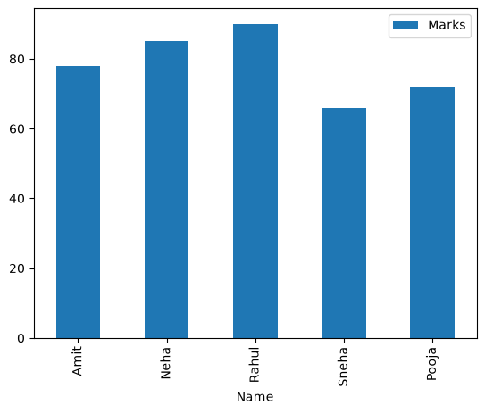
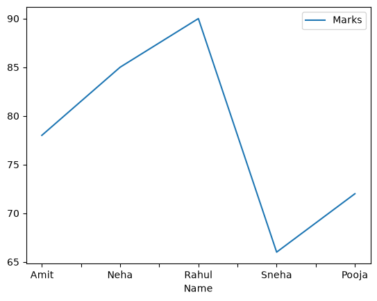
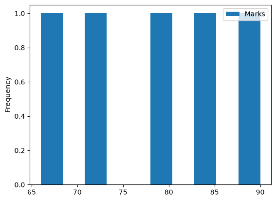
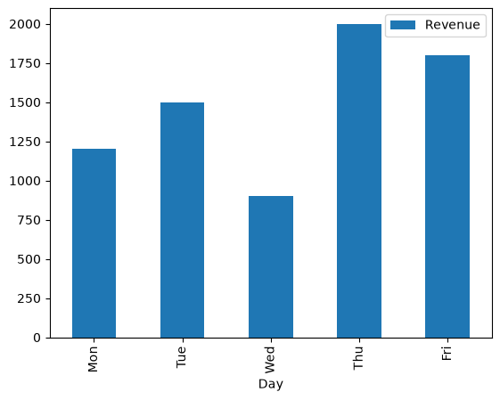

```python
# Task 1:pandas series basic 
```


```python
import pandas as pd
import matplotlib.pyplot as plt

marks=[78,85,90,66,72]
data=pd.DataFrame(marks)
print(data)
print(data.dtypes)
print(data.head(1))
print(data.tail(2))
```

    Matplotlib is building the font cache; this may take a moment.


        0
    0  78
    1  85
    2  90
    3  66
    4  72
    0    int64
    dtype: object
        0
    0  78
        0
    3  66
    4  72


# Task 2:maths operations


```python
print(data.add(5)) # add 
print(data.subtract(2)) # subtract
print(data.multiply(1.05)) # multiply
print(data.divide(2)) # divide
```

        0
    0  83
    1  90
    2  95
    3  71
    4  77
        0
    0  76
    1  83
    2  88
    3  64
    4  70
           0
    0  81.90
    1  89.25
    2  94.50
    3  69.30
    4  75.60
          0
    0  39.0
    1  42.5
    2  45.0
    3  33.0
    4  36.0


# Task 3: python functionalities


```python
print(data.max()) # max marks
print(data.min()) # min marks
print(data.sum()) # sum marks
print(data.mean()) # mean marks
pass_marks = list(filter(lambda x: x >= 70, marks))
print(pass_marks)
print(len(pass_marks))
```

    0    90
    dtype: int64
    0    66
    dtype: int64
    0    391
    dtype: int64
    0    78.2
    dtype: float64
    [78, 85, 90, 72]
    4


## Task 4:Create a DataFrame


```python
student={
    'Name':['Amit','Neha','Rahul','Sneha','Pooja'],
    'Marks':[78,85,90,66,72],
    'Subject':['Maths','Maths','Science','Science','Maths']
}
data_student=pd.DataFrame(student)
print(data_student)
print(data_student.head(3)) # first 3 row
print(data_student.tail(2)) # last 3 row
print(data_student.columns) # columns name
print(data_student.shape) # shape (5, 3)
```

        Name  Marks  Subject
    0   Amit     78    Maths
    1   Neha     85    Maths
    2  Rahul     90  Science
    3  Sneha     66  Science
    4  Pooja     72    Maths
        Name  Marks  Subject
    0   Amit     78    Maths
    1   Neha     85    Maths
    2  Rahul     90  Science
        Name  Marks  Subject
    3  Sneha     66  Science
    4  Pooja     72    Maths
    Index(['Name', 'Marks', 'Subject'], dtype='str')
    (5, 3)


## Task 5: Important DataFram functions


```python
print(data_student.info())  # info()
print(data_student.describe())  # describe()
print(data_student.head())  # head()
print(data_student.tail())  # tail()
print(data_student.sort_values(by='Marks',ascending=True))  # sort by Marks()
print(data_student.sort_index())
```

    <class 'pandas.DataFrame'>
    RangeIndex: 5 entries, 0 to 4
    Data columns (total 3 columns):
     #   Column   Non-Null Count  Dtype
    ---  ------   --------------  -----
     0   Name     5 non-null      str  
     1   Marks    5 non-null      int64
     2   Subject  5 non-null      str  
    dtypes: int64(1), str(2)
    memory usage: 304.0 bytes
    None
               Marks
    count   5.000000
    mean   78.200000
    std     9.654015
    min    66.000000
    25%    72.000000
    50%    78.000000
    75%    85.000000
    max    90.000000
        Name  Marks  Subject
    0   Amit     78    Maths
    1   Neha     85    Maths
    2  Rahul     90  Science
    3  Sneha     66  Science
    4  Pooja     72    Maths
        Name  Marks  Subject
    0   Amit     78    Maths
    1   Neha     85    Maths
    2  Rahul     90  Science
    3  Sneha     66  Science
    4  Pooja     72    Maths
        Name  Marks  Subject
    3  Sneha     66  Science
    4  Pooja     72    Maths
    0   Amit     78    Maths
    1   Neha     85    Maths
    2  Rahul     90  Science
        Name  Marks  Subject
    0   Amit     78    Maths
    1   Neha     85    Maths
    2  Rahul     90  Science
    3  Sneha     66  Science
    4  Pooja     72    Maths


## Task : 6 Filtering & conditional Selection


```python
more_75=data_student[data_student['Marks'] > 75]
print(more_75)

maths=data_student[data_student['Subject'] =='Maths']
print(maths)

median_marks = data_student['Marks'].median()
more_than_median = data_student[data_student['Marks'] > median_marks]
print(more_than_median)

failed=data_student[data_student['Marks'] < 70]
print(failed)
```

        Name  Marks  Subject
    0   Amit     78    Maths
    1   Neha     85    Maths
    2  Rahul     90  Science
        Name  Marks Subject
    0   Amit     78   Maths
    1   Neha     85   Maths
    4  Pooja     72   Maths
        Name  Marks  Subject
    1   Neha     85    Maths
    2  Rahul     90  Science
        Name  Marks  Subject
    3  Sneha     66  Science


## Task 7: grouping & basic analysis


```python
avg_marks = data_student.groupby('Subject')['Marks'].mean()
print(avg_marks)

count_marks = data_student.groupby('Subject')['Marks'].count()
print(count_marks)
max_marks = data_student.groupby('Subject')['Marks'].max()
print(max_marks)
```

    Subject
    Maths      78.333333
    Science    78.000000
    Name: Marks, dtype: float64
    Subject
    Maths      3
    Science    2
    Name: Marks, dtype: int64
    Subject
    Maths      85
    Science    90
    Name: Marks, dtype: int64


## Task 8:pandas plotting


```python
data_student.plot(x='Name',
    y=['Marks'],
    kind='bar')
plt.show()
```


    

    


```python
data_student.plot(
    x='Name',
    y='Marks',
    kind='line'
)

plt.show()
```


    

    


```python
data_student.plot(
    x='Name',
    y='Marks',
    kind='hist'
)

plt.show()
```


    

    


## Task 9:Mini use cases:Sales data analysis


```python
sales={
    'Day':['Mon','Tue','Wed','Thu','Fri'],
    'Revenue':[1200,1500,900,2000,1800]
}
sales=pd.DataFrame(sales)
sales.info()
sales.head()
sales.describe()

print(sales['Revenue'].sum()) # sum of revenue
avg=sales['Revenue'].mean()
print(avg) # average
print(sales['Revenue'].max()) # highest 

morethenavg=sales[sales['Revenue']> avg]
print(morethenavg)

```

    <class 'pandas.DataFrame'>
    RangeIndex: 5 entries, 0 to 4
    Data columns (total 2 columns):
     #   Column   Non-Null Count  Dtype
    ---  ------   --------------  -----
     0   Day      5 non-null      str  
     1   Revenue  5 non-null      int64
    dtypes: int64(1), str(1)
    memory usage: 227.0 bytes
    7400
    1480.0
    2000
       Day  Revenue
    1  Tue     1500
    3  Thu     2000
    4  Fri     1800


```python
sales.plot(x='Day',y='Revenue',kind='bar')
plt.show()
```


    

    

