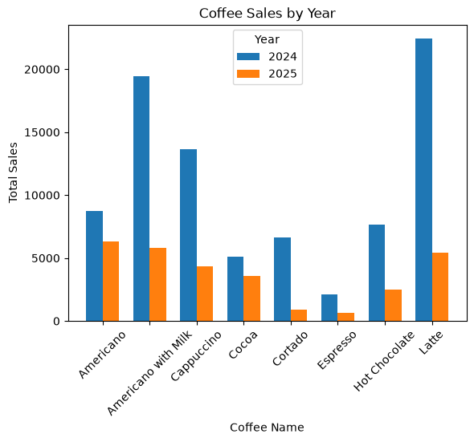
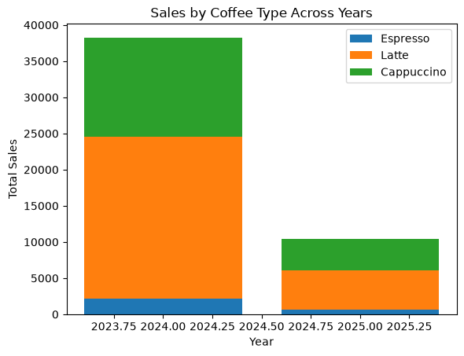

## Task 1:Line plot


```python
import pandas as pd
import matplotlib.pyplot as plt
import numpy as np
```


```python
sales = pd.read_csv('sales.csv')

sales['date'] = pd.to_datetime(sales['date'])
sales['month'] = sales['date'].dt.strftime('%b')

monthly_sales = sales.groupby('month')['money'].sum()

plt.figure(figsize=(8, 5))
plt.plot(
    monthly_sales.index,
    monthly_sales.values,
    marker='o'
)

plt.title('Sales Trend Over Months')
plt.xlabel('Month')
plt.ylabel('Total Sales')
plt.grid(True)

plt.show()
```


    

    


## Task 2:Scatter plot()


```python
coffee_sales = sales.groupby('coffee_name')['money'].sum()

plt.figure(figsize=(8,5))

plt.scatter(
    coffee_sales.index,
    coffee_sales.values
)  # scatter chart

plt.title('Total Sales by Coffee Type')
plt.xlabel('Coffee Name')
plt.ylabel('Total Sales')
plt.xticks(rotation=90)

plt.show()
```


    

    


## Task 3:bar plot()


```python
plt.figure(figsize=(10, 10))
plt.bar(
    coffee_sales.index,
    coffee_sales.values
)

plt.title('Sales by Coffee Type')
plt.xlabel('Coffee Name')
plt.ylabel('Money')
plt.xticks(rotation=45)

plt.show()
```


    

    


```python
plt.figure(figsize=(10,5))

plt.barh(
    coffee_sales.index,
    coffee_sales.values
)
# horizontal bar chart
plt.title('Sales by Coffee Type')
plt.xlabel('Money')
plt.ylabel('Coffee Name')

plt.show()
```


    

    


## Task 4: Multiple Bar plot()


```python
x = np.arange(len(yearly_sales.index))
width = 0.35

plt.bar(
    x - width/2,
    yearly_sales[2024],
    width,
    label='2024'
)

plt.bar(
    x + width/2,
    yearly_sales[2025],
    width,
    label='2025'
)

plt.title('Coffee Sales by Year')
plt.xlabel('Coffee Name')
plt.ylabel('Total Sales')
plt.xticks(x, yearly_sales.index, rotation=45)
plt.legend(title='Year')

plt.show()
```


    

    


## Task 5:Stacked bar chart()


```python
plt.bar(
    stacked_data.index,
    stacked_data['Espresso'],
    label='Espresso'
)

plt.bar(
    stacked_data.index,
    stacked_data['Latte'],
    bottom=stacked_data['Espresso'],
    label='Latte'
)

plt.bar(
    stacked_data.index,
    stacked_data['Cappuccino'],
    bottom=stacked_data['Espresso'] + stacked_data['Latte'],
    label='Cappuccino'
)

plt.title('Sales by Coffee Type Across Years')
plt.xlabel('Year')
plt.ylabel('Total Sales')
plt.legend()
plt.show()
```


    

    


## Task 6 : Histogram 


```python
plt.hist(sales['money'], bins=10)
print(sales.head())
plt.title('Distribution of Sales Amount')
plt.xlabel('Amount')
plt.ylabel('Frequency')

plt.show()
```

            date                 datetime cash_type                 card  money  \
    0 2024-03-01  2024-03-01 10:15:50.520      card  ANON-0000-0000-0001   38.7   
    1 2024-03-01  2024-03-01 12:19:22.539      card  ANON-0000-0000-0002   38.7   
    2 2024-03-01  2024-03-01 12:20:18.089      card  ANON-0000-0000-0002   38.7   
    3 2024-03-01  2024-03-01 13:46:33.006      card  ANON-0000-0000-0003   28.9   
    4 2024-03-01  2024-03-01 13:48:14.626      card  ANON-0000-0000-0004   38.7   
    
         coffee_name month  year  
    0          Latte   Mar  2024  
    1  Hot Chocolate   Mar  2024  
    2  Hot Chocolate   Mar  2024  
    3      Americano   Mar  2024  
    4          Latte   Mar  2024  


    

    


## Task 7:Pie chart


```python
coffee_sales = sales.groupby('coffee_name')['money'].sum()

plt.figure(figsize=(8, 8))

plt.pie(
    coffee_sales.values,
    labels=coffee_sales.index,
    autopct='%1.1f%%'
)

plt.title('Revenue Share by Coffee Type')

plt.show()
```


    

    


## How to Run

1. Install Python 3.x and Jupyter Notebook.

2. Install required libraries:
   pip install pandas matplotlib

3. Place the dataset file (sales.csv) in the same directory as the notebook.

4. Start Jupyter Notebook:
   jupyter notebook

5. Open assignment-11.ipynb.

6. Run all cells from top to bottom using:
   Cell → Run All

7. The charts and outputs will be displayed within the notebook.
