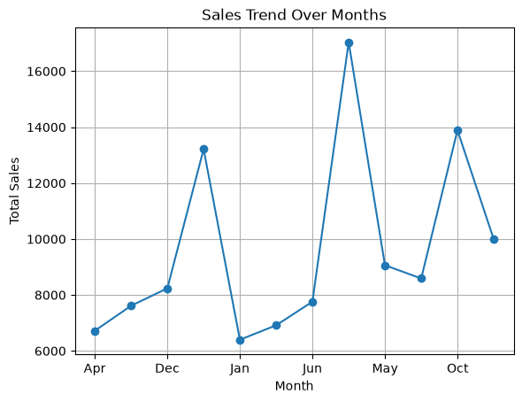
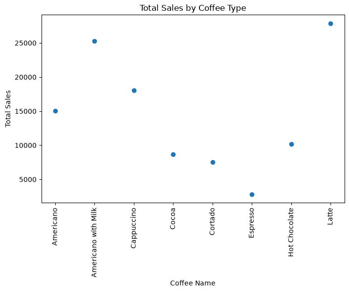
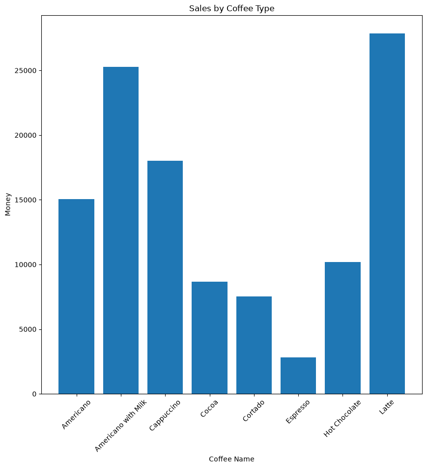
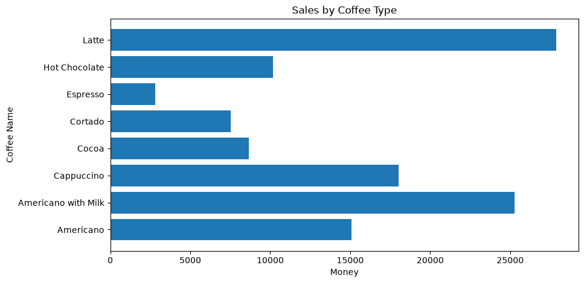
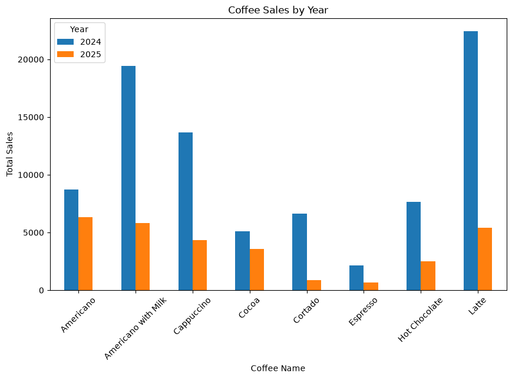
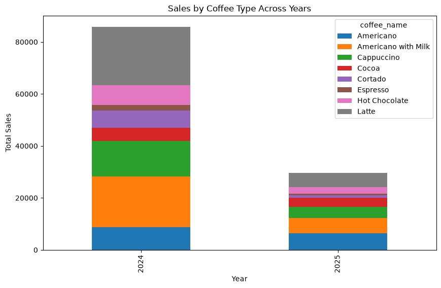
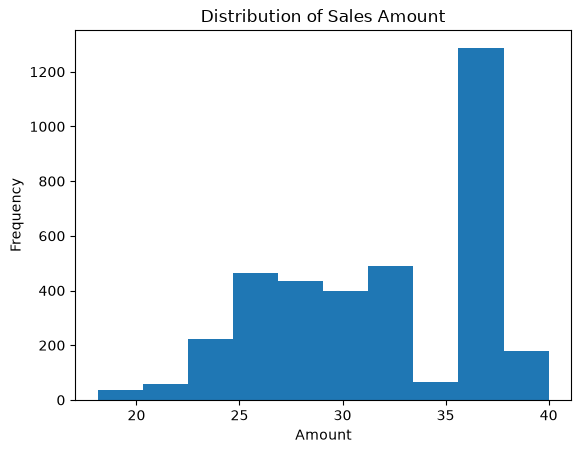
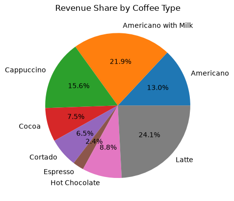

## Task 1:Line plot


```python
import pandas as pd
import matplotlib.pyplot as plt
```


```python
sales = pd.read_csv('sales.csv')

# Convert date column to datetime
sales['date'] = pd.to_datetime(sales['date'])

# Extract month name
sales['month'] = sales['date'].dt.strftime('%b')

# Calculate total sales per month
monthly_sales = sales.groupby('month')['money'].sum()

# Line Plot
monthly_sales.plot(kind='line', marker='o')

plt.title('Sales Trend Over Months')
plt.xlabel('Month')
plt.ylabel('Total Sales')
plt.grid(True)
plt.show()
```


    

    


## Task 2:Scatter plot()


```python
coffee_sales = sales.groupby('coffee_name')['money'].sum()

plt.figure(figsize=(8,5))

plt.scatter(
    coffee_sales.index,
    coffee_sales.values
)  # scatter chart

plt.title('Total Sales by Coffee Type')
plt.xlabel('Coffee Name')
plt.ylabel('Total Sales')
plt.xticks(rotation=90)

plt.show()
```


    

    


## Task 3:bar plot()


```python
coffee_sales = sales.groupby('coffee_name')['money'].sum()

coffee_sales.plot(kind='bar')   # vertical bar chart
plt.title('Sales  Coffee Type')
plt.xlabel('Coffee Name')
plt.ylabel('Money')
plt.show()
```


    

    


```python
plt.figure(figsize=(10,5))

plt.barh(
    coffee_sales.index,
    coffee_sales.values
)
# horizontal bar chart
plt.title('Sales by Coffee Type')
plt.xlabel('Money')
plt.ylabel('Coffee Name')

plt.show()
```


    

    


## Task 4: Multiple Bar plot()


```python
sales['date'] = pd.to_datetime(sales['date'])

# Extract year
sales['year'] = sales['date'].dt.year
print(sales.head())
# Create pivot table
yearly_sales = sales.pivot_table(
    index='coffee_name',
    columns='year',
    values='money',
    aggfunc='sum'
)

# Multi-bar chart
yearly_sales.plot(
    kind='bar',
    figsize=(10, 6)
)

plt.title('Coffee Sales by Year')
plt.xlabel('Coffee Name')
plt.ylabel('Total Sales')
plt.xticks(rotation=45)
plt.legend(title='Year')
plt.show()
```

            date                 datetime cash_type                 card  money  \
    0 2024-03-01  2024-03-01 10:15:50.520      card  ANON-0000-0000-0001   38.7   
    1 2024-03-01  2024-03-01 12:19:22.539      card  ANON-0000-0000-0002   38.7   
    2 2024-03-01  2024-03-01 12:20:18.089      card  ANON-0000-0000-0002   38.7   
    3 2024-03-01  2024-03-01 13:46:33.006      card  ANON-0000-0000-0003   28.9   
    4 2024-03-01  2024-03-01 13:48:14.626      card  ANON-0000-0000-0004   38.7   
    
         coffee_name month  year  
    0          Latte   Mar  2024  
    1  Hot Chocolate   Mar  2024  
    2  Hot Chocolate   Mar  2024  
    3      Americano   Mar  2024  
    4          Latte   Mar  2024  


    

    


## Task 5:Stacked bar chart()


```python
stacked_data = sales.pivot_table(
    index='year',
    columns='coffee_name',
    values='money',
    aggfunc='sum',
    fill_value=0
)

print(stacked_data.head())

stacked_data.plot(
    kind='bar',
    stacked=True,
    figsize=(10, 6)
)

plt.title('Sales by Coffee Type Across Years')
plt.xlabel('Year')
plt.ylabel('Total Sales')
plt.show()
```

    coffee_name  Americano  Americano with Milk  Cappuccino    Cocoa  Cortado  \
    year                                                                        
    2024           8728.02             19436.58    13671.42  5102.16  6652.22   
    2025           6334.24              5832.54     4362.72  3576.00   882.64   
    
    coffee_name  Espresso  Hot Chocolate     Latte  
    year                                            
    2024          2140.36        7669.26  22430.78  
    2025           673.92        2503.20   5435.52  


    

    


## Task 6 : Histogram 


```python
plt.hist(sales['money'], bins=10)
print(sales.head())
plt.title('Distribution of Sales Amount')
plt.xlabel('Amount')
plt.ylabel('Frequency')

plt.show()
```

            date                 datetime cash_type                 card  money  \
    0 2024-03-01  2024-03-01 10:15:50.520      card  ANON-0000-0000-0001   38.7   
    1 2024-03-01  2024-03-01 12:19:22.539      card  ANON-0000-0000-0002   38.7   
    2 2024-03-01  2024-03-01 12:20:18.089      card  ANON-0000-0000-0002   38.7   
    3 2024-03-01  2024-03-01 13:46:33.006      card  ANON-0000-0000-0003   28.9   
    4 2024-03-01  2024-03-01 13:48:14.626      card  ANON-0000-0000-0004   38.7   
    
         coffee_name month  year  
    0          Latte   Mar  2024  
    1  Hot Chocolate   Mar  2024  
    2  Hot Chocolate   Mar  2024  
    3      Americano   Mar  2024  
    4          Latte   Mar  2024  


    

    


## Task 7:Pie chart


```python
coffee_sales = sales.groupby('coffee_name')['money'].sum()

coffee_sales.plot(
    kind='pie',
    autopct='%1.1f%%',
    
)

plt.title('Revenue Share by Coffee Type')
plt.show()
```


    

    


## How to Run

1. Install Python 3.x and Jupyter Notebook.

2. Install required libraries:
   pip install pandas matplotlib

3. Place the dataset file (sales.csv) in the same directory as the notebook.

4. Start Jupyter Notebook:
   jupyter notebook

5. Open assignment-11.ipynb.

6. Run all cells from top to bottom using:
   Cell → Run All

7. The charts and outputs will be displayed within the notebook.
